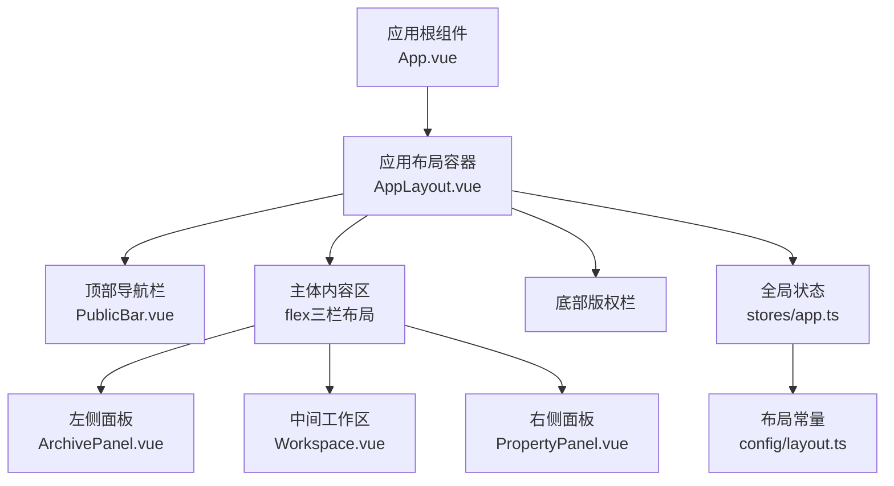
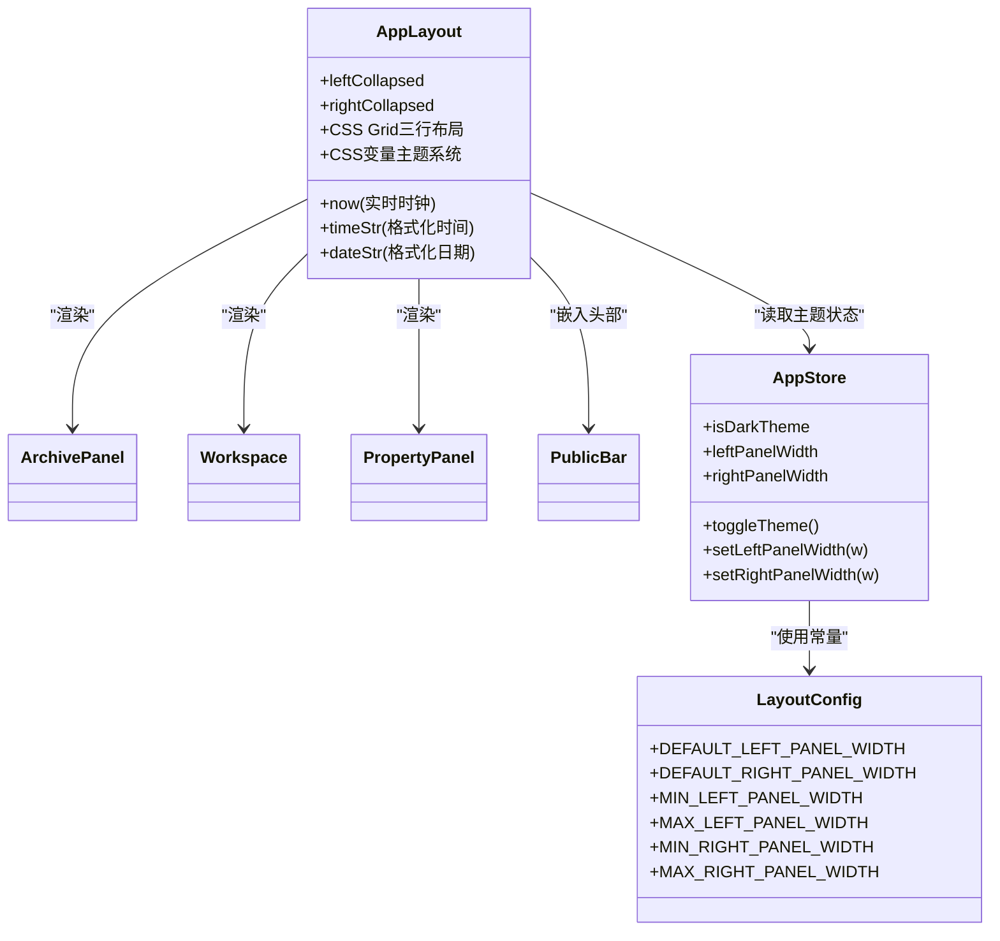
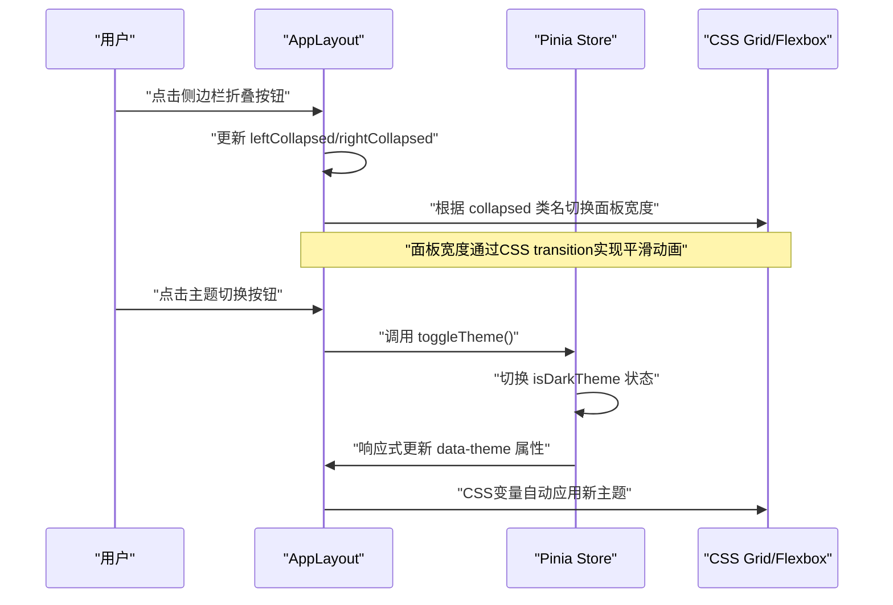
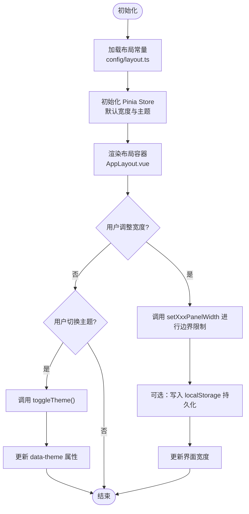
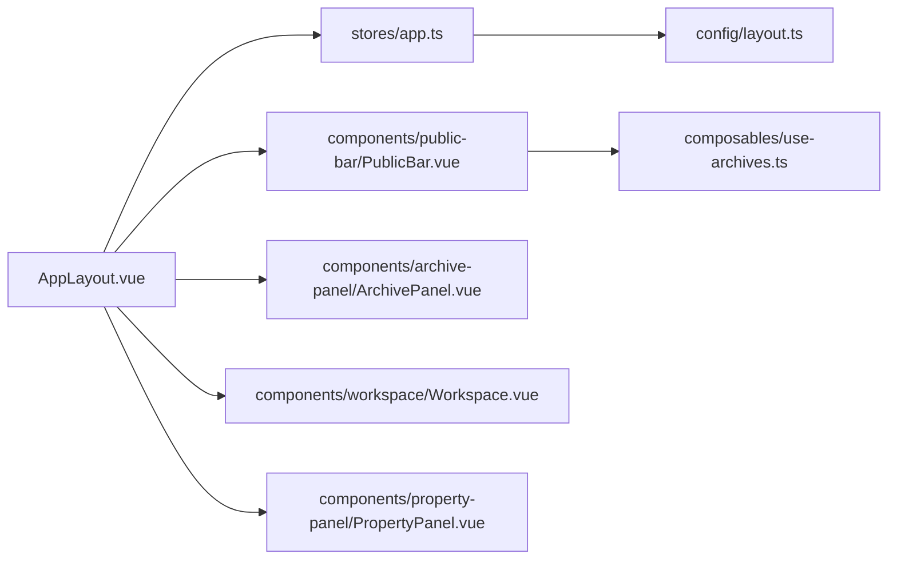

# 布局系统

<cite>
**本文引用的文件**   
- [AppLayout.vue](file://src/layout/AppLayout.vue)
- [app.ts](file://src/stores/app.ts)
- [layout.ts](file://src/config/layout.ts)
- [index.ts](file://src/config/index.ts)
- [PublicBar.vue](file://src/components/public-bar/PublicBar.vue)
- [ArchivePanel.vue](file://src/components/archive-panel/ArchivePanel.vue)
- [Workspace.vue](file://src/components/workspace/Workspace.vue)
- [PropertyPanel.vue](file://src/components/property-panel/PropertyPanel.vue)
- [App.vue](file://src/App.vue)
- [theme.ts](file://src/styles/theme.ts)
</cite>

## 更新摘要
**变更内容**   
- AppLayout.vue从Naive UI的NLayout架构完全重写为自定义CSS Grid和Flexbox实现
- 新增三行网格布局（52px头部、灵活中间内容区、28px页脚）
- 实现自定义头部组件，包含实时时钟和主题切换功能
- 增强主题支持，使用CSS变量实现深色/浅色模式切换
- 优化性能，移除第三方布局库依赖，提升渲染效率

## 目录
1. [简介](#简介)
2. [项目结构](#项目结构)
3. [核心组件](#核心组件)
4. [架构总览](#架构总览)
5. [详细组件分析](#详细组件分析)
6. [依赖关系分析](#依赖关系分析)
7. [性能考虑](#性能考虑)
8. [故障排查指南](#故障排查指南)
9. [结论](#结论)
10. [附录](#附录)

## 简介
本文件面向 Hello-Tauri 的全新布局系统，系统性阐述其基于CSS Grid和Flexbox的现代化设计理念、组件组织与数据流。重点包括：
- 左侧文件面板（归档与资源管理）、中间工作区（标签页与预览）、右侧属性面板（元数据与配置）的职责划分与协作方式。
- 自定义三行网格布局架构，包含固定高度头部、灵活内容区和底部版权栏。
- 响应式折叠面板机制与状态管理，以及面板宽度的持久化策略建议。
- 自定义布局配置方法：面板尺寸调整、布局模式切换与响应式适配策略。
- 布局性能优化技巧与浏览器兼容性说明。

## 项目结构
布局系统由顶层应用外壳、三行网格布局、三个主要面板与全局状态构成，采用"容器 + 子面板 + 全局状态"的分层组织方式：
- 顶层应用外壳负责整体框架与主题控制。
- 三行网格布局提供固定的头部、灵活的内容区和底部信息栏。
- 三个面板各自承载业务内容，并通过滚动条与内部布局保证可伸缩性。
- 全局状态集中管理主题、插件开关与面板宽度等跨组件共享数据。

**图表来源**
- [App.vue:1-24](file://src/App.vue#L1-L24)
- [AppLayout.vue:1-432](file://src/layout/AppLayout.vue#L1-L432)
- [ArchivePanel.vue:1-24](file://src/components/archive-panel/ArchivePanel.vue#L1-L24)
- [Workspace.vue:1-53](file://src/components/workspace/Workspace.vue#L1-L53)
- [PropertyPanel.vue:1-17](file://src/components/property-panel/PropertyPanel.vue#L1-L17)
- [app.ts:1-57](file://src/stores/app.ts#L1-L57)
- [layout.ts:1-9](file://src/config/layout.ts#L1-L9)

**章节来源**
- [App.vue:1-24](file://src/App.vue#L1-L24)
- [AppLayout.vue:1-432](file://src/layout/AppLayout.vue#L1-L432)
- [ArchivePanel.vue:1-24](file://src/components/archive-panel/ArchivePanel.vue#L1-L24)
- [Workspace.vue:1-53](file://src/components/workspace/Workspace.vue#L1-L53)
- [PropertyPanel.vue:1-17](file://src/components/property-panel/PropertyPanel.vue#L1-L17)
- [app.ts:1-57](file://src/stores/app.ts#L1-L57)
- [layout.ts:1-9](file://src/config/layout.ts#L1-L9)

## 核心组件
- 应用布局容器（AppLayout）
  - 使用CSS Grid实现三行布局：52px固定头部、1fr灵活内容区、28px固定页脚。
  - 通过data-theme属性动态切换深色/浅色主题，使用CSS变量统一管理样式。
  - 自定义折叠按钮实现左右面板的展开/收起功能，带平滑过渡动画。
  - 集成实时时钟显示和主题切换按钮，提升用户体验。
- 左侧面板（ArchivePanel）
  - 提供上传区域与归档卡片列表，内部使用滚动条以适配不同高度。
  - 默认宽度280px，支持完全收起时宽度为0。
- 中间工作区（Workspace）
  - 包含标签栏、预览工具栏、预览内容与状态栏，按列方向排列。
  - 使用flex: 1自适应剩余空间，确保内容区域充分利用可用空间。
- 右侧面板（PropertyPanel）
  - 展示元数据视图、配置表单与路径面包屑，统一在滚动容器中呈现。
  - 默认宽度300px，支持完全收起时宽度为0。
- 全局状态（Pinia store）
  - 维护左右面板宽度、主题与插件禁用列表，并提供带边界校验的设置方法。
- 布局常量（config/layout.ts）
  - 定义默认与最小/最大面板宽度，供 store 初始化与校验使用。

**章节来源**
- [AppLayout.vue:1-432](file://src/layout/AppLayout.vue#L1-L432)
- [ArchivePanel.vue:1-24](file://src/components/archive-panel/ArchivePanel.vue#L1-L24)
- [Workspace.vue:1-53](file://src/components/workspace/Workspace.vue#L1-L53)
- [PropertyPanel.vue:1-17](file://src/components/property-panel/PropertyPanel.vue#L1-L17)
- [app.ts:1-57](file://src/stores/app.ts#L1-L57)
- [layout.ts:1-9](file://src/config/layout.ts#L1-L9)

## 架构总览
下图展示了新的CSS Grid布局架构与三个面板之间的组合关系，以及与全局状态和配置常量的依赖关系。

**图表来源**
- [AppLayout.vue:1-432](file://src/layout/AppLayout.vue#L1-L432)
- [app.ts:1-57](file://src/stores/app.ts#L1-L57)
- [layout.ts:1-9](file://src/config/layout.ts#L1-L9)

## 详细组件分析

### 三行网格布局容器（AppLayout）
- 设计要点
  - 外层div.app-shell使用CSS Grid实现三行布局：grid-template-rows: 52px 1fr 28px。
  - 顶部header区域固定52px高度，包含Logo、标题、公共工具栏、时钟和主题切换按钮。
  - 中间body区域使用flex布局实现三栏结构，左右面板固定宽度，中间工作区自适应。
  - 底部footer区域固定28px高度，显示版权信息和产品描述。
  - 通过data-theme属性动态切换深色/浅色主题，使用CSS变量统一管理所有颜色值。
- 关键特性
  - CSS Grid三行布局：头部(52px)、内容区(1fr)、页脚(28px)。
  - Flexbox三栏布局：左面板(280px)、工作区(flex: 1)、右面板(300px)。
  - 自定义折叠按钮：悬停显示，点击切换面板展开/收起状态。
  - 实时时钟：每秒更新当前时间和日期显示。
  - 主题切换：支持深色/浅色模式，带平滑过渡动画。
- 交互流程
  - 用户点击折叠按钮时，更新对应的collapsed状态，触发面板宽度动画过渡。
  - 用户点击主题切换按钮时，调用store.toggleTheme()切换isDarkTheme状态。
  - 实时时钟每秒更新now.value，自动重新计算timeStr和dateStr。

**图表来源**
- [AppLayout.vue:1-432](file://src/layout/AppLayout.vue#L1-L432)
- [app.ts:1-57](file://src/stores/app.ts#L1-L57)

**章节来源**
- [AppLayout.vue:1-432](file://src/layout/AppLayout.vue#L1-L432)

### 自定义头部组件（PublicBar）
- 职责
  - 提供全局统计信息显示和搜索功能。
  - 集成批量操作下拉菜单，支持一键清空、全部导出、批量重新解压等操作。
  - 作为头部区域的中心内容，占据主要水平空间。
- 布局特点
  - 使用NSpace组件实现居中对齐和间距控制。
  - 响应式设计，在小屏幕下自动调整布局。
- 扩展点
  - 可添加更多全局工具和快捷操作入口。

**章节来源**
- [PublicBar.vue:1-33](file://src/components/public-bar/PublicBar.vue#L1-L33)

### 左侧面板（ArchivePanel）
- 职责
  - 提供归档文件的上传入口与列表展示。
  - 使用NScrollbar包裹内容，确保在不同窗口高度下均可滚动浏览。
- 布局特点
  - 外层容器使用flex纵向布局，上传区固定高度，列表区域自适应剩余空间。
  - 默认宽度280px，支持完全收起时宽度为0。
- 扩展点
  - 可在上传成功后联动工作区打开对应预览标签。

**章节来源**
- [ArchivePanel.vue:1-24](file://src/components/archive-panel/ArchivePanel.vue#L1-L24)

### 中间工作区（Workspace）
- 职责
  - 管理标签页、预览工具栏、预览内容与状态栏。
  - 根据当前活动标签的内容类型动态显示工具栏选项。
- 布局特点
  - 纵向flex布局，自上而下依次是标签栏、工具栏、预览区、状态栏。
  - 使用flex: 1自适应剩余空间，确保内容区域充分利用可用空间。
- 扩展点
  - 可接入SplitView进行双栏对比预览。

**章节来源**
- [Workspace.vue:1-53](file://src/components/workspace/Workspace.vue#L1-L53)

### 右侧面板（PropertyPanel）
- 职责
  - 展示选中对象的元数据、配置表单与路径导航。
- 布局特点
  - 统一在NScrollbar中滚动，避免溢出。
  - 默认宽度300px，支持完全收起时宽度为0。
- 扩展点
  - 可根据对象类型动态渲染不同的配置表单。

**章节来源**
- [PropertyPanel.vue:1-17](file://src/components/property-panel/PropertyPanel.vue#L1-L17)

### 全局状态与配置（Pinia Store + Layout Config）
- 状态字段
  - isDarkTheme：主题开关，控制深色/浅色模式切换。
  - leftPanelWidth、rightPanelWidth：左右面板宽度。
  - disabledPlugins：已禁用的插件 ID 列表。
- 方法
  - toggleTheme()：切换主题状态。
  - setLeftPanelWidth(w)、setRightPanelWidth(w)：对传入宽度进行最小/最大边界限制。
- 配置常量
  - DEFAULT_*、MIN_*、MAX_*：集中管理默认与边界值，便于统一修改。
- 同步机制
  - 当前布局容器直接读取 store 中的主题状态；如需持久化，可在 store 初始化时从 localStorage 恢复，并在变更时写入。

**图表来源**
- [app.ts:1-57](file://src/stores/app.ts#L1-L57)
- [layout.ts:1-9](file://src/config/layout.ts#L1-L9)
- [AppLayout.vue:1-432](file://src/layout/AppLayout.vue#L1-L432)

**章节来源**
- [app.ts:1-57](file://src/stores/app.ts#L1-L57)
- [layout.ts:1-9](file://src/config/layout.ts#L1-L9)

### 主题系统与CSS变量
- 设计要点
  - 使用CSS自定义属性（CSS变量）实现主题切换，避免重复样式定义。
  - 深色主题和浅色主题分别定义完整的颜色变量集合。
  - 通过data-theme属性动态切换主题，实现零JavaScript重绘。
- 主题变量
  - --bg-base：背景基础色
  - --bg-surface：表面背景色
  - --text-primary：主要文字颜色
  - --border：边框颜色
  - --primary：主色调
  - --scrollbar：滚动条颜色
- 扩展点
  - 可轻松添加更多主题变体，只需定义新的CSS变量集合。

**章节来源**
- [AppLayout.vue:120-150](file://src/layout/AppLayout.vue#L120-L150)

## 依赖关系分析
- 组件耦合
  - AppLayout 依赖 Pinia store 获取主题状态，属于单向数据流。
  - 各面板之间无直接依赖，通过工作区与全局事件/状态间接通信。
  - 头部组件PublicBar独立于布局系统，可复用性强。
- 外部依赖
  - Naive UI：提供基础 UI 组件（Button、Tooltip、Scrollbar等）。
  - Vue 3：提供响应式数据和组件生命周期管理。
- 潜在循环依赖
  - 当前布局模块间未见循环引用，保持清晰分层。

**图表来源**
- [AppLayout.vue:1-432](file://src/layout/AppLayout.vue#L1-L432)
- [app.ts:1-57](file://src/stores/app.ts#L1-L57)
- [layout.ts:1-9](file://src/config/layout.ts#L1-L9)
- [PublicBar.vue:1-33](file://src/components/public-bar/PublicBar.vue#L1-L33)

**章节来源**
- [AppLayout.vue:1-432](file://src/layout/AppLayout.vue#L1-L432)
- [app.ts:1-57](file://src/stores/app.ts#L1-L57)
- [layout.ts:1-9](file://src/config/layout.ts#L1-L9)

## 性能考虑
- 减少不必要的重渲染
  - 面板折叠状态使用Vue ref管理，仅在状态变化时触发局部更新。
  - 实时时钟使用setInterval定时器，注意组件卸载时清理定时器防止内存泄漏。
- CSS Grid和Flexbox优势
  - 原生CSS布局比第三方库更高效，无需额外JavaScript逻辑。
  - CSS变量主题切换无需DOM操作，利用浏览器原生CSS变量更新机制。
- 动画性能优化
  - 使用CSS transition实现平滑动画，GPU加速提升性能。
  - 折叠按钮使用opacity和transform属性，避免触发重排。
- 内存占用
  - 及时销毁大对象与取消未完成的异步任务，防止内存泄漏。
  - 组件卸载时清理定时器和事件监听器。

## 故障排查指南
- 面板折叠无效或未生效
  - 检查leftCollapsed/rightCollapsed状态是否正确绑定到面板的collapsed类名。
  - 确认CSS transition动画是否正常工作，检查相关CSS类是否存在。
- 主题切换不生效
  - 检查store.isDarkTheme状态是否正确更新。
  - 确认data-theme属性是否正确应用到app-shell元素上。
  - 验证CSS变量定义是否完整，特别是深色和浅色主题的变量集合。
- 实时时钟不更新
  - 检查setInterval定时器是否正确创建和清理。
  - 确认onMounted和onBeforeUnmount钩子是否正确执行。
- 内容溢出不可滚动
  - 确认面板内容容器是否设置了合适的高度与overflow行为。
  - 检查panel-inner-wrap的overflow-y: auto是否正确应用。
- 小屏体验不佳
  - 可参考usePanelLayout的断点策略，在小屏下自动隐藏右侧面板或切换为单栏模式。

**章节来源**
- [AppLayout.vue:1-432](file://src/layout/AppLayout.vue#L1-L432)
- [app.ts:1-57](file://src/stores/app.ts#L1-L57)

## 结论
Hello-Tauri 的新布局系统通过完全重写为CSS Grid和Flexbox实现，提供了更轻量、高性能的布局解决方案。新的三行网格布局架构（52px头部、灵活中间内容区、28px页脚）结合自定义头部组件和增强的主题支持，实现了现代化的用户体验。相比之前的Naive UI NLayout方案，新架构减少了第三方依赖，提升了渲染性能，同时保持了良好的可扩展性和可维护性。未来可在此基础上进一步增强响应式策略、持久化存储与更丰富的交互能力，以满足复杂业务场景下的多端适配需求。

## 附录

### CSS Grid布局配置速查
- grid-template-rows：定义三行布局，52px头部、1fr内容区、28px页脚。
- position: absolute + inset: 0：使布局容器铺满视口。
- display: flex：主体内容区使用flex布局实现三栏结构。
- flex-shrink: 0：防止面板被压缩，保持固定宽度。
- flex: 1：工作区自适应剩余空间。

**章节来源**
- [AppLayout.vue:155-163](file://src/layout/AppLayout.vue#L155-L163)
- [AppLayout.vue:282-286](file://src/layout/AppLayout.vue#L282-L286)

### 主题系统配置方法
- CSS变量定义：在.data-theme='dark'和.data-theme='light'下分别定义完整的变量集合。
- 主题切换：通过store.toggleTheme()方法切换isDarkTheme状态。
- 动态属性绑定：使用:data-theme="store.isDarkTheme ? 'dark' : 'light'"绑定主题属性。
- 扩展主题：只需添加新的CSS变量集合即可支持更多主题变体。

**章节来源**
- [AppLayout.vue:124-150](file://src/layout/AppLayout.vue#L124-L150)
- [app.ts:18-20](file://src/stores/app.ts#L18-L20)

### 自定义布局配置方法
- 面板尺寸调整
  - 在store中提供setLeftPanelWidth/setRightPanelWidth，并在布局容器中进行绑定。
  - 使用config/layout.ts中的常量统一控制默认与边界值。
- 布局模式切换
  - 在小屏设备下，可通过computed计算属性决定是否隐藏右侧面板，或切换为单栏模式。
- 响应式适配策略
  - 使用@media查询实现响应式布局，针对不同屏幕尺寸优化显示效果。
- 持久化存储与恢复
  - 在store初始化时从localStorage读取上次保存的面板宽度与折叠状态。
  - 在面板宽度或折叠状态变更时，将最新状态写入localStorage。

**章节来源**
- [app.ts:1-57](file://src/stores/app.ts#L1-L57)
- [layout.ts:1-9](file://src/config/layout.ts#L1-L9)

### 性能优化技巧
- 使用CSS Grid和Flexbox替代第三方布局库，减少JavaScript开销。
- 利用CSS变量实现主题切换，避免DOM操作和重绘。
- 使用CSS transition实现平滑动画，利用GPU加速提升性能。
- 及时清理定时器和事件监听器，防止内存泄漏。
- 合理使用overflow和scrollbar，避免不必要的重排重绘。