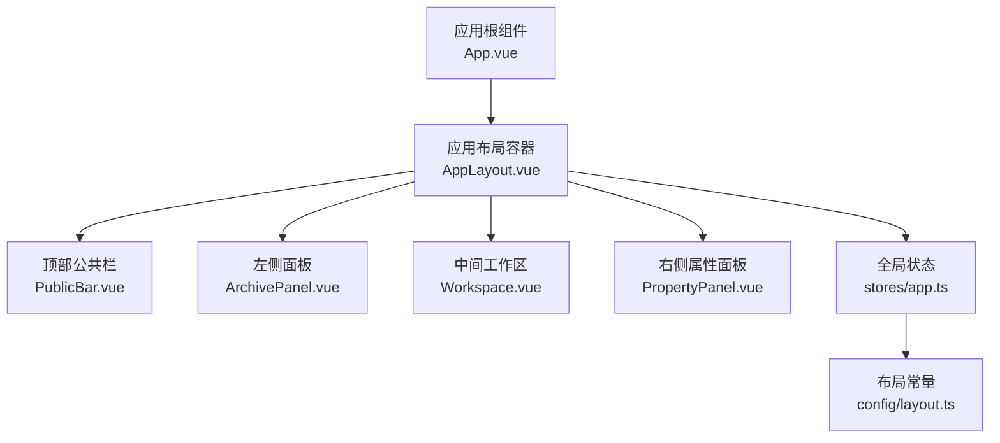
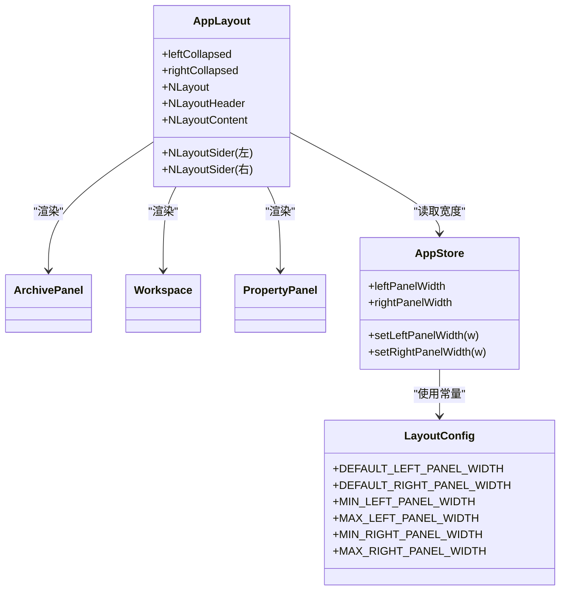
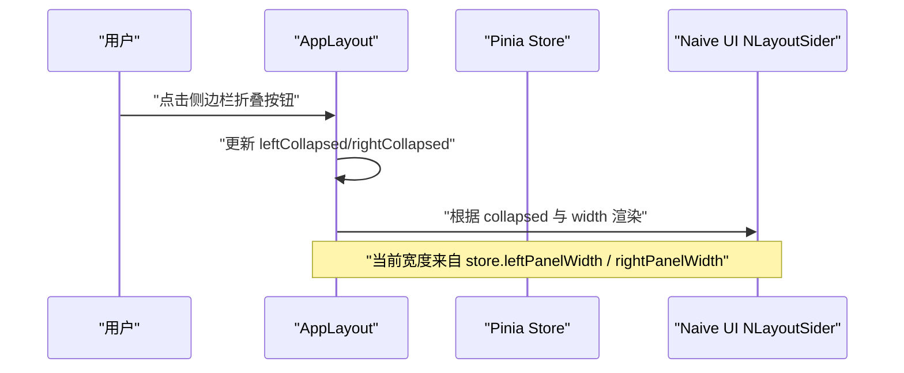
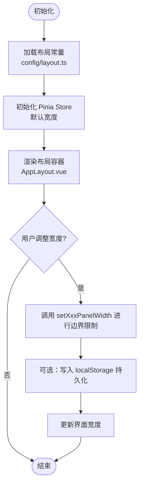
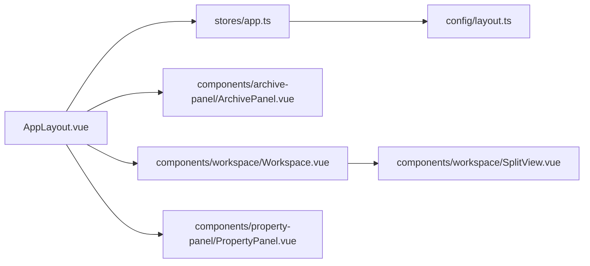

# 布局系统

<cite>
**本文引用的文件**   
- [AppLayout.vue](file://src/layout/AppLayout.vue)
- [app.ts](file://src/stores/app.ts)
- [layout.ts](file://src/config/layout.ts)
- [index.ts](file://src/config/index.ts)
- [use-panel-layout.ts](file://src/composables/use-panel-layout.ts)
- [ArchivePanel.vue](file://src/components/archive-panel/ArchivePanel.vue)
- [Workspace.vue](file://src/components/workspace/Workspace.vue)
- [PropertyPanel.vue](file://src/components/property-panel/PropertyPanel.vue)
- [SplitView.vue](file://src/components/workspace/SplitView.vue)
- [App.vue](file://src/App.vue)
- [theme.ts](file://src/styles/theme.ts)
</cite>

## 目录
1. [简介](#简介)
2. [项目结构](#项目结构)
3. [核心组件](#核心组件)
4. [架构总览](#架构总览)
5. [详细组件分析](#详细组件分析)
6. [依赖关系分析](#依赖关系分析)
7. [性能考虑](#性能考虑)
8. [故障排查指南](#故障排查指南)
9. [结论](#结论)
10. [附录](#附录)

## 简介
本文件面向 Hello-Tauri 的三栏式布局系统，系统性阐述其设计理念、组件组织与数据流。重点包括：
- 左侧文件面板（归档与资源管理）、中间工作区（标签页与预览）、右侧属性面板（元数据与配置）的职责划分与协作方式。
- NLayout 组件的配置项与行为，如响应式宽度调整、折叠状态管理与内容区域布局。
- 布局状态与 Pinia store 的同步机制，以及面板宽度的持久化策略建议。
- 自定义布局配置方法：面板尺寸调整、布局模式切换与响应式适配策略。
- 布局性能优化技巧与浏览器兼容性说明。

## 项目结构
布局系统由顶层布局容器、三个主要面板与全局状态构成，采用“容器 + 子面板 + 全局状态”的分层组织方式：
- 顶层布局容器负责整体框架与侧边栏控制。
- 三个面板各自承载业务内容，并通过滚动条与内部布局保证可伸缩性。
- 全局状态集中管理主题、插件开关与面板宽度等跨组件共享数据。

图表来源
- [App.vue:1-24](file://src/App.vue#L1-L24)
- [AppLayout.vue:1-54](file://src/layout/AppLayout.vue#L1-L54)
- [ArchivePanel.vue:1-24](file://src/components/archive-panel/ArchivePanel.vue#L1-L24)
- [Workspace.vue:1-36](file://src/components/workspace/Workspace.vue#L1-L36)
- [PropertyPanel.vue:1-15](file://src/components/property-panel/PropertyPanel.vue#L1-L15)
- [app.ts:1-57](file://src/stores/app.ts#L1-L57)
- [layout.ts:1-9](file://src/config/layout.ts#L1-L9)

章节来源
- [App.vue:1-24](file://src/App.vue#L1-L24)
- [AppLayout.vue:1-54](file://src/layout/AppLayout.vue#L1-L54)
- [ArchivePanel.vue:1-24](file://src/components/archive-panel/ArchivePanel.vue#L1-L24)
- [Workspace.vue:1-36](file://src/components/workspace/Workspace.vue#L1-L36)
- [PropertyPanel.vue:1-15](file://src/components/property-panel/PropertyPanel.vue#L1-L15)
- [app.ts:1-57](file://src/stores/app.ts#L1-L57)
- [layout.ts:1-9](file://src/config/layout.ts#L1-L9)

## 核心组件
- 应用布局容器（AppLayout）
  - 使用 Naive UI 的 NLayout/NLayoutHeader/NLayoutSider/NLayoutContent 构建三栏布局。
  - 通过 v-model:collapsed 绑定左右侧边栏的折叠状态；通过 :width 绑定面板宽度。
  - 顶部固定高度的头部区域用于放置全局工具栏。
- 左侧面板（ArchivePanel）
  - 提供上传区域与归档卡片列表，内部使用滚动条以适配不同高度。
- 中间工作区（Workspace）
  - 包含标签栏、预览工具栏、预览内容与状态栏，按列方向排列。
- 右侧属性面板（PropertyPanel）
  - 展示元数据视图、配置表单与路径面包屑，统一在滚动容器中呈现。
- 全局状态（Pinia store）
  - 维护左右面板宽度、主题与插件禁用列表，并提供带边界校验的设置方法。
- 布局常量（config/layout.ts）
  - 定义默认与最小/最大面板宽度，供 store 初始化与校验使用。

章节来源
- [AppLayout.vue:1-54](file://src/layout/AppLayout.vue#L1-L54)
- [ArchivePanel.vue:1-24](file://src/components/archive-panel/ArchivePanel.vue#L1-L24)
- [Workspace.vue:1-36](file://src/components/workspace/Workspace.vue#L1-L36)
- [PropertyPanel.vue:1-15](file://src/components/property-panel/PropertyPanel.vue#L1-L15)
- [app.ts:1-57](file://src/stores/app.ts#L1-L57)
- [layout.ts:1-9](file://src/config/layout.ts#L1-L9)

## 架构总览
下图展示了布局容器与三个面板之间的组合关系，以及与全局状态和配置常量的依赖关系。

图表来源
- [AppLayout.vue:1-54](file://src/layout/AppLayout.vue#L1-L54)
- [app.ts:1-57](file://src/stores/app.ts#L1-L57)
- [layout.ts:1-9](file://src/config/layout.ts#L1-L9)

## 详细组件分析

### 三栏式布局容器（AppLayout）
- 设计要点
  - 外层 NLayout 作为绝对定位容器，确保全屏覆盖。
  - 顶部 NLayoutHeader 固定高度，承载全局工具栏。
  - 内层 NLayout 包裹左右 Sider 与中间 Content，形成经典三栏布局。
  - 左右 Sider 使用 collapse-mode="width" 与 collapsed-width="0"，实现完全收起时不占位。
  - 通过 :width 绑定 store 中的面板宽度，使布局受全局状态驱动。
- 关键配置项
  - position="absolute"：使布局容器铺满视口。
  - has-sider：启用侧边栏模式。
  - bordered：为面板添加边框，提升视觉层次。
  - show-trigger="bar"：显示折叠触发条。
  - content-style：为面板内容设置内边距。
- 交互流程
  - 用户点击折叠触发条时，v-model:collapsed 更新本地 ref，从而改变侧边栏可见性。
  - 面板宽度由 store 提供，后续可扩展为拖拽更新后回写 store。

图表来源
- [AppLayout.vue:1-54](file://src/layout/AppLayout.vue#L1-L54)
- [app.ts:1-57](file://src/stores/app.ts#L1-L57)

章节来源
- [AppLayout.vue:1-54](file://src/layout/AppLayout.vue#L1-L54)

### 左侧面板（ArchivePanel）
- 职责
  - 提供归档文件的上传入口与列表展示。
  - 使用 NScrollbar 包裹内容，确保在不同窗口高度下均可滚动浏览。
- 布局特点
  - 外层容器使用 flex 纵向布局，上传区固定高度，列表区域自适应剩余空间。
- 扩展点
  - 可在上传成功后联动工作区打开对应预览标签。

章节来源
- [ArchivePanel.vue:1-24](file://src/components/archive-panel/ArchivePanel.vue#L1-L24)

### 中间工作区（Workspace）
- 职责
  - 管理标签页、预览工具栏、预览内容与状态栏。
  - 根据当前活动标签的内容类型动态显示工具栏选项。
- 布局特点
  - 纵向 flex 布局，自上而下依次是标签栏、工具栏、预览区、状态栏。
- 扩展点
  - 可接入 SplitView 进行双栏对比预览（见 SplitView 组件）。

章节来源
- [Workspace.vue:1-36](file://src/components/workspace/Workspace.vue#L1-L36)

### 右侧属性面板（PropertyPanel）
- 职责
  - 展示选中对象的元数据、配置表单与路径导航。
- 布局特点
  - 统一在 NScrollbar 中滚动，避免溢出。
- 扩展点
  - 可根据对象类型动态渲染不同的配置表单。

章节来源
- [PropertyPanel.vue:1-15](file://src/components/property-panel/PropertyPanel.vue#L1-L15)

### 全局状态与配置（Pinia Store + Layout Config）
- 状态字段
  - leftPanelWidth、rightPanelWidth：左右面板宽度。
  - isDarkTheme：主题开关。
  - disabledPlugins：已禁用的插件 ID 列表。
- 方法
  - setLeftPanelWidth(w)、setRightPanelWidth(w)：对传入宽度进行最小/最大边界限制。
- 配置常量
  - DEFAULT_*、MIN_*、MAX_*：集中管理默认与边界值，便于统一修改。
- 同步机制
  - 当前布局容器直接读取 store 中的宽度值；如需持久化，可在 store 初始化时从 localStorage 恢复，并在变更时写入。

图表来源
- [app.ts:1-57](file://src/stores/app.ts#L1-L57)
- [layout.ts:1-9](file://src/config/layout.ts#L1-L9)
- [AppLayout.vue:1-54](file://src/layout/AppLayout.vue#L1-L54)

章节来源
- [app.ts:1-57](file://src/stores/app.ts#L1-L57)
- [layout.ts:1-9](file://src/config/layout.ts#L1-L9)

### 响应式与断点（usePanelLayout）
- 功能
  - 基于 @vueuse/core 的 useBreakpoints 提供窄屏、标准屏、宽屏断点判断。
  - 暴露自动折叠右侧面板的计算属性，便于在小屏设备上隐藏右侧面板以提升可用性。
- 适用场景
  - 当需要在移动端或窄屏下简化界面时，可结合该 composable 控制面板显隐。
- 注意
  - 当前 AppLayout 未直接使用此 composable，但可作为响应式策略的参考实现。

章节来源
- [use-panel-layout.ts:1-38](file://src/composables/use-panel-layout.ts#L1-L38)

### 分栏预览（SplitView）
- 功能
  - 基于 splitpanes 实现左右分栏，支持最小尺寸约束。
- 用途
  - 可用于工作区内并排对比两个视图（例如原始与解析结果）。
- 集成建议
  - 在工作区中按需引入，并与标签页状态联动。

章节来源
- [SplitView.vue:1-15](file://src/components/workspace/SplitView.vue#L1-L15)

## 依赖关系分析
- 组件耦合
  - AppLayout 依赖 Pinia store 获取面板宽度，属于单向数据流。
  - 各面板之间无直接依赖，通过工作区与全局事件/状态间接通信。
- 外部依赖
  - Naive UI：提供布局与基础 UI 组件。
  - @vueuse/core：提供断点监听能力（在 usePanelLayout 中使用）。
  - splitpanes：提供分栏能力（在 SplitView 中使用）。
- 潜在循环依赖
  - 当前布局模块间未见循环引用，保持清晰分层。

图表来源
- [AppLayout.vue:1-54](file://src/layout/AppLayout.vue#L1-L54)
- [app.ts:1-57](file://src/stores/app.ts#L1-L57)
- [layout.ts:1-9](file://src/config/layout.ts#L1-L9)
- [ArchivePanel.vue:1-24](file://src/components/archive-panel/ArchivePanel.vue#L1-L24)
- [Workspace.vue:1-36](file://src/components/workspace/Workspace.vue#L1-L36)
- [PropertyPanel.vue:1-15](file://src/components/property-panel/PropertyPanel.vue#L1-L15)
- [SplitView.vue:1-15](file://src/components/workspace/SplitView.vue#L1-L15)

章节来源
- [AppLayout.vue:1-54](file://src/layout/AppLayout.vue#L1-L54)
- [app.ts:1-57](file://src/stores/app.ts#L1-L57)
- [layout.ts:1-9](file://src/config/layout.ts#L1-L9)

## 性能考虑
- 减少不必要的重渲染
  - 将面板宽度变更控制在必要的时机（如拖拽结束），避免高频更新导致频繁重绘。
- 虚拟滚动与懒加载
  - 左侧归档列表若数据量大，建议使用虚拟滚动或分页加载，降低首屏压力。
- 组件拆分与按需加载
  - 右侧属性面板可按对象类型动态导入，减少初始包体积。
- 样式与主题
  - 通过 themeOverrides 统一管理主题色与字体，避免在组件内重复定义样式。
- 浏览器兼容性
  - 使用现代 CSS（flex、position:absolute）与主流浏览器支持的 API；对于旧版 IE 需额外 polyfill 与降级方案。
- 内存占用
  - 及时销毁大对象与取消未完成的异步任务，防止内存泄漏。

[本节为通用指导，无需源码引用]

## 故障排查指南
- 面板宽度无效或未生效
  - 检查是否绑定了 store 中的宽度字段，且 setter 方法是否正确执行。
  - 确认最小/最大宽度常量是否合理，避免被 clamp 逻辑截断。
- 折叠按钮无响应
  - 检查 v-model:collapsed 是否绑定到正确的 ref，并确保没有冲突的样式遮挡触发条。
- 内容溢出不可滚动
  - 确认面板内容容器是否设置了合适的高度与 overflow 行为，必要时使用 NScrollbar。
- 小屏体验不佳
  - 可参考 usePanelLayout 的断点策略，在小屏下自动隐藏右侧面板或切换为单栏模式。

章节来源
- [AppLayout.vue:1-54](file://src/layout/AppLayout.vue#L1-L54)
- [app.ts:1-57](file://src/stores/app.ts#L1-L57)
- [use-panel-layout.ts:1-38](file://src/composables/use-panel-layout.ts#L1-L38)

## 结论
Hello-Tauri 的布局系统以简洁清晰的三栏结构为核心，借助 Naive UI 的布局组件与 Pinia 的全局状态管理，实现了良好的可扩展性与可维护性。通过集中化的布局常量与边界校验，保证了面板尺寸的稳定性与一致性。未来可在此基础上增强响应式策略、持久化存储与更丰富的交互能力，以满足复杂业务场景下的多端适配需求。

[本节为总结性内容，无需源码引用]

## 附录

### NLayout 常用配置项速查
- position：布局容器的定位方式，常用于全屏覆盖。
- has-sider：启用侧边栏模式。
- bordered：为面板添加边框。
- width：侧边栏宽度，通常绑定全局状态。
- collapsed-width：折叠后的宽度，设为 0 可实现完全收起。
- collapse-mode：折叠模式，width 表示通过宽度变化控制折叠。
- v-model:collapsed：双向绑定折叠状态。
- show-trigger：折叠触发器显示方式，bar 表示显示触发条。
- content-style：面板内容的内边距与样式。

章节来源
- [AppLayout.vue:1-54](file://src/layout/AppLayout.vue#L1-L54)

### 自定义布局配置方法
- 面板尺寸调整
  - 在 store 中提供 setLeftPanelWidth/setRightPanelWidth，并在布局容器中进行绑定。
  - 使用 config/layout.ts 中的常量统一控制默认与边界值。
- 布局模式切换
  - 在小屏设备下，可通过 computed 计算属性决定是否隐藏右侧面板，或切换为单栏模式。
- 响应式适配策略
  - 使用 @vueuse/core 的 useBreakpoints 监听断点，动态调整面板显隐与尺寸。
- 持久化存储与恢复
  - 在 store 初始化时从 localStorage 读取上次保存的面板宽度与折叠状态。
  - 在面板宽度或折叠状态变更时，将最新状态写入 localStorage。

章节来源
- [app.ts:1-57](file://src/stores/app.ts#L1-L57)
- [layout.ts:1-9](file://src/config/layout.ts#L1-L9)
- [use-panel-layout.ts:1-38](file://src/composables/use-panel-layout.ts#L1-L38)

### 主题与样式
- 通过 themeOverrides 统一设置主色、错误色、成功色、警告色与字体族。
- 在应用根组件中注入 NConfigProvider，使主题全局生效。

章节来源
- [App.vue:1-24](file://src/App.vue#L1-L24)
- [theme.ts:1-13](file://src/styles/theme.ts#L1-L13)