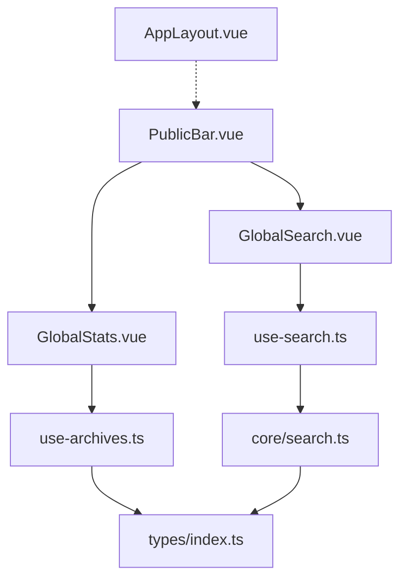
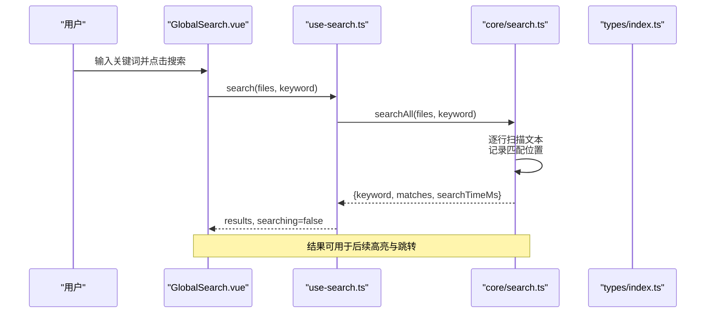
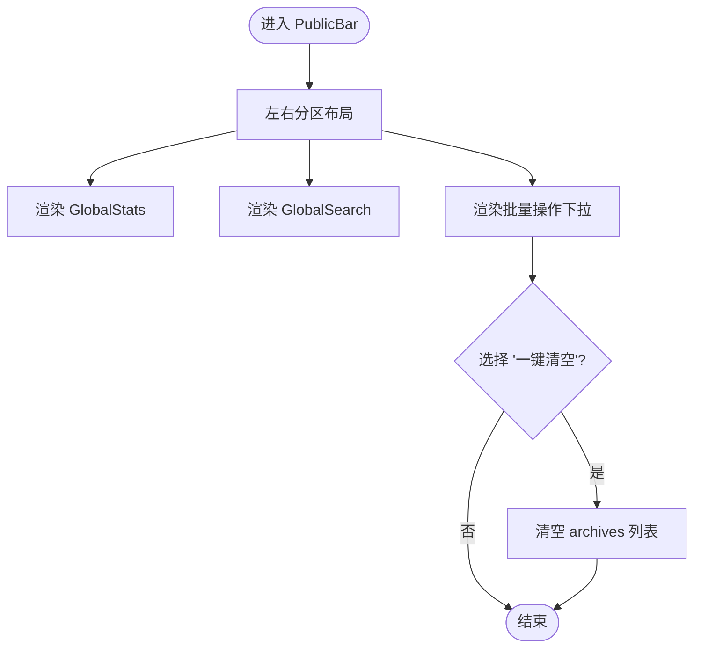
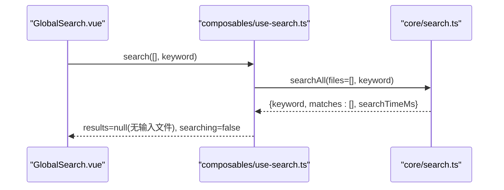
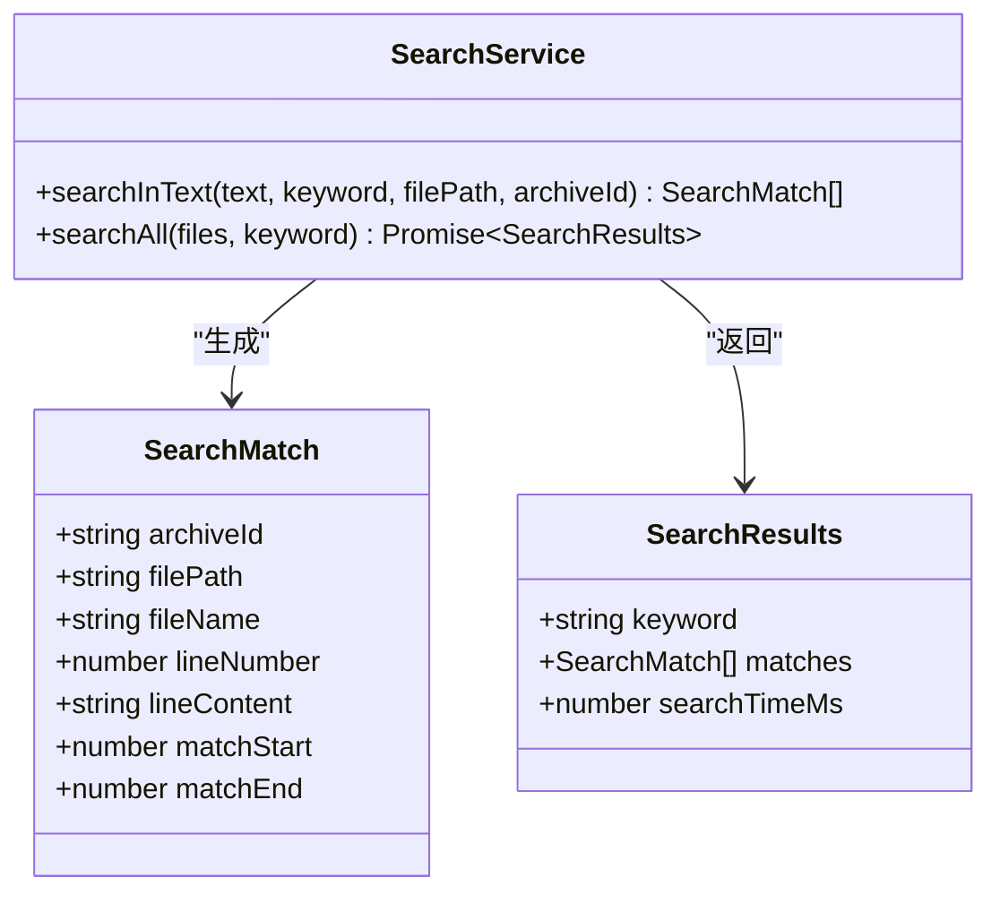
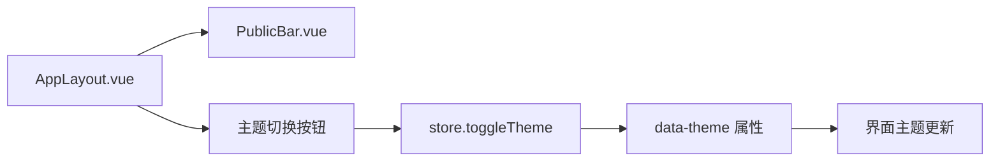
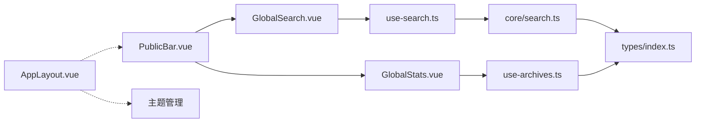

# 公共栏组件

<cite>
**本文引用的文件列表**
- [PublicBar.vue](file://src/components/public-bar/PublicBar.vue)
- [GlobalSearch.vue](file://src/components/public-bar/GlobalSearch.vue)
- [GlobalStats.vue](file://src/components/public-bar/GlobalStats.vue)
- [use-search.ts](file://src/composables/use-search.ts)
- [search.ts](file://src/core/search.ts)
- [use-archives.ts](file://src/composables/use-archives.ts)
- [index.ts（类型定义）](file://src/types/index.ts)
- [use-decompress.ts](file://src/composables/use-decompress.ts)
- [AppLayout.vue](file://src/layout/AppLayout.vue)
</cite>

## 更新摘要
**变更内容**   
- 移除了主题切换按钮功能，该功能已迁移到 AppLayout 头部组件中
- 简化了 PublicBar 的职责，专注于统计信息展示和全局搜索功能
- 更新了组件职责划分和架构说明

## 目录
1. [简介](#简介)
2. [项目结构](#项目结构)
3. [核心组件](#核心组件)
4. [架构总览](#架构总览)
5. [详细组件分析](#详细组件分析)
6. [依赖关系分析](#依赖关系分析)
7. [性能与优化](#性能与优化)
8. [故障排查指南](#故障排查指南)
9. [结论](#结论)
10. [附录：API 参考与扩展指南](#附录api-参考与扩展指南)

## 简介
本文件为 PublicBar 公共栏组件的综合文档，覆盖以下目标：
- 全局搜索功能：实时搜索、结果高亮与快速跳转的交互设计与实现要点
- GlobalStats 统计信息：实时数据更新、展示指标与性能指标来源
- PublicBar 主容器：布局管理与响应式策略
- 组件与全局状态同步机制
- 搜索算法的实现与优化策略
- 完整的 API 参考与自定义扩展指南

**更新** 主题切换功能已从 PublicBar 移至 AppLayout 头部组件，简化了公共栏的职责范围。

## 项目结构
PublicBar 公共栏位于 src/components/public-bar 下，包含三个子组件：
- PublicBar.vue：顶部工具栏容器，组合 GlobalStats 与 GlobalSearch，并提供批量操作入口
- GlobalStats.vue：聚合压缩包与文件数量等统计信息
- GlobalSearch.vue：提供关键词输入与触发搜索的 UI

图表来源
- [PublicBar.vue:1-33](file://src/components/public-bar/PublicBar.vue#L1-L33)
- [GlobalStats.vue:1-24](file://src/components/public-bar/GlobalStats.vue#L1-L24)
- [GlobalSearch.vue:1-31](file://src/components/public-bar/GlobalSearch.vue#L1-L31)
- [use-search.ts:1-28](file://src/composables/use-search.ts#L1-L28)
- [search.ts:1-49](file://src/core/search.ts#L1-L49)
- [use-archives.ts:1-60](file://src/composables/use-archives.ts#L1-L60)
- [index.ts（类型定义）:1-71](file://src/types/index.ts#L1-L71)
- [AppLayout.vue:50-52](file://src/layout/AppLayout.vue#L50-L52)

章节来源
- [PublicBar.vue:1-33](file://src/components/public-bar/PublicBar.vue#L1-L33)
- [GlobalStats.vue:1-24](file://src/components/public-bar/GlobalStats.vue#L1-L24)
- [GlobalSearch.vue:1-31](file://src/components/public-bar/GlobalSearch.vue#L1-L31)

## 核心组件
- PublicBar.vue
  - 职责：作为顶部公共栏容器，组织统计信息与搜索区域，并暴露批量操作下拉菜单。
  - 关键行为：通过 useArchiveManager 获取 archives 列表；处理"一键清空"等批量动作。
  - **更新** 不再包含主题切换按钮，该功能已移至 AppLayout 头部组件。
- GlobalStats.vue
  - 职责：展示压缩包总数、压缩大小、已解压数量、总文件数等统计指标。
  - 数据来源：useArchiveManager 提供的 stats 计算属性，随归档状态实时更新。
- GlobalSearch.vue
  - 职责：提供关键词输入框与搜索按钮，调用 useSearch 执行搜索。
  - 当前行为：点击搜索或回车时触发 search([], keyword)，将空文件列表传入 SearchService.searchAll。

章节来源
- [PublicBar.vue:1-33](file://src/components/public-bar/PublicBar.vue#L1-L33)
- [GlobalStats.vue:1-24](file://src/components/public-bar/GlobalStats.vue#L1-L24)
- [GlobalSearch.vue:1-31](file://src/components/public-bar/GlobalSearch.vue#L1-L31)

## 架构总览
PublicBar 由三个子组件构成，分别负责布局、统计与搜索。搜索流程从 UI 层到 Composable 再到核心服务，最终返回匹配结果与耗时指标。主题管理功能已独立到 AppLayout 组件中。

图表来源
- [GlobalSearch.vue:1-31](file://src/components/public-bar/GlobalSearch.vue#L1-L31)
- [use-search.ts:1-28](file://src/composables/use-search.ts#L1-L28)
- [search.ts:1-49](file://src/core/search.ts#L1-L49)
- [index.ts（类型定义）:56-71](file://src/types/index.ts#L56-L71)

## 详细组件分析

### PublicBar 主容器
- 布局管理
  - 使用空间布局组件将统计区与搜索/操作区分列两端，保持整体对齐与间距一致。
  - 高度与宽度占满父容器，便于嵌入应用头部。
- 响应式设计
  - 当前未内置断点逻辑；可通过外层布局或 CSS 媒体查询控制在不同屏幕下的显示策略。
- 批量操作
  - 提供"一键清空"、"全部导出"、"批量重新解压"等选项，其中"一键清空"直接重置归档列表。
- 与全局状态同步
  - 通过 useArchiveManager 订阅 archives 与 stats，任何归档增删改都会驱动视图更新。
- **更新** 职责简化：移除了主题切换功能，专注于核心的统计展示和搜索操作。

图表来源
- [PublicBar.vue:1-33](file://src/components/public-bar/PublicBar.vue#L1-L33)
- [use-archives.ts:1-60](file://src/composables/use-archives.ts#L1-L60)

章节来源
- [PublicBar.vue:1-33](file://src/components/public-bar/PublicBar.vue#L1-L33)

### GlobalStats 统计信息
- 数据源
  - 使用 useArchiveManager 的 computed stats，包含：
    - totalCount：归档总数
    - totalCompressedSize：压缩后总大小
    - decompressedCount：已完成解压的数量
    - totalFiles：所有归档内文件节点总数
- 实时更新
  - 当归档状态变更（新增、完成、失败）时，stats 自动重算，UI 即时刷新。
- 性能指标
  - 统计本身不直接包含耗时指标；如需展示搜索耗时，可结合搜索结果中的 searchTimeMs。

章节来源
- [GlobalStats.vue:1-24](file://src/components/public-bar/GlobalStats.vue#L1-L24)
- [use-archives.ts:45-51](file://src/composables/use-archives.ts#L45-L51)
- [index.ts（类型定义）:34-46](file://src/types/index.ts#L34-L46)

### GlobalSearch 全局搜索
- 交互流程
  - 支持输入关键词、回车触发、点击按钮触发。
  - 当前实现将空文件列表传给 searchAll，因此不会在已有内容中检索，仅演示接口调用与 loading 状态。
- 结果展示与高亮
  - 当前组件未集成结果列表与高亮渲染；可在上层组件消费 useSearch.results 进行展示。
- 快速跳转
  - 可在结果项上根据 archiveId、filePath、lineNumber 定位到对应文件与行，实现快速跳转。

图表来源
- [GlobalSearch.vue:1-31](file://src/components/public-bar/GlobalSearch.vue#L1-L31)
- [use-search.ts:1-28](file://src/composables/use-search.ts#L1-L28)
- [search.ts:30-47](file://src/core/search.ts#L30-L47)

章节来源
- [GlobalSearch.vue:1-31](file://src/components/public-bar/GlobalSearch.vue#L1-L31)
- [use-search.ts:1-28](file://src/composables/use-search.ts#L1-L28)

### 搜索服务与类型
- SearchService
  - searchInText：按行扫描文本，忽略大小写，记录每处匹配的起止位置与上下文行号。
  - searchAll：遍历文件集合，聚合所有匹配结果，并计算搜索耗时。
- 类型定义
  - SearchMatch：单条匹配结果，包含归档 ID、文件路径、文件名、行号、行内容与匹配区间。
  - SearchResults：搜索结果集，包含关键词、匹配数组与耗时。

图表来源
- [search.ts:1-49](file://src/core/search.ts#L1-L49)
- [index.ts（类型定义）:56-71](file://src/types/index.ts#L56-L71)

章节来源
- [search.ts:1-49](file://src/core/search.ts#L1-L49)
- [index.ts（类型定义）:56-71](file://src/types/index.ts#L56-L71)

### 归档管理与统计联动
- useArchiveManager
  - 维护 archives 列表与 nextArchiveId，提供 addFiles、remove、updateStatus、reset 等方法。
  - 通过 computed 汇总 stats，包括总数、大小、文件数与完成数。
- 与解压流程协作
  - 添加归档后触发异步解压任务，完成后更新状态与文件树，进而影响 stats。

章节来源
- [use-archives.ts:1-60](file://src/composables/use-archives.ts#L1-L60)
- [use-decompress.ts:1-74](file://src/composables/use-decompress.ts#L1-L74)

### 主题管理迁移
- **新增** 主题切换功能已从 PublicBar 迁移至 AppLayout 头部组件
- AppLayout 中的主题管理
  - 使用 store.toggleTheme 方法控制主题切换
  - 通过 data-theme 属性动态切换深色/浅色模式
  - 提供带图标的圆形按钮，支持悬停提示
- 职责分离优势
  - PublicBar 专注于业务功能（统计、搜索、批量操作）
  - AppLayout 负责应用级配置（主题、时钟、布局控制）
  - 提高了代码的可维护性和组件的单一职责原则

图表来源
- [AppLayout.vue:59-70](file://src/layout/AppLayout.vue#L59-L70)
- [AppLayout.vue:31](file://src/layout/AppLayout.vue#L31)

章节来源
- [AppLayout.vue:59-70](file://src/layout/AppLayout.vue#L59-L70)
- [AppLayout.vue:31](file://src/layout/AppLayout.vue#L31)

## 依赖关系分析
- 组件依赖
  - PublicBar.vue 依赖 GlobalStats.vue 与 GlobalSearch.vue，并通过 useArchiveManager 访问全局归档状态。
  - GlobalStats.vue 依赖 useArchiveManager 的 stats。
  - GlobalSearch.vue 依赖 use-search，后者封装 SearchService。
  - **更新** AppLayout.vue 现在负责主题管理，不再依赖 PublicBar 中的主题功能。
- 核心服务依赖
  - SearchService 依赖类型定义，输出 SearchResults。
- 外部库
  - 使用 Naive UI 组件构建界面。
  - 使用 Vue 响应式与 Pinia（app store 用于主题与面板宽度，非公共栏必需）。

图表来源
- [PublicBar.vue:1-33](file://src/components/public-bar/PublicBar.vue#L1-L33)
- [GlobalStats.vue:1-24](file://src/components/public-bar/GlobalStats.vue#L1-L24)
- [GlobalSearch.vue:1-31](file://src/components/public-bar/GlobalSearch.vue#L1-L31)
- [use-search.ts:1-28](file://src/composables/use-search.ts#L1-L28)
- [search.ts:1-49](file://src/core/search.ts#L1-L49)
- [use-archives.ts:1-60](file://src/composables/use-archives.ts#L1-L60)
- [index.ts（类型定义）:1-71](file://src/types/index.ts#L1-L71)
- [AppLayout.vue:59-70](file://src/layout/AppLayout.vue#L59-L70)

章节来源
- [PublicBar.vue:1-33](file://src/components/public-bar/PublicBar.vue#L1-L33)
- [GlobalStats.vue:1-24](file://src/components/public-bar/GlobalStats.vue#L1-L24)
- [GlobalSearch.vue:1-31](file://src/components/public-bar/GlobalSearch.vue#L1-L31)
- [use-search.ts:1-28](file://src/composables/use-search.ts#L1-L28)
- [search.ts:1-49](file://src/core/search.ts#L1-L49)
- [use-archives.ts:1-60](file://src/composables/use-archives.ts#L1-L60)
- [index.ts（类型定义）:1-71](file://src/types/index.ts#L1-L71)

## 性能与优化
- 搜索算法复杂度
  - 单文件：O(N×M)，N 为行数，M 为关键字长度（基于 indexOf 循环查找）。
  - 多文件：对每个文件执行上述过程，总体 O(ΣNi×M)。
- 内存占用
  - 每次匹配构造 SearchMatch 对象，大量匹配会占用较多内存。
- 耗时测量
  - 使用 performance.now() 计算 searchAll 总耗时，可作为性能指标对外展示。
- 优化建议
  - 增量搜索：对输入变化做防抖与增量更新，避免重复全量扫描。
  - 索引化：对常用字段建立倒排索引或前缀索引，提升长文本检索效率。
  - 并行化：利用 Web Worker 或并发调度拆分大文件搜索。
  - 结果裁剪：限制最大匹配数，减少渲染压力。
  - 懒加载：仅在用户展开某文件时再加载其内容进行搜索。

[本节为通用性能讨论，无需特定文件引用]

## 故障排查指南
- 搜索结果为空
  - 检查传入的文件列表是否为空；当前 GlobalSearch 默认传入空数组。
  - 确认关键词是否被正确 trim 且非空。
- 搜索耗时过长
  - 查看 SearchResults.searchTimeMs，评估是否需要引入索引或并行化。
- 统计信息不更新
  - 确认归档状态是否正确更新（running/completed），以及 stats 计算是否被触发。
- 批量操作无效
  - 检查 handleBatch 分支逻辑与 archives 赋值是否生效。
- **新增** 主题切换问题
  - 确认 AppLayout 中的 store.toggleTheme 方法是否正常调用。
  - 检查 data-theme 属性是否正确应用到 app-shell 元素。
  - 验证 CSS 变量在不同主题下的定义是否完整。

章节来源
- [GlobalSearch.vue:1-31](file://src/components/public-bar/GlobalSearch.vue#L1-L31)
- [use-search.ts:1-28](file://src/composables/use-search.ts#L1-L28)
- [search.ts:30-47](file://src/core/search.ts#L30-L47)
- [use-archives.ts:35-51](file://src/composables/use-archives.ts#L35-L51)
- [PublicBar.vue:15-19](file://src/components/public-bar/PublicBar.vue#L15-L19)
- [AppLayout.vue:59-70](file://src/layout/AppLayout.vue#L59-L70)

## 结论
PublicBar 公共栏以清晰的职责划分实现了统计展示与搜索入口的组合。通过移除主题切换功能并将其迁移到 AppLayout 头部组件，进一步简化了公共栏的职责范围，提高了代码的可维护性。当前搜索能力聚焦于接口调用与耗时统计，尚未集成结果展示与高亮跳转。通过引入索引化、防抖与并行化策略，可显著提升大规模文本检索的性能与用户体验。

**更新** 组件职责更加明确：PublicBar 专注于业务功能，AppLayout 负责应用级配置，形成了更好的分层架构。

[本节为总结性内容，无需特定文件引用]

## 附录：API 参考与扩展指南

### 组件 API 参考
- PublicBar.vue
  - 插槽：无
  - Props：无
  - 事件：无
  - 行为：
    - 批量操作下拉：支持 clear/export/reDecompress 键值
    - **更新** 不再包含主题切换相关功能
- GlobalStats.vue
  - 插槽：无
  - Props：无
  - 事件：无
  - 数据来源：useArchiveManager.stats
- GlobalSearch.vue
  - 插槽：无
  - Props：无
  - 事件：
    - 回车触发搜索
    - 点击按钮触发搜索

章节来源
- [PublicBar.vue:1-33](file://src/components/public-bar/PublicBar.vue#L1-L33)
- [GlobalStats.vue:1-24](file://src/components/public-bar/GlobalStats.vue#L1-L24)
- [GlobalSearch.vue:1-31](file://src/components/public-bar/GlobalSearch.vue#L1-L31)

### Composable 与核心服务 API
- use-search.ts
  - 返回值：
    - results：SearchResults | null
    - searching：boolean
    - search(files, keyword)：Promise<void>
    - clear()：void
- core/search.ts
  - SearchService.searchInText(text, keyword, filePath, archiveId)：SearchMatch[]
  - SearchService.searchAll(files, keyword)：Promise<SearchResults>
- use-archives.ts
  - 返回值：
    - archives：ArchiveItem[]
    - stats：{ totalCount, totalCompressedSize, totalOriginalSize, totalFiles, decompressedCount }
    - addFiles(files)、remove(id)、updateStatus(id, status, progress?)、reset()

章节来源
- [use-search.ts:1-28](file://src/composables/use-search.ts#L1-L28)
- [search.ts:1-49](file://src/core/search.ts#L1-L49)
- [use-archives.ts:1-60](file://src/composables/use-archives.ts#L1-L60)

### 类型定义
- SearchMatch：归档 ID、文件路径、文件名、行号、行内容、匹配起止位置
- SearchResults：关键词、匹配数组、搜索耗时毫秒
- ArchiveItem：归档元数据、状态、进度、文件树、尺寸信息等

章节来源
- [index.ts（类型定义）:34-71](file://src/types/index.ts#L34-L71)

### 自定义扩展指南
- 实现实时搜索
  - 在 GlobalSearch.vue 中对输入变化进行防抖，调用 useSearch.search 传入实际文件列表。
  - 在上层组件监听 useSearch.results，渲染结果列表与高亮片段。
- 结果高亮与快速跳转
  - 使用 SearchMatch.matchStart/matchEnd 截取高亮片段。
  - 根据 archiveId、filePath、lineNumber 定位到具体文件与行，实现跳转。
- 统计增强
  - 在 GlobalStats.vue 中增加更多指标（如平均解压时长、失败率等），可从 ArchiveItem 的时间戳与错误信息计算。
- 布局与响应式
  - 在 AppLayout.vue 中结合 usePanelLayout 或媒体查询，调整 PublicBar 在小屏下的排列方式（例如折叠搜索框为图标）。
- **新增** 主题管理扩展
  - 如需在 PublicBar 中添加新的应用级功能，应考虑将其移至 AppLayout 以保持职责分离。
  - 遵循现有的主题管理模式，使用 store 进行状态管理。

章节来源
- [GlobalSearch.vue:1-31](file://src/components/public-bar/GlobalSearch.vue#L1-L31)
- [use-search.ts:1-28](file://src/composables/use-search.ts#L1-L28)
- [search.ts:1-49](file://src/core/search.ts#L1-L49)
- [index.ts（类型定义）:56-71](file://src/types/index.ts#L56-L71)
- [use-archives.ts:1-60](file://src/composables/use-archives.ts#L1-L60)
- [AppLayout.vue](file://src/layout/AppLayout.vue)