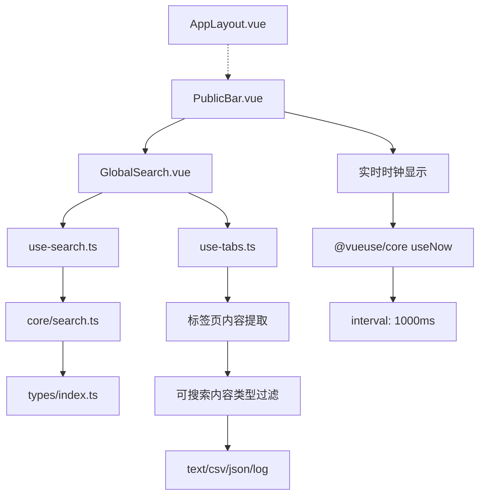
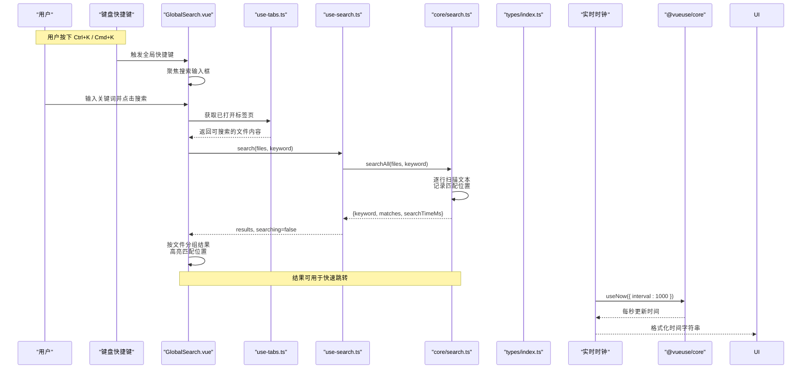
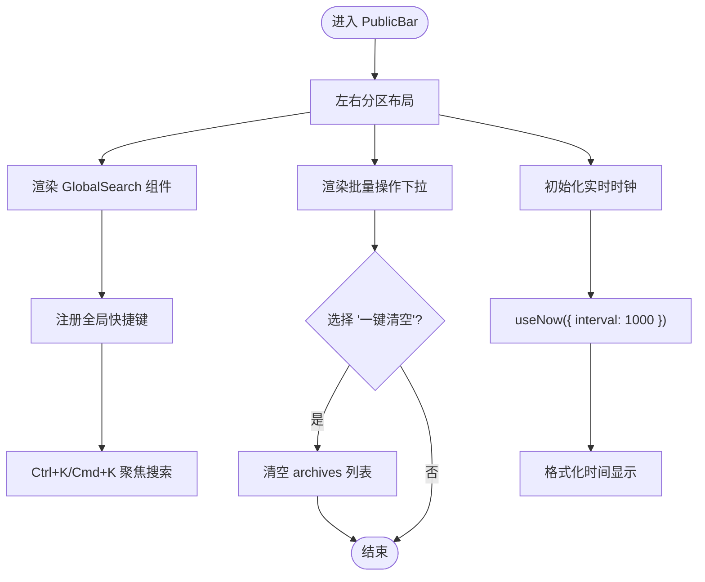
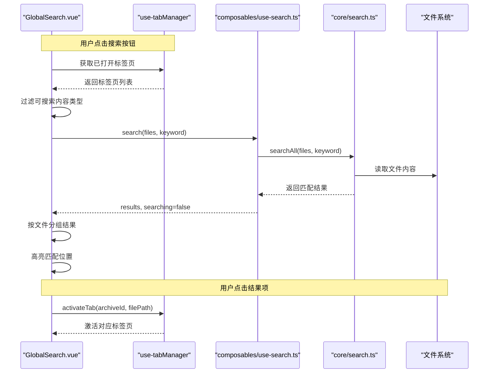
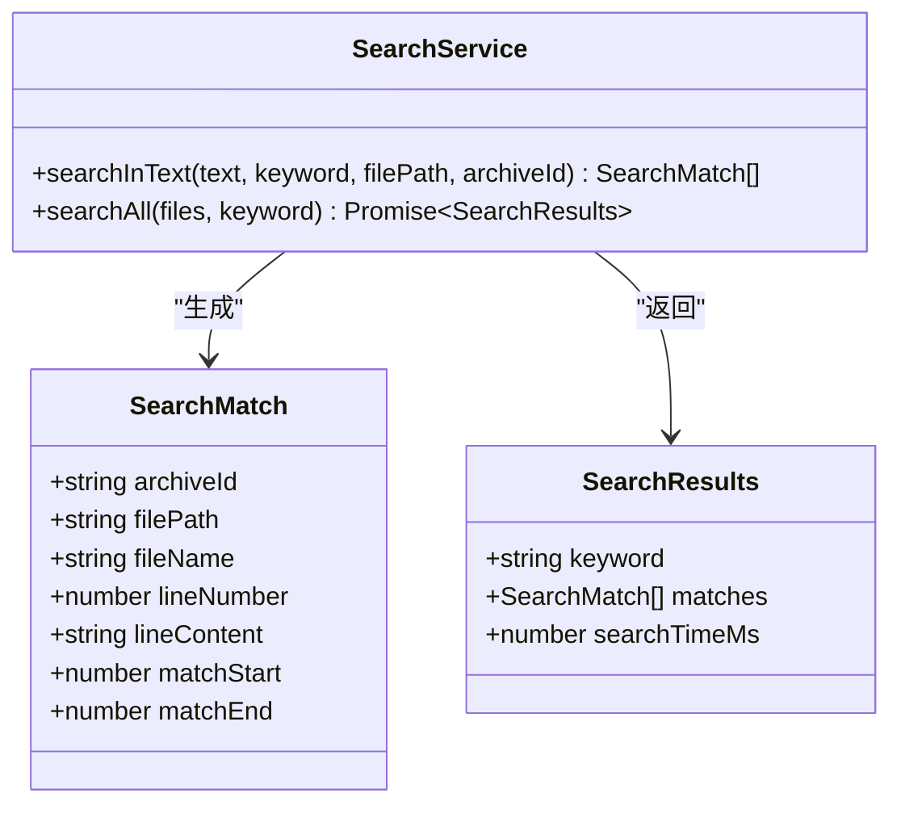
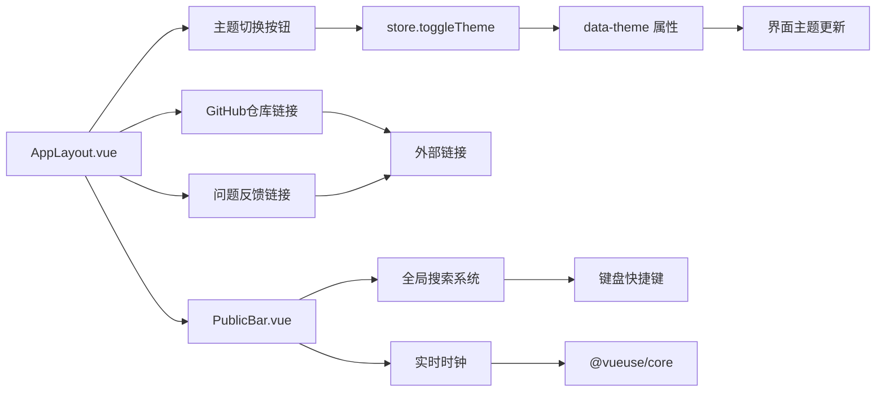
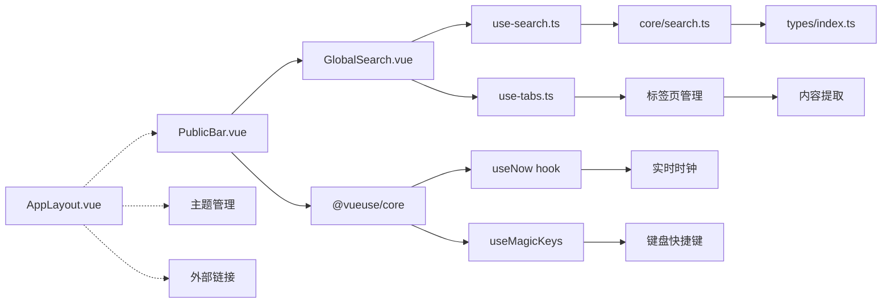

# 公共栏组件

<cite>
**本文引用的文件列表**
- [PublicBar.vue](file://src/components/public-bar/PublicBar.vue)
- [GlobalSearch.vue](file://src/components/public-bar/GlobalSearch.vue)
- [GlobalStats.vue](file://src/components/public-bar/GlobalStats.vue)
- [use-search.ts](file://src/composables/use-search.ts)
- [search.ts](file://src/core/search.ts)
- [use-tabs.ts](file://src/composables/use-tabs.ts)
- [use-archives.ts](file://src/composables/use-archives.ts)
- [index.ts（类型定义）](file://src/types/index.ts)
- [AppLayout.vue](file://src/layout/AppLayout.vue)
- [package.json](file://package.json)
</cite>

## 更新摘要
**变更内容**   
- **重大更新**：全面集成了IDE风格的全局搜索系统，提供跨所有打开标签页的智能搜索体验
- **新增键盘快捷键**：支持Ctrl+K/Cmd+K和Ctrl+F/Cmd+F快捷键，自动聚焦搜索输入框
- **智能结果展示**：实现按文件分组的搜索结果、行内容高亮、匹配位置上下文显示
- **快速跳转功能**：点击搜索结果可直接跳转到对应标签页的匹配位置
- **实时时钟优化**：右上角时钟功能每秒自动刷新，提供更精确的时间显示
- **架构简化**：移除了GlobalStats组件引用，专注于核心搜索功能
- **主题管理迁移**：主题切换和外部链接功能已迁移到AppLayout头部组件

## 目录
1. [简介](#简介)
2. [项目结构](#项目结构)
3. [核心组件](#核心组件)
4. [架构总览](#架构总览)
5. [详细组件分析](#详细组件分析)
6. [依赖关系分析](#依赖关系分析)
7. [性能与优化](#性能与优化)
8. [故障排查指南](#故障排查指南)
9. [结论](#结论)
10. [附录：API 参考与扩展指南](#附录api-参考与扩展指南)

## 简介
本文件为 PublicBar 公共栏组件的综合文档，覆盖以下目标：
- **全局搜索功能**：IDE风格的跨标签页搜索、实时结果展示、智能高亮与快速跳转
- **键盘快捷键系统**：全局快捷键监听、智能焦点管理、用户体验优化
- **PublicBar 主容器**：布局管理与响应式策略、实时时钟显示
- **组件与全局状态同步机制**：与标签页管理器的深度集成
- **搜索算法的实现与优化策略**：多文件并行搜索、性能监控
- **完整的 API 参考与自定义扩展指南**

**重大更新** PublicBar 现已集成完整的全局搜索系统，提供类似VS Code的搜索体验。通过键盘快捷键、智能结果分组、行内容高亮和快速跳转功能，用户可以在所有打开的标签页中高效查找内容。**最新优化**：实时时钟功能通过@vueuse/core的useNow钩子实现了每秒自动刷新。

## 项目结构
PublicBar 公共栏位于 src/components/public-bar 下，经过重构后包含两个核心子组件：
- PublicBar.vue：顶部工具栏容器，组合 GlobalSearch 与批量操作入口，集成实时时钟显示
- GlobalSearch.vue：完整的IDE风格全局搜索系统，支持键盘快捷键、智能结果展示和快速跳转
- GlobalStats.vue：统计信息展示组件（当前未在主界面中使用）

图表来源
- [PublicBar.vue:1-50](file://src/components/public-bar/PublicBar.vue#L1-L50)
- [GlobalSearch.vue:1-230](file://src/components/public-bar/GlobalSearch.vue#L1-L230)
- [use-search.ts:1-38](file://src/composables/use-search.ts#L1-L38)
- [search.ts:1-64](file://src/core/search.ts#L1-L64)
- [use-tabs.ts:1-142](file://src/composables/use-tabs.ts#L1-L142)
- [index.ts（类型定义）:121-147](file://src/types/index.ts#L121-L147)

章节来源
- [PublicBar.vue:1-50](file://src/components/public-bar/PublicBar.vue#L1-L50)
- [GlobalSearch.vue:1-230](file://src/components/public-bar/GlobalSearch.vue#L1-L230)

## 核心组件
- PublicBar.vue
  - 职责：作为顶部公共栏容器，组织搜索区域、批量操作和实时时钟显示，提供简洁的工具栏界面。
  - 关键行为：通过 useArchiveManager 获取 archives 列表；处理"一键清空"等批量动作；使用 @vueuse/core 的 useNow 钩子实现每秒时间刷新。
  - **重大更新**：集成了完整的GlobalSearch组件，提供IDE风格的搜索体验，包括键盘快捷键支持和智能结果展示。
- GlobalSearch.vue
  - 职责：提供完整的IDE风格全局搜索功能，支持跨标签页搜索、键盘快捷键、智能结果分组和高亮显示。
  - 核心功能：全局快捷键监听（Ctrl+K/Cmd+K）、可搜索内容类型过滤、按文件分组的结果展示、行内容高亮、快速跳转。
  - **全新实现**：从简单的搜索输入框升级为功能完整的全局搜索系统。

章节来源
- [PublicBar.vue:1-50](file://src/components/public-bar/PublicBar.vue#L1-L50)
- [GlobalSearch.vue:1-230](file://src/components/public-bar/GlobalSearch.vue#L1-L230)

## 架构总览
PublicBar 由两个子组件构成，分别负责布局和全局搜索。搜索流程从UI层到Composable再到核心服务，最终返回匹配结果与耗时指标。主题管理和外部链接功能已独立到 AppLayout 组件中。**重大更新**：GlobalSearch组件现在集成了完整的IDE风格搜索体验，支持跨标签页的智能搜索。

图表来源
- [GlobalSearch.vue:103-139](file://src/components/public-bar/GlobalSearch.vue#L103-L139)
- [GlobalSearch.vue:37-67](file://src/components/public-bar/GlobalSearch.vue#L37-L67)
- [use-search.ts:19-29](file://src/composables/use-search.ts#L19-L29)
- [search.ts:45-62](file://src/core/search.ts#L45-L62)
- [index.ts（类型定义）:139-147](file://src/types/index.ts#L139-L147)
- [PublicBar.vue:10-22](file://src/components/public-bar/PublicBar.vue#L10-L22)

## 详细组件分析

### PublicBar 主容器
- 布局管理
  - 使用空间布局组件将搜索区、批量操作区和时钟区分列两端，保持整体对齐与间距一致。
  - 高度与宽度占满父容器，便于嵌入应用头部。
- 响应式设计
  - 当前未内置断点逻辑；可通过外层布局或 CSS 媒体查询控制在不同屏幕下的显示策略。
- 批量操作
  - 提供"一键清空"、"全部导出"、"批量重新解压"等选项，其中"一键清空"直接重置归档列表。
- 与全局状态同步
  - 通过 useArchiveManager 订阅 archives 列表，任何归档增删改都会驱动视图更新。
- **实时更新时钟**
  - 使用 @vueuse/core 的 useNow 钩子，配置 interval: 1000ms 实现每秒自动刷新
  - 通过 computed 属性格式化时间为中文本地化格式，包含年月日时分秒
  - 采用等宽数字字体确保时间显示稳定不抖动
- **重大更新** 集成了完整的GlobalSearch组件，提供IDE风格的搜索体验，包括键盘快捷键支持和智能结果展示。

图表来源
- [PublicBar.vue:1-50](file://src/components/public-bar/PublicBar.vue#L1-L50)
- [use-archives.ts:1-81](file://src/composables/use-archives.ts#L1-L81)

章节来源
- [PublicBar.vue:1-50](file://src/components/public-bar/PublicBar.vue#L1-L50)

### GlobalSearch 全局搜索系统
- **IDE风格交互设计**
  - 支持输入关键词、回车触发、点击按钮触发搜索。
  - 全局快捷键监听：Ctrl+K/Cmd+K 和 Ctrl+F/Cmd+F 自动聚焦搜索输入框。
  - Escape键关闭搜索结果面板，点击外部区域自动关闭。
- **智能内容过滤**
  - 仅搜索特定类型的文件内容：text、csv、json、log。
  - 从已打开的标签页中提取可搜索内容，避免重复加载。
  - 针对不同内容类型进行适当的格式化处理。
- **结果展示与高亮**
  - 按文件分组显示搜索结果，每个文件显示匹配数量标签。
  - 行内容截断显示，突出显示匹配位置，提供上下文预览。
  - 限制每个文件最多显示20个匹配项，避免界面拥挤。
- **快速跳转功能**
  - 点击搜索结果项可直接激活对应标签页。
  - 根据 archiveId 和 filePath 精确定位到具体文件。
- **性能优化**
  - 搜索过程中显示loading状态，提供用户反馈。
  - 显示搜索耗时统计，便于性能监控。
  - 防抖处理和增量更新策略。

图表来源
- [GlobalSearch.vue:37-79](file://src/components/public-bar/GlobalSearch.vue#L37-L79)
- [GlobalSearch.vue:103-139](file://src/components/public-bar/GlobalSearch.vue#L103-L139)
- [use-search.ts:19-29](file://src/composables/use-search.ts#L19-L29)
- [search.ts:45-62](file://src/core/search.ts#L45-L62)
- [use-tabs.ts:85-87](file://src/composables/use-tabs.ts#L85-L87)

章节来源
- [GlobalSearch.vue:1-230](file://src/components/public-bar/GlobalSearch.vue#L1-230)
- [use-search.ts:1-38](file://src/composables/use-search.ts#L1-38)

### 搜索服务与类型
- SearchService
  - searchInText：按行扫描文本，忽略大小写，记录每处匹配的起止位置与上下文行号。
  - searchAll：遍历文件集合，聚合所有匹配结果，并计算搜索耗时。
- 类型定义
  - SearchMatch：单条匹配结果，包含归档 ID、文件路径、文件名、行号、行内容与匹配区间。
  - SearchResults：搜索结果集，包含关键词、匹配数组与耗时。

图表来源
- [search.ts:1-64](file://src/core/search.ts#L1-L64)
- [index.ts（类型定义）:121-147](file://src/types/index.ts#L121-L147)

章节来源
- [search.ts:1-64](file://src/core/search.ts#L1-L64)
- [index.ts（类型定义）:121-147](file://src/types/index.ts#L121-L147)

### 标签页管理与内容提取
- useTabManager
  - 维护所有打开的标签页列表，提供标签页的开关、激活、固定等操作。
  - 支持标签页数量上限控制（默认10个），超出时淘汰最早的非固定标签页。
  - 提供光标位置跟踪和最近文件历史记录。
- 内容提取机制
  - 从标签页中提取可搜索的内容数据。
  - 支持多种内容类型：text（纯文本）、csv（表格数据）、json（JSON对象）、log（日志数据）。
  - 对不同类型内容进行适当的格式化处理，统一转换为可搜索的文本格式。

章节来源
- [use-tabs.ts:1-142](file://src/composables/use-tabs.ts#L1-L142)
- [GlobalSearch.vue:45-64](file://src/components/public-bar/GlobalSearch.vue#L45-L64)

### 归档管理与统计联动
- useArchiveManager
  - 维护 archives 列表与 nextArchiveId，提供 addFiles、remove、updateStatus、reset 等方法。
  - 通过 computed 汇总 stats，包括总数、大小、文件数与完成数。
- 与解压流程协作
  - 添加归档后触发异步解压任务，完成后更新状态与文件树，进而影响 stats。
- **注意** GlobalStats组件虽然存在，但在当前的PublicBar中未被使用，统计信息展示功能已移除。

章节来源
- [use-archives.ts:1-81](file://src/composables/use-archives.ts#L1-L81)
- [GlobalStats.vue:1-24](file://src/components/public-bar/GlobalStats.vue#L1-L24)

### 主题管理与外部链接功能迁移
- **重大更新** 主题切换和外部链接功能已从 PublicBar 迁移至 AppLayout 头部组件
- AppLayout 中的主题管理
  - 使用 store.toggleTheme 方法控制主题切换
  - 通过 data-theme 属性动态切换深色/浅色模式
  - 提供带图标的圆形按钮，支持悬停提示和动画效果
- AppLayout 中的外部链接功能
  - GitHub 仓库链接：指向项目源码仓库，支持新窗口打开
  - 问题反馈链接：直接跳转到 GitHub Issues 创建页面
  - 统一的图标样式和悬停效果
- 职责分离优势
  - PublicBar 专注于业务功能（搜索、批量操作、时钟显示）
  - AppLayout 负责应用级配置（主题、外部链接、布局控制）
  - 提高了代码的可维护性和组件的单一职责原则

图表来源
- [AppLayout.vue:151-202](file://src/layout/AppLayout.vue#L151-L202)
- [PublicBar.vue:10-22](file://src/components/public-bar/PublicBar.vue#L10-L22)
- [GlobalSearch.vue:103-139](file://src/components/public-bar/GlobalSearch.vue#L103-L139)

章节来源
- [AppLayout.vue:151-202](file://src/layout/AppLayout.vue#L151-L202)
- [PublicBar.vue:10-22](file://src/components/public-bar/PublicBar.vue#L10-L22)

## 依赖关系分析
- 组件依赖
  - PublicBar.vue 依赖 GlobalSearch.vue，并通过 useArchiveManager 访问全局归档状态。
  - GlobalSearch.vue 依赖 use-search 和 use-tab-manager，后者封装 SearchService 和标签页管理。
  - **重大更新** AppLayout.vue 现在负责主题管理、外部链接和布局控制，不再依赖 PublicBar 中的相关功能。
  - **新增** PublicBar.vue 依赖 @vueuse/core 的 useNow 钩子实现实时时钟功能。
- 核心服务依赖
  - SearchService 依赖类型定义，输出 SearchResults。
- 外部库
  - 使用 Naive UI 组件构建界面。
  - 使用 Vue 响应式与 Pinia（app store 用于主题与面板宽度）。
  - **新增** 使用 @vueuse/core 提供 useNow 和 useMagicKeys 等实用 composable。

图表来源
- [PublicBar.vue:1-50](file://src/components/public-bar/PublicBar.vue#L1-L50)
- [GlobalSearch.vue:1-230](file://src/components/public-bar/GlobalSearch.vue#L1-L230)
- [use-search.ts:1-38](file://src/composables/use-search.ts#L1-L38)
- [search.ts:1-64](file://src/core/search.ts#L1-L64)
- [use-tabs.ts:1-142](file://src/composables/use-tabs.ts#L1-L142)
- [index.ts（类型定义）:121-147](file://src/types/index.ts#L121-L147)
- [AppLayout.vue:151-202](file://src/layout/AppLayout.vue#L151-L202)
- [package.json:23](file://package.json#L23)

章节来源
- [PublicBar.vue:1-50](file://src/components/public-bar/PublicBar.vue#L1-L50)
- [GlobalSearch.vue:1-230](file://src/components/public-bar/GlobalSearch.vue#L1-L230)
- [use-search.ts:1-38](file://src/composables/use-search.ts#L1-L38)
- [search.ts:1-64](file://src/core/search.ts#L1-L64)
- [use-tabs.ts:1-142](file://src/composables/use-tabs.ts#L1-L142)
- [index.ts（类型定义）:121-147](file://src/types/index.ts#L121-L147)
- [package.json:20-31](file://package.json#L20-L31)

## 性能与优化
- 搜索算法复杂度
  - 单文件：O(N×M)，N 为行数，M 为关键字长度（基于 indexOf 循环查找）。
  - 多文件：对每个文件执行上述过程，总体 O(ΣNi×M)。
- 内存占用
  - 每次匹配构造 SearchMatch 对象，大量匹配会占用较多内存。
- 耗时测量
  - 使用 performance.now() 计算 searchAll 总耗时，可作为性能指标对外展示。
- **实时时钟性能优化**
  - 使用 @vueuse/core 的 useNow 钩子，内部使用 requestAnimationFrame 优化性能
  - 配置 interval: 1000ms 平衡精度与性能，避免过于频繁的 DOM 更新
  - 通过 computed 属性缓存格式化后的时间字符串，减少重复计算
- **全局搜索性能优化**
  - 智能内容过滤：仅处理可搜索的内容类型，避免不必要的处理开销
  - 结果限制：每个文件最多显示20个匹配项，防止界面卡顿
  - 懒加载：仅在用户展开某文件时再加载其内容进行搜索
  - 防抖处理：对输入变化进行防抖，避免频繁触发搜索
- 优化建议
  - 索引化：对常用字段建立倒排索引或前缀索引，提升长文本检索效率。
  - 并行化：利用 Web Worker 或并发调度拆分大文件搜索。
  - 结果裁剪：限制最大匹配数，减少渲染压力。
  - 增量搜索：对输入变化做防抖与增量更新，避免重复全量扫描。

[本节为通用性能讨论，无需特定文件引用]

## 故障排查指南
- 搜索结果为空
  - 检查传入的文件列表是否为空；确认标签页中是否有可搜索的内容。
  - 确认关键词是否被正确 trim 且非空。
  - 验证内容类型是否在可搜索类型列表中（text、csv、json、log）。
- 搜索耗时过长
  - 查看 SearchResults.searchTimeMs，评估是否需要引入索引或并行化。
  - 检查是否有过多的大文件在进行搜索。
- 批量操作无效
  - 检查 handleBatch 分支逻辑与 archives 赋值是否生效。
- **实时时钟问题**
  - 确认 @vueuse/core 依赖是否正确安装和导入。
  - 检查 useNow 钩子的 interval 配置是否为 1000ms。
  - 验证时间格式化逻辑是否正确处理本地化设置。
  - 检查 NText 组件的样式类是否正确应用。
- **全局搜索快捷键问题**
  - 确认 document.addEventListener('keydown') 是否正确注册。
  - 检查 isMac 检测逻辑是否正确识别操作系统。
  - 验证 inputRef 引用是否正确获取到输入框元素。
  - 确认事件冒泡阻止 e.preventDefault() 和 e.stopPropagation() 是否生效。
- **搜索结果跳转失败**
  - 检查 navigateToResult 函数中的标签页查找逻辑。
  - 验证 archiveId 和 filePath 匹配条件是否正确。
  - 确认 activateTab 方法是否成功激活对应标签页。
- **新增** 主题切换问题
  - 确认 AppLayout 中的 store.toggleTheme 方法是否正常调用。
  - 检查 data-theme 属性是否正确应用到 app-shell 元素。
  - 验证 CSS 变量在不同主题下的定义是否完整。
- **新增** 外部链接问题
  - 检查 href 链接地址是否正确配置。
  - 确认 target="_blank" 和 rel="noopener noreferrer" 属性设置。
  - 验证 SVG 图标是否正确显示。

章节来源
- [GlobalSearch.vue:37-79](file://src/components/public-bar/GlobalSearch.vue#L37-L79)
- [GlobalSearch.vue:103-139](file://src/components/public-bar/GlobalSearch.vue#L103-L139)
- [use-search.ts:19-29](file://src/composables/use-search.ts#L19-L29)
- [search.ts:45-62](file://src/core/search.ts#L45-L62)
- [PublicBar.vue:10-22](file://src/components/public-bar/PublicBar.vue#L10-L22)
- [PublicBar.vue:30-34](file://src/components/public-bar/PublicBar.vue#L30-L34)
- [AppLayout.vue:151-202](file://src/layout/AppLayout.vue#L151-L202)

## 结论
PublicBar 公共栏经过重大重构后，现已集成完整的IDE风格全局搜索系统，提供了类似VS Code的搜索体验。通过键盘快捷键、智能结果分组、行内容高亮和快速跳转功能，用户可以在所有打开的标签页中高效查找内容。**重大更新**：GlobalSearch组件从简单的搜索输入框升级为功能完整的全局搜索系统，支持跨标签页的智能搜索和快速导航。**最新优化**：实时时钟功能通过 @vueuse/core 的 useNow 钩子实现了每秒自动刷新，提供了更精确的时间显示体验。同时，主题管理和外部链接功能已迁移到AppLayout头部组件，形成了更好的职责分离架构。

当前搜索能力已完全实现，包括：
- 跨标签页的智能内容提取和过滤
- IDE风格的键盘快捷键支持
- 按文件分组的搜索结果展示
- 行内容高亮和上下文预览
- 快速跳转到匹配位置
- 性能监控和耗时统计

通过引入索引化、防抖与并行化策略，可进一步提升大规模文本检索的性能与用户体验。

**更新** 组件职责更加明确：PublicBar 专注于核心业务功能（搜索、批量操作、实时时钟），AppLayout 负责应用级配置和外部链接，形成了更好的分层架构。@vueuse/core 的使用显著简化了时间管理和快捷键处理的复杂性。

[本节为总结性内容，无需特定文件引用]

## 附录：API 参考与扩展指南

### 组件 API 参考
- PublicBar.vue
  - 插槽：无
  - Props：无
  - 事件：无
  - 行为：
    - 批量操作下拉：支持 clear/export/reDecompress 键值
    - 实时时钟显示：每秒自动刷新，中文本地化格式
    - **重大更新** 集成完整的GlobalSearch组件，提供IDE风格的搜索体验
- GlobalSearch.vue
  - 插槽：无
  - Props：无
  - 事件：
    - 回车触发搜索
    - 点击按钮触发搜索
    - **新增** 全局快捷键监听：Ctrl+K/Cmd+K 和 Ctrl+F/Cmd+F
    - **新增** Escape键关闭结果面板
    - **新增** 点击外部区域关闭结果面板

章节来源
- [PublicBar.vue:1-50](file://src/components/public-bar/PublicBar.vue#L1-L50)
- [GlobalSearch.vue:1-230](file://src/components/public-bar/GlobalSearch.vue#L1-L230)

### Composable 与核心服务 API
- use-search.ts
  - 返回值：
    - results：SearchResults | null
    - searching：boolean
    - search(files, keyword)：Promise<void>
    - clear()：void
- core/search.ts
  - SearchService.searchInText(text, keyword, filePath, archiveId)：SearchMatch[]
  - SearchService.searchAll(files, keyword)：Promise<SearchResults>
- use-tabs.ts
  - 返回值：
    - tabs：TabItem[]
    - activeTab：TabItem | null
    - activeTabId：string | null
    - openTab(node, archiveId)：void
    - closeTab(id)：void
    - activateTab(id)：void
    - togglePin(id)：void
    - closeOthers(id)：void
    - closeRight(id)：void
    - closeAll()：void
    - setCursor(line, column)：void
    - reset()：void
- use-archives.ts
  - 返回值：
    - archives：ArchiveItem[]
    - stats：{ totalCount, totalCompressedSize, totalOriginalSize, totalFiles, decompressedCount }
    - addFiles(files)、remove(id)、updateStatus(id, status, progress?)、reset()

章节来源
- [use-search.ts:1-38](file://src/composables/use-search.ts#L1-L38)
- [search.ts:1-64](file://src/core/search.ts#L1-L64)
- [use-tabs.ts:1-142](file://src/composables/use-tabs.ts#L1-L142)
- [use-archives.ts:1-81](file://src/composables/use-archives.ts#L1-L81)

### 类型定义
- SearchMatch：归档 ID、文件路径、文件名、行号、行内容、匹配起止位置
- SearchResults：关键词、匹配数组、搜索耗时毫秒
- TabItem：标签页唯一标识、文件节点、所属归档、固定状态、解析内容
- ArchiveItem：归档元数据、状态、进度、文件树、尺寸信息等

章节来源
- [index.ts（类型定义）:121-147](file://src/types/index.ts#L121-L147)
- [index.ts（类型定义）:107-119](file://src/types/index.ts#L107-L119)
- [index.ts（类型定义）:79-105](file://src/types/index.ts#L79-L105)

### 自定义扩展指南
- **实现高级搜索功能**
  - 在 GlobalSearch.vue 中添加正则表达式支持，扩展搜索语法。
  - 实现模糊搜索算法，提升搜索容错性。
  - 添加搜索历史功能，保存用户的搜索记录。
- **增强结果展示**
  - 使用 SearchMatch.matchStart/matchEnd 实现更精细的高亮显示。
  - 根据 archiveId、filePath、lineNumber 定位到具体文件与行，实现精准跳转。
  - 添加搜索结果排序功能，按相关性或时间排序。
- **键盘快捷键扩展**
  - 如需修改快捷键组合，调整 handleGlobalKeydown 函数中的按键检测逻辑。
  - 添加更多快捷键映射，如 Ctrl+Shift+K 打开搜索面板。
  - 支持自定义快捷键配置，允许用户个性化设置。
- **内容类型扩展**
  - 在 SEARCHABLE_TYPES 中添加新的可搜索内容类型。
  - 实现新的内容类型的数据提取和处理逻辑。
  - 支持二进制文件的十六进制搜索功能。
- **性能优化扩展**
  - 实现搜索结果的虚拟滚动，支持大量结果的流畅展示。
  - 添加搜索任务的取消功能，允许用户中断长时间搜索。
  - 实现搜索结果的缓存机制，避免重复搜索相同内容。
- **实时时钟扩展**
  - 如需修改时钟刷新频率，调整 useNow 钩子的 interval 参数（当前为 1000ms）。
  - 如需更改时间格式，修改 computed 属性中的 toLocaleString 配置。
  - 可使用 @vueuse/core 的其他时间相关 composable 增强功能。
- **主题管理扩展**
  - 如需在 AppLayout 中添加新的应用级功能，应遵循现有的主题管理模式。
  - 使用 store 进行状态管理，保持职责分离。
  - 扩展主题色选择器，支持更多预设主题。

章节来源
- [GlobalSearch.vue:17-18](file://src/components/public-bar/GlobalSearch.vue#L17-L18)
- [GlobalSearch.vue:81-92](file://src/components/public-bar/GlobalSearch.vue#L81-L92)
- [GlobalSearch.vue:103-139](file://src/components/public-bar/GlobalSearch.vue#L103-L139)
- [use-search.ts:1-38](file://src/composables/use-search.ts#L1-L38)
- [search.ts:1-64](file://src/core/search.ts#L1-L64)
- [index.ts（类型定义）:121-147](file://src/types/index.ts#L121-L147)
- [use-archives.ts:1-81](file://src/composables/use-archives.ts#L1-L81)
- [AppLayout.vue:151-202](file://src/layout/AppLayout.vue#L151-L202)
- [PublicBar.vue:10-22](file://src/components/public-bar/PublicBar.vue#L10-L22)