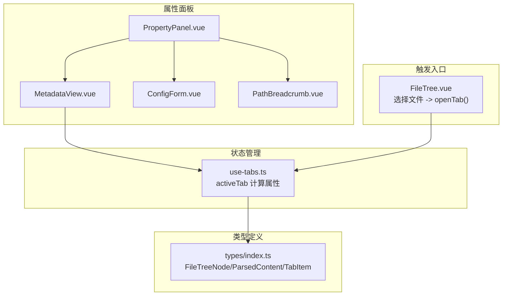
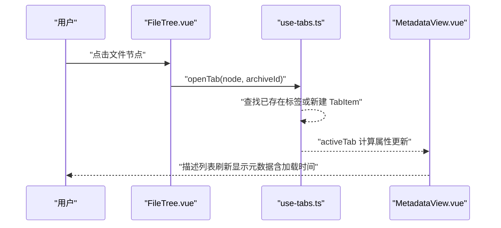
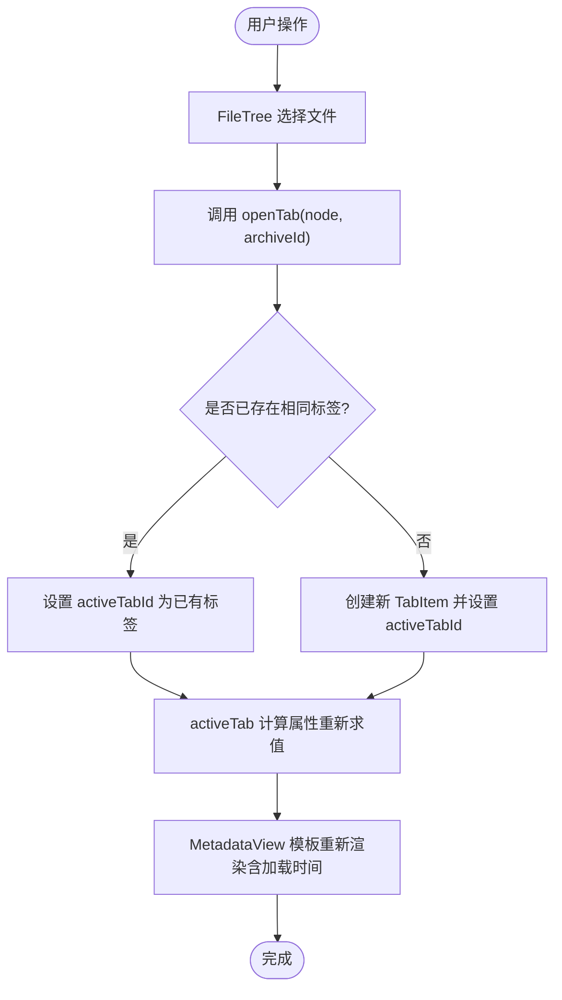
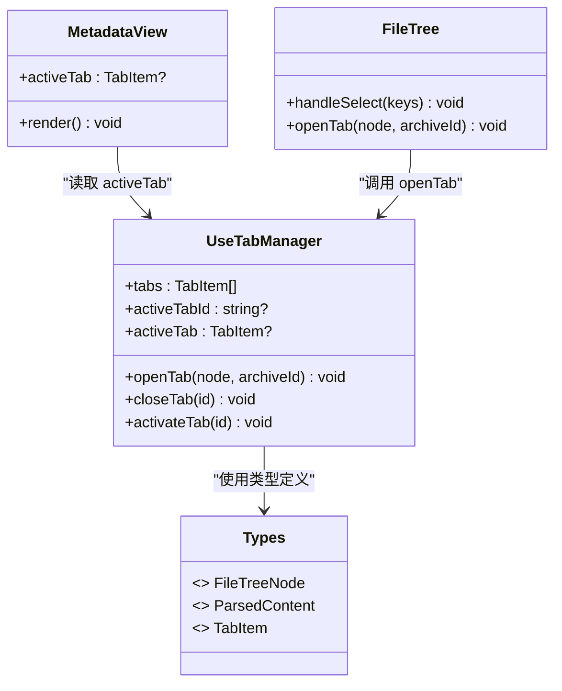

# 元数据视图组件

<cite>
**本文引用的文件**
- [src/components/property-panel/MetadataView.vue](file://src/components/property-panel/MetadataView.vue)
- [src/components/property-panel/PropertyPanel.vue](file://src/components/property-panel/PropertyPanel.vue)
- [src/composables/use-tabs.ts](file://src/composables/use-tabs.ts)
- [src/types/index.ts](file://src/types/index.ts)
- [src/components/archive-panel/FileTree.vue](file://src/components/archive-panel/FileTree.vue)
</cite>

## 更新摘要
**变更内容**
- 增强了空状态处理机制，提供友好的用户提示
- 改进了列布局配置，优化了描述列表的显示效果
- 添加了加载时间指标显示功能，提升性能监控能力
- 完善了条件渲染逻辑，确保字段显示的准确性

## 目录
1. [简介](#简介)
2. [项目结构](#项目结构)
3. [核心组件](#核心组件)
4. [架构总览](#架构总览)
5. [详细组件分析](#详细组件分析)
6. [依赖关系分析](#依赖关系分析)
7. [性能与渲染策略](#性能与渲染策略)
8. [常见问题与排障](#常见问题与排障)
9. [结论](#结论)
10. [附录：使用示例与扩展建议](#附录使用示例与扩展建议)

## 简介
本文件为"元数据视图组件"（MetadataView）的完整技术文档。该组件用于在属性面板中展示当前活动标签页对应文件的元数据，包括文件名、路径、大小、类型、行数、解析插件名称以及加载耗时等基础信息。它通过响应式数据绑定到全局标签管理器，实现无侵入式的状态更新与可视化呈现。

**更新** 组件现已支持增强的空状态处理和加载时间指标显示，提供更好的用户体验和性能监控能力。

## 项目结构
MetadataView 位于属性面板模块下，作为右侧属性面板的一部分，与其他子组件共同组成完整的属性展示区域。其关键位置如下：
- 组件入口：src/components/property-panel/MetadataView.vue
- 容器组合：src/components/property-panel/PropertyPanel.vue
- 数据源：src/composables/use-tabs.ts（提供 activeTab）
- 数据结构定义：src/types/index.ts（FileTreeNode、ParsedContent、TabItem）
- 触发来源：src/components/archive-panel/FileTree.vue（选择文件后打开标签页）

**图表来源**
- [src/components/property-panel/PropertyPanel.vue:1-51](file://src/components/property-panel/PropertyPanel.vue#L1-L51)
- [src/components/property-panel/MetadataView.vue:1-47](file://src/components/property-panel/MetadataView.vue#L1-L47)
- [src/composables/use-tabs.ts:1-64](file://src/composables/use-tabs.ts#L1-L64)
- [src/types/index.ts:17-54](file://src/types/index.ts#L17-L54)
- [src/components/archive-panel/FileTree.vue:1-42](file://src/components/archive-panel/FileTree.vue#L1-L42)

**章节来源**
- [src/components/property-panel/PropertyPanel.vue:1-51](file://src/components/property-panel/PropertyPanel.vue#L1-L51)
- [src/components/property-panel/MetadataView.vue:1-47](file://src/components/property-panel/MetadataView.vue#L1-L47)
- [src/composables/use-tabs.ts:1-64](file://src/composables/use-tabs.ts#L1-L64)
- [src/types/index.ts:17-54](file://src/types/index.ts#L17-L54)
- [src/components/archive-panel/FileTree.vue:1-42](file://src/components/archive-panel/FileTree.vue#L1-L42)

## 核心组件
- MetadataView：基于 Naive UI 的描述列表，展示当前活动标签页的文件元数据，包含增强的空状态处理和加载时间指标显示。
- useTabs：全局标签管理器，维护 tabs 列表与 activeTabId，并提供 activeTab 计算属性供视图消费。
- PropertyPanel：属性面板容器，将 MetadataView、配置表单、路径面包屑组合在一起并滚动显示。
- FileTree：左侧文件树，用户点击叶子节点时调用 openTab 打开新标签页，从而驱动 MetadataView 更新。

**章节来源**
- [src/components/property-panel/MetadataView.vue:1-47](file://src/components/property-panel/MetadataView.vue#L1-L47)
- [src/composables/use-tabs.ts:1-64](file://src/composables/use-tabs.ts#L1-L64)
- [src/components/property-panel/PropertyPanel.vue:1-51](file://src/components/property-panel/PropertyPanel.vue#L1-L51)
- [src/components/archive-panel/FileTree.vue:1-42](file://src/components/archive-panel/FileTree.vue#L1-L42)

## 架构总览
MetadataView 采用"单向数据流 + 计算属性"的响应式架构：
- 数据来源：FileTree 选择文件 -> 调用 openTab 创建或激活 TabItem
- 状态持有：use-tabs 维护 tabs 与 activeTabId，暴露 activeTab 计算属性
- 视图消费：MetadataView 订阅 activeTab，自动渲染元数据字段，包括新增的加载时间指标

**图表来源**
- [src/components/archive-panel/FileTree.vue:1-42](file://src/components/archive-panel/FileTree.vue#L1-L42)
- [src/composables/use-tabs.ts:1-64](file://src/composables/use-tabs.ts#L1-L64)
- [src/components/property-panel/MetadataView.vue:1-47](file://src/components/property-panel/MetadataView.vue#L1-L47)

## 详细组件分析

### 元数据展示机制
- 基础信息字段：
  - 文件名：来自 activeTab.fileNode.label
  - 路径：来自 activeTab.fileNode.path
  - 大小：来自 activeTab.fileNode.size，若为空则显示占位符
  - 类型：当 activeTab.content 存在时显示 content.type
  - 行数：当 activeTab.content.lineCount 存在时显示
  - 解析插件：当 activeTab.content 存在时显示 content.pluginName
  - **新增** 加载耗时：当 activeTab.content.loadTimeMs 存在时显示精确到小数点后一位的毫秒数
- 条件渲染：
  - **增强** 当没有活动标签时，显示友好的提示文本"选择文件查看详情"
  - 当 content 不存在时，隐藏类型、行数、插件名、加载耗时等字段

**更新** 新增了加载时间指标的显示，提升了性能监控能力；同时改进了空状态的提示信息，使其更加友好明确。

**章节来源**
- [src/components/property-panel/MetadataView.vue:1-47](file://src/components/property-panel/MetadataView.vue#L1-L47)
- [src/types/index.ts:26-32](file://src/types/index.ts#L26-L32)

### 数据绑定方式
- 使用 Vue 3 Composition API 的 computed 与 ref 进行响应式绑定
- 通过 useTabManager 提供的 activeTab 计算属性，视图无需关心内部 tabs 变化细节
- 所有字段均为只读展示，不直接修改状态，符合单向数据流原则
- **新增** 加载时间字段使用可选链操作符和条件判断，确保安全性

**章节来源**
- [src/composables/use-tabs.ts:1-64](file://src/composables/use-tabs.ts#L1-L64)
- [src/components/property-panel/MetadataView.vue:1-47](file://src/components/property-panel/MetadataView.vue#L1-L47)

### 自定义样式配置
- 使用 Naive UI 的 NDescriptions 与 NDescriptionsItem 构建描述列表
- **改进** 通过 `:column="1"` 属性配置单列布局，优化显示效果
- 可通过 props 调整尺寸、边框、标签对齐等外观
- **新增** 空状态提示样式，使用 CSS 变量支持主题切换
- 建议在主题层统一配置样式变量，避免内联样式过多

**更新** 改进了列布局配置，使描述列表在不同屏幕尺寸下都有更好的显示效果。

**章节来源**
- [src/components/property-panel/MetadataView.vue:1-47](file://src/components/property-panel/MetadataView.vue#L1-L47)

### 响应式更新机制
- 当 FileTree 触发 openTab 时，use-tabs 更新 activeTabId
- activeTab 计算属性重新求值，返回新的 TabItem 引用
- MetadataView 模板中的表达式因依赖 activeTab 而自动重渲染
- **新增** 加载时间字段的条件渲染，仅在 loadTimeMs 存在时显示

**图表来源**
- [src/composables/use-tabs.ts:1-64](file://src/composables/use-tabs.ts#L1-L64)
- [src/components/property-panel/MetadataView.vue:1-47](file://src/components/property-panel/MetadataView.vue#L1-L47)

### 结构化数据的渲染策略与可视化
- 当前版本仅展示结构化元数据（文件名、路径、大小、类型、行数、插件名、加载耗时），不包含 JSON 树、CSV 表格或日志条目格式化展示
- **新增** 加载时间指标为性能监控提供了重要参考
- 如需扩展，可在 MetadataView 中增加"内容预览"区块，根据 content.type 动态切换渲染器（例如 JsonRenderer、CsvRenderer、LogRenderer）
- 建议保持元数据与内容预览分离，避免在属性面板中承载复杂渲染逻辑

**更新** 新增了加载时间指标，为性能分析和优化提供了数据支持。

**章节来源**
- [src/components/property-panel/MetadataView.vue:1-47](file://src/components/property-panel/MetadataView.vue#L1-L47)

## 依赖关系分析
- 组件依赖：
  - MetadataView 依赖 useTabManager 提供的 activeTab
  - PropertyPanel 聚合 MetadataView、ConfigForm、PathBreadcrumb
- 类型依赖：
  - FileTreeNode、ParsedContent、TabItem 定义了元数据与内容结构
  - **新增** ParsedContent 接口包含 loadTimeMs 字段用于存储加载时间
- 触发依赖：
  - FileTree 通过 openTab 驱动 activeTab 变更

**图表来源**
- [src/components/property-panel/MetadataView.vue:1-47](file://src/components/property-panel/MetadataView.vue#L1-L47)
- [src/composables/use-tabs.ts:1-64](file://src/composables/use-tabs.ts#L1-L64)
- [src/types/index.ts:26-54](file://src/types/index.ts#L26-L54)
- [src/components/archive-panel/FileTree.vue:1-42](file://src/components/archive-panel/FileTree.vue#L1-L42)

**章节来源**
- [src/components/property-panel/MetadataView.vue:1-47](file://src/components/property-panel/MetadataView.vue#L1-L47)
- [src/composables/use-tabs.ts:1-64](file://src/composables/use-tabs.ts#L1-L64)
- [src/types/index.ts:26-54](file://src/types/index.ts#L26-L54)
- [src/components/archive-panel/FileTree.vue:1-42](file://src/components/archive-panel/FileTree.vue#L1-L42)

## 性能与渲染策略
- 计算属性优化：activeTab 仅在 activeTabId 或 tabs 变化时重新计算，避免不必要的遍历
- 条件渲染：对可选字段使用 v-if 控制，减少 DOM 节点数量
- **新增** 加载时间字段的条件渲染，仅在数据存在时显示，避免不必要的计算
- 只读展示：元数据视图不修改状态，降低副作用与重绘范围
- **改进** 单列布局配置提高了在小屏幕设备上的可读性
- 可扩展性：未来如需展示大型结构化数据，建议引入虚拟滚动或分页加载，避免一次性渲染大量节点

**更新** 新增了加载时间字段的条件渲染优化，进一步提升了渲染性能。

## 常见问题与排障
- 问题：未选择文件时显示空白
  - **改进** 原因：activeTab 为 null，模板分支显示友好的提示文本"选择文件查看详情"
  - 解决：确保从 FileTree 正确调用 openTab，且传入有效的 FileTreeNode 与 archiveId
- 问题：类型、行数、插件名、加载耗时未显示
  - 原因：activeTab.content 未填充或字段缺失
  - 解决：在打开标签页后填充 content 对象，包含 type、lineCount、pluginName、loadTimeMs 等必要字段
- 问题：重复打开同一文件导致多个标签
  - 原因：openTab 去重逻辑未生效或 key/archiveId 不一致
  - 解决：检查 FileTree 传递的参数，确保 node.key 与 archiveId 唯一且一致
- **新增** 问题：加载时间显示异常
  - 原因：loadTimeMs 字段未定义或值为 undefined
  - 解决：确保在解析文件时正确计算并设置 loadTimeMs 字段

**更新** 新增了加载时间相关的故障排除指南。

**章节来源**
- [src/components/property-panel/MetadataView.vue:1-47](file://src/components/property-panel/MetadataView.vue#L1-L47)
- [src/composables/use-tabs.ts:1-64](file://src/composables/use-tabs.ts#L1-L64)
- [src/components/archive-panel/FileTree.vue:1-42](file://src/components/archive-panel/FileTree.vue#L1-L42)

## 结论
MetadataView 以简洁的方式展示了当前活动标签页的文件元数据，并通过 useTabManager 实现了响应式的数据绑定与更新。其设计遵循单向数据流与条件渲染原则，具备良好的可维护性与扩展性。**最新更新** 增强了空状态处理、改进了列布局配置，并添加了加载时间指标显示功能，进一步提升了用户体验和性能监控能力。后续可根据业务需求在属性面板中增加内容预览与配置表单联动，进一步提升用户体验。

## 附录：使用示例与扩展建议
- 基本用法
  - 在属性面板中直接引入并使用 <MetadataView />，无需额外配置
  - 确保 FileTree 在选择文件时调用 openTab，使 activeTab 有值
- **新增** 性能监控
  - 利用加载时间指标分析文件解析性能
  - 结合其他性能监控工具进行综合分析
- 扩展内容预览
  - 在 MetadataView 中新增"内容预览"区块，依据 content.type 动态渲染不同视图
  - 对于 JSON 结构树、CSV 表格、日志条目等，建议使用专用渲染器组件，并在属性面板中按需加载
- 样式定制
  - 通过 Naive UI 的主题变量统一调整描述列表的外观
  - 利用 CSS 变量支持深色/浅色主题切换
  - 避免在组件内硬编码样式，提升复用性

**更新** 新增了性能监控的使用建议和样式定制的详细说明。