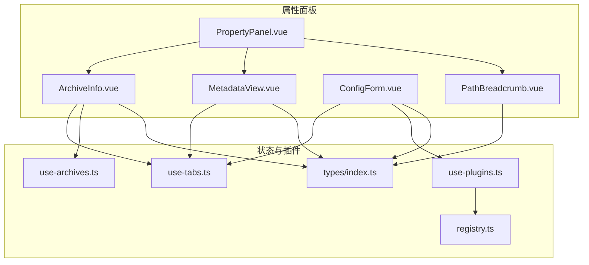
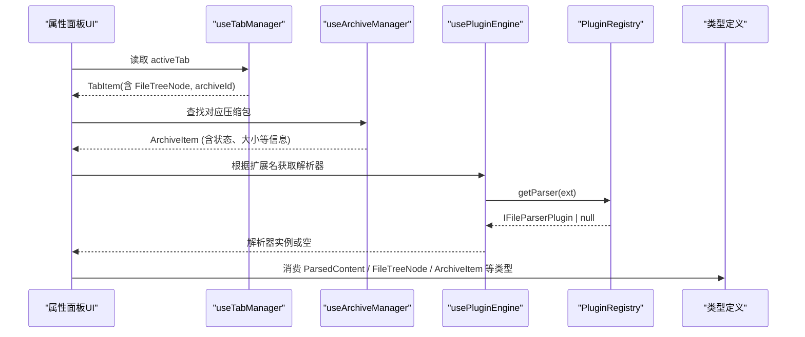
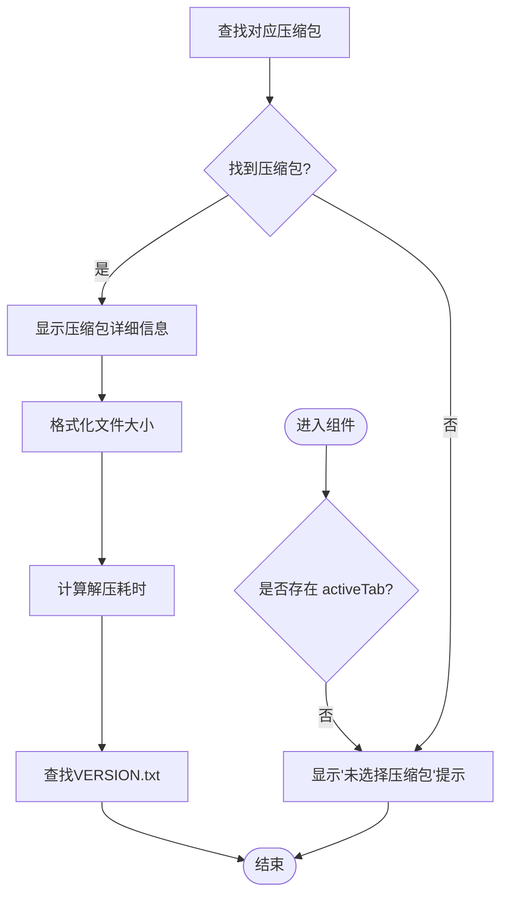
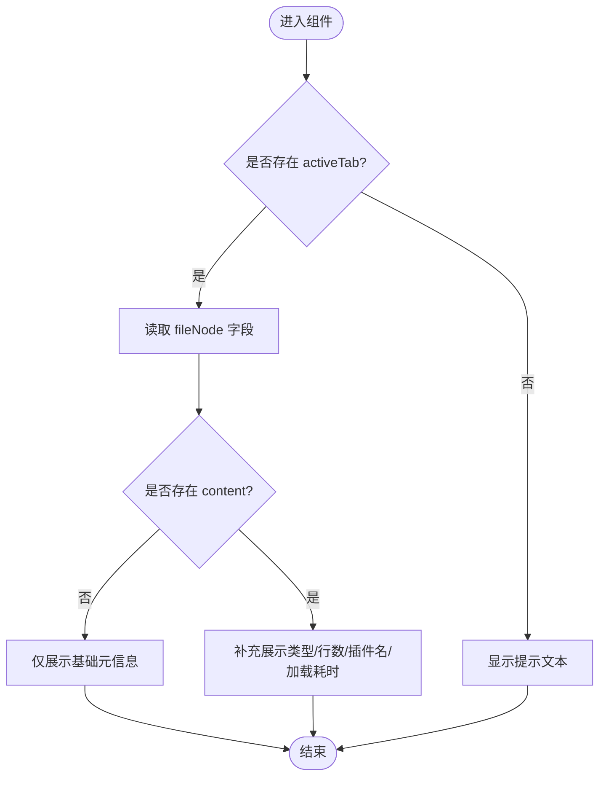
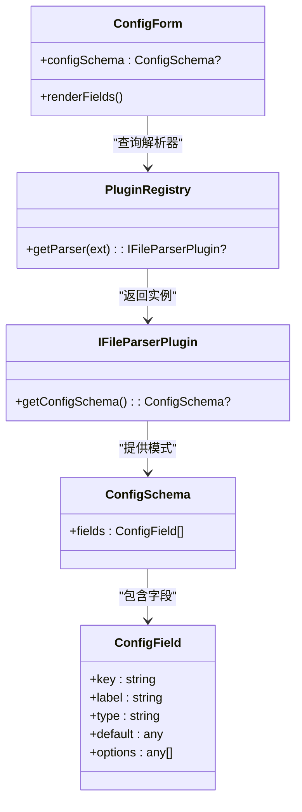
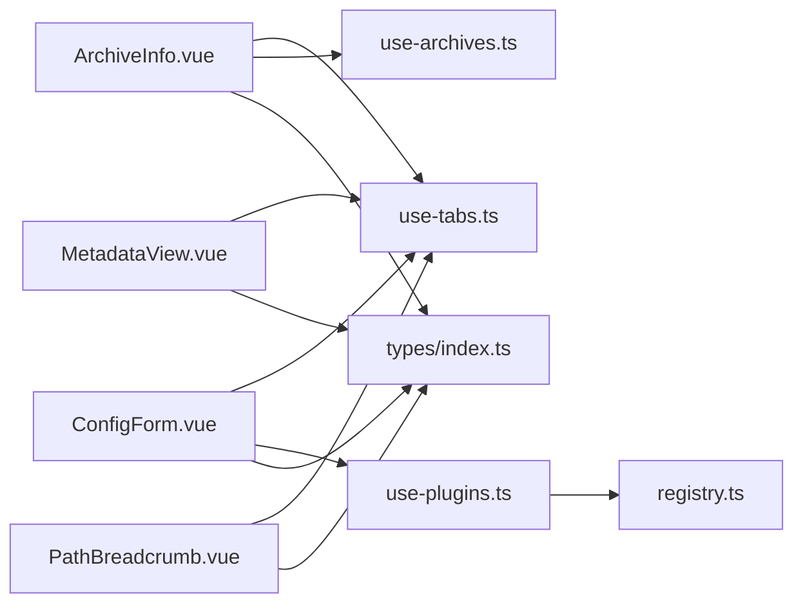

# 属性面板组件

<cite>
**本文引用的文件**
- [PropertyPanel.vue](file://src/components/property-panel/PropertyPanel.vue)
- [ArchiveInfo.vue](file://src/components/property-panel/ArchiveInfo.vue)
- [MetadataView.vue](file://src/components/property-panel/MetadataView.vue)
- [ConfigForm.vue](file://src/components/property-panel/ConfigForm.vue)
- [PathBreadcrumb.vue](file://src/components/property-panel/PathBreadcrumb.vue)
- [use-tabs.ts](file://src/composables/use-tabs.ts)
- [use-archives.ts](file://src/composables/use-archives.ts)
- [use-plugins.ts](file://src/composables/use-plugins.ts)
- [registry.ts](file://src/plugins/registry.ts)
- [index.ts](file://src/types/index.ts)
</cite>

## 更新摘要
**所做更改**
- PropertyPanel组件进行了重大重构，右侧面板被拆分为两个独立区域
- 新增ArchiveInfo组件用于显示归档级别信息（压缩包信息）
- 增强了滚动容器结构和布局约束，采用双层容器设计
- 下半部分专门显示单个文件详情，包含元数据展示和路径面包屑
- 更新了组件依赖关系，新增use-archives.ts的集成

## 目录
1. [简介](#简介)
2. [项目结构](#项目结构)
3. [核心组件](#核心组件)
4. [架构总览](#架构总览)
5. [详细组件分析](#详细组件分析)
6. [依赖关系分析](#依赖关系分析)
7. [性能考虑](#性能考虑)
8. [故障排查指南](#故障排查指南)
9. [结论](#结论)
10. [附录](#附录)

## 简介
本文件为"属性面板"相关组件的权威文档，覆盖以下五个子组件：
- PropertyPanel 属性面板容器（已重构）
- ArchiveInfo 归档信息展示（新增）
- MetadataView 元数据展示
- ConfigForm 配置表单（动态字段生成）
- PathBreadcrumb 路径面包屑

重点说明：
- **重大更新**：PropertyPanel现已采用双区域布局设计，上部显示压缩包信息，下部显示文件详情
- 属性编辑器的表单控件、数据绑定与验证机制现状与建议
- 元数据展示的文件信息、解析结果与结构化呈现方式
- 配置表单的动态字段生成、类型支持与用户交互
- 路径面包屑的导航功能与层级展示
- 各组件的配置选项、事件处理与样式定制方法

## 项目结构
属性面板位于 src/components/property-panel 目录下，由一个容器组件和四个子组件组成。容器负责滚动布局与组合子组件；子组件分别承担归档信息展示、元数据展示、动态配置表单与路径导航职责。

图表来源
- [PropertyPanel.vue:1-51](file://src/components/property-panel/PropertyPanel.vue#L1-L51)
- [ArchiveInfo.vue:1-121](file://src/components/property-panel/ArchiveInfo.vue#L1-L121)
- [MetadataView.vue:1-47](file://src/components/property-panel/MetadataView.vue#L1-L47)
- [ConfigForm.vue:1-37](file://src/components/property-panel/ConfigForm.vue#L1-37)
- [PathBreadcrumb.vue:1-21](file://src/components/property-panel/PathBreadcrumb.vue#L1-21)
- [use-tabs.ts:1-64](file://src/composables/use-tabs.ts#L1-L64)
- [use-archives.ts:1-81](file://src/composables/use-archives.ts#L1-L81)
- [use-plugins.ts:1-17](file://src/composables/use-plugins.ts#L1-L17)
- [registry.ts:1-118](file://src/plugins/registry.ts#L1-L118)
- [index.ts:1-71](file://src/types/index.ts#L1-L71)

章节来源
- [PropertyPanel.vue:1-51](file://src/components/property-panel/PropertyPanel.vue#L1-L51)
- [ArchiveInfo.vue:1-121](file://src/components/property-panel/ArchiveInfo.vue#L1-L121)
- [MetadataView.vue:1-47](file://src/components/property-panel/MetadataView.vue#L1-L47)
- [ConfigForm.vue:1-37](file://src/components/property-panel/ConfigForm.vue#L1-37)
- [PathBreadcrumb.vue:1-21](file://src/components/property-panel/PathBreadcrumb.vue#L1-21)

## 核心组件
- **PropertyPanel**：作为属性面板的容器，采用**新的双区域布局设计**，使用增强的滚动容器结构，包含显式高度样式的包装div和NScrollbar组件，确保在新布局约束内的正确滚动行为。
- **ArchiveInfo**：**新增组件**，显示当前活动标签页所属压缩包的详细信息，包括名称、状态、大小、文件数、解压耗时等。
- MetadataView：基于当前活动标签页，以描述列表形式展示文件名、路径、大小、类型、行数与解析插件等元信息。
- ConfigForm：根据当前文件的扩展名从插件注册表获取解析器，读取其配置模式，动态渲染输入、选择、开关与数字输入控件。
- PathBreadcrumb：将当前文件路径按分隔符切分为段，并以面包屑形式展示层级。

章节来源
- [PropertyPanel.vue:1-51](file://src/components/property-panel/PropertyPanel.vue#L1-L51)
- [ArchiveInfo.vue:1-121](file://src/components/property-panel/ArchiveInfo.vue#L1-L121)
- [MetadataView.vue:1-47](file://src/components/property-panel/MetadataView.vue#L1-L47)
- [ConfigForm.vue:1-37](file://src/components/property-panel/ConfigForm.vue#L1-37)
- [PathBreadcrumb.vue:1-21](file://src/components/property-panel/PathBreadcrumb.vue#L1-21)

## 架构总览
属性面板通过 useTabManager 获取当前活动标签页的数据，结合 useArchiveManager 访问压缩包状态，以及 usePluginEngine 访问插件注册表，从而驱动归档信息展示、元数据展示与动态配置表单的渲染。

图表来源
- [use-tabs.ts:1-64](file://src/composables/use-tabs.ts#L1-L64)
- [use-archives.ts:1-81](file://src/composables/use-archives.ts#L1-L81)
- [use-plugins.ts:1-17](file://src/composables/use-plugins.ts#L1-L17)
- [registry.ts:1-118](file://src/plugins/registry.ts#L1-L118)
- [index.ts:1-71](file://src/types/index.ts#L1-L71)

## 详细组件分析

### PropertyPanel 属性面板容器（重大重构）
- **职责**：提供垂直滚动容器，采用**新的双区域布局设计**，组合 ArchiveInfo、MetadataView、PathBreadcrumb。
- **重大更新** 布局结构已完全重构，采用双层容器设计：
  - 外层 div 设置 `height: 100%` 作为显式高度样式包装容器
  - 内层 NScrollbar 组件包裹所有子组件，确保正确的滚动行为
  - **上半部分**：ArchiveInfo 组件显示压缩包信息
  - **下半部分**：file-info-section 容器包含文件信息标题、MetadataView 和 PathBreadcrumb
  - 这种结构确保在新布局约束内的正确滚动行为
- **可定制性**：可通过外部传入样式或替换滚动组件实现主题化与布局调整。

**章节来源**
- [PropertyPanel.vue:1-51](file://src/components/property-panel/PropertyPanel.vue#L1-L51)

### ArchiveInfo 归档信息展示（新增组件）
- **数据来源**：activeTab.archiveId 关联到 archives 列表中的对应压缩包。
- **展示字段**：
  - 压缩包名称、状态（已完成/失败/解压中/等待中）
  - 压缩大小、原始大小（如果存在）
  - 文件数量、解压耗时（计算自 startTime 和 endTime）
  - VERSION.txt 文件路径（如果存在）
- **交互**：只读展示，无直接编辑能力。
- **样式**：使用描述列表组件，尺寸与边框可通过 props 控制。
- **特殊功能**：自动格式化文件大小，智能计算解压耗时。

图表来源
- [ArchiveInfo.vue:1-121](file://src/components/property-panel/ArchiveInfo.vue#L1-L121)
- [use-tabs.ts:1-64](file://src/composables/use-tabs.ts#L1-L64)
- [use-archives.ts:1-81](file://src/composables/use-archives.ts#L1-L81)
- [index.ts:1-71](file://src/types/index.ts#L1-L71)

**章节来源**
- [ArchiveInfo.vue:1-121](file://src/components/property-panel/ArchiveInfo.vue#L1-L121)
- [use-tabs.ts:1-64](file://src/composables/use-tabs.ts#L1-L64)
- [use-archives.ts:1-81](file://src/composables/use-archives.ts#L1-L81)
- [index.ts:1-71](file://src/types/index.ts#L1-L71)

### MetadataView 元数据展示
- 数据来源：activeTab.fileNode 与 activeTab.content。
- 展示字段：
  - 文件名、路径、大小
  - 类型、行数（当存在 content 时）
  - 解析插件名称（当存在 content 时）
  - **新增**：加载耗时（loadTimeMs）
- 交互：只读展示，无直接编辑能力。
- 样式：使用描述列表组件，尺寸与边框可通过 props 控制。

图表来源
- [MetadataView.vue:1-47](file://src/components/property-panel/MetadataView.vue#L1-L47)
- [use-tabs.ts:1-64](file://src/composables/use-tabs.ts#L1-L64)
- [index.ts:1-71](file://src/types/index.ts#L1-L71)

**章节来源**
- [MetadataView.vue:1-47](file://src/components/property-panel/MetadataView.vue#L1-L47)
- [use-tabs.ts:1-64](file://src/composables/use-tabs.ts#L1-L64)
- [index.ts:1-71](file://src/types/index.ts#L1-L71)

### ConfigForm 配置表单（动态字段生成）
- 动态字段来源：
  - 根据 activeTab.fileNode.label 提取扩展名
  - 通过 registry.getParser(ext) 获取解析器
  - 调用解析器的 getConfigSchema() 返回配置模式
- 支持的字段类型：
  - input：文本输入
  - select：下拉选择，支持 options 列表
  - switch：布尔开关
  - number：数值输入
- 数据绑定：
  - 当前实现使用 default-value 初始化控件值，未建立双向绑定与提交逻辑
- 验证机制：
  - 当前未集成表单校验规则
- 可扩展点：
  - 在解析器中实现 getConfigSchema 并提供 fields 数组
  - 在表单层增加 v-model 双向绑定、变更事件与校验规则
  - 将配置值回写至解析器或上层状态

图表来源
- [ConfigForm.vue:1-37](file://src/components/property-panel/ConfigForm.vue#L1-37)
- [use-plugins.ts:1-17](file://src/composables/use-plugins.ts#L1-L17)
- [registry.ts:1-118](file://src/plugins/registry.ts#L1-L118)
- [index.ts:1-71](file://src/types/index.ts#L1-L71)

**章节来源**
- [ConfigForm.vue:1-37](file://src/components/property-panel/ConfigForm.vue#L1-37)
- [use-plugins.ts:1-17](file://src/composables/use-plugins.ts#L1-L17)
- [registry.ts:1-118](file://src/plugins/registry.ts#L1-L118)
- [index.ts:1-71](file://src/types/index.ts#L1-L71)

### PathBreadcrumb 路径面包屑
- 数据来源：activeTab.fileNode.path
- 展示逻辑：按分隔符拆分路径段，逐段渲染为面包屑项
- 交互：当前仅为展示，无点击跳转行为
- 可定制性：可添加点击事件以触发导航或打开父级节点

图表来源
- [PathBreadcrumb.vue:1-21](file://src/components/property-panel/PathBreadcrumb.vue#L1-21)
- [use-tabs.ts:1-64](file://src/composables/use-tabs.ts#L1-L64)
- [index.ts:1-71](file://src/types/index.ts#L1-L71)

**章节来源**
- [PathBreadcrumb.vue:1-21](file://src/components/property-panel/PathBreadcrumb.vue#L1-21)
- [use-tabs.ts:1-64](file://src/composables/use-tabs.ts#L1-L64)
- [index.ts:1-71](file://src/types/index.ts#L1-L71)

## 依赖关系分析
- 组件耦合度
  - 三个子组件均依赖 useTabManager 提供的 activeTab，形成松耦合的状态共享
  - **新增** ArchiveInfo 额外依赖 useArchiveManager，用于获取压缩包状态信息
  - ConfigForm 额外依赖 usePluginEngine 与 PluginRegistry，用于动态加载配置模式
- 外部依赖
  - Naive UI 组件库用于表单、描述列表与面包屑
  - Vue 响应式系统驱动视图更新
- 潜在循环依赖
  - 当前未发现循环引用，组件与 composable、插件注册表之间为单向依赖

图表来源
- [ArchiveInfo.vue:1-121](file://src/components/property-panel/ArchiveInfo.vue#L1-L121)
- [MetadataView.vue:1-47](file://src/components/property-panel/MetadataView.vue#L1-L47)
- [ConfigForm.vue:1-37](file://src/components/property-panel/ConfigForm.vue#L1-37)
- [PathBreadcrumb.vue:1-21](file://src/components/property-panel/PathBreadcrumb.vue#L1-21)
- [use-tabs.ts:1-64](file://src/composables/use-tabs.ts#L1-L64)
- [use-archives.ts:1-81](file://src/composables/use-archives.ts#L1-L81)
- [use-plugins.ts:1-17](file://src/composables/use-plugins.ts#L1-L17)
- [registry.ts:1-118](file://src/plugins/registry.ts#L1-L118)
- [index.ts:1-71](file://src/types/index.ts#L1-L71)

**章节来源**
- [use-tabs.ts:1-64](file://src/composables/use-tabs.ts#L1-L64)
- [use-archives.ts:1-81](file://src/composables/use-archives.ts#L1-L81)
- [use-plugins.ts:1-17](file://src/composables/use-plugins.ts#L1-L17)
- [registry.ts:1-118](file://src/plugins/registry.ts#L1-L118)
- [index.ts:1-71](file://src/types/index.ts#L1-L71)

## 性能考虑
- 计算开销
  - ArchiveInfo 每次 activeTab 变化时重新计算 currentArchive 和 versionInfo，属于轻量计算，影响较小
  - ConfigForm 每次 activeTab 变化时重新计算 configSchema，属于轻量计算，影响较小
- 渲染优化
  - 仅在存在 activeTab 时渲染内容，避免不必要的 DOM 构建
  - **更新的滚动容器结构**通过显式高度样式包装div和NScrollbar组件的组合，确保了更好的布局性能
  - ArchiveInfo 组件的条件渲染避免了未选择压缩包时的不必要计算
- 建议
  - 若配置字段较多，可对字段进行懒加载或分页渲染
  - 对大型元数据集合采用虚拟滚动（如需要）
  - ArchiveInfo 中的文件大小格式化函数可考虑缓存优化

## 故障排查指南
- 未显示元数据
  - 检查是否已打开标签页且 activeTab 非空
  - 确认 fileNode 与 content 字段存在
- **新增** 未显示归档信息
  - 检查 activeTab 是否包含有效的 archiveId
  - 确认 archives 列表中是否存在对应的压缩包
  - 查看 ArchiveInfo 组件是否正确接收了压缩包数据
- 配置表单为空
  - 确认解析器实现了 getConfigSchema 并返回有效 fields
  - 检查扩展名匹配是否正确
- 面包屑为空
  - 确认 fileNode.path 存在且包含分隔符
- 插件不可用
  - 检查插件是否被禁用或注册失败
- 滚动问题
  - **更新** 检查 PropertyPanel 的外层 div 和内层 NScrollbar 是否正确设置了高度样式
  - 确认新布局约束下的滚动容器结构正常工作
  - 检查 .file-info-section 的 margin-top 是否影响了布局

**章节来源**
- [ArchiveInfo.vue:1-121](file://src/components/property-panel/ArchiveInfo.vue#L1-L121)
- [MetadataView.vue:1-47](file://src/components/property-panel/MetadataView.vue#L1-L47)
- [ConfigForm.vue:1-37](file://src/components/property-panel/ConfigForm.vue#L1-37)
- [PathBreadcrumb.vue:1-21](file://src/components/property-panel/PathBreadcrumb.vue#L1-21)
- [PropertyPanel.vue:1-51](file://src/components/property-panel/PropertyPanel.vue#L1-L51)
- [registry.ts:1-118](file://src/plugins/registry.ts#L1-L118)

## 结论
属性面板组件通过清晰的职责划分与响应式数据流，提供了归档信息展示、元数据展示、动态配置表单与路径导航的基础能力。**重大重构后的双区域布局设计**通过 ArchiveInfo 组件和文件信息区域的分离，提供了更清晰的信息层次结构。**更新的滚动容器结构**通过显式高度样式包装div和NScrollbar组件的组合，确保了在新布局约束内的正确滚动行为。当前配置表单尚未实现双向绑定与校验，建议在后续迭代中完善数据绑定、事件处理与验证机制，以提升用户体验与可维护性。

## 附录

### 配置选项与样式定制要点
- **容器组件（重大更新）**
  - 外层 div 通过 `height: 100%` 样式提供显式高度约束
  - NScrollbar 组件同样设置 `height: 100%` 确保完整的滚动区域
  - **新增** `.file-info-section` 类用于下半部分容器的样式控制
  - **新增** `.section-title` 类用于统一标题样式，包含边框和颜色变量
  - 可通过外层 div 的样式控制整体高度与边距
  - 滚动条组件的尺寸与外观可按需调整
- **归档信息组件（新增）**
  - 使用 NDescriptions 组件展示压缩包信息
  - 状态标签根据压缩包状态动态切换颜色和文本
  - 文件大小自动格式化，解压耗时智能计算
- 元数据展示
  - 描述列表的尺寸、边框与对齐方式可通过 props 设置
  - **新增** 加载耗时字段的显示
- 配置表单
  - 表单尺寸、标签位置与控件尺寸可通过 props 统一设置
  - 字段默认值来自配置模式的 default 字段
- 面包屑
  - 可通过外层容器样式调整间距与字体大小

**章节来源**
- [PropertyPanel.vue:1-51](file://src/components/property-panel/PropertyPanel.vue#L1-L51)
- [ArchiveInfo.vue:1-121](file://src/components/property-panel/ArchiveInfo.vue#L1-L121)
- [MetadataView.vue:1-47](file://src/components/property-panel/MetadataView.vue#L1-L47)
- [ConfigForm.vue:1-37](file://src/components/property-panel/ConfigForm.vue#L1-37)
- [PathBreadcrumb.vue:1-21](file://src/components/property-panel/PathBreadcrumb.vue#L1-21)