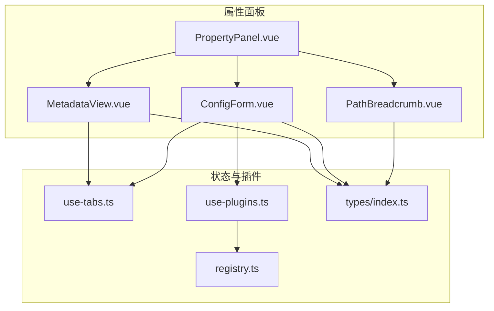
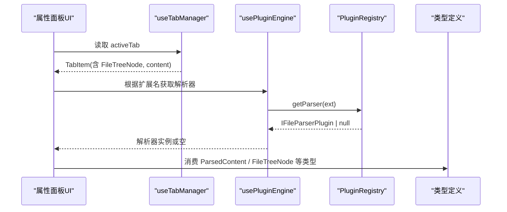
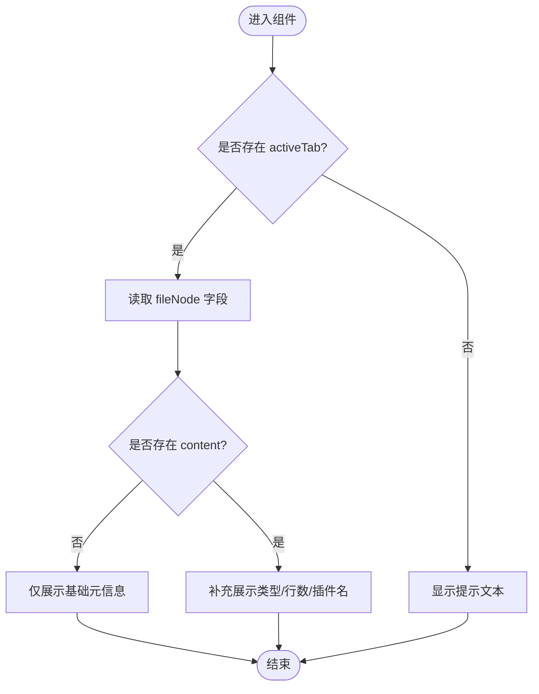
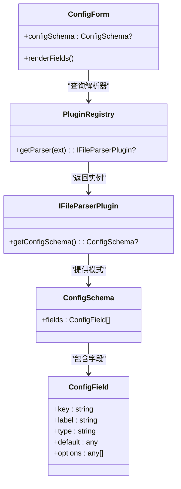
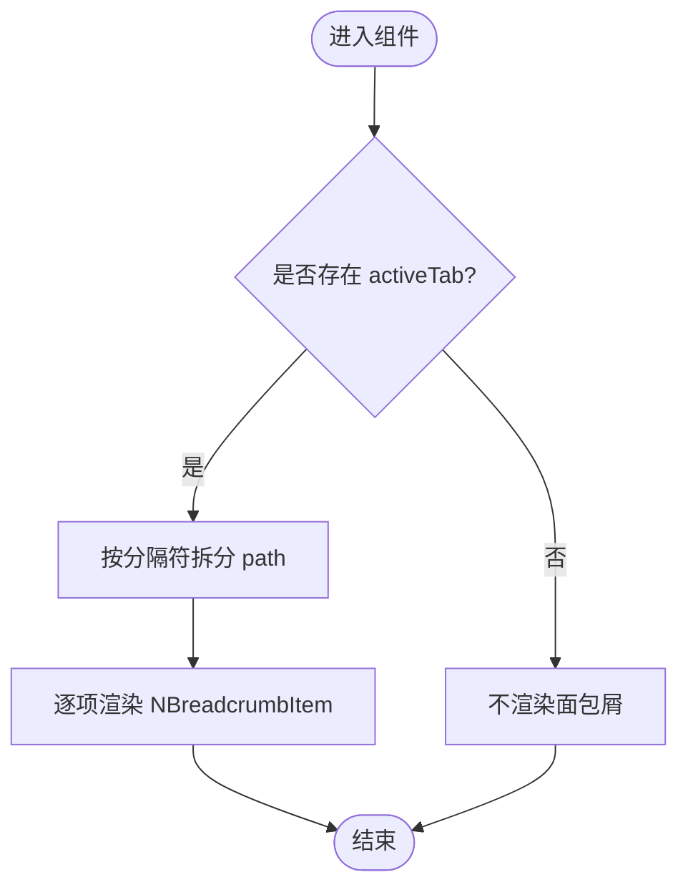
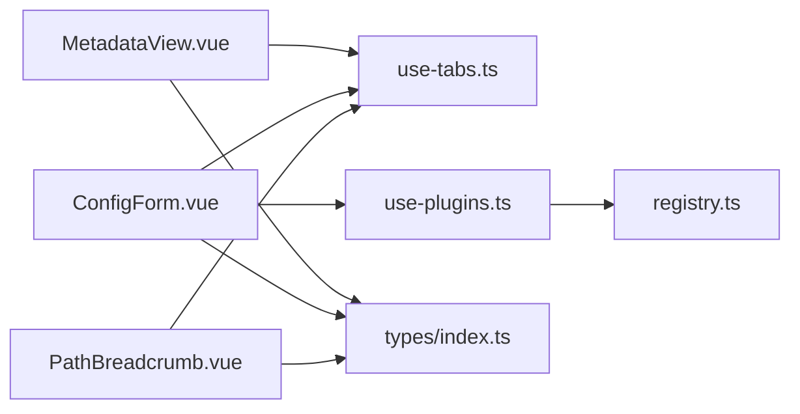

# 属性面板组件

<cite>
**本文引用的文件**
- [PropertyPanel.vue](file://src/components/property-panel/PropertyPanel.vue)
- [MetadataView.vue](file://src/components/property-panel/MetadataView.vue)
- [ConfigForm.vue](file://src/components/property-panel/ConfigForm.vue)
- [PathBreadcrumb.vue](file://src/components/property-panel/PathBreadcrumb.vue)
- [use-tabs.ts](file://src/composables/use-tabs.ts)
- [use-plugins.ts](file://src/composables/use-plugins.ts)
- [registry.ts](file://src/plugins/registry.ts)
- [index.ts](file://src/types/index.ts)
</cite>

## 目录
1. [简介](#简介)
2. [项目结构](#项目结构)
3. [核心组件](#核心组件)
4. [架构总览](#架构总览)
5. [详细组件分析](#详细组件分析)
6. [依赖关系分析](#依赖关系分析)
7. [性能考虑](#性能考虑)
8. [故障排查指南](#故障排查指南)
9. [结论](#结论)
10. [附录](#附录)

## 简介
本文件为“属性面板”相关组件的权威文档，覆盖以下四个子组件：
- PropertyPanel 属性面板容器
- MetadataView 元数据展示
- ConfigForm 配置表单（动态字段生成）
- PathBreadcrumb 路径面包屑

重点说明：
- 属性编辑器的表单控件、数据绑定与验证机制现状与建议
- 元数据展示的文件信息、解析结果与结构化呈现方式
- 配置表单的动态字段生成、类型支持与用户交互
- 路径面包屑的导航功能与层级展示
- 各组件的配置选项、事件处理与样式定制方法

## 项目结构
属性面板位于 src/components/property-panel 目录下，由一个容器组件和三个子组件组成。容器负责滚动布局与组合子组件；子组件分别承担元数据展示、动态配置表单与路径导航职责。

图表来源
- [PropertyPanel.vue:1-17](file://src/components/property-panel/PropertyPanel.vue#L1-L17)
- [MetadataView.vue:1-35](file://src/components/property-panel/MetadataView.vue#L1-L35)
- [ConfigForm.vue:1-37](file://src/components/property-panel/ConfigForm.vue#L1-L37)
- [PathBreadcrumb.vue:1-21](file://src/components/property-panel/PathBreadcrumb.vue#L1-L21)
- [use-tabs.ts:1-64](file://src/composables/use-tabs.ts#L1-L64)
- [use-plugins.ts:1-17](file://src/composables/use-plugins.ts#L1-L17)
- [registry.ts:1-118](file://src/plugins/registry.ts#L1-L118)
- [index.ts:1-71](file://src/types/index.ts#L1-L71)

章节来源
- [PropertyPanel.vue:1-17](file://src/components/property-panel/PropertyPanel.vue#L1-L17)
- [MetadataView.vue:1-35](file://src/components/property-panel/MetadataView.vue#L1-L35)
- [ConfigForm.vue:1-37](file://src/components/property-panel/ConfigForm.vue#L1-L37)
- [PathBreadcrumb.vue:1-21](file://src/components/property-panel/PathBreadcrumb.vue#L1-L21)

## 核心组件
- PropertyPanel：作为属性面板的容器，使用滚动条包裹并组合元数据、配置表单与路径面包屑。
- MetadataView：基于当前活动标签页，以描述列表形式展示文件名、路径、大小、类型、行数与解析插件等元信息。
- ConfigForm：根据当前文件的扩展名从插件注册表获取解析器，读取其配置模式，动态渲染输入、选择、开关与数字输入控件。
- PathBreadcrumb：将当前文件路径按分隔符切分为段，并以面包屑形式展示层级。

章节来源
- [PropertyPanel.vue:1-17](file://src/components/property-panel/PropertyPanel.vue#L1-L17)
- [MetadataView.vue:1-35](file://src/components/property-panel/MetadataView.vue#L1-L35)
- [ConfigForm.vue:1-37](file://src/components/property-panel/ConfigForm.vue#L1-L37)
- [PathBreadcrumb.vue:1-21](file://src/components/property-panel/PathBreadcrumb.vue#L1-L21)

## 架构总览
属性面板通过 useTabManager 获取当前活动标签页的数据，结合 usePluginEngine 访问插件注册表，从而驱动元数据展示与动态配置表单的渲染。

图表来源
- [use-tabs.ts:1-64](file://src/composables/use-tabs.ts#L1-L64)
- [use-plugins.ts:1-17](file://src/composables/use-plugins.ts#L1-L17)
- [registry.ts:1-118](file://src/plugins/registry.ts#L1-L118)
- [index.ts:1-71](file://src/types/index.ts#L1-L71)

## 详细组件分析

### PropertyPanel 属性面板容器
- 职责：提供垂直滚动容器，组合 MetadataView、ConfigForm、PathBreadcrumb。
- 布局：外层 div 高度占满，内部使用滚动条组件包裹三个子组件。
- 可定制性：可通过外部传入样式或替换滚动组件实现主题化与布局调整。

章节来源
- [PropertyPanel.vue:1-17](file://src/components/property-panel/PropertyPanel.vue#L1-L17)

### MetadataView 元数据展示
- 数据来源：activeTab.fileNode 与 activeTab.content。
- 展示字段：
  - 文件名、路径、大小
  - 类型、行数（当存在 content 时）
  - 解析插件名称（当存在 content 时）
- 交互：只读展示，无直接编辑能力。
- 样式：使用描述列表组件，尺寸与边框可通过 props 控制。

图表来源
- [MetadataView.vue:1-35](file://src/components/property-panel/MetadataView.vue#L1-L35)
- [use-tabs.ts:1-64](file://src/composables/use-tabs.ts#L1-L64)
- [index.ts:1-71](file://src/types/index.ts#L1-71)

章节来源
- [MetadataView.vue:1-35](file://src/components/property-panel/MetadataView.vue#L1-L35)
- [use-tabs.ts:1-64](file://src/composables/use-tabs.ts#L1-L64)
- [index.ts:1-71](file://src/types/index.ts#L1-71)

### ConfigForm 配置表单（动态字段生成）
- 动态字段来源：
  - 根据 activeTab.fileNode.label 提取扩展名
  - 通过 registry.getParser(ext) 获取解析器
  - 调用解析器的 getConfigSchema() 返回配置模式
- 支持的字段类型：
  - input：文本输入
  - select：下拉选择，支持 options 列表
  - switch：布尔开关
  - number：数值输入
- 数据绑定：
  - 当前实现使用 default-value 初始化控件值，未建立双向绑定与提交逻辑
- 验证机制：
  - 当前未集成表单校验规则
- 可扩展点：
  - 在解析器中实现 getConfigSchema 并提供 fields 数组
  - 在表单层增加 v-model 双向绑定、变更事件与校验规则
  - 将配置值回写至解析器或上层状态

图表来源
- [ConfigForm.vue:1-37](file://src/components/property-panel/ConfigForm.vue#L1-L37)
- [use-plugins.ts:1-17](file://src/composables/use-plugins.ts#L1-L17)
- [registry.ts:1-118](file://src/plugins/registry.ts#L1-L118)
- [index.ts:1-71](file://src/types/index.ts#L1-71)

章节来源
- [ConfigForm.vue:1-37](file://src/components/property-panel/ConfigForm.vue#L1-L37)
- [use-plugins.ts:1-17](file://src/composables/use-plugins.ts#L1-L17)
- [registry.ts:1-118](file://src/plugins/registry.ts#L1-L118)
- [index.ts:1-71](file://src/types/index.ts#L1-71)

### PathBreadcrumb 路径面包屑
- 数据来源：activeTab.fileNode.path
- 展示逻辑：按分隔符拆分路径段，逐段渲染为面包屑项
- 交互：当前仅为展示，无点击跳转行为
- 可定制性：可添加点击事件以触发导航或打开父级节点

图表来源
- [PathBreadcrumb.vue:1-21](file://src/components/property-panel/PathBreadcrumb.vue#L1-L21)
- [use-tabs.ts:1-64](file://src/composables/use-tabs.ts#L1-L64)
- [index.ts:1-71](file://src/types/index.ts#L1-71)

章节来源
- [PathBreadcrumb.vue:1-21](file://src/components/property-panel/PathBreadcrumb.vue#L1-L21)
- [use-tabs.ts:1-64](file://src/composables/use-tabs.ts#L1-L64)
- [index.ts:1-71](file://src/types/index.ts#L1-71)

## 依赖关系分析
- 组件耦合度
  - 三个子组件均依赖 useTabManager 提供的 activeTab，形成松耦合的状态共享
  - ConfigForm 额外依赖 usePluginEngine 与 PluginRegistry，用于动态加载配置模式
- 外部依赖
  - Naive UI 组件库用于表单、描述列表与面包屑
  - Vue 响应式系统驱动视图更新
- 潜在循环依赖
  - 当前未发现循环引用，组件与 composable、插件注册表之间为单向依赖

图表来源
- [MetadataView.vue:1-35](file://src/components/property-panel/MetadataView.vue#L1-L35)
- [ConfigForm.vue:1-37](file://src/components/property-panel/ConfigForm.vue#L1-L37)
- [PathBreadcrumb.vue:1-21](file://src/components/property-panel/PathBreadcrumb.vue#L1-L21)
- [use-tabs.ts:1-64](file://src/composables/use-tabs.ts#L1-L64)
- [use-plugins.ts:1-17](file://src/composables/use-plugins.ts#L1-L17)
- [registry.ts:1-118](file://src/plugins/registry.ts#L1-L118)
- [index.ts:1-71](file://src/types/index.ts#L1-71)

章节来源
- [use-tabs.ts:1-64](file://src/composables/use-tabs.ts#L1-L64)
- [use-plugins.ts:1-17](file://src/composables/use-plugins.ts#L1-L17)
- [registry.ts:1-118](file://src/plugins/registry.ts#L1-L118)
- [index.ts:1-71](file://src/types/index.ts#L1-71)

## 性能考虑
- 计算开销
  - ConfigForm 每次 activeTab 变化时重新计算 configSchema，属于轻量计算，影响较小
- 渲染优化
  - 仅在存在 activeTab 时渲染内容，避免不必要的 DOM 构建
- 建议
  - 若配置字段较多，可对字段进行懒加载或分页渲染
  - 对大型元数据集合采用虚拟滚动（如需要）

[本节为通用指导，不涉及具体文件分析]

## 故障排查指南
- 未显示元数据
  - 检查是否已打开标签页且 activeTab 非空
  - 确认 fileNode 与 content 字段存在
- 配置表单为空
  - 确认解析器实现了 getConfigSchema 并返回有效 fields
  - 检查扩展名匹配是否正确
- 面包屑为空
  - 确认 fileNode.path 存在且包含分隔符
- 插件不可用
  - 检查插件是否被禁用或注册失败

章节来源
- [MetadataView.vue:1-35](file://src/components/property-panel/MetadataView.vue#L1-L35)
- [ConfigForm.vue:1-37](file://src/components/property-panel/ConfigForm.vue#L1-L37)
- [PathBreadcrumb.vue:1-21](file://src/components/property-panel/PathBreadcrumb.vue#L1-L21)
- [registry.ts:1-118](file://src/plugins/registry.ts#L1-L118)

## 结论
属性面板组件通过清晰的职责划分与响应式数据流，提供了元数据展示、动态配置表单与路径导航的基础能力。当前配置表单尚未实现双向绑定与校验，建议在后续迭代中完善数据绑定、事件处理与验证机制，以提升用户体验与可维护性。

[本节为总结性内容，不涉及具体文件分析]

## 附录

### 配置选项与样式定制要点
- 容器组件
  - 可通过外层 div 的样式控制整体高度与边距
  - 滚动条组件的尺寸与外观可按需调整
- 元数据展示
  - 描述列表的尺寸、边框与对齐方式可通过 props 设置
- 配置表单
  - 表单尺寸、标签位置与控件尺寸可通过 props 统一设置
  - 字段默认值来自配置模式的 default 字段
- 面包屑
  - 可通过外层容器样式调整间距与字体大小

章节来源
- [PropertyPanel.vue:1-17](file://src/components/property-panel/PropertyPanel.vue#L1-L17)
- [MetadataView.vue:1-35](file://src/components/property-panel/MetadataView.vue#L1-L35)
- [ConfigForm.vue:1-37](file://src/components/property-panel/ConfigForm.vue#L1-L37)
- [PathBreadcrumb.vue:1-21](file://src/components/property-panel/PathBreadcrumb.vue#L1-L21)