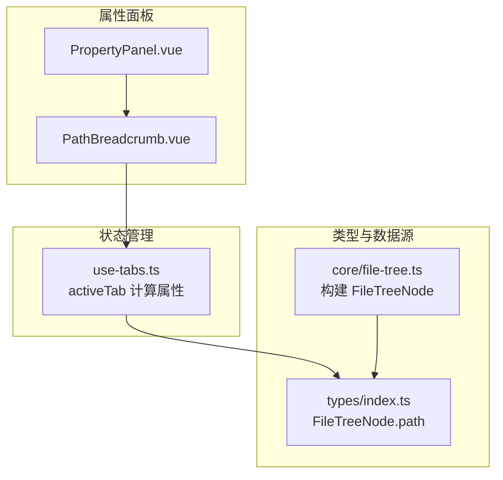
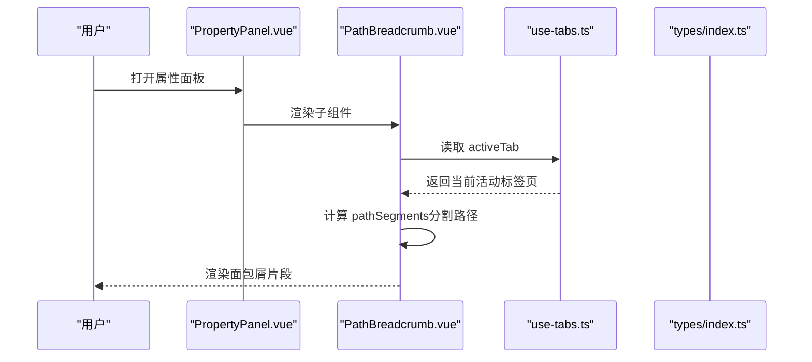
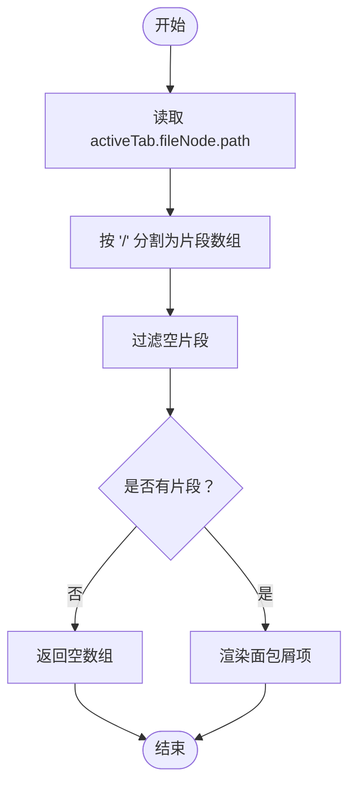
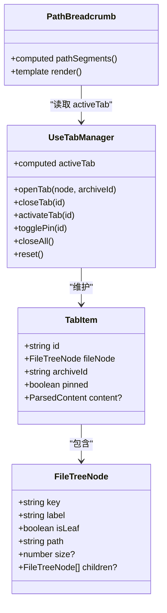

# 路径面包屑组件

<cite>
**本文引用的文件**   
- [PathBreadcrumb.vue](file://src/components/property-panel/PathBreadcrumb.vue)
- [PropertyPanel.vue](file://src/components/property-panel/PropertyPanel.vue)
- [use-tabs.ts](file://src/composables/use-tabs.ts)
- [index.ts（类型定义）](file://src/types/index.ts)
- [file-tree.ts](file://src/core/file-tree.ts)
</cite>

## 目录
1. [简介](#简介)
2. [项目结构](#项目结构)
3. [核心组件](#核心组件)
4. [架构总览](#架构总览)
5. [详细组件分析](#详细组件分析)
6. [依赖关系分析](#依赖关系分析)
7. [性能与可访问性](#性能与可访问性)
8. [故障排查指南](#故障排查指南)
9. [结论](#结论)
10. [附录：数据格式、事件与样式定制](#附录数据格式事件与样式定制)

## 简介
本文件为 PathBreadcrumb 路径面包屑组件的完整技术文档。该组件用于在属性面板中展示当前活动标签页对应文件的层级路径，并以面包屑形式呈现各段路径片段。当前实现聚焦于“只读展示”，不包含点击跳转、复制路径或右键菜单等交互；同时未内置响应式截断策略。后续可在不破坏现有接口的前提下扩展这些能力。

## 项目结构
PathBreadcrumb 位于属性面板模块下，作为 PropertyPanel 的子组件之一，通过 useTabManager 获取当前活动标签页的文件节点信息，并基于其 path 字段渲染路径片段。

图表来源
- [PropertyPanel.vue:1-17](file://src/components/property-panel/PropertyPanel.vue#L1-L17)
- [PathBreadcrumb.vue:1-21](file://src/components/property-panel/PathBreadcrumb.vue#L1-L21)
- [use-tabs.ts:1-64](file://src/composables/use-tabs.ts#L1-L64)
- [index.ts（类型定义）:17-24](file://src/types/index.ts#L17-L24)
- [file-tree.ts:1-68](file://src/core/file-tree.ts#L1-L68)

章节来源
- [PropertyPanel.vue:1-17](file://src/components/property-panel/PropertyPanel.vue#L1-L17)
- [PathBreadcrumb.vue:1-21](file://src/components/property-panel/PathBreadcrumb.vue#L1-L21)
- [use-tabs.ts:1-64](file://src/composables/use-tabs.ts#L1-L64)
- [index.ts（类型定义）:17-24](file://src/types/index.ts#L17-L24)
- [file-tree.ts:1-68](file://src/core/file-tree.ts#L1-L68)

## 核心组件
- 组件职责
  - 读取当前活动标签页对应的文件节点路径
  - 将路径按分隔符切分为若干片段
  - 以 Naive UI 的面包屑组件逐项渲染
- 关键输入
  - activeTab.fileNode.path：字符串路径，由 TabItem 中的 FileTreeNode 提供
- 输出
  - 面包屑项列表，每个项对应路径的一段名称

章节来源
- [PathBreadcrumb.vue:1-21](file://src/components/property-panel/PathBreadcrumb.vue#L1-L21)
- [use-tabs.ts:9-12](file://src/composables/use-tabs.ts#L9-L12)
- [index.ts（类型定义）:48-54](file://src/types/index.ts#L48-L54)

## 架构总览
PathBreadcrumb 的数据流遵循“状态驱动视图”的模式：
- 使用 useTabManager 暴露的 activeTab 计算属性，获得当前活动标签页
- 从 activeTab.value.fileNode.path 提取路径字符串
- 通过计算属性对路径进行分割与过滤，得到面包屑片段数组
- 模板层遍历片段并渲染 NBreadcrumbItem

图表来源
- [PropertyPanel.vue:1-17](file://src/components/property-panel/PropertyPanel.vue#L1-L17)
- [PathBreadcrumb.vue:1-21](file://src/components/property-panel/PathBreadcrumb.vue#L1-L21)
- [use-tabs.ts:9-12](file://src/composables/use-tabs.ts#L9-L12)
- [index.ts（类型定义）:48-54](file://src/types/index.ts#L48-L54)

## 详细组件分析

### 路径数据格式要求
- 数据来源
  - TabItem.fileNode：类型为 FileTreeNode
  - FileTreeNode.path：字符串路径
- 路径约定
  - 使用正斜杠 “/” 作为层级分隔符
  - 支持根路径前缀（如以 “/” 开头），空片段会被过滤
- 示例路径
  - “root/a.txt”
  - “/root/sub/b.log”

章节来源
- [index.ts（类型定义）:17-24](file://src/types/index.ts#L17-L24)
- [index.ts（类型定义）:48-54](file://src/types/index.ts#L48-L54)
- [file-tree.ts:13-23](file://src/core/file-tree.ts#L13-L23)

### 路径分割与层级关系构建
- 分割逻辑
  - 以 “/” 为分隔符拆分路径
  - 过滤空字符串片段，避免首尾分隔符导致的空项
- 层级关系
  - 顺序即层级：数组索引越小越靠近根
  - 面包屑项顺序与路径层级一致

图表来源
- [PathBreadcrumb.vue:8-11](file://src/components/property-panel/PathBreadcrumb.vue#L8-L11)

章节来源
- [PathBreadcrumb.vue:8-11](file://src/components/property-panel/PathBreadcrumb.vue#L8-L11)

### 导航链接生成与用户交互行为
- 当前实现
  - 仅展示路径片段，无点击跳转、复制路径或右键菜单操作
- 可扩展点
  - 可为每个 NBreadcrumbItem 添加点击事件，触发父级路径切换或打开对应目录
  - 可集成剪贴板 API 实现路径复制
  - 可结合上下文菜单库实现右键操作（如“在资源管理器中打开”、“复制路径”等）

章节来源
- [PathBreadcrumb.vue:14-20](file://src/components/property-panel/PathBreadcrumb.vue#L14-L20)

### 响应式布局适配与长路径截断策略
- 当前实现
  - 未内置针对长路径的截断或省略显示策略
  - 未显式处理不同屏幕宽度下的布局适配
- 可扩展点
  - 可使用 CSS 文本溢出省略（如 text-overflow: ellipsis）
  - 可引入 Tooltip 展示完整路径
  - 可根据容器宽度动态决定保留片段数量

章节来源
- [PathBreadcrumb.vue:14-20](file://src/components/property-panel/PathBreadcrumb.vue#L14-L20)

### 与文件系统操作的集成方式与错误处理机制
- 当前实现
  - 组件本身不直接调用文件系统 API
  - 路径来源于已构建好的 FileTreeNode，由上层流程负责加载与校验
- 潜在错误场景
  - activeTab 为空时，pathSegments 返回空数组，面包屑不渲染
  - 路径格式异常（非预期分隔符或缺失）可能导致片段不符合预期
- 建议的错误处理
  - 在更上层统一捕获并提示路径解析失败
  - 对非法路径进行规范化或回退到安全默认值

章节来源
- [PathBreadcrumb.vue:8-11](file://src/components/property-panel/PathBreadcrumb.vue#L8-L11)
- [use-tabs.ts:9-12](file://src/composables/use-tabs.ts#L9-L12)

## 依赖关系分析
- 组件依赖
  - Vue 计算属性：computed
  - Naive UI 面包屑组件：NBreadcrumb、NBreadcrumbItem
  - 标签页状态：useTabManager 提供的 activeTab
- 类型依赖
  - FileTreeNode.path：路径字符串
  - TabItem.fileNode：包含路径信息的文件节点

图表来源
- [PathBreadcrumb.vue:1-21](file://src/components/property-panel/PathBreadcrumb.vue#L1-L21)
- [use-tabs.ts:1-64](file://src/composables/use-tabs.ts#L1-L64)
- [index.ts（类型定义）:17-24](file://src/types/index.ts#L17-L24)
- [index.ts（类型定义）:48-54](file://src/types/index.ts#L48-L54)

章节来源
- [PathBreadcrumb.vue:1-21](file://src/components/property-panel/PathBreadcrumb.vue#L1-L21)
- [use-tabs.ts:1-64](file://src/composables/use-tabs.ts#L1-L64)
- [index.ts（类型定义）:17-24](file://src/types/index.ts#L17-L24)
- [index.ts（类型定义）:48-54](file://src/types/index.ts#L48-L54)

## 性能与可访问性
- 性能
  - 计算属性仅在 activeTab 变化时重新计算，开销极低
  - 路径分割与过滤为线性时间复杂度 O(n)，n 为路径片段数
- 可访问性
  - 面包屑语义化结构有助于屏幕阅读器理解层级关系
  - 若未来增加交互（如点击跳转），需确保键盘可达性与焦点管理

[本节为通用指导，无需具体文件引用]

## 故障排查指南
- 面包屑不显示
  - 检查 activeTab 是否为空
  - 确认 FileTreeNode.path 是否存在且非空
- 片段异常
  - 检查路径是否使用 “/” 作为分隔符
  - 注意首尾分隔符导致空片段的过滤行为
- 交互缺失
  - 如需点击跳转或复制路径，需在组件内新增事件处理逻辑

章节来源
- [PathBreadcrumb.vue:8-11](file://src/components/property-panel/PathBreadcrumb.vue#L8-L11)
- [use-tabs.ts:9-12](file://src/composables/use-tabs.ts#L9-L12)

## 结论
PathBreadcrumb 当前实现了路径的只读展示，具备清晰的数据流与低耦合的结构。其扩展点包括：
- 交互增强：点击跳转、复制路径、右键菜单
- 布局优化：长路径截断与工具提示
- 平台兼容：跨浏览器剪贴板与上下文菜单 API 的适配
在不改变现有数据契约的前提下，上述扩展均可平滑落地。

[本节为总结性内容，无需具体文件引用]

## 附录：数据格式、事件与样式定制

### 路径数据格式要求
- 字段来源
  - TabItem.fileNode.path：字符串路径
- 约定
  - 使用 “/” 作为层级分隔符
  - 允许根路径前缀（如 “/”）
  - 空片段将被过滤

章节来源
- [index.ts（类型定义）:17-24](file://src/types/index.ts#L17-L24)
- [index.ts（类型定义）:48-54](file://src/types/index.ts#L48-L54)

### 事件处理
- 当前事件
  - 无自定义事件
- 建议扩展
  - onSegmentClick(segmentIndex): 根据片段索引定位父级路径
  - onCopyPath(): 复制完整路径到剪贴板
  - onContextMenu(event, segmentIndex): 显示上下文菜单

章节来源
- [PathBreadcrumb.vue:14-20](file://src/components/property-panel/PathBreadcrumb.vue#L14-L20)

### 样式定制方法
- 当前样式
  - 使用内联样式设置上边距
- 建议定制
  - 通过 CSS 变量或主题系统覆盖 Naive UI 面包屑样式
  - 为长路径片段添加文本省略与 Tooltip

章节来源
- [PathBreadcrumb.vue:15](file://src/components/property-panel/PathBreadcrumb.vue#L15-L15)

### 不同平台兼容性说明
- 浏览器端
  - 剪贴板 API 需要 HTTPS 或本地开发环境
  - 上下文菜单在不同浏览器表现略有差异，建议使用统一封装
- 桌面端（Tauri）
  - 可通过 Tauri 命令调用系统文件管理器或原生剪贴板
  - 右键菜单可结合原生窗口上下文菜单提升体验

[本节为通用指导，无需具体文件引用]

### 使用示例
- 基本用法
  - 在属性面板中直接引入并渲染 PathBreadcrumb
- 组合示例
  - 与 MetadataView、ConfigForm 并列展示，形成完整的属性面板

章节来源
- [PropertyPanel.vue:1-17](file://src/components/property-panel/PropertyPanel.vue#L1-L17)
- [PathBreadcrumb.vue:14-20](file://src/components/property-panel/PathBreadcrumb.vue#L14-L20)