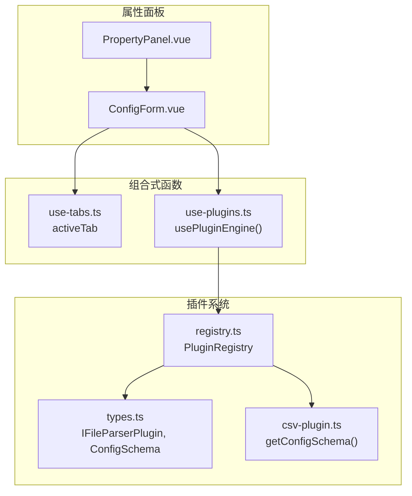
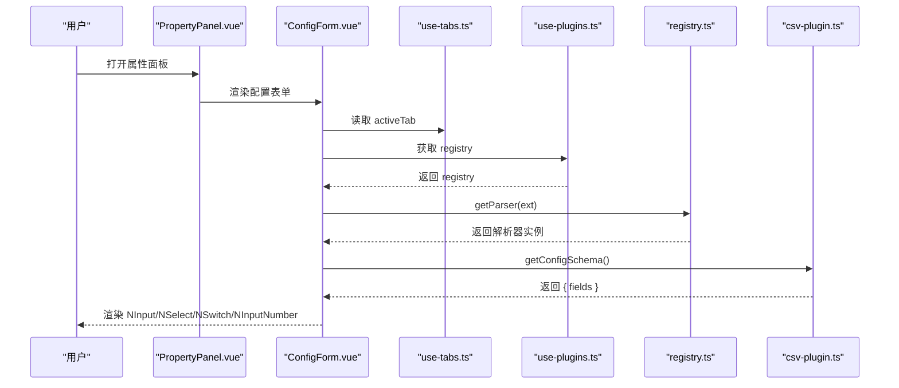
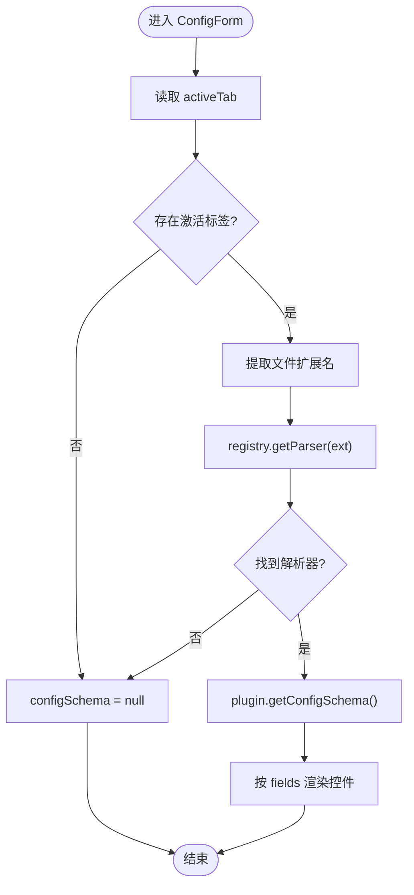
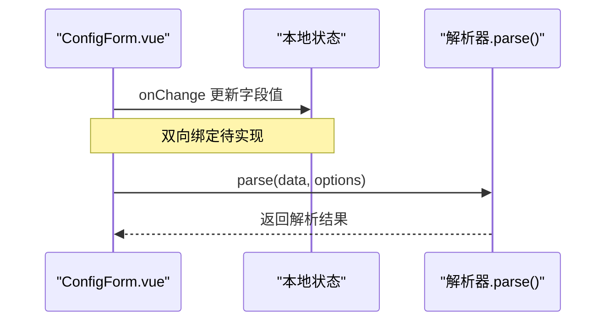
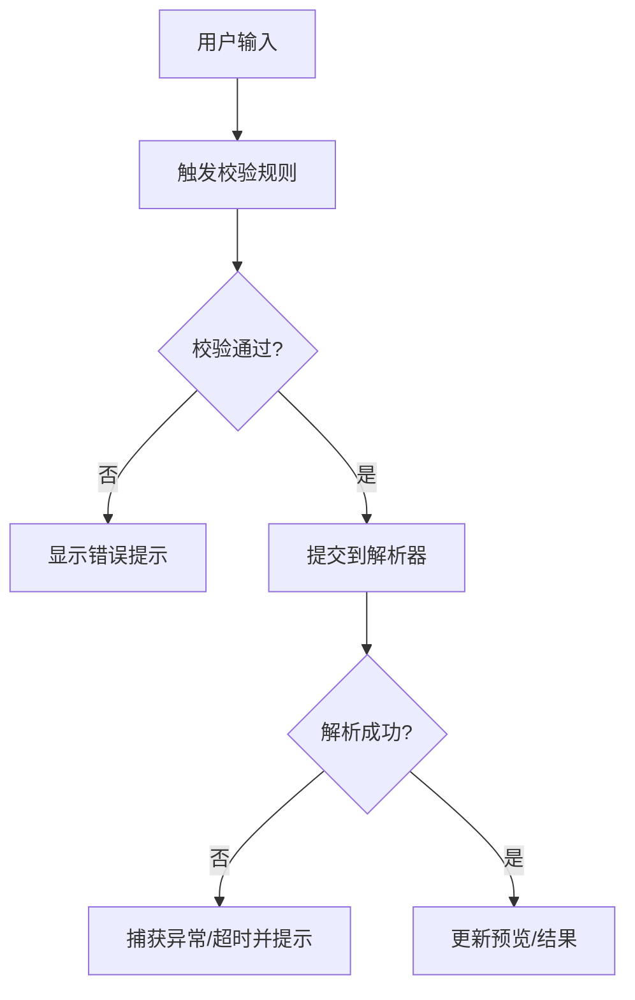
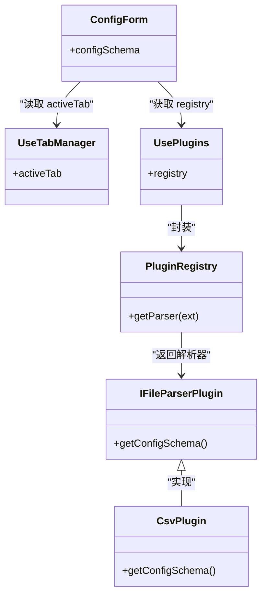

# 配置表单组件

<cite>
**本文引用的文件**
- [ConfigForm.vue](file://src/components/property-panel/ConfigForm.vue)
- [PropertyPanel.vue](file://src/components/property-panel/PropertyPanel.vue)
- [use-plugins.ts](file://src/composables/use-plugins.ts)
- [registry.ts](file://src/plugins/registry.ts)
- [types.ts](file://src/plugins/types.ts)
- [csv-plugin.ts](file://src/plugins/parser/csv-plugin.ts)
- [use-tabs.ts](file://src/composables/use-tabs.ts)
</cite>

## 目录
1. [简介](#简介)
2. [项目结构](#项目结构)
3. [核心组件](#核心组件)
4. [架构总览](#架构总览)
5. [详细组件分析](#详细组件分析)
6. [依赖关系分析](#依赖关系分析)
7. [性能与可扩展性](#性能与可扩展性)
8. [故障排查指南](#故障排查指南)
9. [结论](#结论)
10. [附录：配置接口与最佳实践](#附录配置接口与最佳实践)

## 简介
本文件围绕“配置表单组件”（ConfigForm）进行系统化文档化，重点覆盖以下方面：
- 动态表单字段的生成机制：字段类型检测、验证规则扩展点、默认值处理
- 表单控件渲染策略：文本输入、下拉选择、开关切换、数字输入等交互模式
- 数据绑定与变更监听：当前实现为单向展示，提供双向同步与变更监听的扩展方案
- 错误处理与用户反馈：空配置、插件缺失、超时与异常场景的处理建议
- 组件配置接口、事件回调与样式定制选项
- 复杂表单场景的实现示例与最佳实践

## 项目结构
ConfigForm 位于属性面板中，通过标签页上下文与插件注册表协作，根据当前激活文件的扩展名动态获取对应解析器的配置 Schema，并据此渲染表单。

图表来源
- [PropertyPanel.vue:1-16](file://src/components/property-panel/PropertyPanel.vue#L1-L16)
- [ConfigForm.vue:1-36](file://src/components/property-panel/ConfigForm.vue#L1-L36)
- [use-tabs.ts:1-64](file://src/composables/use-tabs.ts#L1-L64)
- [use-plugins.ts:1-17](file://src/composables/use-plugins.ts#L1-L17)
- [registry.ts:1-118](file://src/plugins/registry.ts#L1-L118)
- [types.ts:1-37](file://src/plugins/types.ts#L1-L37)
- [csv-plugin.ts:1-28](file://src/plugins/parser/csv-plugin.ts#L1-L28)

章节来源
- [PropertyPanel.vue:1-16](file://src/components/property-panel/PropertyPanel.vue#L1-L16)
- [ConfigForm.vue:1-36](file://src/components/property-panel/ConfigForm.vue#L1-L36)
- [use-tabs.ts:1-64](file://src/composables/use-tabs.ts#L1-L64)
- [use-plugins.ts:1-17](file://src/composables/use-plugins.ts#L1-L17)
- [registry.ts:1-118](file://src/plugins/registry.ts#L1-L118)
- [types.ts:1-37](file://src/plugins/types.ts#L1-L37)
- [csv-plugin.ts:1-28](file://src/plugins/parser/csv-plugin.ts#L1-L28)

## 核心组件
- 组件职责
  - 读取当前激活标签页的文件信息
  - 基于文件扩展名从插件注册表获取解析器
  - 调用解析器的 getConfigSchema 获取字段定义
  - 按字段类型渲染 Naive UI 控件
- 关键依赖
  - useTabManager：提供 activeTab 计算属性
  - usePluginEngine：暴露 registry 实例，用于查询解析器
  - PluginRegistry：维护解析器映射并提供 getParser(ext)
  - IFileParserPlugin / ConfigSchema：定义可选的 getConfigSchema 方法与字段结构

章节来源
- [ConfigForm.vue:1-36](file://src/components/property-panel/ConfigForm.vue#L1-L36)
- [use-tabs.ts:1-64](file://src/composables/use-tabs.ts#L1-L64)
- [use-plugins.ts:1-17](file://src/composables/use-plugins.ts#L1-L17)
- [registry.ts:1-118](file://src/plugins/registry.ts#L1-L118)
- [types.ts:1-37](file://src/plugins/types.ts#L1-L37)

## 架构总览
下图展示了 ConfigForm 在运行时如何联动标签页、插件引擎与具体插件，完成“动态表单”的生成与渲染。

图表来源
- [ConfigForm.vue:1-36](file://src/components/property-panel/ConfigForm.vue#L1-L36)
- [use-tabs.ts:1-64](file://src/composables/use-tabs.ts#L1-L64)
- [use-plugins.ts:1-17](file://src/composables/use-plugins.ts#L1-L17)
- [registry.ts:1-118](file://src/plugins/registry.ts#L1-L118)
- [csv-plugin.ts:1-28](file://src/plugins/parser/csv-plugin.ts#L1-L28)

## 详细组件分析

### 动态字段生成机制
- 字段来源
  - 由解析器实现的 getConfigSchema 返回 ConfigSchema，包含 fields 数组
  - 每个字段具备 key、label、type、default，select 类型可带 options
- 字段类型检测
  - 模板中使用 v-if/v-else-if 分支判断 field.type
  - 支持 input、select、switch、number 四种类型
- 默认值处理
  - 各控件通过 defaultValue 初始化显示值
  - 注意：当前未将默认值写入任何持久状态或传递给解析器

图表来源
- [ConfigForm.vue:1-36](file://src/components/property-panel/ConfigForm.vue#L1-L36)
- [registry.ts:1-118](file://src/plugins/registry.ts#L1-L118)
- [types.ts:1-37](file://src/plugins/types.ts#L1-L37)

章节来源
- [ConfigForm.vue:1-36](file://src/components/property-panel/ConfigForm.vue#L1-L36)
- [types.ts:1-37](file://src/plugins/types.ts#L1-L37)
- [csv-plugin.ts:1-28](file://src/plugins/parser/csv-plugin.ts#L1-L28)

### 表单控件渲染策略
- 文本输入：NInput，适用于分隔符、路径等字符串配置
- 下拉选择：NSelect，适用于枚举型配置项，如日志级别、编码格式等
- 开关切换：NSwitch，适用于布尔型开关，如是否固定表头
- 数字输入：NInputNumber，适用于数值型配置，如阈值、大小限制等

说明
- 当前所有控件仅使用 defaultValue 初始化，未建立双向绑定
- 若需用户修改后生效，需要引入受控模式与变更监听（见“数据绑定与变更监听”）

章节来源
- [ConfigForm.vue:1-36](file://src/components/property-panel/ConfigForm.vue#L1-36)

### 数据绑定与变更监听
现状
- 当前表单为只读展示，用户无法修改配置；更改不会回写至任何状态或传递给解析器

建议方案
- 引入本地响应式对象保存当前表单值，并在解析器执行时作为 options 传入
- 对每个控件绑定 change 事件，更新本地状态
- 在解析器 parse(data, options) 中消费这些配置项

图表来源
- [ConfigForm.vue:1-36](file://src/components/property-panel/ConfigForm.vue#L1-36)
- [csv-plugin.ts:1-28](file://src/plugins/parser/csv-plugin.ts#L1-28)

章节来源
- [ConfigForm.vue:1-36](file://src/components/property-panel/ConfigForm.vue#L1-36)
- [csv-plugin.ts:1-28](file://src/plugins/parser/csv-plugin.ts#L1-28)

### 验证规则与错误处理
现状
- 当前未实现字段级校验与错误提示
- 当无激活标签或无对应解析器时，表单不渲染

建议方案
- 在 ConfigField 中扩展 validation 字段，例如 required、pattern、min/max、enum 等
- 在表单层统一校验，失败时显示错误消息
- 对解析器执行增加超时与异常捕获，避免阻塞 UI

图表来源
- [ConfigForm.vue:1-36](file://src/components/property-panel/ConfigForm.vue#L1-36)
- [registry.ts:1-118](file://src/plugins/registry.ts#L1-L118)

章节来源
- [ConfigForm.vue:1-36](file://src/components/property-panel/ConfigForm.vue#L1-36)
- [registry.ts:1-118](file://src/plugins/registry.ts#L1-L118)

### 配置接口定义
- ConfigField
  - key：字段唯一标识
  - label：显示标签
  - type：input | select | switch | number
  - default：初始值
  - options：select 类型的选项列表，每项含 label 与 value
- ConfigSchema
  - fields：字段定义数组
- IFileParserPlugin
  - 可选方法 getConfigSchema(): ConfigSchema

章节来源
- [types.ts:1-37](file://src/plugins/types.ts#L1-L37)

### 典型插件示例：CSV 解析器
- 提供两个配置项：分隔符（input）、固定表头（switch）
- 解析时根据 options.delimiter 决定分隔符

章节来源
- [csv-plugin.ts:1-28](file://src/plugins/parser/csv-plugin.ts#L1-28)

## 依赖关系分析
- 组件耦合
  - ConfigForm 依赖 useTabManager 获取当前文件上下文
  - 通过 usePluginEngine 访问全局注册表，解耦具体插件实现
- 外部依赖
  - Naive UI 表单控件
  - Vue 响应式 API（computed）

图表来源
- [ConfigForm.vue:1-36](file://src/components/property-panel/ConfigForm.vue#L1-36)
- [use-tabs.ts:1-64](file://src/composables/use-tabs.ts#L1-L64)
- [use-plugins.ts:1-17](file://src/composables/use-plugins.ts#L1-L17)
- [registry.ts:1-118](file://src/plugins/registry.ts#L1-L118)
- [types.ts:1-37](file://src/plugins/types.ts#L1-L37)
- [csv-plugin.ts:1-28](file://src/plugins/parser/csv-plugin.ts#L1-28)

章节来源
- [ConfigForm.vue:1-36](file://src/components/property-panel/ConfigForm.vue#L1-36)
- [use-tabs.ts:1-64](file://src/composables/use-tabs.ts#L1-L64)
- [use-plugins.ts:1-17](file://src/composables/use-plugins.ts#L1-L17)
- [registry.ts:1-118](file://src/plugins/registry.ts#L1-L118)
- [types.ts:1-37](file://src/plugins/types.ts#L1-L37)
- [csv-plugin.ts:1-28](file://src/plugins/parser/csv-plugin.ts#L1-28)

## 性能与可扩展性
- 计算属性缓存
  - configSchema 基于 activeTab 计算，避免重复解析
- 插件发现开销
  - getParser(ext) 为 O(1) 查找，整体开销低
- 可扩展性
  - 新增字段类型只需在模板中添加分支，并在解析器中消费相应 options
  - 可在 ConfigField 中扩展校验、占位符、禁用态、分组等元信息

[本节为通用指导，无需源码引用]

## 故障排查指南
- 表单不显示
  - 检查是否存在激活标签页
  - 确认文件扩展名是否正确匹配到解析器
- 配置项为空或缺失
  - 确认解析器实现了 getConfigSchema
  - 检查注册表是否启用该解析器
- 解析器执行异常或超时
  - 参考注册表的 safeParse/safeDecompress 超时与异常兜底逻辑
  - 建议在表单层增加加载态与错误提示

章节来源
- [ConfigForm.vue:1-36](file://src/components/property-panel/ConfigForm.vue#L1-36)
- [registry.ts:1-118](file://src/plugins/registry.ts#L1-L118)

## 结论
ConfigForm 以“声明式 Schema + 条件渲染”的方式实现了轻量级的动态配置表单。其优势在于与插件体系天然契合、扩展成本低。下一步建议优先补齐双向绑定、变更监听与基础校验能力，使配置能够真正影响解析行为，并提升用户体验与健壮性。

[本节为总结，无需源码引用]

## 附录：配置接口与最佳实践

### 配置接口速览
- ConfigField
  - key：字段键名
  - label：显示名称
  - type：input | select | switch | number
  - default：默认值
  - options：select 类型时的选项列表
- ConfigSchema
  - fields：字段数组
- IFileParserPlugin
  - getConfigSchema?(): ConfigSchema

章节来源
- [types.ts:1-37](file://src/plugins/types.ts#L1-L37)

### 最佳实践清单
- 字段设计
  - 保持字段最小可用，避免一次性暴露过多参数
  - 为 select 提供合理的默认选项与文案
- 默认值
  - 合理设置 default，减少用户操作成本
- 校验
  - 至少实现必填与基本格式校验
  - 对数值型字段提供范围约束
- 交互
  - 为耗时操作提供 loading 与错误提示
  - 变更后立即反馈效果（如预览刷新）
- 可测试性
  - 为解析器单元测试覆盖不同 options 组合
  - 为表单组件编写边界用例（空 schema、非法值等）

[本节为通用指导，无需源码引用]