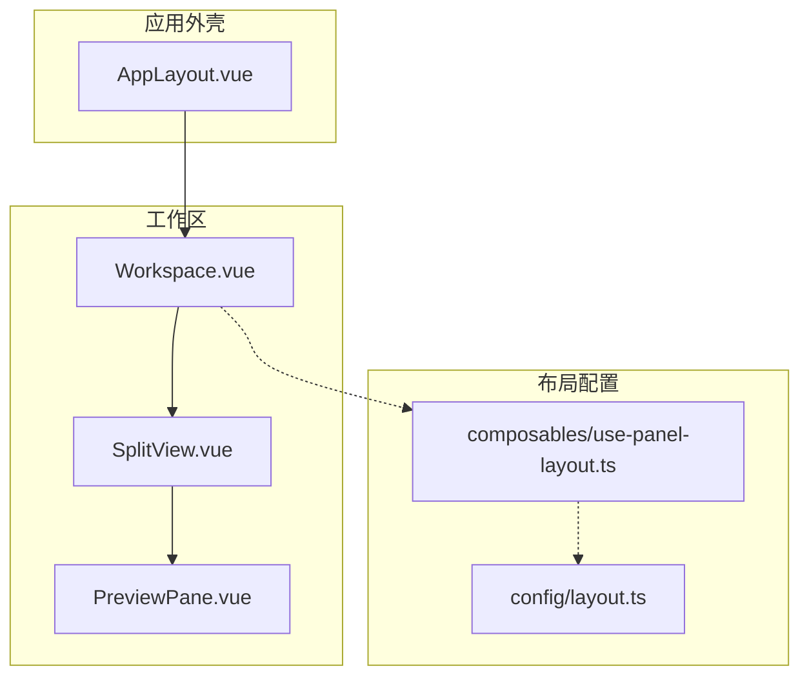
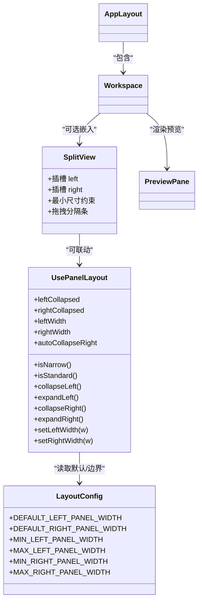
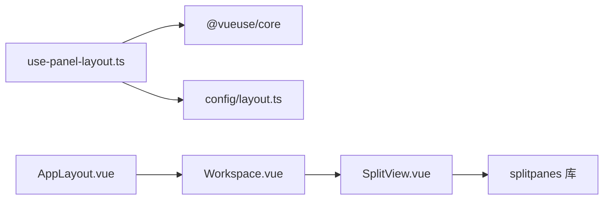
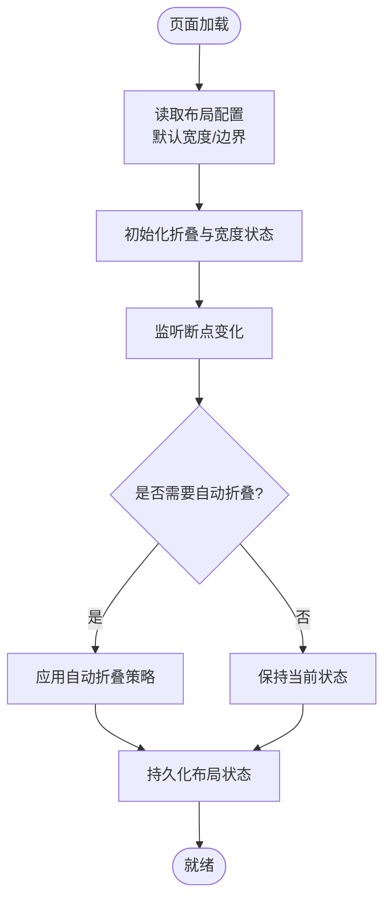

# 分割视图组件

<cite>
**本文引用的文件**   
- [SplitView.vue](file://src/components/workspace/SplitView.vue)
- [use-panel-layout.ts](file://src/composables/use-panel-layout.ts)
- [layout.ts](file://src/config/layout.ts)
- [AppLayout.vue](file://src/layout/AppLayout.vue)
- [Workspace.vue](file://src/components/workspace/Workspace.vue)
- [PreviewPane.vue](file://src/components/workspace/PreviewPane.vue)
</cite>

## 目录
1. [简介](#简介)
2. [项目结构](#项目结构)
3. [核心组件与能力](#核心组件与能力)
4. [架构总览](#架构总览)
5. [详细组件分析](#详细组件分析)
6. [依赖关系分析](#依赖关系分析)
7. [性能与体验优化](#性能与体验优化)
8. [故障排查指南](#故障排查指南)
9. [结论](#结论)
10. [附录：扩展与自定义指南](#附录扩展与自定义指南)

## 简介
本文件围绕 SplitView 分割视图组件，系统性说明双栏布局的实现原理与使用方式。内容涵盖面板大小调整、拖拽分隔条、响应式适配、布局状态管理、最小/最大尺寸限制、键盘快捷键支持、与父组件的数据绑定机制、布局配置持久化存储方案，以及面向二次开发的扩展方法（新增分割区域、自定义分隔样式等）。

## 项目结构
当前仓库中，SplitView 位于工作区组件目录下，配合布局常量与组合式函数共同构成“可拖拽分栏 + 响应式折叠”的布局体系。整体结构如下：

图表来源
- [AppLayout.vue:1-120](file://src/layout/AppLayout.vue#L1-L120)
- [Workspace.vue:1-36](file://src/components/workspace/Workspace.vue#L1-L36)
- [SplitView.vue:1-15](file://src/components/workspace/SplitView.vue#L1-L15)
- [PreviewPane.vue:1-58](file://src/components/workspace/PreviewPane.vue#L1-L58)
- [layout.ts:1-9](file://src/config/layout.ts#L1-L9)
- [use-panel-layout.ts:1-38](file://src/composables/use-panel-layout.ts#L1-L38)

章节来源
- [AppLayout.vue:1-120](file://src/layout/AppLayout.vue#L1-L120)
- [Workspace.vue:1-36](file://src/components/workspace/Workspace.vue#L1-L36)
- [SplitView.vue:1-15](file://src/components/workspace/SplitView.vue#L1-L15)
- [PreviewPane.vue:1-58](file://src/components/workspace/PreviewPane.vue#L1-L58)
- [layout.ts:1-9](file://src/config/layout.ts#L1-L9)
- [use-panel-layout.ts:1-38](file://src/composables/use-panel-layout.ts#L1-L38)

## 核心组件与能力
- SplitView 组件：基于 splitpanes 库实现的双栏容器，提供左右两个 Pane 插槽，内置最小尺寸约束与拖拽分隔条。
- use-panel-layout 组合式函数：维护面板折叠状态、宽度值、断点判断与自动折叠策略，并提供设置宽度的受控方法。
- layout 配置常量：集中定义默认宽度与最小/最大宽度边界，便于统一管理与后续持久化。
- AppLayout 与 Workspace：在应用壳与工作区内组织三栏布局（左/中/右），其中中间工作区可接入 SplitView 进行内部再拆分。

章节来源
- [SplitView.vue:1-15](file://src/components/workspace/SplitView.vue#L1-L15)
- [use-panel-layout.ts:1-38](file://src/composables/use-panel-layout.ts#L1-L38)
- [layout.ts:1-9](file://src/config/layout.ts#L1-L9)
- [AppLayout.vue:1-120](file://src/layout/AppLayout.vue#L1-L120)
- [Workspace.vue:1-36](file://src/components/workspace/Workspace.vue#L1-L36)

## 架构总览
下图展示了 SplitView 与其周边组件、配置与组合式函数的交互关系。

图表来源
- [SplitView.vue:1-15](file://src/components/workspace/SplitView.vue#L1-L15)
- [use-panel-layout.ts:1-38](file://src/composables/use-panel-layout.ts#L1-L38)
- [layout.ts:1-9](file://src/config/layout.ts#L1-L9)
- [AppLayout.vue:1-120](file://src/layout/AppLayout.vue#L1-L120)
- [Workspace.vue:1-36](file://src/components/workspace/Workspace.vue#L1-L36)
- [PreviewPane.vue:1-58](file://src/components/workspace/PreviewPane.vue#L1-L58)

## 详细组件分析

### SplitView 组件
- 功能定位：作为可拖拽分栏容器，将内容划分为左右两栏，通过分隔条拖动调整宽度。
- 关键特性：
  - 最小尺寸：每个 Pane 均设置了最小尺寸，防止被过度压缩。
  - 拖拽分隔条：由底层 splitpanes 提供，支持鼠标/触摸拖拽。
  - 插槽：提供 left 与 right 两个命名插槽，用于注入具体面板内容。
- 集成建议：
  - 若需要与外部状态联动，可在父组件中监听 resize/resized 事件并同步到 store 或本地存储。
  - 如需水平方向拆分，可将容器切换为水平模式（由 splitpanes 支持）。

章节来源
- [SplitView.vue:1-15](file://src/components/workspace/SplitView.vue#L1-L15)

### use-panel-layout 组合式函数
- 职责：集中管理面板折叠与宽度状态，提供断点判断与自动折叠策略，暴露受控的宽度设置方法以保障最小/最大范围。
- 主要状态与方法：
  - 折叠状态：leftCollapsed、rightCollapsed
  - 宽度状态：leftWidth、rightWidth
  - 断点：isNarrow、isStandard
  - 自动折叠：autoCollapseRight（窄屏/标准屏时自动收起右侧）
  - 受控设置：setLeftWidth、setRightWidth（内部做边界裁剪）
- 与配置的关系：
  - 宽度边界逻辑与 config/layout.ts 中的常量保持一致，便于统一维护。

章节来源
- [use-panel-layout.ts:1-38](file://src/composables/use-panel-layout.ts#L1-L38)
- [layout.ts:1-9](file://src/config/layout.ts#L1-L9)

### 布局配置常量
- 作用：集中定义默认宽度与最小/最大宽度边界，避免散落在各组件中导致不一致。
- 字段说明：
  - 默认宽度：左侧、右侧
  - 边界限制：左侧最小/最大、右侧最小/最大

章节来源
- [layout.ts:1-9](file://src/config/layout.ts#L1-L9)

### AppLayout 与 Workspace 的布局组织
- AppLayout：采用 CSS Grid 构建顶部导航、主体内容、底部版权三行；主体内容使用 flex 三栏（左/中/右），并通过按钮控制左右面板的折叠。
- Workspace：承载标签页、工具栏、预览区与状态栏，可作为 SplitView 的宿主容器，以便在工作区内部再做二次拆分。

章节来源
- [AppLayout.vue:1-120](file://src/layout/AppLayout.vue#L1-L120)
- [Workspace.vue:1-36](file://src/components/workspace/Workspace.vue#L1-L36)

## 依赖关系分析
- 外部依赖：splitpanes 提供拖拽分隔条与尺寸计算能力。
- 内部依赖：
  - SplitView 依赖 splitpanes 提供的 Splitpanes 与 Pane 组件。
  - use-panel-layout 依赖 @vueuse/core 的断点能力。
  - 布局常量集中于 layout.ts，供组合式函数与组件引用。

图表来源
- [SplitView.vue:1-15](file://src/components/workspace/SplitView.vue#L1-L15)
- [use-panel-layout.ts:1-38](file://src/composables/use-panel-layout.ts#L1-L38)
- [layout.ts:1-9](file://src/config/layout.ts#L1-L9)
- [AppLayout.vue:1-120](file://src/layout/AppLayout.vue#L1-L120)
- [Workspace.vue:1-36](file://src/components/workspace/Workspace.vue#L1-L36)

章节来源
- [SplitView.vue:1-15](file://src/components/workspace/SplitView.vue#L1-L15)
- [use-panel-layout.ts:1-38](file://src/composables/use-panel-layout.ts#L1-L38)
- [layout.ts:1-9](file://src/config/layout.ts#L1-L9)
- [AppLayout.vue:1-120](file://src/layout/AppLayout.vue#L1-L120)
- [Workspace.vue:1-36](file://src/components/workspace/Workspace.vue#L1-L36)

## 性能与体验优化
- 拖拽性能：splitpanes 在拖拽过程中会禁用过渡动画以减少重排开销，提升流畅度。
- 响应式：结合断点自动折叠右侧面板，在小屏幕下提升可用性。
- 内存与渲染：仅在需要时加载预览引擎与渲染器，避免不必要的初始化。

[本节为通用指导，不直接分析具体文件]

## 故障排查指南
- 分隔条不可用或无法拖拽
  - 检查 SplitView 是否处于可见且具备高度（例如父容器未设置高度会导致无可用空间）。
  - 确认未覆盖 splitpanes 的交互样式（如 pointer-events 被禁止）。
- 面板尺寸异常
  - 检查 Pane 的最小/最大尺寸设置是否与业务期望一致。
  - 若使用 setLeftWidth/setRightWidth，确保传入值在允许范围内。
- 自动折叠不符合预期
  - 核对断点阈值与 autoCollapseRight 的计算逻辑，必要时调整断点配置。

章节来源
- [SplitView.vue:1-15](file://src/components/workspace/SplitView.vue#L1-L15)
- [use-panel-layout.ts:1-38](file://src/composables/use-panel-layout.ts#L1-L38)

## 结论
SplitView 基于成熟的 splitpanes 库，提供了开箱即用的双栏拖拽布局能力；配合 use-panel-layout 与布局常量，实现了状态集中管理、响应式适配与边界约束。通过插槽与组合式函数，开发者可以灵活地将任意面板嵌入 SplitView，并在需要时扩展为多栏或自定义样式。

[本节为总结性内容，不直接分析具体文件]

## 附录：扩展与自定义指南

### 添加新的分割区域（三栏及以上）
- 思路：在 SplitView 内增加更多 Pane，并为每个 Pane 设置合适的 min/max 尺寸，保证拖拽时的合理分配。
- 步骤要点：
  - 在 SplitView 模板中添加新的 Pane 节点，并为其命名插槽。
  - 为新增 Pane 设置合理的 min-size 与 max-size，避免极端情况下的挤压。
  - 在父组件中通过插槽向新 Pane 注入内容。
- 注意事项：
  - 当 Pane 数量增多时，需关注初始尺寸分配与最小尺寸的总和不超过容器尺寸。
  - 若需要更复杂的布局（如嵌套拆分），可在某个 Pane 内再次嵌套 SplitView。

章节来源
- [SplitView.vue:1-15](file://src/components/workspace/SplitView.vue#L1-L15)

### 自定义分隔条样式
- 目标：修改分隔条颜色、宽度、悬停效果等视觉表现。
- 方法：
  - 通过覆盖 splitpanes 的类名样式（如分隔条伪元素）来自定义外观。
  - 在主题变量或全局样式中统一调整分隔条相关样式，保持与应用主题一致。
- 建议：
  - 保持分隔条的可点击性与可聚焦性，兼顾无障碍访问。
  - 在拖拽过程中避免引入昂贵的动画，以免影响性能。

章节来源
- [SplitView.vue:1-15](file://src/components/workspace/SplitView.vue#L1-L15)

### 与父组件的数据绑定机制
- 双向绑定建议：
  - 使用 v-model 或显式的 value/updateXxx 模式，将 SplitView 的 pane 尺寸变化同步到父组件状态。
  - 在父组件中监听 resize/resized 事件，将最新尺寸写入 store 或本地存储。
- 受控更新：
  - 通过 use-panel-layout 的 setLeftWidth/setRightWidth 对宽度进行受控更新，确保在最小/最大范围内。

章节来源
- [use-panel-layout.ts:1-38](file://src/composables/use-panel-layout.ts#L1-L38)
- [SplitView.vue:1-15](file://src/components/workspace/SplitView.vue#L1-L15)

### 布局配置的持久化存储
- 存储项建议：
  - 面板折叠状态：leftCollapsed、rightCollapsed
  - 面板宽度：leftWidth、rightWidth
  - 断点策略：autoCollapseRight 开关或断点阈值
- 存储时机：
  - 用户交互变更时立即保存（如拖拽结束、折叠切换）。
  - 应用启动时从存储恢复，优先于默认配置。
- 存储位置：
  - 浏览器环境：localStorage/sessionStorage
  - Tauri 桌面环境：可使用平台适配层读写本地文件或安全存储（根据项目现有适配器扩展）

章节来源
- [use-panel-layout.ts:1-38](file://src/composables/use-panel-layout.ts#L1-L38)
- [layout.ts:1-9](file://src/config/layout.ts#L1-L9)

### 键盘快捷键支持
- 行为说明：
  - 在分隔条获得焦点时，可通过方向键调整相邻面板尺寸（步长由配置决定）。
- 使用建议：
  - 为分隔条提供清晰的焦点指示与提示文本。
  - 在移动端或触屏设备上，键盘操作应退化为手势或按钮控制。

章节来源
- [SplitView.vue:1-15](file://src/components/workspace/SplitView.vue#L1-L15)

### 响应式适配流程

图表来源
- [use-panel-layout.ts:1-38](file://src/composables/use-panel-layout.ts#L1-L38)
- [layout.ts:1-9](file://src/config/layout.ts#L1-L9)

章节来源
- [use-panel-layout.ts:1-38](file://src/composables/use-panel-layout.ts#L1-L38)
- [layout.ts:1-9](file://src/config/layout.ts#L1-L9)