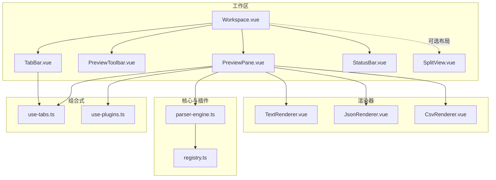
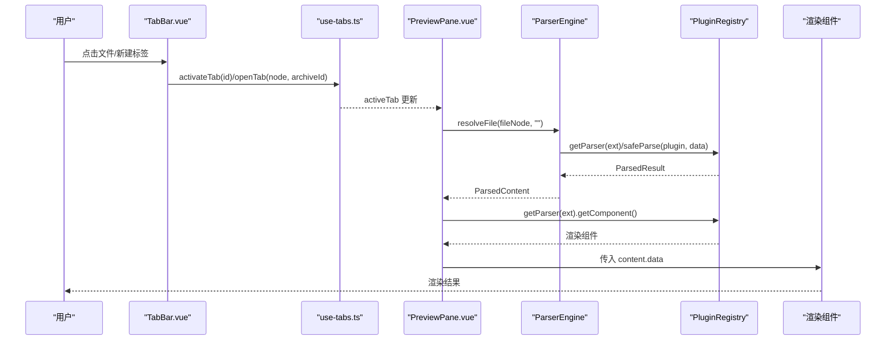
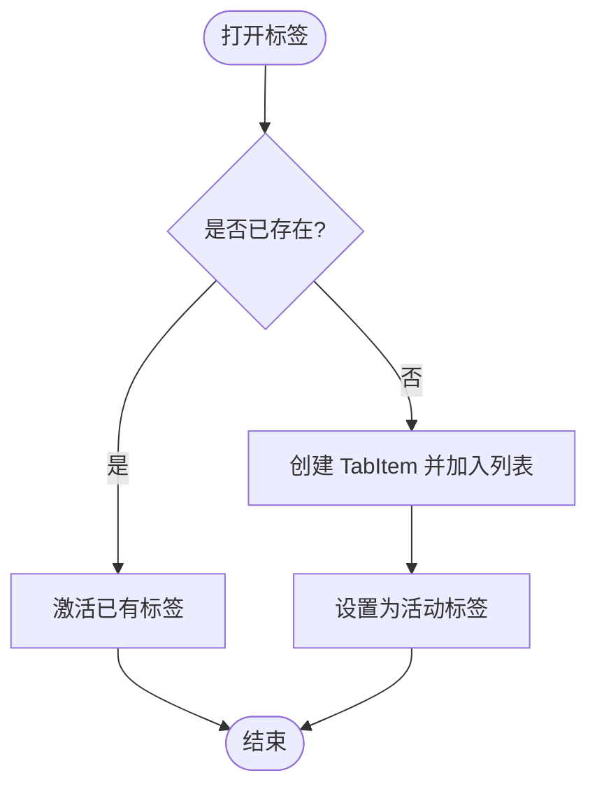
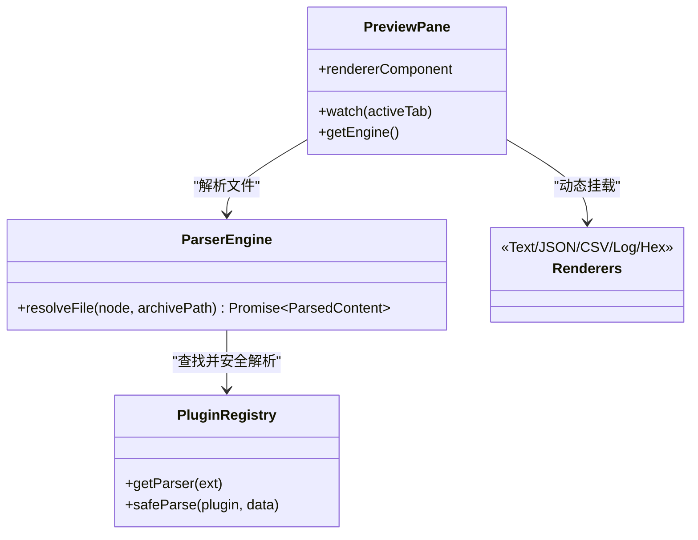
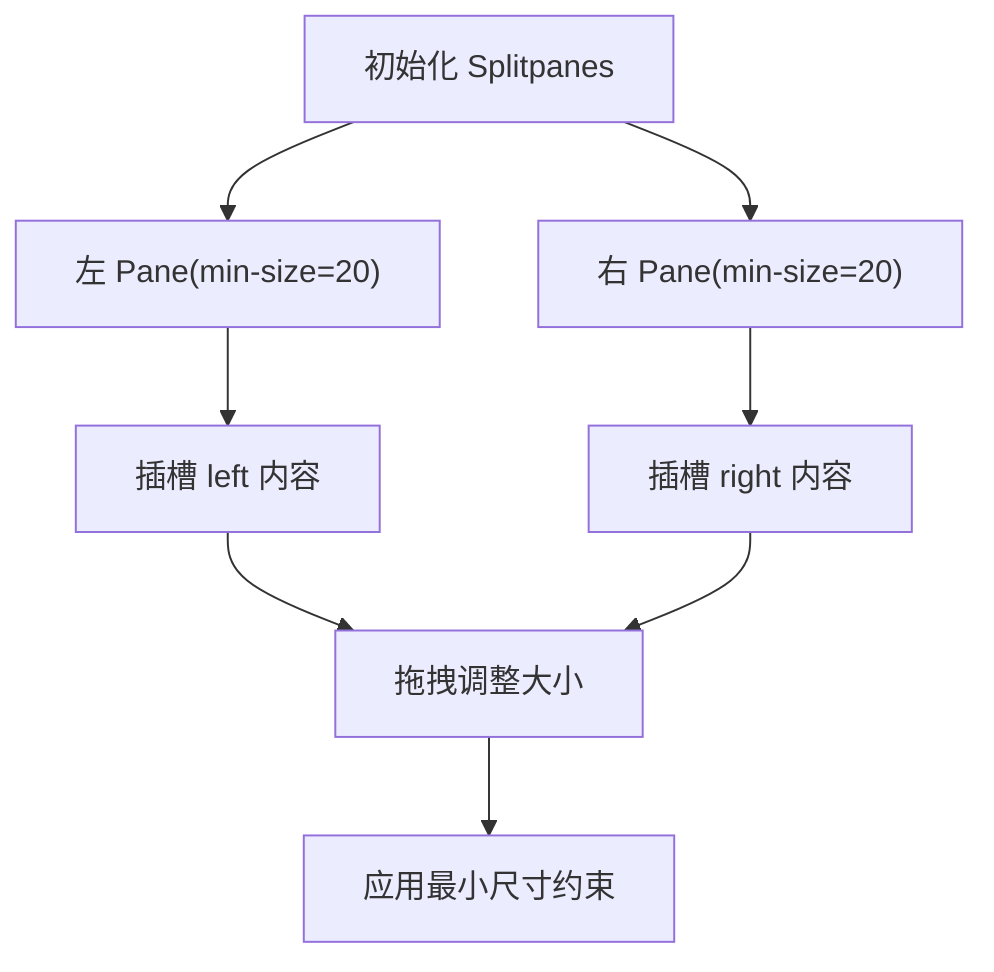
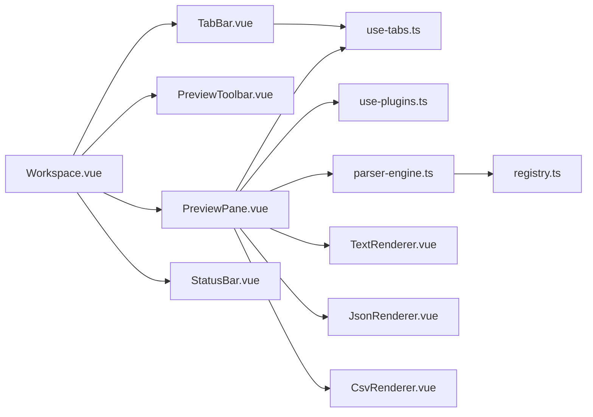

# 工作区组件

<cite>
**本文引用的文件**   
- [Workspace.vue](file://src/components/workspace/Workspace.vue)
- [TabBar.vue](file://src/components/workspace/TabBar.vue)
- [PreviewPane.vue](file://src/components/workspace/PreviewPane.vue)
- [SplitView.vue](file://src/components/workspace/SplitView.vue)
- [PreviewToolbar.vue](file://src/components/workspace/PreviewToolbar.vue)
- [StatusBar.vue](file://src/components/workspace/StatusBar.vue)
- [use-tabs.ts](file://src/composables/use-tabs.ts)
- [use-plugins.ts](file://src/composables/use-plugins.ts)
- [parser-engine.ts](file://src/core/parser-engine.ts)
- [registry.ts](file://src/plugins/registry.ts)
- [index.ts（类型）](file://src/types/index.ts)
- [TextRenderer.vue](file://src/views/renderers/TextRenderer.vue)
- [JsonRenderer.vue](file://src/views/renderers/JsonRenderer.vue)
- [CsvRenderer.vue](file://src/views/renderers/CsvRenderer.vue)
</cite>

## 目录
1. [简介](#简介)
2. [项目结构](#项目结构)
3. [核心组件](#核心组件)
4. [架构总览](#架构总览)
5. [详细组件分析](#详细组件分析)
6. [依赖关系分析](#依赖关系分析)
7. [性能考量](#性能考量)
8. [故障排查指南](#故障排查指南)
9. [结论](#结论)
10. [附录](#附录)

## 简介
本文件为 Workspace 工作区组件的综合文档，聚焦以下能力：
- 多标签页管理：创建、切换、关闭与固定；重排序由底层 UI 库提供。
- PreviewPane 预览面板：基于插件引擎解析并渲染文件内容，支持滚动与错误边界。
- SplitView 分割视图：左右分栏布局，最小尺寸约束与插槽扩展。
- PreviewToolbar 工具栏：字号、换行、行号、编码等显示控制。
- StatusBar 状态栏：展示行数、加载耗时、插件名称等信息。
- 组件间数据流与事件通信：通过组合式函数 useTabManager 共享状态，PreviewPane 使用 ParserEngine 与 PluginRegistry 完成解析与渲染选择。

## 项目结构
工作区相关的前端代码集中在 src/components/workspace 下，配合 composables 中的 useTabManager 与 usePlugins，以及 core 层的 parser-engine 和 plugins 的 registry 共同协作。渲染器位于 views/renderers，按文件类型动态挂载。

图表来源
- [Workspace.vue:1-36](file://src/components/workspace/Workspace.vue#L1-L36)
- [TabBar.vue:1-33](file://src/components/workspace/TabBar.vue#L1-L33)
- [PreviewPane.vue:1-58](file://src/components/workspace/PreviewPane.vue#L1-L58)
- [PreviewToolbar.vue:1-44](file://src/components/workspace/PreviewToolbar.vue#L1-L44)
- [StatusBar.vue:1-24](file://src/components/workspace/StatusBar.vue#L1-L24)
- [SplitView.vue:1-15](file://src/components/workspace/SplitView.vue#L1-L15)
- [use-tabs.ts:1-64](file://src/composables/use-tabs.ts#L1-L64)
- [use-plugins.ts:1-17](file://src/composables/use-plugins.ts#L1-L17)
- [parser-engine.ts:1-35](file://src/core/parser-engine.ts#L1-L35)
- [registry.ts:1-118](file://src/plugins/registry.ts#L1-L118)
- [TextRenderer.vue:1-38](file://src/views/renderers/TextRenderer.vue#L1-L38)
- [JsonRenderer.vue:1-30](file://src/views/renderers/JsonRenderer.vue#L1-L30)
- [CsvRenderer.vue:1-52](file://src/views/renderers/CsvRenderer.vue#L1-L52)

章节来源
- [Workspace.vue:1-36](file://src/components/workspace/Workspace.vue#L1-L36)
- [TabBar.vue:1-33](file://src/components/workspace/TabBar.vue#L1-L33)
- [PreviewPane.vue:1-58](file://src/components/workspace/PreviewPane.vue#L1-L58)
- [PreviewToolbar.vue:1-44](file://src/components/workspace/PreviewToolbar.vue#L1-L44)
- [StatusBar.vue:1-24](file://src/components/workspace/StatusBar.vue#L1-L24)
- [SplitView.vue:1-15](file://src/components/workspace/SplitView.vue#L1-L15)
- [use-tabs.ts:1-64](file://src/composables/use-tabs.ts#L1-L64)
- [use-plugins.ts:1-17](file://src/composables/use-plugins.ts#L1-L17)
- [parser-engine.ts:1-35](file://src/core/parser-engine.ts#L1-L35)
- [registry.ts:1-118](file://src/plugins/registry.ts#L1-L118)
- [TextRenderer.vue:1-38](file://src/views/renderers/TextRenderer.vue#L1-L38)
- [JsonRenderer.vue:1-30](file://src/views/renderers/JsonRenderer.vue#L1-L30)
- [CsvRenderer.vue:1-52](file://src/views/renderers/CsvRenderer.vue#L1-L52)

## 核心组件
- Workspace：聚合 TabBar、PreviewToolbar、PreviewPane、StatusBar，并计算当前激活标签的内容类型以驱动工具栏显隐与行为。
- TabBar：基于 Naive UI 的卡片式标签，支持打开、切换、关闭与固定；重排序由底层组件提供。
- PreviewPane：监听 activeTab，按需调用 ParserEngine 解析文件，根据扩展名从注册表获取渲染组件并渲染。
- PreviewToolbar：通过 v-model 双向绑定字号、换行、行号、编码等显示选项，按内容类型控制可用项。
- StatusBar：汇总 activeTab.content 的行数、加载耗时与插件名称，形成状态信息条。
- SplitView：基于 splitpanes 的左右分栏容器，提供最小尺寸与插槽，便于嵌入左侧树与右侧预览。

章节来源
- [Workspace.vue:1-36](file://src/components/workspace/Workspace.vue#L1-L36)
- [TabBar.vue:1-33](file://src/components/workspace/TabBar.vue#L1-L33)
- [PreviewPane.vue:1-58](file://src/components/workspace/PreviewPane.vue#L1-L58)
- [PreviewToolbar.vue:1-44](file://src/components/workspace/PreviewToolbar.vue#L1-L44)
- [StatusBar.vue:1-24](file://src/components/workspace/StatusBar.vue#L1-L24)
- [SplitView.vue:1-15](file://src/components/workspace/SplitView.vue#L1-L15)

## 架构总览
工作区采用“组合式状态 + 插件化解析 + 动态渲染”的架构：
- 状态层：useTabManager 维护 tabs、activeTabId 与 activeTab 派生状态，并提供 open/close/activate/togglePin/closeAll/reset 等方法。
- 解析层：PreviewPane 在 activeTab 变化时触发 ParserEngine.resolveFile，读取文件字节并通过 PluginRegistry.safeParse 安全解析，返回 ParsedContent。
- 渲染层：根据文件扩展名从 registry 获取对应 IFileParserPlugin.getComponent() 作为渲染组件，将 content.data 传入渲染。
- 工具与状态：PreviewToolbar 暴露显示配置，StatusBar 消费 activeTab.content 统计信息。

图表来源
- [TabBar.vue:1-33](file://src/components/workspace/TabBar.vue#L1-L33)
- [use-tabs.ts:1-64](file://src/composables/use-tabs.ts#L1-L64)
- [PreviewPane.vue:1-58](file://src/components/workspace/PreviewPane.vue#L1-L58)
- [parser-engine.ts:1-35](file://src/core/parser-engine.ts#L1-L35)
- [registry.ts:1-118](file://src/plugins/registry.ts#L1-L118)

## 详细组件分析

### 多标签页管理系统（TabBar + useTabManager）
- 功能要点
  - 创建：openTab 接收 FileTreeNode 与 archiveId，若已存在则直接激活，否则新增并设为活动。
  - 切换：activateTab 设置 activeTabId，TabBar 通过 value 同步。
  - 关闭：closeTab 移除标签，若关闭的是活动标签则自动选择相邻标签或置空。
  - 固定：togglePin 标记 pinned，影响 closable 属性。
  - 批量操作：closeAll 仅保留固定标签；reset 清空所有状态。
  - 重排序：由底层 NTabs 提供拖拽重排能力（无需额外实现）。
- 数据结构
  - TabItem：包含 id、fileNode、archiveId、pinned、content（懒加载）。
  - FileTreeNode：描述文件节点键、标签、路径、是否叶子及子节点等。
- 交互流程
  - 外部（如文件树）调用 openTab 后，TabBar 显示新标签，PreviewPane 在 activeTab 变化时触发解析。

图表来源
- [use-tabs.ts:1-64](file://src/composables/use-tabs.ts#L1-L64)
- [TabBar.vue:1-33](file://src/components/workspace/TabBar.vue#L1-L33)
- [index.ts（类型）:48-54](file://src/types/index.ts#L48-L54)
- [index.ts（类型）:17-24](file://src/types/index.ts#L17-L24)

章节来源
- [use-tabs.ts:1-64](file://src/composables/use-tabs.ts#L1-L64)
- [TabBar.vue:1-33](file://src/components/workspace/TabBar.vue#L1-L33)
- [index.ts（类型）:17-24](file://src/types/index.ts#L17-L24)
- [index.ts（类型）:48-54](file://src/types/index.ts#L48-L54)

### PreviewPane 预览面板（文件渲染机制、缩放与导航）
- 渲染机制
  - 监听 activeTab，首次或切换时调用 ParserEngine.resolveFile 读取文件字节，经 PluginRegistry.safeParse 解析得到 ParsedContent。
  - 根据文件扩展名从 registry 获取对应渲染组件，将 content.data 注入渲染。
  - 使用 ErrorBoundary 包裹渲染区域，避免单个渲染器异常导致整体崩溃。
- 内容缩放与导航
  - 文本类渲染器内部使用等宽字体与 pre 样式，结合外层 NScrollbar 提供滚动导航。
  - 字号、换行、行号等显示参数由 PreviewToolbar 通过 v-model 传递至渲染器（具体渲染器可按需消费这些 props）。
- 关键数据流
  - activeTab.fileNode -> ParserEngine -> PluginRegistry -> ParsedContent -> 渲染组件

图表来源
- [PreviewPane.vue:1-58](file://src/components/workspace/PreviewPane.vue#L1-L58)
- [parser-engine.ts:1-35](file://src/core/parser-engine.ts#L1-L35)
- [registry.ts:1-118](file://src/plugins/registry.ts#L1-L118)
- [TextRenderer.vue:1-38](file://src/views/renderers/TextRenderer.vue#L1-L38)
- [JsonRenderer.vue:1-30](file://src/views/renderers/JsonRenderer.vue#L1-L30)
- [CsvRenderer.vue:1-52](file://src/views/renderers/CsvRenderer.vue#L1-L52)

章节来源
- [PreviewPane.vue:1-58](file://src/components/workspace/PreviewPane.vue#L1-L58)
- [parser-engine.ts:1-35](file://src/core/parser-engine.ts#L1-L35)
- [registry.ts:1-118](file://src/plugins/registry.ts#L1-L118)
- [TextRenderer.vue:1-38](file://src/views/renderers/TextRenderer.vue#L1-L38)
- [JsonRenderer.vue:1-30](file://src/views/renderers/JsonRenderer.vue#L1-L30)
- [CsvRenderer.vue:1-52](file://src/views/renderers/CsvRenderer.vue#L1-L52)

### SplitView 分割视图（布局调整、面板大小控制、响应式适配）
- 布局能力
  - 使用 Splitpanes 提供左右 Pane，分别设置 min-size 约束，防止过度压缩。
  - 通过 slot="left"/slot="right" 插入任意内容，例如文件树与预览区。
- 响应式适配
  - 可结合 usePanelLayout 提供的断点与宽度控制方法，实现窄屏折叠、标准/宽屏自适应等策略（该组合式函数独立于工作区组件，可在上层布局中复用）。

图表来源
- [SplitView.vue:1-15](file://src/components/workspace/SplitView.vue#L1-L15)

章节来源
- [SplitView.vue:1-15](file://src/components/workspace/SplitView.vue#L1-L15)

### PreviewToolbar 工具栏（操作按钮与快捷命令）
- 功能特性
  - 字号：NInputNumber 控制范围，默认值 14。
  - 换行/行号：NSwitch 控制，仅在 text/hex 类型可见。
  - 编码：NSelect 提供 UTF-8、GBK、Shift_JIS 等选项。
  - 通过 defineModel 与父级进行双向绑定，Workspace 负责将 type 与各项模型传递给工具栏。
- 与渲染器的联动
  - 渲染器可根据传入的 props（如 fontSize、wrap、showLineNumbers、encoding）调整显示行为（具体实现由各渲染器决定）。

章节来源
- [PreviewToolbar.vue:1-44](file://src/components/workspace/PreviewToolbar.vue#L1-L44)
- [Workspace.vue:1-36](file://src/components/workspace/Workspace.vue#L1-L36)

### StatusBar 状态栏（信息展示与交互）
- 信息构成
  - 行数：来自 ParsedContent.lineCount。
  - 加载耗时：来自 ParsedContent.loadTimeMs。
  - 插件名称：来自 ParsedContent.pluginName。
- 交互
  - 当前为只读展示，未来可扩展右键菜单或复制等功能。

章节来源
- [StatusBar.vue:1-24](file://src/components/workspace/StatusBar.vue#L1-L24)
- [index.ts（类型）:26-32](file://src/types/index.ts#L26-L32)

## 依赖关系分析
- 组件耦合
  - Workspace 聚合多个子组件，职责清晰，低耦合。
  - TabBar 与 PreviewPane 均依赖 useTabManager 共享状态，避免重复状态源。
  - PreviewPane 依赖 usePlugins 与 ParserEngine，后者再依赖 PluginRegistry，形成清晰的解析管线。
- 外部依赖
  - Naive UI 提供基础 UI 控件。
  - splitpanes 提供分割布局。
  - @vueuse/core 的 useBreakpoints 可用于布局响应式（在上层布局中使用）。
- 潜在循环依赖
  - 当前结构无循环引用；解析与渲染分离良好。

图表来源
- [Workspace.vue:1-36](file://src/components/workspace/Workspace.vue#L1-L36)
- [TabBar.vue:1-33](file://src/components/workspace/TabBar.vue#L1-L33)
- [PreviewPane.vue:1-58](file://src/components/workspace/PreviewPane.vue#L1-L58)
- [use-tabs.ts:1-64](file://src/composables/use-tabs.ts#L1-L64)
- [use-plugins.ts:1-17](file://src/composables/use-plugins.ts#L1-L17)
- [parser-engine.ts:1-35](file://src/core/parser-engine.ts#L1-L35)
- [registry.ts:1-118](file://src/plugins/registry.ts#L1-L118)
- [TextRenderer.vue:1-38](file://src/views/renderers/TextRenderer.vue#L1-L38)
- [JsonRenderer.vue:1-30](file://src/views/renderers/JsonRenderer.vue#L1-L30)
- [CsvRenderer.vue:1-52](file://src/views/renderers/CsvRenderer.vue#L1-L52)

章节来源
- [Workspace.vue:1-36](file://src/components/workspace/Workspace.vue#L1-L36)
- [use-tabs.ts:1-64](file://src/composables/use-tabs.ts#L1-L64)
- [use-plugins.ts:1-17](file://src/composables/use-plugins.ts#L1-L17)
- [parser-engine.ts:1-35](file://src/core/parser-engine.ts#L1-L35)
- [registry.ts:1-118](file://src/plugins/registry.ts#L1-L118)

## 性能考量
- 解析超时保护：PluginRegistry.safeParse 对插件执行设置超时，失败回退到十六进制视图，避免阻塞 UI。
- 延迟解析：PreviewPane 仅在 activeTab 有 fileNode 且未缓存 content 时才发起解析，减少不必要的 IO。
- 渲染隔离：ErrorBoundary 包裹渲染器，避免单点异常影响整体。
- 大文件建议：
  - 对超大文本/日志文件，建议在渲染器层面实现虚拟滚动或分页加载。
  - 可通过 PreviewToolbar 的编码选择提升兼容性，避免二次解码开销。
- 布局性能：SplitView 的最小尺寸限制有助于避免极端布局导致的重排抖动。

[本节为通用指导，不直接分析具体文件]

## 故障排查指南
- 标签无法关闭
  - 检查是否为固定标签（pinned=true），固定标签不可关闭。
  - 参考：[use-tabs.ts:46-49](file://src/composables/use-tabs.ts#L46-L49)、[TabBar.vue:24-27](file://src/components/workspace/TabBar.vue#L24-L27)
- 切换标签后预览空白
  - 确认 activeTab.fileNode.path 有效且平台适配器可读。
  - 查看 ParserEngine 是否成功返回 ParsedContent。
  - 参考：[PreviewPane.vue:24-35](file://src/components/workspace/PreviewPane.vue#L24-L35)、[parser-engine.ts:11-33](file://src/core/parser-engine.ts#L11-L33)
- 渲染器报错导致白屏
  - 检查 ErrorBoundary 是否捕获异常，必要时在对应渲染器内增加空值与类型校验。
  - 参考：[PreviewPane.vue:49-56](file://src/components/workspace/PreviewPane.vue#L49-L56)
- 工具栏选项无效
  - 确认 Workspace 是否正确传递 type 与各 v-model 绑定。
  - 参考：[Workspace.vue:24-31](file://src/components/workspace/Workspace.vue#L24-L31)
- 状态栏信息缺失
  - 检查 ParsedContent 字段是否存在（lineCount/loadTimeMs/pluginName）。
  - 参考：[StatusBar.vue:8-16](file://src/components/workspace/StatusBar.vue#L8-L16)、[index.ts（类型）:26-32](file://src/types/index.ts#L26-L32)

章节来源
- [use-tabs.ts:46-49](file://src/composables/use-tabs.ts#L46-L49)
- [TabBar.vue:24-27](file://src/components/workspace/TabBar.vue#L24-L27)
- [PreviewPane.vue:24-35](file://src/components/workspace/PreviewPane.vue#L24-L35)
- [parser-engine.ts:11-33](file://src/core/parser-engine.ts#L11-L33)
- [PreviewPane.vue:49-56](file://src/components/workspace/PreviewPane.vue#L49-L56)
- [Workspace.vue:24-31](file://src/components/workspace/Workspace.vue#L24-L31)
- [StatusBar.vue:8-16](file://src/components/workspace/StatusBar.vue#L8-L16)
- [index.ts（类型）:26-32](file://src/types/index.ts#L26-L32)

## 结论
工作区组件通过清晰的职责划分与组合式状态管理，实现了稳定的多标签预览体验。插件化解析与动态渲染使系统具备良好的扩展性；工具栏与状态栏完善了用户反馈与交互闭环。后续可在大文件渲染、搜索定位、快捷键等方面进一步增强用户体验。

[本节为总结性内容，不直接分析具体文件]

## 附录
- 关键类型定义
  - FileTreeNode：文件节点结构，用于标签与解析入口。
  - ParsedContent：解析结果，包含类型、数据、行数、耗时与插件名。
  - TabItem：标签项，包含文件节点、归档标识、固定标志与内容缓存。
- 常用 API 速览
  - useTabManager：openTab、closeTab、activateTab、togglePin、closeAll、reset。
  - usePluginEngine：registry、detect、getParser、getCompression、enable/disable。
  - ParserEngine：resolveFile。
  - PluginRegistry：registerParser/registerCompression、getParser/getCompression、safeParse/safeDecompress。

章节来源
- [index.ts（类型）:17-24](file://src/types/index.ts#L17-L24)
- [index.ts（类型）:26-32](file://src/types/index.ts#L26-L32)
- [index.ts（类型）:48-54](file://src/types/index.ts#L48-L54)
- [use-tabs.ts:1-64](file://src/composables/use-tabs.ts#L1-L64)
- [use-plugins.ts:1-17](file://src/composables/use-plugins.ts#L1-L17)
- [parser-engine.ts:1-35](file://src/core/parser-engine.ts#L1-L35)
- [registry.ts:1-118](file://src/plugins/registry.ts#L1-L118)