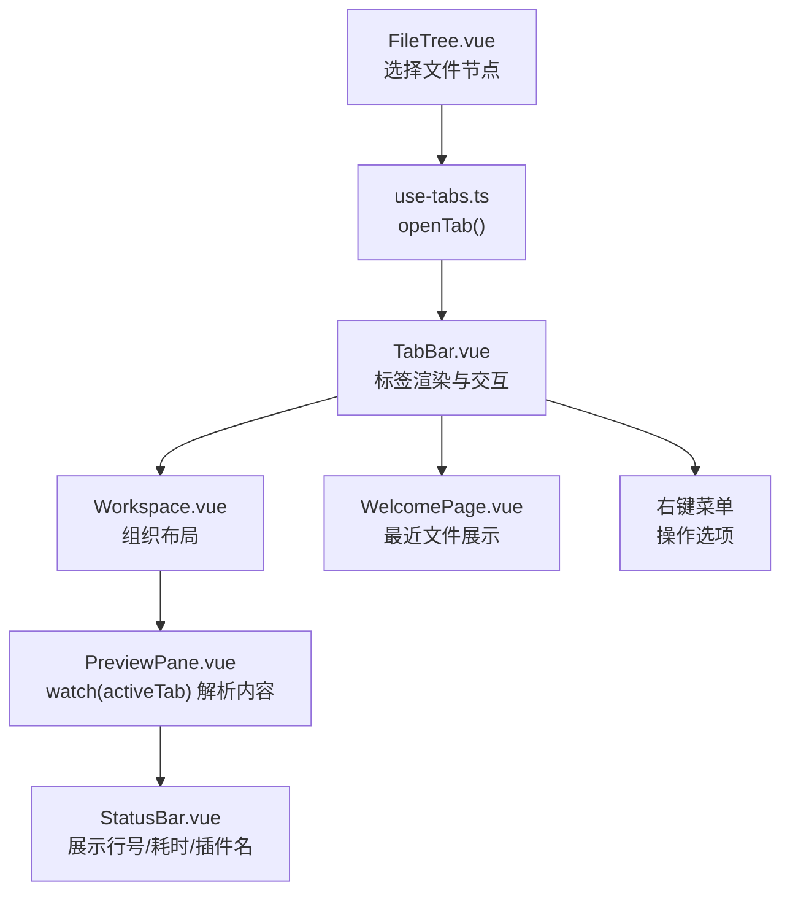
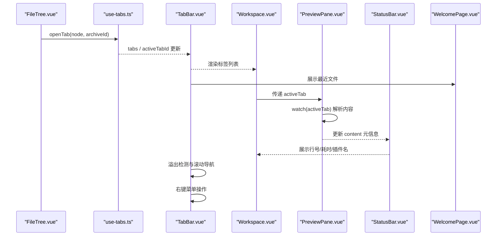
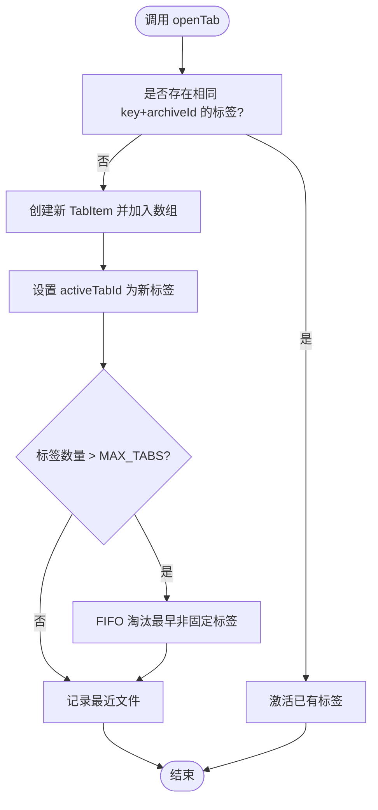
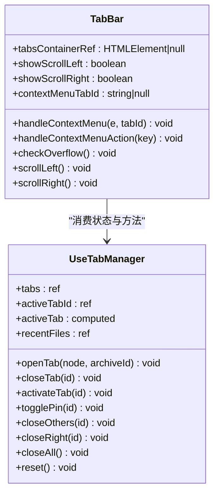
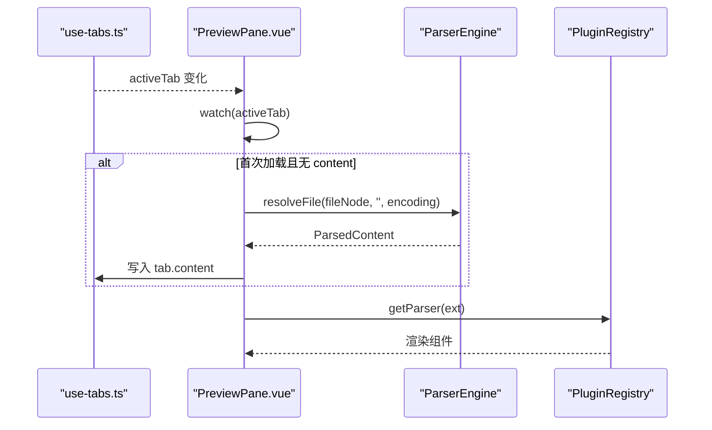
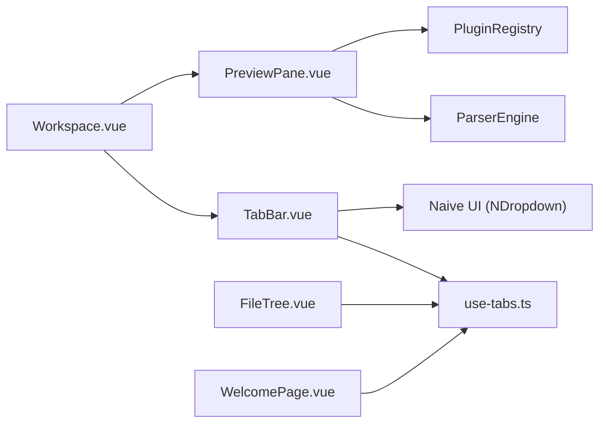
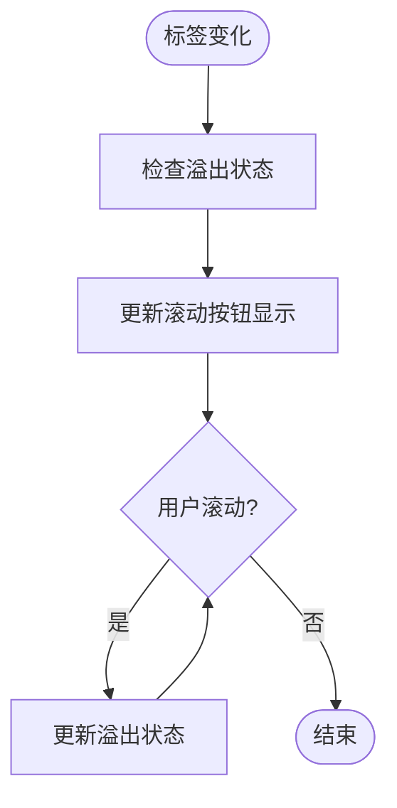

# 标签栏组件

<cite>
**本文引用的文件列表**
- [TabBar.vue](file://src/components/workspace/TabBar.vue)
- [use-tabs.ts](file://src/composables/use-tabs.ts)
- [index.ts（类型定义）](file://src/types/index.ts)
- [Workspace.vue](file://src/components/workspace/Workspace.vue)
- [PreviewPane.vue](file://src/components/workspace/PreviewPane.vue)
- [FileTree.vue](file://src/components/archive-panel/FileTree.vue)
- [StatusBar.vue](file://src/components/workspace/StatusBar.vue)
- [WelcomePage.vue](file://src/components/workspace/WelcomePage.vue)
- [TabBar.test.ts](file://src/__tests__/components/TabBar.test.ts)
- [use-tabs.test.ts](file://src/__tests__/composables/use-tabs.test.ts)
- [package.json](file://package.json)
</cite>

## 更新摘要
**变更内容**   
- 增强了标签栏溢出处理机制，支持左右滚动箭头导航
- 实现了flex-shrink防止机制，确保标签外观一致性
- 添加了状态同步功能，实现实时更新和响应式更新
- 优化了多标签场景下的布局行为
- 新增了右键菜单功能，支持关闭、固定等操作
- 完善了最近文件记录和欢迎页面展示

## 目录
1. [简介](#简介)
2. [项目结构](#项目结构)
3. [核心组件](#核心组件)
4. [架构总览](#架构总览)
5. [详细组件分析](#详细组件分析)
6. [依赖关系分析](#依赖关系分析)
7. [性能考量](#性能考量)
8. [故障排查指南](#故障排查指南)
9. [结论](#结论)
10. [附录](#附录)

## 简介
本文件围绕"标签栏组件"进行系统化文档化，重点覆盖：
- 标签页的创建、切换、关闭与重排序机制
- 与 useTabs 组合式函数的集成方式
- 标签状态管理、活动标签的高亮显示
- 标签拖拽排序的实现原理与扩展建议
- 标签页的生命周期管理，包括打开新文件时的标签创建、关闭标签时的资源清理
- 溢出处理和滚动导航功能
- 右键菜单操作支持
- 最近文件记录和快速访问
- 扩展能力示例（快捷键支持等）

## 项目结构
与标签栏相关的代码主要分布在以下位置：
- 视图层：标签栏 UI 组件 TabBar.vue
- 逻辑层：标签状态与行为 use-tabs.ts
- 数据模型：TabItem、FileTreeNode 等类型定义 index.ts
- 工作区容器：Workspace.vue 组织标签栏与预览区域
- 预览加载：PreviewPane.vue 监听 activeTab 并解析内容
- 触发入口：FileTree.vue 点击树节点时打开标签
- 状态展示：StatusBar.vue 展示当前标签的解析结果信息
- 欢迎页面：WelcomePage.vue 提供空状态引导和最近文件展示
- 测试用例：TabBar.test.ts 和 use-tabs.test.ts 验证组件行为
- 依赖声明：package.json 中声明了相关依赖

**图表来源**
- [FileTree.vue:16-23](file://src/components/archive-panel/FileTree.vue#L16-L23)
- [use-tabs.ts:33-66](file://src/composables/use-tabs.ts#L33-L66)
- [TabBar.vue:94-155](file://src/components/workspace/TabBar.vue#L94-L155)
- [Workspace.vue:22-38](file://src/components/workspace/Workspace.vue#L22-L38)
- [PreviewPane.vue:44-52](file://src/components/workspace/PreviewPane.vue#L44-L52)
- [WelcomePage.vue:12-17](file://src/components/workspace/WelcomePage.vue#L12-L17)

**章节来源**
- [TabBar.vue:1-267](file://src/components/workspace/TabBar.vue#L1-L267)
- [use-tabs.ts:1-142](file://src/composables/use-tabs.ts#L1-L142)
- [index.ts（类型定义）:1-148](file://src/types/index.ts#L1-L148)
- [Workspace.vue:1-39](file://src/components/workspace/Workspace.vue#L1-L39)
- [PreviewPane.vue:1-99](file://src/components/workspace/PreviewPane.vue#L1-L99)
- [WelcomePage.vue:1-104](file://src/components/workspace/WelcomePage.vue#L1-L104)
- [TabBar.test.ts:1-144](file://src/__tests__/components/TabBar.test.ts#L1-L144)
- [use-tabs.test.ts:1-133](file://src/__tests__/composables/use-tabs.test.ts#L1-L133)

## 核心组件
- **标签栏 UI 组件 TabBar.vue**
  - 使用原生 HTML/CSS 实现自定义标签样式，替代 Naive UI 的 NTabs/NTab
  - 通过 useTabManager 暴露的 tabs、activeTabId、activateTab、closeTab、togglePin 驱动交互
  - 实现了溢出检测和滚动导航功能，支持左右箭头按钮
  - 根据 pinned 控制是否可关闭，并在标题前显示固定图标
  - 集成了右键菜单功能，支持关闭、关闭其他、关闭右侧、固定/取消固定等操作
  - 实现了 flex-shrink 防止机制，确保标签外观一致性

- **标签管理器 use-tabs.ts**
  - 维护全局标签数组 tabs 与当前激活标签 ID activeTabId
  - 提供 openTab/closeTab/activateTab/togglePin/closeOthers/closeRight/closeAll/reset 等方法
  - 计算属性 activeTab 返回当前活动标签对象
  - 实现了标签数量上限控制（MAX_TABS = 10），超出后按 FIFO 策略淘汰最早的非固定标签
  - 维护最近文件记录（recentFiles），最多保留 10 条
  - 支持光标位置跟踪（cursorPosition）

- **类型定义 index.ts**
  - FileTreeNode：文件树节点
  - ParsedContent：解析后的内容元信息
  - TabItem：标签项，包含 id、fileNode、archiveId、pinned、content 等字段

**章节来源**
- [TabBar.vue:1-267](file://src/components/workspace/TabBar.vue#L1-L267)
- [use-tabs.ts:1-142](file://src/composables/use-tabs.ts#L1-L142)
- [index.ts（类型定义）:107-119](file://src/types/index.ts#L107-L119)

## 架构总览
标签栏的工作流从文件树选择开始，到标签创建、激活、预览加载与状态展示，形成闭环。新增的溢出处理、右键菜单和最近文件功能进一步增强了用户体验。

**图表来源**
- [FileTree.vue:16-23](file://src/components/archive-panel/FileTree.vue#L16-L23)
- [use-tabs.ts:33-66](file://src/composables/use-tabs.ts#L33-L66)
- [TabBar.vue:17-40](file://src/components/workspace/TabBar.vue#L17-L40)
- [Workspace.vue:22-38](file://src/components/workspace/Workspace.vue#L22-L38)
- [PreviewPane.vue:44-52](file://src/components/workspace/PreviewPane.vue#L44-L52)
- [WelcomePage.vue:12-17](file://src/components/workspace/WelcomePage.vue#L12-L17)

## 详细组件分析

### 标签管理器 use-tabs.ts
- **状态设计**
  - tabs：标签数组，元素类型为 TabItem
  - activeTabId：当前激活标签 ID
  - nextTabId：自增 ID 生成器，避免重复
  - recentFiles：最近打开的文件路径数组，最多保留 10 条
  - cursorPosition：光标位置（行:列），由渲染器更新
  - MAX_TABS：标签页数量上限常量（10）

- **关键方法**
  - openTab(node, archiveId)：若已存在相同 key+archiveId 的标签则直接激活；否则新建并激活，同时记录最近文件
  - closeTab(id)：删除指定标签，若关闭的是当前标签则自动切换到相邻标签或置空
  - activateTab(id)：设置当前激活标签
  - togglePin(id)：切换固定状态
  - closeOthers(id)：关闭除指定标签外的所有非固定标签
  - closeRight(id)：关闭指定标签右侧的所有标签
  - closeAll()：仅保留固定标签，并重置 activeTabId
  - setCursor(line, column)：设置光标位置
  - reset()：清空所有状态，便于测试或重置场景

- **溢出处理机制**
  - 当标签数量超过 MAX_TABS 时，按 FIFO 策略淘汰最早的非固定标签
  - 如果淘汰的恰好是当前激活标签，自动切换到最后一个可用标签
  - 固定标签不会被淘汰，确保重要标签始终可见

- **复杂度分析**
  - openTab/closeTab/activateTab/togglePin/closeAll 均为 O(n) 查找与数组操作
  - activeTab 为计算属性，O(n) 查找
  - 溢出处理在 openTab 中进行，最坏情况 O(n²)

**图表来源**
- [use-tabs.ts:33-66](file://src/composables/use-tabs.ts#L33-L66)

**章节来源**
- [use-tabs.ts:1-142](file://src/composables/use-tabs.ts#L1-L142)
- [use-tabs.test.ts:77-105](file://src/__tests__/composables/use-tabs.test.ts#L77-L105)

### 标签栏 UI TabBar.vue
- **绑定与事件**
  - value 绑定 activeTabId，实现受控模式
  - @update:value 触发 activateTab
  - @close 触发 closeTab

- **溢出处理与滚动导航**
  - 使用 ref 引用标签容器，实时检测溢出状态
  - 实现左右滚动箭头按钮，支持平滑滚动
  - 监听窗口 resize 事件，动态调整溢出状态
  - 使用 watch 监听 tabs 变化，自动重新检查溢出状态

- **标签项渲染**
  - closable 由 !tab.pinned 决定
  - 标题前缀显示固定图标 📌
  - 实现了 flex-shrink: 0 防止标签被压缩
  - 活动标签添加 tab-active 类，高亮显示

- **右键菜单功能**
  - 监听 contextmenu 事件，弹出操作菜单
  - 支持关闭、关闭其他、关闭右侧、固定/取消固定等操作
  - 使用 Naive UI 的 NDropdown 组件实现菜单

- **空态提示**
  - 当无标签时显示 WelcomePage 组件
  - 展示最近文件和操作引导

**图表来源**
- [TabBar.vue:13-81](file://src/components/workspace/TabBar.vue#L13-L81)
- [use-tabs.ts:22-141](file://src/composables/use-tabs.ts#L22-L141)

**章节来源**
- [TabBar.vue:1-267](file://src/components/workspace/TabBar.vue#L1-L267)

### 预览加载 PreviewPane.vue
- 监听 activeTab，首次加载时解析文件内容并写入 tab.content
- 根据文件扩展名选择渲染组件
- 错误边界包裹渲染，防止单个渲染失败影响整体
- 支持编码切换时重新解析文件内容

**图表来源**
- [PreviewPane.vue:44-67](file://src/components/workspace/PreviewPane.vue#L44-L67)

**章节来源**
- [PreviewPane.vue:1-99](file://src/components/workspace/PreviewPane.vue#L1-L99)

### 欢迎页面 WelcomePage.vue
- 展示应用信息和操作引导
- 显示最近打开的文件列表（最多 5 个）
- 提供拖放文件、上传文件、搜索内容的快捷操作
- 展示常用快捷键提示

**章节来源**
- [WelcomePage.vue:1-104](file://src/components/workspace/WelcomePage.vue#L1-L104)

### 触发入口 FileTree.vue
- 选择文件树叶子节点时调用 openTab(node, archiveId)
- 结合过滤输入框提升导航效率

**章节来源**
- [FileTree.vue:16-23](file://src/components/archive-panel/FileTree.vue#L16-L23)

### 状态展示 StatusBar.vue
- 基于 activeTab.content 展示行数、加载耗时、所用插件名称等信息

**章节来源**
- [StatusBar.vue:8-16](file://src/components/workspace/StatusBar.vue#L8-L16)

## 依赖关系分析
- **组件耦合**
  - TabBar.vue 依赖 use-tabs.ts 提供的状态与方法
  - Workspace.vue 组合 TabBar 与 PreviewPane
  - PreviewPane.vue 依赖 use-plugins、use-platform、ParserEngine 完成内容解析
  - FileTree.vue 通过 use-tab-manager 触发标签打开
  - WelcomePage.vue 依赖 use-tab-manager 获取最近文件信息

- **外部依赖**
  - Naive UI：NDropdown 等 UI 组件
  - Vue 3 响应式系统：ref、computed、watch 等

**图表来源**
- [TabBar.vue:5](file://src/components/workspace/TabBar.vue#L5)
- [use-tabs.ts:2](file://src/composables/use-tabs.ts#L2)
- [Workspace.vue:3-6](file://src/components/workspace/Workspace.vue#L3-L6)
- [PreviewPane.vue:4-7](file://src/components/workspace/PreviewPane.vue#L4-L7)
- [WelcomePage.vue:5](file://src/components/workspace/WelcomePage.vue#L5)

**章节来源**
- [package.json:20-29](file://package.json#L20-L29)

## 性能考量
- **标签数量增长时的查找与插入**
  - openTab/closeTab 均涉及线性查找与数组操作，建议在标签数较大时考虑索引优化或使用 Map 缓存 key→id 映射
  - 溢出处理在标签数量超过限制时执行，可能产生 O(n²) 复杂度

- **溢出检测与滚动性能**
  - 使用 requestAnimationFrame 或防抖优化溢出检测频率
  - 滚动操作使用 CSS transition 实现平滑效果

- **内容解析延迟**
  - PreviewPane 采用懒加载策略，仅在 activeTab 首次出现时解析，避免不必要的 I/O 与 CPU 开销

- **内存占用**
  - 关闭标签后，tab.content 仍存在于内存中，可在 closeTab 中按需释放以节省内存
  - recentFiles 数组限制最大长度为 10，避免无限增长

- **渲染性能**
  - 使用 flex-shrink: 0 防止标签被压缩，减少重排重绘
  - 条件渲染右键菜单，避免不必要的 DOM 操作

## 故障排查指南
- **无法打开标签**
  - 检查 FileTree 是否正确调用 openTab，并确保传入的 node 为叶子节点
  - 确认 use-tabs 的 openTab 未因重复 key+archiveId 而直接激活已有标签

- **关闭标签后未切换**
  - 检查 closeTab 的逻辑，确保在关闭当前标签时正确计算下一个激活标签

- **固定标签不可关闭**
  - 确认 pinned 状态与 closable 绑定逻辑一致

- **溢出检测异常**
  - 检查 tabsContainerRef 是否正确引用 DOM 元素
  - 确认窗口 resize 事件监听器是否正确注册和移除

- **右键菜单不显示**
  - 检查 contextmenu 事件是否正确捕获
  - 确认 NDropdown 组件的 show 属性是否正确控制

- **最近文件不显示**
  - 检查 recentFiles 数组是否正确更新
  - 确认 WelcomePage 组件是否正确接收数据

- **预览内容为空或加载中**
  - 检查 PreviewPane 的 watch(activeTab) 是否执行，以及 ParserEngine 是否正常解析

- **状态栏信息缺失**
  - 确认 activeTab.content 是否成功填充，关注 lineCount/loadTimeMs/pluginName 字段

**章节来源**
- [use-tabs.ts:72-79](file://src/composables/use-tabs.ts#L72-L79)
- [TabBar.vue:17-40](file://src/components/workspace/TabBar.vue#L17-L40)
- [PreviewPane.vue:44-52](file://src/components/workspace/PreviewPane.vue#L44-L52)
- [WelcomePage.vue:12-17](file://src/components/workspace/WelcomePage.vue#L12-L17)

## 结论
当前标签栏实现了完整的标签创建、切换、关闭与固定功能，并通过 use-tabs 组合式函数集中管理状态。新增的溢出处理、右键菜单、最近文件记录等功能显著提升了用户体验。预览加载采用懒解析策略，保证性能与用户体验。标签数量上限控制和 FIFO 淘汰机制确保了应用的稳定性。下一步可扩展拖拽排序、全局快捷键支持等高级功能，进一步提升交互能力。

## 附录

### 溢出处理与滚动导航实现原理
- **现状**
  - TabBar 实现了完整的溢出检测与滚动导航功能
  - 支持左右箭头按钮，提供平滑滚动体验
  - 自动检测标签溢出状态，动态显示/隐藏滚动按钮

- **实现细节**
  - 使用 ref 引用标签容器元素，实时获取 scrollWidth 和 clientWidth
  - 监听 scroll 事件和窗口 resize 事件，动态更新溢出状态
  - 实现 smooth 滚动效果，提升用户体验
  - 使用 watch 监听标签变化，自动重新检查溢出状态

- **CSS 样式优化**
  - 使用 flex-shrink: 0 防止标签被压缩
  - 隐藏默认滚动条，保持界面整洁
  - 实现悬停效果和过渡动画

**章节来源**
- [TabBar.vue:17-40](file://src/components/workspace/TabBar.vue#L17-L40)
- [TabBar.vue:192-203](file://src/components/workspace/TabBar.vue#L192-L203)

### 右键菜单功能实现
- **功能特性**
  - 支持关闭当前标签
  - 支持关闭其他标签（保留当前标签）
  - 支持关闭右侧标签（保留当前标签及其左侧标签）
  - 支持固定/取消固定当前标签

- **实现思路**
  - 监听每个标签的 contextmenu 事件
  - 使用 NDropdown 组件实现菜单显示
  - 根据菜单选项调用相应的 use-tab-manager 方法

- **用户体验优化**
  - 菜单位置跟随鼠标点击位置
  - 点击外部区域自动关闭菜单
  - 不同操作对应不同的菜单项

**章节来源**
- [TabBar.vue:42-81](file://src/components/workspace/TabBar.vue#L42-L81)

### 最近文件记录与快速访问
- **功能特性**
  - 自动记录最近打开的文件路径
  - 最多保留 10 条记录
  - 在欢迎页面展示最近文件列表
  - 支持文件名截取显示

- **实现思路**
  - 在 openTab 方法中更新 recentFiles 数组
  - 使用 computed 属性处理最近文件的显示格式
  - 在 WelcomePage 组件中展示最近文件

- **数据结构设计**
  - recentFiles: string[] 类型，存储文件路径
  - displayRecentFiles: computed 属性，处理显示逻辑

**章节来源**
- [use-tabs.ts:63-65](file://src/composables/use-tabs.ts#L63-L65)
- [WelcomePage.vue:12-17](file://src/components/workspace/WelcomePage.vue#L12-L17)

### 标签数量上限控制机制
- **功能特性**
  - 限制最多同时打开 10 个标签
  - 超出限制时按 FIFO 策略淘汰最早的非固定标签
  - 固定标签不受数量限制影响
  - 自动处理活动标签的切换逻辑

- **实现思路**
  - 定义 MAX_TABS 常量控制上限
  - 在 openTab 方法中检查标签数量
  - 使用 find 方法查找第一个非固定标签进行淘汰
  - 处理活动标签被意外淘汰的情况

- **边界情况处理**
  - 全部标签都被固定时，不再进行淘汰
  - 淘汰当前活动标签时，自动切换到最后一个标签
  - 确保至少保留一个有效标签

**章节来源**
- [use-tabs.ts:15-16](file://src/composables/use-tabs.ts#L15-L16)
- [use-tabs.ts:51-61](file://src/composables/use-tabs.ts#L51-L61)
- [use-tabs.test.ts:77-105](file://src/__tests__/composables/use-tabs.test.ts#L77-L105)

### 快捷键支持扩展建议
- **全局键盘监听**
  - Ctrl+W：关闭当前标签
  - Ctrl+Tab：切换到下一个标签
  - Ctrl+Shift+Tab：切换到上一个标签
  - Ctrl+F：聚焦搜索框
  - Ctrl+B：切换左侧面板

- **实现方案**
  - 在应用初始化时注册全局键盘事件监听器
  - 使用 event.preventDefault() 阻止浏览器默认行为
  - 在组件销毁时移除事件监听器，避免内存泄漏
  - 考虑焦点管理和无障碍访问支持

- **注意事项**
  - 避免与浏览器默认快捷键冲突
  - 处理输入框焦点状态，避免在编辑时触发快捷键
  - 提供用户自定义快捷键的配置选项

[此部分为扩展建议，不直接映射具体源码，故无章节来源]

### 类型与数据结构
- **TabItem**
  - id：唯一标识符
  - fileNode：关联的文件树节点
  - archiveId：所属归档标识
  - pinned：是否固定标志
  - content：解析后的内容元信息

- **FileTreeNode**
  - key/label/path/isLeaf：用于定位与展示的基本属性
  - size/children：可选的文件大小和子节点信息

- **ParsedContent**
  - type：内容类型（text/csv/json/hex/log）
  - data：具体内容数据
  - lineCount/loadTimeMs/pluginName：元信息字段

**章节来源**
- [index.ts（类型定义）:107-119](file://src/types/index.ts#L107-L119)
- [index.ts（类型定义）:28-42](file://src/types/index.ts#L28-L42)
- [index.ts（类型定义）:71-77](file://src/types/index.ts#L71-L77)