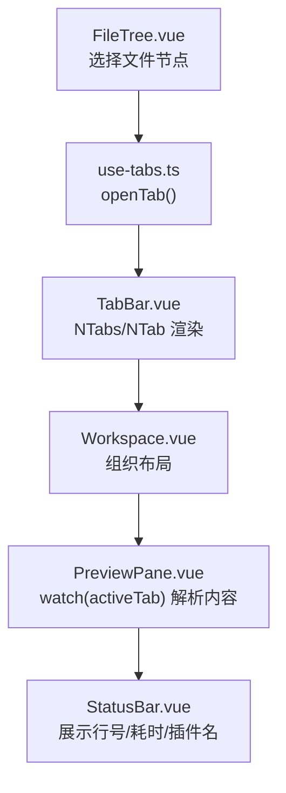
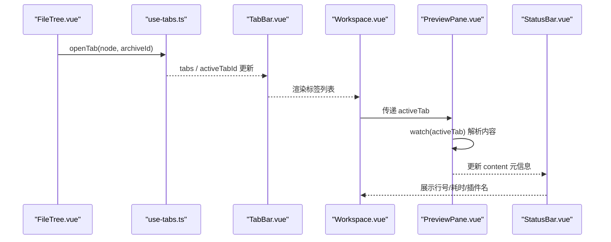
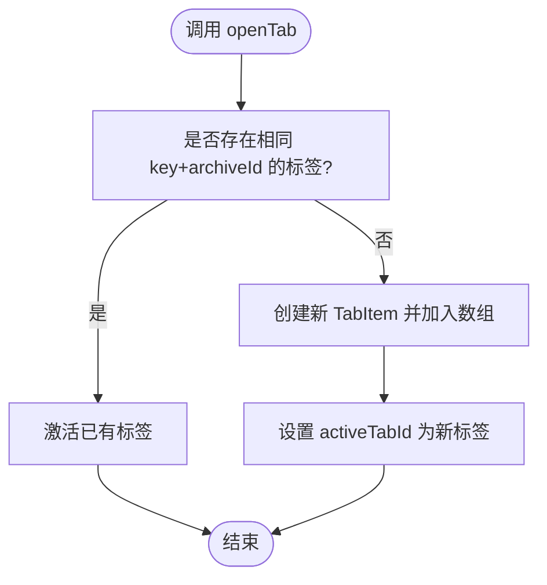
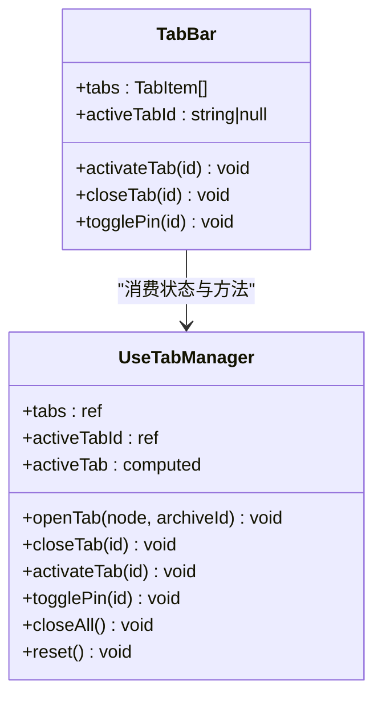
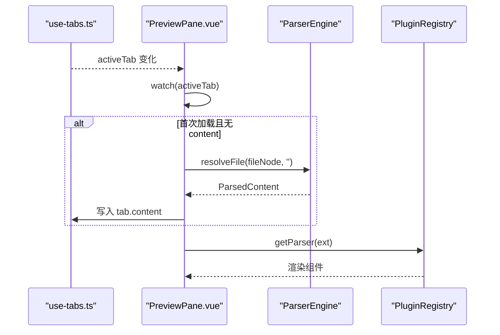
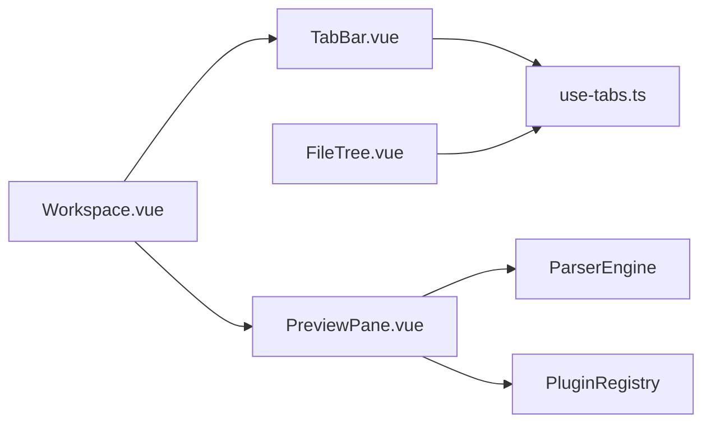
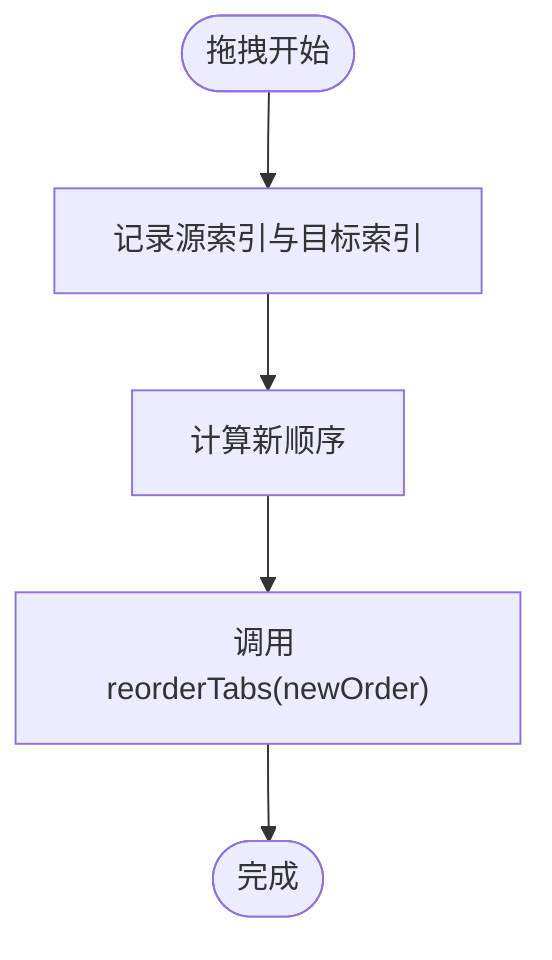

# 标签栏组件

<cite>
**本文引用的文件列表**
- [TabBar.vue](file://src/components/workspace/TabBar.vue)
- [use-tabs.ts](file://src/composables/use-tabs.ts)
- [index.ts（类型定义）](file://src/types/index.ts)
- [Workspace.vue](file://src/components/workspace/Workspace.vue)
- [PreviewPane.vue](file://src/components/workspace/PreviewPane.vue)
- [FileTree.vue](file://src/components/archive-panel/FileTree.vue)
- [StatusBar.vue](file://src/components/workspace/StatusBar.vue)
- [use-tabs.test.ts](file://src/__tests__/composables/use-tabs.test.ts)
- [package.json](file://package.json)
</cite>

## 目录
1. [简介](#简介)
2. [项目结构](#项目结构)
3. [核心组件](#核心组件)
4. [架构总览](#架构总览)
5. [详细组件分析](#详细组件分析)
6. [依赖关系分析](#依赖关系分析)
7. [性能考量](#性能考量)
8. [故障排查指南](#故障排查指南)
9. [结论](#结论)
10. [附录](#附录)

## 简介
本文件围绕“标签栏组件”进行系统化文档化，重点覆盖：
- 标签页的创建、切换、关闭与重排序机制
- 与 useTabs 组合式函数的集成方式
- 标签状态管理、活动标签高亮显示
- 标签拖拽排序的实现原理与扩展建议
- 标签页生命周期管理（打开新文件时的创建、关闭时的资源清理）
- 扩展能力示例（右键菜单、快捷键支持等）

## 项目结构
与标签栏相关的代码主要分布在以下位置：
- 视图层：标签栏 UI 组件 TabBar.vue
- 逻辑层：标签状态与行为 use-tabs.ts
- 数据模型：TabItem、FileTreeNode 等类型定义 index.ts
- 工作区容器：Workspace.vue 组织标签栏与预览区域
- 预览加载：PreviewPane.vue 监听 activeTab 并解析内容
- 触发入口：FileTree.vue 点击树节点时打开标签
- 状态展示：StatusBar.vue 展示当前标签的解析结果信息
- 测试用例：use-tabs.test.ts 验证标签管理器行为
- 依赖声明：package.json 中声明了 vue-draggable-plus 等依赖

图表来源
- [FileTree.vue:16-23](file://src/components/archive-panel/FileTree.vue#L16-L23)
- [use-tabs.ts:14-31](file://src/composables/use-tabs.ts#L14-L31)
- [TabBar.vue:12-28](file://src/components/workspace/TabBar.vue#L12-L28)
- [Workspace.vue:21-35](file://src/components/workspace/Workspace.vue#L21-L35)
- [PreviewPane.vue:24-35](file://src/components/workspace/PreviewPane.vue#L24-L35)
- [StatusBar.vue:8-16](file://src/components/workspace/StatusBar.vue#L8-L16)

章节来源
- [TabBar.vue:1-33](file://src/components/workspace/TabBar.vue#L1-L33)
- [use-tabs.ts:1-64](file://src/composables/use-tabs.ts#L1-L64)
- [index.ts（类型定义）:1-71](file://src/types/index.ts#L1-L71)
- [Workspace.vue:1-36](file://src/components/workspace/Workspace.vue#L1-L36)
- [PreviewPane.vue:1-58](file://src/components/workspace/PreviewPane.vue#L1-L58)
- [FileTree.vue:1-41](file://src/components/archive-panel/FileTree.vue#L1-L41)
- [StatusBar.vue:1-23](file://src/components/workspace/StatusBar.vue#L1-L23)
- [use-tabs.test.ts:1-77](file://src/__tests__/composables/use-tabs.test.ts#L1-L77)
- [package.json:20-29](file://package.json#L20-L29)

## 核心组件
- 标签栏 UI 组件 TabBar.vue
  - 使用 Naive UI 的 NTabs/NTab 渲染卡片式标签
  - 通过 useTabManager 暴露的 tabs、activeTabId、activateTab、closeTab、togglePin 驱动交互
  - 根据 pinned 控制是否可关闭，并在标题前显示固定图标
- 标签管理器 use-tabs.ts
  - 维护全局标签数组 tabs 与当前激活标签 ID activeTabId
  - 提供 openTab/closeTab/activateTab/togglePin/closeAll/reset 等方法
  - 计算属性 activeTab 返回当前活动标签对象
- 类型定义 index.ts
  - FileTreeNode：文件树节点
  - ParsedContent：解析后的内容元信息
  - TabItem：标签项，包含 id、fileNode、archiveId、pinned、content 等字段

章节来源
- [TabBar.vue:1-33](file://src/components/workspace/TabBar.vue#L1-L33)
- [use-tabs.ts:1-64](file://src/composables/use-tabs.ts#L1-L64)
- [index.ts（类型定义）:48-54](file://src/types/index.ts#L48-L54)

## 架构总览
标签栏的工作流从文件树选择开始，到标签创建、激活、预览加载与状态展示，形成闭环。

图表来源
- [FileTree.vue:16-23](file://src/components/archive-panel/FileTree.vue#L16-L23)
- [use-tabs.ts:14-31](file://src/composables/use-tabs.ts#L14-L31)
- [TabBar.vue:12-28](file://src/components/workspace/TabBar.vue#L12-L28)
- [Workspace.vue:21-35](file://src/components/workspace/Workspace.vue#L21-L35)
- [PreviewPane.vue:24-35](file://src/components/workspace/PreviewPane.vue#L24-L35)
- [StatusBar.vue:8-16](file://src/components/workspace/StatusBar.vue#L8-L16)

## 详细组件分析

### 标签管理器 use-tabs.ts
- 状态设计
  - tabs：标签数组，元素类型为 TabItem
  - activeTabId：当前激活标签 ID
  - nextTabId：自增 ID 生成器，避免重复
- 关键方法
  - openTab(node, archiveId)：若已存在相同 key+archiveId 的标签则直接激活；否则新建并激活
  - closeTab(id)：删除指定标签，若关闭的是当前标签则自动切换到相邻标签或置空
  - activateTab(id)：设置当前激活标签
  - togglePin(id)：切换固定状态
  - closeAll()：仅保留固定标签，并重置 activeTabId
  - reset()：清空所有状态，便于测试或重置场景
- 复杂度分析
  - openTab/closeTab/activateTab/togglePin/closeAll 均为 O(n) 查找与数组操作
  - activeTab 为计算属性，O(n) 查找
- 错误处理与边界
  - closeTab 对不存在的 id 直接返回
  - closeAll 在无固定标签时将 activeTabId 置空
  - 重复打开同一文件（key+archiveId）不会创建重复标签

图表来源
- [use-tabs.ts:14-31](file://src/composables/use-tabs.ts#L14-L31)

章节来源
- [use-tabs.ts:1-64](file://src/composables/use-tabs.ts#L1-L64)
- [use-tabs.test.ts:1-77](file://src/__tests__/composables/use-tabs.test.ts#L1-L77)

### 标签栏 UI TabBar.vue
- 绑定与事件
  - value 绑定 activeTabId，实现受控模式
  - @update:value 触发 activateTab
  - @close 触发 closeTab
- 标签项
  - closable 由 !tab.pinned 决定
  - 标题前缀显示固定图标
- 空态提示
  - 当无标签时显示引导文案

图表来源
- [TabBar.vue:1-33](file://src/components/workspace/TabBar.vue#L1-L33)
- [use-tabs.ts:1-64](file://src/composables/use-tabs.ts#L1-L64)

章节来源
- [TabBar.vue:1-33](file://src/components/workspace/TabBar.vue#L1-L33)

### 预览加载 PreviewPane.vue
- 监听 activeTab，首次加载时解析文件内容并写入 tab.content
- 根据文件扩展名选择渲染组件
- 错误边界包裹渲染，防止单个渲染失败影响整体

图表来源
- [PreviewPane.vue:24-42](file://src/components/workspace/PreviewPane.vue#L24-L42)

章节来源
- [PreviewPane.vue:1-58](file://src/components/workspace/PreviewPane.vue#L1-L58)

### 触发入口 FileTree.vue
- 选择文件树叶子节点时调用 openTab(node, archiveId)
- 结合过滤输入框提升导航效率

章节来源
- [FileTree.vue:16-23](file://src/components/archive-panel/FileTree.vue#L16-L23)

### 状态展示 StatusBar.vue
- 基于 activeTab.content 展示行数、加载耗时、所用插件名称等信息

章节来源
- [StatusBar.vue:8-16](file://src/components/workspace/StatusBar.vue#L8-L16)

## 依赖关系分析
- 组件耦合
  - TabBar.vue 依赖 use-tabs.ts 提供的状态与方法
  - Workspace.vue 组合 TabBar 与 PreviewPane
  - PreviewPane.vue 依赖 use-plugins、use-platform、ParserEngine 完成内容解析
  - FileTree.vue 通过 use-tab-manager 触发标签打开
- 外部依赖
  - Naive UI：NTabs/NTab 等 UI 组件
  - vue-draggable-plus：在 package.json 中声明，可用于后续实现标签拖拽排序

图表来源
- [TabBar.vue:1-33](file://src/components/workspace/TabBar.vue#L1-L33)
- [use-tabs.ts:1-64](file://src/composables/use-tabs.ts#L1-L64)
- [Workspace.vue:1-36](file://src/components/workspace/Workspace.vue#L1-L36)
- [PreviewPane.vue:1-58](file://src/components/workspace/PreviewPane.vue#L1-L58)
- [FileTree.vue:1-41](file://src/components/archive-panel/FileTree.vue#L1-L41)

章节来源
- [package.json:20-29](file://package.json#L20-L29)

## 性能考量
- 标签数量增长时的查找与插入
  - openTab/closeTab 均涉及线性查找与数组操作，建议在标签数较大时考虑索引优化或使用 Map 缓存 key→id 映射
- 内容解析延迟
  - PreviewPane 采用懒加载策略，仅在 activeTab 首次出现时解析，避免不必要的 I/O 与 CPU 开销
- 渲染性能
  - 使用 Naive UI 的虚拟滚动组件（如 NTree）提升大文件树体验
- 内存占用
  - 关闭标签后，tab.content 仍存在于内存中，可在 closeTab 中按需释放以节省内存

[本节为通用指导，无需具体文件引用]

## 故障排查指南
- 无法打开标签
  - 检查 FileTree 是否正确调用 openTab，并确保传入的 node 为叶子节点
  - 确认 use-tabs 的 openTab 未因重复 key+archiveId 而直接激活已有标签
- 关闭标签后未切换
  - 检查 closeTab 的逻辑，确保在关闭当前标签时正确计算下一个激活标签
- 固定标签不可关闭
  - 确认 pinned 状态与 closable 绑定逻辑一致
- 预览内容为空或加载中
  - 检查 PreviewPane 的 watch(activeTab) 是否执行，以及 ParserEngine 是否正常解析
- 状态栏信息缺失
  - 确认 activeTab.content 是否成功填充，关注 lineCount/loadTimeMs/pluginName 字段

章节来源
- [use-tabs.ts:33-40](file://src/composables/use-tabs.ts#L33-L40)
- [PreviewPane.vue:24-35](file://src/components/workspace/PreviewPane.vue#L24-L35)
- [StatusBar.vue:8-16](file://src/components/workspace/StatusBar.vue#L8-L16)

## 结论
当前标签栏实现了基础的标签创建、切换、关闭与固定功能，并通过 use-tabs 组合式函数集中管理状态。预览加载采用懒解析策略，保证性能与用户体验。下一步可扩展拖拽排序、右键菜单与快捷键支持，进一步提升交互能力。

[本节为总结性内容，无需具体文件引用]

## 附录

### 拖拽排序实现原理与扩展建议
- 现状
  - 当前 TabBar 未启用拖拽排序，但项目依赖中已引入 vue-draggable-plus，具备实现基础
- 实现思路
  - 在 TabBar 中引入 vue-draggable-plus 的指令或组件，将 v-for 渲染的标签项作为可拖拽目标
  - 监听 onEnd/onUpdate 事件，获取新的顺序，并调用 use-tabs 新增 reorderTabs(newOrder) 方法
  - reorderTabs 内部对 tabs 数组进行重排，保持 activeTabId 不变或按规则调整
- 复杂度
  - 重排序为 O(n)，可通过局部 diff 减少不必要的响应式更新
- 注意事项
  - 固定标签应禁止拖拽或置于首位
  - 拖拽过程中需禁用关闭按钮，避免冲突

[此图为概念流程，不直接映射具体源码，故无图表来源]

### 右键菜单扩展建议
- 在 TabBar 的每个标签上监听 contextmenu 事件
- 弹出菜单项：关闭、全部关闭（排除固定）、固定/取消固定、复制路径等
- 菜单项动作调用 use-tabs 对应方法（closeTab、closeAll、togglePin）

[此部分为扩展建议，不直接映射具体源码，故无章节来源]

### 快捷键支持扩展建议
- 全局键盘监听（例如 Ctrl+W 关闭当前标签，Ctrl+Tab 切换下一个标签）
- 在应用初始化时注册，销毁时移除监听
- 注意与浏览器默认行为冲突的处理

[此部分为扩展建议，不直接映射具体源码，故无章节来源]

### 类型与数据结构
- TabItem
  - id：唯一标识
  - fileNode：关联的文件树节点
  - archiveId：所属归档标识
  - pinned：是否固定
  - content：解析后的内容元信息
- FileTreeNode
  - key/label/path/isLeaf 等用于定位与展示

章节来源
- [index.ts（类型定义）:48-54](file://src/types/index.ts#L48-L54)
- [index.ts（类型定义）:17-24](file://src/types/index.ts#L17-L24)