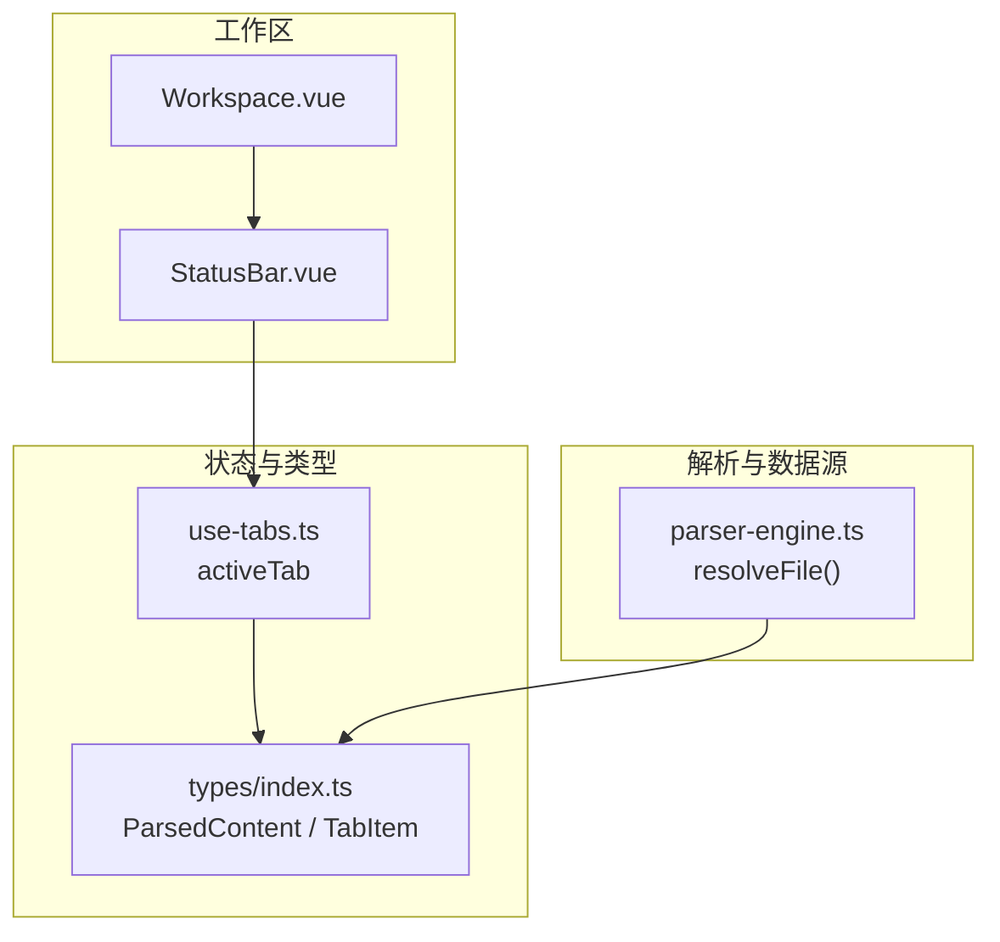
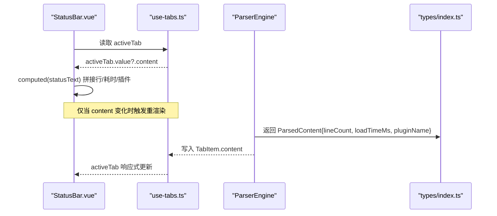
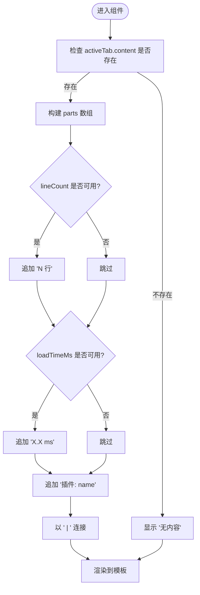
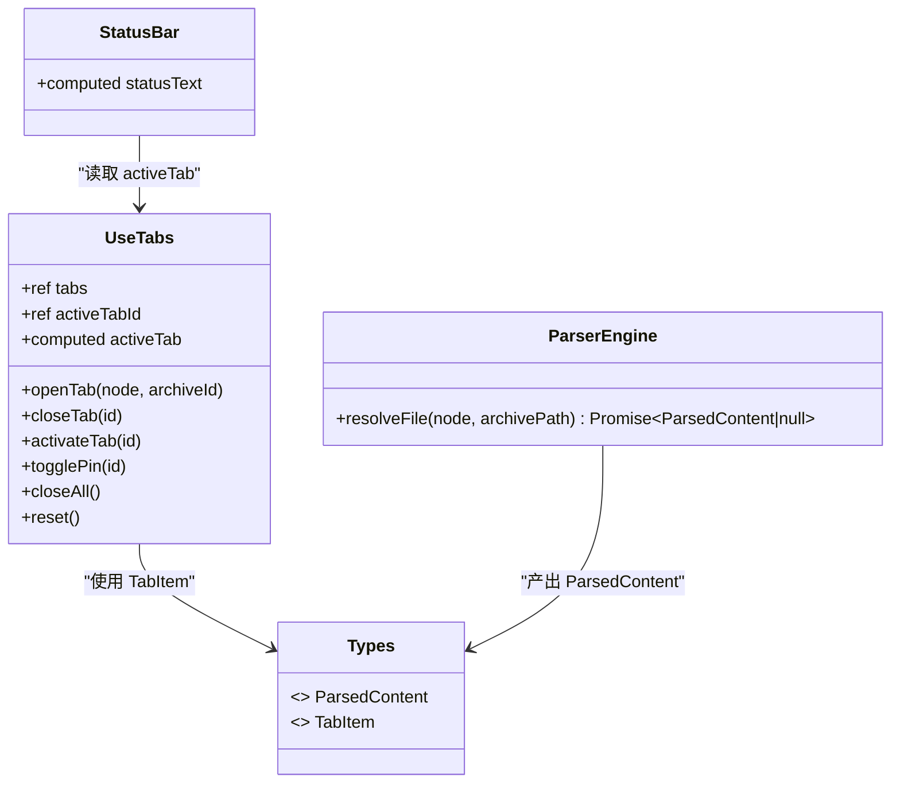

# 状态栏组件

<cite>
**本文引用的文件**   
- [StatusBar.vue](file://src/components/workspace/StatusBar.vue)
- [Workspace.vue](file://src/components/workspace/Workspace.vue)
- [use-tabs.ts](file://src/composables/use-tabs.ts)
- [parser-engine.ts](file://src/core/parser-engine.ts)
- [index.ts](file://src/types/index.ts)
- [theme.ts](file://src/styles/theme.ts)
</cite>

## 目录
1. [简介](#简介)
2. [项目结构](#项目结构)
3. [核心组件](#核心组件)
4. [架构总览](#架构总览)
5. [详细组件分析](#详细组件分析)
6. [依赖关系分析](#依赖关系分析)
7. [性能考虑](#性能考虑)
8. [故障排查指南](#故障排查指南)
9. [结论](#结论)
10. [附录：扩展开发指南](#附录扩展开发指南)

## 简介
本文件为 StatusBar 状态栏组件的权威文档，聚焦以下目标：
- 状态信息的展示机制：文件大小、编码格式、光标位置、行数统计等元数据的实时更新。
- 状态项的动态生成、格式化显示与点击交互能力。
- 与全局状态的同步机制及避免频繁更新的性能优化策略。
- 状态栏扩展开发指南：自定义状态项、监听器注册、主题适配等高级功能。

## 项目结构
状态栏位于工作区底部，与工作区容器、标签管理、解析引擎协同工作，形成“数据驱动 + 计算属性渲染”的最小闭环。

图表来源
- [Workspace.vue:1-36](file://src/components/workspace/Workspace.vue#L1-L36)
- [StatusBar.vue:1-24](file://src/components/workspace/StatusBar.vue#L1-L24)
- [use-tabs.ts:1-64](file://src/composables/use-tabs.ts#L1-L64)
- [parser-engine.ts:1-35](file://src/core/parser-engine.ts#L1-L35)
- [index.ts:26-54](file://src/types/index.ts#L26-L54)

章节来源
- [Workspace.vue:1-36](file://src/components/workspace/Workspace.vue#L1-L36)
- [StatusBar.vue:1-24](file://src/components/workspace/StatusBar.vue#L1-L24)
- [use-tabs.ts:1-64](file://src/composables/use-tabs.ts#L1-L64)
- [parser-engine.ts:1-35](file://src/core/parser-engine.ts#L1-L35)
- [index.ts:26-54](file://src/types/index.ts#L26-L54)

## 核心组件
- StatusBar.vue：负责将当前活动标签页的内容元信息（如行数、加载耗时、插件名）以文本形式呈现。
- use-tabs.ts：维护 tabs 列表与 activeTab 计算属性，提供打开、关闭、激活、固定等能力。
- parser-engine.ts：读取文件并调用插件解析，产出 ParsedContent（包含 lineCount、loadTimeMs、pluginName）。
- types/index.ts：定义 ParsedContent、TabItem 等关键数据结构，确保状态字段一致。

章节来源
- [StatusBar.vue:1-24](file://src/components/workspace/StatusBar.vue#L1-L24)
- [use-tabs.ts:1-64](file://src/composables/use-tabs.ts#L1-L64)
- [parser-engine.ts:1-35](file://src/core/parser-engine.ts#L1-L35)
- [index.ts:26-54](file://src/types/index.ts#L26-L54)

## 架构总览
状态栏通过 Vue 的计算属性订阅 activeTab.content，当解析结果变化时自动重渲染。解析流程由 ParserEngine 驱动，统一封装了 I/O、插件选择与计时，保证状态字段稳定。

图表来源
- [StatusBar.vue:8-16](file://src/components/workspace/StatusBar.vue#L8-L16)
- [use-tabs.ts:9-12](file://src/composables/use-tabs.ts#L9-L12)
- [parser-engine.ts:11-33](file://src/core/parser-engine.ts#L11-L33)
- [index.ts:26-32](file://src/types/index.ts#L26-L32)

## 详细组件分析

### StatusBar.vue 组件
- 数据来源：从 use-tab-manager 获取 activeTab，再取 content 字段。
- 展示逻辑：使用 computed 聚合 lineCount、loadTimeMs、pluginName，并以分隔符连接。
- 交互能力：当前实现为纯文本展示；可扩展为可点击状态项，触发跳转或详情弹窗。
- 样式与主题：基于 Naive UI 的 NText 深度层级与字体大小，遵循应用主题变量。

图表来源
- [StatusBar.vue:8-16](file://src/components/workspace/StatusBar.vue#L8-L16)

章节来源
- [StatusBar.vue:1-24](file://src/components/workspace/StatusBar.vue#L1-L24)

### 全局状态同步：use-tabs.ts
- activeTab 为 computed，根据 activeTabId 在 tabs 中查找对应项。
- openTab/closeTab/activateTab/togglePin/closeAll/reset 等方法维护标签生命周期。
- TabItem.content 由上层解析流程填充，状态栏通过 activeTab 间接消费。

章节来源
- [use-tabs.ts:1-64](file://src/composables/use-tabs.ts#L1-L64)

### 解析引擎：parser-engine.ts
- resolveFile 方法：
  - 记录开始时间，读取文件，按扩展名匹配插件。
  - 调用 safeParse 执行解析，构造 ParsedContent，包含 lineCount、loadTimeMs、pluginName。
  - 异常路径返回 null，避免污染状态。
- 该方法是状态栏元数据的主要来源。

章节来源
- [parser-engine.ts:1-35](file://src/core/parser-engine.ts#L1-L35)

### 数据类型契约：types/index.ts
- ParsedContent：type、data、lineCount、loadTimeMs、pluginName。
- TabItem：id、fileNode、archiveId、pinned、content。
- 这些类型保证了状态栏对字段的访问安全与一致性。

章节来源
- [index.ts:26-54](file://src/types/index.ts#L26-L54)

## 依赖关系分析
- StatusBar.vue 依赖 use-tabs.ts 提供的 activeTab。
- use-tabs.ts 依赖 types/index.ts 中的 TabItem、FileTreeNode。
- parser-engine.ts 依赖 types/index.ts 中的 ParsedContent，并通过 PluginRegistry 与适配器完成解析。
- Workspace.vue 作为容器组合 TabBar、PreviewPane、PreviewToolbar、StatusBar。

图表来源
- [StatusBar.vue:1-24](file://src/components/workspace/StatusBar.vue#L1-L24)
- [use-tabs.ts:1-64](file://src/composables/use-tabs.ts#L1-L64)
- [parser-engine.ts:1-35](file://src/core/parser-engine.ts#L1-L35)
- [index.ts:26-54](file://src/types/index.ts#L26-L54)

章节来源
- [Workspace.vue:1-36](file://src/components/workspace/Workspace.vue#L1-L36)
- [StatusBar.vue:1-24](file://src/components/workspace/StatusBar.vue#L1-L24)
- [use-tabs.ts:1-64](file://src/composables/use-tabs.ts#L1-L64)
- [parser-engine.ts:1-35](file://src/core/parser-engine.ts#L1-L35)
- [index.ts:26-54](file://src/types/index.ts#L26-L54)

## 性能考虑
- 计算属性缓存：statusText 仅在 activeTab.content 变化时重新计算，避免不必要的 DOM 更新。
- 最小化重渲染：仅向状态栏暴露必要字段（lineCount、loadTimeMs、pluginName），减少响应式粒度。
- 解析节流建议：若未来需要高频更新（如实时日志），可在解析层引入防抖/增量更新策略，避免每次输入都触发全量解析。
- 大文件处理：对于超大文件，建议分页/虚拟滚动与按需解析，降低内存占用与渲染压力。

[本节为通用指导，不直接分析具体文件]

## 故障排查指南
- 状态栏显示“无内容”：
  - 检查 activeTab 是否为空，确认已打开标签且 content 已填充。
  - 验证 ParserEngine.resolveFile 是否成功返回 ParsedContent。
- 行数或耗时未显示：
  - 确认 ParsedContent.lineCount/loadTimeMs 是否被正确赋值。
  - 检查插件解析是否返回 lineCount。
- 插件名称缺失：
  - 确认 registry.getParser(ext) 能匹配到插件，且 plugin.name 有效。

章节来源
- [StatusBar.vue:8-16](file://src/components/workspace/StatusBar.vue#L8-L16)
- [parser-engine.ts:11-33](file://src/core/parser-engine.ts#L11-L33)
- [index.ts:26-32](file://src/types/index.ts#L26-L32)

## 结论
StatusBar 采用“数据驱动 + 计算属性”的轻量实现，聚焦于展示当前活动标签的关键元信息。通过与 use-tabs 和 parser-engine 的协作，实现了稳定的状态同步与清晰的职责边界。后续可按扩展指南增加更多状态项与交互能力，同时保持性能与可维护性。

[本节为总结，不直接分析具体文件]

## 附录：扩展开发指南

### 添加自定义状态项
- 步骤一：在解析阶段补充字段
  - 在 ParserEngine 产出 ParsedContent 时，新增所需字段（例如 cursorPosition、encoding、fileSize）。
  - 参考：[parser-engine.ts:11-33](file://src/core/parser-engine.ts#L11-L33)、[index.ts:26-32](file://src/types/index.ts#L26-L32)
- 步骤二：在状态栏中消费新字段
  - 在 statusText 的计算逻辑中追加新字段格式化片段。
  - 参考：[StatusBar.vue:8-16](file://src/components/workspace/StatusBar.vue#L8-L16)
- 步骤三：类型校验
  - 在 ParsedContent 接口中声明新字段，确保 TypeScript 类型安全。
  - 参考：[index.ts:26-32](file://src/types/index.ts#L26-L32)

章节来源
- [parser-engine.ts:11-33](file://src/core/parser-engine.ts#L11-L33)
- [StatusBar.vue:8-16](file://src/components/workspace/StatusBar.vue#L8-L16)
- [index.ts:26-32](file://src/types/index.ts#L26-L32)

### 状态监听器注册
- 方案一：基于 activeTab 的 computed 订阅
  - 在组件内通过 computed 或 watch 监听 activeTab.content 的变化，触发副作用（如上报埋点）。
  - 参考：[use-tabs.ts:9-12](file://src/composables/use-tabs.ts#L9-L12)
- 方案二：集中式事件总线
  - 在解析完成后派发事件，状态栏或其他模块订阅事件进行更新。
  - 建议在 ParserEngine 解析成功后派发事件，便于解耦。

章节来源
- [use-tabs.ts:9-12](file://src/composables/use-tabs.ts#L9-L12)
- [parser-engine.ts:11-33](file://src/core/parser-engine.ts#L11-L33)

### 点击交互功能
- 在状态栏中将某段文本包裹为可点击元素（如按钮或链接），点击后：
  - 跳转到对应文件的特定行（需传入 lineNumber）。
  - 弹出详情面板展示编码、大小、光标位置等。
- 注意：
  - 确保传入参数完整（如 lineNumber、encoding）。
  - 避免在高频更新区域产生过多事件冒泡。

[本节为概念性说明，不直接分析具体文件]

### 主题适配
- 应用级主题变量：
  - 通过 CSS 变量控制背景、文字、边框等颜色，状态栏文本颜色应跟随 --text-primary。
  - 参考：[AppLayout.vue 主题变量定义:120-150](file://src/layout/AppLayout.vue#L120-L150)
- Naive UI 主题覆盖：
  - 使用 themeOverrides 统一设置主色、错误色、字体族等。
  - 参考：[theme.ts:1-13](file://src/styles/theme.ts#L1-L13)
- 深色/浅色切换：
  - 在根节点切换 data-theme，状态栏无需额外处理即可继承主题。

章节来源
- [theme.ts:1-13](file://src/styles/theme.ts#L1-L13)
- [AppLayout.vue:120-150](file://src/layout/AppLayout.vue#L120-L150)

### 与预览工具栏联动
- PreviewToolbar 提供字号、换行、行号、编码等配置，状态栏可展示当前编码与行号开关状态，提升一致性。
- 建议：
  - 将编码与行号状态提升到全局 store 或通过 use-tabs 的 content 附加字段传递。
  - 状态栏读取这些字段并格式化显示。

章节来源
- [Workspace.vue:1-36](file://src/components/workspace/Workspace.vue#L1-L36)