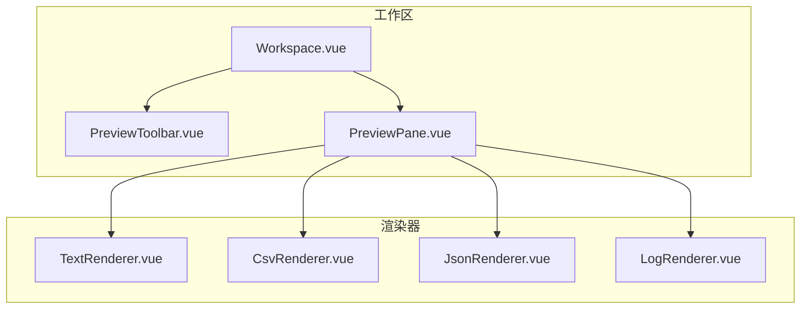
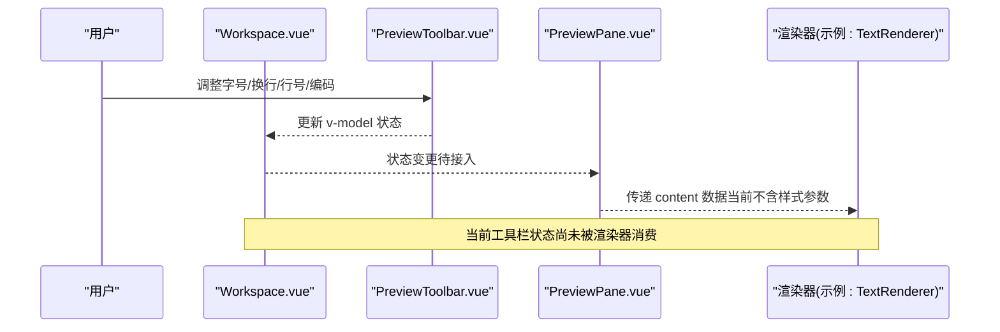
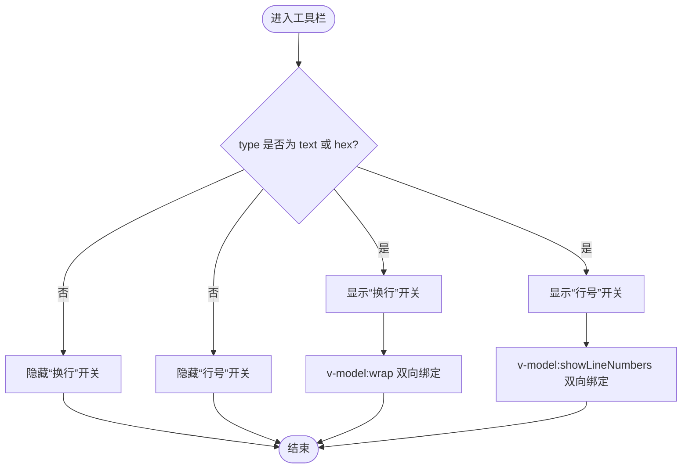
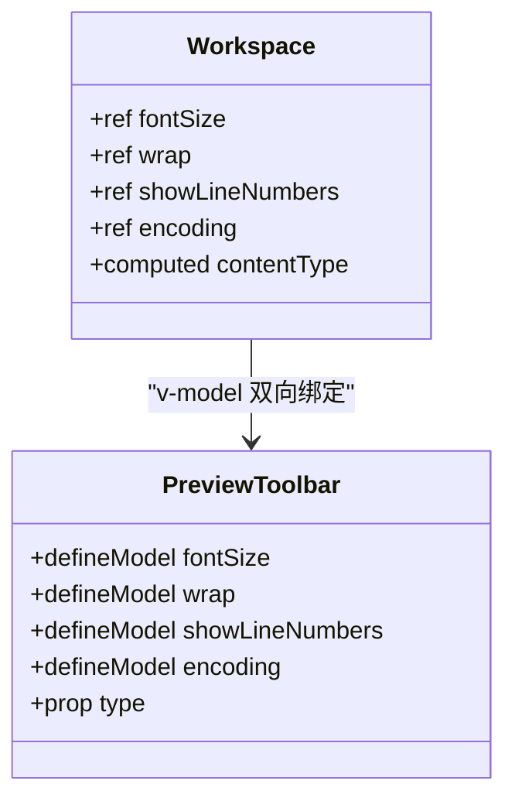
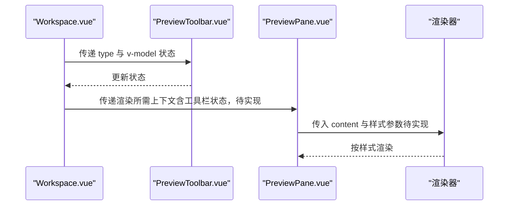
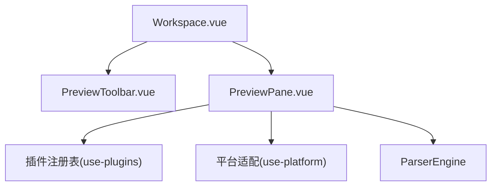

# 预览工具栏组件

<cite>
**本文引用的文件**   
- [PreviewToolbar.vue](file://src/components/workspace/PreviewToolbar.vue)
- [Workspace.vue](file://src/components/workspace/Workspace.vue)
- [PreviewPane.vue](file://src/components/workspace/PreviewPane.vue)
- [TextRenderer.vue](file://src/views/renderers/TextRenderer.vue)
- [CsvRenderer.vue](file://src/views/renderers/CsvRenderer.vue)
- [JsonRenderer.vue](file://src/views/renderers/JsonRenderer.vue)
- [LogRenderer.vue](file://src/views/renderers/LogRenderer.vue)
</cite>

## 目录
1. [简介](#简介)
2. [项目结构](#项目结构)
3. [核心组件](#核心组件)
4. [架构总览](#架构总览)
5. [详细组件分析](#详细组件分析)
6. [依赖关系分析](#依赖关系分析)
7. [性能考量](#性能考量)
8. [故障排查指南](#故障排查指南)
9. [结论](#结论)
10. [附录：扩展开发指南](#附录扩展开发指南)

## 简介
本文件围绕 PreviewToolbar 预览工具栏组件，系统化说明其按钮功能、状态管理、与预览面板的通信协议、属性双向绑定机制，并给出扩展开发指南（自定义按钮、分组、动态配置）。同时结合渲染器实现现状，指出当前能力边界与后续优化方向。

## 项目结构
预览相关的前端代码主要分布在 workspace 工作区组件与 views/renderers 渲染器中：
- Workspace 作为容器，集中维护预览工具栏的状态，并通过 v-model 将状态传递给 PreviewToolbar。
- PreviewToolbar 提供字号、自动换行、行号、编码等控制项，使用 defineModel 进行双向绑定。
- PreviewPane 负责根据当前标签页内容选择对应渲染器并渲染数据。
- 各渲染器（文本、CSV、JSON、日志）各自处理展示逻辑，当前未直接消费工具栏状态。

图表来源
- [Workspace.vue:1-36](file://src/components/workspace/Workspace.vue#L1-L36)
- [PreviewToolbar.vue:1-44](file://src/components/workspace/PreviewToolbar.vue#L1-L44)
- [PreviewPane.vue:1-58](file://src/components/workspace/PreviewPane.vue#L1-L58)
- [TextRenderer.vue:1-38](file://src/views/renderers/TextRenderer.vue#L1-L38)
- [CsvRenderer.vue:1-52](file://src/views/renderers/CsvRenderer.vue#L1-L52)
- [JsonRenderer.vue:1-30](file://src/views/renderers/JsonRenderer.vue#L1-L30)
- [LogRenderer.vue:1-57](file://src/views/renderers/LogRenderer.vue#L1-L57)

章节来源
- [Workspace.vue:1-36](file://src/components/workspace/Workspace.vue#L1-L36)
- [PreviewToolbar.vue:1-44](file://src/components/workspace/PreviewToolbar.vue#L1-L44)
- [PreviewPane.vue:1-58](file://src/components/workspace/PreviewPane.vue#L1-L58)

## 核心组件
- PreviewToolbar
  - 输入控件：字号（数字输入）、自动换行（开关）、行号显示（开关）、编码（下拉）。
  - 类型感知：根据 type 决定“换行”和“行号”是否可见（仅 text/hex 类型显示）。
  - 状态管理：通过 defineModel 声明 fontSize、wrap、showLineNumbers、encoding 四个双向绑定属性。
- Workspace
  - 集中持有上述四个状态，并通过 v-model 透传给 PreviewToolbar。
  - 计算 contentType 以驱动工具栏按钮显隐。
- PreviewPane
  - 根据 activeTab 的内容类型选择渲染器，并将 content 数据传入渲染器。
  - 当前未直接接收或应用工具栏状态。

章节来源
- [PreviewToolbar.vue:1-44](file://src/components/workspace/PreviewToolbar.vue#L1-L44)
- [Workspace.vue:1-36](file://src/components/workspace/Workspace.vue#L1-L36)
- [PreviewPane.vue:1-58](file://src/components/workspace/PreviewPane.vue#L1-L58)

## 架构总览
预览工具栏与预览面板之间的交互采用“父级状态 + 子组件双向绑定”的模式：
- 父组件（Workspace）维护状态源。
- 子组件（PreviewToolbar）通过 defineModel 暴露可双向绑定的属性。
- 渲染器（如 TextRenderer）目前未直接消费这些状态；需要由父级或渲染器层自行订阅与应用。

图表来源
- [Workspace.vue:24-31](file://src/components/workspace/Workspace.vue#L24-L31)
- [PreviewToolbar.vue:8-17](file://src/components/workspace/PreviewToolbar.vue#L8-L17)
- [PreviewPane.vue:37-55](file://src/components/workspace/PreviewPane.vue#L37-L55)
- [TextRenderer.vue:1-38](file://src/views/renderers/TextRenderer.vue#L1-L38)

## 详细组件分析

### 工具栏按钮与功能
- 字号调整
  - 控件：数字输入框，支持最小/最大范围限制。
  - 绑定：v-model:fontSize，类型为 number。
- 自动换行开关
  - 控件：开关，仅在 type 为 text 或 hex 时显示。
  - 绑定：v-model:wrap，类型为 boolean。
- 行号显示控制
  - 控件：开关，仅在 type 为 text 或 hex 时显示。
  - 绑定：v-model:showLineNumbers，类型为 boolean。
- 编码选择
  - 控件：下拉选项，包含 UTF-8、GBK、Shift_JIS。
  - 绑定：v-model:encoding，类型为 string。

图表来源
- [PreviewToolbar.vue:27-36](file://src/components/workspace/PreviewToolbar.vue#L27-L36)
- [PreviewToolbar.vue:8-17](file://src/components/workspace/PreviewToolbar.vue#L8-L17)

章节来源
- [PreviewToolbar.vue:1-44](file://src/components/workspace/PreviewToolbar.vue#L1-L44)

### 状态管理与双向绑定
- 父级状态定义（Workspace）
  - fontSize、wrap、showLineNumbers、encoding 均为响应式 ref。
  - contentType 基于 activeTab.content.type 计算得出，用于控制工具栏按钮显隐。
- 子级模型声明（PreviewToolbar）
  - 使用 defineModel 声明四个属性，分别对应父级的 v-model:xxx。
- 绑定链路
  - 用户在工具栏操作 → 触发子组件内部值变化 → 通过 v-model 同步回父组件 → 父组件状态更新。

图表来源
- [Workspace.vue:11-18](file://src/components/workspace/Workspace.vue#L11-L18)
- [Workspace.vue:24-31](file://src/components/workspace/Workspace.vue#L24-L31)
- [PreviewToolbar.vue:4-17](file://src/components/workspace/PreviewToolbar.vue#L4-L17)

章节来源
- [Workspace.vue:11-18](file://src/components/workspace/Workspace.vue#L11-L18)
- [Workspace.vue:24-31](file://src/components/workspace/Workspace.vue#L24-L31)
- [PreviewToolbar.vue:4-17](file://src/components/workspace/PreviewToolbar.vue#L4-L17)

### 与预览面板的通信协议
- 当前协议
  - PreviewPane 根据 activeTab 的内容类型选择渲染器，并将 content 数据传入渲染器。
  - 工具栏状态（字号、换行、行号、编码）尚未通过 props 或事件下发到渲染器。
- 建议协议（概念性）
  - 父级（Workspace）在渲染器实例化或切换时，将工具栏状态作为 props 传入渲染器。
  - 渲染器内部根据 props 应用字体大小、换行策略、行号显示等样式。
  - 编码选择可用于解析阶段（若涉及文本重解析），或由上层适配器处理。

图表来源
- [PreviewPane.vue:37-55](file://src/components/workspace/PreviewPane.vue#L37-L55)
- [Workspace.vue:24-31](file://src/components/workspace/Workspace.vue#L24-L31)

章节来源
- [PreviewPane.vue:37-55](file://src/components/workspace/PreviewPane.vue#L37-L55)
- [Workspace.vue:24-31](file://src/components/workspace/Workspace.vue#L24-L31)

### 按钮禁用逻辑与快捷键
- 当前实现
  - 未发现针对按钮的禁用逻辑或全局快捷键绑定。
- 建议方案（概念性）
  - 根据当前文件类型或加载状态动态禁用不相关按钮（例如非文本类型禁用换行/行号）。
  - 通过全局键盘监听绑定常用快捷键（如 Ctrl/Cmd + +/- 调整字号，Ctrl/Cmd + B 切换换行等）。

[本节为概念性建议，不涉及具体源码]

## 依赖关系分析
- 组件耦合
  - Workspace 与 PreviewToolbar 强耦合（通过 v-model 属性名约定）。
  - PreviewPane 与渲染器弱耦合（通过插件注册表动态选择渲染器）。
- 外部依赖
  - UI 库：naive-ui（输入、开关、选择、空间布局等）。
  - 插件引擎与平台适配：PreviewPane 中使用 usePluginEngine、usePlatform、ParserEngine。

图表来源
- [Workspace.vue:1-36](file://src/components/workspace/Workspace.vue#L1-L36)
- [PreviewPane.vue:1-22](file://src/components/workspace/PreviewPane.vue#L1-L22)

章节来源
- [Workspace.vue:1-36](file://src/components/workspace/Workspace.vue#L1-L36)
- [PreviewPane.vue:1-22](file://src/components/workspace/PreviewPane.vue#L1-L22)

## 性能考量
- 渲染器性能
  - 文本渲染器按行分割渲染，适合中小规模文本；超大文本需考虑虚拟滚动或分页。
- 状态传播
  - 当前工具栏状态未影响渲染器，避免不必要的重渲染；未来接入时应按需传递，减少 prop 风暴。
- 编码切换
  - 若触发重新解析，应缓存已解析结果并按需刷新，避免重复 IO。

[本节为通用指导，不涉及具体源码]

## 故障排查指南
- 工具栏状态未生效于渲染器
  - 检查父级是否正确将状态传入渲染器（当前未实现）。
  - 确认渲染器是否读取并应用了相应样式参数。
- 按钮显隐异常
  - 检查 type 计算是否正确，确保 text/hex 类型下“换行/行号”可见。
- 编码选项无效
  - 确认编码值与后端/解析器支持的编码一致。

章节来源
- [PreviewToolbar.vue:27-36](file://src/components/workspace/PreviewToolbar.vue#L27-L36)
- [Workspace.vue:16-18](file://src/components/workspace/Workspace.vue#L16-L18)

## 结论
PreviewToolbar 提供了基础且清晰的预览控制入口，采用父子双向绑定模式管理状态。当前与预览面板的通信集中在数据层面，样式与行为参数尚未贯通至渲染器。建议在父级统一注入工具栏状态，并在渲染器中消费，以实现完整的预览体验闭环。

[本节为总结，不涉及具体源码]

## 附录：扩展开发指南

### 添加自定义按钮
- 步骤
  - 在 PreviewToolbar 中新增一个 defineModel 属性，并在模板中添加对应控件。
  - 在 Workspace 中声明对应的 ref 状态，并通过 v-model 绑定。
  - 如需影响渲染器，将新状态从父级传入渲染器，或在渲染器内订阅该状态。
- 注意事项
  - 保持属性命名语义清晰，遵循现有命名规范（fontSize、wrap、showLineNumbers、encoding）。
  - 对条件显示的控制应与 type 保持一致，避免无关按钮干扰。

章节来源
- [PreviewToolbar.vue:8-17](file://src/components/workspace/PreviewToolbar.vue#L8-L17)
- [Workspace.vue:11-14](file://src/components/workspace/Workspace.vue#L11-L14)

### 工具栏分组
- 建议
  - 使用 NSpace 将相关控件分组，提升可读性与操作效率。
  - 可按“显示设置”“编码设置”等维度分组，必要时增加分隔线。
- 实现要点
  - 在模板中嵌套 NSpace 组织控件布局。
  - 保持间距与对齐风格一致。

章节来源
- [PreviewToolbar.vue:21-42](file://src/components/workspace/PreviewToolbar.vue#L21-L42)

### 动态配置
- 建议
  - 将工具栏按钮集合与默认值抽离为配置文件，便于运行时扩展。
  - 支持按文件类型动态启用/禁用某些按钮。
- 实现要点
  - 在 Workspace 或独立配置模块中维护按钮清单与默认值。
  - 在 PreviewToolbar 中根据配置渲染控件，并绑定对应 v-model。

[本节为概念性建议，不涉及具体源码]

### 快捷键绑定机制（概念性）
- 建议
  - 在根组件或专用 composable 中监听全局键盘事件。
  - 将快捷键映射到工具栏状态更新函数，避免侵入具体控件。
- 注意事项
  - 区分操作系统差异（Ctrl vs Cmd）。
  - 防止与浏览器或编辑器默认快捷键冲突。

[本节为概念性建议，不涉及具体源码]

### 与渲染器的集成（概念性）
- 建议
  - 在 PreviewPane 或 Workspace 中将工具栏状态作为 props 传入渲染器。
  - 渲染器内部根据 props 应用字体大小、换行策略、行号显示等样式。
- 示例路径参考
  - 文本渲染器：[TextRenderer.vue](file://src/views/renderers/TextRenderer.vue)
  - CSV 渲染器：[CsvRenderer.vue](file://src/views/renderers/CsvRenderer.vue)
  - JSON 渲染器：[JsonRenderer.vue](file://src/views/renderers/JsonRenderer.vue)
  - 日志渲染器：[LogRenderer.vue](file://src/views/renderers/LogRenderer.vue)

章节来源
- [PreviewPane.vue:37-55](file://src/components/workspace/PreviewPane.vue#L37-L55)
- [TextRenderer.vue:1-38](file://src/views/renderers/TextRenderer.vue#L1-L38)
- [CsvRenderer.vue:1-52](file://src/views/renderers/CsvRenderer.vue#L1-L52)
- [JsonRenderer.vue:1-30](file://src/views/renderers/JsonRenderer.vue#L1-L30)
- [LogRenderer.vue:1-57](file://src/views/renderers/LogRenderer.vue#L1-L57)