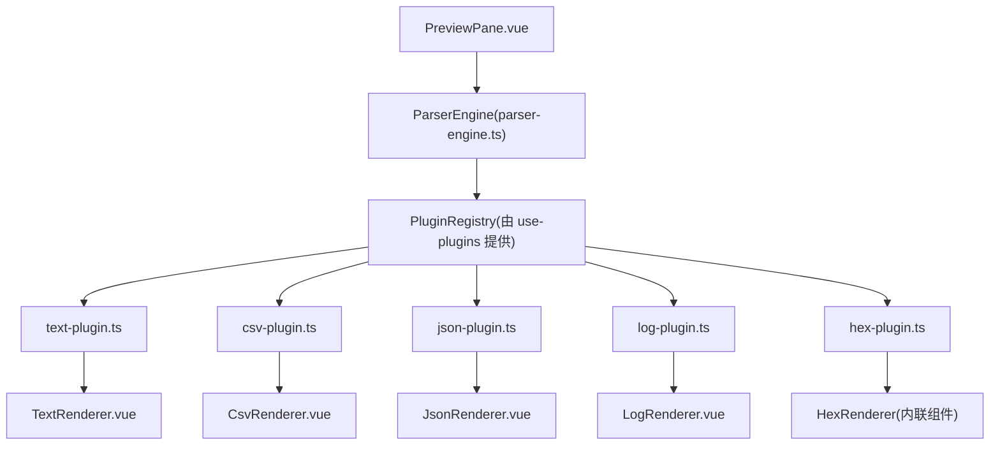
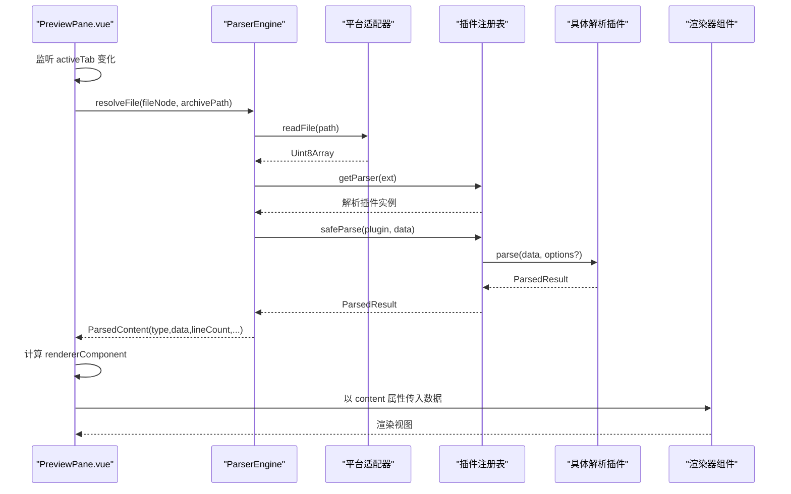
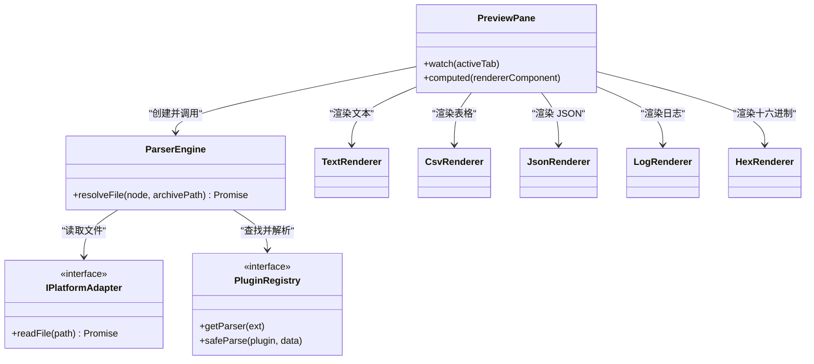

# 预览面板组件

<cite>
**本文引用的文件**   
- [PreviewPane.vue](file://src/components/workspace/PreviewPane.vue)
- [parser-engine.ts](file://src/core/parser-engine.ts)
- [types.ts](file://src/plugins/types.ts)
- [index.ts](file://src/views/renderers/index.ts)
- [TextRenderer.vue](file://src/views/renderers/TextRenderer.vue)
- [CsvRenderer.vue](file://src/views/renderers/CsvRenderer.vue)
- [JsonRenderer.vue](file://src/views/renderers/JsonRenderer.vue)
- [LogRenderer.vue](file://src/views/renderers/LogRenderer.vue)
- [hex-plugin.ts](file://src/plugins/parser/hex-plugin.ts)
- [text-plugin.ts](file://src/plugins/parser/text-plugin.ts)
- [csv-plugin.ts](file://src/plugins/parser/csv-plugin.ts)
- [json-plugin.ts](file://src/plugins/parser/json-plugin.ts)
- [log-plugin.ts](file://src/plugins/parser/log-plugin.ts)
- [text-parser.ts](file://src/plugins/parsers/text-parser.ts)
- [csv-parser.ts](file://src/plugins/parsers/csv-parser.ts)
- [json-parser.ts](file://src/plugins/parsers/json-parser.ts)
</cite>

## 目录
1. [简介](#简介)
2. [项目结构](#项目结构)
3. [核心组件](#核心组件)
4. [架构总览](#架构总览)
5. [详细组件分析](#详细组件分析)
6. [依赖关系分析](#依赖关系分析)
7. [性能与内存优化](#性能与内存优化)
8. [故障排查指南](#故障排查指南)
9. [结论](#结论)
10. [附录：自定义渲染器开发指南](#附录自定义渲染器开发指南)

## 简介
本文件为 PreviewPane 预览面板组件的综合文档，聚焦于多格式内容（JSON、CSV、文本、日志、十六进制）的渲染机制与实现细节。文档涵盖：
- 文件解析与渲染管线
- 各格式渲染策略与样式
- 缩放、行号、语法高亮、搜索定位等能力现状与建议
- 虚拟滚动与大文件处理思路
- 内存管理与垃圾回收建议
- 自定义渲染器的接口定义、事件处理与样式定制方法

## 项目结构
预览面板位于工作区组件中，通过插件引擎动态选择并挂载对应渲染器。整体流程如下：
- PreviewPane 监听活动标签页变化，调用 ParserEngine 读取文件并解析
- ParserEngine 根据扩展名从插件注册表获取解析器，执行解析并返回结构化数据
- PreviewPane 根据解析结果类型，从渲染器索引中选择对应的 Vue 组件进行渲染

图表来源
- [PreviewPane.vue:1-58](file://src/components/workspace/PreviewPane.vue#L1-L58)
- [parser-engine.ts:1-35](file://src/core/parser-engine.ts#L1-L35)
- [text-plugin.ts:1-18](file://src/plugins/parser/text-plugin.ts#L1-L18)
- [csv-plugin.ts:1-28](file://src/plugins/parser/csv-plugin.ts#L1-L28)
- [json-plugin.ts:1-19](file://src/plugins/parser/json-plugin.ts#L1-L19)
- [log-plugin.ts:1-18](file://src/plugins/parser/log-plugin.ts#L1-L18)
- [hex-plugin.ts:1-53](file://src/plugins/parser/hex-plugin.ts#L1-L53)
- [index.ts:1-5](file://src/views/renderers/index.ts#L1-L5)

章节来源
- [PreviewPane.vue:1-58](file://src/components/workspace/PreviewPane.vue#L1-L58)
- [parser-engine.ts:1-35](file://src/core/parser-engine.ts#L1-L35)
- [index.ts:1-5](file://src/views/renderers/index.ts#L1-L5)

## 核心组件
- PreviewPane：负责加载当前活动标签页的文件内容，并根据解析结果动态渲染对应组件；使用错误边界包裹渲染区域，避免单个渲染器异常影响整体。
- ParserEngine：封装平台适配器与插件注册表，完成“读取文件→匹配解析器→安全解析→返回统一数据结构”的流程。
- 渲染器集合：TextRenderer、CsvRenderer、JsonRenderer、LogRenderer 以及 HexRenderer（十六进制）。

章节来源
- [PreviewPane.vue:1-58](file://src/components/workspace/PreviewPane.vue#L1-L58)
- [parser-engine.ts:1-35](file://src/core/parser-engine.ts#L1-L35)
- [types.ts:1-37](file://src/plugins/types.ts#L1-L37)

## 架构总览
下图展示了从用户切换标签到最终渲染的完整时序。

图表来源
- [PreviewPane.vue:1-58](file://src/components/workspace/PreviewPane.vue#L1-L58)
- [parser-engine.ts:1-35](file://src/core/parser-engine.ts#L1-L35)
- [types.ts:1-37](file://src/plugins/types.ts#L1-L37)

## 详细组件分析

### 文本渲染器（TextRenderer）
- 输入：字符串
- 行为：按换行分割逐行展示，左侧显示行号，保持空白字符原样输出
- 样式：等宽字体、暗色背景、行号不可选中
- 适用场景：纯文本、代码片段、配置文件等

章节来源
- [TextRenderer.vue:1-38](file://src/views/renderers/TextRenderer.vue#L1-L38)
- [text-plugin.ts:1-18](file://src/plugins/parser/text-plugin.ts#L1-L18)
- [text-parser.ts:1-8](file://src/plugins/parsers/text-parser.ts#L1-L8)

### CSV 渲染器（CsvRenderer）
- 输入：包含 headers 与 rows 的结构化对象
- 行为：首行作为表头，后续每行作为表格行；表头固定置顶
- 样式：网格边框、等宽字体、暗色主题
- 配置：支持分隔符与固定表头等选项（由插件配置模式声明）

章节来源
- [CsvRenderer.vue:1-52](file://src/views/renderers/CsvRenderer.vue#L1-L52)
- [csv-plugin.ts:1-28](file://src/plugins/parser/csv-plugin.ts#L1-L28)
- [csv-parser.ts:1-17](file://src/plugins/parsers/csv-parser.ts#L1-L17)

### JSON 渲染器（JsonRenderer）
- 输入：任意可序列化的 JSON 值
- 行为：递归渲染节点树，默认展开根节点
- 样式：等宽字体、暗色背景、便于阅读的代码风格

章节来源
- [JsonRenderer.vue:1-30](file://src/views/renderers/JsonRenderer.vue#L1-L30)
- [json-plugin.ts:1-19](file://src/plugins/parser/json-plugin.ts#L1-L19)
- [json-parser.ts:1-17](file://src/plugins/parsers/json-parser.ts#L1-L17)

### 日志渲染器（LogRenderer）
- 输入：日志行数组，包含行号、时间戳、级别、模块、消息等字段
- 行为：按列展示关键信息，级别着色区分
- 样式：等宽字体、暗色背景、列间距清晰

章节来源
- [LogRenderer.vue:1-57](file://src/views/renderers/LogRenderer.vue#L1-L57)
- [log-plugin.ts:1-18](file://src/plugins/parser/log-plugin.ts#L1-L18)

### 十六进制渲染器（HexRenderer）
- 输入：原始字节数组
- 行为：按 16 字节一行格式化，同时显示偏移量、十六进制与 ASCII 可读部分
- 特点：无需特定扩展名即可兜底渲染二进制内容

章节来源
- [hex-plugin.ts:1-53](file://src/plugins/parser/hex-plugin.ts#L1-L53)

### 渲染管线与类型契约
- 解析结果统一为 ParsedResult，包含 type、data、lineCount 等字段
- 解析器插件需实现 canParse、parse、getComponent 等方法，并可声明配置模式
- PreviewPane 根据解析结果的 type 或扩展名映射到对应渲染器组件

章节来源
- [types.ts:1-37](file://src/plugins/types.ts#L1-L37)
- [index.ts:1-5](file://src/views/renderers/index.ts#L1-L5)

## 依赖关系分析
- PreviewPane 依赖：
  - 标签管理（activeTab）
  - 插件引擎（registry）
  - 平台适配（adapter）
  - 错误边界（ErrorBoundary）
- ParserEngine 依赖：
  - 平台适配器（IPlatformAdapter）
  - 插件注册表（PluginRegistry）
- 渲染器依赖：
  - 各自的数据结构与样式
  - JsonRenderer 依赖 JsonNode 递归节点（在渲染器目录中）

图表来源
- [PreviewPane.vue:1-58](file://src/components/workspace/PreviewPane.vue#L1-L58)
- [parser-engine.ts:1-35](file://src/core/parser-engine.ts#L1-L35)
- [types.ts:1-37](file://src/plugins/types.ts#L1-L37)

章节来源
- [PreviewPane.vue:1-58](file://src/components/workspace/PreviewPane.vue#L1-L58)
- [parser-engine.ts:1-35](file://src/core/parser-engine.ts#L1-L35)
- [types.ts:1-37](file://src/plugins/types.ts#L1-L37)

## 性能与内存优化
当前实现要点与改进建议：
- 大文件渲染
  - 现状：文本、CSV、日志、JSON、十六进制均直接渲染全部数据，未采用虚拟滚动
  - 建议：引入虚拟滚动（仅渲染可视区域），对长列表（CSV/日志/文本）显著降低 DOM 节点数量与重排开销
- 行号与滚动同步
  - 现状：文本与日志渲染器内置行号
  - 建议：在虚拟滚动下维护可见窗口与真实行号的映射，确保行号与内容同步
- 语法高亮
  - 现状：无语法高亮
  - 建议：按需引入轻量级高亮库，仅在文本/JSON/日志等场景启用，避免全量高亮带来的 CPU 压力
- 搜索定位
  - 现状：未见全局搜索集成
  - 建议：基于已解析的文本/结构化数据建立索引，结合滚动容器的高亮标记与跳转
- 缩放
  - 现状：未提供缩放控制
  - 建议：通过 CSS 变量或 transform: scale 控制字号与布局，配合等宽字体保证对齐
- 内存与垃圾回收
  - 建议：
    - 及时释放不再使用的 ArrayBuffer/Uint8Array 引用
    - 在切换标签时清理旧渲染器状态与定时器
    - 对超大文件采用分块解析与增量渲染
    - 避免闭包持有大对象引用，防止 GC 无法回收

[本节为通用性能建议，不直接分析具体文件]

## 故障排查指南
- 常见现象
  - 切换标签后一直显示“加载中...”：检查平台适配器是否成功读取文件、扩展名是否正确匹配解析器
  - 渲染空白或报错：确认解析器返回的 ParsedResult.type 与渲染器期望的数据结构一致
  - 十六进制渲染异常：确认输入为 Uint8Array，且长度合理
- 定位步骤
  - 查看 ParserEngine.resolveFile 的返回值与耗时统计
  - 检查插件的 canParse 与 parse 逻辑是否符合预期
  - 在渲染器层增加空值与边界条件判断
- 恢复策略
  - 使用 ErrorBoundary 捕获渲染异常，回退到空态提示
  - 对解析失败的情况降级为十六进制或文本视图

章节来源
- [PreviewPane.vue:1-58](file://src/components/workspace/PreviewPane.vue#L1-L58)
- [parser-engine.ts:1-35](file://src/core/parser-engine.ts#L1-L35)

## 结论
PreviewPane 通过“解析器插件 + 渲染器组件”的解耦设计，实现了多格式文件的统一预览体验。当前版本在易用性与可扩展性方面表现良好，但在大文件渲染、搜索定位、语法高亮与缩放等方面仍有优化空间。建议优先引入虚拟滚动与按需高亮，以提升性能与交互体验。

[本节为总结性内容，不直接分析具体文件]

## 附录：自定义渲染器开发指南

### 渲染器接口与契约
- 解析器插件需实现以下能力：
  - name：插件名称
  - supportedExtensions：支持的扩展名列表
  - canParse(file)：判定是否可解析该文件
  - parse(data, options?)：将原始字节转换为结构化数据，返回 ParsedResult
  - getComponent()：返回用于渲染的 Vue 组件
  - getConfigSchema?()：可选，声明渲染器配置项（如分隔符、开关等）
- 渲染器组件约定：
  - 接收 content 属性，类型为解析结果中的 data 字段
  - 内部自行处理空值与边界情况
  - 建议使用等宽字体与暗色主题保持一致体验

章节来源
- [types.ts:1-37](file://src/plugins/types.ts#L1-L37)
- [index.ts:1-5](file://src/views/renderers/index.ts#L1-L5)

### 事件处理与交互
- 建议在渲染器组件内暴露事件（如点击行、复制内容、跳转到指定行等），由上层 PreviewPane 或父组件统一处理
- 对于需要外部控制的特性（如搜索高亮、缩放），可通过 props 注入状态与回调

[本节为通用指导，不直接分析具体文件]

### 样式定制
- 推荐通过 CSS 变量或主题系统统一管理字体、字号、颜色与间距
- 对表格类渲染器（CSV）建议保留表头固定与横向滚动
- 对日志与文本渲染器建议保持行高与字距稳定，提升可读性

[本节为通用指导，不直接分析具体文件]

### 示例：新增一种格式的渲染器
- 新建解析器插件：
  - 实现 canParse、parse、getComponent
  - 在插件注册表中注册
- 新建渲染器组件：
  - 接收 content 属性
  - 实现基础样式与交互
- 在 PreviewPane 中自动生效：
  - 通过扩展名匹配到插件
  - 根据解析结果类型选择渲染器

章节来源
- [text-plugin.ts:1-18](file://src/plugins/parser/text-plugin.ts#L1-L18)
- [csv-plugin.ts:1-28](file://src/plugins/parser/csv-plugin.ts#L1-L28)
- [json-plugin.ts:1-19](file://src/plugins/parser/json-plugin.ts#L1-L19)
- [log-plugin.ts:1-18](file://src/plugins/parser/log-plugin.ts#L1-L18)
- [hex-plugin.ts:1-53](file://src/plugins/parser/hex-plugin.ts#L1-L53)