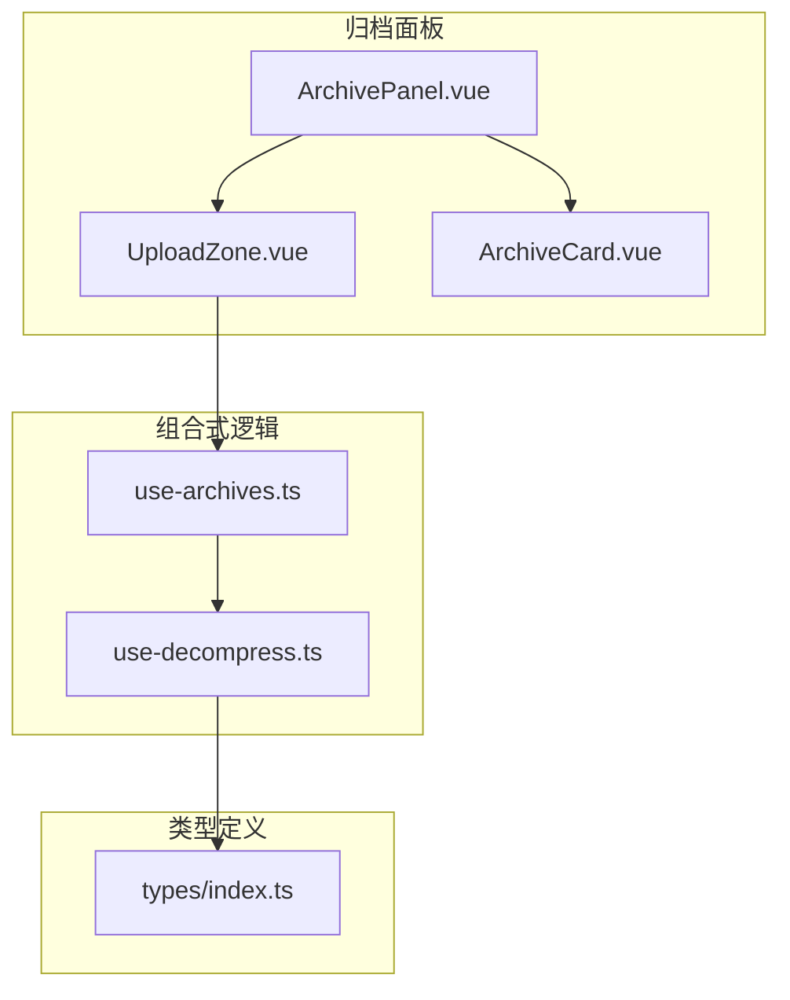
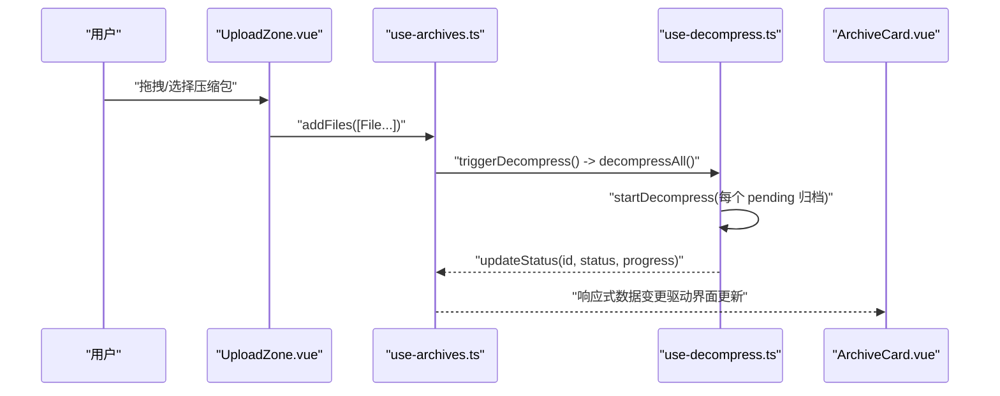
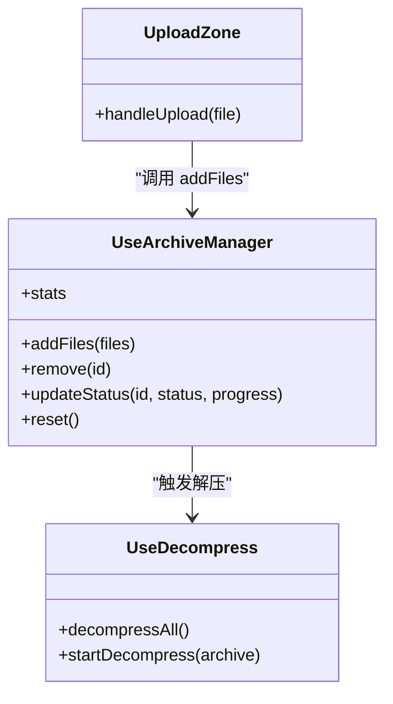
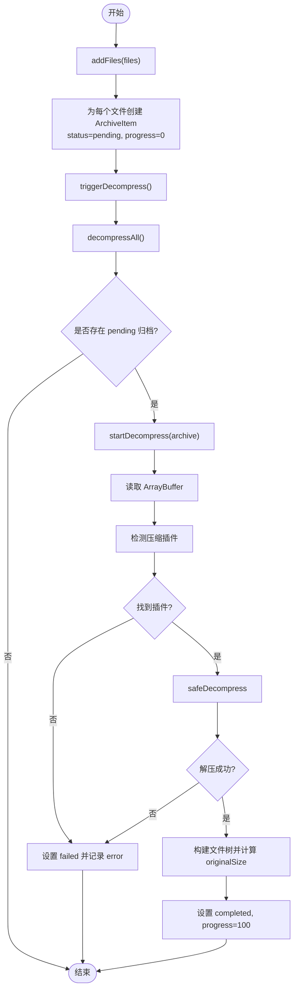

# 上传区域组件

<cite>
**本文引用的文件**   
- [UploadZone.vue](file://src/components/archive-panel/UploadZone.vue)
- [ArchivePanel.vue](file://src/components/archive-panel/ArchivePanel.vue)
- [use-archives.ts](file://src/composables/use-archives.ts)
- [use-decompress.ts](file://src/composables/use-decompress.ts)
- [index.ts（类型定义）](file://src/types/index.ts)
</cite>

## 目录
1. [简介](#简介)
2. [项目结构](#项目结构)
3. [核心组件与能力](#核心组件与能力)
4. [架构总览](#架构总览)
5. [详细组件分析](#详细组件分析)
6. [依赖关系分析](#依赖关系分析)
7. [性能与体验优化建议](#性能与体验优化建议)
8. [故障排查指南](#故障排查指南)
9. [结论](#结论)
10. [附录：API 参考与使用示例](#附录api-参考与使用示例)

## 简介
本文件围绕 UploadZone 上传区域组件，系统化梳理其拖拽上传、多文件支持、状态流转、进度显示以及与归档面板的集成方式。文档从实现原理到 API 使用，再到样式定制与主题适配，提供循序渐进的说明，帮助开发者快速理解并扩展该组件。

## 项目结构
UploadZone 位于归档面板子模块中，负责接收用户拖拽或点击选择的压缩包文件，并将文件交由归档管理器处理，随后触发解压流程。

图表来源
- [UploadZone.vue:1-28](file://src/components/archive-panel/UploadZone.vue#L1-L28)
- [ArchivePanel.vue:1-23](file://src/components/archive-panel/ArchivePanel.vue#L1-L23)
- [use-archives.ts:1-60](file://src/composables/use-archives.ts#L1-L60)
- [use-decompress.ts:1-74](file://src/composables/use-decompress.ts#L1-L74)
- [index.ts（类型定义）:1-71](file://src/types/index.ts#L1-L71)

章节来源
- [UploadZone.vue:1-28](file://src/components/archive-panel/UploadZone.vue#L1-L28)
- [ArchivePanel.vue:1-23](file://src/components/archive-panel/ArchivePanel.vue#L1-L23)

## 核心组件与能力
- 拖拽上传与点击选择：基于 Naive UI 的 NUpload/NUploadDragger 实现，支持将压缩包拖入指定区域或直接点击选择。
- 多文件上传：通过 multiple 属性启用，允许一次选择多个文件。
- 文件格式限制：通过 accept 属性限定支持的压缩格式后缀。
- 自定义上传行为：通过 custom-request 接管上传流程，将 File 对象交给 useArchiveManager.addFiles 处理。
- 进度与状态：由 useArchiveManager 维护 ArchiveItem 的状态与进度，并在归档卡片中展示。
- 错误反馈：当解压失败时，在归档卡片中显示错误信息并提供重试入口。

章节来源
- [UploadZone.vue:1-28](file://src/components/archive-panel/UploadZone.vue#L1-L28)
- [use-archives.ts:1-60](file://src/composables/use-archives.ts#L1-L60)
- [use-decompress.ts:1-74](file://src/composables/use-decompress.ts#L1-L74)

## 架构总览
UploadZone 作为“输入层”，将用户选择的文件交给“管理层”useArchiveManager；后者负责创建归档项、更新状态与进度，并异步触发“执行层”useDecompress 进行解压。最终结果以树形结构返回，供上层渲染。

图表来源
- [UploadZone.vue:1-28](file://src/components/archive-panel/UploadZone.vue#L1-L28)
- [use-archives.ts:1-60](file://src/composables/use-archives.ts#L1-L60)
- [use-decompress.ts:1-74](file://src/composables/use-decompress.ts#L1-L74)

## 详细组件分析

### UploadZone 组件
- 功能要点
  - 使用 NUpload 包裹 NUploadDragger，提供拖拽与点击两种上传入口。
  - multiple 开启多文件上传。
  - show-file-list 关闭默认列表，避免重复展示。
  - accept 限定可接受的文件后缀集合。
  - custom-request 回调中获取 File 对象并调用 addFiles。
- 事件与回调
  - handleUpload：接收 { file } 参数，若存在 file.file 则将其加入归档队列。
- 样式与文案
  - 内部包含提示文本，可通过插槽或外层容器覆盖。

章节来源
- [UploadZone.vue:1-28](file://src/components/archive-panel/UploadZone.vue#L1-L28)

#### 类图（组件与依赖）

图表来源
- [UploadZone.vue:1-28](file://src/components/archive-panel/UploadZone.vue#L1-L28)
- [use-archives.ts:1-60](file://src/composables/use-archives.ts#L1-L60)
- [use-decompress.ts:1-74](file://src/composables/use-decompress.ts#L1-L74)

### 归档管理与解压流程
- 添加文件
  - addFiles 为每个 File 生成一个 ArchiveItem，初始状态为 pending，并立即触发解压。
- 状态与进度
  - updateStatus 统一更新状态与进度，并在 running 时记录 startTime，completed 时记录 endTime。
- 解压调度
  - decompressAll 遍历所有 pending 的归档项，逐个启动 startDecompress。
  - startDecompress 读取 ArrayBuffer，检测插件，执行安全解压，构建文件树，更新 originalSize 与 files，最后标记 completed。
  - 任务队列满或异常时，设置 failed 状态并写入 error 信息。

图表来源
- [use-archives.ts:1-60](file://src/composables/use-archives.ts#L1-L60)
- [use-decompress.ts:1-74](file://src/composables/use-decompress.ts#L1-L74)

章节来源
- [use-archives.ts:1-60](file://src/composables/use-archives.ts#L1-L60)
- [use-decompress.ts:1-74](file://src/composables/use-decompress.ts#L1-L74)

### 与归档面板的集成
- ArchivePanel 引入 UploadZone 与 ArchiveCard，使用 NScrollbar 承载归档卡片列表。
- 每个 ArchiveCard 展示名称、状态指示器、错误信息与文件树。
- 移除操作通过 remove 事件回传至 useArchiveManager.remove。

章节来源
- [ArchivePanel.vue:1-23](file://src/components/archive-panel/ArchivePanel.vue#L1-L23)

## 依赖关系分析
- 组件耦合
  - UploadZone 仅依赖 useArchiveManager，职责单一，便于替换或扩展。
  - useArchiveManager 与 useDecompress 解耦，通过方法调用协作。
- 外部依赖
  - 使用 Naive UI 的 NUpload/NUploadDragger 提供基础交互。
  - 使用浏览器原生 File API 与 ArrayBuffer 读取二进制内容。
- 潜在循环依赖
  - 当前无循环依赖；use-archives 与 use-decompress 单向引用。

图表来源
- [UploadZone.vue:1-28](file://src/components/archive-panel/UploadZone.vue#L1-L28)
- [use-archives.ts:1-60](file://src/composables/use-archives.ts#L1-L60)
- [use-decompress.ts:1-74](file://src/composables/use-decompress.ts#L1-L74)
- [index.ts（类型定义）:1-71](file://src/types/index.ts#L1-L71)

## 性能与体验优化建议
- 大文件处理
  - 当前直接读取 ArrayBuffer，适合中小体积压缩包；对超大文件建议分块读取或流式处理以降低内存峰值。
- 并发控制
  - 使用任务调度器限制并发数，避免同时解压过多归档导致卡顿。
- 进度细化
  - 可在 safeDecompress 阶段按文件数量或字节数细粒度更新进度，提升感知准确性。
- 校验前置
  - 在 addFiles 前增加文件大小与类型校验，提前拦截无效请求，减少后续失败概率。
- 缓存与去重
  - 对同名同哈希文件可做去重提示，避免重复解压。

[本节为通用建议，不直接分析具体文件]

## 故障排查指南
- 无法识别压缩格式
  - 现象：归档项状态变为 failed，error 提示未找到对应插件。
  - 排查：确认文件名后缀是否在 accept 列表中，且已注册相应解压插件。
- 任务队列已满
  - 现象：新增归档后直接失败，error 提示队列已满。
  - 排查：降低并发度或等待已有任务完成后再提交新任务。
- 解压失败
  - 现象：failed 状态并附带错误信息。
  - 排查：检查压缩包是否损坏、密码保护或加密算法不被支持。
- 进度不更新
  - 现象：进度始终为 0 或停滞。
  - 排查：确认 updateStatus 被正确调用，以及 UI 层是否正确绑定 progress。

章节来源
- [use-decompress.ts:1-74](file://src/composables/use-decompress.ts#L1-L74)
- [use-archives.ts:1-60](file://src/composables/use-archives.ts#L1-L60)

## 结论
UploadZone 以最小化实现承接了拖拽与点击上传的核心能力，并通过 useArchiveManager 与 useDecompress 形成清晰的“输入-管理-执行”链路。结合类型定义与归档卡片，整体具备较好的可扩展性与可维护性。建议在后续迭代中补充更完善的校验、进度细化与大文件优化策略。

[本节为总结性内容，不直接分析具体文件]

## 附录：API 参考与使用示例

### Props（来自父级配置）
- 说明：UploadZone 本身未显式声明 props，实际行为由 Naive UI 的 NUpload 与 NUploadDragger 提供。常见相关能力包括：
  - multiple：是否允许多文件上传
  - accept：允许的文件后缀过滤
  - show-file-list：是否显示默认文件列表
  - custom-request：自定义上传回调，用于接管上传流程

章节来源
- [UploadZone.vue:1-28](file://src/components/archive-panel/UploadZone.vue#L1-L28)

### Events（对外暴露的事件）
- 说明：UploadZone 未向外发射事件。如需监听上传完成或失败，可在上层通过 archives 状态变化与 ArchiveCard 的错误信息进行判断。

章节来源
- [UploadZone.vue:1-28](file://src/components/archive-panel/UploadZone.vue#L1-L28)

### Slots（插槽）
- 说明：UploadZone 未定义具名插槽。可通过外层容器或覆盖 NUploadDragger 内部布局实现样式定制。

章节来源
- [UploadZone.vue:1-28](file://src/components/archive-panel/UploadZone.vue#L1-L28)

### 自定义样式与主题适配
- 通过外层容器调整尺寸、边距与对齐方式。
- 借助 Naive UI 的主题变量与 CSS 覆盖，修改拖拽区背景、边框与提示文字颜色。
- 在 ArchiveCard 中根据 status 与 progress 动态展示不同视觉状态。

章节来源
- [UploadZone.vue:1-28](file://src/components/archive-panel/UploadZone.vue#L1-L28)
- [ArchivePanel.vue:1-23](file://src/components/archive-panel/ArchivePanel.vue#L1-L23)

### 完整使用示例（集成到归档面板）
- 在归档面板中引入 UploadZone 与 ArchiveCard，并使用 NScrollbar 滚动展示归档卡片列表。
- 通过 useArchiveManager 提供的 archives 与 remove 方法，实现增删与状态联动。

章节来源
- [ArchivePanel.vue:1-23](file://src/components/archive-panel/ArchivePanel.vue#L1-L23)

### 数据结构与状态模型
- ArchiveItem 字段概览
  - id：唯一标识
  - name：文件名
  - file：原始 File 对象
  - status：pending | running | completed | failed
  - progress：0-100 的进度百分比
  - files：解析后的文件树节点数组
  - error：失败时的错误信息
  - startTime / endTime：运行起止时间戳
  - originalSize / compressedSize：解压前后大小统计

章节来源
- [index.ts（类型定义）:1-71](file://src/types/index.ts#L1-L71)