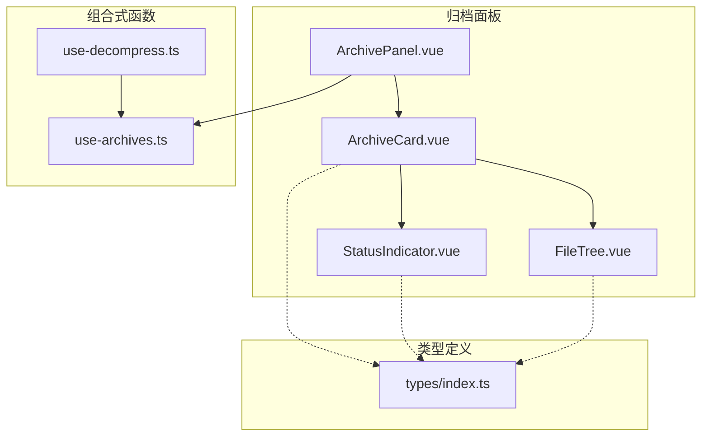
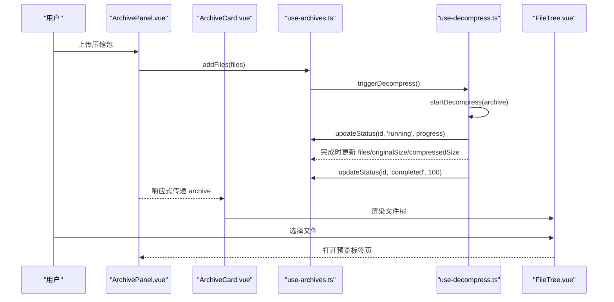
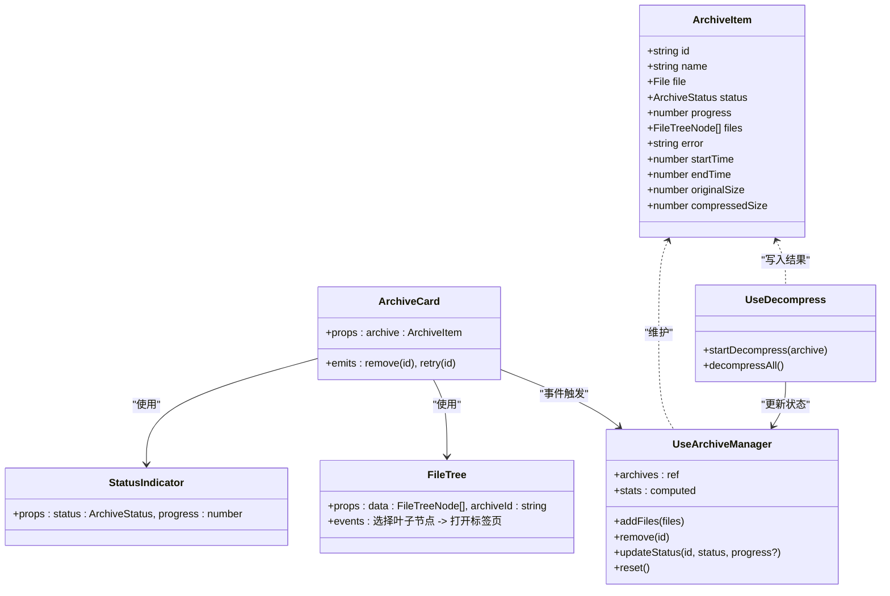
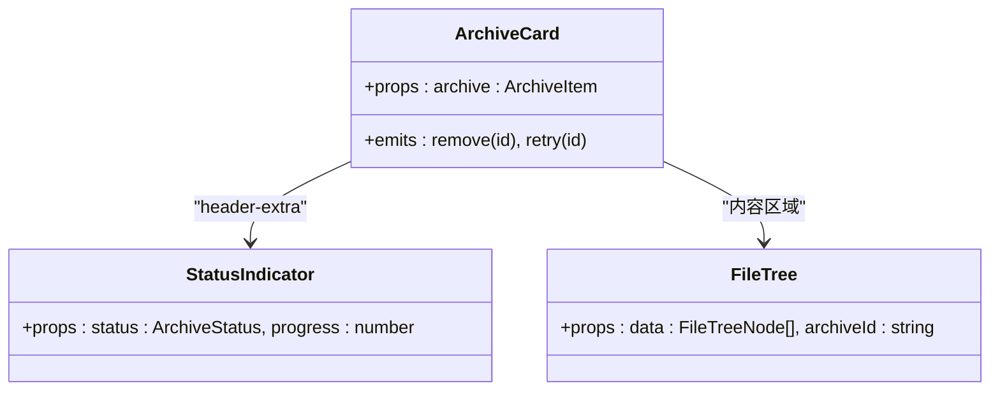
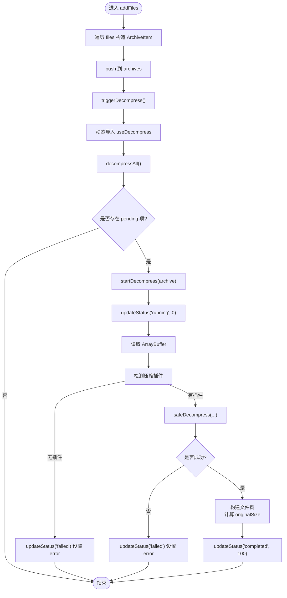
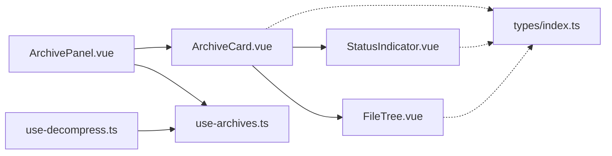

# 归档卡片组件

<cite>
**本文引用的文件**
- [ArchiveCard.vue](file://src/components/archive-panel/ArchiveCard.vue)
- [ArchivePanel.vue](file://src/components/archive-panel/ArchivePanel.vue)
- [StatusIndicator.vue](file://src/components/archive-panel/StatusIndicator.vue)
- [FileTree.vue](file://src/components/archive-panel/FileTree.vue)
- [use-archives.ts](file://src/composables/use-archives.ts)
- [use-decompress.ts](file://src/composables/use-decompress.ts)
- [index.ts](file://src/types/index.ts)
</cite>

## 目录
1. [简介](#简介)
2. [项目结构](#项目结构)
3. [核心组件与数据流](#核心组件与数据流)
4. [架构总览](#架构总览)
5. [详细组件分析](#详细组件分析)
6. [依赖关系分析](#依赖关系分析)
7. [性能与响应式布局](#性能与响应式布局)
8. [样式定制与主题扩展](#样式定制与主题扩展)
9. [集成示例与最佳实践](#集成示例与最佳实践)
10. [故障排查指南](#故障排查指南)
11. [结论](#结论)

## 简介
本文件为 ArchiveCard 归档卡片组件的权威文档。该组件用于展示压缩包卡片的完整信息，包括文件名、状态指示器、错误提示与重试按钮，以及解压后的文件树浏览与打开操作。它通过组合式函数 useArchiveManager 与全局任务调度、插件引擎协作，实现从上传到解压、进度更新、结果展示的端到端流程。

## 项目结构
归档相关的前端代码集中在 archive-panel 目录中，配合 composables 中的状态管理与业务逻辑，以及 types 中的类型定义，形成清晰的分层：
- 视图层：ArchiveCard、StatusIndicator、FileTree、ArchivePanel
- 组合式函数：useArchiveManager（状态管理）、useDecompress（解压流程）
- 类型定义：ArchiveItem、ArchiveStatus、FileTreeNode 等

图表来源
- [ArchivePanel.vue:1-24](file://src/components/archive-panel/ArchivePanel.vue#L1-L24)
- [ArchiveCard.vue:1-41](file://src/components/archive-panel/ArchiveCard.vue#L1-L41)
- [StatusIndicator.vue:1-28](file://src/components/archive-panel/StatusIndicator.vue#L1-L28)
- [FileTree.vue:1-42](file://src/components/archive-panel/FileTree.vue#L1-L42)
- [use-archives.ts:1-60](file://src/composables/use-archives.ts#L1-L60)
- [use-decompress.ts:1-74](file://src/composables/use-decompress.ts#L1-L74)
- [index.ts:1-71](file://src/types/index.ts#L1-L71)

章节来源
- [ArchivePanel.vue:1-24](file://src/components/archive-panel/ArchivePanel.vue#L1-L24)
- [use-archives.ts:1-60](file://src/composables/use-archives.ts#L1-L60)
- [index.ts:1-71](file://src/types/index.ts#L1-L71)

## 核心组件与数据流
- ArchiveCard：渲染单个压缩包的卡片，包含标题（文件名）、状态指示器、失败信息与重试按钮、文件树。
- StatusIndicator：根据状态显示标签与进度条。
- FileTree：提供过滤与选择，点击叶子节点打开预览标签页。
- useArchiveManager：维护 archives 列表、添加/删除、状态更新、统计信息。
- useDecompress：驱动解压任务，更新进度与结果，构建文件树。

图表来源
- [ArchivePanel.vue:1-24](file://src/components/archive-panel/ArchivePanel.vue#L1-L24)
- [ArchiveCard.vue:1-41](file://src/components/archive-panel/ArchiveCard.vue#L1-L41)
- [use-archives.ts:1-60](file://src/composables/use-archives.ts#L1-L60)
- [use-decompress.ts:1-74](file://src/composables/use-decompress.ts#L1-L74)
- [FileTree.vue:1-42](file://src/components/archive-panel/FileTree.vue#L1-L42)

章节来源
- [ArchiveCard.vue:1-41](file://src/components/archive-panel/ArchiveCard.vue#L1-L41)
- [StatusIndicator.vue:1-28](file://src/components/archive-panel/StatusIndicator.vue#L1-L28)
- [FileTree.vue:1-42](file://src/components/archive-panel/FileTree.vue#L1-L42)
- [use-archives.ts:1-60](file://src/composables/use-archives.ts#L1-L60)
- [use-decompress.ts:1-74](file://src/composables/use-decompress.ts#L1-L74)

## 架构总览
归档卡片的数据绑定与交互由以下层次构成：
- 视图层：ArchiveCard 负责 UI 呈现与事件派发；StatusIndicator 负责状态可视化；FileTree 负责文件浏览与打开。
- 状态层：useArchiveManager 暴露 archives、remove、updateStatus、stats 等能力。
- 业务层：useDecompress 负责读取文件、检测插件、执行解压、构建文件树并更新状态。
- 类型层：统一使用 types/index.ts 中的接口保证数据结构一致性。

图表来源
- [index.ts:34-46](file://src/types/index.ts#L34-L46)
- [ArchiveCard.vue:1-41](file://src/components/archive-panel/ArchiveCard.vue#L1-L41)
- [StatusIndicator.vue:1-28](file://src/components/archive-panel/StatusIndicator.vue#L1-L28)
- [FileTree.vue:1-42](file://src/components/archive-panel/FileTree.vue#L1-L42)
- [use-archives.ts:1-60](file://src/composables/use-archives.ts#L1-L60)
- [use-decompress.ts:1-74](file://src/composables/use-decompress.ts#L1-L74)

## 详细组件分析

### ArchiveCard 组件
- 功能职责
  - 以 NCard 作为容器，标题显示压缩包名称。
  - 在头部右侧集成 StatusIndicator，展示状态与进度。
  - 当状态为失败时，显示错误信息并提供“重试”按钮。
  - 当存在文件列表时，渲染 FileTree 供用户浏览与打开。
- Props 接口
  - archive: ArchiveItem（来自 types/index.ts），包含 id、name、status、progress、files、error、originalSize、compressedSize 等字段。
- Events 事件
  - remove(id: string)：关闭卡片并触发父级移除逻辑。
  - retry(id: string)：请求重试解压（当前父级未实现具体处理）。
- 交互行为
  - 点击卡片右上角关闭图标触发 remove。
  - 失败状态下点击“重试”触发 retry。
  - 文件树选择叶子节点后，由 FileTree 调用 openTab 打开预览。
- 动画与过渡
  - 组件本身未显式声明 Vue 过渡或 CSS 动画；如需入场/退出动画，可在父级使用 v-show/v-if 结合 TransitionGroup 包裹。
- 响应式布局
  - 使用 NCard size="small" 与固定 margin-bottom 控制间距；内部文件树最大高度限制，支持虚拟滚动以提升大数据量下的性能。

章节来源
- [ArchiveCard.vue:1-41](file://src/components/archive-panel/ArchiveCard.vue#L1-L41)
- [index.ts:34-46](file://src/types/index.ts#L34-L46)

#### 类图（ArchiveCard 与其子组件）

图表来源
- [ArchiveCard.vue:1-41](file://src/components/archive-panel/ArchiveCard.vue#L1-L41)
- [StatusIndicator.vue:1-28](file://src/components/archive-panel/StatusIndicator.vue#L1-L28)
- [FileTree.vue:1-42](file://src/components/archive-panel/FileTree.vue#L1-L42)

### StatusIndicator 组件
- 功能职责
  - 根据 ArchiveStatus 渲染不同标签：已完成、解压中、排队中、失败。
  - 当处于“解压中”时，显示线性进度条，宽度固定，隐藏百分比指示。
- Props 接口
  - status: ArchiveStatus
  - progress: number（0-100）
- 视觉反馈
  - 使用 NTag 与 NProgress 组合，颜色与文案随状态变化。

章节来源
- [StatusIndicator.vue:1-28](file://src/components/archive-panel/StatusIndicator.vue#L1-L28)
- [index.ts:15](file://src/types/index.ts#L15-L15)

### FileTree 组件
- 功能职责
  - 提供输入框进行文件名过滤。
  - 使用 NTree 渲染文件树，支持虚拟滚动与块线样式。
  - 选择叶子节点时，调用 openTab 打开对应文件的预览标签页。
- Props 接口
  - data: FileTreeNode[]
  - archiveId: string
- 交互行为
  - 过滤：pattern 双向绑定，仅显示匹配节点。
  - 选择：handleSelect 判断 isLeaf 后打开标签页。

章节来源
- [FileTree.vue:1-42](file://src/components/archive-panel/FileTree.vue#L1-L42)
- [index.ts:17-24](file://src/types/index.ts#L17-L24)

### 与 useArchiveManager 的数据绑定
- 数据源
  - archives: ref<ArchiveItem[]>，由 useArchiveManager 维护。
- 关键方法
  - addFiles(files): 将每个 File 转换为 ArchiveItem 并加入列表，随后触发解压。
  - remove(id): 按 id 过滤移除。
  - updateStatus(id, status, progress?): 更新状态与进度，记录开始/结束时间。
  - stats: 计算总数、大小、文件数、完成数等统计信息。
- 与 useDecompress 的协作
  - addFiles 内调用 triggerDecompress，后者动态导入 useDecompress 并执行 decompressAll。
  - decompressAll 遍历 pending 状态的条目，逐个启动 startDecompress。
  - startDecompress 通过 TaskScheduler 并发执行，逐步更新进度，最终写入 files、originalSize、compressedSize 并标记 completed。

图表来源
- [use-archives.ts:1-60](file://src/composables/use-archives.ts#L1-L60)
- [use-decompress.ts:1-74](file://src/composables/use-decompress.ts#L1-L74)

章节来源
- [use-archives.ts:1-60](file://src/composables/use-archives.ts#L1-L60)
- [use-decompress.ts:1-74](file://src/composables/use-decompress.ts#L1-L74)

## 依赖关系分析
- 组件耦合
  - ArchiveCard 强依赖 StatusIndicator 与 FileTree，弱依赖 useArchiveManager（通过事件回调）。
  - ArchivePanel 聚合多个 ArchiveCard，并通过 useArchiveManager 管理数据与删除逻辑。
- 外部依赖
  - Naive UI 组件：NCard、NSpace、NButton、NTag、NProgress、NTree、NInput、NScrollbar。
  - 自定义组合式函数：useArchiveManager、useDecompress。
  - 类型系统：types/index.ts 确保数据结构一致。
- 潜在循环依赖
  - use-archives 与 use-decompress 之间通过 import 解耦，不存在直接循环引用。

图表来源
- [ArchiveCard.vue:1-41](file://src/components/archive-panel/ArchiveCard.vue#L1-L41)
- [ArchivePanel.vue:1-24](file://src/components/archive-panel/ArchivePanel.vue#L1-L24)
- [StatusIndicator.vue:1-28](file://src/components/archive-panel/StatusIndicator.vue#L1-L28)
- [FileTree.vue:1-42](file://src/components/archive-panel/FileTree.vue#L1-L42)
- [use-archives.ts:1-60](file://src/composables/use-archives.ts#L1-L60)
- [use-decompress.ts:1-74](file://src/composables/use-decompress.ts#L1-L74)
- [index.ts:1-71](file://src/types/index.ts#L1-L71)

章节来源
- [ArchivePanel.vue:1-24](file://src/components/archive-panel/ArchivePanel.vue#L1-L24)
- [use-archives.ts:1-60](file://src/composables/use-archives.ts#L1-L60)
- [use-decompress.ts:1-74](file://src/composables/use-decompress.ts#L1-L74)

## 性能与响应式布局
- 性能优化
  - 文件树启用虚拟滚动，避免大量节点导致的渲染卡顿。
  - 解压任务通过 TaskScheduler 控制并发度，防止阻塞主线程。
  - 使用 computed 统计信息，减少重复计算。
- 响应式适配
  - 使用 Flex 布局与 NScrollbar 自适应高度。
  - 卡片尺寸 small，适合密集列表场景。
  - 文件树最大高度限制，结合虚拟滚动提升体验。

[本节为通用指导，不直接分析具体文件]

## 样式定制与主题扩展
- 组件样式策略
  - 主要使用 Naive UI 组件默认样式，局部通过 style 属性微调边距与颜色。
  - 失败信息使用固定文本颜色，便于快速识别异常。
- 可定制点建议
  - 卡片间距：可通过外层容器调整 margin-bottom 或 gap。
  - 状态标签与进度条：可在 StatusIndicator 中替换为自定义样式或引入主题变量。
  - 文件树外观：通过 NTree 的 block-line、height 等属性调整。
- 主题扩展
  - 若需全局统一风格，建议在应用层注入 Naive UI 主题配置，覆盖默认色板与字体。

[本节为通用指导，不直接分析具体文件]

## 集成示例与最佳实践
- 基本集成
  - 在页面中引入 ArchivePanel，即可自动获得上传、列表、状态与文件树浏览能力。
- 事件处理
  - 监听 ArchiveCard 的 remove 事件，调用 useArchiveManager.remove 删除对应条目。
  - 监听 retry 事件，重新触发解压流程（例如再次调用 addFiles 或 startDecompress）。
- 数据绑定
  - 通过 useArchiveManager 提供的 archives 与 stats 进行全局统计展示。
- 扩展方法
  - 在 ArchiveCard 中增加“打开”按钮：当状态为 completed 且 files 非空时显示，点击后选择第一个叶子节点并调用 openTab。
  - 在 StatusIndicator 中增加耗时显示：基于 startTime/endTime 计算并格式化输出。
  - 在 useArchiveManager 中增加批量操作：如批量删除、批量重试。

章节来源
- [ArchivePanel.vue:1-24](file://src/components/archive-panel/ArchivePanel.vue#L1-L24)
- [use-archives.ts:1-60](file://src/composables/use-archives.ts#L1-L60)
- [use-decompress.ts:1-74](file://src/composables/use-decompress.ts#L1-L74)

## 故障排查指南
- 常见问题
  - 解压失败：检查插件是否支持目标格式；查看 error 字段定位原因。
  - 任务队列满：TaskScheduler 并发受限，等待或降低并发度。
  - 文件树为空：确认解压结果 files 是否为空，或 originalSize 是否正确计算。
- 调试建议
  - 在 updateStatus 处打印日志，观察状态流转。
  - 在 safeDecompress 前后记录耗时，评估性能瓶颈。
  - 使用浏览器开发者工具监控内存占用，尤其是大文件解压过程。

章节来源
- [use-decompress.ts:1-74](file://src/composables/use-decompress.ts#L1-L74)
- [use-archives.ts:1-60](file://src/composables/use-archives.ts#L1-L60)

## 结论
ArchiveCard 组件以简洁的卡片形式整合了压缩包的核心信息、状态与文件浏览能力，并通过 useArchiveManager 与 useDecompress 实现了完整的解压工作流。其设计遵循清晰的职责划分与类型约束，具备良好的可扩展性与可维护性。在实际项目中，可根据需要进一步丰富交互与样式，以满足更复杂的业务需求。