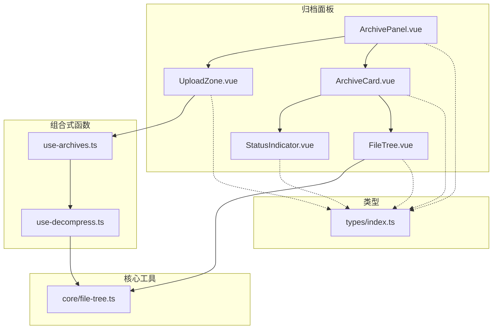
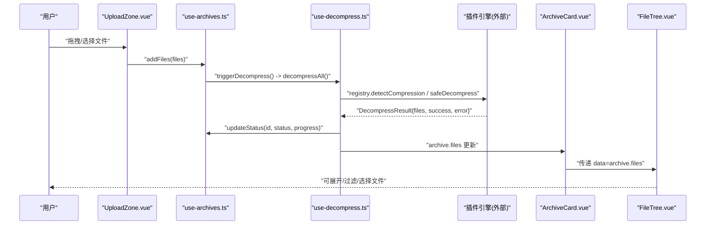
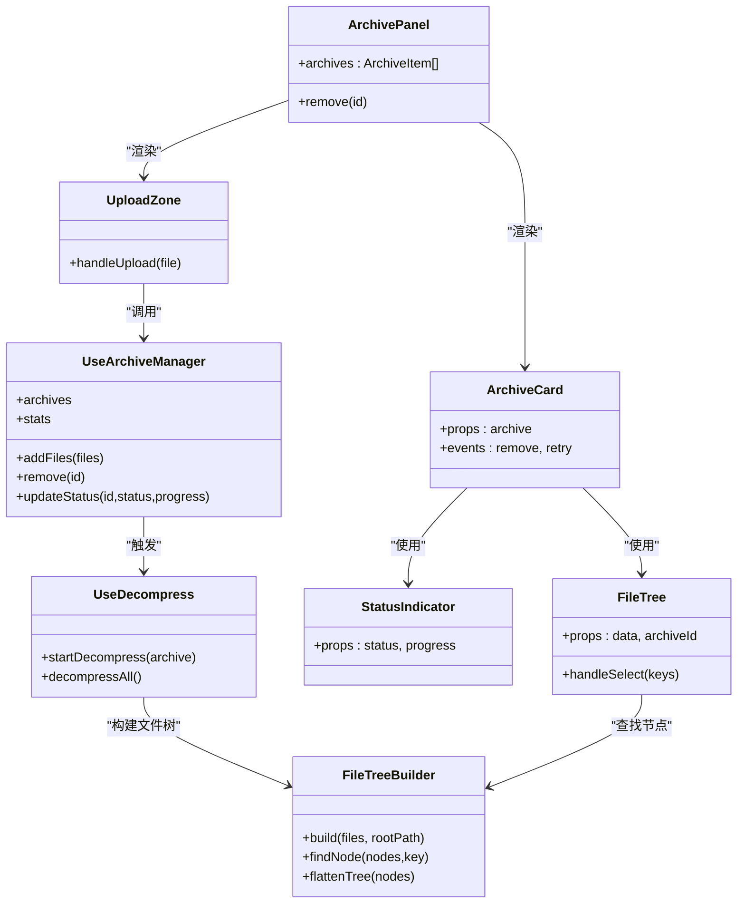
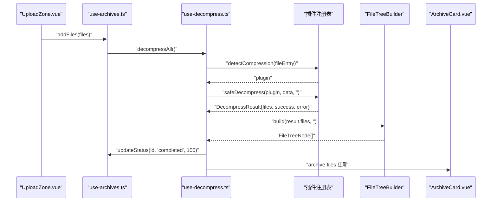

# 归档面板组件

<cite>
**本文引用的文件**
- [ArchivePanel.vue](file://src/components/archive-panel/ArchivePanel.vue)
- [UploadZone.vue](file://src/components/archive-panel/UploadZone.vue)
- [ArchiveCard.vue](file://src/components/archive-panel/ArchiveCard.vue)
- [FileTree.vue](file://src/components/archive-panel/FileTree.vue)
- [StatusIndicator.vue](file://src/components/archive-panel/StatusIndicator.vue)
- [use-archives.ts](file://src/composables/use-archives.ts)
- [use-decompress.ts](file://src/composables/use-decompress.ts)
- [file-tree.ts](file://src/core/file-tree.ts)
- [index.ts](file://src/types/index.ts)
</cite>

## 目录
1. [简介](#简介)
2. [项目结构](#项目结构)
3. [核心组件](#核心组件)
4. [架构总览](#架构总览)
5. [详细组件分析](#详细组件分析)
6. [依赖关系分析](#依赖关系分析)
7. [性能与体验优化](#性能与体验优化)
8. [故障排查指南](#故障排查指南)
9. [结论](#结论)
10. [附录：使用示例与集成方法](#附录使用示例与集成方法)

## 简介
本文件为“归档面板”相关前端组件的权威文档，覆盖以下子组件与能力：
- ArchivePanel 归档面板容器
- UploadZone 上传区域（拖拽、格式校验、进度联动）
- ArchiveCard 压缩包卡片（状态指示、错误提示、重试、文件树展示）
- FileTree 文件树（目录结构、过滤、选择打开）
- StatusIndicator 状态指示器（排队中/解压中/已完成/失败）

目标读者包括需要集成或二次开发该面板的前端工程师与产品/测试人员。

## 项目结构
归档面板位于 src/components/archive-panel 目录下，由多个 Vue 单文件组件构成，并通过组合式函数 useArchiveManager 和 useDecompress 管理状态与任务调度；文件树构建逻辑在 core/file-tree.ts 中实现；类型定义集中在 types/index.ts。

图表来源
- [ArchivePanel.vue:1-24](file://src/components/archive-panel/ArchivePanel.vue#L1-L24)
- [UploadZone.vue:1-29](file://src/components/archive-panel/UploadZone.vue#L1-L29)
- [ArchiveCard.vue:1-41](file://src/components/archive-panel/ArchiveCard.vue#L1-L41)
- [FileTree.vue:1-42](file://src/components/archive-panel/FileTree.vue#L1-L42)
- [StatusIndicator.vue:1-28](file://src/components/archive-panel/StatusIndicator.vue#L1-L28)
- [use-archives.ts:1-60](file://src/composables/use-archives.ts#L1-L60)
- [use-decompress.ts:1-74](file://src/composables/use-decompress.ts#L1-L74)
- [file-tree.ts:1-69](file://src/core/file-tree.ts#L1-L69)
- [index.ts:1-71](file://src/types/index.ts#L1-L71)

章节来源
- [ArchivePanel.vue:1-24](file://src/components/archive-panel/ArchivePanel.vue#L1-L24)
- [UploadZone.vue:1-29](file://src/components/archive-panel/UploadZone.vue#L1-L29)
- [ArchiveCard.vue:1-41](file://src/components/archive-panel/ArchiveCard.vue#L1-L41)
- [FileTree.vue:1-42](file://src/components/archive-panel/FileTree.vue#L1-L42)
- [StatusIndicator.vue:1-28](file://src/components/archive-panel/StatusIndicator.vue#L1-L28)
- [use-archives.ts:1-60](file://src/composables/use-archives.ts#L1-L60)
- [use-decompress.ts:1-74](file://src/composables/use-decompress.ts#L1-L74)
- [file-tree.ts:1-69](file://src/core/file-tree.ts#L1-L69)
- [index.ts:1-71](file://src/types/index.ts#L1-L71)

## 核心组件
本节概述各组件职责与交互方式，后续章节将深入 Props/Events/Slots/样式定制细节。

- ArchivePanel：面板容器，负责渲染上传区与归档卡片列表，提供滚动容器。
- UploadZone：基于 Naive UI 的上传组件封装，支持多文件拖拽与点击上传，触发 addFiles 并进入解压流程。
- ArchiveCard：单个压缩包的可视化卡片，包含标题、状态指示、错误信息、重试按钮与文件树。
- FileTree：文件树视图，支持输入过滤、节点展开折叠、虚拟滚动与选择打开。
- StatusIndicator：根据状态显示标签与进度条。

章节来源
- [ArchivePanel.vue:1-24](file://src/components/archive-panel/ArchivePanel.vue#L1-L24)
- [UploadZone.vue:1-29](file://src/components/archive-panel/UploadZone.vue#L1-L29)
- [ArchiveCard.vue:1-41](file://src/components/archive-panel/ArchiveCard.vue#L1-L41)
- [FileTree.vue:1-42](file://src/components/archive-panel/FileTree.vue#L1-L42)
- [StatusIndicator.vue:1-28](file://src/components/archive-panel/StatusIndicator.vue#L1-L28)

## 架构总览
归档面板的数据流与控制流如下：用户通过 UploadZone 选择文件 -> useArchiveManager.addFiles 创建归档项并触发解压 -> useDecompress 调度任务 -> 插件引擎检测并执行解压 -> 更新状态与文件树 -> ArchiveCard 与 FileTree 响应式渲染。

图表来源
- [UploadZone.vue:1-29](file://src/components/archive-panel/UploadZone.vue#L1-L29)
- [use-archives.ts:1-60](file://src/composables/use-archives.ts#L1-L60)
- [use-decompress.ts:1-74](file://src/composables/use-decompress.ts#L1-L74)
- [ArchiveCard.vue:1-41](file://src/components/archive-panel/ArchiveCard.vue#L1-L41)
- [FileTree.vue:1-42](file://src/components/archive-panel/FileTree.vue#L1-L42)

## 详细组件分析

### ArchivePanel 归档面板
- 职责
  - 作为容器承载 UploadZone 与 ArchiveCard 列表。
  - 提供滚动区域以容纳大量归档卡片。
- 数据与事件
  - 通过 useArchiveManager 获取 archives 列表与 remove 方法。
  - 向 ArchiveCard 派发 @remove 与 @retry 事件（当前重试回调为空占位）。
- 样式与布局
  - 外层容器高度 100%，纵向 Flex 布局。
  - 内部 NScrollbar 占据剩余空间，顶部留白 8px。
- 扩展点
  - 可在容器内增加统计信息、批量操作等。

章节来源
- [ArchivePanel.vue:1-24](file://src/components/archive-panel/ArchivePanel.vue#L1-L24)
- [use-archives.ts:1-60](file://src/composables/use-archives.ts#L1-L60)

### UploadZone 上传区域
- 功能特性
  - 支持多文件上传与拖拽。
  - 通过 accept 限制支持的压缩包后缀。
  - 自定义请求处理，将选中的 File 对象交给 useArchiveManager.addFiles。
- 关键行为
  - handleUpload 接收 NUpload 的文件对象，提取 file.file 并调用 addFiles。
  - 返回 false 阻止默认上传行为。
- 错误处理
  - 未配置服务端上传，仅在前端进行格式筛选与入队。
- 样式定制
  - 可通过插槽替换拖拽区内容，或使用 CSS 调整文本与间距。

章节来源
- [UploadZone.vue:1-29](file://src/components/archive-panel/UploadZone.vue#L1-L29)
- [use-archives.ts:1-60](file://src/composables/use-archives.ts#L1-L60)

### ArchiveCard 压缩包卡片
- 职责
  - 展示压缩包名称、状态指示、错误信息与重试按钮。
  - 当存在文件列表时，渲染 FileTree。
- Props
  - archive: ArchiveItem（包含 id、name、status、progress、files、error 等）。
- Events
  - remove(id): 关闭并移除卡片。
  - retry(id): 触发重试（当前父级未实现具体逻辑）。
- 状态与交互
  - 失败状态显示错误消息与重试按钮。
  - 成功状态显示文件树。
- 样式定制
  - 使用 NCard 的 closable 与 header-extra 插槽放置状态指示器。
  - 可通过 CSS 控制卡片间距与颜色。

章节来源
- [ArchiveCard.vue:1-41](file://src/components/archive-panel/ArchiveCard.vue#L1-L41)
- [index.ts:34-46](file://src/types/index.ts#L34-L46)

### FileTree 文件树
- 职责
  - 展示压缩包内的目录结构与文件。
  - 支持输入过滤、节点展开/折叠、虚拟滚动与选择打开。
- Props
  - data: FileTreeNode[]（由 FileTreeBuilder.build 生成）。
  - archiveId: string（用于打开标签页时关联归档）。
- 交互
  - 选择叶子节点时，通过 useTabManager.openTab 打开预览。
  - 使用 pattern 属性与 show-irrelevant-nodes=false 实现过滤。
- 性能
  - 启用 virtual-scroll 提升大数据量下的渲染性能。
- 样式定制
  - 最大高度限制与 block-line 样式可按需调整。

章节来源
- [FileTree.vue:1-42](file://src/components/archive-panel/FileTree.vue#L1-L42)
- [file-tree.ts:1-69](file://src/core/file-tree.ts#L1-L69)
- [index.ts:17-24](file://src/types/index.ts#L17-L24)

### StatusIndicator 状态指示器
- 职责
  - 根据状态显示不同标签与进度条。
- Props
  - status: ArchiveStatus（pending/running/completed/failed）。
  - progress: number（0-100，仅在 running 时显示）。
- 状态映射
  - pending: 排队中（warning）。
  - running: 解压中（info），附带线性进度条。
  - completed: 已完成（success）。
  - failed: 失败（error）。
- 样式定制
  - 使用 NSpace 对齐，NProgress 宽度固定，可按需调整。

章节来源
- [StatusIndicator.vue:1-28](file://src/components/archive-panel/StatusIndicator.vue#L1-L28)
- [index.ts:15](file://src/types/index.ts#L15-L15)

## 依赖关系分析
- 组件耦合
  - ArchivePanel 聚合 UploadZone 与 ArchiveCard。
  - ArchiveCard 组合 StatusIndicator 与 FileTree。
  - FileTree 依赖 FileTreeBuilder 查找节点。
- 状态与任务
  - useArchiveManager 维护 archives 列表与基础统计。
  - useDecompress 负责任务调度、解压与状态更新。
- 类型契约
  - ArchiveItem、FileTreeNode、ArchiveStatus 等类型贯穿组件与组合式函数。

图表来源
- [ArchivePanel.vue:1-24](file://src/components/archive-panel/ArchivePanel.vue#L1-L24)
- [UploadZone.vue:1-29](file://src/components/archive-panel/UploadZone.vue#L1-L29)
- [ArchiveCard.vue:1-41](file://src/components/archive-panel/ArchiveCard.vue#L1-L41)
- [FileTree.vue:1-42](file://src/components/archive-panel/FileTree.vue#L1-L42)
- [StatusIndicator.vue:1-28](file://src/components/archive-panel/StatusIndicator.vue#L1-L28)
- [use-archives.ts:1-60](file://src/composables/use-archives.ts#L1-L60)
- [use-decompress.ts:1-74](file://src/composables/use-decompress.ts#L1-L74)
- [file-tree.ts:1-69](file://src/core/file-tree.ts#L1-L69)

章节来源
- [use-archives.ts:1-60](file://src/composables/use-archives.ts#L1-L60)
- [use-decompress.ts:1-74](file://src/composables/use-decompress.ts#L1-L74)
- [file-tree.ts:1-69](file://src/core/file-tree.ts#L1-L69)
- [index.ts:1-71](file://src/types/index.ts#L1-L71)

## 性能与体验优化
- 大文件与大数据集
  - 文件树启用虚拟滚动，避免 DOM 过多导致的卡顿。
  - 建议对超大压缩包采用分块解析或懒加载策略（当前实现一次性构建文件树）。
- 并发与队列
  - 使用任务调度器限制并行度，避免浏览器内存峰值过高。
  - 若出现“队列已满”，会标记失败并提示，建议在上层增加重试与降级策略。
- 状态更新频率
  - 解压过程中按阶段更新进度（30%、80%、100%），减少频繁重绘。
- 用户体验
  - 上传区提供明确的文案与接受格式提示。
  - 失败状态显示错误信息并提供重试入口。

[本节为通用指导，不直接分析具体文件]

## 故障排查指南
- 无法识别压缩格式
  - 现象：状态变为失败，错误信息包含“No plugin for ...”。
  - 原因：插件注册表未检测到对应压缩类型。
  - 处理：检查插件注册与 detectCompression 逻辑，确保支持目标格式。
- 解压失败
  - 现象：状态失败，错误信息来自 safeDecompress 或异常捕获。
  - 处理：查看 result.error 或异常 message，定位损坏文件或插件兼容性问题。
- 任务队列已满
  - 现象：状态失败，错误信息为“Task queue is full”。
  - 处理：降低并发数或分批提交任务。
- 文件树无数据
  - 现象：ArchiveCard 未显示 FileTree。
  - 处理：确认解压结果 files 是否为空，以及 FileTreeBuilder.build 是否正确构建层级。

章节来源
- [use-decompress.ts:1-74](file://src/composables/use-decompress.ts#L1-L74)
- [file-tree.ts:1-69](file://src/core/file-tree.ts#L1-L69)

## 结论
归档面板通过清晰的组件分层与组合式函数协作，实现了从上传、解压到可视化的完整链路。状态驱动与任务调度保证了良好的可扩展性与稳定性。建议在后续迭代中完善重试机制、增强错误提示与提供更丰富的样式定制选项。

[本节为总结性内容，不直接分析具体文件]

## 附录：使用示例与集成方法

### 基本用法
- 在页面中引入 ArchivePanel 即可显示完整的归档面板。
- 上传区支持拖拽与点击选择，自动进入解压流程。
- 每个压缩包以卡片形式呈现，包含状态与文件树。

章节来源
- [ArchivePanel.vue:1-24](file://src/components/archive-panel/ArchivePanel.vue#L1-L24)

### 上传区域详解
- 支持的后缀
  - .zip, .gz, .gzip, .tgz, .7z, .rar, .tar
- 行为说明
  - 多选上传，隐藏默认文件列表。
  - 自定义请求处理，将 File 对象交由 useArchiveManager 管理。
- 样式定制
  - 通过插槽替换拖拽区内容，或使用 CSS 调整文本与间距。

章节来源
- [UploadZone.vue:1-29](file://src/components/archive-panel/UploadZone.vue#L1-L29)

### 压缩包卡片详解
- Props
  - archive: ArchiveItem（包含 id、name、status、progress、files、error 等）。
- Events
  - remove(id): 移除卡片。
  - retry(id): 触发重试（当前父级未实现具体逻辑）。
- 状态与交互
  - 失败时显示错误信息与重试按钮。
  - 成功时展示文件树。
- 样式定制
  - 使用 NCard 的 closable 与 header-extra 插槽。

章节来源
- [ArchiveCard.vue:1-41](file://src/components/archive-panel/ArchiveCard.vue#L1-L41)
- [index.ts:34-46](file://src/types/index.ts#L34-L46)

### 文件树详解
- Props
  - data: FileTreeNode[]（由 FileTreeBuilder.build 生成）。
  - archiveId: string（用于打开标签页时关联归档）。
- 交互
  - 选择叶子节点后打开预览标签页。
  - 使用 pattern 过滤，show-irrelevant-nodes=false 隐藏无关节点。
- 性能
  - 启用虚拟滚动以提升大数据量渲染性能。
- 样式定制
  - 设置最大高度与 block-line 样式。

章节来源
- [FileTree.vue:1-42](file://src/components/archive-panel/FileTree.vue#L1-L42)
- [file-tree.ts:1-69](file://src/core/file-tree.ts#L1-L69)
- [index.ts:17-24](file://src/types/index.ts#L17-L24)

### 状态指示器详解
- Props
  - status: ArchiveStatus（pending/running/completed/failed）。
  - progress: number（0-100，仅在 running 时显示）。
- 状态映射
  - pending: 排队中（warning）。
  - running: 解压中（info），附带线性进度条。
  - completed: 已完成（success）。
  - failed: 失败（error）。
- 样式定制
  - 使用 NSpace 对齐，NProgress 宽度固定，可按需调整。

章节来源
- [StatusIndicator.vue:1-28](file://src/components/archive-panel/StatusIndicator.vue#L1-L28)
- [index.ts:15](file://src/types/index.ts#L15-L15)

### 数据模型与类型
- ArchiveItem
  - 字段：id、name、file、status、progress、files、error、startTime、endTime、originalSize、compressedSize。
- FileTreeNode
  - 字段：key、label、isLeaf、path、size、children。
- ArchiveStatus
  - 枚举值：pending、running、completed、failed。

章节来源
- [index.ts:1-71](file://src/types/index.ts#L1-L71)

### 解压流程时序图

图表来源
- [UploadZone.vue:1-29](file://src/components/archive-panel/UploadZone.vue#L1-L29)
- [use-archives.ts:1-60](file://src/composables/use-archives.ts#L1-L60)
- [use-decompress.ts:1-74](file://src/composables/use-decompress.ts#L1-L74)
- [file-tree.ts:1-69](file://src/core/file-tree.ts#L1-L69)
- [ArchiveCard.vue:1-41](file://src/components/archive-panel/ArchiveCard.vue#L1-L41)