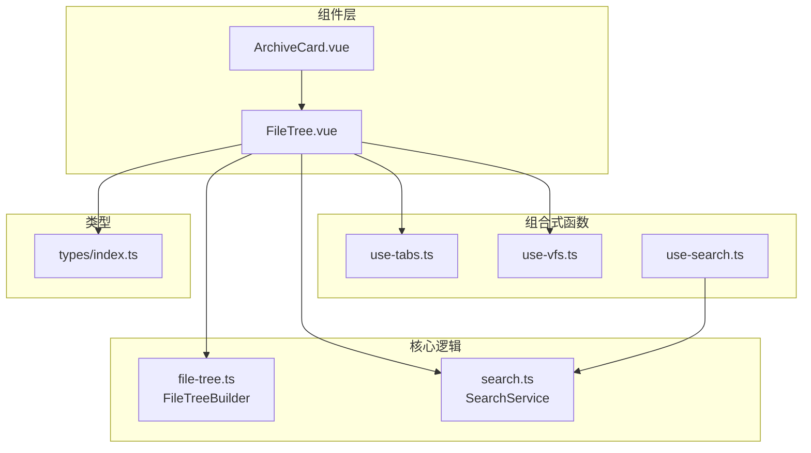
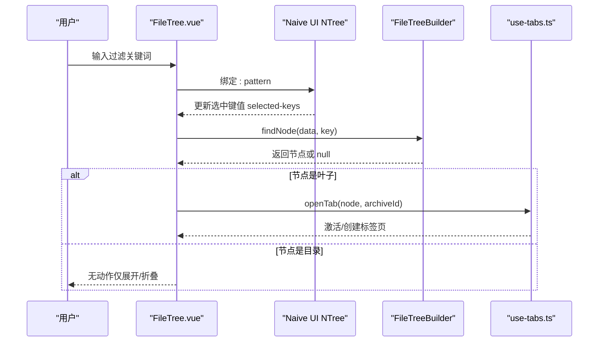
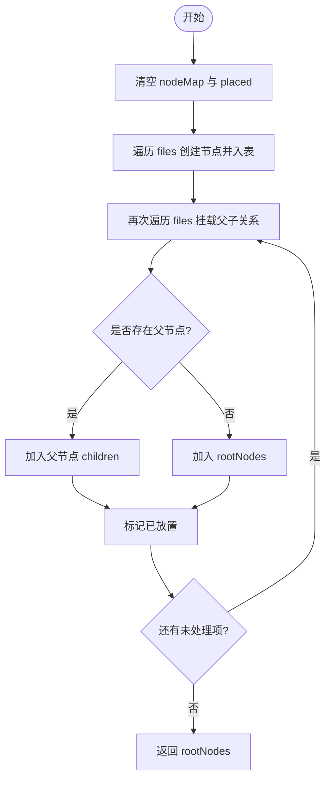
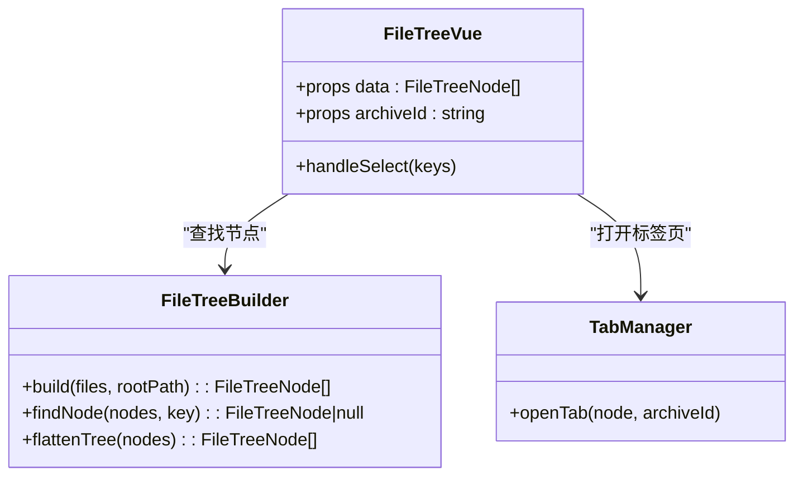
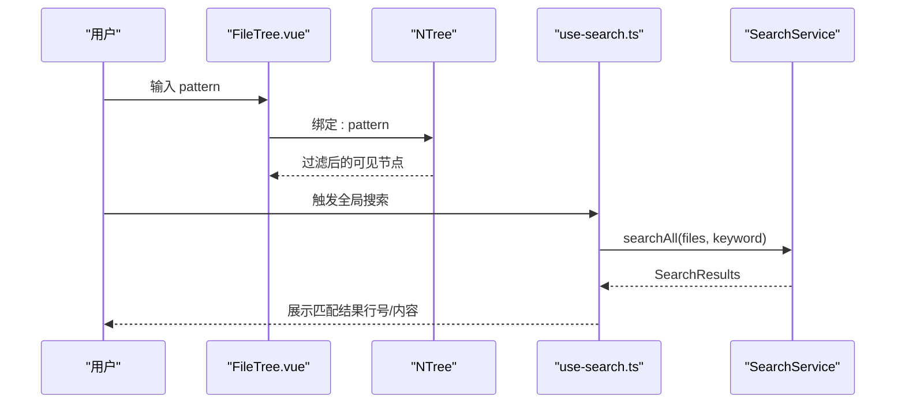
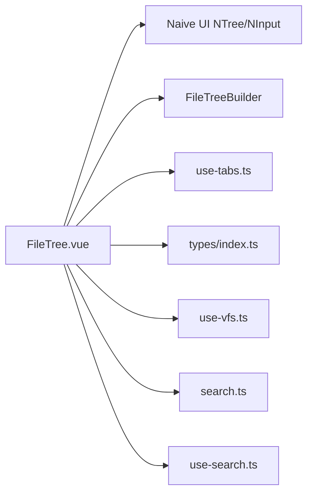

# 文件树组件

<cite>
**本文引用的文件**   
- [FileTree.vue](file://src/components/archive-panel/FileTree.vue)
- [file-tree.ts](file://src/core/file-tree.ts)
- [index.ts（类型定义）](file://src/types/index.ts)
- [use-tabs.ts](file://src/composables/use-tabs.ts)
- [ArchiveCard.vue](file://src/components/archive-panel/ArchiveCard.vue)
- [use-vfs.ts](file://src/composables/use-vfs.ts)
- [search.ts](file://src/core/search.ts)
- [use-search.ts](file://src/composables/use-search.ts)
</cite>

## 目录
1. [简介](#简介)
2. [项目结构](#项目结构)
3. [核心组件](#核心组件)
4. [架构总览](#架构总览)
5. [详细组件分析](#详细组件分析)
6. [依赖关系分析](#依赖关系分析)
7. [性能考虑](#性能考虑)
8. [故障排查指南](#故障排查指南)
9. [结论](#结论)
10. [附录](#附录)

## 简介
本文件为 FileTree 文件树组件的完整技术文档。内容覆盖：
- 目录结构的递归渲染与节点展开/折叠逻辑
- 文件图标区分、路径导航与面包屑显示方案
- 大文件树的性能优化策略（虚拟滚动、懒加载）
- 节点选择与高亮状态管理
- 右键菜单与上下文操作
- 搜索过滤与快速定位
- 数据结构要求、Props 配置、Events 事件与自定义渲染插槽
- 完整的文件树构建示例与高级定制方法

## 项目结构
文件树相关代码主要分布在以下位置：
- 组件层：src/components/archive-panel/FileTree.vue，由 ArchiveCard.vue 使用
- 核心逻辑：src/core/file-tree.ts，提供树构建与查找工具
- 类型定义：src/types/index.ts，定义 FileTreeNode、FileEntry 等
- 交互协作：src/composables/use-tabs.ts，负责标签页打开与激活
- 数据源：src/composables/use-vfs.ts，提供读取文件与列出目录能力
- 搜索能力：src/core/search.ts 与 src/composables/use-search.ts，提供文本搜索与结果聚合

图表来源
- [FileTree.vue:1-41](file://src/components/archive-panel/FileTree.vue#L1-L41)
- [ArchiveCard.vue:1-41](file://src/components/archive-panel/ArchiveCard.vue#L1-L41)
- [file-tree.ts:1-68](file://src/core/file-tree.ts#L1-L68)
- [use-tabs.ts:1-64](file://src/composables/use-tabs.ts#L1-L64)
- [use-vfs.ts:1-18](file://src/composables/use-vfs.ts#L1-L18)
- [search.ts:1-48](file://src/core/search.ts#L1-L48)
- [use-search.ts:1-27](file://src/composables/use-search.ts#L1-L27)
- [index.ts（类型定义）:1-71](file://src/types/index.ts#L1-L71)

章节来源
- [FileTree.vue:1-41](file://src/components/archive-panel/FileTree.vue#L1-L41)
- [ArchiveCard.vue:1-41](file://src/components/archive-panel/ArchiveCard.vue#L1-L41)
- [file-tree.ts:1-68](file://src/core/file-tree.ts#L1-L68)
- [use-tabs.ts:1-64](file://src/composables/use-tabs.ts#L1-L64)
- [use-vfs.ts:1-18](file://src/composables/use-vfs.ts#L1-L18)
- [search.ts:1-48](file://src/core/search.ts#L1-L48)
- [use-search.ts:1-27](file://src/composables/use-search.ts#L1-L27)
- [index.ts（类型定义）:1-71](file://src/types/index.ts#L1-L71)

## 核心组件
- FileTree.vue：基于 Naive UI 的 NTree 实现的文件树展示与交互，包含输入框过滤、虚拟滚动、选择打开标签页等行为。
- FileTreeBuilder（file-tree.ts）：将扁平文件列表构造成树形结构，并提供按 key 查找与扁平化遍历工具。
- use-tabs.ts：维护标签页集合与活动标签页，支持打开、关闭、置顶等操作。
- types/index.ts：定义 FileTreeNode、FileEntry、TabItem 等关键数据结构。
- use-vfs.ts：封装平台适配器的文件读取与目录列举能力，便于后续懒加载扩展。
- search.ts / use-search.ts：提供文本搜索与结果聚合，可用于“快速定位”场景。

章节来源
- [FileTree.vue:1-41](file://src/components/archive-panel/FileTree.vue#L1-L41)
- [file-tree.ts:1-68](file://src/core/file-tree.ts#L1-L68)
- [use-tabs.ts:1-64](file://src/composables/use-tabs.ts#L1-L64)
- [index.ts（类型定义）:1-71](file://src/types/index.ts#L1-L71)
- [use-vfs.ts:1-18](file://src/composables/use-vfs.ts#L1-L18)
- [search.ts:1-48](file://src/core/search.ts#L1-L48)
- [use-search.ts:1-27](file://src/composables/use-search.ts#L1-L27)

## 架构总览
下图展示了从用户交互到数据流的关键路径：用户在 FileTree 中点击叶子节点，组件通过 FileTreeBuilder 找到对应节点并交由 use-tabs 打开新标签页；同时，输入框的 pattern 驱动 NTree 内部过滤，virtual-scroll 启用虚拟滚动以提升大列表性能。

图表来源
- [FileTree.vue:16-23](file://src/components/archive-panel/FileTree.vue#L16-L23)
- [file-tree.ts:46-55](file://src/core/file-tree.ts#L46-L55)
- [use-tabs.ts:14-31](file://src/composables/use-tabs.ts#L14-L31)

## 详细组件分析

### 数据结构与类型契约
- FileEntry：表示一个文件或目录条目，包含名称、路径、大小、是否目录、最后修改时间等。
- FileTreeNode：树节点模型，key 唯一标识，label 显示名，isLeaf 指示是否为叶子，path 保存完整路径，size 可选，children 子节点数组。
- TabItem：标签项，关联 fileNode 与 archiveId，支持 pinned 固定等属性。

这些类型在文件树构建、选择与标签页联动中起到契约作用。

章节来源
- [index.ts（类型定义）:1-71](file://src/types/index.ts#L1-L71)

### 树构建算法（递归与层级组装）
FileTreeBuilder.build 将扁平文件列表转换为树：
- 首次遍历：为每个文件条目创建节点并放入 Map，目录节点初始化 children 为空数组。
- 二次遍历：根据 path 计算 parentPath，若父节点存在则加入其 children，否则作为根节点。
- 返回根节点数组。

该算法时间复杂度 O(n)，空间复杂度 O(n)。

图表来源
- [file-tree.ts:7-44](file://src/core/file-tree.ts#L7-L44)

章节来源
- [file-tree.ts:1-68](file://src/core/file-tree.ts#L1-L68)

### 节点展开/折叠与选择逻辑
- 展开/折叠：由 NTree 内部管理，默认 default-expand-all=false，按需展开。
- 选择行为：当 selected-keys 变化时，组件通过 FileTreeBuilder.findNode 查找节点，仅对叶子节点执行打开标签页操作。

图表来源
- [FileTree.vue:16-23](file://src/components/archive-panel/FileTree.vue#L16-L23)
- [file-tree.ts:46-55](file://src/core/file-tree.ts#L46-L55)
- [use-tabs.ts:14-31](file://src/composables/use-tabs.ts#L14-L31)

章节来源
- [FileTree.vue:1-41](file://src/components/archive-panel/FileTree.vue#L1-L41)
- [file-tree.ts:46-55](file://src/core/file-tree.ts#L46-L55)
- [use-tabs.ts:14-31](file://src/composables/use-tabs.ts#L14-L31)

### 搜索过滤与快速定位
- 本地过滤：FileTree.vue 内维护 pattern，通过 NTree 的 pattern 与 show-irrelevant-nodes 控制过滤显示。
- 全文搜索：结合 use-search.ts 与 SearchService.searchAll，可跨多个文件进行关键字匹配，得到 SearchResults 后用于“快速定位”。

图表来源
- [FileTree.vue:28-39](file://src/components/archive-panel/FileTree.vue#L28-L39)
- [use-search.ts:9-27](file://src/composables/use-search.ts#L9-L27)
- [search.ts:30-48](file://src/core/search.ts#L30-L48)

章节来源
- [FileTree.vue:28-39](file://src/components/archive-panel/FileTree.vue#L28-L39)
- [use-search.ts:1-27](file://src/composables/use-search.ts#L1-L27)
- [search.ts:1-48](file://src/core/search.ts#L1-L48)

### 路径导航与面包屑显示
当前 FileTree.vue 未直接实现面包屑。建议：
- 在 FileTree 组件内新增面包屑区域，根据选中节点的 path 生成路径片段数组。
- 监听 selected-keys 变化，动态更新面包屑。
- 点击面包屑片段可回退至对应目录节点并展开。

（本节为设计建议，不直接分析具体文件）

### 文件图标区分
当前未内置文件类型图标。建议：
- 在 FileTreeNode 上扩展 icon 字段或通过文件名后缀映射图标。
- 使用 NTree 的 render-label 插槽自定义渲染，按 isLeaf 与后缀显示不同图标。

（本节为设计建议，不直接分析具体文件）

### 右键菜单与上下文操作
当前未实现右键菜单。建议：
- 在 FileTree 节点上监听 contextmenu 事件，阻止默认行为。
- 使用 Naive UI 的 Dropdown 或自定义菜单组件，提供预览、导出、复制路径、查看元数据等操作。
- 根据节点类型（目录/文件）动态显示可用菜单项。

（本节为设计建议，不直接分析具体文件）

### 节点选择与高亮状态管理
- 选择：NTree 的 selectable 与 update:selected-keys 事件驱动。
- 高亮：可通过 NTree 的样式或自定义节点渲染增强视觉反馈。
- 联动：选择叶子节点后，调用 use-tabs.openTab 打开或激活标签页。

章节来源
- [FileTree.vue:29-39](file://src/components/archive-panel/FileTree.vue#L29-L39)
- [use-tabs.ts:14-31](file://src/composables/use-tabs.ts#L14-L31)

### Props、Events 与插槽
- Props
  - data: FileTreeNode[]，树数据
  - archiveId: string，所属归档 ID
- Events
  - update:selected-keys: 选中键变化回调
- 插槽
  - 当前未暴露自定义渲染插槽。如需自定义节点外观（如图标、大小信息），可在 NTree 上使用 render-label 插槽扩展。

章节来源
- [FileTree.vue:8-11](file://src/components/archive-panel/FileTree.vue#L8-L11)
- [FileTree.vue:29-39](file://src/components/archive-panel/FileTree.vue#L29-L39)

### 完整构建示例（步骤说明）
- 准备数据：通过 use-vfs.listDir 获取目录下的 FileEntry 列表。
- 构建树：调用 FileTreeBuilder.build(files, rootPath) 生成 FileTreeNode[]。
- 传入组件：将树数据与 archiveId 传入 FileTree.vue。
- 交互：用户点击叶子节点，自动打开标签页。

章节来源
- [use-vfs.ts:11-14](file://src/composables/use-vfs.ts#L11-L14)
- [file-tree.ts:7-44](file://src/core/file-tree.ts#L7-L44)
- [ArchiveCard.vue:34-38](file://src/components/archive-panel/ArchiveCard.vue#L34-L38)
- [FileTree.vue:8-11](file://src/components/archive-panel/FileTree.vue#L8-L11)

### 高级定制方法
- 自定义节点渲染：通过 NTree 的 render-label 插槽，按 isLeaf 与后缀显示图标与文件大小。
- 懒加载：在目录节点上实现 expand 事件，按需调用 listDir 拉取子目录并追加 children。
- 右键菜单：在节点容器上监听 contextmenu，弹出操作菜单。
- 面包屑：根据选中节点 path 生成片段数组，点击片段回退并展开对应目录。
- 搜索联动：将 use-search 的结果与 FileTree 的 pattern 联动，快速定位并滚动到目标节点。

（本节为设计建议，不直接分析具体文件）

## 依赖关系分析
- FileTree.vue 依赖：
  - Naive UI NTree/NInput（UI 渲染与过滤）
  - FileTreeBuilder（树构建与查找）
  - use-tabs（标签页管理）
  - types（数据结构）
  - use-vfs（可选，用于懒加载）
  - search.ts/use-search.ts（可选，用于全文搜索）

图表来源
- [FileTree.vue:1-41](file://src/components/archive-panel/FileTree.vue#L1-L41)
- [file-tree.ts:1-68](file://src/core/file-tree.ts#L1-L68)
- [use-tabs.ts:1-64](file://src/composables/use-tabs.ts#L1-L64)
- [index.ts（类型定义）:1-71](file://src/types/index.ts#L1-L71)
- [use-vfs.ts:1-18](file://src/composables/use-vfs.ts#L1-L18)
- [search.ts:1-48](file://src/core/search.ts#L1-L48)
- [use-search.ts:1-27](file://src/composables/use-search.ts#L1-L27)

章节来源
- [FileTree.vue:1-41](file://src/components/archive-panel/FileTree.vue#L1-L41)
- [file-tree.ts:1-68](file://src/core/file-tree.ts#L1-L68)
- [use-tabs.ts:1-64](file://src/composables/use-tabs.ts#L1-L64)
- [index.ts（类型定义）:1-71](file://src/types/index.ts#L1-L71)
- [use-vfs.ts:1-18](file://src/composables/use-vfs.ts#L1-L18)
- [search.ts:1-48](file://src/core/search.ts#L1-L48)
- [use-search.ts:1-27](file://src/composables/use-search.ts#L1-L27)

## 性能考虑
- 虚拟滚动：FileTree.vue 已启用 virtual-scroll，适合大列表渲染，减少 DOM 节点数量，提升滚动性能。
- 懒加载：建议在目录节点 expand 事件中按需加载子目录，避免一次性构建过深树导致卡顿。
- 过滤性能：NTree 的 pattern 过滤在大数据量下可能产生额外开销，可考虑防抖与增量过滤。
- 查找优化：FileTreeBuilder.findNode 为递归遍历，O(n)；若频繁查找，可引入 Map 缓存 key→node 的索引。
- 搜索性能：SearchService.searchAll 逐文件扫描，可对大文件分块处理或使用 Web Worker 降低主线程压力。

（本节为通用指导，不直接分析具体文件）

## 故障排查指南
- 无法打开标签页
  - 检查 selected-keys 是否正确传递，确认节点 isLeaf 判断逻辑。
  - 确认 use-tabs.openTab 的参数与现有标签去重逻辑。
- 过滤无效
  - 检查 pattern 绑定与 show-irrelevant-nodes 设置。
  - 确认 NTree 的 data 结构与 key 唯一性。
- 性能问题
  - 确认 virtual-scroll 已启用且容器高度合理。
  - 评估是否需要懒加载与搜索分片。

章节来源
- [FileTree.vue:16-23](file://src/components/archive-panel/FileTree.vue#L16-L23)
- [use-tabs.ts:14-31](file://src/composables/use-tabs.ts#L14-L31)
- [FileTree.vue:28-39](file://src/components/archive-panel/FileTree.vue#L28-L39)

## 结论
FileTree 组件在当前仓库中提供了基础的文件树展示、过滤与选择打开标签页能力，并通过虚拟滚动保障大列表性能。结合 FileTreeBuilder 的树构建与 use-tabs 的标签管理，形成了清晰的数据流与交互链路。未来可按需扩展右键菜单、面包屑、图标区分与懒加载等高级特性，以满足更复杂的业务需求。

## 附录
- 参考测试用例：file-tree.test.ts 验证了树构建、查找与扁平化功能，可作为集成时的回归依据。
- 搜索服务：search.ts 与 use-search.ts 提供了文本搜索与结果聚合，可与文件树联动实现“快速定位”。

章节来源
- [file-tree.ts:1-68](file://src/core/file-tree.ts#L1-L68)
- [search.ts:1-48](file://src/core/search.ts#L1-L48)
- [use-search.ts:1-27](file://src/composables/use-search.ts#L1-L27)