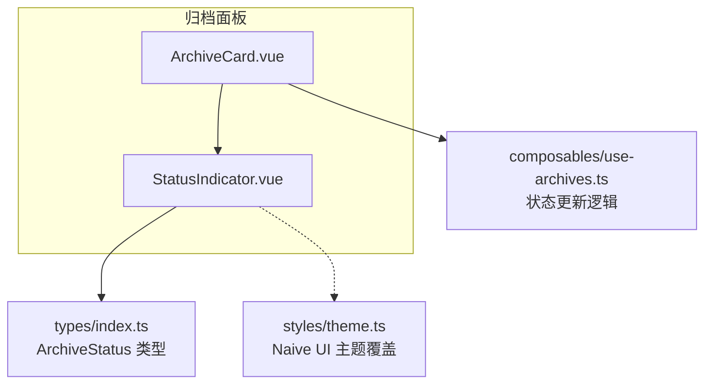
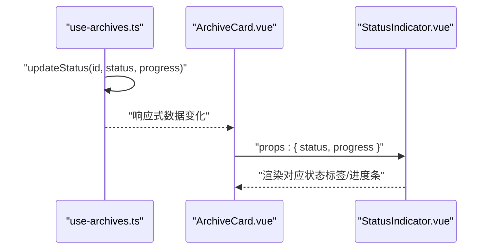
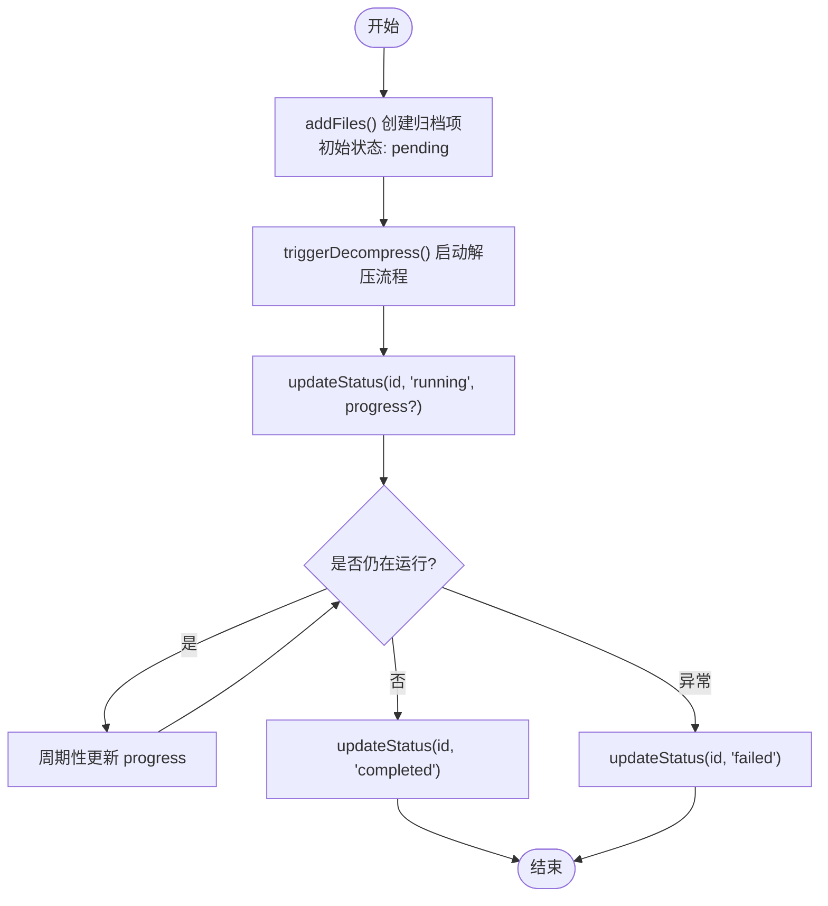

# 状态指示器组件

<cite>
**本文引用的文件**   
- [StatusIndicator.vue](file://src/components/archive-panel/StatusIndicator.vue)
- [ArchiveCard.vue](file://src/components/archive-panel/ArchiveCard.vue)
- [index.ts](file://src/types/index.ts)
- [use-archives.ts](file://src/composables/use-archives.ts)
- [theme.ts](file://src/styles/theme.ts)
</cite>

## 目录
1. [简介](#简介)
2. [项目结构](#项目结构)
3. [核心组件](#核心组件)
4. [架构总览](#架构总览)
5. [详细组件分析](#详细组件分析)
6. [依赖关系分析](#依赖关系分析)
7. [性能与可访问性](#性能与可访问性)
8. [故障排查指南](#故障排查指南)
9. [结论](#结论)
10. [附录：最佳实践与集成示例](#附录最佳实践与集成示例)

## 简介
本文件为 StatusIndicator 状态指示器组件的权威文档。该组件用于在归档任务卡片中直观展示解压任务的状态，包括“排队中”、“解压中（带进度）”、“已完成”和“失败”。它基于 Naive UI 的标签与进度条组件实现，通过类型化的 props 接收状态与进度值，并在不同状态下提供对应的视觉反馈。

## 项目结构
StatusIndicator 位于归档面板模块下，被 ArchiveCard 使用以显示每个归档项的任务状态与进度。其状态类型由全局类型定义集中管理，主题色由全局主题覆盖配置统一控制。



图表来源
- [ArchiveCard.vue:1-41](file://src/components/archive-panel/ArchiveCard.vue#L1-L41)
- [StatusIndicator.vue:1-28](file://src/components/archive-panel/StatusIndicator.vue#L1-L28)
- [index.ts:15-46](file://src/types/index.ts#L15-L46)
- [use-archives.ts:35-43](file://src/composables/use-archives.ts#L35-L43)
- [theme.ts:3-12](file://src/styles/theme.ts#L3-L12)

章节来源
- [ArchiveCard.vue:1-41](file://src/components/archive-panel/ArchiveCard.vue#L1-L41)
- [StatusIndicator.vue:1-28](file://src/components/archive-panel/StatusIndicator.vue#L1-L28)
- [index.ts:15-46](file://src/types/index.ts#L15-L46)
- [use-archives.ts:35-43](file://src/composables/use-archives.ts#L35-L43)
- [theme.ts:3-12](file://src/styles/theme.ts#L3-L12)

## 核心组件
- 组件职责：根据传入的 ArchiveStatus 与 progress 渲染对应状态的标签与进度条，提供清晰、一致的任务状态反馈。
- 输入属性（Props）：
  - status: ArchiveStatus（来自类型定义）
  - progress: number（0-100 的数值）
- 输出事件：无
- 外部依赖：Naive UI 的 NTag、NProgress、NSpace；全局类型 ArchiveStatus；全局主题覆盖中的颜色变量。

章节来源
- [StatusIndicator.vue:1-28](file://src/components/archive-panel/StatusIndicator.vue#L1-L28)
- [index.ts:15-15](file://src/types/index.ts#L15-L15)
- [theme.ts:3-12](file://src/styles/theme.ts#L3-L12)

## 架构总览
StatusIndicator 作为展示层组件，不持有业务状态，仅消费父级传递的数据。状态变更由 useArchiveManager 驱动，ArchiveCard 将当前归档项的状态与进度传递给 StatusIndicator。



图表来源
- [use-archives.ts:35-43](file://src/composables/use-archives.ts#L35-L43)
- [ArchiveCard.vue:25-27](file://src/components/archive-panel/ArchiveCard.vue#L25-L27)
- [StatusIndicator.vue:5-8](file://src/components/archive-panel/StatusIndicator.vue#L5-L8)

## 详细组件分析

### 组件接口与类型
- Props
  - status: ArchiveStatus
    - 取值范围：'pending' | 'running' | 'completed' | 'failed'
  - progress: number
    - 表示当前任务的完成百分比，通常由上层状态管理器在 running 阶段更新
- 类型来源
  - ArchiveStatus 与 ArchiveItem 的定义位于类型文件中，确保状态与进度的强类型约束

章节来源
- [StatusIndicator.vue:5-8](file://src/components/archive-panel/StatusIndicator.vue#L5-L8)
- [index.ts:15-46](file://src/types/index.ts#L15-L46)

### 状态映射与视觉呈现
- pending（排队中）
  - 文本：中文文案提示排队
  - 样式：warning 类型的标签
- running（解压中）
  - 文本：中文文案提示进行中
  - 样式：info 类型的标签 + 线性进度条（宽度固定，隐藏默认指示文字）
- completed（已完成）
  - 文本：中文文案提示完成
  - 样式：success 类型的标签
- failed（失败）
  - 文本：中文文案提示失败
  - 样式：error 类型的标签

说明
- 颜色语义来源于 Naive UI 的主题覆盖配置，成功、错误、警告等颜色由全局主题统一管理，便于整体风格一致与暗色模式适配。

章节来源
- [StatusIndicator.vue:11-26](file://src/components/archive-panel/StatusIndicator.vue#L11-L26)
- [theme.ts:3-12](file://src/styles/theme.ts#L3-L12)

### 过渡动画与交互
- 进度条动画：NProgress 内置线性进度条动画，随 percentage 变化平滑过渡
- 标签切换：条件渲染在不同状态间切换，无额外自定义过渡动画
- 建议：如需更丰富的过渡体验，可在外层容器添加 Vue Transition 包裹，或在主题中扩展进度条动画时长与缓动函数

章节来源
- [StatusIndicator.vue:16-19](file://src/components/archive-panel/StatusIndicator.vue#L16-L19)

### 无障碍访问与屏幕阅读器兼容性
现状
- 组件未显式设置 aria-* 或 role 属性
- 文本内容均为中文文案，对支持朗读的辅助技术有一定可读性

改进建议
- 为状态区域增加 role="status" 或 role="progressbar"（针对进度条），并配合 aria-live="polite" 使状态变更能被屏幕阅读器播报
- 为进度条设置 aria-valuenow、aria-valuemin、aria-valuemax 与 aria-label
- 为标签增加 aria-label 描述具体含义，如“解压中，进度 42%”

章节来源
- [StatusIndicator.vue:11-26](file://src/components/archive-panel/StatusIndicator.vue#L11-L26)

### 主题适配与样式变量
- 主题覆盖：通过 GlobalThemeOverrides 统一设置 primaryColor、errorColor、warningColor、successColor 等，影响 NTag 与 NProgress 的颜色表现
- 字体：统一设置系统字体族与等宽字体族，提升可读性与一致性
- 适配策略：建议在应用入口注入 themeOverrides，避免在各组件内重复定义样式

章节来源
- [theme.ts:3-12](file://src/styles/theme.ts#L3-L12)

### 状态管理与数据流
- 状态更新：useArchiveManager 暴露 updateStatus 方法，负责更新指定归档项的 status、progress，并在 running 与 completed 时记录时间戳
- 数据绑定：ArchiveCard 将 archive.status 与 archive.progress 透传给 StatusIndicator
- 触发时机：当用户添加文件或任务调度器推进任务时，调用 updateStatus 驱动视图更新



图表来源
- [use-archives.ts:9-29](file://src/composables/use-archives.ts#L9-L29)
- [use-archives.ts:35-43](file://src/composables/use-archives.ts#L35-L43)

章节来源
- [use-archives.ts:9-29](file://src/composables/use-archives.ts#L9-L29)
- [use-archives.ts:35-43](file://src/composables/use-archives.ts#L35-L43)
- [ArchiveCard.vue:25-27](file://src/components/archive-panel/ArchiveCard.vue#L25-L27)

## 依赖关系分析
- 组件内部依赖
  - Naive UI：NTag、NProgress、NSpace
  - 类型定义：ArchiveStatus
- 组件外部依赖
  - 父组件：ArchiveCard 提供 status 与 progress
  - 状态管理：useArchiveManager 提供状态更新能力
  - 主题：theme.ts 中的主题覆盖影响颜色与字体

```mermaid
classDiagram
class StatusIndicator {
+props : { status : ArchiveStatus; progress : number }
+render() : NSpace
}
class ArchiveCard {
+props : { archive : ArchiveItem }
+emit('remove'|'retry')
}
class UseArchiveManager {
+addFiles(files)
+updateStatus(id, status, progress?)
+stats
}
class Types {
+ArchiveStatus
+ArchiveItem
}
class Theme {
+GlobalThemeOverrides
}
ArchiveCard --> StatusIndicator : "传递 props"
UseArchiveManager --> ArchiveCard : "驱动数据变化"
StatusIndicator --> Types : "引用类型"
StatusIndicator --> Theme : "受主题影响"
```

图表来源
- [StatusIndicator.vue:1-28](file://src/components/archive-panel/StatusIndicator.vue#L1-28)
- [ArchiveCard.vue:1-41](file://src/components/archive-panel/ArchiveCard.vue#L1-41)
- [use-archives.ts:1-60](file://src/composables/use-archives.ts#L1-60)
- [index.ts:15-46](file://src/types/index.ts#L15-L46)
- [theme.ts:3-12](file://src/styles/theme.ts#L3-L12)

章节来源
- [StatusIndicator.vue:1-28](file://src/components/archive-panel/StatusIndicator.vue#L1-28)
- [ArchiveCard.vue:1-41](file://src/components/archive-panel/ArchiveCard.vue#L1-41)
- [use-archives.ts:1-60](file://src/composables/use-archives.ts#L1-60)
- [index.ts:15-46](file://src/types/index.ts#L15-L46)
- [theme.ts:3-12](file://src/styles/theme.ts#L3-L12)

## 性能与可访问性
- 性能
  - 条件渲染仅在状态变化时重渲染相关节点，开销较小
  - 进度条频繁更新时，建议在上层节流或合并更新，避免过度重绘
- 可访问性
  - 建议为状态区域与进度条补充 ARIA 属性，提高屏幕阅读器兼容性
  - 文案应简洁明确，避免歧义

[本节为通用指导，无需源码引用]

## 故障排查指南
- 问题：进度条不更新
  - 检查是否正确调用 updateStatus 并传入 progress 参数
  - 确认父组件是否正确将 archive.progress 绑定到组件
- 问题：状态文案不正确
  - 核对 ArchiveStatus 的取值是否与组件模板分支匹配
  - 检查是否存在未处理的状态分支导致默认行为
- 问题：颜色不符合预期
  - 确认全局主题覆盖已正确注入
  - 检查浏览器控制台是否有主题加载失败的报错

章节来源
- [use-archives.ts:35-43](file://src/composables/use-archives.ts#L35-L43)
- [StatusIndicator.vue:11-26](file://src/components/archive-panel/StatusIndicator.vue#L11-L26)
- [theme.ts:3-12](file://src/styles/theme.ts#L3-L12)

## 结论
StatusIndicator 是一个轻量、类型安全、主题友好的状态指示组件。它通过清晰的 props 接口与 Naive UI 组件组合，提供了稳定可靠的任务状态可视化。结合 useArchiveManager 的状态管理，可实现从任务创建、执行到完成的完整闭环。后续可在可访问性与过渡动画方面进一步增强，以提升用户体验与包容性。

[本节为总结，无需源码引用]

## 附录：最佳实践与集成示例
- 状态管理最佳实践
  - 使用 updateStatus 统一更新状态与进度，避免分散修改
  - 在 running 阶段采用节流或批量更新策略，减少高频渲染
  - 在 completed 与 failed 时记录时间戳，便于统计与诊断
- 集成示例（步骤）
  - 在父组件中引入 useArchiveManager，获取 archives、updateStatus
  - 在归档项卡片中渲染 StatusIndicator，并绑定 archive.status 与 archive.progress
  - 在任务执行过程中周期性调用 updateStatus 更新进度
  - 在任务结束时调用 updateStatus 标记 completed 或 failed
- 可访问性增强建议
  - 为状态区域添加 role="status" 与 aria-live="polite"
  - 为进度条添加 aria-valuenow、aria-valuemin、aria-valuemax 与 aria-label
  - 为标签增加 aria-label 描述具体状态与进度

章节来源
- [use-archives.ts:35-43](file://src/composables/use-archives.ts#L35-L43)
- [ArchiveCard.vue:25-27](file://src/components/archive-panel/ArchiveCard.vue#L25-L27)
- [StatusIndicator.vue:11-26](file://src/components/archive-panel/StatusIndicator.vue#L11-L26)