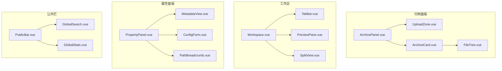
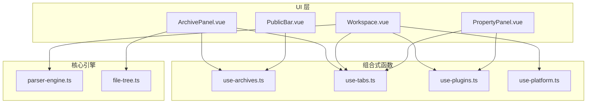
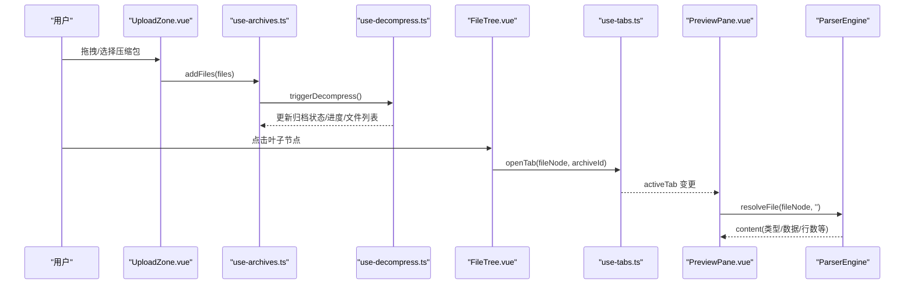
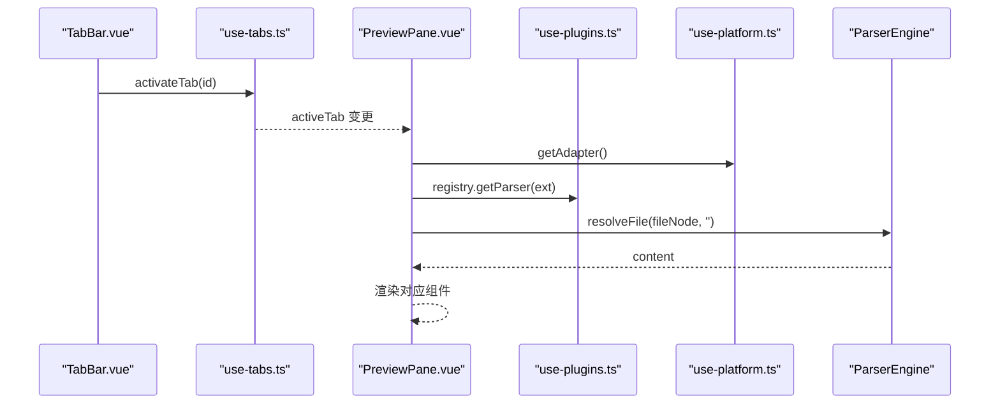
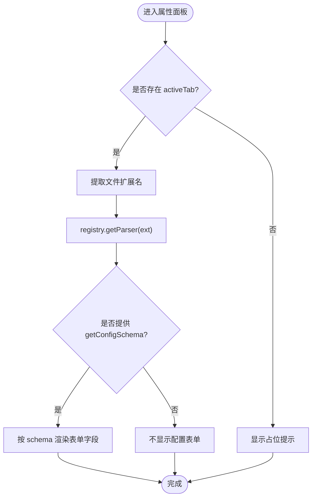
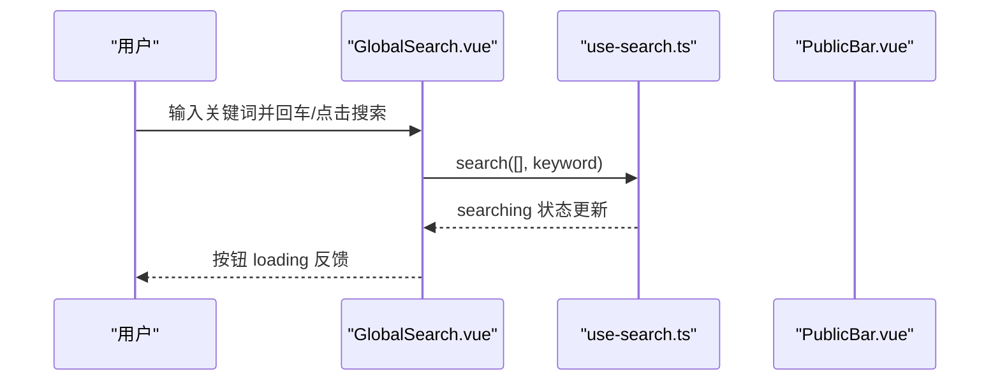
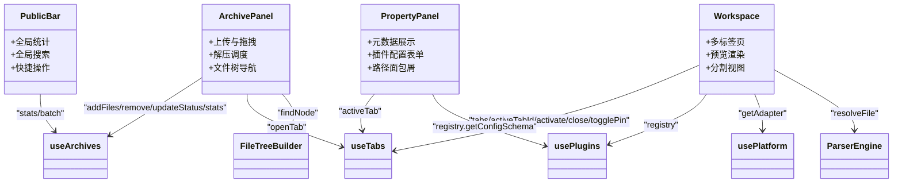

# 核心组件

<cite>
**本文引用的文件**   
- [ArchivePanel.vue](file://src/components/archive-panel/ArchivePanel.vue)
- [UploadZone.vue](file://src/components/archive-panel/UploadZone.vue)
- [ArchiveCard.vue](file://src/components/archive-panel/ArchiveCard.vue)
- [FileTree.vue](file://src/components/archive-panel/FileTree.vue)
- [Workspace.vue](file://src/components/workspace/Workspace.vue)
- [TabBar.vue](file://src/components/workspace/TabBar.vue)
- [PreviewPane.vue](file://src/components/workspace/PreviewPane.vue)
- [SplitView.vue](file://src/components/workspace/SplitView.vue)
- [PropertyPanel.vue](file://src/components/property-panel/PropertyPanel.vue)
- [MetadataView.vue](file://src/components/property-panel/MetadataView.vue)
- [ConfigForm.vue](file://src/components/property-panel/ConfigForm.vue)
- [PathBreadcrumb.vue](file://src/components/property-panel/PathBreadcrumb.vue)
- [PublicBar.vue](file://src/components/public-bar/PublicBar.vue)
- [GlobalSearch.vue](file://src/components/public-bar/GlobalSearch.vue)
- [GlobalStats.vue](file://src/components/public-bar/GlobalStats.vue)
- [use-archives.ts](file://src/composables/use-archives.ts)
- [use-tabs.ts](file://src/composables/use-tabs.ts)
- [use-plugins.ts](file://src/composables/use-plugins.ts)
- [use-platform.ts](file://src/composables/use-platform.ts)
- [parser-engine.ts](file://src/core/parser-engine.ts)
- [file-tree.ts](file://src/core/file-tree.ts)
</cite>

## 目录
1. [简介](#简介)
2. [项目结构](#项目结构)
3. [核心组件](#核心组件)
4. [架构总览](#架构总览)
5. [详细组件分析](#详细组件分析)
6. [依赖关系分析](#依赖关系分析)
7. [性能考量](#性能考量)
8. [故障排查指南](#故障排查指南)
9. [结论](#结论)
10. [附录：API 参考与使用示例](#附录api-参考与使用示例)

## 简介
本文件为 Hello-Tauri 的核心 UI 组件提供系统化文档，覆盖以下四个关键区域：
- ArchivePanel：压缩包上传、拖拽支持、解压状态与文件树导航
- Workspace：多标签页管理、文件预览渲染、分割视图与工具栏操作
- PropertyPanel：属性编辑、元数据展示与路径面包屑导航
- PublicBar：全局搜索、统计信息与快捷操作

文档包含各组件的职责边界、API 参考、事件与插槽用法、样式定制建议，以及组件间通信模式与依赖关系说明。

## 项目结构
核心 UI 组件按功能域组织在 src/components 下，并通过 composables 和 core 模块进行能力扩展与集成。

图表来源
- [ArchivePanel.vue:1-24](file://src/components/archive-panel/ArchivePanel.vue#L1-L24)
- [UploadZone.vue:1-29](file://src/components/archive-panel/UploadZone.vue#L1-L29)
- [ArchiveCard.vue:1-41](file://src/components/archive-panel/ArchiveCard.vue#L1-L41)
- [FileTree.vue:1-42](file://src/components/archive-panel/FileTree.vue#L1-L42)
- [Workspace.vue:1-36](file://src/components/workspace/Workspace.vue#L1-L36)
- [TabBar.vue:1-33](file://src/components/workspace/TabBar.vue#L1-L33)
- [PreviewPane.vue:1-58](file://src/components/workspace/PreviewPane.vue#L1-L58)
- [SplitView.vue:1-15](file://src/components/workspace/SplitView.vue#L1-L15)
- [PropertyPanel.vue:1-15](file://src/components/property-panel/PropertyPanel.vue#L1-L15)
- [MetadataView.vue:1-35](file://src/components/property-panel/MetadataView.vue#L1-L35)
- [ConfigForm.vue:1-37](file://src/components/property-panel/ConfigForm.vue#L1-L37)
- [PathBreadcrumb.vue:1-21](file://src/components/property-panel/PathBreadcrumb.vue#L1-L21)
- [PublicBar.vue:1-38](file://src/components/public-bar/PublicBar.vue#L1-L38)
- [GlobalSearch.vue:1-31](file://src/components/public-bar/GlobalSearch.vue#L1-L31)
- [GlobalStats.vue:1-24](file://src/components/public-bar/GlobalStats.vue#L1-L24)

章节来源
- [ArchivePanel.vue:1-24](file://src/components/archive-panel/ArchivePanel.vue#L1-L24)
- [Workspace.vue:1-36](file://src/components/workspace/Workspace.vue#L1-L36)
- [PropertyPanel.vue:1-15](file://src/components/property-panel/PropertyPanel.vue#L1-L15)
- [PublicBar.vue:1-38](file://src/components/public-bar/PublicBar.vue#L1-L38)

## 核心组件
本节概述四大核心组件的职责与交互要点：
- ArchivePanel：聚合上传区与归档卡片列表，驱动压缩包的添加、移除与解压流程；通过文件树打开文件并创建预览标签页。
- Workspace：承载标签页、预览工具栏、预览内容与状态栏；根据当前标签内容类型动态选择渲染器。
- PropertyPanel：集中展示当前文件的元数据、插件配置表单与路径面包屑。
- PublicBar：提供全局统计、搜索入口与批量操作、主题切换等快捷动作。

章节来源
- [ArchivePanel.vue:1-24](file://src/components/archive-panel/ArchivePanel.vue#L1-L24)
- [Workspace.vue:1-36](file://src/components/workspace/Workspace.vue#L1-L36)
- [PropertyPanel.vue:1-15](file://src/components/property-panel/PropertyPanel.vue#L1-L15)
- [PublicBar.vue:1-38](file://src/components/public-bar/PublicBar.vue#L1-L38)

## 架构总览
组件通过组合式函数（composables）共享状态与行为，核心引擎负责解析与渲染。

图表来源
- [ArchivePanel.vue:1-24](file://src/components/archive-panel/ArchivePanel.vue#L1-L24)
- [Workspace.vue:1-36](file://src/components/workspace/Workspace.vue#L1-L36)
- [PropertyPanel.vue:1-15](file://src/components/property-panel/PropertyPanel.vue#L1-L15)
- [PublicBar.vue:1-38](file://src/components/public-bar/PublicBar.vue#L1-L38)
- [use-archives.ts:1-60](file://src/composables/use-archives.ts#L1-L60)
- [use-tabs.ts](file://src/composables/use-tabs.ts)
- [use-plugins.ts](file://src/composables/use-plugins.ts)
- [use-platform.ts](file://src/composables/use-platform.ts)
- [parser-engine.ts](file://src/core/parser-engine.ts)
- [file-tree.ts](file://src/core/file-tree.ts)

## 详细组件分析

### ArchivePanel 组件族
职责与能力
- 上传与拖拽：支持多选与常见压缩格式，接收文件后进入待处理队列。
- 解压调度：新增文件后触发异步解压任务，更新状态与进度。
- 文件树导航：过滤与虚拟滚动，点击叶子节点打开预览标签页。
- 错误重试：失败时显示错误信息并提供重试入口。

关键 API 与事件
- 子组件 UploadZone
  - 输入：无 props
  - 输出事件：内部调用 addFiles(files)
- 子组件 ArchiveCard
  - Props：archive（归档项对象）
  - 事件：remove(id)、retry(id)
- 子组件 FileTree
  - Props：data（文件树节点数组）、archiveId（归档标识）
  - 事件：内部通过 openTab(node, archiveId) 打开标签

交互序列（上传到预览）

图表来源
- [UploadZone.vue:1-29](file://src/components/archive-panel/UploadZone.vue#L1-L29)
- [use-archives.ts:1-60](file://src/composables/use-archives.ts#L1-L60)
- [FileTree.vue:1-42](file://src/components/archive-panel/FileTree.vue#L1-L42)
- [PreviewPane.vue:1-58](file://src/components/workspace/PreviewPane.vue#L1-L58)
- [parser-engine.ts](file://src/core/parser-engine.ts)

使用示例（路径引用）
- 上传区：[UploadZone.vue:1-29](file://src/components/archive-panel/UploadZone.vue#L1-L29)
- 归档卡片：[ArchiveCard.vue:1-41](file://src/components/archive-panel/ArchiveCard.vue#L1-L41)
- 文件树：[FileTree.vue:1-42](file://src/components/archive-panel/FileTree.vue#L1-L42)
- 管理器：[use-archives.ts:1-60](file://src/composables/use-archives.ts#L1-L60)

样式定制建议
- 上传区容器与提示文本可通过外层包裹自定义 CSS 调整间距与对齐。
- 文件树最大高度与行高可在 NTree 的 style 中调整。
- 卡片间距与标题字号可基于 NCard 的 size 与 margin 控制。

章节来源
- [ArchivePanel.vue:1-24](file://src/components/archive-panel/ArchivePanel.vue#L1-L24)
- [UploadZone.vue:1-29](file://src/components/archive-panel/UploadZone.vue#L1-L29)
- [ArchiveCard.vue:1-41](file://src/components/archive-panel/ArchiveCard.vue#L1-L41)
- [FileTree.vue:1-42](file://src/components/archive-panel/FileTree.vue#L1-L42)
- [use-archives.ts:1-60](file://src/composables/use-archives.ts#L1-L60)

### Workspace 组件族
职责与能力
- 多标签页：创建、激活、关闭与固定标签；空态提示。
- 预览工具栏：字体大小、换行、行号、编码等运行时设置。
- 预览渲染：根据文件扩展名选择解析插件并渲染对应组件。
- 分割视图：左右分栏布局，最小尺寸限制。

关键 API 与事件
- TabBar
  - 事件：activateTab(id)、closeTab(id)、togglePin(id)
- PreviewPane
  - 行为：监听 activeTab，按需加载内容并选择渲染器
- SplitView
  - 插槽：left、right

交互序列（标签切换与渲染）

图表来源
- [TabBar.vue:1-33](file://src/components/workspace/TabBar.vue#L1-L33)
- [PreviewPane.vue:1-58](file://src/components/workspace/PreviewPane.vue#L1-L58)
- [use-plugins.ts](file://src/composables/use-plugins.ts)
- [use-platform.ts](file://src/composables/use-platform.ts)
- [parser-engine.ts](file://src/core/parser-engine.ts)

使用示例（路径引用）
- 工作区容器：[Workspace.vue:1-36](file://src/components/workspace/Workspace.vue#L1-L36)
- 标签栏：[TabBar.vue:1-33](file://src/components/workspace/TabBar.vue#L1-L33)
- 预览窗格：[PreviewPane.vue:1-58](file://src/components/workspace/PreviewPane.vue#L1-L58)
- 分割视图：[SplitView.vue:1-15](file://src/components/workspace/SplitView.vue#L1-L15)

样式定制建议
- 标签页样式可通过 NTabs 的 type 与 closable 控制。
- 预览区域滚动与高度由 NScrollbar 与父容器 flex 布局决定。
- 分割视图最小尺寸与比例可通过 Pane 的 min-size 调整。

章节来源
- [Workspace.vue:1-36](file://src/components/workspace/Workspace.vue#L1-L36)
- [TabBar.vue:1-33](file://src/components/workspace/TabBar.vue#L1-L33)
- [PreviewPane.vue:1-58](file://src/components/workspace/PreviewPane.vue#L1-L58)
- [SplitView.vue:1-15](file://src/components/workspace/SplitView.vue#L1-L15)

### PropertyPanel 组件族
职责与能力
- 元数据展示：文件名、路径、大小、类型、行数、解析插件名称。
- 插件配置表单：根据当前文件扩展名动态生成表单字段。
- 路径面包屑：以斜杠分隔的路径片段展示。

关键 API 与事件
- MetadataView
  - 数据来源：activeTab.fileNode 与 activeTab.content
- ConfigForm
  - 数据来源：registry.getParser(ext).getConfigSchema()
- PathBreadcrumb
  - 数据来源：activeTab.fileNode.path

流程图（配置表单生成）

图表来源
- [MetadataView.vue:1-35](file://src/components/property-panel/MetadataView.vue#L1-L35)
- [ConfigForm.vue:1-37](file://src/components/property-panel/ConfigForm.vue#L1-L37)
- [PathBreadcrumb.vue:1-21](file://src/components/property-panel/PathBreadcrumb.vue#L1-L21)
- [use-plugins.ts](file://src/composables/use-plugins.ts)

使用示例（路径引用）
- 属性面板容器：[PropertyPanel.vue:1-15](file://src/components/property-panel/PropertyPanel.vue#L1-L15)
- 元数据视图：[MetadataView.vue:1-35](file://src/components/property-panel/MetadataView.vue#L1-L35)
- 配置表单：[ConfigForm.vue:1-37](file://src/components/property-panel/ConfigForm.vue#L1-L37)
- 路径面包屑：[PathBreadcrumb.vue:1-21](file://src/components/property-panel/PathBreadcrumb.vue#L1-L21)

样式定制建议
- 描述列表边框与字号可通过 NDescriptions 的 bordered 与 size 控制。
- 表单字段间距与对齐可通过 NForm 的 label-placement 与 size 调整。
- 面包屑样式可通过 NBreadcrumb 的默认样式或外层容器 CSS 微调。

章节来源
- [PropertyPanel.vue:1-15](file://src/components/property-panel/PropertyPanel.vue#L1-L15)
- [MetadataView.vue:1-35](file://src/components/property-panel/MetadataView.vue#L1-L35)
- [ConfigForm.vue:1-37](file://src/components/property-panel/ConfigForm.vue#L1-L37)
- [PathBreadcrumb.vue:1-21](file://src/components/property-panel/PathBreadcrumb.vue#L1-L21)

### PublicBar 组件族
职责与能力
- 全局统计：包数量、压缩大小、已解压数量、总文件数。
- 全局搜索：关键词输入与执行按钮，支持回车触发。
- 快捷操作：批量清空、导出、重新解压与主题切换。

关键 API 与事件
- GlobalStats
  - 数据来源：useArchiveManager().stats
- GlobalSearch
  - 事件：handleSearch() 调用 useSearch().search([], keyword)
- PublicBar
  - 事件：批量操作下拉菜单 select(key)

交互序列（全局搜索）

图表来源
- [GlobalSearch.vue:1-31](file://src/components/public-bar/GlobalSearch.vue#L1-L31)
- [GlobalStats.vue:1-24](file://src/components/public-bar/GlobalStats.vue#L1-L24)
- [PublicBar.vue:1-38](file://src/components/public-bar/PublicBar.vue#L1-L38)
- [use-archives.ts:1-60](file://src/composables/use-archives.ts#L1-L60)

使用示例（路径引用）
- 公共栏容器：[PublicBar.vue:1-38](file://src/components/public-bar/PublicBar.vue#L1-L38)
- 全局搜索：[GlobalSearch.vue:1-31](file://src/components/public-bar/GlobalSearch.vue#L1-L31)
- 全局统计：[GlobalStats.vue:1-24](file://src/components/public-bar/GlobalStats.vue#L1-L24)

样式定制建议
- 统计项间距与对齐可通过 NSpace 的 size 与 align 控制。
- 搜索框宽度与按钮样式可按需调整。
- 下拉菜单选项文案与图标可通过 options 配置扩展。

章节来源
- [PublicBar.vue:1-38](file://src/components/public-bar/PublicBar.vue#L1-L38)
- [GlobalSearch.vue:1-31](file://src/components/public-bar/GlobalSearch.vue#L1-L31)
- [GlobalStats.vue:1-24](file://src/components/public-bar/GlobalStats.vue#L1-L24)
- [use-archives.ts:1-60](file://src/composables/use-archives.ts#L1-L60)

## 依赖关系分析
- ArchivePanel 依赖 use-archives 管理归档状态，依赖 use-tabs 打开标签，依赖 file-tree 查找节点。
- Workspace 依赖 use-tabs 管理标签，依赖 use-plugins 获取解析器，依赖 use-platform 获取适配器，依赖 parser-engine 解析文件。
- PropertyPanel 依赖 use-tabs 与 use-plugins 读取当前标签与插件配置。
- PublicBar 依赖 use-archives 提供统计与批量操作。

图表来源
- [ArchivePanel.vue:1-24](file://src/components/archive-panel/ArchivePanel.vue#L1-L24)
- [Workspace.vue:1-36](file://src/components/workspace/Workspace.vue#L1-L36)
- [PropertyPanel.vue:1-15](file://src/components/property-panel/PropertyPanel.vue#L1-L15)
- [PublicBar.vue:1-38](file://src/components/public-bar/PublicBar.vue#L1-L38)
- [use-archives.ts:1-60](file://src/composables/use-archives.ts#L1-L60)
- [use-tabs.ts](file://src/composables/use-tabs.ts)
- [use-plugins.ts](file://src/composables/use-plugins.ts)
- [use-platform.ts](file://src/composables/use-platform.ts)
- [parser-engine.ts](file://src/core/parser-engine.ts)
- [file-tree.ts](file://src/core/file-tree.ts)

章节来源
- [use-archives.ts:1-60](file://src/composables/use-archives.ts#L1-L60)
- [use-tabs.ts](file://src/composables/use-tabs.ts)
- [use-plugins.ts](file://src/composables/use-plugins.ts)
- [use-platform.ts](file://src/composables/use-platform.ts)
- [parser-engine.ts](file://src/core/parser-engine.ts)
- [file-tree.ts](file://src/core/file-tree.ts)

## 性能考量
- 文件树虚拟滚动：大目录场景下启用虚拟滚动以提升渲染性能。
- 懒加载解析器：仅在需要时初始化解析引擎与适配器，避免启动开销。
- 计算属性缓存：统计信息与内容类型通过 computed 缓存，减少重复计算。
- 防抖与节流：全局搜索建议在 use-search 中实现防抖以减少频繁查询。
- 内存占用：及时清理不再使用的标签与内容，避免长时间运行导致内存增长。

## 故障排查指南
- 上传无响应
  - 检查 accept 后缀与 custom-request 回调是否正确绑定。
  - 确认 addFiles 被调用且 archives 状态更新。
- 解压失败
  - 查看 ArchiveCard 的错误消息与重试按钮。
  - 确认 use-decompress 与后端命令是否正常返回。
- 预览空白或加载中
  - 检查 activeTab 是否存在与 content 是否为空。
  - 确认解析器注册表是否包含对应扩展名的插件。
- 属性面板未显示
  - 确认 activeTab 存在且 fileNode 与 content 字段完整。
  - 检查插件是否提供 getConfigSchema。
- 全局搜索无结果
  - 确认 use-search 的搜索范围与关键词非空。
  - 检查 searching 状态与 UI 反馈。

章节来源
- [ArchiveCard.vue:1-41](file://src/components/archive-panel/ArchiveCard.vue#L1-L41)
- [PreviewPane.vue:1-58](file://src/components/workspace/PreviewPane.vue#L1-L58)
- [MetadataView.vue:1-35](file://src/components/property-panel/MetadataView.vue#L1-L35)
- [ConfigForm.vue:1-37](file://src/components/property-panel/ConfigForm.vue#L1-L37)
- [GlobalSearch.vue:1-31](file://src/components/public-bar/GlobalSearch.vue#L1-L31)

## 结论
上述组件构成了 Hello-Tauri 的核心 UI 骨架：ArchivePanel 负责资源导入与导航，Workspace 负责多标签与渲染，PropertyPanel 提供上下文相关的属性与配置，PublicBar 提供全局能力入口。通过组合式函数与核心引擎解耦，系统具备良好的可扩展性与维护性。

## 附录：API 参考与使用示例

### ArchivePanel 相关
- UploadZone
  - 作用：接收拖拽与点击上传的压缩包文件
  - 事件：内部调用 addFiles(files)
  - 使用示例：见 [UploadZone.vue:1-29](file://src/components/archive-panel/UploadZone.vue#L1-L29)
- ArchiveCard
  - Props：archive
  - 事件：remove(id)、retry(id)
  - 使用示例：见 [ArchiveCard.vue:1-41](file://src/components/archive-panel/ArchiveCard.vue#L1-L41)
- FileTree
  - Props：data、archiveId
  - 事件：内部 openTab(node, archiveId)
  - 使用示例：见 [FileTree.vue:1-42](file://src/components/archive-panel/FileTree.vue#L1-L42)
- use-archives
  - 方法：addFiles(files)、remove(id)、updateStatus(id,status,progress?)、reset()
  - 计算：stats（总数、大小、文件数、已完成数）
  - 使用示例：见 [use-archives.ts:1-60](file://src/composables/use-archives.ts#L1-L60)

### Workspace 相关
- TabBar
  - 事件：activateTab(id)、closeTab(id)、togglePin(id)
  - 使用示例：见 [TabBar.vue:1-33](file://src/components/workspace/TabBar.vue#L1-L33)
- PreviewPane
  - 行为：watch(activeTab) 自动加载内容并选择渲染器
  - 使用示例：见 [PreviewPane.vue:1-58](file://src/components/workspace/PreviewPane.vue#L1-L58)
- SplitView
  - 插槽：left、right
  - 使用示例：见 [SplitView.vue:1-15](file://src/components/workspace/SplitView.vue#L1-L15)
- 组合式与核心
  - use-tabs：标签状态与操作
  - use-plugins：解析器注册表
  - use-platform：平台适配器
  - parser-engine：文件解析与内容获取
  - 使用示例：见 [Workspace.vue:1-36](file://src/components/workspace/Workspace.vue#L1-L36)

### PropertyPanel 相关
- MetadataView
  - 数据来源：activeTab.fileNode 与 activeTab.content
  - 使用示例：见 [MetadataView.vue:1-35](file://src/components/property-panel/MetadataView.vue#L1-L35)
- ConfigForm
  - 数据来源：registry.getParser(ext).getConfigSchema()
  - 使用示例：见 [ConfigForm.vue:1-37](file://src/components/property-panel/ConfigForm.vue#L1-L37)
- PathBreadcrumb
  - 数据来源：activeTab.fileNode.path
  - 使用示例：见 [PathBreadcrumb.vue:1-21](file://src/components/property-panel/PathBreadcrumb.vue#L1-L21)
- 容器
  - 使用示例：见 [PropertyPanel.vue:1-15](file://src/components/property-panel/PropertyPanel.vue#L1-L15)

### PublicBar 相关
- GlobalStats
  - 数据来源：useArchiveManager().stats
  - 使用示例：见 [GlobalStats.vue:1-24](file://src/components/public-bar/GlobalStats.vue#L1-L24)
- GlobalSearch
  - 事件：handleSearch() 调用 useSearch().search([], keyword)
  - 使用示例：见 [GlobalSearch.vue:1-31](file://src/components/public-bar/GlobalSearch.vue#L1-L31)
- 容器
  - 批量操作与主题切换
  - 使用示例：见 [PublicBar.vue:1-38](file://src/components/public-bar/PublicBar.vue#L1-L38)