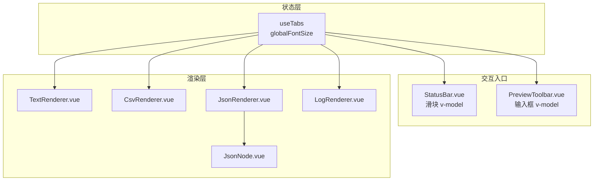
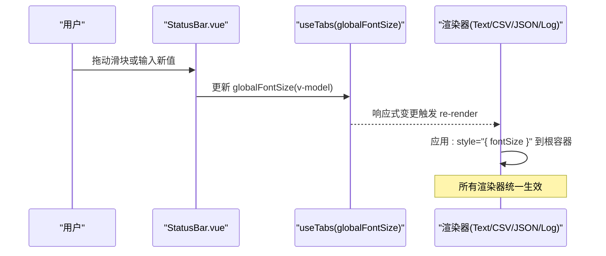
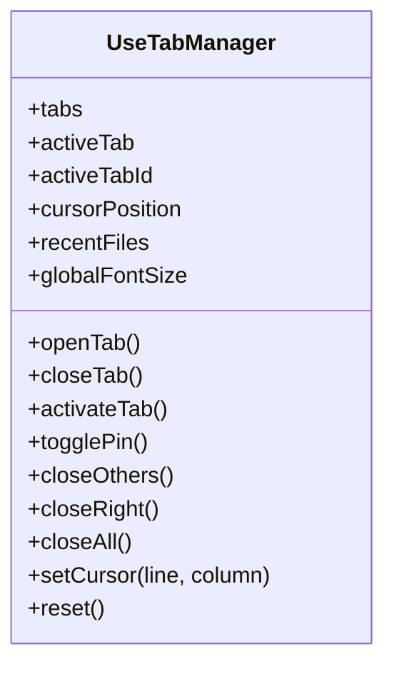
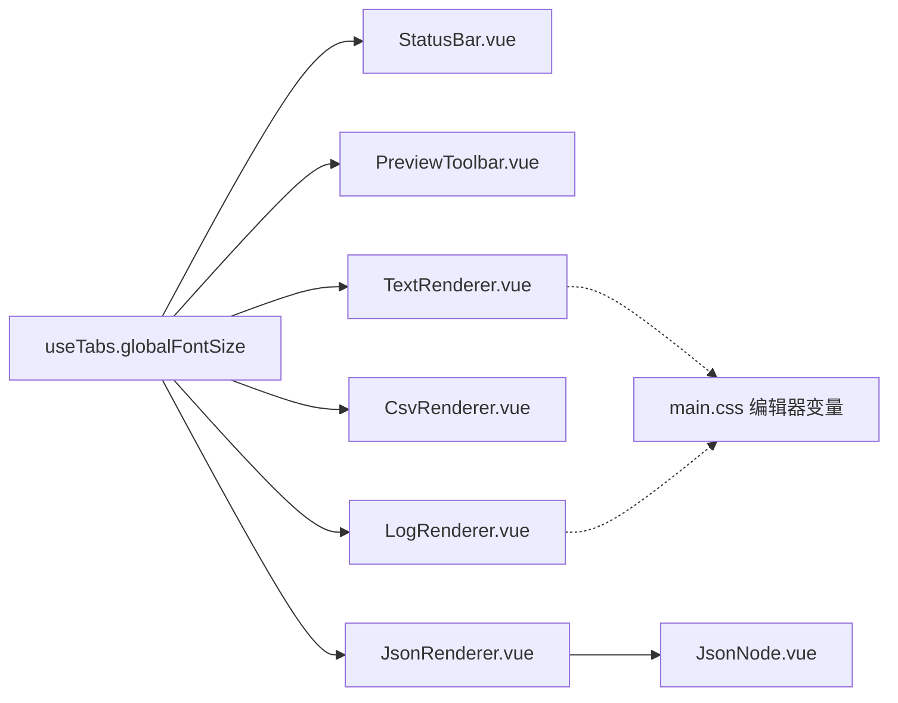

# 渲染器字体大小集成

<cite>
**本文引用的文件**   
- [src/main.ts](file://src/main.ts)
- [src/App.vue](file://src/App.vue)
- [src/styles/theme.ts](file://src/styles/theme.ts)
- [src/styles/main.css](file://src/styles/main.css)
- [src/composables/use-tabs.ts](file://src/composables/use-tabs.ts)
- [src/components/workspace/StatusBar.vue](file://src/components/workspace/StatusBar.vue)
- [src/components/workspace/PreviewToolbar.vue](file://src/components/workspace/PreviewToolbar.vue)
- [src/views/renderers/index.ts](file://src/views/renderers/index.ts)
- [src/views/renderers/TextRenderer.vue](file://src/views/renderers/TextRenderer.vue)
- [src/views/renderers/CsvRenderer.vue](file://src/views/renderers/CsvRenderer.vue)
- [src/views/renderers/JsonRenderer.vue](file://src/views/renderers/JsonRenderer.vue)
- [src/views/renderers/LogRenderer.vue](file://src/views/renderers/LogRenderer.vue)
- [src/views/renderers/JsonNode.vue](file://src/views/renderers/JsonNode.vue)
</cite>

## 目录
1. [简介](#简介)
2. [项目结构](#项目结构)
3. [核心组件](#核心组件)
4. [架构总览](#架构总览)
5. [详细组件分析](#详细组件分析)
6. [依赖关系分析](#依赖关系分析)
7. [性能考量](#性能考量)
8. [故障排查指南](#故障排查指南)
9. [结论](#结论)
10. [附录](#附录)

## 简介
本文件聚焦于“渲染器字体大小集成”的实现与使用，说明全局字号如何从状态源下发到各渲染器（文本、CSV、JSON、日志），以及用户交互入口（状态栏滑块与预览工具栏）如何联动更新。文档同时提供架构图、时序图与流程图，帮助读者快速理解数据流与控制流。

## 项目结构
围绕字体大小集成的关键路径如下：
- 状态源：标签管理 composable 暴露全局字号 ref
- 交互入口：状态栏滑块与预览工具栏双向绑定该 ref
- 消费方：各渲染器通过注入的全局字号动态设置样式
- 主题与基础样式：定义编辑器相关 CSS 变量与默认字体族

图示来源
- [src/composables/use-tabs.ts:12-13](file://src/composables/use-tabs.ts#L12-L13)
- [src/components/workspace/StatusBar.vue:36-47](file://src/components/workspace/StatusBar.vue#L36-L47)
- [src/components/workspace/PreviewToolbar.vue:8-10](file://src/components/workspace/PreviewToolbar.vue#L8-L10)
- [src/views/renderers/TextRenderer.vue:6-21](file://src/views/renderers/TextRenderer.vue#L6-L21)
- [src/views/renderers/CsvRenderer.vue:6-15](file://src/views/renderers/CsvRenderer.vue#L6-L15)
- [src/views/renderers/JsonRenderer.vue:7-16](file://src/views/renderers/JsonRenderer.vue#L7-L16)
- [src/views/renderers/LogRenderer.vue:7-24](file://src/views/renderers/LogRenderer.vue#L7-L24)
- [src/views/renderers/JsonNode.vue:1-89](file://src/views/renderers/JsonNode.vue#L1-L89)

章节来源
- [src/main.ts:1-23](file://src/main.ts#L1-L23)
- [src/App.vue:1-24](file://src/App.vue#L1-L24)
- [src/styles/theme.ts:21-32](file://src/styles/theme.ts#L21-L32)
- [src/styles/main.css:31-46](file://src/styles/main.css#L31-L46)

## 核心组件
- 全局字号状态源
  - 位置：标签管理 composable
  - 职责：维护全局字号 ref，并提供重置能力；供状态栏与工具栏写入，供渲染器读取
  - 关键点：默认值、范围约束由 UI 控制，composable 仅持有单一数值
- 交互入口
  - 状态栏滑块：双向绑定 globalFontSize，实时显示当前像素值
  - 预览工具栏输入框：同样双向绑定，用于精细化调整
- 渲染器
  - 文本、CSV、JSON、日志渲染器均通过注入的 globalFontSize 动态设置容器 fontSize
  - JSON 子节点继承父级字号，无需额外处理

章节来源
- [src/composables/use-tabs.ts:12-13](file://src/composables/use-tabs.ts#L12-L13)
- [src/components/workspace/StatusBar.vue:36-47](file://src/components/workspace/StatusBar.vue#L36-L47)
- [src/components/workspace/PreviewToolbar.vue:8-10](file://src/components/workspace/PreviewToolbar.vue#L8-L10)
- [src/views/renderers/TextRenderer.vue:6-21](file://src/views/renderers/TextRenderer.vue#L6-L21)
- [src/views/renderers/CsvRenderer.vue:6-15](file://src/views/renderers/CsvRenderer.vue#L6-L15)
- [src/views/renderers/JsonRenderer.vue:7-16](file://src/views/renderers/JsonRenderer.vue#L7-L16)
- [src/views/renderers/LogRenderer.vue:7-24](file://src/views/renderers/LogRenderer.vue#L7-L24)

## 架构总览
下图展示“用户操作 → 状态更新 → 渲染器响应”的完整链路。

图示来源
- [src/components/workspace/StatusBar.vue:36-47](file://src/components/workspace/StatusBar.vue#L36-L47)
- [src/composables/use-tabs.ts:12-13](file://src/composables/use-tabs.ts#L12-L13)
- [src/views/renderers/TextRenderer.vue:21](file://src/views/renderers/TextRenderer.vue#L21)
- [src/views/renderers/CsvRenderer.vue:15](file://src/views/renderers/CsvRenderer.vue#L15)
- [src/views/renderers/JsonRenderer.vue:16](file://src/views/renderers/JsonRenderer.vue#L16)
- [src/views/renderers/LogRenderer.vue:24](file://src/views/renderers/LogRenderer.vue#L24)

## 详细组件分析

### 全局字号状态源：useTabManager
- 暴露字段与方法
  - globalFontSize：ref<number>，默认 14
  - reset()：将 globalFontSize 重置为 14（测试友好）
- 设计要点
  - 模块级单例，跨组件共享
  - 不限制取值范围，边界校验交由 UI 控件完成
  - 与光标位置等其它标签状态同域，便于扩展

图示来源
- [src/composables/use-tabs.ts:25-160](file://src/composables/use-tabs.ts#L25-L160)

章节来源
- [src/composables/use-tabs.ts:12-13](file://src/composables/use-tabs.ts#L12-L13)
- [src/composables/use-tabs.ts:149-157](file://src/composables/use-tabs.ts#L149-L157)

### 交互入口：状态栏滑块
- 功能
  - 以 range 输入框双向绑定 globalFontSize
  - 范围 10~24，实时显示当前 px 值
- 影响面
  - 修改后所有订阅该 ref 的渲染器即时响应

章节来源
- [src/components/workspace/StatusBar.vue:36-47](file://src/components/workspace/StatusBar.vue#L36-L47)

### 交互入口：预览工具栏
- 功能
  - 以数字输入框双向绑定 fontSize（模型名与 useTabManager 一致）
  - 支持换行、行号、编码等附加选项（与字号无关）
- 注意
  - 若两处同时存在且绑定同一 ref，需确保二者指向同一实例，避免重复赋值导致闪烁

章节来源
- [src/components/workspace/PreviewToolbar.vue:8-10](file://src/components/workspace/PreviewToolbar.vue#L8-L10)

### 渲染器：文本渲染器 TextRenderer
- 行为
  - 通过注入的 globalFontSize 设置根容器 fontSize
  - 保留等宽字体族与行号列计算逻辑
- 样式
  - 使用 CSS 变量控制背景与文字色，保证主题一致性

章节来源
- [src/views/renderers/TextRenderer.vue:6-21](file://src/views/renderers/TextRenderer.vue#L6-L21)
- [src/views/renderers/TextRenderer.vue:29-49](file://src/views/renderers/TextRenderer.vue#L29-L49)

### 渲染器：CSV 渲染器 CsvRenderer
- 行为
  - 通过注入的 globalFontSize 设置表格容器 fontSize
  - 表头固定定位，滚动体验良好
- 样式
  - 等宽字体族，深色背景，边框清晰

章节来源
- [src/views/renderers/CsvRenderer.vue:6-15](file://src/views/renderers/CsvRenderer.vue#L6-L15)
- [src/views/renderers/CsvRenderer.vue:31-52](file://src/views/renderers/CsvRenderer.vue#L31-L52)

### 渲染器：JSON 渲染器 JsonRenderer 与 JsonNode
- 行为
  - 根容器 fontSize 由 globalFontSize 驱动
  - JsonNode 递归渲染，自动继承父级字号
- 样式
  - 键、字符串、数字、布尔、null 分别着色，便于阅读

章节来源
- [src/views/renderers/JsonRenderer.vue:7-16](file://src/views/renderers/JsonRenderer.vue#L7-L16)
- [src/views/renderers/JsonNode.vue:1-89](file://src/views/renderers/JsonNode.vue#L1-L89)

### 渲染器：日志渲染器 LogRenderer
- 行为
  - 通过注入的 globalFontSize 设置容器 fontSize
  - 按级别着色，点击行可更新光标位置
- 样式
  - 等宽字体族，行内 flex 布局，列对齐清晰

章节来源
- [src/views/renderers/LogRenderer.vue:7-24](file://src/views/renderers/LogRenderer.vue#L7-L24)
- [src/views/renderers/LogRenderer.vue:36-62](file://src/views/renderers/LogRenderer.vue#L36-L62)

### 主题与基础样式
- 主题覆盖
  - Naive UI 全局主题中定义通用字体族与圆角等令牌
- 编辑器变量
  - main.css 定义 --color-editor-* 系列变量，供文本/日志渲染器复用

章节来源
- [src/styles/theme.ts:21-32](file://src/styles/theme.ts#L21-L32)
- [src/styles/main.css:31-46](file://src/styles/main.css#L31-L46)

## 依赖关系分析
- 组件依赖
  - StatusBar.vue 与 PreviewToolbar.vue 依赖 useTabManager 的 globalFontSize
  - 各渲染器依赖 useTabManager 的 globalFontSize
  - JsonRenderer 依赖 JsonNode
- 样式依赖
  - 渲染器样式依赖 main.css 中的编辑器变量
  - 主题覆盖来自 theme.ts

图示来源
- [src/composables/use-tabs.ts:12-13](file://src/composables/use-tabs.ts#L12-L13)
- [src/components/workspace/StatusBar.vue:36-47](file://src/components/workspace/StatusBar.vue#L36-L47)
- [src/components/workspace/PreviewToolbar.vue:8-10](file://src/components/workspace/PreviewToolbar.vue#L8-L10)
- [src/views/renderers/TextRenderer.vue:6-21](file://src/views/renderers/TextRenderer.vue#L6-L21)
- [src/views/renderers/CsvRenderer.vue:6-15](file://src/views/renderers/CsvRenderer.vue#L6-L15)
- [src/views/renderers/JsonRenderer.vue:7-16](file://src/views/renderers/JsonRenderer.vue#L7-L16)
- [src/views/renderers/LogRenderer.vue:7-24](file://src/views/renderers/LogRenderer.vue#L7-L24)
- [src/views/renderers/JsonNode.vue:1-89](file://src/views/renderers/JsonNode.vue#L1-L89)
- [src/styles/main.css:31-46](file://src/styles/main.css#L31-L46)

## 性能考量
- 响应式粒度
  - globalFontSize 为单一数值 ref，变更影响面可控，重渲染开销小
- 渲染器优化建议
  - 对超大 CSV/JSON 列表，考虑虚拟滚动或分页加载
  - 日志渲染器可按窗口化策略渲染可见区域
- 样式合并
  - 使用 :style 直接设置 fontSize 是轻量方案；如需更复杂主题切换，可考虑 CSS 变量在根节点切换

[本节为通用指导，不涉及具体文件分析]

## 故障排查指南
- 现象：调整字号后部分渲染器未变化
  - 检查对应渲染器是否已注入 globalFontSize 并在根容器上应用
  - 确认模板中是否正确绑定 :style="{ fontSize: `${globalFontSize}px` }"
- 现象：滑块与工具栏不同步
  - 确认两者绑定的是同一 ref 实例，避免重复创建或使用不同命名
- 现象：字号超出预期范围
  - 检查滑块与输入框的 min/max 配置，确保与业务期望一致
- 现象：主题切换后编辑器颜色异常
  - 确认 main.css 中编辑器变量是否被正确覆盖，且组件使用了这些变量

章节来源
- [src/components/workspace/StatusBar.vue:36-47](file://src/components/workspace/StatusBar.vue#L36-L47)
- [src/components/workspace/PreviewToolbar.vue:8-10](file://src/components/workspace/PreviewToolbar.vue#L8-L10)
- [src/views/renderers/TextRenderer.vue:21](file://src/views/renderers/TextRenderer.vue#L21)
- [src/views/renderers/CsvRenderer.vue:15](file://src/views/renderers/CsvRenderer.vue#L15)
- [src/views/renderers/JsonRenderer.vue:16](file://src/views/renderers/JsonRenderer.vue#L16)
- [src/views/renderers/LogRenderer.vue:24](file://src/views/renderers/LogRenderer.vue#L24)
- [src/styles/main.css:31-46](file://src/styles/main.css#L31-L46)

## 结论
本项目采用“单一状态源 + 多渲染器消费”的模式实现全局字号集成。状态栏与工具栏作为唯二写入端，渲染器作为只读消费者，结构简单、耦合度低、扩展性强。配合主题与编辑器变量，可在不同主题下保持一致的视觉体验。

[本节为总结性内容，不涉及具体文件分析]

## 附录
- 入口与初始化
  - 应用启动时挂载 Pinia 并初始化缓存，随后恢复归档列表；字号状态独立于缓存流程
- 导出索引
  - 渲染器统一从 index.ts 导出，便于上层按需引入

章节来源
- [src/main.ts:8-22](file://src/main.ts#L8-L22)
- [src/views/renderers/index.ts:1-5](file://src/views/renderers/index.ts#L1-L5)