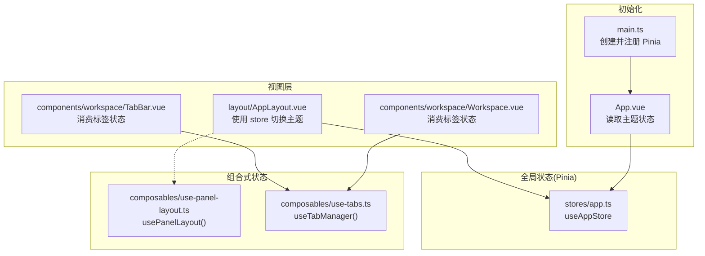
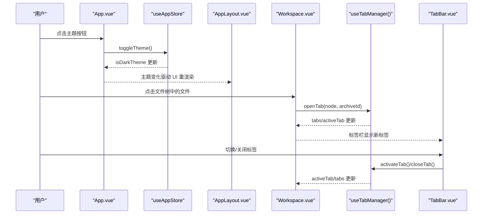
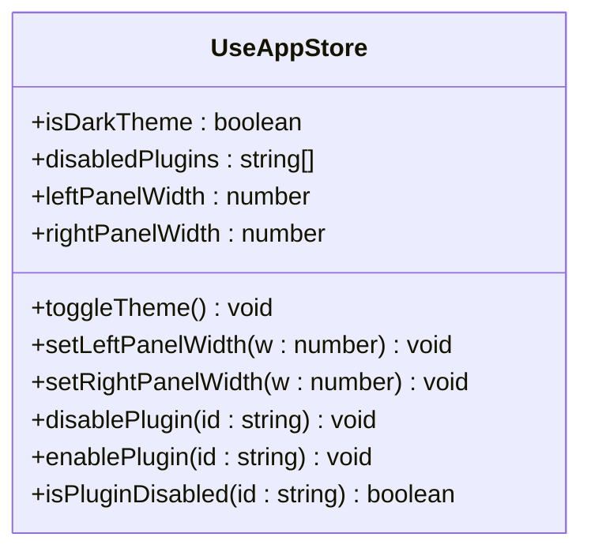
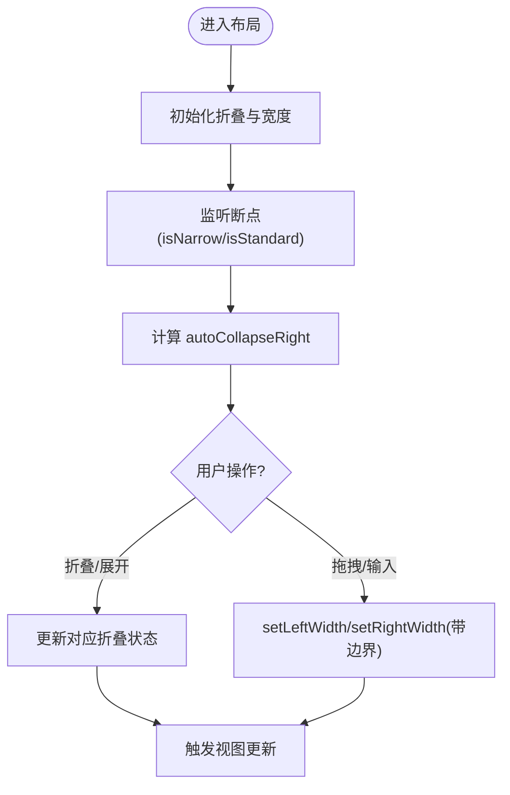
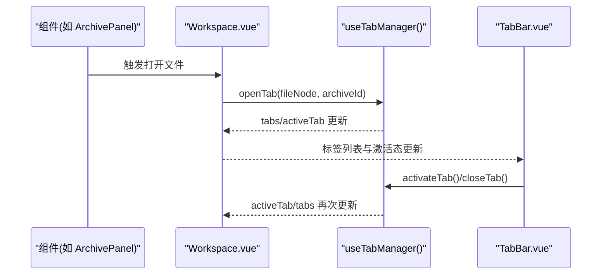
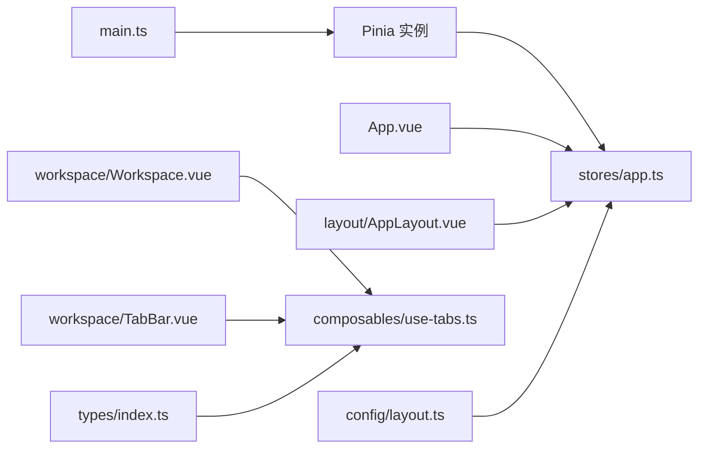

# 状态管理

<cite>
**本文引用的文件**
- [src/stores/app.ts](file://src/stores/app.ts)
- [src/composables/use-panel-layout.ts](file://src/composables/use-panel-layout.ts)
- [src/composables/use-tabs.ts](file://src/composables/use-tabs.ts)
- [src/types/index.ts](file://src/types/index.ts)
- [src/config/layout.ts](file://src/config/layout.ts)
- [src/main.ts](file://src/main.ts)
- [src/App.vue](file://src/App.vue)
- [src/layout/AppLayout.vue](file://src/layout/AppLayout.vue)
- [src/components/workspace/TabBar.vue](file://src/components/workspace/TabBar.vue)
- [src/components/workspace/Workspace.vue](file://src/components/workspace/Workspace.vue)
- [src/__tests__\stores\app.test.ts](file://src/__tests__/stores/app.test.ts)
- [src/__tests__\composables\use-tabs.test.ts](file://src/__tests__/composables/use-tabs.test.ts)
</cite>

## 目录
1. [简介](#简介)
2. [项目结构](#项目结构)
3. [核心组件](#核心组件)
4. [架构总览](#架构总览)
5. [详细组件分析](#详细组件分析)
6. [依赖关系分析](#依赖关系分析)
7. [性能考虑](#性能考虑)
8. [故障排查指南](#故障排查指南)
9. [结论](#结论)
10. [附录](#附录)

## 简介
本文件聚焦 Hello-Tauri 的状态管理系统，围绕基于 Pinia 的全局应用状态、面板布局状态与标签页状态进行系统化说明。文档涵盖 useAppStore 的状态定义、getter 方法与 action 实现；组合式函数 use-panel-layout 与 use-tabs 的状态同步机制和数据流；并提供状态持久化方案、调试技巧、性能优化建议以及状态迁移与版本兼容性说明。

## 项目结构
本项目采用“全局 Store + 组合式函数”的混合状态管理模式：
- 全局应用级状态（主题、面板宽度、插件禁用列表）通过 Pinia store 管理。
- 面板折叠与尺寸等布局状态由组合式函数维护，便于在组件内局部复用。
- 标签页状态由组合式函数集中管理，供工作区与标签栏共享。

图表来源
- [src/main.ts:1-7](file://src/main.ts#L1-L7)
- [src/App.vue:1-23](file://src/App.vue#L1-L23)
- [src/stores/app.ts:1-57](file://src/stores/app.ts#L1-L57)
- [src/composables/use-panel-layout.ts:1-38](file://src/composables/use-panel-layout.ts#L1-L38)
- [src/composables/use-tabs.ts:1-64](file://src/composables/use-tabs.ts#L1-L64)
- [src/layout/AppLayout.vue:1-126](file://src/layout/AppLayout.vue#L1-L126)
- [src/components/workspace/Workspace.vue:1-36](file://src/components/workspace/Workspace.vue#L1-L36)
- [src/components/workspace/TabBar.vue:1-32](file://src/components/workspace/TabBar.vue#L1-L32)

章节来源
- [src/main.ts:1-7](file://src/main.ts#L1-L7)
- [src/App.vue:1-23](file://src/App.vue#L1-L23)
- [src/stores/app.ts:1-57](file://src/stores/app.ts#L1-L57)
- [src/composables/use-panel-layout.ts:1-38](file://src/composables/use-panel-layout.ts#L1-L38)
- [src/composables/use-tabs.ts:1-64](file://src/composables/use-tabs.ts#L1-L64)
- [src/layout/AppLayout.vue:1-126](file://src/layout/AppLayout.vue#L1-L126)
- [src/components/workspace/Workspace.vue:1-36](file://src/components/workspace/Workspace.vue#L1-L36)
- [src/components/workspace/TabBar.vue:1-32](file://src/components/workspace/TabBar.vue#L1-L32)

## 核心组件
本节深入解析三大状态模块：全局应用状态（Pinia）、面板布局状态（组合式）、标签页状态（组合式）。

### 全局应用状态：useAppStore
- 职责
  - 管理全局主题开关、左右面板宽度、插件禁用列表。
  - 提供安全的 setter 以限制面板宽度范围。
  - 提供插件启用/禁用与查询能力。
- 状态字段
  - isDarkTheme：布尔值，控制深色/浅色主题。
  - disabledPlugins：字符串数组，记录被禁用的插件 ID。
  - leftPanelWidth/rightPanelWidth：数字，受配置常量约束的最小/最大值。
- Getter 方法
  - 当前实现未显式暴露 getter，但可通过 computed 派生所需逻辑（例如根据主题选择 UI 主题对象）。
- Action 方法
  - toggleTheme：切换主题。
  - setLeftPanelWidth/setRightPanelWidth：设置面板宽度并进行边界裁剪。
  - disablePlugin/enablePlugin/isPluginDisabled：管理插件禁用集合。
- 数据来源
  - 面板宽度的默认值与边界来自配置模块。

章节来源
- [src/stores/app.ts:1-57](file://src/stores/app.ts#L1-L57)
- [src/config/layout.ts:1-9](file://src/config/layout.ts#L1-L9)

### 面板布局状态：use-panel-layout
- 职责
  - 管理左右面板的折叠状态与宽度，结合断点自动决策右侧面板是否收起。
- 状态字段
  - leftCollapsed/rightCollapsed：布尔值，表示左右面板是否折叠。
  - leftWidth/rightWidth：数字，表示左右面板宽度，内部做边界裁剪。
  - isNarrow/isStandard/autoCollapseRight：响应式断点与计算属性，用于自适应布局。
- 行为方法
  - collapseLeft/expandLeft/collapseRight/expandRight：切换折叠。
  - setLeftWidth/setRightWidth：设置宽度并限制范围。
- 数据流
  - 该组合式函数返回的是本地 ref 与 computed，适合在单个组件或父组件中持有实例，避免跨组件强耦合。

章节来源
- [src/composables/use-panel-layout.ts:1-38](file://src/composables/use-panel-layout.ts#L1-L38)

### 标签页状态：use-tabs
- 职责
  - 管理标签列表、激活态标签、打开/关闭/置顶/重置等操作。
- 状态字段
  - tabs：标签项数组，每项包含唯一 id、关联的文件节点、所属归档 ID、是否置顶、可选内容。
  - activeTabId：当前激活标签的 id。
  - nextTabId：自增生成器，保证 id 唯一。
- 派生状态
  - activeTab：根据 activeTabId 从 tabs 中查找当前激活标签。
- 行为方法
  - openTab：若已存在相同文件节点与归档的组合则直接激活，否则新增标签并激活。
  - closeTab：移除指定标签，必要时将激活态切换到相邻标签。
  - activateTab：切换激活标签。
  - togglePin/closeAll/reset：置顶切换、批量关闭（保留置顶）、重置所有状态。
- 类型契约
  - TabItem 与 FileTreeNode 等类型定义位于类型模块。

章节来源
- [src/composables/use-tabs.ts:1-64](file://src/composables/use-tabs.ts#L1-L64)
- [src/types/index.ts:1-71](file://src/types/index.ts#L1-L71)

## 架构总览
下图展示状态在各层的流转与交互：

图表来源
- [src/App.vue:1-23](file://src/App.vue#L1-L23)
- [src/stores/app.ts:1-57](file://src/stores/app.ts#L1-L57)
- [src/layout/AppLayout.vue:1-126](file://src/layout/AppLayout.vue#L1-L126)
- [src/components/workspace/Workspace.vue:1-36](file://src/components/workspace/Workspace.vue#L1-L36)
- [src/composables/use-tabs.ts:1-64](file://src/composables/use-tabs.ts#L1-L64)
- [src/components/workspace/TabBar.vue:1-32](file://src/components/workspace/TabBar.vue#L1-L32)

## 详细组件分析

### useAppStore 详解
- 设计要点
  - 使用 defineStore 的组合式 API，状态与方法清晰分离。
  - 面板宽度 setter 内置边界校验，防止非法尺寸。
  - 插件禁用列表使用不可变更新策略，确保响应式追踪稳定。
- 典型用法
  - 在根组件 App.vue 中根据 isDarkTheme 选择 Naive UI 的主题对象。
  - 在布局组件中调用 setLeftPanelWidth/setRightPanelWidth 调整面板尺寸。
- 测试覆盖
  - 主题切换、面板宽度裁剪、插件禁用/启用逻辑均有单元测试验证。

图表来源
- [src/stores/app.ts:1-57](file://src/stores/app.ts#L1-L57)

章节来源
- [src/stores/app.ts:1-57](file://src/stores/app.ts#L1-L57)
- [src/App.vue:1-23](file://src/App.vue#L1-L23)
- [src/__tests__/stores/app.test.ts:1-55](file://src/__tests__/stores/app.test.ts#L1-L55)

### use-panel-layout 详解
- 设计要点
  - 使用 @vueuse/core 的 useBreakpoints 监听窗口断点，自动推导 autoCollapseRight。
  - 提供折叠/展开与宽度设置方法，并在内部做最小/最大宽度限制。
- 适用场景
  - 在布局容器内创建一次实例，即可为多个子组件共享布局状态。
- 与全局状态的协作
  - 可与 useAppStore 的面板宽度字段配合：组合式负责交互与边界，store 负责持久化与跨会话恢复（见后续“持久化方案”）。

图表来源
- [src/composables/use-panel-layout.ts:1-38](file://src/composables/use-panel-layout.ts#L1-L38)

章节来源
- [src/composables/use-panel-layout.ts:1-38](file://src/composables/use-panel-layout.ts#L1-L38)

### use-tabs 详解
- 设计要点
  - 使用闭包变量 nextTabId 生成唯一 id，避免外部污染。
  - openTab 具备去重逻辑：同一文件节点在同一归档下不会重复打开。
  - closeTab 会智能选择下一个激活标签，保持用户体验连贯。
- 与组件的协作
  - Workspace.vue 通过 activeTab 决定预览工具栏与渲染器类型。
  - TabBar.vue 绑定 NTabs 的 value 与事件，双向同步激活态与关闭动作。

图表来源
- [src/composables/use-tabs.ts:1-64](file://src/composables/use-tabs.ts#L1-L64)
- [src/components/workspace/Workspace.vue:1-36](file://src/components/workspace/Workspace.vue#L1-L36)
- [src/components/workspace/TabBar.vue:1-32](file://src/components/workspace/TabBar.vue#L1-L32)

章节来源
- [src/composables/use-tabs.ts:1-64](file://src/composables/use-tabs.ts#L1-L64)
- [src/components/workspace/Workspace.vue:1-36](file://src/components/workspace/Workspace.vue#L1-L36)
- [src/components/workspace/TabBar.vue:1-32](file://src/components/workspace/TabBar.vue#L1-L32)
- [src/__tests__/composables/use-tabs.test.ts:1-76](file://src/__tests__/composables/use-tabs.test.ts#L1-L76)

## 依赖关系分析
- 初始化依赖
  - main.ts 创建并安装 Pinia，使 useAppStore 可用。
- 视图依赖
  - App.vue 依赖 useAppStore 的 isDarkTheme 选择主题。
  - AppLayout.vue 依赖 useAppStore 的宽度与主题能力。
  - Workspace.vue 与 TabBar.vue 依赖 use-tab-manager 提供的标签状态。
- 类型与配置
  - types/index.ts 定义 TabItem、FileTreeNode 等关键类型。
  - config/layout.ts 提供面板宽度的默认值与边界常量。

图表来源
- [src/main.ts:1-7](file://src/main.ts#L1-L7)
- [src/stores/app.ts:1-57](file://src/stores/app.ts#L1-L57)
- [src/App.vue:1-23](file://src/App.vue#L1-L23)
- [src/layout/AppLayout.vue:1-126](file://src/layout/AppLayout.vue#L1-L126)
- [src/components/workspace/Workspace.vue:1-36](file://src/components/workspace/Workspace.vue#L1-L36)
- [src/components/workspace/TabBar.vue:1-32](file://src/components/workspace/TabBar.vue#L1-L32)
- [src/composables/use-tabs.ts:1-64](file://src/composables/use-tabs.ts#L1-L64)
- [src/types/index.ts:1-71](file://src/types/index.ts#L1-L71)
- [src/config/layout.ts:1-9](file://src/config/layout.ts#L1-L9)

章节来源
- [src/main.ts:1-7](file://src/main.ts#L1-L7)
- [src/stores/app.ts:1-57](file://src/stores/app.ts#L1-L57)
- [src/App.vue:1-23](file://src/App.vue#L1-L23)
- [src/layout/AppLayout.vue:1-126](file://src/layout/AppLayout.vue#L1-L126)
- [src/components/workspace/Workspace.vue:1-36](file://src/components/workspace/Workspace.vue#L1-L36)
- [src/components/workspace/TabBar.vue:1-32](file://src/components/workspace/TabBar.vue#L1-L32)
- [src/composables/use-tabs.ts:1-64](file://src/composables/use-tabs.ts#L1-L64)
- [src/types/index.ts:1-71](file://src/types/index.ts#L1-L71)
- [src/config/layout.ts:1-9](file://src/config/layout.ts#L1-L9)

## 性能考虑
- 减少不必要的重渲染
  - 在 useAppStore 中仅暴露必要的状态与方法，避免将大型对象作为响应式引用传递。
  - 对面板宽度等高频变更，建议在组合式内部做节流或防抖后再写入 store（如需持久化）。
- 合理使用 computed
  - 在 App.vue 中通过 computed 选择主题对象，避免在模板中进行复杂判断。
- 标签页去重与惰性加载
  - openTab 的去重逻辑可避免重复渲染与内存增长。
  - 对于大文件预览，可在激活标签时再加载内容，降低首屏开销。
- 断点监听
  - use-panel-layout 使用 @vueuse/core 的断点监听，注意在移动端频繁切换时的性能影响，必要时合并断点或降低监听频率。

[本节为通用指导，不直接分析具体文件]

## 故障排查指南
- 主题不生效
  - 检查 main.ts 是否正确安装 Pinia。
  - 确认 App.vue 中根据 isDarkTheme 选择的主题对象是否正确传入 NConfigProvider。
- 面板宽度异常
  - 检查 setLeftPanelWidth/setRightPanelWidth 的边界参数是否与 config/layout.ts 一致。
  - 若出现越界，查看是否有外部代码绕过 setter 直接赋值。
- 标签重复或无法关闭
  - 确认 openTab 的去重条件（文件节点 key 与归档 id）是否符合预期。
  - 检查 closeTab 的索引计算与 activeTabId 回退逻辑。
- 测试失败
  - 针对 useAppStore 与 use-tab-manager 的单元测试覆盖了主要路径，若失败请对照用例定位问题。

章节来源
- [src/main.ts:1-7](file://src/main.ts#L1-L7)
- [src/App.vue:1-23](file://src/App.vue#L1-L23)
- [src/stores/app.ts:1-57](file://src/stores/app.ts#L1-L57)
- [src/config/layout.ts:1-9](file://src/config/layout.ts#L1-L9)
- [src/composables/use-tabs.ts:1-64](file://src/composables/use-tabs.ts#L1-L64)
- [src/__tests__/stores/app.test.ts:1-55](file://src/__tests__/stores/app.test.ts#L1-L55)
- [src/__tests__/composables/use-tabs.test.ts:1-76](file://src/__tests__/composables/use-tabs.test.ts#L1-L76)

## 结论
本项目采用“Pinia 全局状态 + 组合式局部状态”的分层模式，兼顾了全局一致性（主题、面板宽度、插件开关）与局部灵活性（布局折叠、标签页管理）。通过明确的类型契约与单元测试，保证了状态的可维护性与可靠性。后续可在持久化、缓存与懒加载方面进一步增强体验与性能。

[本节为总结性内容，不直接分析具体文件]

## 附录

### 状态持久化方案（建议）
- 目标
  - 将 isDarkTheme、disabledPlugins、leftPanelWidth、rightPanelWidth 持久化到浏览器存储，提升用户跨会话体验。
- 推荐实现思路
  - 在 useAppStore 初始化时从 localStorage 读取上次保存的值，覆盖默认值。
  - 在每次状态变更后，异步写入 localStorage，并对大数组（如 disabledPlugins）进行序列化与错误保护。
  - 对面板宽度等高频变更，增加节流写入策略，避免频繁 I/O。
- 注意事项
  - 存储键名需命名规范且版本化，便于未来迁移。
  - 处理反序列化失败与兼容旧格式的逻辑。

[本节为概念性建议，不直接分析具体文件]

### 状态调试技巧
- Vue DevTools
  - 使用 Pinia 插件面板查看 useAppStore 的状态与方法调用。
- 日志输出
  - 在关键 action（如 setLeftPanelWidth、openTab）中添加条件日志，便于定位问题。
- 单元测试
  - 利用现有测试用例快速验证状态变更的正确性与边界情况。

[本节为通用指导，不直接分析具体文件]

### 状态迁移指南与版本兼容性
- 迁移原则
  - 向后兼容：新增字段需提供默认值，避免破坏已有页面。
  - 渐进升级：优先支持旧格式，逐步淘汰废弃字段。
- 迁移步骤
  - 在持久化层引入版本号，启动时检测并执行迁移脚本。
  - 对面板宽度与插件禁用列表等易变数据，提供降级策略（如回退到默认值）。
- 兼容性说明
  - 若未来扩展 useAppStore 的字段，需在 getter/action 中兼容旧数据结构。
  - 对 use-tab-manager 的 TabItem 结构演进，应保证 openTab 与 closeTab 的健壮性。

[本节为通用指导，不直接分析具体文件]