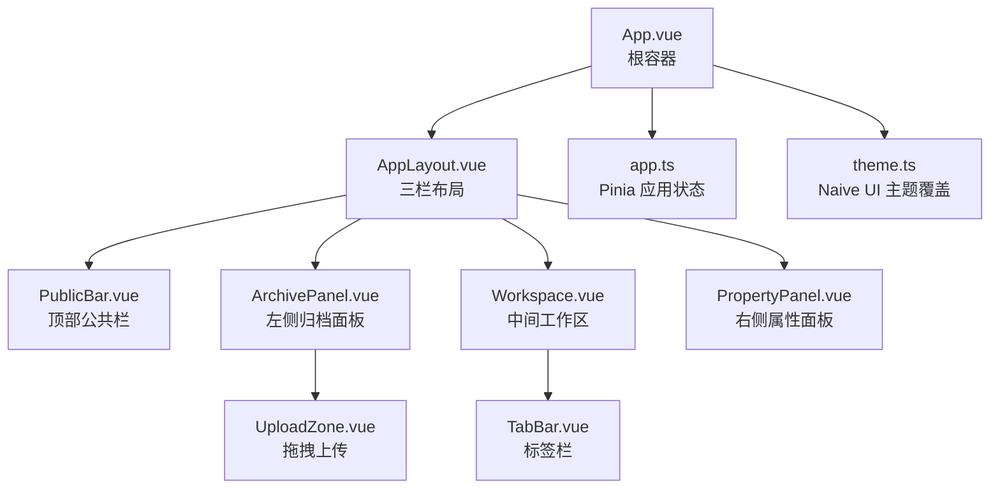
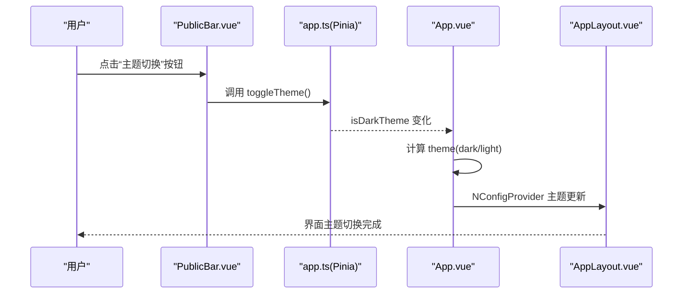
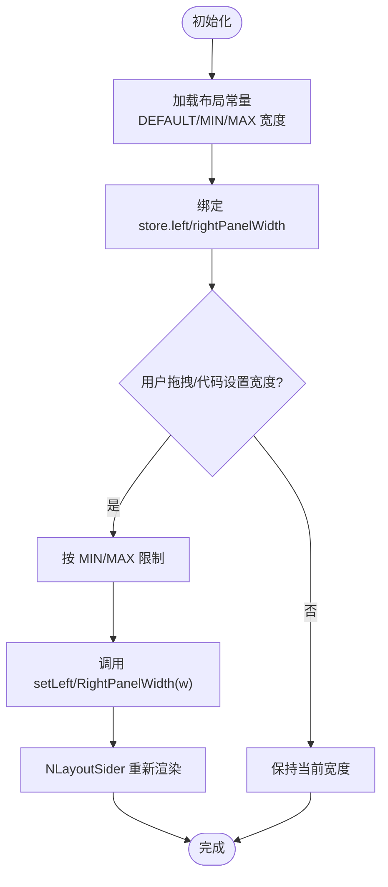
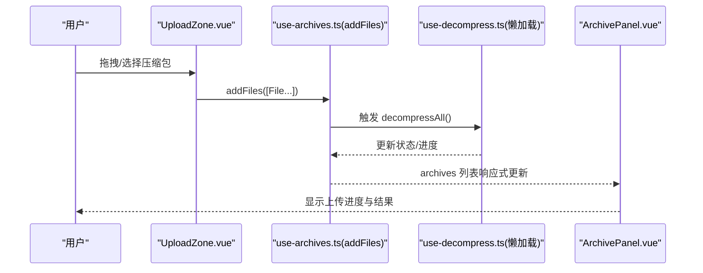
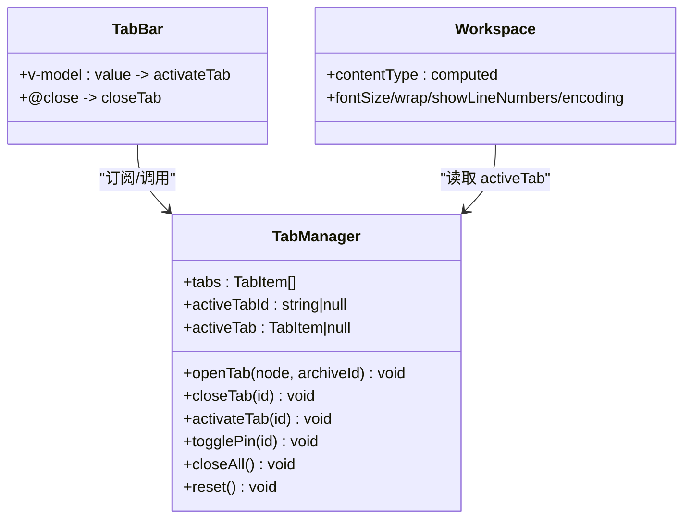
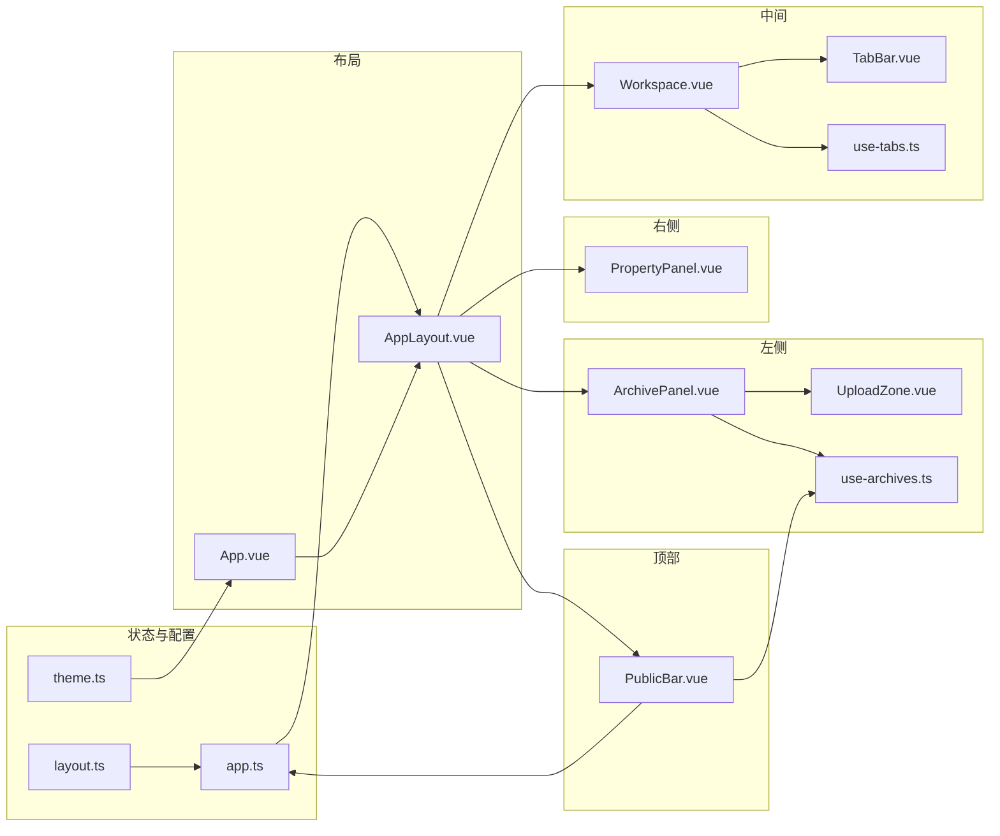

# 用户界面

<cite>
**本文引用的文件**   
- [README.md](file://README.md)
- [App.vue](file://src/App.vue)
- [AppLayout.vue](file://src/layout/AppLayout.vue)
- [app.ts](file://src/stores/app.ts)
- [theme.ts](file://src/styles/theme.ts)
- [index.ts](file://src/config/index.ts)
- [layout.ts](file://src/config/layout.ts)
- [ArchivePanel.vue](file://src/components/archive-panel/ArchivePanel.vue)
- [UploadZone.vue](file://src/components/archive-panel/UploadZone.vue)
- [Workspace.vue](file://src/components/workspace/Workspace.vue)
- [TabBar.vue](file://src/components/workspace/TabBar.vue)
- [PropertyPanel.vue](file://src/components/property-panel/PropertyPanel.vue)
- [PublicBar.vue](file://src/components/public-bar/PublicBar.vue)
- [use-archives.ts](file://src/composables/use-archives.ts)
- [use-tabs.ts](file://src/composables/use-tabs.ts)
</cite>

## 目录
1. [简介](#简介)
2. [项目结构](#项目结构)
3. [核心组件](#核心组件)
4. [架构总览](#架构总览)
5. [详细组件分析](#详细组件分析)
6. [依赖关系分析](#依赖关系分析)
7. [性能考虑](#性能考虑)
8. [故障排查指南](#故障排查指南)
9. [结论](#结论)
10. [附录](#附录)

## 简介
本文件面向 Hello-Tauri 的用户界面系统，聚焦三栏式布局与主题、状态同步机制，并系统性梳理以下核心组件：
- ArchivePanel：压缩包上传与列表管理
- Workspace：多标签页预览区（含工具栏与状态栏）
- PropertyPanel：属性编辑与元数据展示
- PublicBar：全局统计、搜索与批量操作入口

文档同时覆盖组件使用示例、属性配置、事件处理、插槽用法、组件间通信与数据流向、Pinia 集成方式、样式定制与主题覆盖、自定义主题开发建议、性能优化与可访问性支持。

## 项目结构
界面层采用“顶部公共栏 + 左中右三栏”的布局模式：
- 顶部：PublicBar（全局统计、搜索、批量操作、主题切换）
- 左侧：ArchivePanel（上传区 + 压缩包卡片列表）
- 中间：Workspace（标签栏 + 预览工具栏 + 预览面板 + 状态栏）
- 右侧：PropertyPanel（元数据视图 + 配置表单 + 路径面包屑）

图示来源
- [App.vue:1-24](file://src/App.vue#L1-L24)
- [AppLayout.vue:1-54](file://src/layout/AppLayout.vue#L1-L54)
- [PublicBar.vue:1-38](file://src/components/public-bar/PublicBar.vue#L1-L38)
- [ArchivePanel.vue:1-24](file://src/components/archive-panel/ArchivePanel.vue#L1-L24)
- [UploadZone.vue:1-29](file://src/components/archive-panel/UploadZone.vue#L1-L29)
- [Workspace.vue:1-36](file://src/components/workspace/Workspace.vue#L1-L36)
- [TabBar.vue:1-33](file://src/components/workspace/TabBar.vue#L1-L33)
- [PropertyPanel.vue:1-15](file://src/components/property-panel/PropertyPanel.vue#L1-L15)
- [app.ts:1-57](file://src/stores/app.ts#L1-L57)
- [theme.ts:1-13](file://src/styles/theme.ts#L1-L13)

章节来源
- [README.md:71-127](file://README.md#L71-L127)
- [AppLayout.vue:1-54](file://src/layout/AppLayout.vue#L1-L54)

## 核心组件
- ArchivePanel
  - 职责：提供压缩包上传入口与已添加压缩包的列表展示；通过组合式函数集中管理归档项状态。
  - 关键能力：拖拽/点击上传、列表滚动、删除单个归档、触发解压流程。
  - 典型交互：上传后自动进入解压管线；列表项支持移除与重试占位。
- Workspace
  - 职责：承载多标签页预览，包含标签栏、预览工具栏、预览面板与底部状态栏。
  - 关键能力：打开/关闭/激活标签、固定标签、根据当前内容类型动态渲染预览工具栏。
  - 典型交互：从左侧文件树选择文件后在中间区域以标签形式预览。
- PropertyPanel
  - 职责：展示选中文件的元数据、解析器配置表单以及路径面包屑导航。
  - 关键能力：只读元数据展示、可编辑配置项、路径层级导航。
- PublicBar
  - 职责：提供全局统计信息、全局搜索、批量操作与主题切换。
  - 关键能力：读取归档总数与大小统计、清空/导出/重新解压等批量动作、切换深色/浅色主题。

章节来源
- [ArchivePanel.vue:1-24](file://src/components/archive-panel/ArchivePanel.vue#L1-L24)
- [UploadZone.vue:1-29](file://src/components/archive-panel/UploadZone.vue#L1-L29)
- [Workspace.vue:1-36](file://src/components/workspace/Workspace.vue#L1-L36)
- [TabBar.vue:1-33](file://src/components/workspace/TabBar.vue#L1-L33)
- [PropertyPanel.vue:1-15](file://src/components/property-panel/PropertyPanel.vue#L1-L15)
- [PublicBar.vue:1-38](file://src/components/public-bar/PublicBar.vue#L1-L38)

## 架构总览
界面遵循“组件 → 组合式函数 → Pinia 状态”的分层组织：
- 组件负责视图与交互
- 组合式函数封装业务逻辑与响应式数据
- Pinia store 提供跨模块共享的状态（主题、面板宽度、插件禁用列表）

图示来源
- [PublicBar.vue:1-38](file://src/components/public-bar/PublicBar.vue#L1-L38)
- [app.ts:1-57](file://src/stores/app.ts#L1-L57)
- [App.vue:1-24](file://src/App.vue#L1-L24)
- [AppLayout.vue:1-54](file://src/layout/AppLayout.vue#L1-L54)

## 详细组件分析

### 三栏布局与响应式调整
- 布局实现
  - 使用 Naive UI 的 NLayout/NLayoutHeader/NLayoutSider/NLayoutContent 构建顶部栏与左右侧边栏。
  - 左右侧栏宽度由 Pinia 的 leftPanelWidth/rightPanelWidth 控制，支持折叠与最小/最大宽度约束。
- 响应式策略
  - 默认宽度与边界值来自 layout.ts 的配置常量。
  - 可通过 setLeftPanelWidth/setRightPanelWidth 方法在运行时调整宽度。
- 状态同步
  - AppLayout 直接绑定 store 中的面板宽度，确保跨组件一致。
  - 主题切换由 App.vue 基于 store.isDarkTheme 计算并注入到 NConfigProvider。

图示来源
- [AppLayout.vue:1-54](file://src/layout/AppLayout.vue#L1-L54)
- [app.ts:1-57](file://src/stores/app.ts#L1-L57)
- [layout.ts:1-9](file://src/config/layout.ts#L1-L9)

章节来源
- [AppLayout.vue:1-54](file://src/layout/AppLayout.vue#L1-L54)
- [app.ts:1-57](file://src/stores/app.ts#L1-L57)
- [layout.ts:1-9](file://src/config/layout.ts#L1-L9)

### ArchivePanel：文件上传与压缩包管理
- 功能特性
  - 拖拽/点击上传多种压缩格式（zip/gz/gzip/tgz/7z/rar/tar）。
  - 上传后自动触发解压流程，并在列表中显示进度与状态。
  - 支持移除单个归档项。
- 数据流
  - UploadZone 将 File 对象交给 useArchiveManager.addFiles。
  - addFiles 创建归档项并触发 use-decompress 进行解压编排。
  - 列表通过 v-for 渲染 ArchiveCard，支持 @remove/@retry 事件。
- 使用示例
  - 在页面中引入 ArchivePanel 即可启用上传与列表展示。
  - 外部可通过 useArchiveManager().addFiles(files) 程序化添加文件。
- 属性与事件
  - 无显式 props；内部通过组合式函数暴露 archives/remove/updateStatus/stats/reset。
  - 事件：@remove(id)、@retry(id)（当前为占位回调）。
- 插槽
  - 未定义具名插槽；如需扩展可在 ArchivePanel 外层包裹自定义头部或脚部。

图示来源
- [UploadZone.vue:1-29](file://src/components/archive-panel/UploadZone.vue#L1-L29)
- [use-archives.ts:1-60](file://src/composables/use-archives.ts#L1-L60)
- [ArchivePanel.vue:1-24](file://src/components/archive-panel/ArchivePanel.vue#L1-L24)

章节来源
- [UploadZone.vue:1-29](file://src/components/archive-panel/UploadZone.vue#L1-L29)
- [use-archives.ts:1-60](file://src/composables/use-archives.ts#L1-L60)
- [ArchivePanel.vue:1-24](file://src/components/archive-panel/ArchivePanel.vue#L1-L24)

### Workspace：多标签页预览
- 功能特性
  - 标签栏支持打开/关闭/激活/固定标签，重复文件不重复打开。
  - 根据当前标签的内容类型动态显示预览工具栏（字体大小、换行、行号、编码）。
  - 底部状态栏用于展示当前文件状态与统计信息。
- 数据流
  - useTabManager 维护 tabs 与 activeTabId，Workspace 通过 computed 获取 activeTab。
  - TabBar 与 Workspace 共享同一组合式实例，保证状态一致。
- 使用示例
  - 在任意位置调用 openTab(node, archiveId) 即可打开新标签。
  - 通过 closeTab/closeAll/togglePin 控制标签生命周期。
- 属性与事件
  - 无显式 props；对外暴露 openTab/closeTab/activateTab/togglePin/closeAll/reset。
  - 事件：NTabs 的 update:value/close 映射到 activateTab/closeTab。
- 插槽
  - 未定义具名插槽；可在 Workspace 外层包裹自定义工具条或辅助面板。

图示来源
- [use-tabs.ts:1-64](file://src/composables/use-tabs.ts#L1-L64)
- [TabBar.vue:1-33](file://src/components/workspace/TabBar.vue#L1-L33)
- [Workspace.vue:1-36](file://src/components/workspace/Workspace.vue#L1-L36)

章节来源
- [use-tabs.ts:1-64](file://src/composables/use-tabs.ts#L1-L64)
- [TabBar.vue:1-33](file://src/components/workspace/TabBar.vue#L1-L33)
- [Workspace.vue:1-36](file://src/components/workspace/Workspace.vue#L1-L36)

### PropertyPanel：属性编辑与元数据展示
- 功能特性
  - 元数据视图：展示当前选中文件的静态信息。
  - 配置表单：针对解析器的可编辑配置项。
  - 路径面包屑：快速定位文件层级。
- 使用示例
  - 直接引入 PropertyPanel 即可在右侧面板展示。
  - 结合选中文件上下文，向子组件传递必要数据（如当前节点、配置项）。
- 属性与事件
  - 组件本身未声明 props；实际使用时建议在父级传入选中节点与配置。
  - 事件：可根据需要向父级 emit 保存/重置等操作。
- 插槽
  - 未定义具名插槽；可按需在外层扩展。

章节来源
- [PropertyPanel.vue:1-15](file://src/components/property-panel/PropertyPanel.vue#L1-L15)

### PublicBar：全局操作
- 功能特性
  - 全局统计：汇总归档数量、大小、文件数等。
  - 全局搜索：跨归档内容检索入口。
  - 批量操作：一键清空、全部导出、批量重新解压。
  - 主题切换：调用 store.toggleTheme 切换深色/浅色。
- 使用示例
  - 作为顶部栏直接嵌入 AppLayout。
  - 通过 NDropdown 扩展更多批量命令。
- 属性与事件
  - 无显式 props；通过 useArchiveManager 与 useAppStore 协作。
  - 事件：NDropdown 的 select 映射到 handleBatch。

章节来源
- [PublicBar.vue:1-38](file://src/components/public-bar/PublicBar.vue#L1-L38)

## 依赖关系分析
- 组件依赖
  - ArchivePanel 依赖 use-archives 与 UploadZone。
  - Workspace 依赖 use-tabs、TabBar、PreviewToolbar、PreviewPane、StatusBar。
  - PropertyPanel 依赖 MetadataView、ConfigForm、PathBreadcrumb。
  - PublicBar 依赖 useArchiveManager 与 useAppStore。
- 状态依赖
  - AppLayout 依赖 app.ts 的面板宽度与主题状态。
  - App.vue 依赖 theme.ts 的主题覆盖与 app.ts 的主题开关。
- 配置依赖
  - app.ts 导入 layout.ts 的默认/最小/最大宽度常量。

图示来源
- [AppLayout.vue:1-54](file://src/layout/AppLayout.vue#L1-L54)
- [App.vue:1-24](file://src/App.vue#L1-L24)
- [app.ts:1-57](file://src/stores/app.ts#L1-L57)
- [layout.ts:1-9](file://src/config/layout.ts#L1-L9)
- [theme.ts:1-13](file://src/styles/theme.ts#L1-L13)
- [ArchivePanel.vue:1-24](file://src/components/archive-panel/ArchivePanel.vue#L1-L24)
- [UploadZone.vue:1-29](file://src/components/archive-panel/UploadZone.vue#L1-L29)
- [use-archives.ts:1-60](file://src/composables/use-archives.ts#L1-L60)
- [Workspace.vue:1-36](file://src/components/workspace/Workspace.vue#L1-L36)
- [TabBar.vue:1-33](file://src/components/workspace/TabBar.vue#L1-L33)
- [use-tabs.ts:1-64](file://src/composables/use-tabs.ts#L1-L64)
- [PropertyPanel.vue:1-15](file://src/components/property-panel/PropertyPanel.vue#L1-L15)
- [PublicBar.vue:1-38](file://src/components/public-bar/PublicBar.vue#L1-L38)

章节来源
- [README.md:71-127](file://README.md#L71-L127)

## 性能考虑
- 列表与滚动
  - ArchivePanel 使用 NScrollbar 对长列表进行滚动优化，避免一次性渲染过多 DOM。
- 懒加载与按需引入
  - 解压流程在 addFiles 时通过动态 import 引入 use-decompress，减少首屏体积。
- 标签去重
  - 打开标签前检查是否已存在相同文件与归档组合，避免重复渲染。
- 主题切换
  - 通过 NConfigProvider 统一注入主题，避免逐组件覆盖带来的样式抖动。
- 面板宽度
  - 使用 store 集中管理宽度，配合最小/最大限制，避免极端尺寸导致的重排开销。

[本节为通用性能建议，无需具体文件引用]

## 故障排查指南
- 主题未生效
  - 确认 App.vue 已将 theme 与 themeOverrides 注入 NConfigProvider。
  - 检查 app.ts 的 isDarkTheme 是否正确切换。
- 面板宽度异常
  - 检查 setLeftPanelWidth/setRightPanelWidth 是否被正确调用，且传入值在 MIN/MAX 范围内。
- 上传无反应
  - 确认 UploadZone 的 accept 类型与后端/前端解压插件支持格式匹配。
  - 检查 use-archives.addFiles 是否成功触发解压流程。
- 标签无法关闭
  - 若标签被固定（pinned），将无法通过关闭按钮移除；需先取消固定。

章节来源
- [App.vue:1-24](file://src/App.vue#L1-L24)
- [app.ts:1-57](file://src/stores/app.ts#L1-L57)
- [UploadZone.vue:1-29](file://src/components/archive-panel/UploadZone.vue#L1-L29)
- [use-archives.ts:1-60](file://src/composables/use-archives.ts#L1-L60)
- [TabBar.vue:1-33](file://src/components/workspace/TabBar.vue#L1-L33)

## 结论
Hello-Tauri 的界面系统以清晰的三栏布局为核心，结合组合式函数与 Pinia 状态管理，实现了主题切换、面板宽度调整、归档管理与多标签预览等功能。组件职责明确、数据流向清晰，具备良好的可扩展性与可维护性。后续可在可访问性增强、更丰富的主题定制与更细粒度的性能监控方面持续优化。

[本节为总结性内容，无需具体文件引用]

## 附录

### 组件使用示例与 API 速查
- ArchivePanel
  - 引入：在布局中直接使用 ArchivePanel 组件。
  - 程序化上传：import { useArchiveManager } from '@/composables/use-archives'；调用 addFiles(files)。
  - 事件：@remove(id)、@retry(id)。
- Workspace
  - 打开标签：useTabManager().openTab(node, archiveId)。
  - 关闭标签：useTabManager().closeTab(id)。
  - 固定/取消固定：useTabManager().togglePin(id)。
  - 工具栏属性：fontSize、wrap、showLineNumbers、encoding（v-model 双向绑定）。
- PropertyPanel
  - 直接引入；在父级传入当前选中节点与配置项。
- PublicBar
  - 主题切换：store.toggleTheme()。
  - 批量操作：通过 NDropdown 的 select 事件处理。

章节来源
- [use-archives.ts:1-60](file://src/composables/use-archives.ts#L1-L60)
- [use-tabs.ts:1-64](file://src/composables/use-tabs.ts#L1-L64)
- [Workspace.vue:1-36](file://src/components/workspace/Workspace.vue#L1-L36)
- [PublicBar.vue:1-38](file://src/components/public-bar/PublicBar.vue#L1-L38)

### 样式定制与主题覆盖
- 全局主题覆盖
  - 在 theme.ts 中通过 GlobalThemeOverrides 覆盖主色、错误色、警告色、成功色与字体族。
  - 在 App.vue 中将 themeOverrides 注入 NConfigProvider。
- 自定义主题开发
  - 新增颜色变量与字体族，保持与现有语义色命名一致。
  - 如需动态主题，可在 app.ts 中增加主题标识，并在 App.vue 中根据标识选择不同 overrides。
- 组件级样式
  - 优先使用 CSS 变量与 Naive UI 提供的主题 token；避免硬编码颜色。

章节来源
- [theme.ts:1-13](file://src/styles/theme.ts#L1-L13)
- [App.vue:1-24](file://src/App.vue#L1-L24)

### 可访问性支持说明
- 键盘导航
  - 标签栏与下拉菜单应支持键盘操作（Enter/Space/方向键）。
- 焦点管理
  - 打开/关闭标签与对话框后，合理设置焦点位置，避免焦点丢失。
- 语义化与提示
  - 为上传区、按钮与状态文本提供 aria-label 或 title，提升屏幕阅读器体验。
- 对比度与可读性
  - 遵循 WCAG 对比度要求，确保文字与背景对比度达标。

[本节为通用可访问性建议，无需具体文件引用]