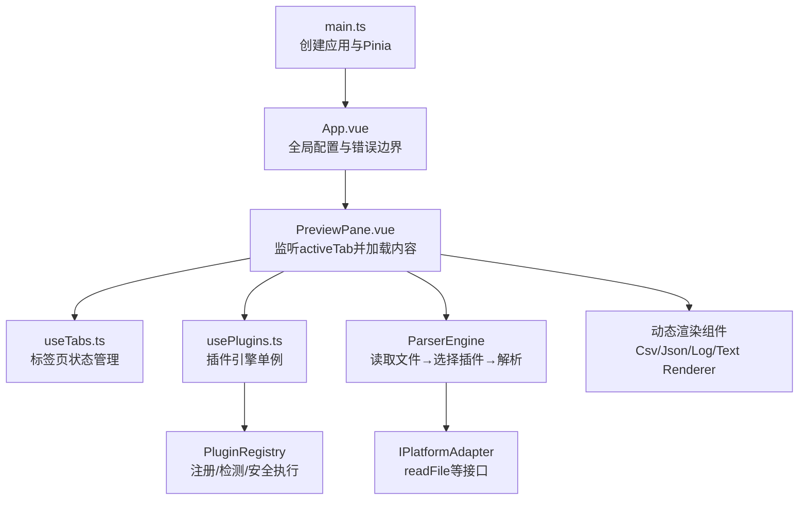
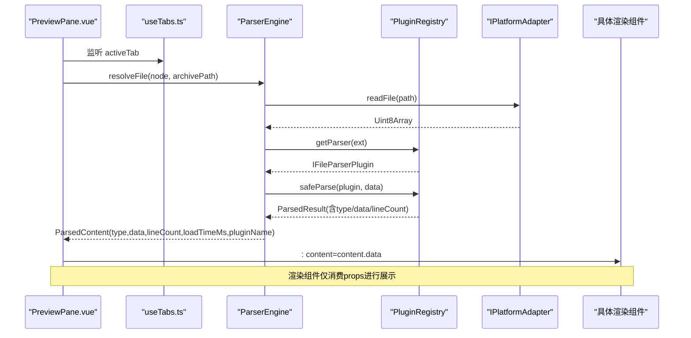
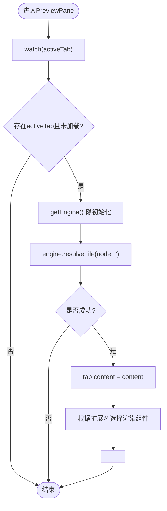
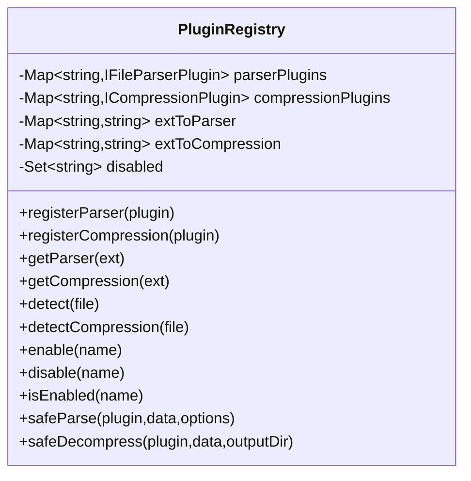
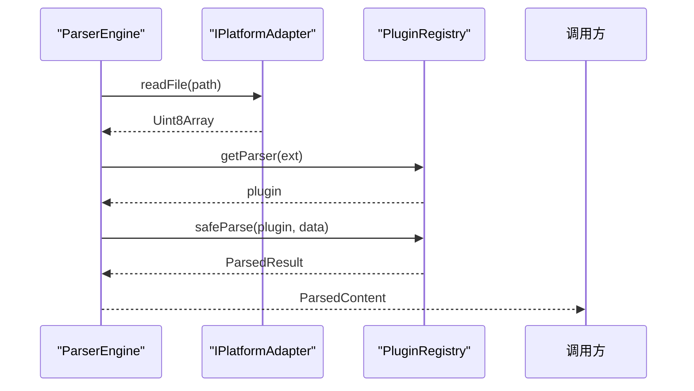
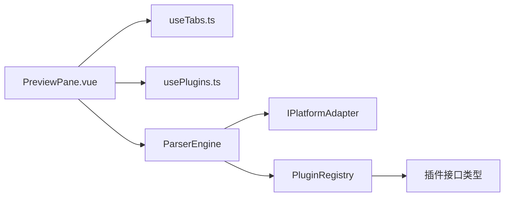

# 组件通信

<cite>
**本文引用的文件**   
- [src/main.ts](file://src/main.ts)
- [src/App.vue](file://src/App.vue)
- [src/components/workspace/PreviewPane.vue](file://src/components/workspace/PreviewPane.vue)
- [src/composables/use-tabs.ts](file://src/composables/use-tabs.ts)
- [src/composables/use-plugins.ts](file://src/composables/use-plugins.ts)
- [src/plugins/registry.ts](file://src/plugins/registry.ts)
- [src/core/parser-engine.ts](file://src/core/parser-engine.ts)
- [src/adapters/types.ts](file://src/adapters/types.ts)
- [src/views/renderers/CsvRenderer.vue](file://src/views/renderers/CsvRenderer.vue)
- [src/views/renderers/JsonRenderer.vue](file://src/views/renderers/JsonRenderer.vue)
- [src/views/renderers/LogRenderer.vue](file://src/views/renderers/LogRenderer.vue)
- [src/views/renderers/TextRenderer.vue](file://src/views/renderers/TextRenderer.vue)
- [src/components/archive-panel/ArchivePanel.vue](file://src/components/archive-panel/ArchivePanel.vue)
- [src/stores/app.ts](file://src/stores/app.ts)
</cite>

## 目录
1. [简介](#简介)
2. [项目结构](#项目结构)
3. [核心组件](#核心组件)
4. [架构总览](#架构总览)
5. [详细组件分析](#详细组件分析)
6. [依赖分析](#依赖分析)
7. [性能考虑](#性能考虑)
8. [故障排查指南](#故障排查指南)
9. [结论](#结论)
10. [附录：测试与模拟通信场景](#附录测试与模拟通信场景)

## 简介
本文件聚焦 Hello-Tauri 的组件通信机制，围绕以下主题展开：
- Vue 3 组件间数据传递模式：props 向下传递、events 向上冒泡、provide/inject 跨层级通信（在本仓库中主要体现为 props + events + Pinia 全局状态）。
- 插件系统与 UI 组件集成：插件注册中心的事件分发与回调机制（通过 Promise 链式调用与超时保护实现）。
- 解析器引擎与渲染组件的异步通信：Promise 链式调用与错误传播。
- 组件解耦最佳实践、性能优化建议与调试技巧。
- 组件测试中的模拟通信场景。

## 项目结构
从应用启动到预览面板的数据流，关键路径如下：
- 应用入口创建 Vue 实例并挂载 Pinia。
- 根组件提供全局主题与错误边界。
- 工作区预览面板监听标签页变化，驱动解析引擎加载内容，并按插件动态渲染对应视图组件。
- 插件注册中心负责解析器与压缩器的发现、启用/禁用、安全执行与超时保护。
- 平台适配器抽象了底层 I/O 能力，供解析引擎使用。

图示来源
- [src/main.ts:1-8](file://src/main.ts#L1-L8)
- [src/App.vue:1-24](file://src/App.vue#L1-L24)
- [src/components/workspace/PreviewPane.vue:1-58](file://src/components/workspace/PreviewPane.vue#L1-L58)
- [src/composables/use-tabs.ts:1-64](file://src/composables/use-tabs.ts#L1-L64)
- [src/composables/use-plugins.ts:1-17](file://src/composables/use-plugins.ts#L1-L17)
- [src/plugins/registry.ts:1-118](file://src/plugins/registry.ts#L1-L118)
- [src/core/parser-engine.ts:1-35](file://src/core/parser-engine.ts#L1-L35)
- [src/adapters/types.ts:1-12](file://src/adapters/types.ts#L1-L12)

章节来源
- [src/main.ts:1-8](file://src/main.ts#L1-L8)
- [src/App.vue:1-24](file://src/App.vue#L1-L24)

## 核心组件
- 预览面板 PreviewPane：作为“编排者”，监听 activeTab 变化，按需获取 ParserEngine，解析文件并将结果写入 tab.content，再根据扩展名选择渲染组件。
- 标签页 useTabs：维护 tabs 列表与当前激活项，提供 open/close/activate/pin 等操作。
- 插件引擎 usePlugins：封装 PluginRegistry 的单例访问，暴露 detect/getParser/getCompression/enable/disable 等方法。
- 插件注册中心 PluginRegistry：集中管理解析器与压缩器，提供按扩展名检测、启用/禁用、安全解析与解压（含超时保护）的能力。
- 解析引擎 ParserEngine：组合 PlatformAdapter 与 Registry，完成“读文件 → 选插件 → 解析 → 返回统一 ParsedContent”的流程。
- 平台适配器 IPlatformAdapter：定义 readFile/listFiles/decompress/mmapRead/streamRead 等接口，屏蔽 Web/Tauri 差异。
- 渲染组件 Csv/Json/Log/Text Renderer：以 props 接收 content，内部仅做展示逻辑。

章节来源
- [src/components/workspace/PreviewPane.vue:1-58](file://src/components/workspace/PreviewPane.vue#L1-L58)
- [src/composables/use-tabs.ts:1-64](file://src/composables/use-tabs.ts#L1-L64)
- [src/composables/use-plugins.ts:1-17](file://src/composables/use-plugins.ts#L1-L17)
- [src/plugins/registry.ts:1-118](file://src/plugins/registry.ts#L1-L118)
- [src/core/parser-engine.ts:1-35](file://src/core/parser-engine.ts#L1-L35)
- [src/adapters/types.ts:1-12](file://src/adapters/types.ts#L1-L12)
- [src/views/renderers/CsvRenderer.vue:1-52](file://src/views/renderers/CsvRenderer.vue#L1-L52)
- [src/views/renderers/JsonRenderer.vue:1-30](file://src/views/renderers/JsonRenderer.vue#L1-L30)
- [src/views/renderers/LogRenderer.vue:1-57](file://src/views/renderers/LogRenderer.vue#L1-L57)
- [src/views/renderers/TextRenderer.vue:1-38](file://src/views/renderers/TextRenderer.vue#L1-L38)

## 架构总览
下图展示了“UI 层 → 编排层 → 引擎层 → 插件层 → 平台适配层”的完整链路，以及错误在多层间的传播方式。

图示来源
- [src/components/workspace/PreviewPane.vue:1-58](file://src/components/workspace/PreviewPane.vue#L1-L58)
- [src/core/parser-engine.ts:1-35](file://src/core/parser-engine.ts#L1-L35)
- [src/plugins/registry.ts:1-118](file://src/plugins/registry.ts#L1-L118)
- [src/adapters/types.ts:1-12](file://src/adapters/types.ts#L1-L12)

## 详细组件分析

### 组件A：预览面板与标签页协作（Props + Events + 响应式状态）
- 数据流向
  - 父级通过事件将用户操作（如打开标签）传递给 useTabs 管理的状态。
  - PreviewPane 通过 watch(activeTab) 触发解析流程，解析完成后将 content 写回 activeTab，从而驱动渲染。
  - 渲染组件通过 props 接收 content，不直接修改上游状态，保持单向数据流。
- 关键点
  - 懒初始化 ParserEngine，避免不必要的平台适配开销。
  - 基于扩展名动态选择渲染组件，实现“解析结果类型 → 渲染组件”的映射。

图示来源
- [src/components/workspace/PreviewPane.vue:1-58](file://src/components/workspace/PreviewPane.vue#L1-L58)
- [src/composables/use-tabs.ts:1-64](file://src/composables/use-tabs.ts#L1-L64)

章节来源
- [src/components/workspace/PreviewPane.vue:1-58](file://src/components/workspace/PreviewPane.vue#L1-L58)
- [src/composables/use-tabs.ts:1-64](file://src/composables/use-tabs.ts#L1-L64)

### 组件B：插件注册中心与安全执行（Promise 链式与超时保护）
- 职责
  - 注册/检测解析器与压缩器；支持启用/禁用；按扩展名快速定位插件。
  - safeParse/safeDecompress 对插件执行进行超时保护与异常捕获，失败时回退到十六进制或返回结构化错误。
- 设计要点
  - withTimeout 使用 Promise.race 实现超时控制，确保长时间阻塞不会卡死主线程。
  - 统一返回格式，便于上层稳定处理。

图示来源
- [src/plugins/registry.ts:1-118](file://src/plugins/registry.ts#L1-L118)

章节来源
- [src/plugins/registry.ts:1-118](file://src/plugins/registry.ts#L1-L118)

### 组件C：解析引擎与平台适配（异步通信与错误传播）
- 职责
  - 组合 IPlatformAdapter 与 PluginRegistry，完成“读取 → 选择插件 → 解析 → 返回统一结果”。
  - 对外暴露 resolveFile，内部统一错误处理，失败返回 null，由上层决定降级策略。
- 错误传播
  - 平台层异常被捕获后，解析引擎返回空结果；上层可据此显示空态或回退视图。

图示来源
- [src/core/parser-engine.ts:1-35](file://src/core/parser-engine.ts#L1-L35)
- [src/adapters/types.ts:1-12](file://src/adapters/types.ts#L1-L12)
- [src/plugins/registry.ts:1-118](file://src/plugins/registry.ts#L1-L118)

章节来源
- [src/core/parser-engine.ts:1-35](file://src/core/parser-engine.ts#L1-L35)
- [src/adapters/types.ts:1-12](file://src/adapters/types.ts#L1-L12)

### 组件D：渲染组件（纯展示，props 输入）
- 共同特征
  - 通过 defineProps 声明 content 的类型约束，内部只做展示逻辑，不修改外部状态。
  - 针对空数据进行友好提示，提升用户体验。
- 示例
  - CsvRenderer：表格展示 headers/rows。
  - JsonRenderer：递归树形展示对象/数组。
  - LogRenderer：行号、时间戳、级别、模块、消息列对齐展示。
  - TextRenderer：逐行文本展示，带行号。

章节来源
- [src/views/renderers/CsvRenderer.vue:1-52](file://src/views/renderers/CsvRenderer.vue#L1-L52)
- [src/views/renderers/JsonRenderer.vue:1-30](file://src/views/renderers/JsonRenderer.vue#L1-L30)
- [src/views/renderers/LogRenderer.vue:1-57](file://src/views/renderers/LogRenderer.vue#L1-L57)
- [src/views/renderers/TextRenderer.vue:1-38](file://src/views/renderers/TextRenderer.vue#L1-L38)

### 组件E：事件冒泡与父子通信（ArchivePanel 示例）
- 模式
  - ArchivePanel 通过 @remove/@retry 事件向父级派发动作，父级持有 useArchiveManager 的状态与方法，负责实际业务处理。
- 适用场景
  - 列表项操作、批量操作、确认对话框联动等。

章节来源
- [src/components/archive-panel/ArchivePanel.vue:1-24](file://src/components/archive-panel/ArchivePanel.vue#L1-L24)

### 组件F：跨层级通信（provide/inject 与 Pinia）
- 现状
  - 本项目主要通过 Pinia 共享全局状态（如主题、面板宽度、插件禁用列表），而非 provide/inject。
  - 若未来需要跨深层级注入轻量配置（如语言包、日志开关），可引入 provide/inject 降低 prop drilling。
- 建议
  - 全局配置类信息优先使用 Pinia；局部上下文（如主题覆盖、国际化）可使用 provide/inject。

章节来源
- [src/stores/app.ts:1-57](file://src/stores/app.ts#L1-L57)
- [src/App.vue:1-24](file://src/App.vue#L1-L24)

## 依赖分析
- 耦合关系
  - PreviewPane 依赖 useTabs、usePlugins、ParserEngine 与平台适配器。
  - ParserEngine 依赖 IPlatformAdapter 与 PluginRegistry。
  - PluginRegistry 依赖插件接口类型，不感知 UI 细节，具备良好内聚性。
- 外部依赖
  - IPlatformAdapter 屏蔽 Web/Tauri 差异，使上层无需关心底层实现。
- 潜在循环
  - 当前未发现循环依赖；UI 层只消费引擎与注册中心的输出，不反向注入。

图示来源
- [src/components/workspace/PreviewPane.vue:1-58](file://src/components/workspace/PreviewPane.vue#L1-L58)
- [src/composables/use-tabs.ts:1-64](file://src/composables/use-tabs.ts#L1-L64)
- [src/composables/use-plugins.ts:1-17](file://src/composables/use-plugins.ts#L1-L17)
- [src/core/parser-engine.ts:1-35](file://src/core/parser-engine.ts#L1-L35)
- [src/adapters/types.ts:1-12](file://src/adapters/types.ts#L1-L12)
- [src/plugins/registry.ts:1-118](file://src/plugins/registry.ts#L1-L118)

章节来源
- [src/components/workspace/PreviewPane.vue:1-58](file://src/components/workspace/PreviewPane.vue#L1-L58)
- [src/core/parser-engine.ts:1-35](file://src/core/parser-engine.ts#L1-L35)
- [src/plugins/registry.ts:1-118](file://src/plugins/registry.ts#L1-L118)

## 性能考虑
- 懒初始化引擎：PreviewPane 仅在首次需要时创建 ParserEngine，减少平台适配初始化成本。
- 超时保护：safeParse/safeDecompress 使用 withTimeout 防止插件长时间阻塞。
- 渲染优化：渲染组件仅消费 props，避免不必要的重渲染；大列表建议使用虚拟滚动（可在后续扩展）。
- 内存占用：对于超大文件，优先使用 mmapRead/streamRead 分块处理（由平台适配器实现）。

[本节为通用指导，不涉及具体文件分析]

## 故障排查指南
- 常见问题
  - 插件解析超时：检查 withTimeout 阈值与插件实现耗时，必要时拆分任务或增加超时。
  - 平台读取失败：确认 IPlatformAdapter 的 readFile 实现与权限配置。
  - 渲染为空：检查 activeTab.content 是否正确赋值，以及扩展名与插件匹配情况。
- 定位手段
  - 在 PreviewPane 的 watch 与 engine.resolveFile 处添加日志，观察数据流。
  - 在 PluginRegistry.safeParse 中记录异常堆栈与回退分支。
  - 使用浏览器开发者工具断点调试 Promise 链。

章节来源
- [src/plugins/registry.ts:1-118](file://src/plugins/registry.ts#L1-L118)
- [src/components/workspace/PreviewPane.vue:1-58](file://src/components/workspace/PreviewPane.vue#L1-L58)

## 结论
- 本项目采用“单向数据流 + 事件冒泡 + 全局状态”的组合，清晰分离了 UI 展示、编排逻辑与底层能力。
- 插件注册中心与安全执行机制保证了可扩展性与稳定性；解析引擎与平台适配器解耦了平台差异。
- 建议在复杂场景下引入 provide/inject 管理上下文，并结合虚拟滚动与流式读取优化大数据渲染体验。

[本节为总结，不涉及具体文件分析]

## 附录：测试与模拟通信场景
- 目标
  - 验证 PreviewPane 在 activeTab 变化时的解析流程与渲染选择。
  - 验证 PluginRegistry 的安全解析与超时行为。
  - 验证渲染组件在不同 content 下的展示与空态处理。
- 模拟策略
  - 使用 Vitest + Vue Test Utils 挂载组件。
  - 模拟 useTabs：提供一个 mock 的 activeTab ref，并在测试中更新其值以触发 watch。
  - 模拟 IPlatformAdapter：mock readFile 返回不同数据（正常/异常/空）。
  - 模拟 PluginRegistry：mock getParser 与 safeParse，分别返回成功、失败与超时场景。
  - 断言渲染组件是否被正确选择，以及空态提示是否出现。
- 参考实现位置
  - 组件挂载与测试框架：见项目测试配置与入口（Vitest/Vue Test Utils）。
  - 组件与 Composable：PreviewPane、useTabs、usePlugins、PluginRegistry、ParserEngine、各渲染组件。

章节来源
- [src/components/workspace/PreviewPane.vue:1-58](file://src/components/workspace/PreviewPane.vue#L1-L58)
- [src/composables/use-tabs.ts:1-64](file://src/composables/use-tabs.ts#L1-L64)
- [src/composables/use-plugins.ts:1-17](file://src/composables/use-plugins.ts#L1-L17)
- [src/plugins/registry.ts:1-118](file://src/plugins/registry.ts#L1-L118)
- [src/core/parser-engine.ts:1-35](file://src/core/parser-engine.ts#L1-L35)
- [src/views/renderers/CsvRenderer.vue:1-52](file://src/views/renderers/CsvRenderer.vue#L1-L52)
- [src/views/renderers/JsonRenderer.vue:1-30](file://src/views/renderers/JsonRenderer.vue#L1-L30)
- [src/views/renderers/LogRenderer.vue:1-57](file://src/views/renderers/LogRenderer.vue#L1-L57)
- [src/views/renderers/TextRenderer.vue:1-38](file://src/views/renderers/TextRenderer.vue#L1-L38)