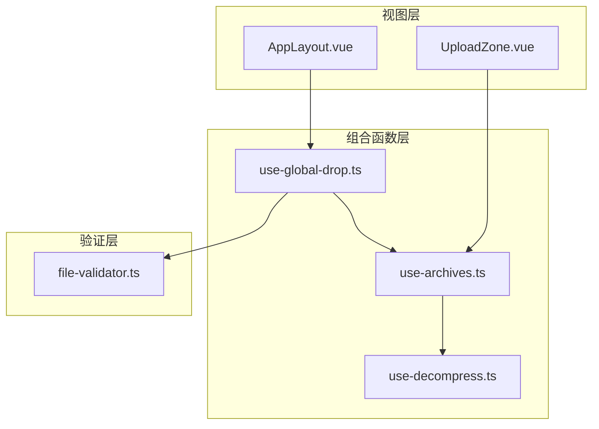
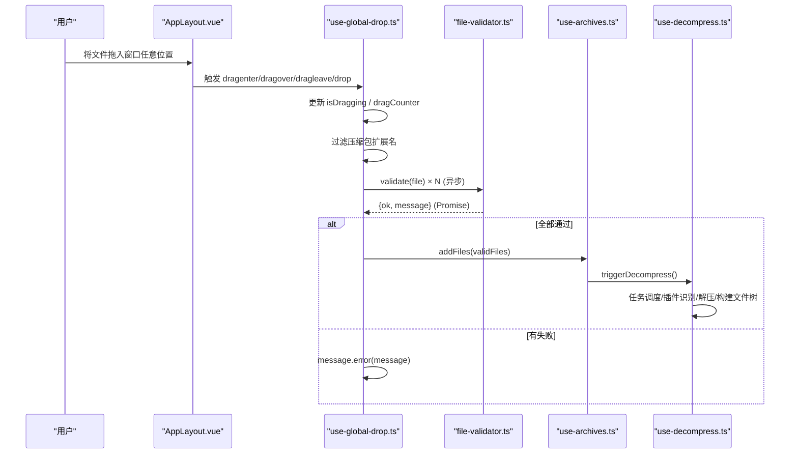
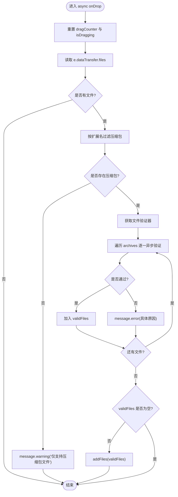
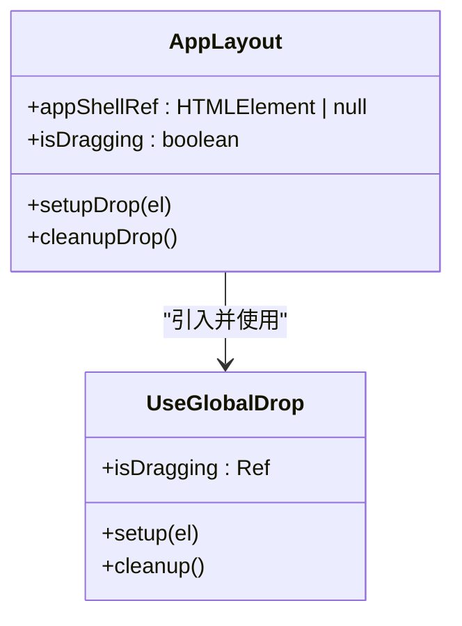
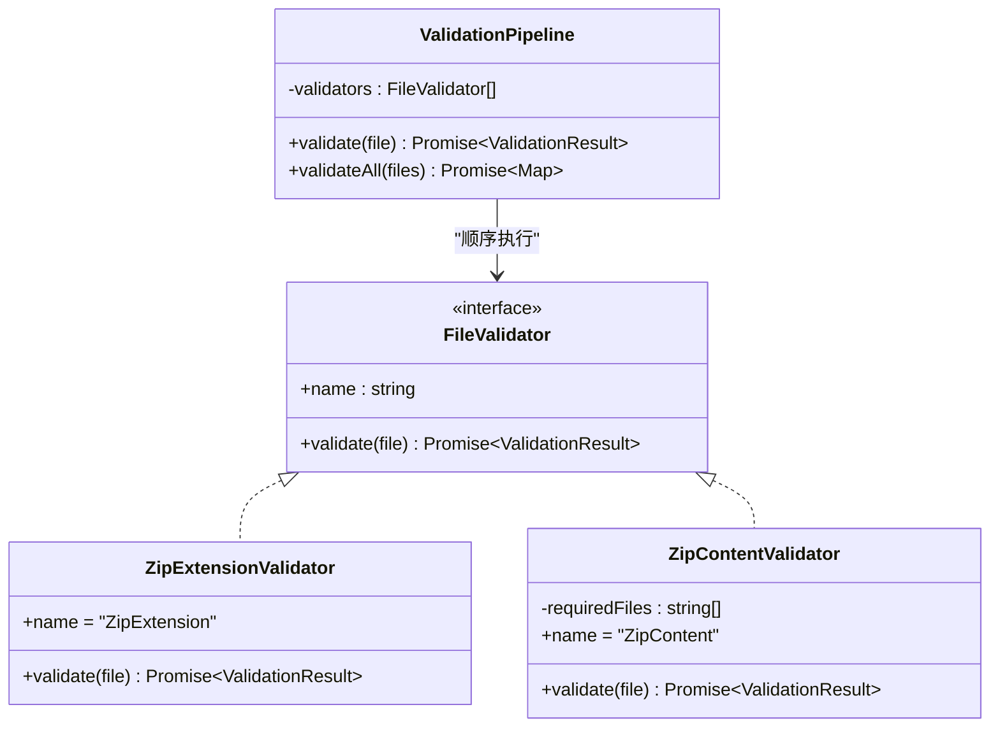
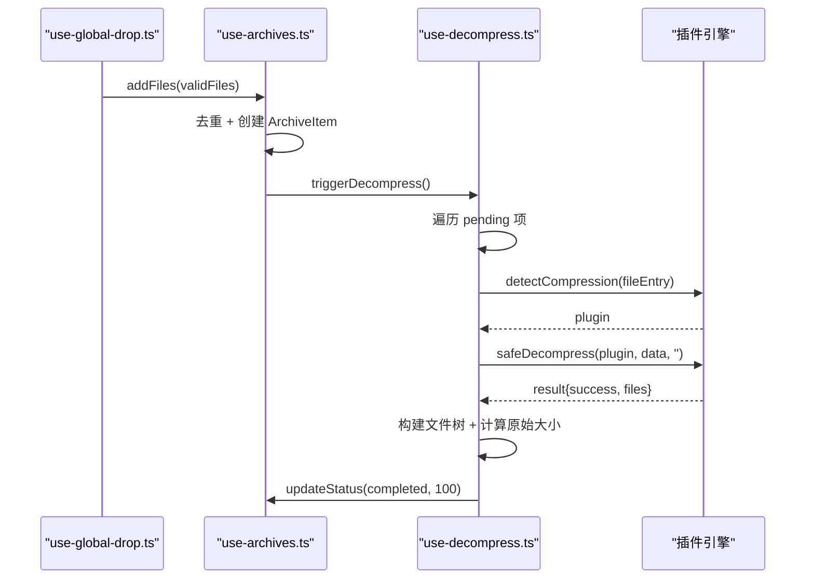
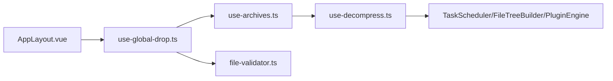

# 全局拖拽上传组合函数

<cite>
**本文引用的文件**   
- [use-global-drop.ts](file://src/composables/use-global-drop.ts)
- [use-global-drop.test.ts](file://src/__tests__/composables/use-global-drop.test.ts)
- [AppLayout.vue](file://src/layout/AppLayout.vue)
- [use-archives.ts](file://src/composables/use-archives.ts)
- [file-validator.ts](file://src/core/file-validator.ts)
- [UploadZone.vue](file://src/components/archive-panel/UploadZone.vue)
- [use-decompress.ts](file://src/composables/use-decompress.ts)
</cite>

## 更新摘要
**所做更改**   
- 更新了核心组件分析章节，突出异步验证流程的升级
- 增强了架构总览图，展示异步验证流程
- 新增了详细的异步处理流程图
- 更新了故障排查指南，包含异步验证相关的常见问题
- 完善了性能与体验优化建议，重点关注异步操作的性能考虑

## 目录
1. [简介](#简介)
2. [项目结构](#项目结构)
3. [核心组件](#核心组件)
4. [架构总览](#架构总览)
5. [详细组件分析](#详细组件分析)
6. [依赖关系分析](#依赖关系分析)
7. [性能与体验优化](#性能与体验优化)
8. [故障排查指南](#故障排查指南)
9. [结论](#结论)

## 简介
本文件围绕"全局拖拽上传"能力，系统性梳理并解读实现方案：通过一个可复用的组合函数 useGlobalDrop 监听应用级拖拽事件、过滤压缩包类型、进行**异步内容校验**，并将有效文件交由归档管理器统一处理。**该功能已从同步处理全面升级为异步验证流程，集成了完整的文件验证器，支持错误处理和用户反馈，显著增强了文件处理的健壮性**。该功能以 AppLayout 为集成点，提供全屏遮罩的视觉反馈，同时与左侧面板 UploadZone 的本地拖拽上传共存且复用同一入口 addFiles。

## 项目结构
- 组合函数层
  - src/composables/use-global-drop.ts：封装全局拖拽事件、状态管理、文件过滤与**异步消息提示**
  - src/composables/use-archives.ts：归档列表与去重、触发解压管线
  - src/composables/use-decompress.ts：任务调度、插件检测与解压流程
- 验证层
  - src/core/file-validator.ts：**策略链式异步验证**（扩展名 + 内容）
- 视图层
  - src/layout/AppLayout.vue：引入组合函数、挂载根元素、渲染遮罩
  - src/components/archive-panel/UploadZone.vue：局部拖拽上传（与全局共存）

图表来源
- [AppLayout.vue:14-27](file://src/layout/AppLayout.vue#L14-L27)
- [use-global-drop.ts:17-24](file://src/composables/use-global-drop.ts#L17-L24)
- [use-archives.ts:14-45](file://src/composables/use-archives.ts#L14-L45)
- [file-validator.ts:128-133](file://src/core/file-validator.ts#L128-L133)
- [use-decompress.ts:10-73](file://src/composables/use-decompress.ts#L10-L73)

章节来源
- [AppLayout.vue:14-27](file://src/layout/AppLayout.vue#L14-L27)
- [use-global-drop.ts:1-104](file://src/composables/use-global-drop.ts#L1-L104)
- [use-archives.ts:1-81](file://src/composables/use-archives.ts#L1-L81)
- [file-validator.ts:1-139](file://src/core/file-validator.ts#L1-L139)
- [UploadZone.vue:1-122](file://src/components/archive-panel/UploadZone.vue#L1-L122)
- [use-decompress.ts:1-73](file://src/composables/use-decompress.ts#L1-L73)

## 核心组件
- useGlobalDrop 组合函数
  - 职责：绑定全局 dragenter/dragover/dragleave/drop；维护 isDragging 状态；过滤压缩包扩展名；**调用异步文件验证器**；失败时通过 Naive UI 提示；成功则调用 addFiles。
  - **关键升级**：onDrop 方法已改为 async 函数，支持异步验证流程；使用 await validator.validate(file) 逐个验证文件；**完善的错误处理机制**，对每个验证失败的文件显示具体错误信息。
  - 关键细节：dragCounter 防闪烁；dropEffect='copy'；preventDefault 阻止浏览器默认打开；支持 .zip/.gz/.gzip/.tgz/.7z/.rar/.tar。
- AppLayout 集成
  - 在 onMounted 中 setup 到 appShellRef；在模板中渲染 Transition 包裹的全屏遮罩；在 onBeforeUnmount 中 cleanup。
- 文件验证器
  - 默认管线包含扩展名检查与 ZIP 内容检查（要求存在 VERSION.txt），采用短路策略，首个失败即返回错误信息。
  - **异步设计**：所有验证器都实现 Promise<ValidationResult> 接口，支持异步文件读取和验证。
- 归档管理与解压
  - addFiles 负责去重、创建 ArchiveItem、触发解压；useDecompress 使用任务调度器并发执行，按插件识别压缩格式并构建文件树。

章节来源
- [use-global-drop.ts:17-103](file://src/composables/use-global-drop.ts#L17-L103)
- [AppLayout.vue:14-27](file://src/layout/AppLayout.vue#L14-L27)
- [file-validator.ts:88-133](file://src/core/file-validator.ts#L88-L133)
- [use-archives.ts:14-45](file://src/composables/use-archives.ts#L14-L45)
- [use-decompress.ts:10-73](file://src/composables/use-decompress.ts#L10-L73)

## 架构总览
从用户操作到数据落库的完整链路如下，**现已完全支持异步验证流程**：

图表来源
- [AppLayout.vue:14-27](file://src/layout/AppLayout.vue#L14-L27)
- [use-global-drop.ts:48-81](file://src/composables/use-global-drop.ts#L48-L81)
- [file-validator.ts:88-133](file://src/core/file-validator.ts#L88-L133)
- [use-archives.ts:14-45](file://src/composables/use-archives.ts#L14-L45)
- [use-decompress.ts:10-73](file://src/composables/use-decompress.ts#L10-L73)

## 详细组件分析

### 组合函数 useGlobalDrop
- 状态与生命周期
  - isDragging：控制遮罩显隐
  - dragCounter：解决子元素穿越导致的 dragleave 频繁触发问题
  - boundEl：保存绑定的 DOM 节点，cleanup 时解绑
- 事件处理
  - dragenter：e.preventDefault()，dragCounter++，若 dataTransfer.types 包含 Files 则显示遮罩
  - dragover：e.preventDefault()，设置 dropEffect='copy'
  - dragleave：dragCounter--，归零时隐藏遮罩
  - **drop：重置计数与状态，读取 files，过滤压缩包，逐个异步验证，聚合 validFiles 后调用 addFiles**
- **异步验证流程**
  - **获取验证器实例**：const validator = getFileValidator()
  - **遍历验证**：for (const file of archives) { const result = await validator.validate(file) }
  - **错误处理**：对每个验证失败的文件显示具体错误信息
  - **结果聚合**：只有验证通过的文件才会被添加到 validFiles 数组
- 外部依赖
  - useMessage：warning/error 提示
  - useArchiveManager().addFiles：统一入口
  - getFileValidator：获取默认验证管线

图表来源
- [use-global-drop.ts:48-81](file://src/composables/use-global-drop.ts#L48-L81)
- [use-global-drop.ts:6-15](file://src/composables/use-global-drop.ts#L6-L15)
- [file-validator.ts:88-133](file://src/core/file-validator.ts#L88-L133)

章节来源
- [use-global-drop.ts:17-103](file://src/composables/use-global-drop.ts#L17-L103)

### AppLayout 集成与遮罩层
- 脚本侧
  - 引入 useGlobalDrop，声明 appShellRef
  - onMounted 中 setupDrop(appShellRef.value)
  - onBeforeUnmount 中 cleanupDrop()
- 模板侧
  - 在 app-shell 内部末尾插入 Transition 包裹的遮罩层，v-if="isDragging"
- 样式侧
  - 全屏绝对定位覆盖，半透明背景 + 毛玻璃效果，居中虚线框 + 图标 + 提示文字，淡入淡出动画

图表来源
- [AppLayout.vue:14-27](file://src/layout/AppLayout.vue#L14-L27)
- [AppLayout.vue:155-168](file://src/layout/AppLayout.vue#L155-L168)
- [use-global-drop.ts:83-103](file://src/composables/use-global-drop.ts#L83-L103)

章节来源
- [AppLayout.vue:14-27](file://src/layout/AppLayout.vue#L14-L27)
- [AppLayout.vue:155-168](file://src/layout/AppLayout.vue#L155-L168)
- [AppLayout.vue:515-558](file://src/layout/AppLayout.vue#L515-L558)

### 文件验证器（策略链）
- 内置验证器
  - ZipExtensionValidator：仅允许 .zip（注意：全局拖拽处已通过扩展名集合做前置过滤，此处作为兜底）
  - ZipContentValidator：读取 ZIP 文件名列表，要求包含 VERSION.txt（精确或后缀匹配）
- 验证管线 ValidationPipeline
  - 顺序执行，遇到第一个失败即短路返回
  - 提供 validateAll 批量验证（当前未使用）
- 工厂方法
  - getFileValidator：单例返回默认管线
  - resetFileValidator：测试用重置
- **异步设计特性**
  - 所有验证器都实现 FileValidator 接口，validate 方法返回 Promise<ValidationResult>
  - ZipContentValidator 使用 await file.arrayBuffer() 异步读取文件内容
  - 支持动态导入 fflate 库进行 ZIP 文件解析

图表来源
- [file-validator.ts:14-20](file://src/core/file-validator.ts#L14-L20)
- [file-validator.ts:25-35](file://src/core/file-validator.ts#L25-L35)
- [file-validator.ts:41-80](file://src/core/file-validator.ts#L41-L80)
- [file-validator.ts:88-133](file://src/core/file-validator.ts#L88-L133)

章节来源
- [file-validator.ts:1-139](file://src/core/file-validator.ts#L1-L139)

### 归档管理与解压流水线
- useArchiveManager
  - addFiles：基于 name:size:lastModified 去重，生成 ArchiveItem，状态初始 pending，随后触发解压
  - remove/updateStatus/stats/reset：辅助状态管理
- useDecompress
  - decompressAll：遍历 pending 项，启动解压任务
  - startDecompress：读取 ArrayBuffer → 插件识别 → safeDecompress → 构建文件树 → 更新状态与统计

图表来源
- [use-archives.ts:14-45](file://src/composables/use-archives.ts#L14-L45)
- [use-decompress.ts:10-73](file://src/composables/use-decompress.ts#L10-L73)

章节来源
- [use-archives.ts:14-45](file://src/composables/use-archives.ts#L14-L45)
- [use-decompress.ts:10-73](file://src/composables/use-decompress.ts#L10-L73)

### 与 UploadZone 的关系
- UploadZone 同样使用 getFileValidator 与 addFiles，但作用域限定在左侧面板区域
- **两者都实现了相同的异步验证流程**，确保用户体验的一致性
- 两者互不冲突，共享同一归档与解压管线

章节来源
- [UploadZone.vue:1-122](file://src/components/archive-panel/UploadZone.vue#L1-L122)
- [use-archives.ts:14-45](file://src/composables/use-archives.ts#L14-L45)

## 依赖关系分析
- 直接依赖
  - useGlobalDrop → useArchiveManager.addFiles、getFileValidator、naive-ui.useMessage
  - AppLayout → useGlobalDrop
  - useArchiveManager → useDecompress.decompressAll（动态导入）
  - useDecompress → TaskScheduler、FileTreeBuilder、PluginEngine
- 间接依赖
  - file-validator.ts 中的 ZipContentValidator 依赖 fflate（按需 import）
- 耦合与内聚
  - useGlobalDrop 仅关注"捕获与预处理"，业务逻辑下沉至 addFiles 与 validator，内聚良好
  - AppLayout 仅持有 ref 与生命周期钩子，职责清晰
  - **异步验证流程的解耦设计**：验证逻辑完全独立于拖拽处理，便于测试和维护

图表来源
- [use-global-drop.ts:17-24](file://src/composables/use-global-drop.ts#L17-L24)
- [use-archives.ts:41-45](file://src/composables/use-archives.ts#L41-L45)
- [use-decompress.ts:1-8](file://src/composables/use-decompress.ts#L1-L8)

章节来源
- [use-global-drop.ts:17-24](file://src/composables/use-global-drop.ts#L17-L24)
- [use-archives.ts:41-45](file://src/composables/use-archives.ts#L41-L45)
- [use-decompress.ts:1-8](file://src/composables/use-decompress.ts#L1-L8)

## 性能与体验优化
- 事件节流与防抖
  - 当前对 dragenter/dragleave 使用计数器避免闪烁，无需额外节流
- **异步文件 I/O 优化**
  - 验证阶段可能读取 ArrayBuffer（ZipContentValidator），建议在大文件场景下考虑分块或异步进度提示
  - **异步验证流程避免了阻塞主线程**，提升用户体验
- 任务并发
  - useDecompress 使用 TaskScheduler(3)，可根据 CPU 核数与文件大小调优并发度
- 内存占用
  - 大量大文件同时解压会占用较多内存，建议在 addFiles 前增加大小限制或分批处理
- **用户体验增强**
  - 可在 drop 后、验证完成前展示"正在验证…"提示，提升感知
  - **详细的错误反馈**：每个验证失败的文件都会显示具体的错误原因
  - **渐进式处理**：即使部分文件验证失败，其他有效文件仍会被正常处理

## 故障排查指南
- 现象：拖入非压缩包无反应
  - 检查 ACCEPTED_EXTENSIONS 是否包含目标扩展名
  - 确认 dragover 已 preventDefault，否则浏览器会直接打开文件
- 现象：遮罩闪烁或无法消失
  - 检查 dragCounter 是否在 dragleave 正确递减并在 <=0 时复位
  - 确保子元素不会导致冒泡干扰
- **异步验证相关问题**
  - **现象：验证过程卡顿**：检查大文件的异步读取是否影响了主线程响应
  - **现象：验证失败但无错误提示**：确认 message.error 是否正确调用，检查验证器的返回值格式
  - **现象：部分文件验证失败**：这是预期行为，系统会跳过失败文件继续处理其他有效文件
- 现象：压缩包被拒绝
  - 查看 message.error 的具体原因，常见为缺少 VERSION.txt 或文件损坏
  - 如需放宽规则，调整 ZipContentValidator 的 requiredFiles
- 现象：重复添加相同文件
  - 确认 addFiles 的去重 key（name:size:lastModified）是否符合预期
- 现象：全局与局部上传冲突
  - 确认两处均调用 addFiles，且各自独立的事件绑定范围不互相影响
- **测试相关**
  - **异步测试**：确保使用 await vi.waitFor() 等待异步验证完成
  - **Mock 验证器**：在测试中正确 mock getFileValidator 的返回值

章节来源
- [use-global-drop.ts:25-46](file://src/composables/use-global-drop.ts#L25-L46)
- [use-global-drop.ts:48-81](file://src/composables/use-global-drop.ts#L48-L81)
- [file-validator.ts:41-80](file://src/core/file-validator.ts#L41-L80)
- [use-archives.ts:10-24](file://src/composables/use-archives.ts#L10-L24)
- [use-global-drop.test.ts:74-100](file://src/__tests__/composables/use-global-drop.test.ts#L74-L100)

## 结论
useGlobalDrop 以最小侵入的方式实现了"全局拖拽上传"的核心能力，**并通过全面的异步验证流程升级显著增强了系统的健壮性和用户体验**。新的异步验证架构支持：

- **非阻塞的文件验证**：避免大文件验证时的界面卡顿
- **完善的错误处理**：每个验证失败的文件都有具体的错误反馈
- **渐进式文件处理**：部分文件失败不影响其他有效文件的处理
- **一致的验证流程**：全局拖拽和局部上传使用相同的验证逻辑

配合 AppLayout 的遮罩反馈与 UploadZone 的局部能力，形成一致的用户体验与清晰的职责边界。后续可按需扩展验证规则、优化大文件处理与并发策略，进一步提升健壮性与性能。