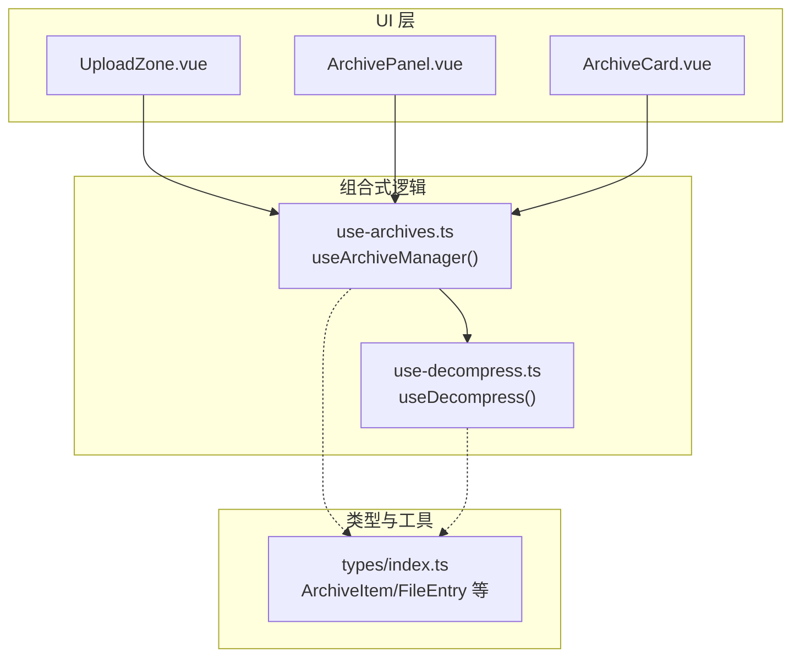
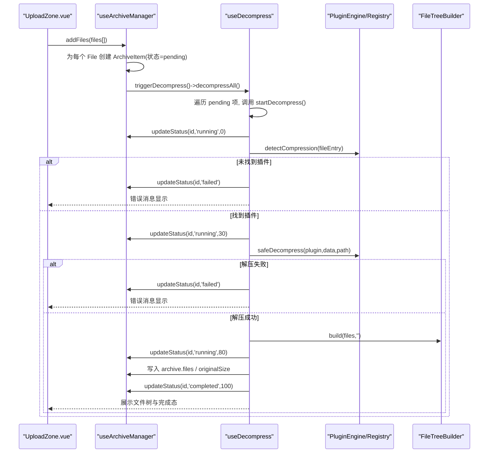
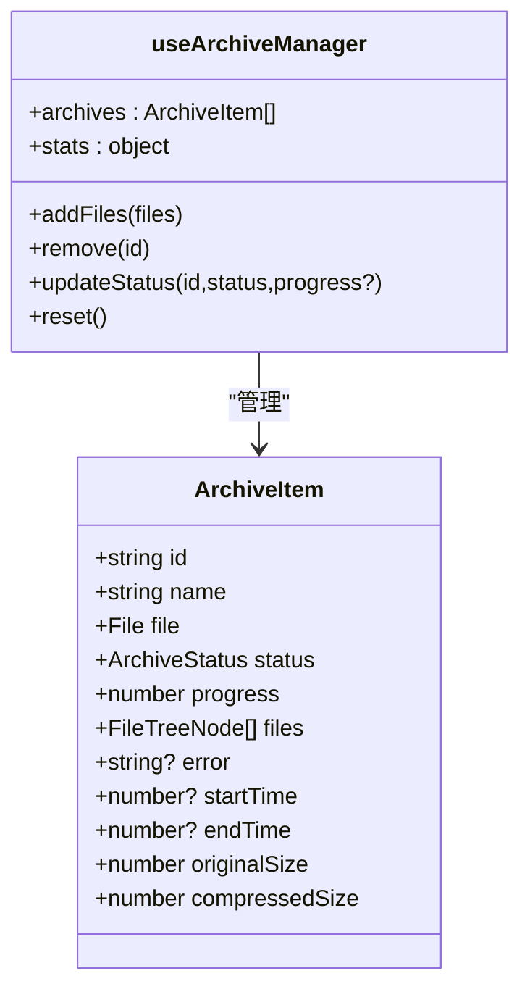
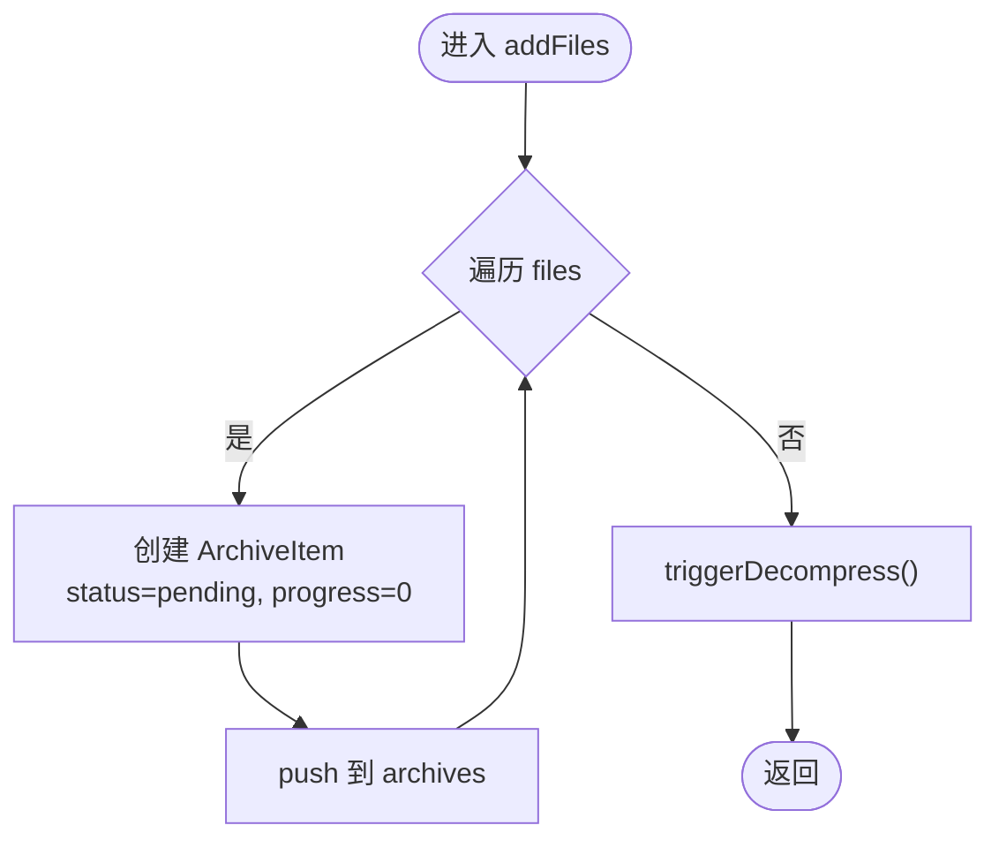
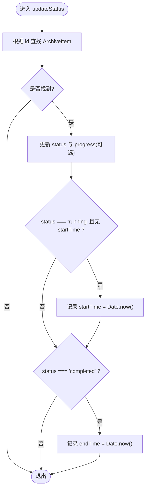
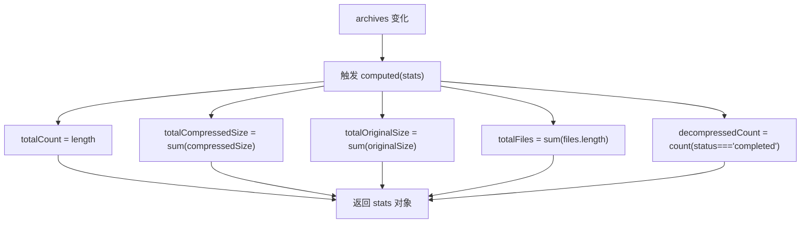
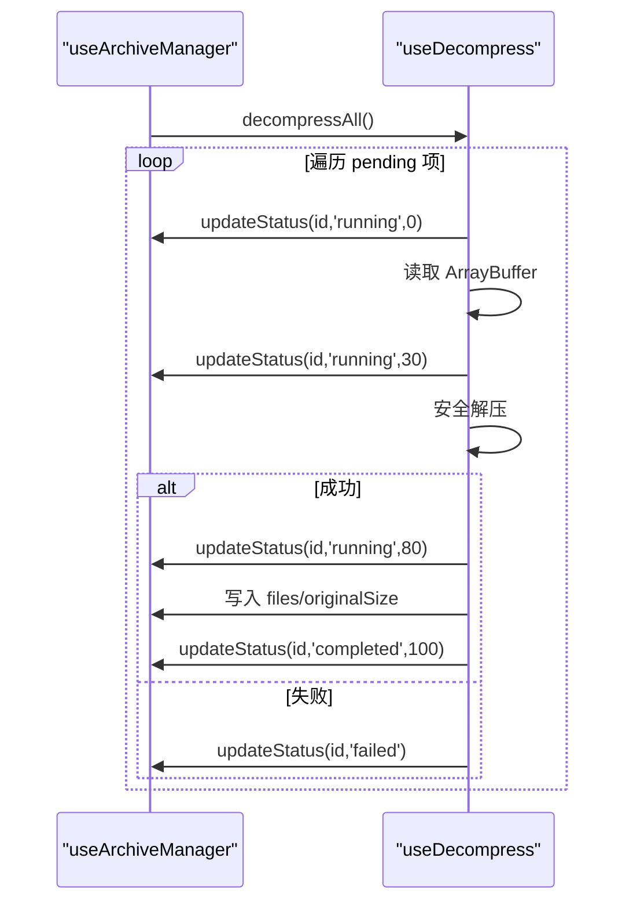
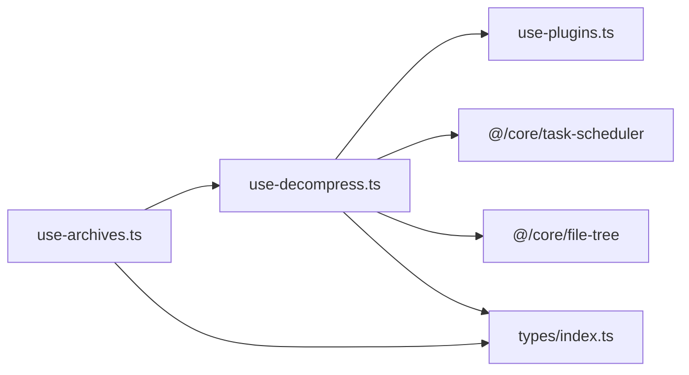

# 压缩包管理 (useArchives)

<cite>
**本文引用的文件**
- [src/composables/use-archives.ts](file://src/composables/use-archives.ts)
- [src/composables/use-decompress.ts](file://src/composables/use-decompress.ts)
- [src/types/index.ts](file://src/types/index.ts)
- [src/components/archive-panel/UploadZone.vue](file://src/components/archive-panel/UploadZone.vue)
- [src/components/archive-panel/ArchivePanel.vue](file://src/components/archive-panel/ArchivePanel.vue)
- [src/components/archive-panel/ArchiveCard.vue](file://src/components/archive-panel/ArchiveCard.vue)
- [src/__tests__/composables/use-archives.test.ts](file://src/__tests__/composables/use-archives.test.ts)
</cite>

## 目录
1. [简介](#简介)
2. [项目结构](#项目结构)
3. [核心组件](#核心组件)
4. [架构总览](#架构总览)
5. [详细组件分析](#详细组件分析)
6. [依赖关系分析](#依赖关系分析)
7. [性能考虑](#性能考虑)
8. [故障排查指南](#故障排查指南)
9. [结论](#结论)
10. [附录：使用示例与最佳实践](#附录使用示例与最佳实践)

## 简介
本文件为 useArchives 组合式函数（实际导出名为 useArchiveManager）的权威文档。该模块负责压缩包的全生命周期管理，包括：
- 批量添加压缩包文件并生成任务项
- 状态跟踪与进度更新
- 统计信息聚合计算
- 与解压流程 useDecompress 的协作

通过清晰的职责划分与响应式数据流，useArchives 为上层 UI 提供稳定、可观测的数据源，同时驱动解压任务的调度与执行。

## 项目结构
useArchives 位于 composables 层，向上被 ArchivePanel 等 UI 组件消费，向下与 useDecompress 协作完成解压。类型定义集中在 types 中，测试覆盖在 __tests__ 下。

图表来源
- [src/components/archive-panel/ArchivePanel.vue:1-23](file://src/components/archive-panel/ArchivePanel.vue#L1-L23)
- [src/components/archive-panel/UploadZone.vue:1-29](file://src/components/archive-panel/UploadZone.vue#L1-L29)
- [src/components/archive-panel/ArchiveCard.vue:1-41](file://src/components/archive-panel/ArchiveCard.vue#L1-L41)
- [src/composables/use-archives.ts:1-60](file://src/composables/use-archives.ts#L1-L60)
- [src/composables/use-decompress.ts:1-74](file://src/composables/use-decompress.ts#L1-L74)
- [src/types/index.ts:1-71](file://src/types/index.ts#L1-L71)

章节来源
- [src/composables/use-archives.ts:1-60](file://src/composables/use-archives.ts#L1-L60)
- [src/composables/use-decompress.ts:1-74](file://src/composables/use-decompress.ts#L1-L74)
- [src/types/index.ts:1-71](file://src/types/index.ts#L1-L71)
- [src/components/archive-panel/ArchivePanel.vue:1-23](file://src/components/archive-panel/ArchivePanel.vue#L1-L23)
- [src/components/archive-panel/UploadZone.vue:1-29](file://src/components/archive-panel/UploadZone.vue#L1-L29)
- [src/components/archive-panel/ArchiveCard.vue:1-41](file://src/components/archive-panel/ArchiveCard.vue#L1-L41)

## 核心组件
- useArchiveManager（use-archives.ts）
  - 维护全局 archives 列表与 nextArchiveId
  - addFiles：批量创建 ArchiveItem 并触发解压
  - updateStatus：统一的状态与进度更新入口，自动记录 startTime/endTime
  - stats：基于 archives 的聚合统计（总数、大小、文件数、已完成数）
  - remove/reset：清理与重置能力
- useDecompress（use-decompress.ts）
  - 从 useArchiveManager 获取 archives 与 updateStatus
  - decompressAll：遍历 pending 项并启动 startDecompress
  - startDecompress：读取二进制、检测插件、安全解压、构建文件树、回填 originalSize、更新完成状态

章节来源
- [src/composables/use-archives.ts:8-59](file://src/composables/use-archives.ts#L8-L59)
- [src/composables/use-decompress.ts:10-73](file://src/composables/use-decompress.ts#L10-L73)

## 架构总览
useArchives 作为“状态中心”，将 UI 操作与后台解压解耦。其关键交互如下：

图表来源
- [src/composables/use-archives.ts:25-29](file://src/composables/use-archives.ts#L25-L29)
- [src/composables/use-decompress.ts:14-62](file://src/composables/use-decompress.ts#L14-L62)
- [src/components/archive-panel/UploadZone.vue:7-12](file://src/components/archive-panel/UploadZone.vue#L7-L12)

## 详细组件分析

### useArchiveManager 设计要点
- 数据模型
  - 使用 ref<ArchiveItem[]> 维护全局列表，nextArchiveId 自增保证唯一性
  - ArchiveItem 包含 id/name/file/status/progress/files/error/time/size 等字段
- 方法职责
  - addFiles：循环入队，设置初始状态为 pending，随后异步触发解压
  - triggerDecompress：动态导入 use-decompress 并调用 decompressAll，避免循环依赖
  - updateStatus：集中式状态更新，支持可选 progress；自动填充 startTime/endTime
  - stats：computed 聚合，实时反映总量、压缩前后大小、文件数量、已完成计数
  - remove/reset：删除指定项或清空全部并重置 ID 计数器
- 响应式与副作用
  - 所有对 archives.value 的变更都会触发 Vue 响应式更新
  - 状态变更由外部（useDecompress）驱动，保持单一职责

章节来源
- [src/composables/use-archives.ts:4-59](file://src/composables/use-archives.ts#L4-L59)
- [src/types/index.ts:34-46](file://src/types/index.ts#L34-L46)

#### 类图（概念映射）

图表来源
- [src/types/index.ts:34-46](file://src/types/index.ts#L34-L46)
- [src/composables/use-archives.ts:8-59](file://src/composables/use-archives.ts#L8-L59)

### addFiles 的文件处理流程
- 输入：File[]
- 步骤：
  - 为每个 File 构造 ArchiveItem，初始 status='pending'，progress=0，files=[]，originalSize=0，compressedSize=file.size
  - 追加到 archives 列表
  - 调用 triggerDecompress 以启动后续解压流程
- 复杂度：O(n)，n 为文件数量

图表来源
- [src/composables/use-archives.ts:9-23](file://src/composables/use-archives.ts#L9-L23)

章节来源
- [src/composables/use-archives.ts:9-23](file://src/composables/use-archives.ts#L9-L23)

### updateStatus 的状态管理机制
- 参数：id、status、可选 progress
- 行为：
  - 定位对应 ArchiveItem
  - 更新 status 与 progress（若传入）
  - 当 status 变为 running 且未设置 startTime 时，记录开始时间
  - 当 status 变为 completed 时，记录结束时间
- 注意：该方法不直接修改 files/originalSize，这些由 useDecompress 在完成阶段回填

图表来源
- [src/composables/use-archives.ts:35-43](file://src/composables/use-archives.ts#L35-L43)

章节来源
- [src/composables/use-archives.ts:35-43](file://src/composables/use-archives.ts#L35-L43)

### stats 计算属性的数据聚合逻辑
- 输出对象字段：
  - totalCount：当前 archives 长度
  - totalCompressedSize：所有 compressedSize 之和
  - totalOriginalSize：所有 originalSize 之和
  - totalFiles：所有 files 数组长度之和
  - decompressedCount：status 为 completed 的数量
- 特点：
  - computed 自动追踪依赖，archives 变化即重新计算
  - 聚合复杂度 O(n)

图表来源
- [src/composables/use-archives.ts:45-51](file://src/composables/use-archives.ts#L45-L51)

章节来源
- [src/composables/use-archives.ts:45-51](file://src/composables/use-archives.ts#L45-L51)

### 与 useDecompress 的协作模式
- 触发时机：addFiles 完成后调用 triggerDecompress -> useDecompress.decompressAll
- 状态推进：useDecompress 在关键节点调用 updateStatus 推进进度（0→30→80→100）
- 结果回填：解压成功后，useDecompress 写入 archive.files 与 originalSize，从而驱动 stats 更新
- 并发控制：useDecompress 内部使用 TaskScheduler 限制并发度，避免阻塞

图表来源
- [src/composables/use-decompress.ts:14-62](file://src/composables/use-decompress.ts#L14-L62)
- [src/composables/use-archives.ts:25-29](file://src/composables/use-archives.ts#L25-L29)

章节来源
- [src/composables/use-decompress.ts:10-73](file://src/composables/use-decompress.ts#L10-L73)
- [src/composables/use-archives.ts:25-29](file://src/composables/use-archives.ts#L25-L29)

## 依赖关系分析
- 模块内聚
  - useArchiveManager 仅依赖 Vue 响应式 API 与类型定义，职责清晰
  - useDecompress 依赖 useArchiveManager、插件引擎与任务调度器
- 耦合点
  - useArchiveManager 通过动态 import 引入 useDecompress，避免循环依赖
  - useDecompress 反向依赖 useArchiveManager 的 archives 与 updateStatus
- 外部依赖
  - 插件注册表用于格式识别与安全解压
  - 任务调度器控制并发上限
  - 文件树构建器将扁平文件集合转为树形结构

图表来源
- [src/composables/use-archives.ts:1-60](file://src/composables/use-archives.ts#L1-L60)
- [src/composables/use-decompress.ts:1-74](file://src/composables/use-decompress.ts#L1-L74)
- [src/types/index.ts:1-71](file://src/types/index.ts#L1-L71)

章节来源
- [src/composables/use-archives.ts:1-60](file://src/composables/use-archives.ts#L1-L60)
- [src/composables/use-decompress.ts:1-74](file://src/composables/use-decompress.ts#L1-L74)
- [src/types/index.ts:1-71](file://src/types/index.ts#L1-L71)

## 性能考虑
- 批量添加
  - addFiles 为 O(n)，建议在上层做基础校验（如大小、类型），减少无效入队
- 进度更新频率
  - 当前在关键阶段更新进度（0/30/80/100），避免高频 tick 造成重渲染开销
- 统计计算
  - stats 为 computed，仅在 archives 变化时计算；若 archives 规模较大，可考虑按需分页或增量聚合
- 内存占用
  - 大文件 ArrayBuffer 解析会占用较多内存，建议在 useDecompress 中及时释放引用或在完成后清理
- 并发控制
  - 使用 TaskScheduler 限制并发，避免 UI 卡顿与 I/O 争用

[本节为通用指导，无需特定文件来源]

## 故障排查指南
- 常见问题
  - 无法识别压缩格式：检查插件注册表是否正确识别文件名后缀与内容特征
  - 解压失败：查看 archive.error 字段，确认文件格式与完整性
  - 队列已满：当并发达到上限时，startDecompress 会标记 failed 并提示队列满
- 定位手段
  - 观察 ArchiveCard 的错误信息与重试按钮
  - 检查 stats 中的 decompressedCount 与实际完成数是否一致
  - 通过 updateStatus 的调用链定位具体阶段（0/30/80/100）
- 恢复策略
  - 使用 retry 事件重新触发 startDecompress（由上层组件实现）
  - 使用 reset 清空历史，避免状态污染

章节来源
- [src/composables/use-decompress.ts:28-62](file://src/composables/use-decompress.ts#L28-L62)
- [src/components/archive-panel/ArchiveCard.vue:29-32](file://src/components/archive-panel/ArchiveCard.vue#L29-L32)

## 结论
useArchiveManager 提供了简洁而强大的压缩包管理能力：统一的入队入口、可靠的状态推进、实时的统计聚合以及与 useDecompress 的无缝协作。配合 UploadZone 与 ArchiveCard 等 UI 组件，可实现完整的批量上传、进度可视化与结果浏览体验。

[本节为总结性内容，无需特定文件来源]

## 附录：使用示例与最佳实践

### 集成到文件上传组件
- 在 UploadZone 中调用 addFiles 接收拖拽/选择的多文件
- 在 ArchivePanel 中渲染 archives 列表，并通过 ArchiveCard 展示状态与文件树
- 在 ArchiveCard 中暴露 remove 与 retry 事件，分别调用 useArchiveManager.remove 与上层重试逻辑

章节来源
- [src/components/archive-panel/UploadZone.vue:7-12](file://src/components/archive-panel/UploadZone.vue#L7-L12)
- [src/components/archive-panel/ArchivePanel.vue:7-22](file://src/components/archive-panel/ArchivePanel.vue#L7-L22)
- [src/components/archive-panel/ArchiveCard.vue:17-40](file://src/components/archive-panel/ArchiveCard.vue#L17-L40)

### 批量上传与实时更新解压进度
- 批量上传：UploadZone 支持 multiple，一次性传入多个 File
- 进度更新：useDecompress 在关键阶段调用 updateStatus，UI 通过 StatusIndicator 展示百分比与状态
- 文件树展示：解压成功后，archive.files 被填充，FileTree 组件渲染层级结构

章节来源
- [src/composables/use-decompress.ts:14-51](file://src/composables/use-decompress.ts#L14-L51)
- [src/components/archive-panel/ArchiveCard.vue:34-38](file://src/components/archive-panel/ArchiveCard.vue#L34-L38)

### 清理已完成的压缩包
- 单条清理：调用 remove(id) 从 archives 中移除
- 全局清理：调用 reset() 清空 archives 并重置 ID 计数器
- 结合 UI：ArchiveCard 的关闭按钮触发 remove，便于用户快速清理

章节来源
- [src/composables/use-archives.ts:31-33](file://src/composables/use-archives.ts#L31-L33)
- [src/composables/use-archives.ts:53-56](file://src/composables/use-archives.ts#L53-L56)
- [src/components/archive-panel/ArchiveCard.vue:23-24](file://src/components/archive-panel/ArchiveCard.vue#L23-L24)

### 错误处理策略
- 插件缺失：标记 failed 并写入错误信息
- 解压异常：捕获异常并写入错误信息
- 队列满：标记 failed 并提示队列容量不足
- 用户可见：ArchiveCard 展示错误文本并提供重试入口

章节来源
- [src/composables/use-decompress.ts:28-62](file://src/composables/use-decompress.ts#L28-L62)
- [src/components/archive-panel/ArchiveCard.vue:29-32](file://src/components/archive-panel/ArchiveCard.vue#L29-L32)

### 单元测试参考
- 验证 addFiles 创建条目、remove 删除、stats 聚合、updateStatus 的时间戳与进度更新等行为

章节来源
- [src/__tests__/composables/use-archives.test.ts:10-64](file://src/__tests__/composables/use-archives.test.ts#L10-L64)