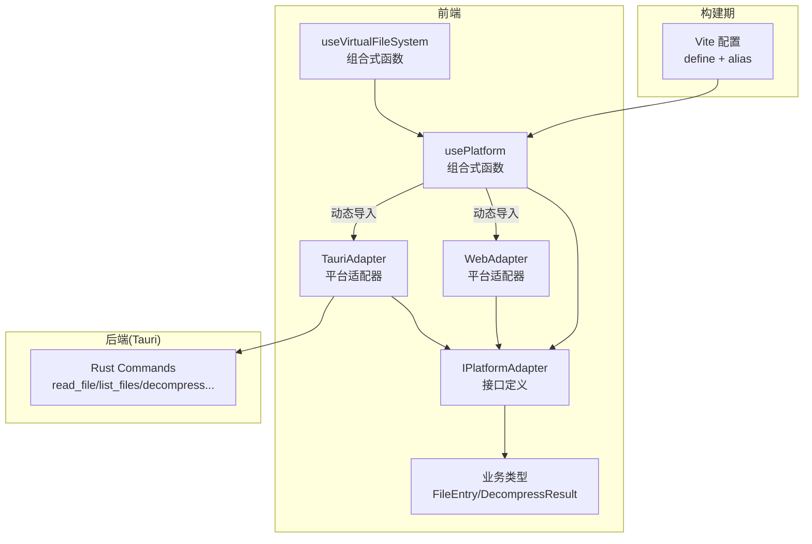
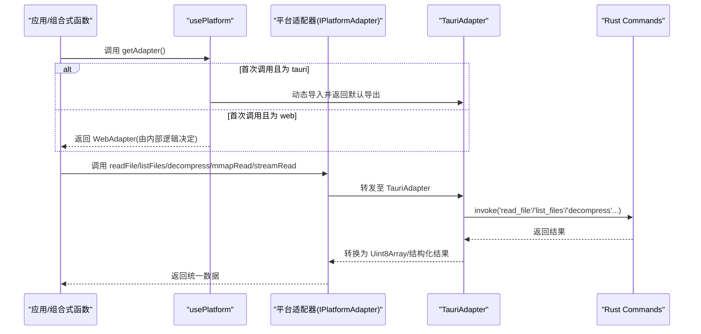
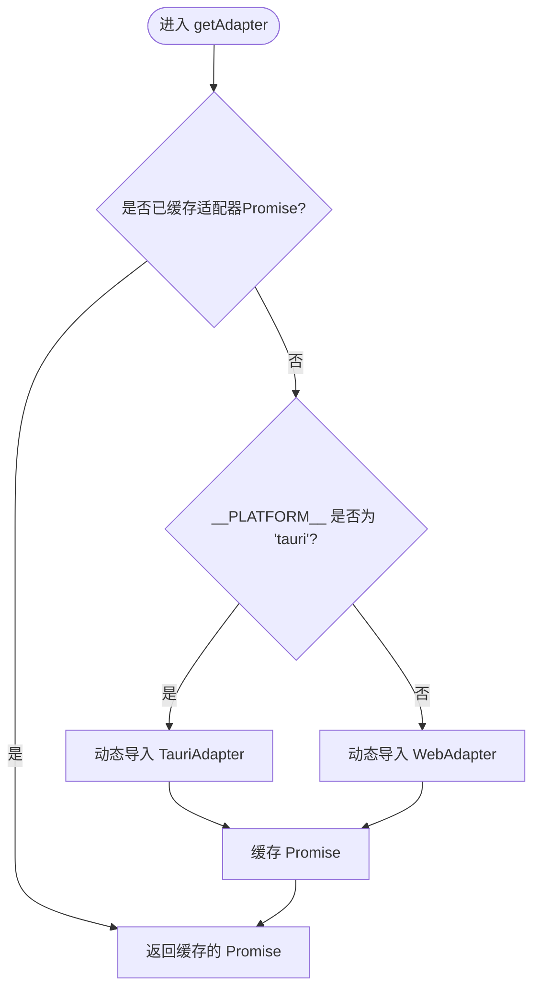
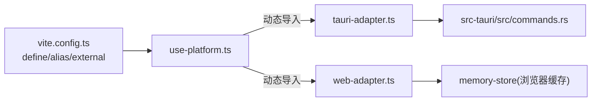

# 平台适配 (usePlatform)

<cite>
**本文引用的文件**   
- [src/composables/use-platform.ts](file://src/composables/use-platform.ts)
- [src/adapters/types.ts](file://src/adapters/types.ts)
- [src/adapters/tauri-adapter.ts](file://src/adapters/tauri-adapter.ts)
- [src/adapters/web-adapter.ts](file://src/adapters/web-adapter.ts)
- [src/composables/use-vfs.ts](file://src/composables/use-vfs.ts)
- [vite.config.ts](file://vite.config.ts)
- [AGENTS.md](file://AGENTS.md)
- [src-tauri/src/commands.rs](file://src-tauri/src/commands.rs)
- [src/types/index.ts](file://src/types/index.ts)
</cite>

## 目录
1. [简介](#简介)
2. [项目结构](#项目结构)
3. [核心组件](#核心组件)
4. [架构总览](#架构总览)
5. [详细组件分析](#详细组件分析)
6. [依赖关系分析](#依赖关系分析)
7. [性能考量](#性能考量)
8. [故障排查指南](#故障排查指南)
9. [结论](#结论)
10. [附录](#附录)

## 简介
本文件围绕 usePlatform 组合式函数，系统化阐述跨平台适配层的设计与实现。重点覆盖：
- 编译期平台切换与运行时适配器选择
- 操作系统检测、用户代理识别的扩展点
- 平台特定能力封装（文件系统、内存映射、流式读取、解压）
- 快捷键映射与系统托盘集成的接入位置与最佳实践
- 可移植代码编写规范、条件渲染策略
- 新平台支持扩展指南与兼容性测试策略

## 项目结构
usePlatform 位于组合式函数目录中，通过动态导入在运行时选择具体平台适配器；构建期由 Vite 注入全局常量并配置别名，确保产物不包含无关平台的依赖。

图表来源
- [src/composables/use-platform.ts:1-24](file://src/composables/use-platform.ts#L1-L24)
- [src/adapters/types.ts:1-12](file://src/adapters/types.ts#L1-L12)
- [src/adapters/tauri-adapter.ts:1-62](file://src/adapters/tauri-adapter.ts#L1-L62)
- [src/adapters/web-adapter.ts:1-73](file://src/adapters/web-adapter.ts#L1-L73)
- [src/composables/use-vfs.ts:1-17](file://src/composables/use-vfs.ts#L1-L17)
- [vite.config.ts:1-27](file://vite.config.ts#L1-L27)
- [src-tauri/src/commands.rs:1-53](file://src-tauri/src/commands.rs#L1-L53)
- [src/types/index.ts:1-71](file://src/types/index.ts#L1-L71)

章节来源
- [src/composables/use-platform.ts:1-24](file://src/composables/use-platform.ts#L1-L24)
- [vite.config.ts:1-27](file://vite.config.ts#L1-L27)
- [AGENTS.md:52-76](file://AGENTS.md#L52-L76)

## 核心组件
- usePlatform 组合式函数
  - 职责：提供 getAdapter 异步获取当前平台适配器实例；暴露 isTauri/isWeb 布尔标识用于条件逻辑。
  - 关键特性：懒加载与单例缓存适配器 Promise，避免重复动态导入；基于 __PLATFORM__ 进行分支选择。
- IPlatformAdapter 接口
  - 职责：统一抽象跨平台能力（读/写、列举、临时目录、解压、内存映射、流式读取）。
- TauriAdapter / WebAdapter
  - 职责：分别实现 IPlatformAdapter，在 Tauri 环境下调用 Rust 命令，在 Web 环境下使用 fetch/ReadableStream/内存存储等浏览器能力。
- useVirtualFileSystem
  - 职责：基于 usePlatform 提供的适配器，向上层提供统一的虚拟文件系统 API。

章节来源
- [src/composables/use-platform.ts:1-24](file://src/composables/use-platform.ts#L1-L24)
- [src/adapters/types.ts:1-12](file://src/adapters/types.ts#L1-L12)
- [src/adapters/tauri-adapter.ts:1-62](file://src/adapters/tauri-adapter.ts#L1-L62)
- [src/adapters/web-adapter.ts:1-73](file://src/adapters/web-adapter.ts#L1-L73)
- [src/composables/use-vfs.ts:1-17](file://src/composables/use-vfs.ts#L1-L17)

## 架构总览
下图展示了从组合式函数到平台适配器再到后端命令的整体数据与控制流。

图表来源
- [src/composables/use-platform.ts:5-16](file://src/composables/use-platform.ts#L5-L16)
- [src/adapters/tauri-adapter.ts:14-59](file://src/adapters/tauri-adapter.ts#L14-L59)
- [src-tauri/src/commands.rs:5-52](file://src-tauri/src/commands.rs#L5-L52)

## 详细组件分析

### usePlatform 组合式函数
- 设计要点
  - 通过 __PLATFORM__ 在运行期判断目标平台，动态导入对应适配器模块。
  - 使用 adapterPromise 缓存首次解析后的适配器 Promise，后续调用直接复用，降低开销。
  - 暴露 isTauri/isWeb 布尔值，便于上层做条件渲染或行为分支。
- 典型用法
  - 在组合式函数或插件初始化时获取适配器，再调用其方法完成平台相关操作。
  - 在模板中如需使用平台常量，需先赋值给局部变量以避免 TS 报错。

图表来源
- [src/composables/use-platform.ts:5-16](file://src/composables/use-platform.ts#L5-L16)
- [vite.config.ts:9-11](file://vite.config.ts#L9-L11)

章节来源
- [src/composables/use-platform.ts:1-24](file://src/composables/use-platform.ts#L1-L24)
- [AGENTS.md:70-76](file://AGENTS.md#L70-L76)

### IPlatformAdapter 接口与类型
- 接口能力
  - 文件读写、目录列举、临时目录获取、解压、内存映射读取、流式读取。
- 类型约定
  - FileEntry、DecompressResult 等类型集中定义，保证前后端数据结构一致。

章节来源
- [src/adapters/types.ts:1-12](file://src/adapters/types.ts#L1-L12)
- [src/types/index.ts:1-71](file://src/types/index.ts#L1-L71)

### TauriAdapter 实现
- 与后端交互
  - 通过 @tauri-apps/api/core.invoke 调用 Rust 命令，如 read_file、write_file、list_files、get_temp_dir、mmap_read、decompress。
- 注意事项
  - streamRead 在当前实现中采用全量读取后包装为 ReadableStream，后续可通过事件或专用插件优化为分块传输。
- 错误处理
  - 将 Rust 侧错误透传至上层，调用方应捕获并提示。

章节来源
- [src/adapters/tauri-adapter.ts:1-62](file://src/adapters/tauri-adapter.ts#L1-L62)
- [src-tauri/src/commands.rs:1-53](file://src-tauri/src/commands.rs#L1-L53)

### WebAdapter 实现
- 浏览器能力
  - 使用 fetch 进行文件读取，支持 Range 头实现 mmapRead 的部分读取。
  - streamRead 基于 Response.body.getReader 实现真正的流式读取。
  - 未实现的能力（如 writeFile、listFiles、decompress）抛出明确错误，便于上层降级或提示。
- 缓存策略
  - 结合 memoryStore 对已读取内容进行缓存，减少重复网络请求。

章节来源
- [src/adapters/web-adapter.ts:1-73](file://src/adapters/web-adapter.ts#L1-L73)

### 使用示例：useVirtualFileSystem
- 通过 usePlatform 获取适配器，再封装出更高层的 API（如 readFile、listDir），屏蔽底层差异。

章节来源
- [src/composables/use-vfs.ts:1-17](file://src/composables/use-vfs.ts#L1-L17)

## 依赖关系分析
- 构建期
  - Vite define 注入 __PLATFORM__ 常量；alias 根据平台选择适配器入口；web 构建时将 @tauri-apps/api 标记为 external，避免打包进产物。
- 运行期
  - usePlatform 根据 __PLATFORM__ 动态导入对应适配器；TauriAdapter 依赖 @tauri-apps/api/core.invoke 与 Rust 命令；WebAdapter 依赖浏览器 API 与内存存储。

图表来源
- [vite.config.ts:1-27](file://vite.config.ts#L1-L27)
- [src/composables/use-platform.ts:1-24](file://src/composables/use-platform.ts#L1-L24)
- [src/adapters/tauri-adapter.ts:1-62](file://src/adapters/tauri-adapter.ts#L1-L62)
- [src/adapters/web-adapter.ts:1-73](file://src/adapters/web-adapter.ts#L1-L73)
- [src-tauri/src/commands.rs:1-53](file://src-tauri/src/commands.rs#L1-L53)

章节来源
- [vite.config.ts:1-27](file://vite.config.ts#L1-L27)
- [AGENTS.md:70-76](file://AGENTS.md#L70-L76)

## 性能考量
- 懒加载与缓存
  - usePlatform 的适配器 Promise 仅创建一次，避免重复 import 与 IPC 初始化。
- 流式与分块
  - WebAdapter 的 streamRead 利用浏览器原生流；TauriAdapter 当前为全量读取后包装流，建议后续引入事件或专用插件以支持分块传输，降低大文件内存占用。
- 缓存命中
  - WebAdapter 结合 memoryStore 提升重复访问性能；建议在需要时增加过期策略与容量限制。
- 构建体积
  - 通过 Vite external 排除 Tauri 依赖，减小 Web 包体；按需引入避免无用代码进入产物。

[本节为通用指导，不直接分析具体文件]

## 故障排查指南
- 常见错误与定位
  - 路径穿越防护：Tauri 侧对包含 ".." 的路径拒绝访问，检查传入路径合法性。
  - Web 模式不支持写入/列举/解压：WebAdapter 会抛出明确错误，应在 UI 上给出降级提示或引导用户使用 Tauri 版本。
  - HTTP 状态码异常：WebAdapter 在 fetch 失败时抛出带状态码的错误信息，检查资源路径与服务器响应。
- 调试建议
  - 确认 __PLATFORM__ 的值是否符合预期（构建期 define）。
  - 在 Tauri 模式下，检查 Rust 命令是否正确注册以及权限配置是否满足。
  - 对于流式读取，优先使用 streamRead 而非一次性读取，避免 OOM。

章节来源
- [src-tauri/src/commands.rs:6-14](file://src-tauri/src/commands.rs#L6-L14)
- [src/adapters/web-adapter.ts:15-29](file://src/adapters/web-adapter.ts#L15-L29)
- [src/adapters/web-adapter.ts:31-40](file://src/adapters/web-adapter.ts#L31-L40)

## 结论
usePlatform 通过“编译期平台常量 + 运行期动态导入”的组合，实现了低耦合、可扩展的跨平台适配层。配合 IPlatformAdapter 的统一抽象，上层业务无需关心底层差异即可在 Web 与 Tauri 之间无缝切换。未来可在流式读取、系统托盘、快捷键等方面继续完善平台能力封装，进一步提升可移植性与用户体验。

[本节为总结性内容，不直接分析具体文件]

## 附录

### 平台检测与用户代理识别
- 当前实现
  - 使用 __PLATFORM__ 区分 tauri/web 两种环境。
- 扩展建议
  - 在适配器中新增 detectOS/detectUA 等方法，封装 navigator.userAgent、window.navigator 等平台信息，供上层进行差异化处理。
  - 在 Tauri 侧通过 Rust 的 std::env/os crate 获取 OS 信息，并通过 IPC 暴露给前端。

[本节为概念性说明，不直接分析具体文件]

### 快捷键映射
- 现状
  - 当前仓库未在前端实现快捷键映射逻辑。
- 接入建议
  - 在 Tauri 模式下，使用 @tauri-apps/api/menu 或 window 快捷键 API 注册全局快捷键，并在菜单项中设置 accelerator。
  - 在 Web 模式下，监听 document 的 keydown 事件，按平台差异处理修饰键（如 Ctrl/Cmd）。
  - 将快捷键绑定逻辑封装到适配器或独立模块，通过 usePlatform 暴露统一入口。

[本节为概念性说明，不直接分析具体文件]

### 系统托盘集成
- 现状
  - 前端未实现托盘功能；Rust 依赖中包含 tray-icon 等库，具备集成基础。
- 接入建议
  - 在 Tauri 主进程中使用托盘 API 创建图标、菜单与点击事件，并通过事件或 IPC 通知前端更新 UI。
  - 在 Web 模式下，托盘不可用，应提供替代方案（如通知中心或常驻标签页提示）。

[本节为概念性说明，不直接分析具体文件]

### 可移植代码最佳实践
- 始终通过 usePlatform 获取适配器，避免直接 import 平台特定模块。
- 在模板中如需使用 __PLATFORM__，先赋值给局部常量再引用。
- 对不支持的平台能力，抛出明确错误并提供降级体验。
- 将平台差异收敛在适配器层，保持业务逻辑纯净。

章节来源
- [src/composables/use-platform.ts:18-24](file://src/composables/use-platform.ts#L18-L24)
- [AGENTS.md:70-76](file://AGENTS.md#L70-L76)

### 条件渲染与平台分支
- 推荐做法
  - 使用 isTauri/isWeb 控制 UI 显示与交互分支。
  - 将平台相关的样式、文案、行为封装在适配器或配置对象中，减少散落的 if-else。
- 示例思路
  - 在工具栏中根据平台展示不同的按钮与快捷键提示。
  - 在文件操作面板中，针对 Web 模式隐藏写入/解压入口。

[本节为概念性说明，不直接分析具体文件]

### 新平台支持扩展指南
- 步骤
  - 新增适配器实现 IPlatformAdapter（例如 ElectronAdapter）。
  - 在 usePlatform 中添加对新平台常量的判断与动态导入。
  - 在 Vite 配置中扩展 define 与 alias，支持新的平台环境变量。
  - 在 AGENTS.md 或 README 中补充构建与运行说明。
- 验证
  - 单元测试覆盖新适配器的关键路径。
  - 端到端测试在不同平台下验证核心流程（读取、列表、解压、流式读取）。

[本节为概念性说明，不直接分析具体文件]

### 兼容性测试策略
- 单元与集成测试
  - 为 IPlatformAdapter 各方法编写 Mock 用例，覆盖成功、失败、边界情况。
- 平台矩阵
  - 在 CI 中并行执行 web/tauri 两套构建与测试，确保产物与行为符合预期。
- 回归场景
  - 大文件流式读取、Range 请求、HTTP 错误、路径穿越、权限不足等。

[本节为概念性说明，不直接分析具体文件]