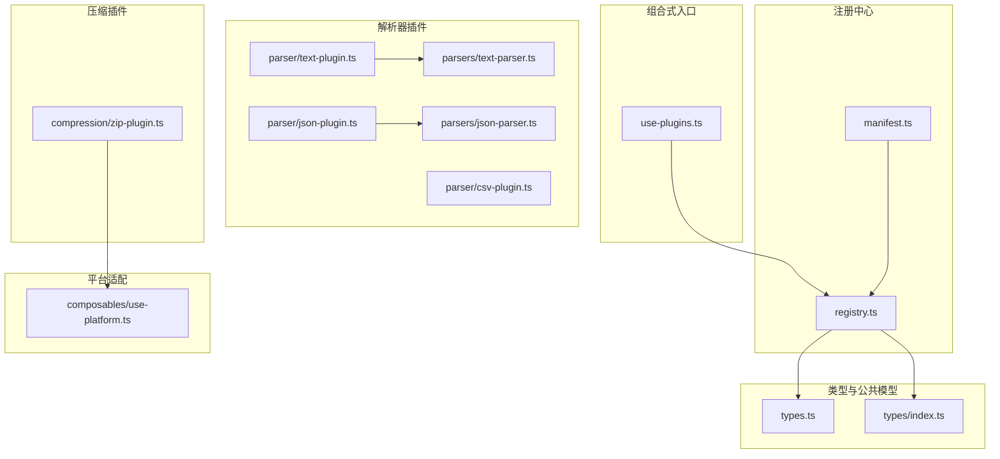
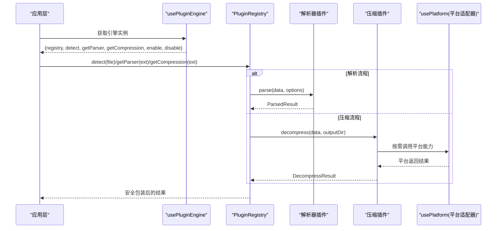
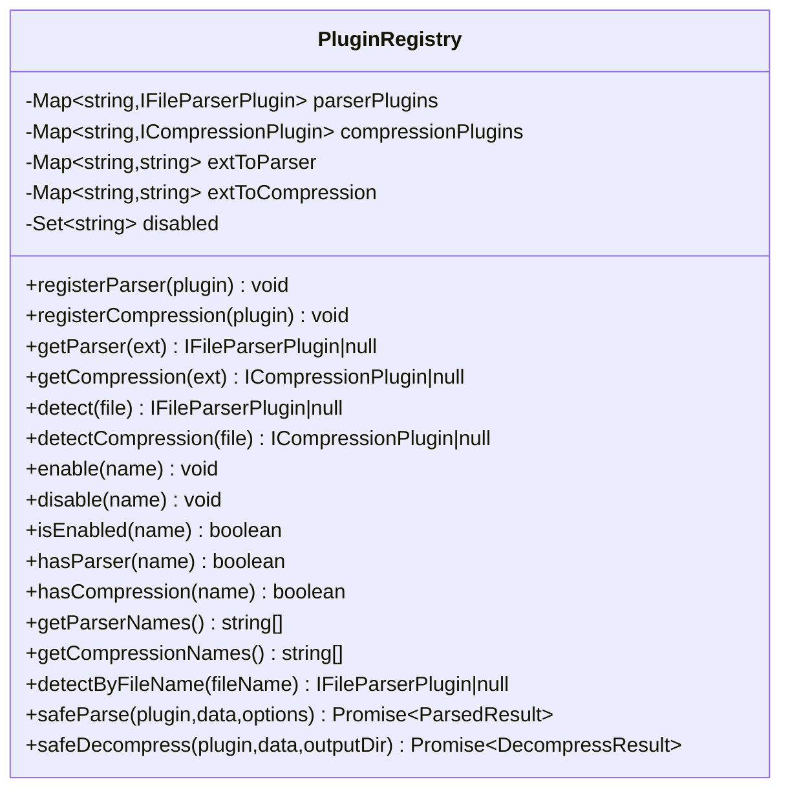
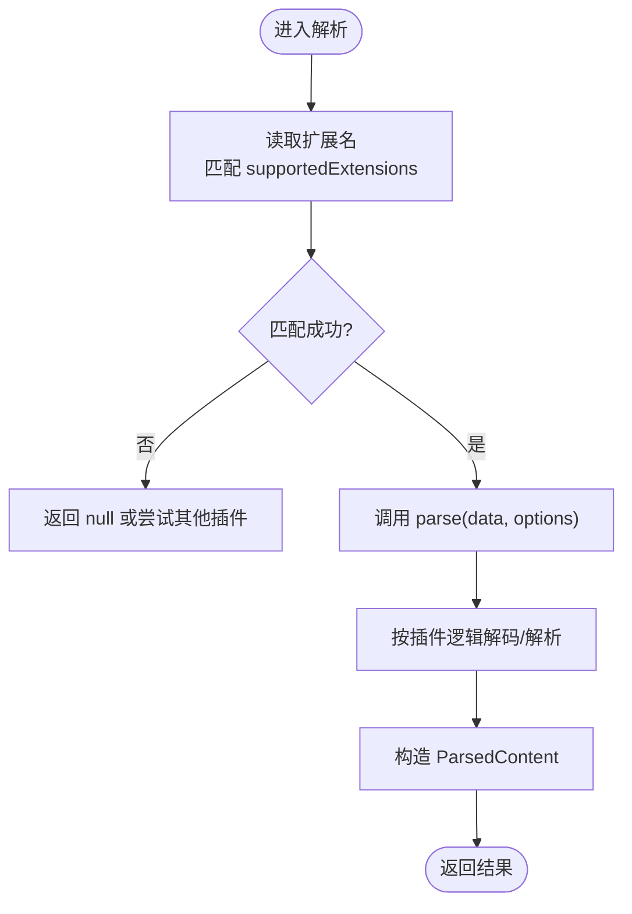
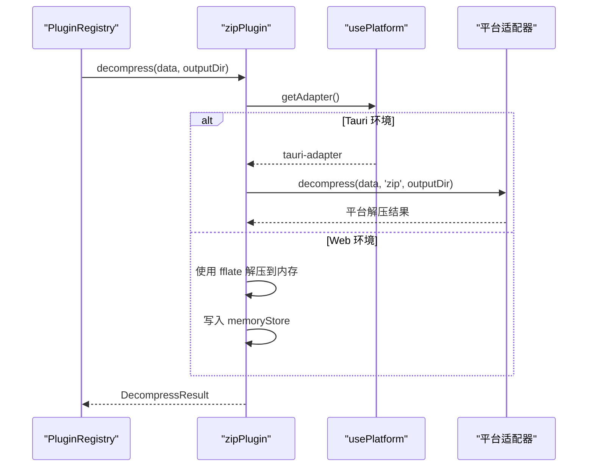
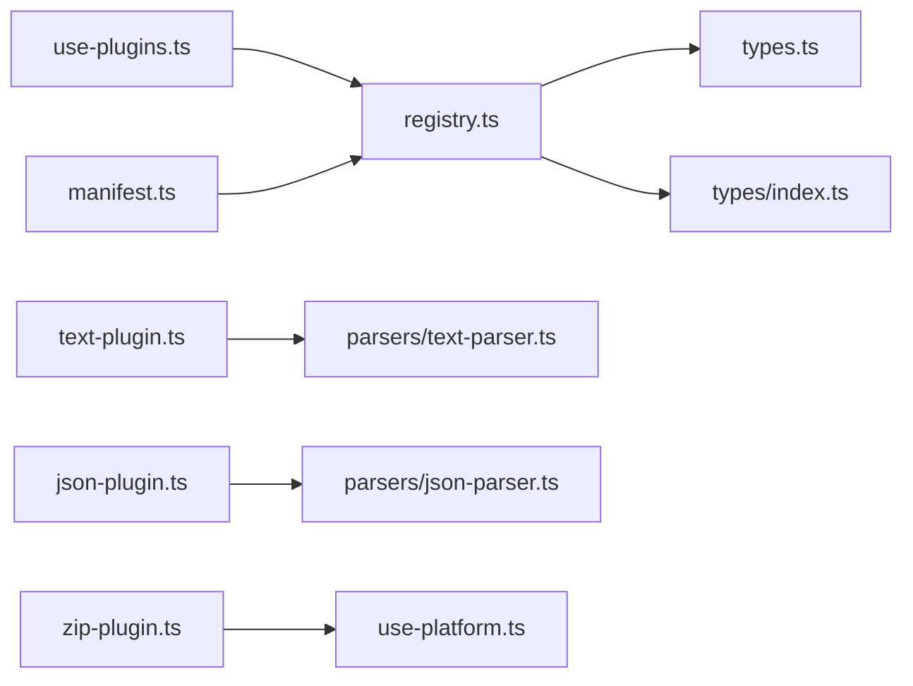

# 插件管理 (usePlugins)

<cite>
**本文引用的文件**   
- [src/composables/use-plugins.ts](file://src/composables/use-plugins.ts)
- [src/plugins/registry.ts](file://src/plugins/registry.ts)
- [src/plugins/types.ts](file://src/plugins/types.ts)
- [src/plugins/manifest.ts](file://src/plugins/manifest.ts)
- [src/plugins/parser/text-plugin.ts](file://src/plugins/parser/text-plugin.ts)
- [src/plugins/parser/csv-plugin.ts](file://src/plugins/parser/csv-plugin.ts)
- [src/plugins/parser/json-plugin.ts](file://src/plugins/parser/json-plugin.ts)
- [src/plugins/compression/zip-plugin.ts](file://src/plugins/compression/zip-plugin.ts)
- [src/plugins/parsers/text-parser.ts](file://src/plugins/parsers/text-parser.ts)
- [src/plugins/parsers/json-parser.ts](file://src/plugins/parsers/json-parser.ts)
- [src/types/index.ts](file://src/types/index.ts)
- [src/composables/use-platform.ts](file://src/composables/use-platform.ts)
- [src/__tests__/plugins/registry.test.ts](file://src/__tests__/plugins/registry.test.ts)
- [src/__tests__/plugins/text-plugin.test.ts](file://src/__tests__/plugins/text-plugin.test.ts)
- [src/__tests__/plugins/json-plugin.test.ts](file://src/__tests__/plugins/json-plugin.test.ts)
</cite>

## 更新摘要
**变更内容**   
- 增强了 usePluginEngine 组合式函数的 JSDoc 文档，详细说明了所有暴露方法的参数、返回值和行为特性
- 完善了 PluginRegistry 类的完整 API 文档，包括新增的方法如 detectByFileName、hasParser、hasCompression 等
- 更新了插件接口规范的详细说明，包含完整的类型定义和可选属性说明
- 增强了安全执行机制的文档描述，包括超时保护和异常兜底策略

## 目录
1. [简介](#简介)
2. [项目结构](#项目结构)
3. [核心组件](#核心组件)
4. [架构总览](#架构总览)
5. [详细组件分析](#详细组件分析)
6. [依赖分析](#依赖分析)
7. [性能考虑](#性能考虑)
8. [故障排查指南](#故障排查指南)
9. [结论](#结论)
10. [附录](#附录)

## 简介
本文件围绕 usePlugins 组合式函数及其背后的插件系统，提供从运行时管理到开发实践的全景文档。内容涵盖：
- 插件发现、加载、注册与生命周期控制（启用/禁用）
- 插件接口规范（解析器与压缩处理器）
- 依赖注入机制（平台适配器动态加载）
- 插件间通信协议（统一数据模型与结果类型）
- 插件清单与内置插件注册
- 安全沙箱（超时保护与异常兜底）
- 版本兼容性与动态更新策略建议
- 测试策略与最佳实践

## 项目结构
插件系统位于 src/plugins 与 src/composables 下，配合 types 定义与测试用例形成闭环。

**图表来源**
- [src/composables/use-plugins.ts:1-44](file://src/composables/use-plugins.ts#L1-L44)
- [src/plugins/registry.ts:1-207](file://src/plugins/registry.ts#L1-L207)
- [src/plugins/manifest.ts:1-25](file://src/plugins/manifest.ts#L1-L25)
- [src/plugins/types.ts:1-94](file://src/plugins/types.ts#L1-L94)
- [src/types/index.ts:1-148](file://src/types/index.ts#L1-L148)
- [src/plugins/parser/text-plugin.ts:1-20](file://src/plugins/parser/text-plugin.ts#L1-L20)
- [src/plugins/parser/csv-plugin.ts:1-28](file://src/plugins/parser/csv-plugin.ts#L1-L28)
- [src/plugins/parser/json-plugin.ts:1-19](file://src/plugins/parser/json-plugin.ts#L1-L19)
- [src/plugins/compression/zip-plugin.ts:1-42](file://src/plugins/compression/zip-plugin.ts#L1-L42)
- [src/composables/use-platform.ts:1-35](file://src/composables/use-platform.ts#L1-L35)

**章节来源**
- [src/composables/use-plugins.ts:1-44](file://src/composables/use-plugins.ts#L1-L44)
- [src/plugins/registry.ts:1-207](file://src/plugins/registry.ts#L1-L207)
- [src/plugins/manifest.ts:1-25](file://src/plugins/manifest.ts#L1-L25)
- [src/plugins/types.ts:1-94](file://src/plugins/types.ts#L1-L94)
- [src/types/index.ts:1-148](file://src/types/index.ts#L1-L148)

## 核心组件
- **usePluginEngine**：组合式入口，暴露 registry 实例及便捷方法（detect、getParser、getCompression、enable、disable），并自动注册内置插件。
- **PluginRegistry**：插件注册中心，维护解析器与压缩插件映射、扩展名索引、启用/禁用状态，并提供安全调用包装（safeParse/safeDecompress）。
- **插件清单 manifest**：集中注册内置解析器与压缩插件。
- **插件类型定义**：IFileParserPlugin、ICompressionPlugin、ParsedResult、ConfigSchema 等。
- **具体插件实现**：text/csv/json 解析器与 zip 压缩器示例。
- **平台适配**：通过 usePlatform 动态加载 Tauri/Web 适配器，用于压缩解压等能力。

**章节来源**
- [src/composables/use-plugins.ts:1-44](file://src/composables/use-plugins.ts#L1-L44)
- [src/plugins/registry.ts:1-207](file://src/plugins/registry.ts#L1-L207)
- [src/plugins/manifest.ts:1-25](file://src/plugins/manifest.ts#L1-L25)
- [src/plugins/types.ts:1-94](file://src/plugins/types.ts#L1-L94)
- [src/plugins/parser/text-plugin.ts:1-20](file://src/plugins/parser/text-plugin.ts#L1-L20)
- [src/plugins/parser/csv-plugin.ts:1-28](file://src/plugins/parser/csv-plugin.ts#L1-L28)
- [src/plugins/parser/json-plugin.ts:1-19](file://src/plugins/parser/json-plugin.ts#L1-L19)
- [src/plugins/compression/zip-plugin.ts:1-42](file://src/plugins/compression/zip-plugin.ts#L1-L42)
- [src/composables/use-platform.ts:1-35](file://src/composables/use-platform.ts#L1-L35)

## 架构总览
usePlugins 作为应用侧的统一入口，内部持有单一 PluginRegistry 实例，并在初始化时通过清单注册所有内置插件。上层业务通过 usePluginEngine 获取能力，按扩展名或文件名进行插件探测与调用。

**图表来源**
- [src/composables/use-plugins.ts:1-44](file://src/composables/use-plugins.ts#L1-L44)
- [src/plugins/registry.ts:1-207](file://src/plugins/registry.ts#L1-L207)
- [src/plugins/compression/zip-plugin.ts:1-42](file://src/plugins/compression/zip-plugin.ts#L1-L42)
- [src/composables/use-platform.ts:1-35](file://src/composables/use-platform.ts#L1-L35)

## 详细组件分析

### 组合式入口 usePluginEngine

**增强** 详细的 JSDoc 文档说明每个方法的参数、返回值和行为特性

- **职责**：创建并缓存一个 PluginRegistry 实例；在模块加载时即完成内置插件注册；对外暴露 registry 与便捷方法。
- **关键点**：
  - 单例化 registry，避免重复注册。
  - 将 detect/getParser/getCompression/enable/disable 透传到 registry，简化上层使用。
- **典型用法**：
  - 根据文件扩展名获取解析器或压缩器。
  - 对文件进行探测并选择对应插件。
  - 动态启用/禁用某插件。

**方法详解**：
- `detect(file: FileEntry)`：检测文件对应的解析插件，返回匹配的解析插件或 null
- `getParser(ext: string)`：根据扩展名获取解析插件，返回对应的解析插件或 null  
- `getCompression(ext: string)`：根据扩展名获取压缩插件，返回对应的压缩插件或 null
- `enable(name: string)`：启用指定插件，无返回值
- `disable(name: string)`：禁用指定插件，无返回值

**章节来源**
- [src/composables/use-plugins.ts:1-44](file://src/composables/use-plugins.ts#L1-L44)

### 插件注册中心 PluginRegistry

**增强** 完整的类方法和属性的 JSDoc 文档，包含所有新增方法

- **数据结构**：
  - parserPlugins/compressionPlugins：以插件名为键的 Map。
  - extToParser/extToCompression：扩展名到插件名的反向索引，加速查找。
  - disabled：被禁用的插件名集合。
- **核心能力**：
  - registerParser/registerCompression：注册插件并建立扩展名映射。
  - getParser/getCompression/detect/detectCompression：按扩展名或文件名探测可用插件，且忽略已禁用项。
  - enable/disable/isEnabled：生命周期控制。
  - hasParser/hasCompression：检查插件是否已注册。
  - getParserNames/getCompressionNames：获取已注册插件名称列表。
  - detectByFileName：根据文件名检测解析插件。
  - safeParse/safeDecompress：带超时与异常兜底的安全调用封装。
- **超时与兜底**：
  - withTimeout 为插件执行设置超时（默认 30 秒），超时抛出错误。
  - safeParse 失败时回退为 hex 类型结果，保障 UI 可降级展示。
  - safeDecompress 失败时返回结构化错误信息。

**图表来源**
- [src/plugins/registry.ts:1-207](file://src/plugins/registry.ts#L1-L207)

**章节来源**
- [src/plugins/registry.ts:1-207](file://src/plugins/registry.ts#L1-L207)

### 插件清单与内置插件注册
- **清单职责**：集中导入并注册内置解析器与压缩器，确保应用启动即可用。
- **当前内置**：
  - 压缩：zip、gzip
  - 解析：text、csv、json、log、hex

**章节来源**
- [src/plugins/manifest.ts:1-25](file://src/plugins/manifest.ts#L1-L25)

### 插件接口规范与数据模型

**增强** 详细的接口属性和方法说明，包含可选属性和类型约束

- **IFileParserPlugin**：
  - name：唯一标识
  - supportedExtensions：支持的扩展名列表
  - canParse：基于文件对象判断是否可解析
  - parse：异步解析二进制数据，返回 ParsedContent
  - getComponent：返回渲染该数据的 Vue 组件
  - getConfigSchema（可选）：声明配置字段，供 UI 生成表单
- **ICompressionPlugin**：
  - name、supportedExtensions、canHandle、decompress
- **ParsedContent**：
  - type：'text'|'csv'|'json'|'hex'|'log'
  - data：解析后的数据（根据 type 精确推断类型）
  - lineCount：行数统计（可选）
  - loadTimeMs：加载时间（可选）
  - pluginName：插件名称（可选）
  - encoding：编码信息（可选）
  - size：文件大小（可选）
- **ConfigSchema/ConfigField**：
  - fields：配置字段数组，支持 input/select/switch/number 等类型
- **公共类型**：
  - FileEntry、DecompressResult、ArchiveItem、TabItem 等

**章节来源**
- [src/plugins/types.ts:1-94](file://src/plugins/types.ts#L1-L94)
- [src/types/index.ts:1-148](file://src/types/index.ts#L1-L148)

### 解析器插件示例与实现模式
- **text 插件**：
  - 支持常见文本扩展名（.txt, .md, .cfg, .ini, .env, .yaml, .yml, .toml）
  - 使用 parsers/text-parser 进行解码与行数统计
  - 返回 TextRenderer 组件
- **csv 插件**：
  - 支持 .csv/.tsv
  - 支持通过 options.delimiter 指定分隔符
  - 提供 getConfigSchema 定义分隔符与固定表头开关
- **json 插件**：
  - 支持 .json/.jsonl
  - 使用 parsers/json-parser 处理标准 JSON 与 JSON Lines
  - 返回 JsonRenderer 组件

**图表来源**
- [src/plugins/parser/text-plugin.ts:1-20](file://src/plugins/parser/text-plugin.ts#L1-L20)
- [src/plugins/parser/csv-plugin.ts:1-28](file://src/plugins/parser/csv-plugin.ts#L1-L28)
- [src/plugins/parser/json-plugin.ts:1-19](file://src/plugins/parser/json-plugin.ts#L1-L19)
- [src/plugins/parsers/text-parser.ts:1-8](file://src/plugins/parsers/text-parser.ts#L1-L8)
- [src/plugins/parsers/json-parser.ts:1-17](file://src/plugins/parsers/json-parser.ts#L1-L17)

**章节来源**
- [src/plugins/parser/text-plugin.ts:1-20](file://src/plugins/parser/text-plugin.ts#L1-L20)
- [src/plugins/parser/csv-plugin.ts:1-28](file://src/plugins/parser/csv-plugin.ts#L1-L28)
- [src/plugins/parser/json-plugin.ts:1-19](file://src/plugins/parser/json-plugin.ts#L1-L19)
- [src/plugins/parsers/text-parser.ts:1-8](file://src/plugins/parsers/text-parser.ts#L1-L8)
- [src/plugins/parsers/json-parser.ts:1-17](file://src/plugins/parsers/json-parser.ts#L1-L17)

### 压缩处理器示例与平台适配
- **zip 插件**：
  - 在 Tauri 环境下通过 usePlatform 获取平台适配器，调用其 decompress 能力
  - 在非 Tauri 环境使用 fflate 进行内存解压，并将文件写入 memoryStore
  - 返回统一的 DecompressResult
- **平台适配**：
  - usePlatform 根据 __PLATFORM__ 动态加载 tauri-adapter 或 web-adapter
  - 保证同一插件在不同运行环境具备一致行为

**图表来源**
- [src/plugins/compression/zip-plugin.ts:1-42](file://src/plugins/compression/zip-plugin.ts#L1-L42)
- [src/composables/use-platform.ts:1-35](file://src/composables/use-platform.ts#L1-L35)

**章节来源**
- [src/plugins/compression/zip-plugin.ts:1-42](file://src/plugins/compression/zip-plugin.ts#L1-L42)
- [src/composables/use-platform.ts:1-35](file://src/composables/use-platform.ts#L1-L35)

### 安全沙箱与容错机制

**增强** 详细的超时保护和异常兜底机制说明
- **超时保护**：withTimeout 限制插件执行时间，防止阻塞主线程。
- **异常兜底**：
  - safeParse 捕获异常后返回 hex 类型，确保 UI 仍可展示原始字节。
  - safeDecompress 捕获异常后返回结构化失败结果，包含错误消息。
- **建议**：
  - 在插件中尽量避免长时间同步计算，必要时分片或上报进度。
  - 对大文件输入进行大小校验与流式处理（可扩展）。

**章节来源**
- [src/plugins/registry.ts:1-207](file://src/plugins/registry.ts#L1-L207)

### 版本兼容性与动态更新机制（设计建议）
- **版本兼容性检查**：
  - 在插件元信息中声明 API 版本范围，注册时校验宿主版本是否满足要求。
  - 对破坏性变更采用向后兼容的解析策略或迁移脚本。
- **动态更新**：
  - 支持热插拔：在运行时新增/移除插件（需扩展 registry 的卸载能力）。
  - 增量更新：仅替换变更的插件包，保持 registry 状态稳定。
  - 灰度发布：按扩展名或命名空间分流，逐步放量。
- **注意**：
  - 当前仓库未实现卸载与热更，可在 registry 基础上扩展 removePlugin、reloadPlugin 等方法。

[本节为概念性设计建议，不直接分析具体源码]

### 插件间通信协议（约定）
- **统一输入输出**：
  - 解析器输入：Uint8Array 与可选 options
  - 解析器输出：ParsedContent（type/data/lineCount 等）
  - 压缩器输入：Uint8Array 与输出目录
  - 压缩器输出：DecompressResult（success/files/error）
- **渲染契约**：
  - 解析器通过 getComponent 返回渲染组件，由上层根据 ParsedContent.type 选择渲染器。
- **配置契约**：
  - 可选 getConfigSchema 描述配置字段，UI 据此生成表单并传入 options。

**章节来源**
- [src/plugins/types.ts:1-94](file://src/plugins/types.ts#L1-94)
- [src/types/index.ts:1-148](file://src/types/index.ts#L1-148)

### 测试策略与实践
- **注册中心测试**：
  - 验证按扩展名注册与检索、检测、启用/禁用、安全包装的兜底行为。
- **插件单元测试**：
  - 针对 canParse/parse 的行为断言，覆盖空文件、边界字符集、非法输入等场景。
- **推荐补充**：
  - 集成测试：模拟完整解析/解压链路，验证 Registry 与插件协作。
  - 性能回归：对大文件解析/解压进行基准测试。

**章节来源**
- [src/__tests__/plugins/registry.test.ts:1-98](file://src/__tests__/plugins/registry.test.ts#L1-98)
- [src/__tests__/plugins/text-plugin.test.ts:1-30](file://src/__tests__/plugins/text-plugin.test.ts#L1-30)
- [src/__tests__/plugins/json-plugin.test.ts:1-30](file://src/__tests__/plugins/json-plugin.test.ts#L1-30)

## 依赖分析
- **低耦合高内聚**：
  - usePluginEngine 仅依赖 registry 与 manifest，职责清晰。
  - registry 通过类型约束与 Map/Set 组织插件，避免硬编码分支。
- **外部依赖**：
  - 压缩插件在 Web 环境依赖 fflate（按需 import）。
  - 平台能力通过 usePlatform 动态加载，解耦平台差异。

**图表来源**
- [src/composables/use-plugins.ts:1-44](file://src/composables/use-plugins.ts#L1-L44)
- [src/plugins/registry.ts:1-207](file://src/plugins/registry.ts#L1-L207)
- [src/plugins/manifest.ts:1-25](file://src/plugins/manifest.ts#L1-L25)
- [src/plugins/types.ts:1-94](file://src/plugins/types.ts#L1-94)
- [src/types/index.ts:1-148](file://src/types/index.ts#L1-148)
- [src/plugins/parser/text-plugin.ts:1-20](file://src/plugins/parser/text-plugin.ts#L1-L20)
- [src/plugins/parser/json-plugin.ts:1-19](file://src/plugins/parser/json-plugin.ts#L1-L19)
- [src/plugins/compression/zip-plugin.ts:1-42](file://src/plugins/compression/zip-plugin.ts#L1-L42)
- [src/composables/use-platform.ts:1-35](file://src/composables/use-platform.ts#L1-L35)

**章节来源**
- [src/composables/use-plugins.ts:1-44](file://src/composables/use-plugins.ts#L1-L44)
- [src/plugins/registry.ts:1-207](file://src/plugins/registry.ts#L1-L207)
- [src/plugins/manifest.ts:1-25](file://src/plugins/manifest.ts#L1-L25)
- [src/plugins/types.ts:1-94](file://src/plugins/types.ts#L1-94)
- [src/types/index.ts:1-148](file://src/types/index.ts#L1-148)
- [src/plugins/parser/text-plugin.ts:1-20](file://src/plugins/parser/text-plugin.ts#L1-L20)
- [src/plugins/parser/json-plugin.ts:1-19](file://src/plugins/parser/json-plugin.ts#L1-L19)
- [src/plugins/compression/zip-plugin.ts:1-42](file://src/plugins/compression/zip-plugin.ts#L1-L42)
- [src/composables/use-platform.ts:1-35](file://src/composables/use-platform.ts#L1-L35)

## 性能考虑
- **查找复杂度**：
  - 按扩展名获取插件为 O(1)，因为使用 Map 索引。
  - detect/detectCompression 遍历扩展名映射，最坏 O(n)，n 为已注册插件数量。
- **超时与降级**：
  - 合理设置超时阈值，避免长耗时任务阻塞。
  - 解析失败回退 hex，降低 UI 崩溃风险。
- **内存占用**：
  - 大文件解析建议分块或流式处理，减少一次性内存峰值。
  - 解压到内存时需评估目标设备内存上限。

[本节为通用性能指导，不直接分析具体源码]

## 故障排查指南
- **插件不可用**：
  - 检查是否被禁用（isEnabled），确认扩展名映射是否正确。
- **解析失败**：
  - 查看 safeParse 是否触发超时或异常，确认输入数据与 options 是否符合预期。
- **解压失败**：
  - 检查 safeDecompress 的错误信息，确认平台适配器是否可用（Tauri/Web）。
- **定位手段**：
  - 使用 registry.getParserNames()/getCompressionNames() 列出已注册插件。
  - 在插件中增加日志与边界条件断言，结合单元测试复现问题。

**章节来源**
- [src/plugins/registry.ts:1-207](file://src/plugins/registry.ts#L1-L207)
- [src/__tests__/plugins/registry.test.ts:1-98](file://src/__tests__/plugins/registry.test.ts#L1-98)

## 结论
usePlugins 通过简洁的组合式入口与健壮的注册中心，实现了插件的发现、加载、注册与生命周期控制。统一的接口规范与数据模型使解析器与压缩处理器具备良好的可插拔性。安全沙箱与平台适配进一步提升了系统的稳定性与跨环境一致性。建议在后续迭代中完善卸载与热更能力，并引入版本兼容性检查与灰度发布策略，以满足更大规模生态的需求。

[本节为总结性内容，不直接分析具体源码]

## 附录

### 插件开发指南（快速上手）
- **实现解析器插件**：
  - 定义 name、supportedExtensions、canParse、parse、getComponent，可选 getConfigSchema。
  - 在清单中注册或通过自定义方式注入 registry。
- **实现压缩处理器**：
  - 定义 name、supportedExtensions、canHandle、decompress。
  - 在 Tauri 环境优先使用平台适配器，Web 环境可使用 fflate 等库。
- **类型与配置**：
  - 遵循 ParsedContent 与 DecompressResult 结构。
  - 使用 ConfigSchema 描述可配置项，便于 UI 自动生成表单。
- **测试策略**：
  - 覆盖 canParse/parse 的正常与异常路径。
  - 对大文件与边界数据进行压力与回归测试。

**章节来源**
- [src/plugins/types.ts:1-94](file://src/plugins/types.ts#L1-94)
- [src/plugins/manifest.ts:1-25](file://src/plugins/manifest.ts#L1-L25)
- [src/plugins/parser/text-plugin.ts:1-20](file://src/plugins/parser/text-plugin.ts#L1-L20)
- [src/plugins/parser/csv-plugin.ts:1-28](file://src/plugins/parser/csv-plugin.ts#L1-L28)
- [src/plugins/parser/json-plugin.ts:1-19](file://src/plugins/parser/json-plugin.ts#L1-L19)
- [src/plugins/compression/zip-plugin.ts:1-42](file://src/plugins/compression/zip-plugin.ts#L1-L42)
- [src/__tests__/plugins/text-plugin.test.ts:1-30](file://src/__tests__/plugins/text-plugin.test.ts#L1-30)
- [src/__tests__/plugins/json-plugin.test.ts:1-30](file://src/__tests__/plugins/json-plugin.test.ts#L1-30)