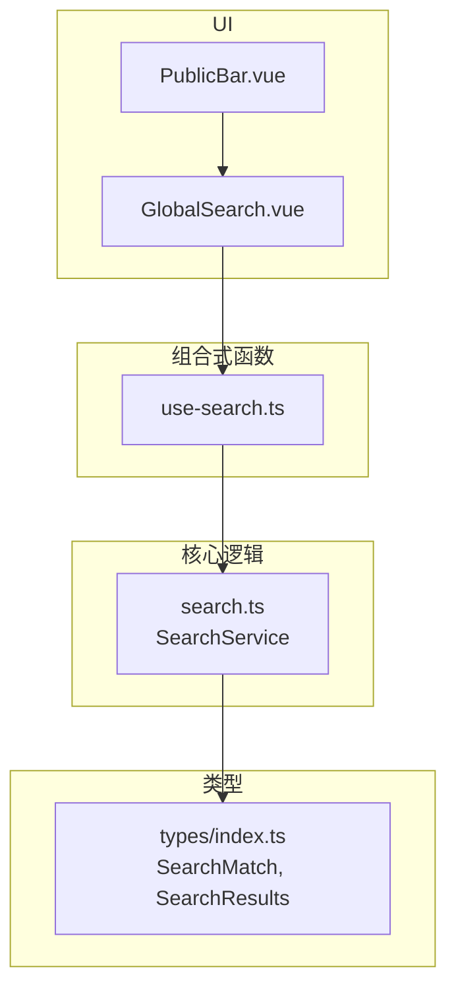
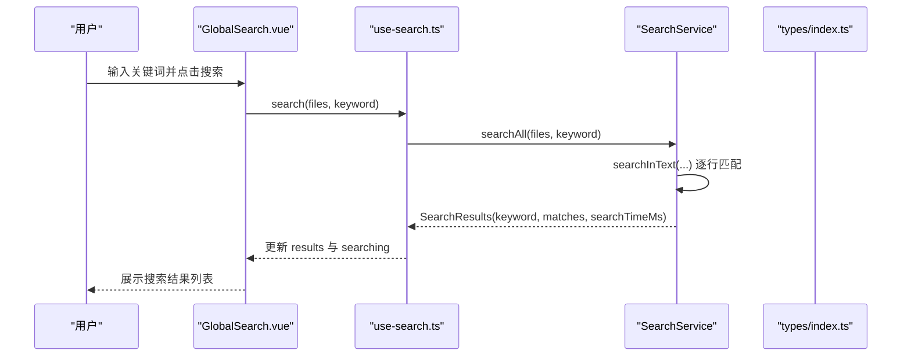
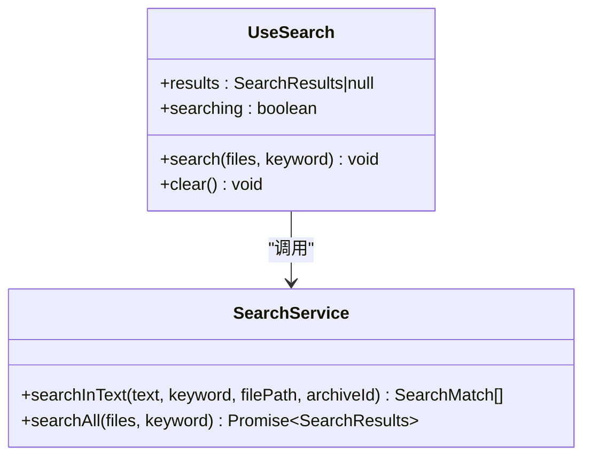
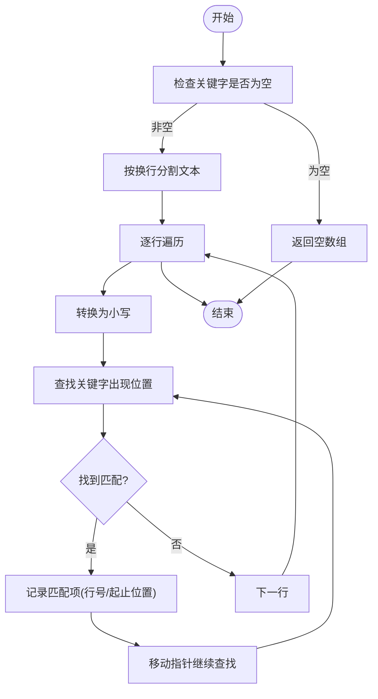
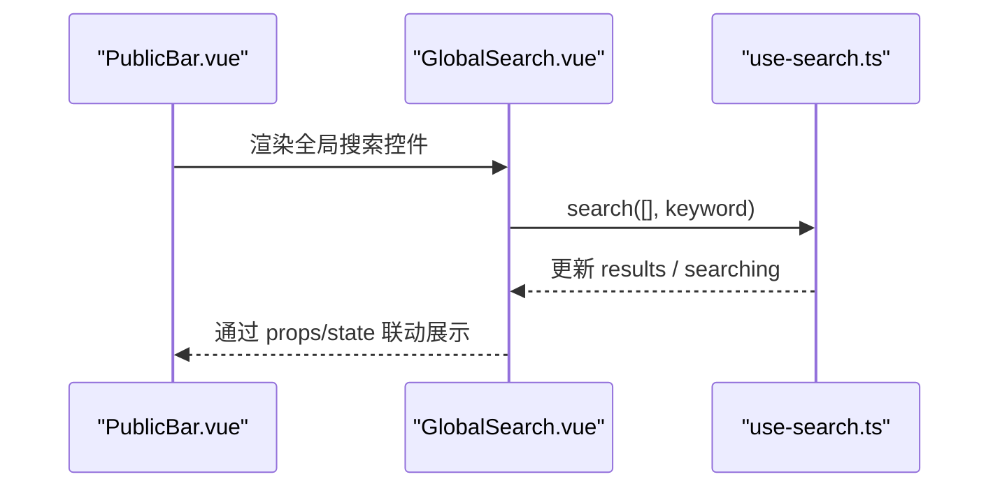

# 搜索功能 (useSearch)

<cite>
**本文引用的文件**
- [src/composables/use-search.ts](file://src/composables/use-search.ts)
- [src/core/search.ts](file://src/core/search.ts)
- [src/types/index.ts](file://src/types/index.ts)
- [src/components/public-bar/GlobalSearch.vue](file://src/components/public-bar/GlobalSearch.vue)
- [src/components/public-bar/PublicBar.vue](file://src/components/public-bar/PublicBar.vue)
- [src/__tests__/core/search.test.ts](file://src/__tests__/core/search.test.ts)
</cite>

## 目录
1. [简介](#简介)
2. [项目结构](#项目结构)
3. [核心组件](#核心组件)
4. [架构总览](#架构总览)
5. [详细组件分析](#详细组件分析)
6. [依赖关系分析](#依赖关系分析)
7. [性能考虑](#性能考虑)
8. [故障排查指南](#故障排查指南)
9. [结论](#结论)
10. [附录：使用示例与最佳实践](#附录使用示例与最佳实践)

## 简介
本文件为 useSearch 组合式函数及其相关搜索能力的完整技术文档。内容涵盖：
- 文本搜索算法与大小写不敏感匹配
- 搜索结果数据结构与高亮所需字段
- 多文件聚合搜索流程
- 与全局搜索 UI 的集成方式
- 测试覆盖要点
- 面向生产环境的性能优化建议（去抖、分页、分块处理、内存优化）

注意：当前仓库中的实现为最小可用版本，尚未包含模糊匹配、搜索历史管理、Worker 并行、结果导出等高级特性。本文在“性能考虑”和“附录”中提供可落地的演进方案与实现建议。

## 项目结构
与搜索相关的代码主要分布在以下位置：
- 组合式函数：src/composables/use-search.ts
- 搜索服务：src/core/search.ts
- 类型定义：src/types/index.ts
- 全局搜索入口组件：src/components/public-bar/GlobalSearch.vue
- 公共栏容器：src/components/public-bar/PublicBar.vue
- 单元测试：src/__tests__/core/search.test.ts

图表来源
- [src/components/public-bar/PublicBar.vue:1-33](file://src/components/public-bar/PublicBar.vue#L1-L33)
- [src/components/public-bar/GlobalSearch.vue:1-31](file://src/components/public-bar/GlobalSearch.vue#L1-L31)
- [src/composables/use-search.ts:1-28](file://src/composables/use-search.ts#L1-L28)
- [src/core/search.ts:1-49](file://src/core/search.ts#L1-L49)
- [src/types/index.ts:56-71](file://src/types/index.ts#L56-L71)

章节来源
- [src/components/public-bar/PublicBar.vue:1-33](file://src/components/public-bar/PublicBar.vue#L1-L33)
- [src/components/public-bar/GlobalSearch.vue:1-31](file://src/components/public-bar/GlobalSearch.vue#L1-L31)
- [src/composables/use-search.ts:1-28](file://src/composables/use-search.ts#L1-L28)
- [src/core/search.ts:1-49](file://src/core/search.ts#L1-L49)
- [src/types/index.ts:56-71](file://src/types/index.ts#L56-L71)

## 核心组件
- useSearch 组合式函数
  - 职责：封装搜索状态与调用 SearchService 的 API；暴露 results、searching、search、clear。
  - 关键行为：
    - search(files, keyword)：设置 searching=true，调用 SearchService.searchAll，完成后置 searching=false。
    - clear()：清空 results。
- SearchService 类
  - 职责：执行文本搜索与多文件聚合。
  - 关键方法：
    - searchInText(text, keyword, filePath, archiveId)：逐行扫描，大小写不敏感，记录匹配起止位置。
    - searchAll(files, keyword)：遍历 files，聚合所有匹配项并返回 SearchResults。
- 类型定义
  - SearchMatch：包含文件定位信息（archiveId、filePath、fileName）、行号、行内容以及匹配起止索引（matchStart、matchEnd）。
  - SearchResults：包含 keyword、matches 数组与 searchTimeMs 耗时统计。

章节来源
- [src/composables/use-search.ts:1-28](file://src/composables/use-search.ts#L1-L28)
- [src/core/search.ts:1-49](file://src/core/search.ts#L1-L49)
- [src/types/index.ts:56-71](file://src/types/index.ts#L56-L71)

## 架构总览
从用户输入到结果渲染的端到端流程如下：

图表来源
- [src/components/public-bar/GlobalSearch.vue:1-31](file://src/components/public-bar/GlobalSearch.vue#L1-L31)
- [src/composables/use-search.ts:1-28](file://src/composables/use-search.ts#L1-L28)
- [src/core/search.ts:1-49](file://src/core/search.ts#L1-L49)
- [src/types/index.ts:56-71](file://src/types/index.ts#L56-L71)

## 详细组件分析

### 组合式函数 useSearch
- 状态设计
  - results：保存最近一次搜索结果（SearchResults | null）。
  - searching：标识是否正在搜索，用于 UI 加载态。
- 对外 API
  - search(files, keyword)：发起搜索，files 为待搜索的文件集合（当前组件示例传入空数组，表示由上层注入实际数据）。
  - clear()：清空结果。
- 错误处理
  - 当前未捕获异常，建议在业务层增加 try/catch 或统一错误提示。
- 扩展点
  - 可在 search 前后加入缓存命中判断、去抖、节流、取消上次请求等逻辑。

图表来源
- [src/composables/use-search.ts:1-28](file://src/composables/use-search.ts#L1-L28)
- [src/core/search.ts:1-49](file://src/core/search.ts#L1-L49)

章节来源
- [src/composables/use-search.ts:1-28](file://src/composables/use-search.ts#L1-L28)

### 搜索服务 SearchService
- 文本搜索算法
  - 按行分割文本，逐行进行大小写不敏感匹配。
  - 使用 indexOf 循环查找，记录每个匹配的起始与结束位置，便于前端高亮。
- 多文件聚合
  - 遍历 files，将各文件的匹配项合并为一个数组，并计算整体耗时。
- 复杂度
  - 时间复杂度：O(N*L)，N 为行数，L 为关键字长度（indexOf 平均线性）。
  - 空间复杂度：O(M)，M 为匹配项数量。

图表来源
- [src/core/search.ts:1-49](file://src/core/search.ts#L1-L49)

章节来源
- [src/core/search.ts:1-49](file://src/core/search.ts#L1-L49)

### 类型定义 SearchMatch 与 SearchResults
- SearchMatch
  - 关键字段：archiveId、filePath、fileName、lineNumber、lineContent、matchStart、matchEnd。
  - 用途：唯一标识匹配位置并提供高亮所需区间。
- SearchResults
  - 关键字段：keyword、matches、searchTimeMs。
  - 用途：承载一次搜索的全部结果与性能指标。

章节来源
- [src/types/index.ts:56-71](file://src/types/index.ts#L56-L71)

### 全局搜索 UI 集成
- GlobalSearch.vue
  - 绑定输入框与搜索按钮，触发 useSearch().search。
  - 使用 searching 控制按钮 loading 状态。
- PublicBar.vue
  - 作为全局工具栏容器，嵌入 GlobalSearch 组件。

图表来源
- [src/components/public-bar/PublicBar.vue:1-33](file://src/components/public-bar/PublicBar.vue#L1-L33)
- [src/components/public-bar/GlobalSearch.vue:1-31](file://src/components/public-bar/GlobalSearch.vue#L1-L31)
- [src/composables/use-search.ts:1-28](file://src/composables/use-search.ts#L1-L28)

章节来源
- [src/components/public-bar/GlobalSearch.vue:1-31](file://src/components/public-bar/GlobalSearch.vue#L1-L31)
- [src/components/public-bar/PublicBar.vue:1-33](file://src/components/public-bar/PublicBar.vue#L1-L33)

### 测试用例要点
- 基本匹配：验证在多行文本中找到多次出现。
- 大小写不敏感：验证不同大小写组合均能匹配。
- 空关键字：应返回空结果。
- 多文件聚合：验证 searchAll 正确汇总多个文件的匹配项。

章节来源
- [src/__tests__/core/search.test.ts:1-35](file://src/__tests__/core/search.test.ts#L1-L35)

## 依赖关系分析
- 模块耦合
  - use-search.ts 依赖 SearchService 与类型定义。
  - GlobalSearch.vue 依赖 use-search.ts。
  - PublicBar.vue 依赖 GlobalSearch.vue。
- 外部依赖
  - Vue 响应式 ref。
  - Naive UI 组件（输入框、按钮、布局）。
- 潜在风险
  - 当前 GlobalSearch 调用 search 时传入空文件数组，需在上层注入真实文件内容后再进行搜索。
  - 缺少错误处理与取消机制，大规模搜索时需补充。

图表来源
- [src/components/public-bar/PublicBar.vue:1-33](file://src/components/public-bar/PublicBar.vue#L1-L33)
- [src/components/public-bar/GlobalSearch.vue:1-31](file://src/components/public-bar/GlobalSearch.vue#L1-L31)
- [src/composables/use-search.ts:1-28](file://src/composables/use-search.ts#L1-L28)
- [src/core/search.ts:1-49](file://src/core/search.ts#L1-L49)
- [src/types/index.ts:56-71](file://src/types/index.ts#L56-L71)

## 性能考虑
以下为针对当前实现的优化建议与落地路径（当前仓库未内置这些能力，可作为后续迭代方向）：

- 搜索去抖与节流
  - 在输入框 onChange 上添加去抖（如 200ms），避免频繁触发搜索。
  - 对批量操作或滚动场景可使用节流策略。
- 结果分页与虚拟滚动
  - 对 SearchResults.matches 进行分页（例如每页 50 条），结合虚拟列表减少 DOM 压力。
- 大文件分块处理
  - 将大文件按固定字节数切块（如 1MB），逐块读取并搜索，降低单次内存峰值。
  - 结合流式解析器，边读边匹配，避免一次性加载整个文件到内存。
- 并发与 Worker
  - 将文件分组，使用 Web Worker 并行搜索，主线程仅负责聚合与渲染。
  - 支持取消上一次搜索任务，避免旧结果覆盖新结果。
- 内存优化
  - 及时释放中间变量（如 lowerLine、lines 引用）。
  - 限制最大匹配项数量，超出阈值时截断并提示用户缩小范围。
- 缓存与增量更新
  - 对相同 keyword 的结果做短期缓存，避免重复计算。
  - 当文件内容变更时，仅对受影响部分重新索引。

[本节为通用性能指导，不直接分析具体文件]

## 故障排查指南
- 无结果
  - 确认传入的 files 是否包含 content 字段且非空。
  - 检查 keyword 是否被 trim 后仍为空。
- 性能卡顿
  - 观察 SearchResults.searchTimeMs，若过大，优先启用去抖与分页。
  - 对超大文件采用分块或流式处理。
- 高亮不正确
  - 校验 matchStart/matchEnd 是否与 lineContent 对应，确保字符边界一致。
- 结果覆盖
  - 在异步搜索中，使用请求 ID 或 AbortController 取消旧请求，防止竞态条件。

章节来源
- [src/core/search.ts:1-49](file://src/core/search.ts#L1-L49)
- [src/composables/use-search.ts:1-28](file://src/composables/use-search.ts#L1-L28)
- [src/types/index.ts:56-71](file://src/types/index.ts#L56-L71)

## 结论
当前 useSearch 提供了轻量、易用的全局搜索基础能力：大小写不敏感的文本匹配、多文件聚合与基础耗时统计，并通过 GlobalSearch 组件完成初步集成。为满足生产级体验，建议逐步引入去抖、分页、分块处理、并发与取消机制，并在 UI 层完善高亮与导航跳转。

[本节为总结性内容，不直接分析具体文件]

## 附录：使用示例与最佳实践

- 在搜索框中集成实时搜索
  - 在输入框的 onChange 中调用 useSearch().search，并配合去抖定时器。
  - 将 results.matches 分页渲染，点击某一项可跳转到对应文件与行号。
- 过滤结果集
  - 基于 SearchMatch.filePath、fileName、lineNumber 进行二次筛选。
  - 根据 SearchResults.searchTimeMs 显示性能反馈。
- 导出搜索结果
  - 将 SearchResults.matches 序列化为 CSV/JSON，供外部分析。
  - 导出前可对结果进行去重与排序（如按文件路径、行号）。
- 高亮实现建议
  - 利用 matchStart/matchEnd 在行内容中插入标记节点或样式包裹。
  - 注意 Unicode 与多字节字符边界，必要时以码点为单位计算偏移。
- 搜索历史管理（建议）
  - 维护本地历史队列（最多 N 条），支持快速回填与删除。
  - 历史记录与当前搜索词关联，支持按时间/频率排序。
- 模糊匹配（建议）
  - 引入编辑距离或双数组 Trie，支持容错与近似匹配。
  - 对长关键字优先精确匹配，短关键字再启用模糊模式。
- 大文件搜索的分块处理（建议）
  - 按固定大小切块，逐块构建局部索引（如行号映射）。
  - 跨块边界处理关键字片段拼接，避免漏匹配。
- 搜索去抖与结果分页（建议）
  - 去抖间隔 150-300ms，分页大小 30-100。
  - 结合虚拟滚动，提升大数据量下的渲染性能。
- 内存优化（建议）
  - 避免保留不必要的中间引用，及时释放大对象。
  - 限制匹配项上限，超限则提示用户细化查询。

[本节为概念性与建议性内容，不直接分析具体文件]