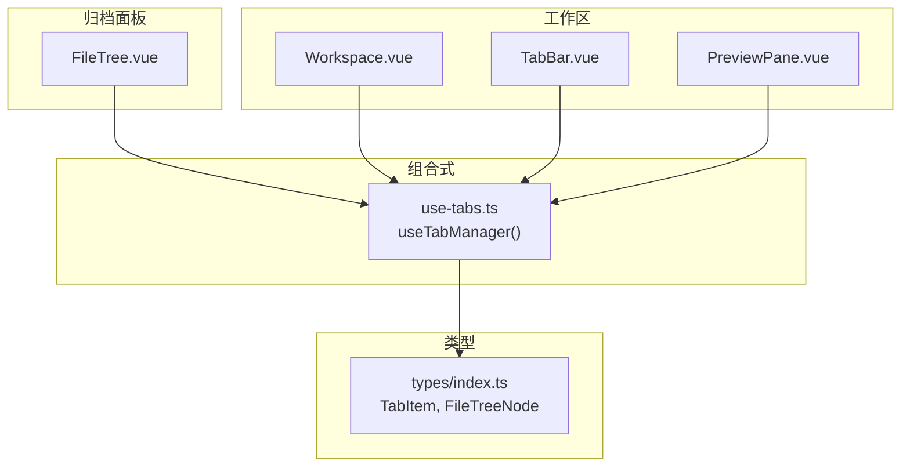
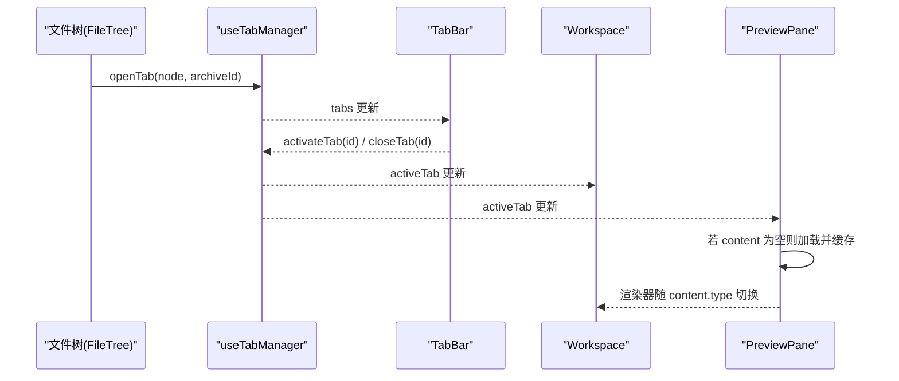
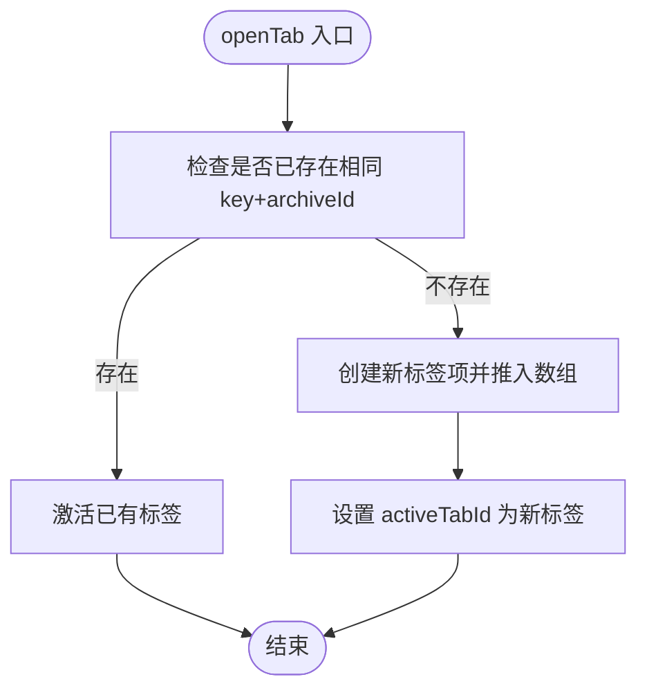
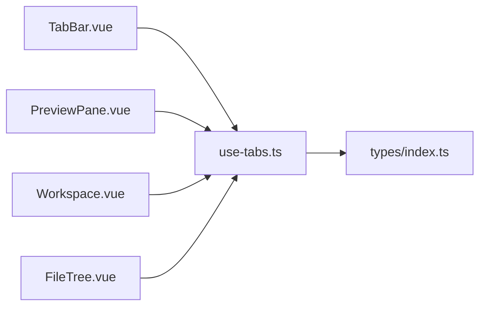

# 标签页管理 (useTabs)

<cite>
**本文引用的文件**   
- [src/composables/use-tabs.ts](file://src/composables/use-tabs.ts)
- [src/components/workspace/TabBar.vue](file://src/components/workspace/TabBar.vue)
- [src/components/workspace/PreviewPane.vue](file://src/components/workspace/PreviewPane.vue)
- [src/components/workspace/Workspace.vue](file://src/components/workspace/Workspace.vue)
- [src/components/archive-panel/FileTree.vue](file://src/components/archive-panel/FileTree.vue)
- [src/types/index.ts](file://src/types/index.ts)
- [src/__tests__/composables/use-tabs.test.ts](file://src/__tests__/composables/use-tabs.test.ts)
</cite>

## 目录
1. [简介](#简介)
2. [项目结构](#项目结构)
3. [核心组件](#核心组件)
4. [架构总览](#架构总览)
5. [详细组件分析](#详细组件分析)
6. [依赖关系分析](#依赖关系分析)
7. [性能与内存优化](#性能与内存优化)
8. [故障排查指南](#故障排查指南)
9. [结论](#结论)
10. [附录：使用示例与最佳实践](#附录使用示例与最佳实践)

## 简介
本文件围绕 useTabs 组合式函数（实际导出名为 useTabManager）进行系统化文档化，聚焦以下目标：
- 标签页的创建、切换、关闭与生命周期管理
- 标签页状态同步机制与数据隔离策略
- 内存占用控制与可扩展性建议
- 在文件预览组件中的集成方式，实现并行打开与快速切换
- 持久化存储方案、键盘快捷键支持、以及标签页数量限制的最佳实践

## 项目结构
与标签页系统直接相关的代码位于 composables、components 与 types 三个层次：
- 组合式逻辑：src/composables/use-tabs.ts
- 视图层：src/components/workspace/TabBar.vue、PreviewPane.vue、Workspace.vue
- 触发入口：src/components/archive-panel/FileTree.vue
- 类型定义：src/types/index.ts
- 行为验证：src/__tests__/composables/use-tabs.test.ts

图表来源
- [src/composables/use-tabs.ts:1-63](file://src/composables/use-tabs.ts#L1-L63)
- [src/components/workspace/TabBar.vue:1-32](file://src/components/workspace/TabBar.vue#L1-L32)
- [src/components/workspace/PreviewPane.vue:1-58](file://src/components/workspace/PreviewPane.vue#L1-L58)
- [src/components/workspace/Workspace.vue:1-36](file://src/components/workspace/Workspace.vue#L1-L36)
- [src/components/archive-panel/FileTree.vue:1-41](file://src/components/archive-panel/FileTree.vue#L1-L41)
- [src/types/index.ts:48-54](file://src/types/index.ts#L48-L54)

章节来源
- [src/composables/use-tabs.ts:1-63](file://src/composables/use-tabs.ts#L1-L63)
- [src/components/workspace/TabBar.vue:1-32](file://src/components/workspace/TabBar.vue#L1-L32)
- [src/components/workspace/PreviewPane.vue:1-58](file://src/components/workspace/PreviewPane.vue#L1-L58)
- [src/components/workspace/Workspace.vue:1-36](file://src/components/workspace/Workspace.vue#L1-L36)
- [src/components/archive-panel/FileTree.vue:1-41](file://src/components/archive-panel/FileTree.vue#L1-L41)
- [src/types/index.ts:48-54](file://src/types/index.ts#L48-L54)

## 核心组件
- useTabManager：提供全局标签页状态与操作方法，包括 openTab、closeTab、activateTab、togglePin、closeAll、reset，以及响应式 tabs、activeTabId、activeTab。
- TabBar：渲染标签栏，绑定激活态与关闭事件。
- PreviewPane：监听 activeTab 变化，按需加载并缓存解析内容，选择对应渲染器展示。
- Workspace：聚合标签栏、工具栏、预览窗格与状态栏，基于 activeTab 推导当前内容类型。
- FileTree：用户点击叶子节点时调用 openTab 打开新标签。
- 类型定义：TabItem、FileTreeNode 等用于描述标签项与文件树节点。

章节来源
- [src/composables/use-tabs.ts:1-63](file://src/composables/use-tabs.ts#L1-L63)
- [src/components/workspace/TabBar.vue:1-32](file://src/components/workspace/TabBar.vue#L1-L32)
- [src/components/workspace/PreviewPane.vue:1-58](file://src/components/workspace/PreviewPane.vue#L1-L58)
- [src/components/workspace/Workspace.vue:1-36](file://src/components/workspace/Workspace.vue#L1-L36)
- [src/components/archive-panel/FileTree.vue:1-41](file://src/components/archive-panel/FileTree.vue#L1-L41)
- [src/types/index.ts:48-54](file://src/types/index.ts#L48-L54)

## 架构总览
标签页系统采用“单一状态源 + 多组件订阅”的模式：
- 状态源：useTabManager 维护 tabs 列表与 activeTabId，并通过 computed 暴露 activeTab。
- 写入端：FileTree 通过 openTab 创建或复用标签；TabBar 通过 activateTab/closeTab/togglePin/closeAll 修改状态。
- 读取端：PreviewPane 监听 activeTab 变化，按需加载内容并缓存到 tab.content；Workspace 根据 activeTab 的内容类型驱动工具栏。

图表来源
- [src/components/archive-panel/FileTree.vue:16-23](file://src/components/archive-panel/FileTree.vue#L16-L23)
- [src/composables/use-tabs.ts:14-31](file://src/composables/use-tabs.ts#L14-L31)
- [src/components/workspace/TabBar.vue:12-28](file://src/components/workspace/TabBar.vue#L12-L28)
- [src/components/workspace/Workspace.vue:16-18](file://src/components/workspace/Workspace.vue#L16-L18)
- [src/components/workspace/PreviewPane.vue:24-35](file://src/components/workspace/PreviewPane.vue#L24-L35)

## 详细组件分析

### 组合式：useTabManager
- 状态设计
  - tabs：标签数组，元素为 TabItem，包含 id、fileNode、archiveId、pinned、content 可选字段。
  - activeTabId：当前激活标签 ID。
  - nextTabId：自增生成唯一 ID，避免冲突。
- 关键方法
  - openTab(node, archiveId)：按 fileNode.key + archiveId 去重，存在则激活，不存在则新建并激活。
  - closeTab(id)：删除指定标签，若关闭的是当前激活标签，自动切换到相邻标签或置空。
  - activateTab(id)：切换激活标签。
  - togglePin(id)：切换固定标记。
  - closeAll()：仅保留 pinned 标签，并重置 activeTabId。
  - reset()：清空所有状态，便于测试或会话重置。
- 复杂度与副作用
  - 查找与插入均为 O(n)，n 为标签数。
  - 无外部副作用，纯前端状态管理。

图表来源
- [src/composables/use-tabs.ts:14-31](file://src/composables/use-tabs.ts#L14-L31)

章节来源
- [src/composables/use-tabs.ts:1-63](file://src/composables/use-tabs.ts#L1-L63)
- [src/__tests__/composables/use-tabs.test.ts:1-76](file://src/__tests__/composables/use-tabs.test.ts#L1-L76)

### 视图层：TabBar
- 职责
  - 渲染标签列表，绑定 value 到 activeTabId，处理 update:value 与 close 事件。
  - 根据 pinned 控制可关闭性。
- 交互
  - 点击标签 -> activateTab
  - 点击关闭按钮 -> closeTab

章节来源
- [src/components/workspace/TabBar.vue:1-32](file://src/components/workspace/TabBar.vue#L1-L32)

### 视图层：PreviewPane
- 职责
  - 监听 activeTab 变化，当 content 为空时异步加载解析结果并缓存至 tab.content。
  - 根据扩展名从插件注册表获取渲染组件，动态渲染。
- 关键点
  - 懒加载：仅在首次访问标签时加载内容，减少初始开销。
  - 缓存：tab.content 作为缓存键，避免重复 IO。
  - 错误边界：外层包裹 ErrorBoundary 提升健壮性。

章节来源
- [src/components/workspace/PreviewPane.vue:1-58](file://src/components/workspace/PreviewPane.vue#L1-L58)

### 视图层：Workspace
- 职责
  - 组合 TabBar、PreviewToolbar、PreviewPane、StatusBar。
  - 基于 activeTab.content.type 计算当前内容类型，驱动工具栏显示。

章节来源
- [src/components/workspace/Workspace.vue:1-36](file://src/components/workspace/Workspace.vue#L1-L36)

### 触发入口：FileTree
- 职责
  - 监听树节点选中事件，定位叶子节点后调用 openTab 打开标签。
- 关键点
  - 以 archiveId 区分不同归档上下文下的同名文件，避免跨归档误判重复。

章节来源
- [src/components/archive-panel/FileTree.vue:1-41](file://src/components/archive-panel/FileTree.vue#L1-L41)

### 类型模型：TabItem 与 FileTreeNode
- TabItem
  - id：唯一标识
  - fileNode：文件树节点引用
  - archiveId：所属归档上下文
  - pinned：是否固定
  - content：解析后的内容缓存（可选）
- FileTreeNode
  - key、label、isLeaf、path 等基础信息，children 可选

章节来源
- [src/types/index.ts:17-24](file://src/types/index.ts#L17-L24)
- [src/types/index.ts:48-54](file://src/types/index.ts#L48-L54)

## 依赖关系分析
- 模块耦合
  - useTabManager 仅依赖 Vue 响应式 API 与类型定义，低耦合。
  - 各组件通过组合式函数共享状态，单向数据流清晰。
- 外部依赖
  - Naive UI 用于标签栏与滚动容器。
  - 插件引擎与平台适配器由 PreviewPane 按需引入，不直接影响标签状态。

图表来源
- [src/composables/use-tabs.ts:1-63](file://src/composables/use-tabs.ts#L1-L63)
- [src/components/workspace/TabBar.vue:1-32](file://src/components/workspace/TabBar.vue#L1-L32)
- [src/components/workspace/PreviewPane.vue:1-58](file://src/components/workspace/PreviewPane.vue#L1-L58)
- [src/components/workspace/Workspace.vue:1-36](file://src/components/workspace/Workspace.vue#L1-L36)
- [src/components/archive-panel/FileTree.vue:1-41](file://src/components/archive-panel/FileTree.vue#L1-L41)
- [src/types/index.ts:48-54](file://src/types/index.ts#L48-L54)

章节来源
- [src/composables/use-tabs.ts:1-63](file://src/composables/use-tabs.ts#L1-L63)
- [src/types/index.ts:48-54](file://src/types/index.ts#L48-L54)

## 性能与内存优化
- 时间复杂度
  - openTab/closeTab/activateTab 均涉及线性扫描，标签数量较大时需考虑索引优化或 Map 映射。
- 空间复杂度
  - 每个标签持有 fileNode 引用与可选 content 缓存，大量大文件可能导致内存压力。
- 优化建议
  - 对频繁查找的 key 建立 Map 索引，将查找降至 O(1)。
  - 对超大文件内容采用分片/虚拟滚动/延迟加载，避免一次性载入。
  - 提供 closeAll 之外的“最近最少使用(LRU)”清理策略，结合 pinned 保护重要标签。
  - 将 content 缓存上限与大小阈值纳入配置，超出阈值时释放旧缓存。

[本节为通用性能讨论，不直接分析具体文件]

## 故障排查指南
- 常见问题
  - 重复打开同一文件：确认传入的 node.key 与 archiveId 是否正确，openTab 会按两者组合去重。
  - 关闭当前标签后未切换：closeTab 会自动选择相邻标签或置空，检查是否有 pinned 标签影响。
  - 预览内容为空：PreviewPane 会在首次访问时加载，确保 activeTab 正确且解析成功。
- 调试手段
  - 使用 reset 清空状态，复现问题。
  - 在单元测试中覆盖边界场景，如关闭最后一个标签、无 pinned 标签时的 closeAll。

章节来源
- [src/composables/use-tabs.ts:33-54](file://src/composables/use-tabs.ts#L33-L54)
- [src/components/workspace/PreviewPane.vue:24-35](file://src/components/workspace/PreviewPane.vue#L24-L35)
- [src/__tests__/composables/use-tabs.test.ts:57-75](file://src/__tests__/composables/use-tabs.test.ts#L57-L75)

## 结论
useTabManager 提供了简洁而强大的标签页管理能力，配合 TabBar 与 PreviewPane 实现了“按需加载 + 缓存”的高效预览体验。其状态集中、接口清晰，易于扩展持久化、快捷键与数量限制等功能。

[本节为总结性内容，不直接分析具体文件]

## 附录：使用示例与最佳实践

### 在文件预览组件中集成标签页
- 打开标签
  - 在文件树组件中，当选中叶子节点时调用 openTab(node, archiveId)。
- 切换与关闭
  - 通过 TabBar 的 activateTab 与 closeTab 完成交互。
- 预览渲染
  - PreviewPane 监听 activeTab，首次访问时加载并缓存 content，随后根据 content.type 选择渲染器。

章节来源
- [src/components/archive-panel/FileTree.vue:16-23](file://src/components/archive-panel/FileTree.vue#L16-L23)
- [src/components/workspace/TabBar.vue:12-28](file://src/components/workspace/TabBar.vue#L12-L28)
- [src/components/workspace/PreviewPane.vue:24-42](file://src/components/workspace/PreviewPane.vue#L24-L42)

### 标签页持久化存储方案
- 存储时机
  - 应用启动时从本地存储恢复 tabs 与 activeTabId。
  - 每次状态变更（新增、关闭、切换、固定）后增量同步。
- 存储内容
  - 仅持久化轻量元数据：id、fileNode.key、archiveId、pinned、path 等。
  - 不持久化 content，避免体积过大；恢复后按需重新加载。
- 恢复流程
  - 初始化时重建 tabs 数组与 activeTabId，后续由 PreviewPane 按需加载 content。
- 迁移与版本兼容
  - 为持久化结构增加版本号，升级时执行迁移脚本。

[本节为概念性方案说明，不直接分析具体文件]

### 键盘快捷键支持
- 建议快捷键
  - Ctrl/Cmd + T：新建标签（需业务上下文）
  - Ctrl/Cmd + W：关闭当前标签
  - Ctrl/Cmd + Tab：下一个标签
  - Ctrl/Cmd + Shift + Tab：上一个标签
  - Ctrl/Cmd + F：固定/取消固定当前标签
- 实现要点
  - 在全局键盘事件监听中调用 activateTab/closeTab/togglePin。
  - 注意焦点管理与防抖，避免与编辑器快捷键冲突。

[本节为概念性方案说明，不直接分析具体文件]

### 标签页数量限制与内存控制
- 数量限制
  - 提供最大标签数配置，超过时拒绝新开或触发 LRU 清理。
- 内存控制
  - 对 content 设置最大缓存条目与单条大小阈值，超出则释放最久未使用的缓存。
  - 对非活跃标签延迟加载或卸载渲染器实例。
- 用户体验
  - 清理前提示用户，允许用户将重要标签固定以避免被清理。

[本节为概念性方案说明，不直接分析具体文件]