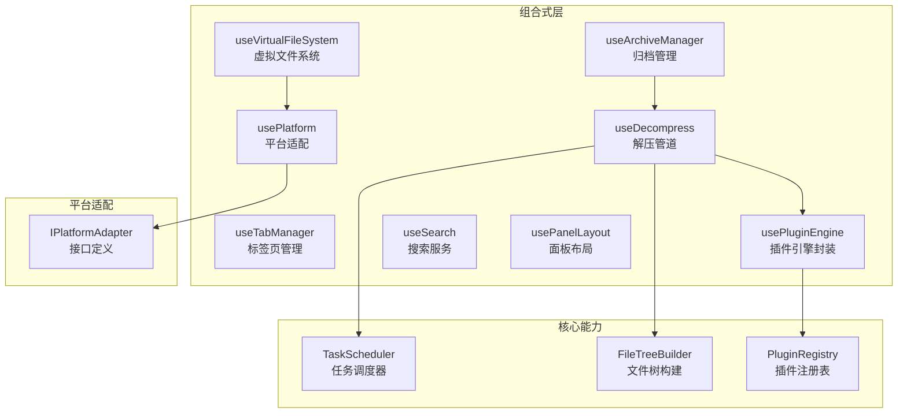
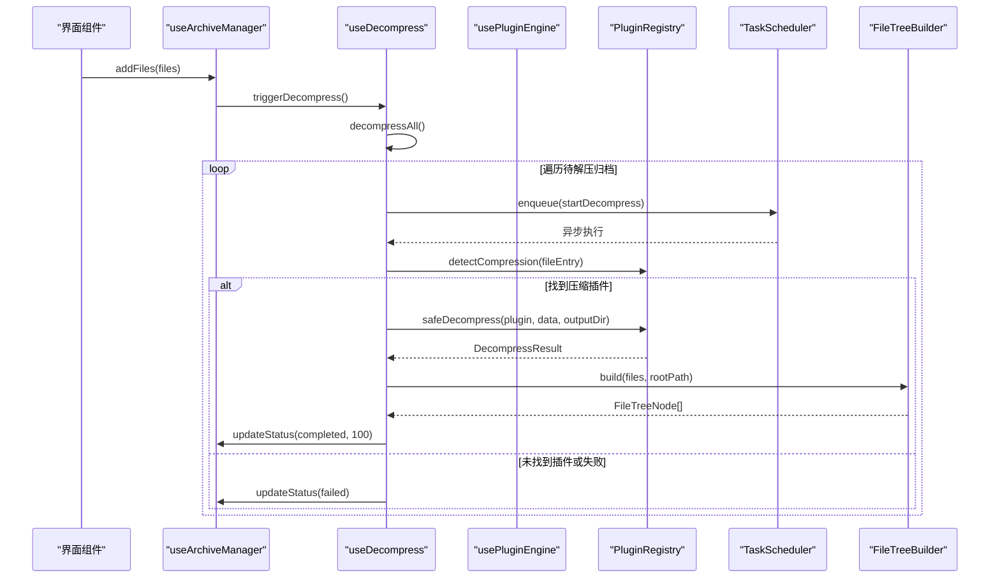
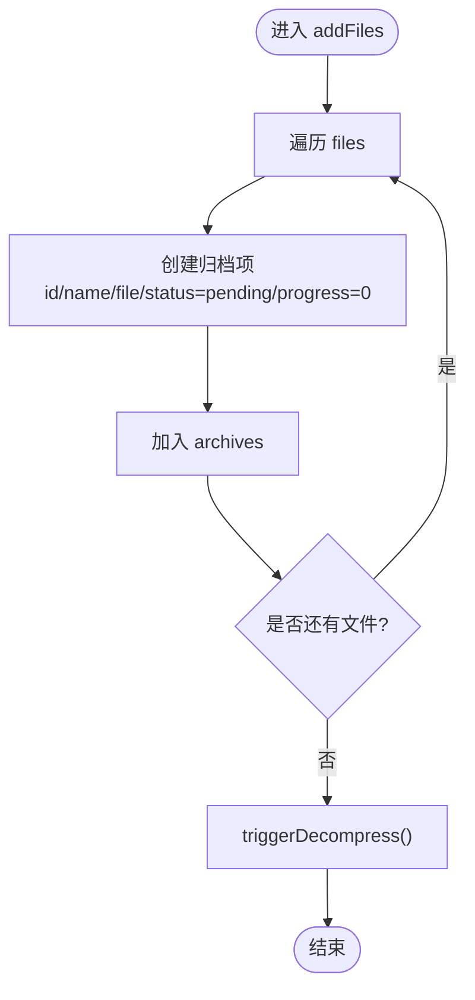
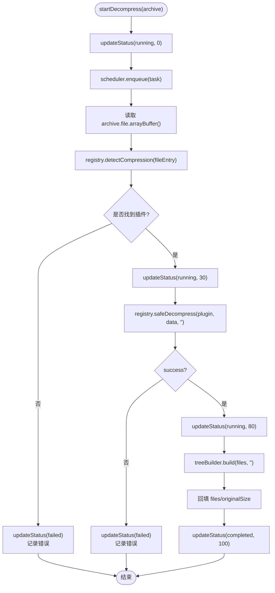
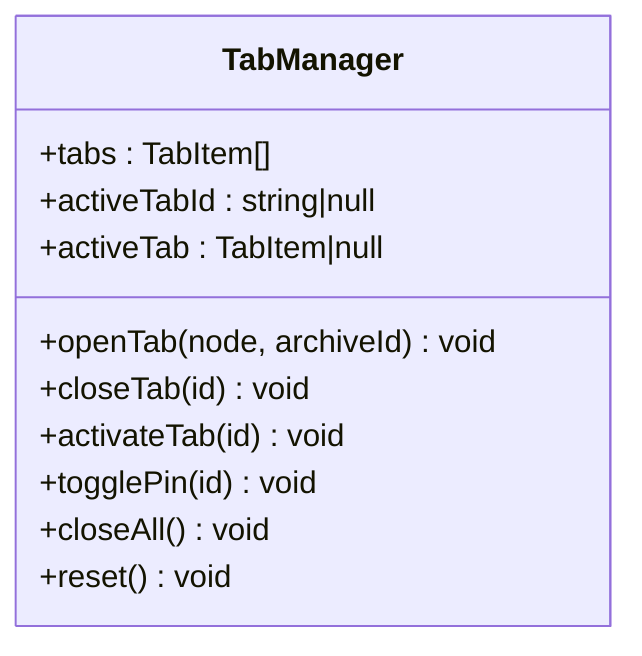
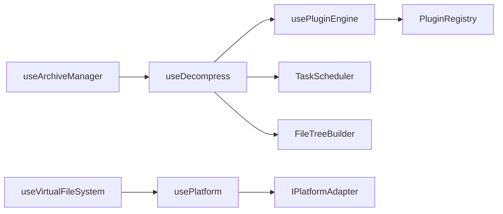

# 组合式 API

<cite>
**本文引用的文件**
- [use-archives.ts](file://src/composables/use-archives.ts)
- [use-tabs.ts](file://src/composables/use-tabs.ts)
- [use-decompress.ts](file://src/composables/use-decompress.ts)
- [use-plugins.ts](file://src/composables/use-plugins.ts)
- [use-vfs.ts](file://src/composables/use-vfs.ts)
- [use-search.ts](file://src/composables/use-search.ts)
- [use-panel-layout.ts](file://src/composables/use-panel-layout.ts)
- [use-platform.ts](file://src/composables/use-platform.ts)
- [task-scheduler.ts](file://src/core/task-scheduler.ts)
- [file-tree.ts](file://src/core/file-tree.ts)
- [registry.ts](file://src/plugins/registry.ts)
- [types.ts](file://src/adapters/types.ts)
- [use-archives.test.ts](file://src/__tests__/composables/use-archives.test.ts)
- [use-tabs.test.ts](file://src/__tests__/composables/use-tabs.test.ts)
</cite>

## 目录
1. [简介](#简介)
2. [项目结构](#项目结构)
3. [核心组件](#核心组件)
4. [架构总览](#架构总览)
5. [详细组件分析](#详细组件分析)
6. [依赖关系分析](#依赖关系分析)
7. [性能与优化](#性能与优化)
8. [故障排查指南](#故障排查指南)
9. [结论](#结论)
10. [附录：使用示例与最佳实践](#附录使用示例与最佳实践)

## 简介
本文件面向 Hello-Tauri 的 Vue 3 组合式 API（Composables）开发者，系统性梳理压缩包管理、标签页控制、解压管道、插件管理等关键能力。文档聚焦以下目标：
- 响应式状态管理与副作用处理模式
- 组合式函数间的协作与依赖关系
- 错误捕获与可观测性
- 性能优化策略与测试方法
- 自定义组合式函数的开发指南

## 项目结构
组合式函数位于 src/composables 下，围绕“归档列表”、“标签页”、“解压流程”、“插件引擎”、“平台适配”、“搜索”、“面板布局”等职责进行组织。核心工具类分布在 core 与 plugins 目录，为组合式函数提供任务调度、文件树构建、插件注册与发现等能力。

图表来源
- [use-archives.ts:1-60](file://src/composables/use-archives.ts#L1-L60)
- [use-decompress.ts:1-74](file://src/composables/use-decompress.ts#L1-L74)
- [use-plugins.ts:1-17](file://src/composables/use-plugins.ts#L1-L17)
- [use-vfs.ts:1-18](file://src/composables/use-vfs.ts#L1-L18)
- [use-platform.ts:1-25](file://src/composables/use-platform.ts#L1-L25)
- [task-scheduler.ts:1-79](file://src/core/task-scheduler.ts#L1-L79)
- [file-tree.ts:1-69](file://src/core/file-tree.ts#L1-L69)
- [registry.ts:1-118](file://src/plugins/registry.ts#L1-L118)
- [types.ts:1-12](file://src/adapters/types.ts#L1-L12)

章节来源
- [use-archives.ts:1-60](file://src/composables/use-archives.ts#L1-L60)
- [use-decompress.ts:1-74](file://src/composables/use-decompress.ts#L1-L74)
- [use-plugins.ts:1-17](file://src/composables/use-plugins.ts#L1-L17)
- [use-vfs.ts:1-18](file://src/composables/use-vfs.ts#L1-L18)
- [use-platform.ts:1-25](file://src/composables/use-platform.ts#L1-L25)
- [task-scheduler.ts:1-79](file://src/core/task-scheduler.ts#L1-L79)
- [file-tree.ts:1-69](file://src/core/file-tree.ts#L1-L69)
- [registry.ts:1-118](file://src/plugins/registry.ts#L1-L118)
- [types.ts:1-12](file://src/adapters/types.ts#L1-L12)

## 核心组件
本节概述各组合式函数的职责、输入输出与典型用法要点。

- useArchiveManager（归档管理）
  - 职责：维护全局归档列表、统计信息、生命周期事件（运行中/完成/失败），并触发批量解压。
  - 主要能力：添加文件、删除归档、更新状态与进度、重置、计算聚合统计。
  - 副作用：在新增归档后自动触发解压流程。
  - 参考路径：[use-archives.ts:1-60](file://src/composables/use-archives.ts#L1-L60)

- useDecompress（解压管道）
  - 职责：将归档文件通过插件系统识别格式、安全执行解压、构建文件树、回填结果与进度。
  - 主要能力：单条解压、批量解压；基于任务调度器并发控制。
  - 副作用：更新归档状态与错误信息；写入文件树与原始大小统计。
  - 参考路径：[use-decompress.ts:1-74](file://src/composables/use-decompress.ts#L1-L74)

- usePluginEngine（插件引擎封装）
  - 职责：暴露统一的插件注册表访问入口，提供检测、获取、启用/禁用等便捷方法。
  - 主要能力：按扩展名解析/压缩插件查找、动态启用/禁用。
  - 参考路径：[use-plugins.ts:1-17](file://src/composables/use-plugins.ts#L1-L17)

- useTabManager（标签页管理）
  - 职责：维护标签页集合、激活态、置顶标记，避免重复打开同一资源。
  - 主要能力：打开/关闭/切换/置顶/一键关闭非置顶标签、重置。
  - 参考路径：[use-tabs.ts:1-64](file://src/composables/use-tabs.ts#L1-L64)

- useVirtualFileSystem（虚拟文件系统）
  - 职责：抽象平台差异，统一读取文件与列出目录。
  - 主要能力：readFile、listDir。
  - 参考路径：[use-vfs.ts:1-18](file://src/composables/use-vfs.ts#L1-L18)

- usePlatform（平台适配）
  - 职责：根据运行时环境懒加载 Tauri 或 Web 适配器，缓存实例。
  - 主要能力：getAdapter、isTauri/isWeb 标志。
  - 参考路径：[use-platform.ts:1-25](file://src/composables/use-platform.ts#L1-L25)

- useSearch（搜索服务）
  - 职责：对已解析的文件内容执行关键词搜索，返回命中结果。
  - 主要能力：search、clear。
  - 参考路径：[use-search.ts:1-28](file://src/composables/use-search.ts#L1-L28)

- usePanelLayout（面板布局）
  - 职责：左右面板折叠与宽度控制，结合断点自动调整右侧面板。
  - 主要能力：collapse/expand、setWidth、autoCollapseRight。
  - 参考路径：[use-panel-layout.ts:1-38](file://src/composables/use-panel-layout.ts#L1-L38)

章节来源
- [use-archives.ts:1-60](file://src/composables/use-archives.ts#L1-L60)
- [use-decompress.ts:1-74](file://src/composables/use-decompress.ts#L1-L74)
- [use-plugins.ts:1-17](file://src/composables/use-plugins.ts#L1-L17)
- [use-tabs.ts:1-64](file://src/composables/use-tabs.ts#L1-L64)
- [use-vfs.ts:1-18](file://src/composables/use-vfs.ts#L1-L18)
- [use-platform.ts:1-25](file://src/composables/use-platform.ts#L1-L25)
- [use-search.ts:1-28](file://src/composables/use-search.ts#L1-L28)
- [use-panel-layout.ts:1-38](file://src/composables/use-panel-layout.ts#L1-L38)

## 架构总览
下图展示了从用户操作到最终渲染的关键调用链：上传归档 -> 归档管理 -> 解压管道 -> 插件系统 -> 任务调度 -> 文件树构建 -> 标签页打开。

图表来源
- [use-archives.ts:1-60](file://src/composables/use-archives.ts#L1-L60)
- [use-decompress.ts:1-74](file://src/composables/use-decompress.ts#L1-L74)
- [registry.ts:1-118](file://src/plugins/registry.ts#L1-L118)
- [task-scheduler.ts:1-79](file://src/core/task-scheduler.ts#L1-L79)
- [file-tree.ts:1-69](file://src/core/file-tree.ts#L1-L69)

## 详细组件分析

### 归档管理 useArchiveManager
- 设计要点
  - 使用 ref 维护全局 archives 列表，computed 汇总统计信息，降低模板计算成本。
  - 通过 updateStatus 集中变更状态与时间戳，保证状态一致性。
  - 新增归档后自动触发解压，形成“数据驱动”的工作流。
- 关键行为
  - addFiles：为每个 File 创建归档项，设置初始状态与尺寸，随后触发解压。
  - remove/updateStatus/stats/reset：基础 CRUD 与统计。
- 复杂度
  - stats 为 O(n) 聚合计算，n 为归档数量；通常 n 较小，开销可控。
- 错误处理
  - 自身不直接处理业务异常，交由 useDecompress 更新失败状态与错误消息。
- 参考路径
  - [use-archives.ts:1-60](file://src/composables/use-archives.ts#L1-L60)

图表来源
- [use-archives.ts:1-60](file://src/composables/use-archives.ts#L1-L60)

章节来源
- [use-archives.ts:1-60](file://src/composables/use-archives.ts#L1-L60)
- [use-archives.test.ts:1-65](file://src/__tests__/composables/use-archives.test.ts#L1-L65)

### 解压管道 useDecompress
- 设计要点
  - 组合 useArchiveManager 与 usePluginEngine，借助 TaskScheduler 控制并发，FileTreeBuilder 生成可视化树。
  - 以进度分段更新（30% 检测、80% 解析、100% 完成）提升用户体验。
- 关键行为
  - startDecompress：读取 ArrayBuffer -> 检测压缩插件 -> 安全解压 -> 构建文件树 -> 回填结果与统计 -> 更新状态。
  - decompressAll：遍历 pending 归档逐一入队。
- 错误处理
  - 无插件或插件超时/异常时，记录 error 并置 failed。
  - 队列满时直接失败提示。
- 复杂度
  - 单次解压：IO + 插件解析 + 树构建；整体受并发上限限制。
- 参考路径
  - [use-decompress.ts:1-74](file://src/composables/use-decompress.ts#L1-L74)
  - [task-scheduler.ts:1-79](file://src/core/task-scheduler.ts#L1-L79)
  - [file-tree.ts:1-69](file://src/core/file-tree.ts#L1-L69)
  - [registry.ts:1-118](file://src/plugins/registry.ts#L1-L118)

图表来源
- [use-decompress.ts:1-74](file://src/composables/use-decompress.ts#L1-L74)
- [registry.ts:1-118](file://src/plugins/registry.ts#L1-L118)
- [file-tree.ts:1-69](file://src/core/file-tree.ts#L1-L69)

章节来源
- [use-decompress.ts:1-74](file://src/composables/use-decompress.ts#L1-L74)
- [task-scheduler.ts:1-79](file://src/core/task-scheduler.ts#L1-L79)
- [file-tree.ts:1-69](file://src/core/file-tree.ts#L1-L69)
- [registry.ts:1-118](file://src/plugins/registry.ts#L1-L118)

### 标签页管理 useTabManager
- 设计要点
  - 使用 activeTabId 与 computed(activeTab) 保持当前选中项与详情同步。
  - openTab 去重逻辑：相同 fileNode.key 与 archiveId 视为同一标签。
- 关键行为
  - open/close/activate/togglePin/closeAll/reset。
- 复杂度
  - 打开/关闭/查找均为 O(n)，n 为标签数，通常较小。
- 参考路径
  - [use-tabs.ts:1-64](file://src/composables/use-tabs.ts#L1-L64)

图表来源
- [use-tabs.ts:1-64](file://src/composables/use-tabs.ts#L1-L64)

章节来源
- [use-tabs.ts:1-64](file://src/composables/use-tabs.ts#L1-L64)
- [use-tabs.test.ts:1-77](file://src/__tests__/composables/use-tabs.test.ts#L1-L77)

### 插件引擎 usePluginEngine
- 设计要点
  - 封装 PluginRegistry，提供便捷方法用于检测与获取解析/压缩插件。
  - 支持 enable/disable 控制插件可用性。
- 关键行为
  - registry/detect/getParser/getCompression/enable/disable。
- 参考路径
  - [use-plugins.ts:1-17](file://src/composables/use-plugins.ts#L1-L17)
  - [registry.ts:1-118](file://src/plugins/registry.ts#L1-L118)

章节来源
- [use-plugins.ts:1-17](file://src/composables/use-plugins.ts#L1-L17)
- [registry.ts:1-118](file://src/plugins/registry.ts#L1-L118)

### 虚拟文件系统 useVirtualFileSystem 与平台适配 usePlatform
- 设计要点
  - usePlatform 根据 __PLATFORM__ 懒加载对应适配器，并缓存 Promise 以避免重复初始化。
  - useVirtualFileSystem 通过 getAdapter 获取 IPlatformAdapter 实现跨平台读写与解压。
- 关键行为
  - readFile/listDir 委托给平台适配器。
- 参考路径
  - [use-platform.ts:1-25](file://src/composables/use-platform.ts#L1-L25)
  - [use-vfs.ts:1-18](file://src/composables/use-vfs.ts#L1-L18)
  - [types.ts:1-12](file://src/adapters/types.ts#L1-L12)

章节来源
- [use-platform.ts:1-25](file://src/composables/use-platform.ts#L1-L25)
- [use-vfs.ts:1-18](file://src/composables/use-vfs.ts#L1-L18)
- [types.ts:1-12](file://src/adapters/types.ts#L1-L12)

### 搜索服务 useSearch
- 设计要点
  - 基于 SearchService 对已解析文件内容进行关键词检索，提供 searching 状态与 clear 清理。
- 关键行为
  - search(files, keyword)、clear。
- 参考路径
  - [use-search.ts:1-28](file://src/composables/use-search.ts#L1-L28)

章节来源
- [use-search.ts:1-28](file://src/composables/use-search.ts#L1-L28)

### 面板布局 usePanelLayout
- 设计要点
  - 使用 @vueuse/core 的断点能力，自动在小屏/标准屏下折叠右侧面板。
- 关键行为
  - collapseLeft/expandLeft/collapseRight/expandRight/setLeftWidth/setRightWidth/autoCollapseRight。
- 参考路径
  - [use-panel-layout.ts:1-38](file://src/composables/use-panel-layout.ts#L1-L38)

章节来源
- [use-panel-layout.ts:1-38](file://src/composables/use-panel-layout.ts#L1-L38)

## 依赖关系分析
- 模块耦合
  - useDecompress 强依赖 useArchiveManager、usePluginEngine、TaskScheduler、FileTreeBuilder。
  - useArchiveManager 弱依赖 useDecompress（通过动态 import 解耦）。
  - useVirtualFileSystem 依赖 usePlatform，后者再依赖具体适配器实现。
- 外部依赖
  - 插件系统通过 PluginRegistry 统一管理解析与压缩插件，提供超时保护与安全包装。
- 潜在循环
  - 通过动态 import 避免了 useArchiveManager 与 useDecompress 的直接循环依赖。

图表来源
- [use-archives.ts:1-60](file://src/composables/use-archives.ts#L1-L60)
- [use-decompress.ts:1-74](file://src/composables/use-decompress.ts#L1-L74)
- [use-plugins.ts:1-17](file://src/composables/use-plugins.ts#L1-L17)
- [use-vfs.ts:1-18](file://src/composables/use-vfs.ts#L1-L18)
- [use-platform.ts:1-25](file://src/composables/use-platform.ts#L1-L25)
- [task-scheduler.ts:1-79](file://src/core/task-scheduler.ts#L1-L79)
- [file-tree.ts:1-69](file://src/core/file-tree.ts#L1-L69)
- [registry.ts:1-118](file://src/plugins/registry.ts#L1-L118)
- [types.ts:1-12](file://src/adapters/types.ts#L1-L12)

章节来源
- [use-archives.ts:1-60](file://src/composables/use-archives.ts#L1-L60)
- [use-decompress.ts:1-74](file://src/composables/use-decompress.ts#L1-L74)
- [use-plugins.ts:1-17](file://src/composables/use-plugins.ts#L1-L17)
- [use-vfs.ts:1-18](file://src/composables/use-vfs.ts#L1-L18)
- [use-platform.ts:1-25](file://src/composables/use-platform.ts#L1-L25)
- [task-scheduler.ts:1-79](file://src/core/task-scheduler.ts#L1-L79)
- [file-tree.ts:1-69](file://src/core/file-tree.ts#L1-L69)
- [registry.ts:1-118](file://src/plugins/registry.ts#L1-L118)
- [types.ts:1-12](file://src/adapters/types.ts#L1-L12)

## 性能与优化
- 并发控制
  - TaskScheduler 默认最大并发 3，队列上限 100，避免 UI 卡顿与内存峰值。
- 进度反馈
  - 解压过程分阶段更新进度，减少长耗时操作的阻塞感。
- 计算量控制
  - 归档统计使用 computed 惰性求值，仅在依赖变化时重新计算。
- 插件超时
  - 插件解析/解压带超时保护，防止异常插件拖垮主线程。
- 建议
  - 大文件场景优先使用流式读取（平台适配器已暴露 streamRead/mmapRead）。
  - 合理设置 TaskScheduler 并发度与队列上限，依据设备性能调优。
  - 对频繁变化的列表采用 key 稳定化与虚拟化渲染（由上层组件负责）。

章节来源
- [task-scheduler.ts:1-79](file://src/core/task-scheduler.ts#L1-L79)
- [use-decompress.ts:1-74](file://src/composables/use-decompress.ts#L1-L74)
- [registry.ts:1-118](file://src/plugins/registry.ts#L1-L118)
- [use-archives.ts:1-60](file://src/composables/use-archives.ts#L1-L60)

## 故障排查指南
- 常见错误与定位
  - 无可用压缩插件：检查文件名后缀与注册表映射，确认插件已启用。
  - 插件超时/异常：查看 safeDecompress 返回的错误信息，必要时增加日志或降级为十六进制视图。
  - 任务队列已满：减少同时提交的任务或提高队列上限。
  - 标签页重复打开：确保传入的 fileNode.key 与 archiveId 唯一。
- 调试建议
  - 打印归档状态与进度，观察 updateStatus 调用时机。
  - 在 useDecompress 中记录关键步骤耗时，定位瓶颈。
  - 使用 useTabManager 的 reset 快速恢复测试状态。
- 相关测试用例
  - 归档管理：增删、统计、状态时间戳、进度更新。
  - 标签页管理：打开/关闭/置顶/去重/清空。

章节来源
- [use-decompress.ts:1-74](file://src/composables/use-decompress.ts#L1-L74)
- [use-archives.test.ts:1-65](file://src/__tests__/composables/use-archives.test.ts#L1-L65)
- [use-tabs.test.ts:1-77](file://src/__tests__/composables/use-tabs.test.ts#L1-L77)

## 结论
Hello-Tauri 的组合式 API 以“归档管理 + 解压管道 + 插件系统 + 标签页”为核心，配合任务调度与平台适配，形成了可扩展、可观测且性能友好的前端工作流。通过合理的状态拆分、副作用边界与错误处理，可以在复杂场景中保持代码清晰与可维护性。

## 附录：使用示例与最佳实践

- 基本用法要点
  - 归档管理
    - 调用 addFiles 传入 File 数组，自动进入 pending 并触发解压。
    - 监听 archives 列表与 stats 统计，展示进度与汇总信息。
    - 使用 updateStatus 手动推进状态（如自定义进度回调）。
    - 参考路径：[use-archives.ts:1-60](file://src/composables/use-archives.ts#L1-L60)
  - 解压管道
    - 使用 decompressAll 批量处理 pending 归档。
    - 关注 archive.error 与 status 字段，向用户反馈失败原因。
    - 参考路径：[use-decompress.ts:1-74](file://src/composables/use-decompress.ts#L1-L74)
  - 标签页管理
    - 打开标签页时使用 openTab(node, archiveId)，避免重复。
    - 关闭标签页后自动选择下一个合适标签。
    - 参考路径：[use-tabs.ts:1-64](file://src/composables/use-tabs.ts#L1-L64)
  - 插件引擎
    - 通过 usePluginEngine().registry 获取注册表，按需启用/禁用插件。
    - 参考路径：[use-plugins.ts:1-17](file://src/composables/use-plugins.ts#L1-L17)
  - 平台适配
    - 使用 useVirtualFileSystem().readFile/listDir 进行跨平台 IO。
    - 参考路径：[use-vfs.ts:1-18](file://src/composables/use-vfs.ts#L1-L18)
    - 参考路径：[use-platform.ts:1-25](file://src/composables/use-platform.ts#L1-L25)
    - 参考路径：[types.ts:1-12](file://src/adapters/types.ts#L1-L12)
  - 搜索服务
    - 将已解析文件列表与关键词传入 search，获取命中结果。
    - 参考路径：[use-search.ts:1-28](file://src/composables/use-search.ts#L1-L28)
  - 面板布局
    - 使用 collapse/expand 控制左右面板，autoCollapseRight 自动适配屏幕。
    - 参考路径：[use-panel-layout.ts:1-38](file://src/composables/use-panel-layout.ts#L1-L38)

- 组合使用模式
  - 上传 -> 归档 -> 解压 -> 构建文件树 -> 打开标签页预览。
  - 在解压完成后，根据文件树节点调用 openTab 打开对应文件。
  - 参考路径：
    - [use-archives.ts:1-60](file://src/composables/use-archives.ts#L1-L60)
    - [use-decompress.ts:1-74](file://src/composables/use-decompress.ts#L1-L74)
    - [use-tabs.ts:1-64](file://src/composables/use-tabs.ts#L1-L64)

- 自定义组合式函数开发指南
  - 职责单一：每个组合式函数聚焦一个领域（如归档、标签页、搜索）。
  - 副作用隔离：尽量在组合式内部处理副作用，对外暴露纯函数式 API。
  - 依赖注入：通过参数或上下文传递外部依赖，便于测试与替换。
  - 错误边界：统一错误收集与上报，提供可恢复策略。
  - 可观测性：暴露必要的状态与计数（如 running/pending），辅助监控。
  - 参考路径：
    - [use-decompress.ts:1-74](file://src/composables/use-decompress.ts#L1-L74)
    - [use-search.ts:1-28](file://src/composables/use-search.ts#L1-L28)

- 测试策略
  - 单元测试
    - 针对归档管理：验证增删、统计、状态时间戳与进度更新。
    - 针对标签页：验证打开/关闭/置顶/去重/清空行为。
    - 参考路径：
      - [use-archives.test.ts:1-65](file://src/__tests__/composables/use-archives.test.ts#L1-L65)
      - [use-tabs.test.ts:1-77](file://src/__tests__/composables/use-tabs.test.ts#L1-L77)
  - 集成测试
    - 模拟插件注册表与任务调度器，端到端验证解压流程。
    - 使用 usePlatform 的适配器桩替换真实 IO。
  - 回归与快照
    - 对文件树结构与标签页状态进行快照对比，确保变更不破坏既有行为。