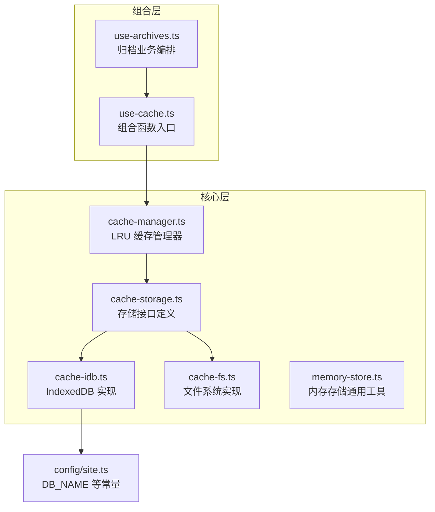
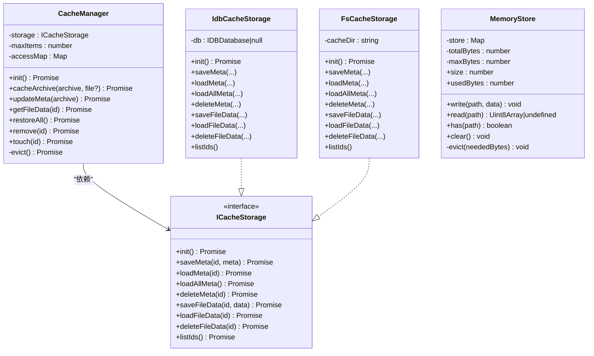
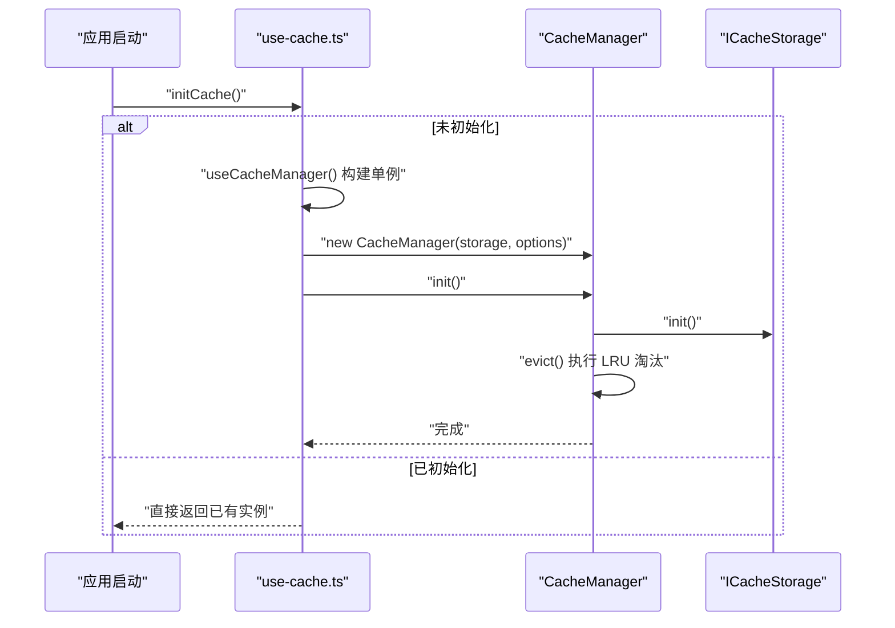
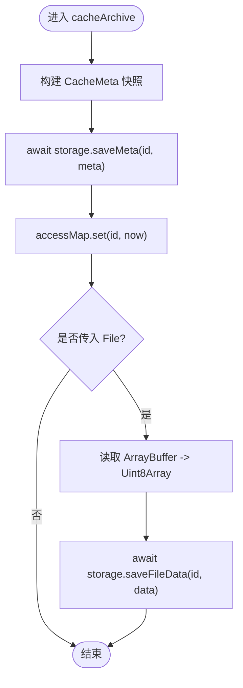
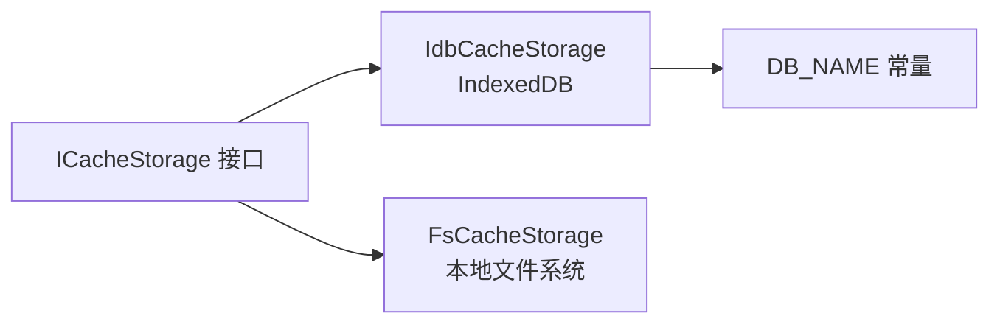
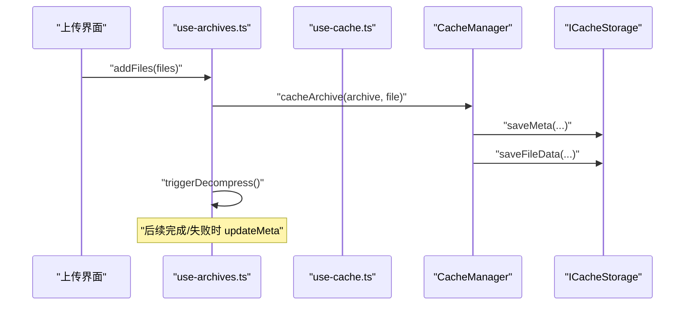
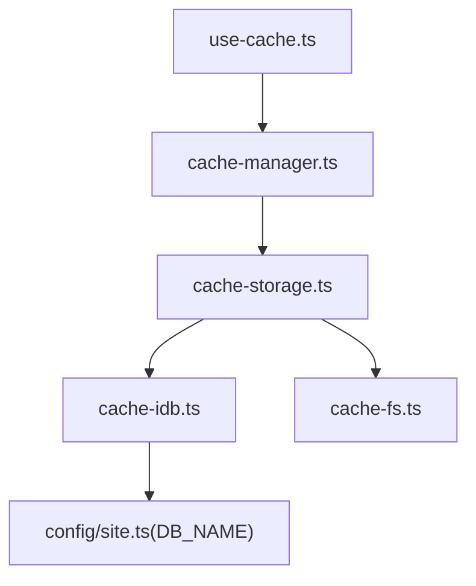

# 缓存管理组合函数

<cite>
**本文引用的文件**   
- [use-cache.ts](file://src/composables/use-cache.ts)
- [cache-manager.ts](file://src/core/cache-manager.ts)
- [cache-storage.ts](file://src/core/cache-storage.ts)
- [cache-idb.ts](file://src/core/cache-idb.ts)
- [cache-fs.ts](file://src/core/cache-fs.ts)
- [memory-store.ts](file://src/core/memory-store.ts)
- [index.ts](file://src/config/site.ts)
- [use-archives.ts](file://src/composables/use-archives.ts)
- [use-cache.test.ts](file://src/__tests__\composables\use-cache.test.ts)
- [cache-manager.test.ts](file://src/__tests__\core\cache-manager.test.ts)
- [memory-cache-storage.ts](file://src/__tests__\memory-cache-storage.ts)
</cite>

## 目录
1. [简介](#简介)
2. [项目结构](#项目结构)
3. [核心组件](#核心组件)
4. [架构总览](#架构总览)
5. [详细组件分析](#详细组件分析)
6. [依赖关系分析](#依赖关系分析)
7. [性能考量](#性能考量)
8. [故障排查指南](#故障排查指南)
9. [结论](#结论)
10. [附录](#附录)

## 简介
本文件聚焦于“缓存管理组合函数”的设计与实现，围绕以下目标展开：
- 提供跨平台（Web/Tauri）一致的归档缓存能力
- 通过 LRU 策略控制缓存规模，避免持久化空间膨胀
- 在应用启动时恢复上次会话的归档元数据，支持按需读取二进制数据
- 以组合函数形式暴露单例化的 CacheManager，简化上层调用

## 项目结构
与缓存相关的代码主要分布在 composables、core 与 config 三个层次：
- composables：对外暴露的组合函数入口（useCacheManager、initCache）
- core：缓存管理器与存储抽象及具体实现（CacheManager、ICacheStorage、IdbCacheStorage、FsCacheStorage）
- config：IndexedDB 数据库名等全局常量
- tests：针对组合函数与管理器的单元测试与内存版存储实现

图表来源
- [use-cache.ts:1-51](file://src/composables/use-cache.ts#L1-L51)
- [cache-manager.ts:1-144](file://src/core/cache-manager.ts#L1-L144)
- [cache-storage.ts:1-60](file://src/core/cache-storage.ts#L1-L60)
- [cache-idb.ts:1-109](file://src/core/cache-idb.ts#L1-L109)
- [cache-fs.ts:1-137](file://src/core/cache-fs.ts#L1-L137)
- [memory-store.ts:1-62](file://src/core/memory-store.ts#L1-L62)
- [index.ts:24-26](file://src/config/site.ts#L24-L26)

章节来源
- [use-cache.ts:1-51](file://src/composables/use-cache.ts#L1-L51)
- [cache-manager.ts:1-144](file://src/core/cache-manager.ts#L1-L144)
- [cache-storage.ts:1-60](file://src/core/cache-storage.ts#L1-L60)
- [cache-idb.ts:1-109](file://src/core/cache-idb.ts#L1-L109)
- [cache-fs.ts:1-137](file://src/core/cache-fs.ts#L1-L137)
- [memory-store.ts:1-62](file://src/core/memory-store.ts#L1-L62)
- [index.ts:24-26](file://src/config/site.ts#L24-L26)

## 核心组件
- 组合函数 useCacheManager/initCache
  - 根据 __PLATFORM__ 选择 ICacheStorage 后端（Tauri 使用 FsCacheStorage，Web 使用 IdbCacheStorage）
  - 返回 CacheManager 单例；initCache 负责首次初始化并触发 LRU 淘汰
- 缓存管理器 CacheManager
  - 维护 accessMap（id -> lastAccessed）用于快速 LRU 计算
  - 提供 cacheArchive/updateMeta/getFileData/restoreAll/remove/touch/evict 等方法
  - 保证元数据写入顺序与状态一致性（先保存元数据，再异步保存二进制）
- 存储接口 ICacheStorage 与实现
  - ICacheStorage：统一抽象 save/load/delete/listIds 等操作
  - IdbCacheStorage：基于 IndexedDB 的 meta/filedata 两个 ObjectStore
  - FsCacheStorage：基于 Tauri 命令读写本地 .cache/meta 与 .cache/data 目录
- 配置常量 DB_NAME
  - 指定 IndexedDB 数据库名称，供 IdbCacheStorage 使用

章节来源
- [use-cache.ts:1-51](file://src/composables/use-cache.ts#L1-L51)
- [cache-manager.ts:1-144](file://src/core/cache-manager.ts#L1-L144)
- [cache-storage.ts:1-60](file://src/core/cache-storage.ts#L1-L60)
- [cache-idb.ts:1-109](file://src/core/cache-idb.ts#L1-L109)
- [cache-fs.ts:1-137](file://src/core/cache-fs.ts#L1-L137)
- [index.ts:24-26](file://src/config/site.ts#L24-L26)

## 架构总览
整体采用“组合函数 + 管理器 + 存储抽象 + 多后端实现”的分层设计。组合函数屏蔽平台差异，管理器封装 LRU 策略与访问时序，存储层隔离持久化细节。

图表来源
- [cache-manager.ts:1-144](file://src/core/cache-manager.ts#L1-L144)
- [cache-storage.ts:1-60](file://src/core/cache-storage.ts#L1-L60)
- [cache-idb.ts:1-109](file://src/core/cache-idb.ts#L1-L109)
- [cache-fs.ts:1-137](file://src/core/cache-fs.ts#L1-L137)
- [memory-store.ts:1-62](file://src/core/memory-store.ts#L1-L62)

## 详细组件分析

### 组合函数 use-cache.ts
- 职责
  - 根据 __PLATFORM__ 创建对应 ICacheStorage 实例
  - 构造并缓存 CacheManager 单例
  - initCache 确保仅初始化一次，并返回已初始化的管理器
- 关键点
  - 懒初始化与幂等性：initPromise 防止并发重复初始化
  - resetCache 仅用于测试环境重置单例

图表来源
- [use-cache.ts:17-42](file://src/composables/use-cache.ts#L17-L42)
- [cache-manager.ts:25-29](file://src/core/cache-manager.ts#L25-L29)

章节来源
- [use-cache.ts:1-51](file://src/composables/use-cache.ts#L1-L51)

### 缓存管理器 CacheManager
- 数据结构
  - accessMap：内存中 id -> lastAccessed，加速 LRU 决策
- 关键流程
  - cacheArchive：先持久化元数据，再异步持久化二进制数据，避免状态覆盖
  - updateMeta：增量更新元数据（状态、文件树、时间戳等）
  - getFileData：读取二进制后自动 touch 更新 lastAccessed
  - restoreAll：重建 accessMap，返回按 lastAccessed 升序的元数据列表
  - evict：当数量超过 maxItems，删除最旧条目
- 复杂度
  - 单次操作多为 O(1) 或 O(logN)/O(N) 取决于底层存储排序与遍历
  - evict 在最坏情况下需扫描全部元数据并按 lastAccessed 排序

图表来源
- [cache-manager.ts:36-63](file://src/core/cache-manager.ts#L36-L63)

章节来源
- [cache-manager.ts:1-144](file://src/core/cache-manager.ts#L1-L144)

### 存储抽象与实现
- ICacheStorage
  - 定义统一的元数据与二进制数据存取接口
  - loadAllMeta 约定返回按 lastAccessed 升序的结果，便于 LRU 淘汰
- IdbCacheStorage（Web）
  - 使用两个 ObjectStore：meta 与 filedata
  - 通过 openDB 延迟建库与建表
  - listIds 返回所有键值
- FsCacheStorage（Tauri）
  - 通过 @tauri-apps/api/core.invoke 调用 Rust 命令
  - 目录结构：{app_data_dir}/.cache/meta/{id}.json 与 {app_data_dir}/.cache/data/{id}.bin
  - 容错处理：文件不存在时返回 null 或忽略错误

图表来源
- [cache-storage.ts:1-60](file://src/core/cache-storage.ts#L1-L60)
- [cache-idb.ts:1-109](file://src/core/cache-idb.ts#L1-L109)
- [cache-fs.ts:1-137](file://src/core/cache-fs.ts#L1-L137)
- [index.ts:24-26](file://src/config/site.ts#L24-L26)

章节来源
- [cache-storage.ts:1-60](file://src/core/cache-storage.ts#L1-L60)
- [cache-idb.ts:1-109](file://src/core/cache-idb.ts#L1-L109)
- [cache-fs.ts:1-137](file://src/core/cache-fs.ts#L1-L137)
- [index.ts:24-26](file://src/config/site.ts#L24-L26)

### 内存存储 MemoryStore（通用工具）
- 用途
  - 提供进程内字节级容量控制的 LRU 淘汰，适合临时缓冲或测试
- 特性
  - 默认上限 256MB，超出时按插入顺序淘汰最早条目
  - 提供 usedBytes/size 等统计信息

章节来源
- [memory-store.ts:1-62](file://src/core/memory-store.ts#L1-L62)

### 与归档业务的集成 use-archives.ts
- 职责
  - 管理归档列表、去重、状态更新、从缓存恢复、触发解压
- 与缓存交互
  - addFiles：先持久化元数据，再触发解压
  - remove：异步清理缓存
  - updateStatus：在 completed/failed 时更新元数据
  - restoreFromCache：恢复元数据并重建去重集合，必要时重试 pending 任务

图表来源
- [use-archives.ts:18-51](file://src/composables/use-archives.ts#L18-L51)
- [use-cache.ts:17-42](file://src/composables/use-cache.ts#L17-L42)
- [cache-manager.ts:36-63](file://src/core/cache-manager.ts#L36-L63)

章节来源
- [use-archives.ts:1-168](file://src/composables/use-archives.ts#L1-168)

## 依赖关系分析
- 组合函数 use-cache.ts 依赖 CacheManager 与 ICacheStorage 的具体实现
- CacheManager 仅依赖 ICacheStorage 接口，解耦了平台差异
- IdbCacheStorage 依赖配置中的 DB_NAME
- FsCacheStorage 依赖 Tauri 运行时命令（通过动态 import 获取 invoke）

图表来源
- [use-cache.ts:1-51](file://src/composables/use-cache.ts#L1-L51)
- [cache-manager.ts:1-144](file://src/core/cache-manager.ts#L1-L144)
- [cache-storage.ts:1-60](file://src/core/cache-storage.ts#L1-L60)
- [cache-idb.ts:1-109](file://src/core/cache-idb.ts#L1-L109)
- [cache-fs.ts:1-137](file://src/core/cache-fs.ts#L1-L137)
- [index.ts:24-26](file://src/config/site.ts#L24-L26)

章节来源
- [use-cache.ts:1-51](file://src/composables/use-cache.ts#L1-L51)
- [cache-manager.ts:1-144](file://src/core/cache-manager.ts#L1-L144)
- [cache-storage.ts:1-60](file://src/core/cache-storage.ts#L1-L60)
- [cache-idb.ts:1-109](file://src/core/cache-idb.ts#L1-L109)
- [cache-fs.ts:1-137](file://src/core/cache-fs.ts#L1-L137)
- [index.ts:24-26](file://src/config/site.ts#L24-L26)

## 性能考量
- LRU 淘汰时机
  - 在 init 阶段执行 evict，避免运行期频繁触发
  - 读取二进制数据时通过 touch 更新 lastAccessed，提升热项存活概率
- 元数据与二进制分离
  - 元数据轻量且频繁访问，二进制仅在需要时加载，降低 IO 压力
- 内存占用
  - MemoryStore 提供可配置的字节上限与 LRU 淘汰，适用于临时缓冲场景
- 并发与幂等
  - initCache 使用 initPromise 保证幂等，避免重复初始化带来的额外开销

[本节为通用指导，不直接分析具体文件]

## 故障排查指南
- 现象：初始化后无法恢复归档列表
  - 检查 ICacheStorage.init 是否成功（IDB 建库/目录创建）
  - 确认 loadAllMeta 返回结果是否为空或未按 lastAccessed 排序
- 现象：新增缓存后旧项未被淘汰
  - 确认 maxItems 设置与 evict 逻辑是否生效
  - 检查 touch 是否在读取路径中被调用
- 现象：Tauri 端读写失败
  - 检查 get_app_data_dir、ensure_dir、write_file、read_file、delete_file、list_files 等命令可用性
  - 关注文件路径拼接与权限问题
- 现象：Web 端 IndexedDB 异常
  - 核对 DB_NAME 是否正确
  - 检查 ObjectStore 是否存在以及事务是否成功

章节来源
- [cache-manager.ts:25-29](file://src/core/cache-manager.ts#L25-L29)
- [cache-manager.ts:132-142](file://src/core/cache-manager.ts#L132-L142)
- [cache-idb.ts:11-26](file://src/core/cache-idb.ts#L11-L26)
- [cache-fs.ts:27-34](file://src/core/cache-fs.ts#L27-L34)
- [index.ts:24-26](file://src/config/site.ts#L24-L26)

## 结论
该缓存管理组合函数通过清晰的接口分层与平台适配，提供了稳定、可扩展的归档缓存能力。结合 LRU 策略与元数据/二进制分离，既保证了用户体验，又兼顾了资源占用与持久化效率。配合完善的单元测试，系统具备较高的可维护性与可靠性。

[本节为总结性内容，不直接分析具体文件]

## 附录

### API 速览（组合函数）
- useCacheManager(): 返回 CacheManager 单例
- initCache(): 初始化并返回 CacheManager
- resetCache(): 重置单例（仅测试）

章节来源
- [use-cache.ts:17-51](file://src/composables/use-cache.ts#L17-L51)

### 单元测试要点
- use-cache.test.ts
  - 验证 useCacheManager 返回单例
  - 验证 resetCache 后重新获取为新实例
  - 验证 initCache 返回有效实例
- cache-manager.test.ts
  - 验证缓存写入/读取、恢复、删除、LRU 淘汰、元数据更新等行为

章节来源
- [use-cache.test.ts:1-57](file://src/__tests__\composables\use-cache.test.ts#L1-L57)
- [cache-manager.test.ts:1-172](file://src/__tests__\core\cache-manager.test.ts#L1-L172)
- [memory-cache-storage.ts:1-56](file://src/__tests__\memory-cache-storage.ts#L1-L56)