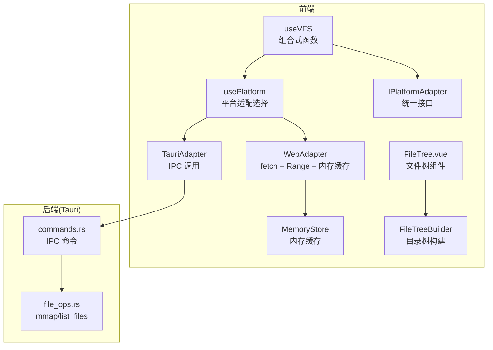
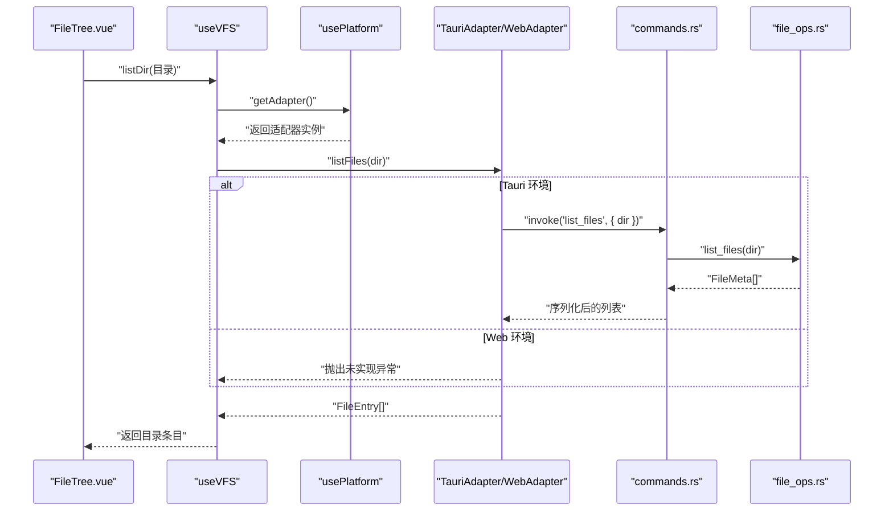
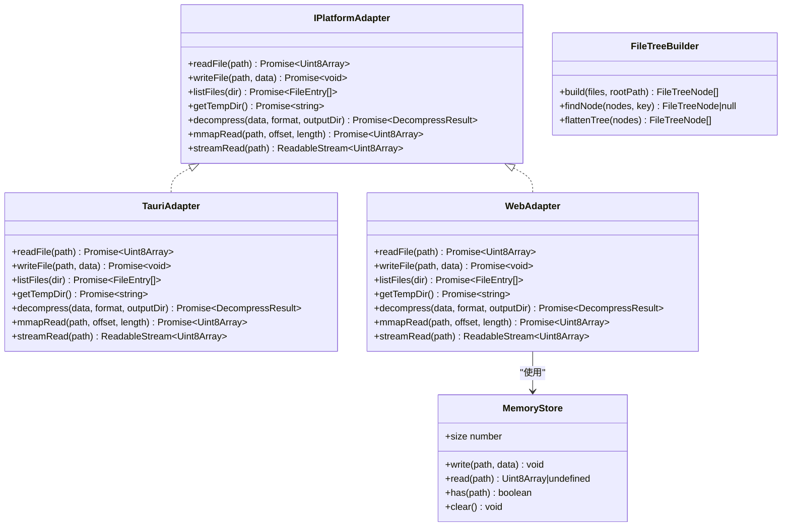
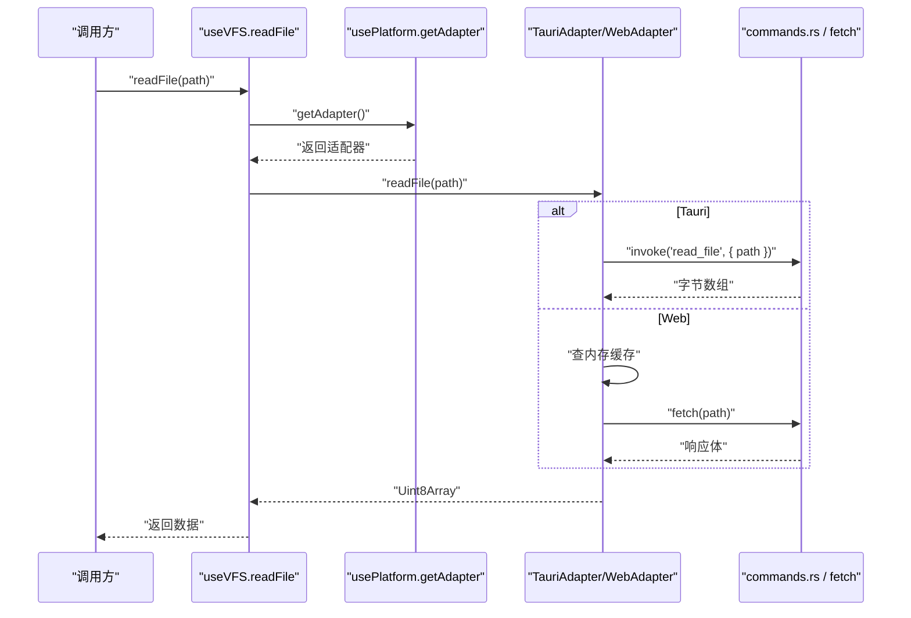
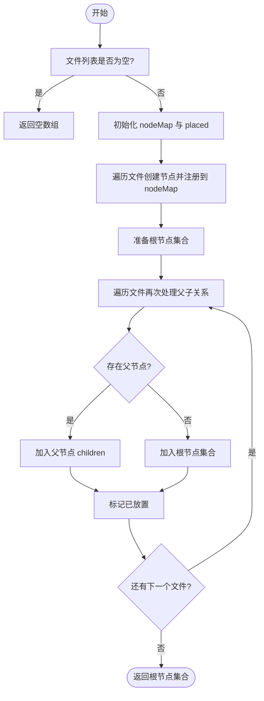
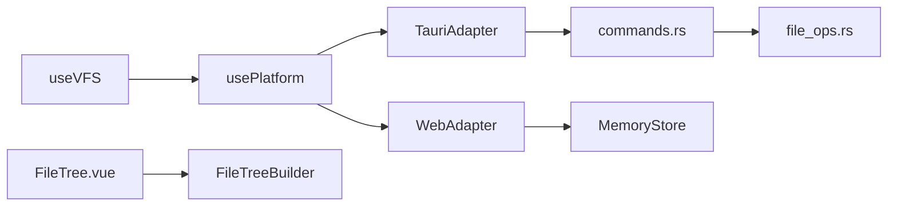

# 虚拟文件系统 (useVFS)

<cite>
**本文引用的文件**   
- [src/composables/use-vfs.ts](file://src/composables/use-vfs.ts)
- [src/composables/use-platform.ts](file://src/composables/use-platform.ts)
- [src/adapters/types.ts](file://src/adapters/types.ts)
- [src/adapters/tauri-adapter.ts](file://src/adapters/tauri-adapter.ts)
- [src/adapters/web-adapter.ts](file://src/adapters/web-adapter.ts)
- [src/core/memory-store.ts](file://src/core/memory-store.ts)
- [src/core/file-tree.ts](file://src/core/file-tree.ts)
- [src/components/archive-panel/FileTree.vue](file://src/components/archive-panel/FileTree.vue)
- [src-tauri/src/commands.rs](file://src-tauri/src/commands.rs)
- [src-tauri/src/file_ops.rs](file://src-tauri/src/file_ops.rs)
</cite>

## 目录
1. [简介](#简介)
2. [项目结构](#项目结构)
3. [核心组件](#核心组件)
4. [架构总览](#架构总览)
5. [详细组件分析](#详细组件分析)
6. [依赖关系分析](#依赖关系分析)
7. [性能考量](#性能考量)
8. [故障排查指南](#故障排查指南)
9. [结论](#结论)
10. [附录](#附录)

## 简介
本文件围绕 useVFS 组合式函数，系统化阐述虚拟文件系统（VFS）抽象层的设计与实现。内容涵盖：
- 平台无关的 I/O 抽象与适配器模式
- 路径解析、目录结构映射与跨平台路径处理策略
- 与真实文件系统的同步机制、事件监听与缓存策略
- 在文件树组件中的导航、面包屑生成与权限检查实践
- 文件系统事件处理与错误恢复机制的实现细节

## 项目结构
useVFS 位于组合式函数目录中，通过 usePlatform 动态加载平台适配器（Tauri 或 Web），并基于统一接口 IPlatformAdapter 暴露 readFile 与 listDir 能力。底层 Tauri 侧通过 IPC 命令调用 Rust 实现的文件操作；Web 侧则使用 fetch、Range 请求与内存缓存模拟文件系统行为。

图表来源
- [src/composables/use-vfs.ts:1-17](file://src/composables/use-vfs.ts#L1-L17)
- [src/composables/use-platform.ts:1-25](file://src/composables/use-platform.ts#L1-L25)
- [src/adapters/types.ts:1-12](file://src/adapters/types.ts#L1-L12)
- [src/adapters/tauri-adapter.ts:1-62](file://src/adapters/tauri-adapter.ts#L1-L62)
- [src/adapters/web-adapter.ts:1-73](file://src/adapters/web-adapter.ts#L1-L73)
- [src/core/memory-store.ts:1-25](file://src/core/memory-store.ts#L1-L25)
- [src/core/file-tree.ts:1-69](file://src/core/file-tree.ts#L1-L69)
- [src-tauri/src/commands.rs:1-35](file://src-tauri/src/commands.rs#L1-L35)
- [src-tauri/src/file_ops.rs:1-87](file://src-tauri/src/file_ops.rs#L1-L87)

章节来源
- [src/composables/use-vfs.ts:1-17](file://src/composables/use-vfs.ts#L1-L17)
- [src/composables/use-platform.ts:1-25](file://src/composables/use-platform.ts#L1-L25)
- [src/adapters/types.ts:1-12](file://src/adapters/types.ts#L1-L12)
- [src/adapters/tauri-adapter.ts:1-62](file://src/adapters/tauri-adapter.ts#L1-L62)
- [src/adapters/web-adapter.ts:1-73](file://src/adapters/web-adapter.ts#L1-L73)
- [src/core/memory-store.ts:1-25](file://src/core/memory-store.ts#L1-L25)
- [src/core/file-tree.ts:1-69](file://src/core/file-tree.ts#L1-L69)
- [src-tauri/src/commands.rs:1-35](file://src-tauri/src/commands.rs#L1-L35)
- [src-tauri/src/file_ops.rs:1-87](file://src-tauri/src/file_ops.rs#L1-L87)

## 核心组件
- useVFS：提供平台无关的文件读取与目录列举能力，内部委托给当前平台的适配器实例。
- usePlatform：根据编译期常量 __PLATFORM__ 动态导入并缓存 TauriAdapter 或 WebAdapter，对外暴露 getAdapter。
- IPlatformAdapter：定义统一的平台适配接口，包含读、写、列表、临时目录、解压、内存映射读取与流式读取等能力。
- TauriAdapter：通过懒加载 @tauri-apps/api/core.invoke 调用后端命令，完成读写、列表、mmap 与流式读取。
- WebAdapter：基于 fetch 与 Range 头实现分片读取，结合 MemoryStore 做内存缓存；部分写入/列表/解压方法在 Web 模式下不可用。
- MemoryStore：进程内 Map 缓存，用于 Web 模式下减少重复网络请求。
- FileTreeBuilder：将扁平的 FileEntry 列表构造成树形结构，并提供查找与展平工具方法。
- FileTree.vue：文件树 UI 组件，支持过滤、展开与节点选择后打开标签页。

章节来源
- [src/composables/use-vfs.ts:1-17](file://src/composables/use-vfs.ts#L1-L17)
- [src/composables/use-platform.ts:1-25](file://src/composables/use-platform.ts#L1-L25)
- [src/adapters/types.ts:1-12](file://src/adapters/types.ts#L1-L12)
- [src/adapters/tauri-adapter.ts:1-62](file://src/adapters/tauri-adapter.ts#L1-L62)
- [src/adapters/web-adapter.ts:1-73](file://src/adapters/web-adapter.ts#L1-L73)
- [src/core/memory-store.ts:1-25](file://src/core/memory-store.ts#L1-L25)
- [src/core/file-tree.ts:1-69](file://src/core/file-tree.ts#L1-L69)
- [src/components/archive-panel/FileTree.vue:1-42](file://src/components/archive-panel/FileTree.vue#L1-L42)

## 架构总览
useVFS 作为上层 API，屏蔽平台差异；usePlatform 负责运行时选择具体适配器；TauriAdapter 与 WebAdapter 分别对接系统文件与浏览器环境；Rust 端提供 mmap 与递归遍历能力；UI 层通过 FileTreeBuilder 将结果渲染为可交互的树。

图表来源
- [src/composables/use-vfs.ts:1-17](file://src/composables/use-vfs.ts#L1-L17)
- [src/composables/use-platform.ts:1-25](file://src/composables/use-platform.ts#L1-L25)
- [src/adapters/tauri-adapter.ts:1-62](file://src/adapters/tauri-adapter.ts#L1-L62)
- [src/adapters/web-adapter.ts:1-73](file://src/adapters/web-adapter.ts#L1-L73)
- [src-tauri/src/commands.rs:1-35](file://src-tauri/src/commands.rs#L1-L35)
- [src-tauri/src/file_ops.rs:1-87](file://src-tauri/src/file_ops.rs#L1-L87)

## 详细组件分析

### useVFS 组合式函数
- 职责：封装平台无关的文件读取与目录列举 API，向上层组件提供稳定接口。
- 关键流程：
  - 通过 usePlatform.getAdapter() 获取当前平台适配器
  - 转发 readFile(path) 与 listDir(dir) 到适配器对应方法
- 设计要点：
  - 无状态、轻量代理，避免在组合式函数中持有平台相关状态
  - 便于后续扩展更多 VFS 能力（如 stat、rename、watch 等）

章节来源
- [src/composables/use-vfs.ts:1-17](file://src/composables/use-vfs.ts#L1-L17)
- [src/composables/use-platform.ts:1-25](file://src/composables/use-platform.ts#L1-L25)

### 平台适配与选择（usePlatform）
- 职责：根据 __PLATFORM__ 编译期常量动态导入并缓存 TauriAdapter 或 WebAdapter，保证单例复用。
- 关键点：
  - 首次调用时按需 import，降低启动开销
  - 返回 isTauri/isWeb 布尔标记，供上层判断运行环境

章节来源
- [src/composables/use-platform.ts:1-25](file://src/composables/use-platform.ts#L1-L25)

### 统一接口（IPlatformAdapter）
- 定义：readFile、writeFile、listFiles、getTempDir、decompress、mmapRead、streamRead。
- 作用：约束各平台实现的一致性，确保上层无需关心平台差异。

章节来源
- [src/adapters/types.ts:1-12](file://src/adapters/types.ts#L1-L12)

### TauriAdapter（Tauri 平台）
- 特点：
  - 懒加载 invoke，避免在未使用 Tauri 时引入额外依赖
  - 所有 I/O 均通过 IPC 调用 commands.rs 暴露的命令
  - streamRead 在当前实现中以全量读取后包装为 ReadableStream，后续可通过事件或插件实现分块
- 安全：
  - 后端 read_file 命令对路径进行“..”检测，拒绝路径穿越

章节来源
- [src/adapters/tauri-adapter.ts:1-62](file://src/adapters/tauri-adapter.ts#L1-L62)
- [src-tauri/src/commands.rs:1-35](file://src-tauri/src/commands.rs#L1-L35)

### WebAdapter（Web 平台）
- 特点：
  - readFile 优先命中 MemoryStore，否则发起 fetch 并缓存
  - mmapRead 利用 HTTP Range 头实现字节范围读取
  - streamRead 支持从内存或网络流式读取
  - writeFile/listFiles/decompress 在 Web 模式下抛出未实现错误
- 缓存：
  - 通过 memoryStore 提供进程内缓存，减少重复网络请求

章节来源
- [src/adapters/web-adapter.ts:1-73](file://src/adapters/web-adapter.ts#L1-L73)
- [src/core/memory-store.ts:1-25](file://src/core/memory-store.ts#L1-L25)

### 目录树构建（FileTreeBuilder）
- 输入：扁平的 FileEntry[] 与根路径 rootPath
- 输出：层级化的 FileTreeNode[]
- 算法要点：
  - 一次遍历建立节点映射
  - 二次遍历按父路径挂载子节点
  - 提供静态方法 findNode 与 flattenTree 辅助 UI 与搜索

章节来源
- [src/core/file-tree.ts:1-69](file://src/core/file-tree.ts#L1-L69)

### 文件树 UI（FileTree.vue）
- 功能：
  - 文本过滤、虚拟滚动、默认折叠
  - 选中叶子节点后打开标签页
- 集成点：
  - 使用 FileTreeBuilder.findNode 定位节点
  - 与标签管理组合式函数协作打开预览

章节来源
- [src/components/archive-panel/FileTree.vue:1-42](file://src/components/archive-panel/FileTree.vue#L1-L42)

### 类图（代码级关系）

图表来源
- [src/adapters/types.ts:1-12](file://src/adapters/types.ts#L1-L12)
- [src/adapters/tauri-adapter.ts:1-62](file://src/adapters/tauri-adapter.ts#L1-L62)
- [src/adapters/web-adapter.ts:1-73](file://src/adapters/web-adapter.ts#L1-L73)
- [src/core/memory-store.ts:1-25](file://src/core/memory-store.ts#L1-L25)
- [src/core/file-tree.ts:1-69](file://src/core/file-tree.ts#L1-L69)

### 序列图（读取文件）

图表来源
- [src/composables/use-vfs.ts:1-17](file://src/composables/use-vfs.ts#L1-L17)
- [src/composables/use-platform.ts:1-25](file://src/composables/use-platform.ts#L1-L25)
- [src/adapters/tauri-adapter.ts:1-62](file://src/adapters/tauri-adapter.ts#L1-L62)
- [src/adapters/web-adapter.ts:1-73](file://src/adapters/web-adapter.ts#L1-L73)
- [src-tauri/src/commands.rs:1-35](file://src-tauri/src/commands.rs#L1-L35)

### 流程图（目录树构建）

图表来源
- [src/core/file-tree.ts:1-69](file://src/core/file-tree.ts#L1-L69)

## 依赖关系分析
- useVFS 仅依赖 usePlatform，保持低耦合
- usePlatform 在运行时决定加载 TauriAdapter 或 WebAdapter，并通过 Promise 缓存单例
- TauriAdapter 依赖 @tauri-apps/api/core.invoke 与后端命令
- WebAdapter 依赖 fetch、ReadableStream 与 MemoryStore
- FileTreeBuilder 与 FileTree.vue 解耦于 VFS，只消费 FileEntry 与 FileTreeNode

图表来源
- [src/composables/use-vfs.ts:1-17](file://src/composables/use-vfs.ts#L1-L17)
- [src/composables/use-platform.ts:1-25](file://src/composables/use-platform.ts#L1-L25)
- [src/adapters/tauri-adapter.ts:1-62](file://src/adapters/tauri-adapter.ts#L1-L62)
- [src/adapters/web-adapter.ts:1-73](file://src/adapters/web-adapter.ts#L1-L73)
- [src/core/memory-store.ts:1-25](file://src/core/memory-store.ts#L1-L25)
- [src/core/file-tree.ts:1-69](file://src/core/file-tree.ts#L1-L69)
- [src-tauri/src/commands.rs:1-35](file://src-tauri/src/commands.rs#L1-L35)
- [src-tauri/src/file_ops.rs:1-87](file://src-tauri/src/file_ops.rs#L1-L87)

## 性能考量
- 懒加载与单例：usePlatform 延迟导入适配器并缓存，减少首屏开销
- 内存缓存：WebAdapter 结合 MemoryStore 缓存已读取文件，降低重复网络请求
- 分片读取：WebAdapter.mmapRead 使用 Range 头实现字节范围读取，适合大文件预览
- 流式读取：WebAdapter.streamRead 支持从内存或网络流式传输，利于大数据展示
- 后端 mmap：TauriAdapter.mmapRead 借助 memmap2 高效读取大文件片段
- 目录遍历：Rust 端递归遍历目录，注意深层目录的性能影响，必要时可分页或增量加载

[本节为通用性能建议，不直接分析具体文件]

## 故障排查指南
- 路径穿越防护
  - Tauri 后端 read_file 命令会拒绝包含 ".." 的路径，若出现权限错误，请检查传入路径是否合法
- Web 模式限制
  - WebAdapter 的 writeFile、listFiles、decompress 明确抛出未实现错误，需在 Web 环境下规避这些调用
- 网络错误
  - WebAdapter 在 fetch 失败时会抛出包含 HTTP 状态码的错误信息，需在上层捕获并提示用户
- 缓存一致性
  - MemoryStore 为进程内缓存，刷新页面后失效；如需持久化，应结合持久化存储或重新拉取
- 流式读取异常
  - WebAdapter.streamRead 在读取过程中发生错误会通过 controller.error 上报，建议在消费者侧监听 error 事件

章节来源
- [src-tauri/src/commands.rs:1-35](file://src-tauri/src/commands.rs#L1-L35)
- [src/adapters/web-adapter.ts:1-73](file://src/adapters/web-adapter.ts#L1-L73)

## 结论
useVFS 以极简的代理形式提供了平台无关的文件访问能力，配合 usePlatform 的动态适配与 IPlatformAdapter 的统一契约，实现了良好的可扩展性与可测试性。Tauri 与 Web 两套实现覆盖了桌面与浏览器场景，并在 Web 侧通过 Range 与流式读取优化了大文件体验。结合 FileTreeBuilder 与 UI 组件，能够快速构建具备导航、过滤与预览能力的文件浏览界面。

[本节为总结性内容，不直接分析具体文件]

## 附录

### 实际使用示例（概念说明）
- 虚拟导航
  - 在文件树组件中，当用户点击某节点时，先判断是否为叶子节点，若是则打开新标签页进行预览
  - 参考路径：[src/components/archive-panel/FileTree.vue:16-23](file://src/components/archive-panel/FileTree.vue#L16-L23)
- 路径面包屑生成
  - 基于节点的 path 字段，按分隔符拆分得到各级目录名，拼接成面包屑
  - 参考类型定义：[src/types/index.ts:17-24](file://src/types/index.ts#L17-L24)
- 文件权限检查
  - 在 Tauri 环境中，后端 read_file 命令会对路径进行安全检查，禁止路径穿越
  - 参考实现：[src-tauri/src/commands.rs:6-14](file://src-tauri/src/commands.rs#L6-L14)

章节来源
- [src/components/archive-panel/FileTree.vue:16-23](file://src/components/archive-panel/FileTree.vue#L16-L23)
- [src/types/index.ts:17-24](file://src/types/index.ts#L17-L24)
- [src-tauri/src/commands.rs:6-14](file://src-tauri/src/commands.rs#L6-L14)