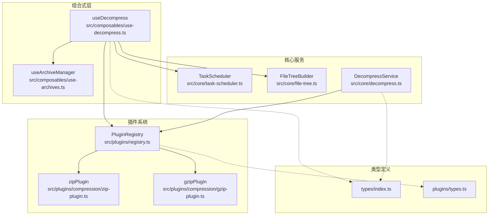
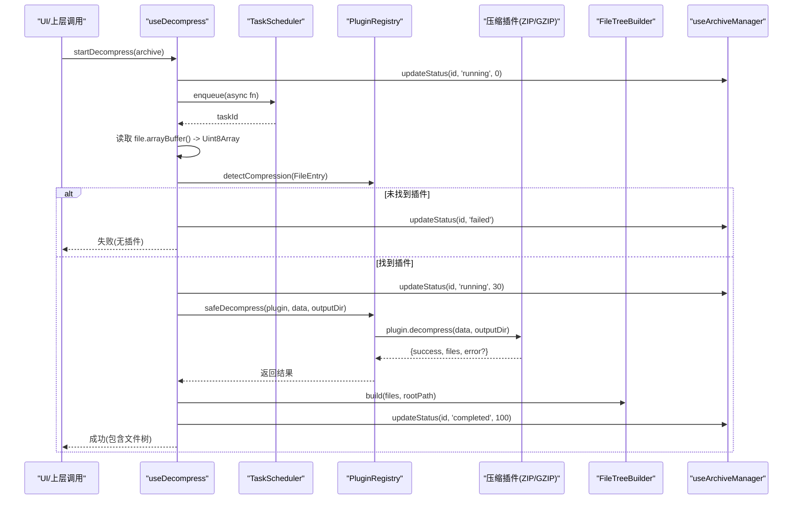
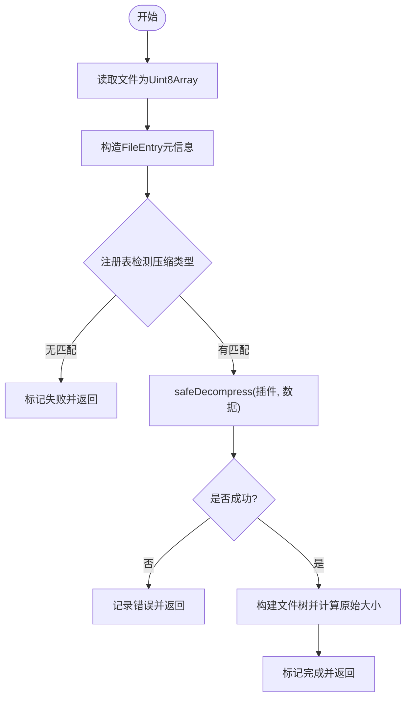
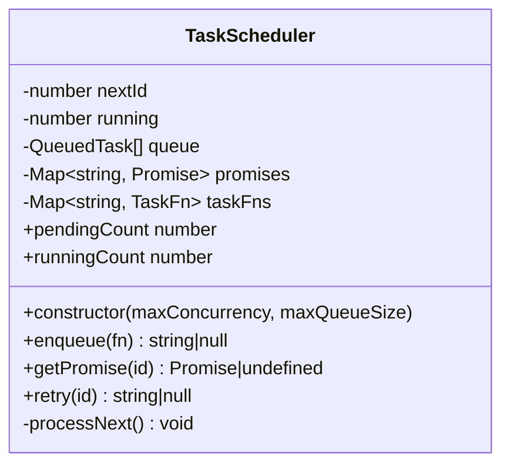
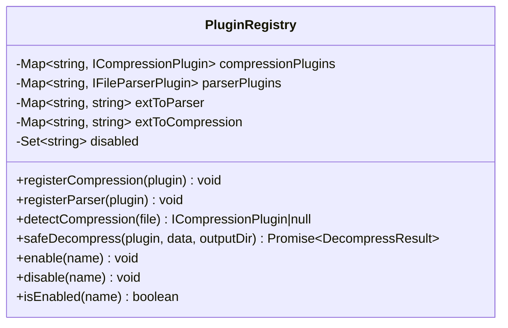
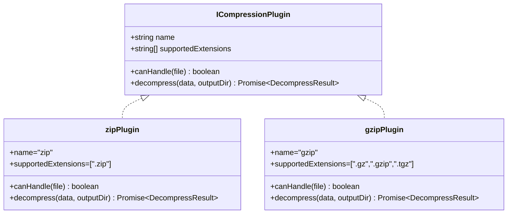
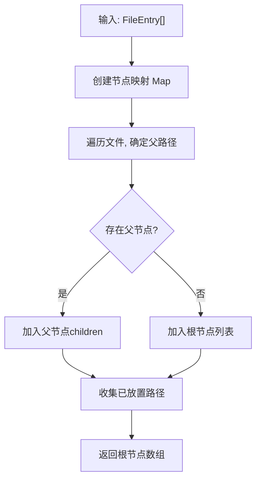
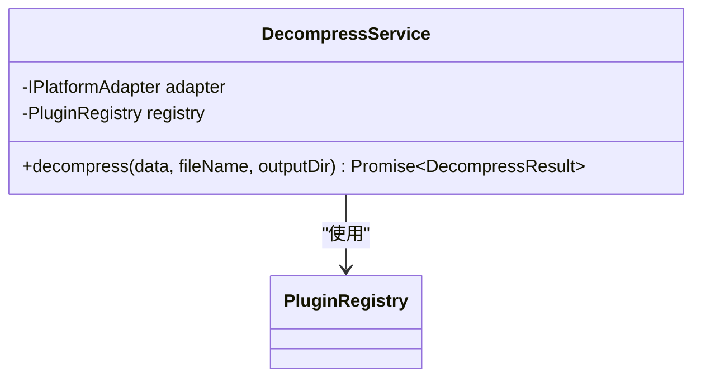
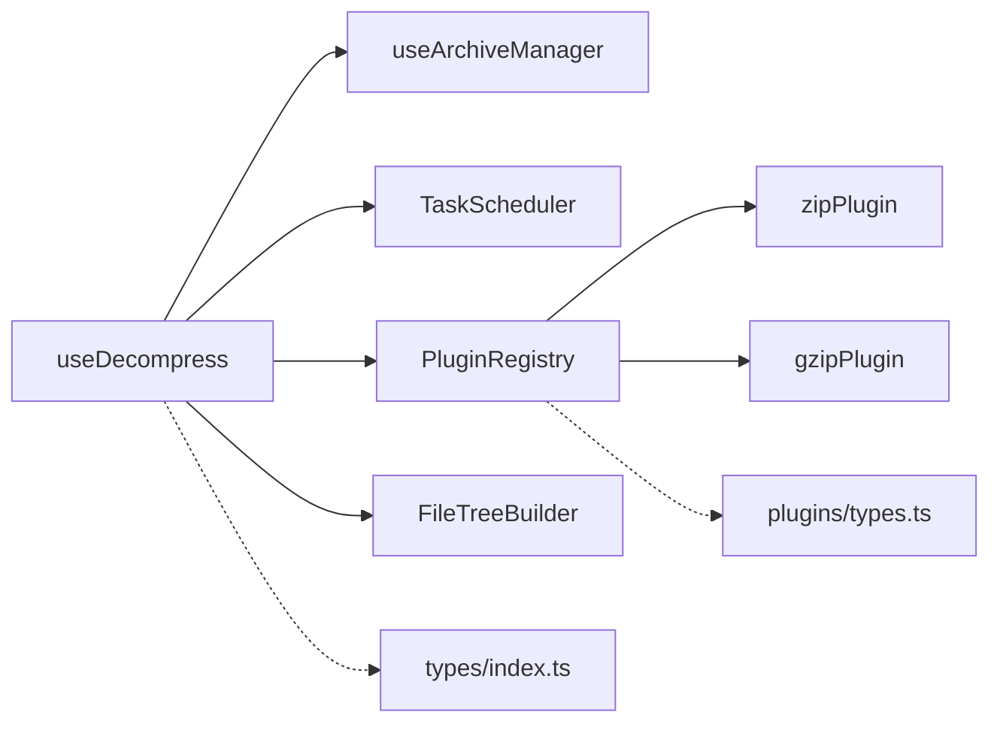

# 解压处理 (useDecompress)

<cite>
**本文引用的文件**   
- [src/composables/use-decompress.ts](file://src/composables/use-decompress.ts)
- [src/composables/use-archives.ts](file://src/composables/use-archives.ts)
- [src/core/decompress.ts](file://src/core/decompress.ts)
- [src/plugins/registry.ts](file://src/plugins/registry.ts)
- [src/plugins/compression/zip-plugin.ts](file://src/plugins/compression/zip-plugin.ts)
- [src/plugins/compression/gzip-plugin.ts](file://src/plugins/compression/gzip-plugin.ts)
- [src/core/task-scheduler.ts](file://src/core/task-scheduler.ts)
- [src/core/file-tree.ts](file://src/core/file-tree.ts)
- [src/types/index.ts](file://src/types/index.ts)
- [src/plugins/types.ts](file://src/plugins/types.ts)
- [src/__tests__/composables/use-archives.test.ts](file://src/__tests__/composables/use-archives.test.ts)
</cite>

## 目录
1. [简介](#简介)
2. [项目结构](#项目结构)
3. [核心组件](#核心组件)
4. [架构总览](#架构总览)
5. [详细组件分析](#详细组件分析)
6. [依赖关系分析](#依赖关系分析)
7. [性能考虑](#性能考虑)
8. [故障排查指南](#故障排查指南)
9. [结论](#结论)
10. [附录：集成示例与最佳实践](#附录集成示例与最佳实践)

## 简介
本文件围绕 useDecompress 组合式函数，系统化梳理其解压管道实现。内容涵盖 ZIP 与 GZIP 格式支持、异步解压流程、错误重试机制、进度反馈、decompressAll 方法工作流、文件格式检测算法、以及解压结果缓存策略。同时提供大文件解压、实时进度条展示、异常处理的完整集成思路，并给出分块解压、内存管理与并发控制等性能优化建议。

## 项目结构
useDecompress 位于组合式函数层，负责编排任务调度、插件注册表、文件树构建与状态更新；底层通过压缩插件（ZIP/GZIP）完成具体解压逻辑，并通过平台适配器在 Tauri 环境下调用原生能力。

图表来源
- [src/composables/use-decompress.ts:1-74](file://src/composables/use-decompress.ts#L1-L74)
- [src/composables/use-archives.ts:1-60](file://src/composables/use-archives.ts#L1-L60)
- [src/core/decompress.ts:1-27](file://src/core/decompress.ts#L1-L27)
- [src/plugins/registry.ts:1-118](file://src/plugins/registry.ts#L1-L118)
- [src/plugins/compression/zip-plugin.ts:1-40](file://src/plugins/compression/zip-plugin.ts#L1-L40)
- [src/plugins/compression/gzip-plugin.ts:1-44](file://src/plugins/compression/gzip-plugin.ts#L1-L44)
- [src/core/task-scheduler.ts:1-79](file://src/core/task-scheduler.ts#L1-L79)
- [src/core/file-tree.ts:1-69](file://src/core/file-tree.ts#L1-L69)
- [src/types/index.ts:1-71](file://src/types/index.ts#L1-L71)
- [src/plugins/types.ts:1-37](file://src/plugins/types.ts#L1-L37)

章节来源
- [src/composables/use-decompress.ts:1-74](file://src/composables/use-decompress.ts#L1-L74)
- [src/composables/use-archives.ts:1-60](file://src/composables/use-archives.ts#L1-L60)

## 核心组件
- useDecompress：对外暴露 startDecompress 与 decompressAll，协调任务调度、插件选择、进度更新与结果构建。
- TaskScheduler：限制最大并发与队列长度，提供 enqueue/retry 能力。
- PluginRegistry：维护压缩/解析插件注册表，提供 detectCompression 与 safeDecompress（含超时保护）。
- zipPlugin/gzipPlugin：分别实现 ZIP 与 GZIP 的解压逻辑，Tauri 环境走平台适配器，浏览器环境使用 fflate 或 DecompressionStream。
- FileTreeBuilder：将扁平的文件条目列表构造成树形结构，供 UI 渲染。
- DecompressService：面向服务的统一入口，封装“检测+安全解压”流程。

章节来源
- [src/composables/use-decompress.ts:1-74](file://src/composables/use-decompress.ts#L1-L74)
- [src/core/task-scheduler.ts:1-79](file://src/core/task-scheduler.ts#L1-L79)
- [src/plugins/registry.ts:1-118](file://src/plugins/registry.ts#L1-L118)
- [src/plugins/compression/zip-plugin.ts:1-40](file://src/plugins/compression/zip-plugin.ts#L1-L40)
- [src/plugins/compression/gzip-plugin.ts:1-44](file://src/plugins/compression/gzip-plugin.ts#L1-L44)
- [src/core/file-tree.ts:1-69](file://src/core/file-tree.ts#L1-L69)
- [src/core/decompress.ts:1-27](file://src/core/decompress.ts#L1-L27)

## 架构总览
useDecompress 作为编排器，按如下顺序执行：
- 读取文件为 Uint8Array
- 构造 FileEntry 元信息
- 通过注册表检测压缩类型
- 安全调用对应插件进行解压（带超时）
- 构建文件树并计算原始大小
- 更新归档项状态与进度

图表来源
- [src/composables/use-decompress.ts:14-62](file://src/composables/use-decompress.ts#L14-L62)
- [src/plugins/registry.ts:106-116](file://src/plugins/registry.ts#L106-L116)
- [src/plugins/compression/zip-plugin.ts:10-38](file://src/plugins/compression/zip-plugin.ts#L10-L38)
- [src/plugins/compression/gzip-plugin.ts:10-42](file://src/plugins/compression/gzip-plugin.ts#L10-L42)
- [src/core/file-tree.ts:7-44](file://src/core/file-tree.ts#L7-L44)
- [src/composables/use-archives.ts:35-43](file://src/composables/use-archives.ts#L35-L43)

## 详细组件分析

### useDecompress 组合式函数
- 职责
  - 启动单个归档解压：startDecompress
  - 批量触发待处理归档：decompressAll
- 关键流程
  - 初始化运行态与进度
  - 读取二进制数据
  - 构造 FileEntry 并交由注册表检测压缩类型
  - 安全解压（带超时），失败则记录错误
  - 构建文件树并统计原始大小
  - 更新最终状态与进度
- 并发与重试
  - 通过 TaskScheduler 控制并发上限与队列容量
  - 提供 retry 接口（见 TaskScheduler），可在上层根据错误码决定是否重试
- 进度反馈
  - 使用 updateStatus 驱动 UI 进度条（0%→30%→80%→100%）

图表来源
- [src/composables/use-decompress.ts:14-62](file://src/composables/use-decompress.ts#L14-L62)
- [src/plugins/registry.ts:106-116](file://src/plugins/registry.ts#L106-L116)

章节来源
- [src/composables/use-decompress.ts:1-74](file://src/composables/use-decompress.ts#L1-L74)
- [src/composables/use-archives.ts:35-43](file://src/composables/use-archives.ts#L35-L43)

### 任务调度器 TaskScheduler
- 并发控制
  - maxConcurrency：同时运行的任务数
  - maxQueueSize：队列最大长度，超出时 enqueue 返回 null
- 生命周期
  - enqueue：入队并尝试立即执行
  - processNext：循环拉取任务执行，完成后自动调度下一个
  - retry：基于原函数重新入队
- 可观测性
  - pendingCount/runningCount 暴露队列与运行中任务数量

图表来源
- [src/core/task-scheduler.ts:1-79](file://src/core/task-scheduler.ts#L1-L79)

章节来源
- [src/core/task-scheduler.ts:1-79](file://src/core/task-scheduler.ts#L1-L79)

### 插件注册表 PluginRegistry
- 功能
  - 注册压缩/解析插件
  - 按扩展名检测对应插件
  - safeDecompress/safeParse：包裹超时与异常捕获
- 超时保护
  - withTimeout 对插件执行设置超时，避免长时间阻塞

图表来源
- [src/plugins/registry.ts:14-118](file://src/plugins/registry.ts#L14-L118)

章节来源
- [src/plugins/registry.ts:1-118](file://src/plugins/registry.ts#L1-L118)

### 压缩插件：ZIP 与 GZIP
- zipPlugin
  - 支持 .zip
  - Tauri 环境：通过平台适配器调用原生解压
  - 浏览器环境：使用 fflate 的 unzipSync，并将文件写入内存存储，返回文件清单
- gzipPlugin
  - 支持 .gz/.gzip/.tgz
  - Tauri 环境：通过平台适配器调用原生解压
  - 浏览器环境：优先使用 DecompressionStream('gzip') 流式解压，否则返回不可用错误

图表来源
- [src/plugins/types.ts:16-21](file://src/plugins/types.ts#L16-L21)
- [src/plugins/compression/zip-plugin.ts:4-39](file://src/plugins/compression/zip-plugin.ts#L4-L39)
- [src/plugins/compression/gzip-plugin.ts:4-43](file://src/plugins/compression/gzip-plugin.ts#L4-L43)

章节来源
- [src/plugins/compression/zip-plugin.ts:1-40](file://src/plugins/compression/zip-plugin.ts#L1-L40)
- [src/plugins/compression/gzip-plugin.ts:1-44](file://src/plugins/compression/gzip-plugin.ts#L1-L44)
- [src/plugins/types.ts:1-37](file://src/plugins/types.ts#L1-L37)

### 文件树构建 FileTreeBuilder
- 输入：扁平的 FileEntry 列表
- 输出：根节点数组构成的树
- 行为
  - 以路径分隔符识别父子关系
  - 非目录项为叶子节点
  - 提供查找与扁平化工具方法

图表来源
- [src/core/file-tree.ts:7-44](file://src/core/file-tree.ts#L7-L44)

章节来源
- [src/core/file-tree.ts:1-69](file://src/core/file-tree.ts#L1-L69)

### 服务层 DecompressService
- 作用：统一入口，封装“检测+安全解压”流程
- 适用场景：需要以服务方式复用解压逻辑，而非组合式函数

图表来源
- [src/core/decompress.ts:5-26](file://src/core/decompress.ts#L5-L26)

章节来源
- [src/core/decompress.ts:1-27](file://src/core/decompress.ts#L1-L27)

## 依赖关系分析
- useDecompress 依赖
  - useArchiveManager：状态与进度更新
  - TaskScheduler：并发与队列控制
  - PluginRegistry：压缩类型检测与安全解压
  - FileTreeBuilder：结果树构建
- 插件依赖
  - zipPlugin：fflate（浏览器）或平台适配器（Tauri）
  - gzipPlugin：DecompressionStream（浏览器）或平台适配器（Tauri）
- 类型依赖
  - types/index.ts：ArchiveItem、FileEntry、DecompressResult 等
  - plugins/types.ts：ICompressionPlugin 接口

图表来源
- [src/composables/use-decompress.ts:1-74](file://src/composables/use-decompress.ts#L1-L74)
- [src/plugins/registry.ts:1-118](file://src/plugins/registry.ts#L1-L118)
- [src/plugins/compression/zip-plugin.ts:1-40](file://src/plugins/compression/zip-plugin.ts#L1-L40)
- [src/plugins/compression/gzip-plugin.ts:1-44](file://src/plugins/compression/gzip-plugin.ts#L1-L44)
- [src/types/index.ts:1-71](file://src/types/index.ts#L1-L71)
- [src/plugins/types.ts:1-37](file://src/plugins/types.ts#L1-L37)

章节来源
- [src/composables/use-decompress.ts:1-74](file://src/composables/use-decompress.ts#L1-L74)
- [src/plugins/registry.ts:1-118](file://src/plugins/registry.ts#L1-L118)

## 性能考虑
- 并发控制
  - 通过 TaskScheduler 限制最大并发，避免 UI 卡顿与资源争用
  - 合理设置 maxConcurrency（默认 3）与 maxQueueSize（默认 100）
- 内存管理
  - 浏览器端 ZIP 解压使用 fflate 一次性解压到内存，适合中小体积压缩包
  - GZIP 使用 DecompressionStream 流式读取，降低峰值内存占用
  - 大文件建议结合后端/平台适配器（Tauri）边解压边落盘，减少前端内存压力
- 分块解压
  - 当前实现多为全量解压后返回文件清单；如需进一步降低内存，可在插件层引入分块解码与流式写入
- 超时保护
  - 注册表 safeDecompress 内置超时，防止插件卡死
- 结果缓存策略
  - 当前代码未实现跨任务的结果缓存；若需重复访问同一压缩包内容，可在上层引入基于 archive.id 的缓存层（例如内存缓存或 IndexedDB），并结合去重键与过期策略

[本节为通用性能建议，不直接分析具体文件]

## 故障排查指南
- 常见错误与定位
  - 无可用插件：检测阶段未匹配到任何压缩插件，检查文件名后缀与插件注册
  - 解压失败：插件抛出错误或返回 success=false，查看 error 字段
  - 任务队列满：enqueue 返回 null，说明队列已满，需增大 maxQueueSize 或降低并发
  - 超时：插件执行超过阈值，检查插件实现或网络/IO 瓶颈
- 调试建议
  - 打印各阶段进度（0/30/80/100）确认断点位置
  - 使用 TaskScheduler.pendingCount/runningCount 观察负载
  - 在插件层增加日志，区分浏览器与 Tauri 分支

章节来源
- [src/composables/use-decompress.ts:28-55](file://src/composables/use-decompress.ts#L28-L55)
- [src/core/task-scheduler.ts:23-37](file://src/core/task-scheduler.ts#L23-L37)
- [src/plugins/registry.ts:106-116](file://src/plugins/registry.ts#L106-L116)

## 结论
useDecompress 提供了清晰、可扩展的解压管道：以组合式函数为核心，借助任务调度器控制并发，通过插件注册表动态选择 ZIP/GZIP 实现，并以文件树形式组织结果。该设计具备良好的可测试性与可维护性，便于后续扩展更多压缩格式与平台适配。

[本节为总结性内容，不直接分析具体文件]

## 附录：集成示例与最佳实践

### 基本用法
- 添加归档文件并自动触发解压
  - 使用 useArchiveManager.addFiles 添加 File 列表，内部会触发 decompressAll
- 手动控制
  - 使用 useDecompress.startDecompress 逐个启动
  - 使用 useDecompress.decompressAll 批量启动所有 pending 状态的归档

章节来源
- [src/composables/use-archives.ts:9-29](file://src/composables/use-archives.ts#L9-L29)
- [src/composables/use-decompress.ts:64-70](file://src/composables/use-decompress.ts#L64-L70)

### 显示实时进度条
- 监听 archives.value 中的 status 与 progress
- 在 UI 层根据进度百分比渲染进度条
- 当 status 变为 completed 时，展示文件树与统计信息

章节来源
- [src/composables/use-archives.ts:35-51](file://src/composables/use-archives.ts#L35-L51)

### 处理异常情况
- 无插件：提示用户更换格式或安装插件
- 解压失败：展示 error 信息并提供重试按钮
- 队列满：提示稍后再试或调整并发配置
- 超时：提示网络/磁盘问题，建议重试或切换平台适配器

章节来源
- [src/composables/use-decompress.ts:28-55](file://src/composables/use-decompress.ts#L28-L55)
- [src/plugins/registry.ts:106-116](file://src/plugins/registry.ts#L106-L116)

### 大文件解压建议
- 优先使用 Tauri 平台适配器进行边解压边落盘，避免前端内存峰值
- 在浏览器环境中，尽量限制压缩包大小或使用分块解压方案
- 结合 TaskScheduler 的并发控制，避免多包同时解压导致 OOM

[本节为通用实践建议，不直接分析具体文件]

### 单元测试参考
- 验证归档项创建、移除、统计与时间戳更新等行为

章节来源
- [src/__tests__/composables/use-archives.test.ts:1-65](file://src/__tests__/composables/use-archives.test.ts#L1-L65)