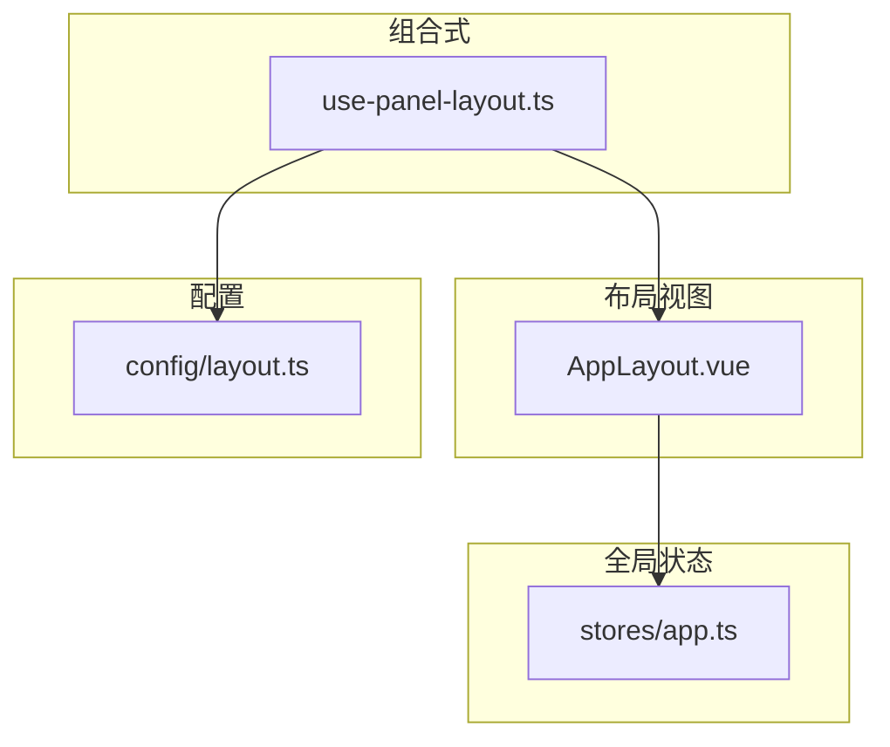
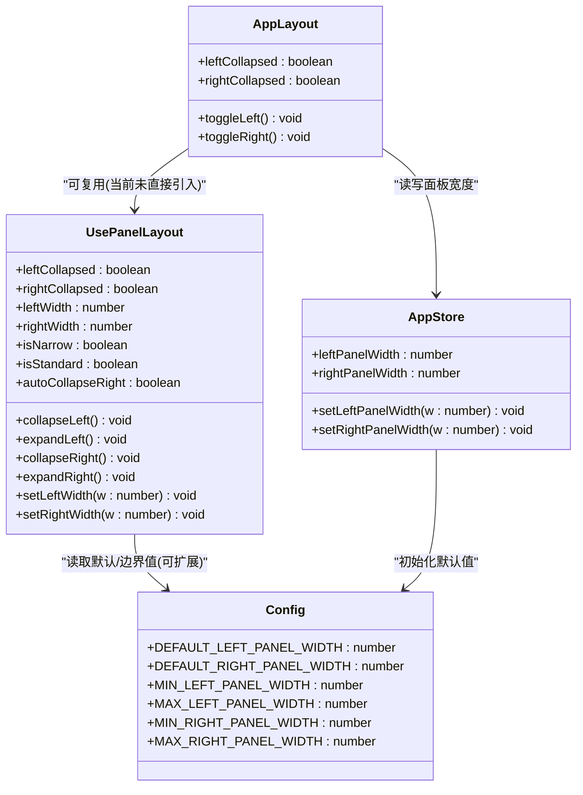
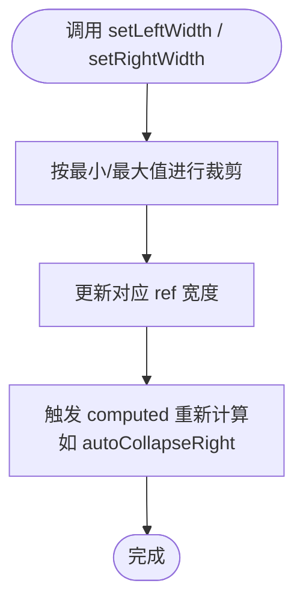
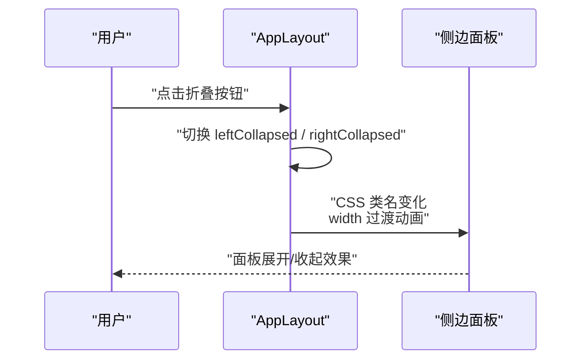
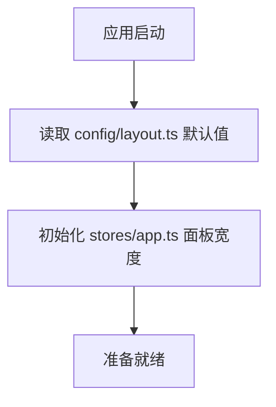
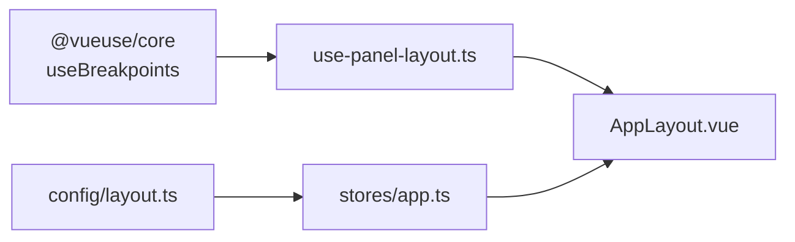

# 面板布局 (usePanelLayout)

<cite>
**本文引用的文件**
- [src/composables/use-panel-layout.ts](file://src/composables/use-panel-layout.ts)
- [src/layout/AppLayout.vue](file://src/layout/AppLayout.vue)
- [src/config/layout.ts](file://src/config/layout.ts)
- [src/stores/app.ts](file://src/stores/app.ts)
</cite>

## 目录
1. [简介](#简介)
2. [项目结构](#项目结构)
3. [核心组件](#核心组件)
4. [架构总览](#架构总览)
5. [详细组件分析](#详细组件分析)
6. [依赖关系分析](#依赖关系分析)
7. [性能与动画优化](#性能与动画优化)
8. [故障排查指南](#故障排查指南)
9. [结论](#结论)
10. [附录：使用示例与最佳实践](#附录使用示例与最佳实践)

## 简介
本文件围绕 usePanelLayout 组合式函数，系统化阐述响应式布局管理方案。内容涵盖：
- 面板尺寸调整与边界约束
- 布局状态与断点联动（窄屏/标准/宽屏）
- 右侧面板自动折叠策略
- 与 AppLayout 的集成方式
- 配置常量来源与可扩展性
- 持久化、拖拽交互、最小化/最大化、自适应算法的实现思路与落地建议
- 动画过渡与性能优化技巧

## 项目结构
与面板布局相关的关键位置如下：
- 组合式函数：src/composables/use-panel-layout.ts
- 主布局视图：src/layout/AppLayout.vue
- 布局配置常量：src/config/layout.ts
- 应用级 Store（包含面板宽度字段与方法）：src/stores/app.ts

图表来源
- [src/composables/use-panel-layout.ts:1-37](file://src/composables/use-panel-layout.ts#L1-L37)
- [src/layout/AppLayout.vue:1-120](file://src/layout/AppLayout.vue#L1-L120)
- [src/config/layout.ts:1-9](file://src/config/layout.ts#L1-L9)
- [src/stores/app.ts:1-56](file://src/stores/app.ts#L1-L56)

章节来源
- [src/composables/use-panel-layout.ts:1-37](file://src/composables/use-panel-layout.ts#L1-L37)
- [src/layout/AppLayout.vue:1-120](file://src/layout/AppLayout.vue#L1-L120)
- [src/config/layout.ts:1-9](file://src/config/layout.ts#L1-L9)
- [src/stores/app.ts:1-56](file://src/stores/app.ts#L1-L56)

## 核心组件
- usePanelLayout 组合式函数
  - 提供左右面板的折叠状态、宽度、断点判断以及自动折叠计算属性
  - 暴露方法：collapseLeft/expandLeft、collapseRight/expandRight、setLeftWidth/setRightWidth
- AppLayout 主布局
  - 通过本地 ref 控制左右面板折叠
  - 以 CSS transition 实现平滑展开/收起
- 配置常量
  - 定义默认宽度与最小/最大宽度边界
- 应用 Store
  - 维护 leftPanelWidth/rightPanelWidth 及设置方法，可作为持久化的承载层

章节来源
- [src/composables/use-panel-layout.ts:18-36](file://src/composables/use-panel-layout.ts#L18-L36)
- [src/layout/AppLayout.vue:25-28](file://src/layout/AppLayout.vue#L25-L28)
- [src/config/layout.ts:1-9](file://src/config/layout.ts#L1-L9)
- [src/stores/app.ts:12-28](file://src/stores/app.ts#L12-L28)

## 架构总览
usePanelLayout 负责“逻辑层”的状态与行为；AppLayout 负责“视图层”的展示与交互；配置常量集中管理尺寸边界；Store 作为统一的状态容器，便于后续接入持久化。

图表来源
- [src/composables/use-panel-layout.ts:18-36](file://src/composables/use-panel-layout.ts#L18-L36)
- [src/layout/AppLayout.vue:25-28](file://src/layout/AppLayout.vue#L25-L28)
- [src/config/layout.ts:1-9](file://src/config/layout.ts#L1-L9)
- [src/stores/app.ts:12-28](file://src/stores/app.ts#L12-L28)

## 详细组件分析

### usePanelLayout 组合式函数
- 状态设计
  - 折叠状态：leftCollapsed、rightCollapsed
  - 宽度状态：leftWidth、rightWidth
  - 断点状态：isNarrow、isStandard（基于 @vueuse/core 的 useBreakpoints）
  - 自动折叠：autoCollapseRight = isNarrow || isStandard
- 行为方法
  - collapseLeft/expandLeft：切换左侧折叠
  - collapseRight/expandRight：切换右侧折叠
  - setLeftWidth/setRightWidth：设置宽度并限制在最小/最大范围内
- 复杂度与性能
  - 所有状态均为 Vue 响应式 ref/computed，更新开销低
  - 断点监听由 @vueuse/core 内部处理，避免手动 window.resize 事件绑定

图表来源
- [src/composables/use-panel-layout.ts:23-26](file://src/composables/use-panel-layout.ts#L23-L26)

章节来源
- [src/composables/use-panel-layout.ts:1-37](file://src/composables/use-panel-layout.ts#L1-L37)

### AppLayout 主布局集成
- 视图层折叠控制
  - 使用本地 ref 控制 leftCollapsed/rightCollapsed
  - 点击按钮切换折叠状态
  - 通过 CSS transition 实现宽度变化动画
- 面板宽度
  - 当前模板中未直接使用 usePanelLayout 返回的 width 状态，而是固定宽度配合 collapsed 类名
  - 可通过将 AppLayout 中的宽度绑定到 store 或组合式函数返回值，实现动态宽度

图表来源
- [src/layout/AppLayout.vue:76-108](file://src/layout/AppLayout.vue#L76-L108)
- [src/layout/AppLayout.vue:291-317](file://src/layout/AppLayout.vue#L291-L317)

章节来源
- [src/layout/AppLayout.vue:25-28](file://src/layout/AppLayout.vue#L25-L28)
- [src/layout/AppLayout.vue:76-108](file://src/layout/AppLayout.vue#L76-L108)
- [src/layout/AppLayout.vue:291-317](file://src/layout/AppLayout.vue#L291-L317)

### 配置常量与 Store
- 配置常量
  - DEFAULT_*：默认宽度
  - MIN_* / MAX_*：最小/最大宽度边界
- Store
  - 提供 leftPanelWidth/rightPanelWidth 及其 setter，setter 内对输入进行边界裁剪
  - 适合作为持久化载体（例如写入 localStorage 或 Tauri 存储）

图表来源
- [src/config/layout.ts:1-9](file://src/config/layout.ts#L1-L9)
- [src/stores/app.ts:12-28](file://src/stores/app.ts#L12-L28)

章节来源
- [src/config/layout.ts:1-9](file://src/config/layout.ts#L1-L9)
- [src/stores/app.ts:12-28](file://src/stores/app.ts#L12-L28)

## 依赖关系分析
- 外部依赖
  - @vueuse/core 的 useBreakpoints：用于断点检测
- 内部依赖
  - usePanelLayout 不直接依赖 AppLayout，具备良好可复用性
  - AppLayout 当前未直接引入 usePanelLayout，但可无缝替换为组合式函数提供的状态与方法
  - Store 与 config 解耦，便于扩展与测试

图表来源
- [src/composables/use-panel-layout.ts:1-3](file://src/composables/use-panel-layout.ts#L1-L3)
- [src/config/layout.ts:1-9](file://src/config/layout.ts#L1-L9)
- [src/stores/app.ts:1-10](file://src/stores/app.ts#L1-L10)
- [src/layout/AppLayout.vue:1-10](file://src/layout/AppLayout.vue#L1-L10)

章节来源
- [src/composables/use-panel-layout.ts:1-3](file://src/composables/use-panel-layout.ts#L1-L3)
- [src/config/layout.ts:1-9](file://src/config/layout.ts#L1-L9)
- [src/stores/app.ts:1-10](file://src/stores/app.ts#L1-L10)
- [src/layout/AppLayout.vue:1-10](file://src/layout/AppLayout.vue#L1-L10)

## 性能与动画优化
- 动画过渡
  - 使用 CSS transition 对 width 和 border-color 做平滑过渡，提升交互体验
  - 建议在频繁拖拽时降低过渡时长或使用 requestAnimationFrame 节流
- 渲染优化
  - 面板内容包裹层使用固定宽度，避免折叠时内容重排
  - 滚动区域使用独立滚动条，减少整体布局抖动
- 断点监听
  - 借助 @vueuse/core 的 useBreakpoints，避免手写 resize 监听带来的额外开销
- 建议
  - 在移动端或窄屏下优先隐藏次要面板，确保主工作区可用空间
  - 对大列表或重型组件启用虚拟滚动，降低首屏渲染压力

章节来源
- [src/layout/AppLayout.vue:291-317](file://src/layout/AppLayout.vue#L291-L317)
- [src/layout/AppLayout.vue:319-331](file://src/layout/AppLayout.vue#L319-L331)
- [src/composables/use-panel-layout.ts:9-16](file://src/composables/use-panel-layout.ts#L9-L16)

## 故障排查指南
- 面板无法展开/收起
  - 检查 AppLayout 中是否绑定了正确的折叠状态变量
  - 确认 CSS 类名 collapsed 是否正确切换
- 宽度超出预期
  - 检查 setLeftWidth/setRightWidth 的边界裁剪逻辑
  - 若从 Store 同步宽度，确认 setter 是否被正确调用
- 自动折叠不符合预期
  - 核对断点阈值与 autoCollapseRight 的计算条件
  - 在不同窗口尺寸下验证 isNarrow/isStandard 的值

章节来源
- [src/composables/use-panel-layout.ts:23-26](file://src/composables/use-panel-layout.ts#L23-L26)
- [src/layout/AppLayout.vue:76-108](file://src/layout/AppLayout.vue#L76-L108)

## 结论
usePanelLayout 提供了轻量且可复用的面板布局管理能力，结合 AppLayout 的视图层与 Store 的状态层，可以构建出稳定、易扩展的三栏布局系统。当前实现已具备基础折叠与断点能力，后续可在持久化、拖拽缩放、最小化/最大化等方面进一步增强。

## 附录：使用示例与最佳实践

### 基本用法（在组件中引入并使用）
- 在需要布局控制的组件中引入 usePanelLayout
- 将返回的 leftCollapsed/rightCollapsed 绑定到模板
- 使用 collapseLeft/expandLeft/collapseRight/expandRight 控制折叠
- 使用 setLeftWidth/setRightWidth 设置宽度（受最小/最大边界保护）

章节来源
- [src/composables/use-panel-layout.ts:18-36](file://src/composables/use-panel-layout.ts#L18-L36)

### 在主界面集成可调整的面板布局
- 将 AppLayout 中的本地折叠状态替换为 usePanelLayout 返回的状态
- 将面板宽度绑定到 Store 的 leftPanelWidth/rightPanelWidth，并通过其 setter 更新
- 在模板中根据 autoCollapseRight 决定是否显示右侧面板

章节来源
- [src/layout/AppLayout.vue:25-28](file://src/layout/AppLayout.vue#L25-L28)
- [src/stores/app.ts:12-28](file://src/stores/app.ts#L12-L28)
- [src/composables/use-panel-layout.ts:26](file://src/composables/use-panel-layout.ts#L26)

### 保存用户的布局偏好（持久化）
- 序列化策略
  - 将 leftCollapsed、rightCollapsed、leftWidth、rightWidth 序列化为 JSON
- 存储位置
  - Web 环境：localStorage/sessionStorage
  - Tauri 环境：Tauri 持久化 API（如 tauri-plugin-store）
- 恢复策略
  - 应用启动时读取存储，反序列化为初始状态
  - 若缺失或格式异常，回退到 config/layout.ts 的默认值

章节来源
- [src/config/layout.ts:1-9](file://src/config/layout.ts#L1-L9)
- [src/stores/app.ts:12-28](file://src/stores/app.ts#L12-L28)

### 实现面板的最小化和最大化
- 最小化
  - 将面板宽度设置为一个极小值（如 0），同时保留标题栏或迷你工具条
- 最大化
  - 将面板宽度恢复到默认值或上次记忆值
- 状态记忆
  - 将最小化/最大化状态与宽度一起持久化

章节来源
- [src/composables/use-panel-layout.ts:23-26](file://src/composables/use-panel-layout.ts#L23-L26)
- [src/config/layout.ts:1-9](file://src/config/layout.ts#L1-L9)

### 拖拽交互处理（实现思路）
- 在左右面板与工作区之间添加拖拽手柄
- 监听 mousedown/mousemove/mouseup 事件
- 在 mousemove 中计算新宽度并调用 setLeftWidth/setRightWidth
- 在 mouseup 中移除监听，避免内存泄漏
- 防抖/节流
  - 使用节流降低高频更新导致的重绘压力
  - 在拖拽结束后再写入持久化存储

章节来源
- [src/composables/use-panel-layout.ts:23-26](file://src/composables/use-panel-layout.ts#L23-L26)

### 自适应布局算法（断点驱动）
- 窄屏（小于 standard）
  - 自动隐藏右侧面板，必要时也隐藏左侧面板
- 标准屏（standard 到 wide 之间）
  - 自动隐藏右侧面板，保留左侧面板
- 宽屏（大于等于 wide）
  - 同时显示左右面板
- 通过 autoCollapseRight 与 isNarrow/isStandard 控制显示/隐藏

章节来源
- [src/composables/use-panel-layout.ts:9-16](file://src/composables/use-panel-layout.ts#L9-L16)
- [src/composables/use-panel-layout.ts:26](file://src/composables/use-panel-layout.ts#L26)