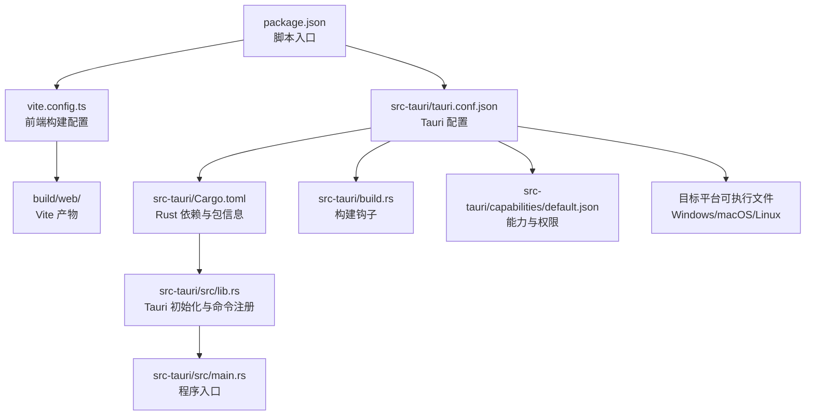
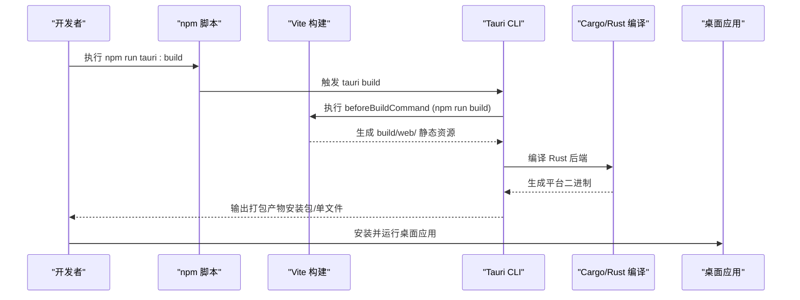
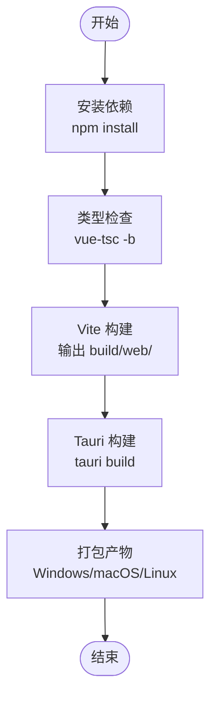
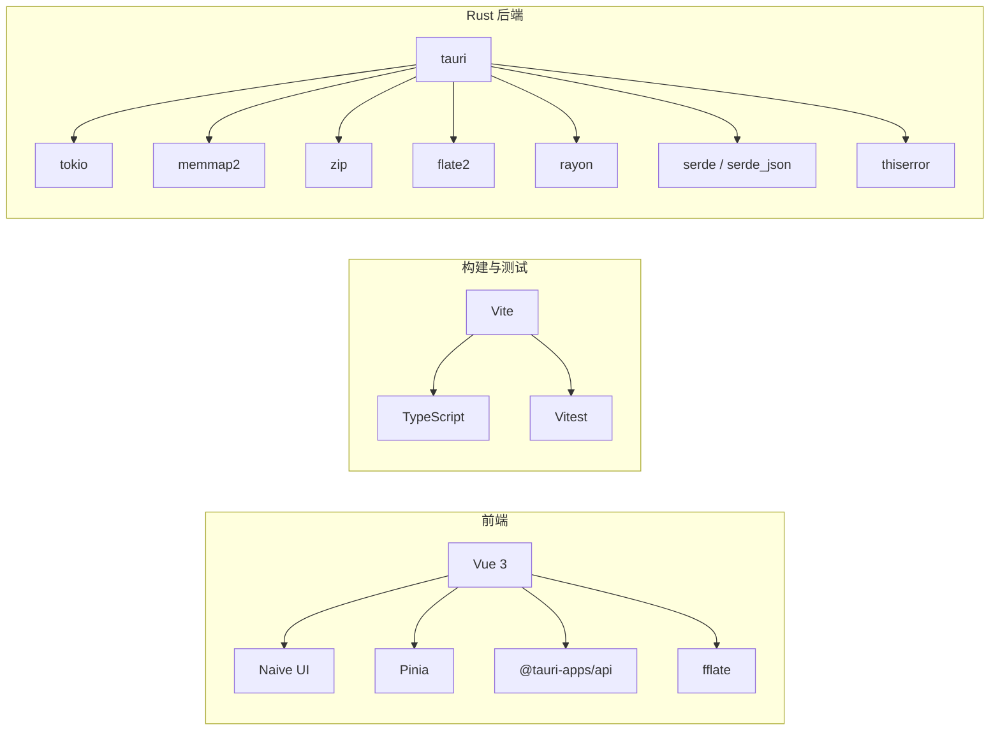

# 部署指南

<cite>
**本文引用的文件列表**
- [README.md](file://README.md)
- [package.json](file://package.json)
- [vite.config.ts](file://vite.config.ts)
- [tsconfig.json](file://tsconfig.json)
- [tsconfig.node.json](file://tsconfig.node.json)
- [src-tauri/tauri.conf.json](file://src-tauri/tauri.conf.json)
- [src-tauri/Cargo.toml](file://src-tauri/Cargo.toml)
- [src-tauri/build.rs](file://src-tauri/build.rs)
- [src-tauri/capabilities/default.json](file://src-tauri/capabilities/default.json)
- [src-tauri/src/lib.rs](file://src-tauri/src/lib.rs)
- [src-tauri/src/main.rs](file://src-tauri/src/main.rs)
</cite>

## 目录
1. [简介](#简介)
2. [项目结构](#项目结构)
3. [核心组件](#核心组件)
4. [架构总览](#架构总览)
5. [详细组件分析](#详细组件分析)
6. [依赖关系分析](#依赖关系分析)
7. [性能与优化建议](#性能与优化建议)
8. [故障排除指南](#故障排除指南)
9. [结论](#结论)
10. [附录](#附录)

## 简介
本指南面向 Hello-Tauri 项目的生产构建、打包与发布，覆盖以下关键主题：
- Web 应用构建配置与优化（静态资源打包、代码分割、缓存策略）
- 桌面端跨平台打包流程（Windows、macOS、Linux）
- 生产环境部署建议（环境变量、安全设置、性能监控）
- 签名与认证流程（代码签名证书配置与应用商店发布准备）
- 版本管理策略、更新机制与回滚方案
- 常见问题排查与解决方案

本项目采用 Vue 3 + TypeScript + Vite 作为前端技术栈，Tauri 2 (Rust) 作为桌面后端，支持 Web 与桌面双端构建。

**章节来源**
- [README.md:1-140](file://README.md#L1-L140)

## 项目结构
仓库采用前后端分离的目录组织方式：
- 前端源码位于 src/，使用 Vite 进行开发与构建
- Tauri 后端源码位于 src-tauri/，通过 tauri.conf.json 与 Cargo.toml 管理构建与权限
- 根级 package.json 提供脚本入口，统一 dev/build/tauri 命令

**图表来源**
- [package.json:1-42](file://package.json#L1-L42)
- [vite.config.ts:1-28](file://vite.config.ts#L1-L28)
- [src-tauri/tauri.conf.json:1-31](file://src-tauri/tauri.conf.json#L1-L31)
- [src-tauri/Cargo.toml:1-19](file://src-tauri/Cargo.toml#L1-L19)
- [src-tauri/build.rs:1-4](file://src-tauri/build.rs#L1-L4)
- [src-tauri/capabilities/default.json:1-9](file://src-tauri/capabilities/default.json#L1-L9)
- [src-tauri/src/lib.rs:1-19](file://src-tauri/src/lib.rs#L1-L19)
- [src-tauri/src/main.rs:1-4](file://src-tauri/src/main.rs#L1-L4)

**章节来源**
- [README.md:71-127](file://README.md#L71-L127)
- [package.json:1-42](file://package.json#L1-L42)
- [vite.config.ts:1-28](file://vite.config.ts#L1-L28)
- [src-tauri/tauri.conf.json:1-31](file://src-tauri/tauri.conf.json#L1-L31)

## 核心组件
- 前端构建系统：Vite + @vitejs/plugin-vue，输出到 build/web/
- Tauri 配置：tauri.conf.json 指定前端产物路径、开发服务器地址、窗口尺寸、图标等
- Rust 后端：Cargo.toml 声明 tauri、tokio、memmap2、zip、flate2、rayon 等依赖
- 权限模型：capabilities/default.json 定义默认能力与权限
- 构建钩子：build.rs 调用 tauri_build::build()

这些组件共同决定了从源码到最终可分发的产物（Web 站点或桌面安装包）的流程。

**章节来源**
- [vite.config.ts:1-28](file://vite.config.ts#L1-L28)
- [src-tauri/tauri.conf.json:1-31](file://src-tauri/tauri.conf.json#L1-L31)
- [src-tauri/Cargo.toml:1-19](file://src-tauri/Cargo.toml#L1-L19)
- [src-tauri/capabilities/default.json:1-9](file://src-tauri/capabilities/default.json#L1-L9)
- [src-tauri/build.rs:1-4](file://src-tauri/build.rs#L1-L4)

## 架构总览
下图展示了从源码到产物的端到端构建与运行流程，包括 Web 与桌面两种模式。

**图表来源**
- [package.json:10-18](file://package.json#L10-L18)
- [src-tauri/tauri.conf.json:6-11](file://src-tauri/tauri.conf.json#L6-L11)
- [src-tauri/Cargo.toml:1-19](file://src-tauri/Cargo.toml#L1-L19)

## 详细组件分析

### 前端构建与优化（Vite）
- 构建输出目录：build/web/
- 别名与平台切换：通过 VITE_PLATFORM 控制 @adapter 指向 web-adapter 或 tauri-adapter，并在 define 中注入 __PLATFORM__
- 外部化依赖：在 Web 模式下将 @tauri-apps/api 标记为 external，避免打包进浏览器产物
- TypeScript 配置：tsconfig.json 与 tsconfig.node.json 分别管理应用与 Node 侧类型检查与输出目录

优化建议：
- 启用代码分割：利用 Vite 默认的按需加载与动态 import，对大型插件模块（如解析器、压缩器）进行拆分
- 资源缓存：为静态资源添加内容哈希文件名，配合 CDN 长缓存策略
- 压缩与最小化：在生产构建中启用 Terser 压缩（可选），减少 JS/CSS 体积
- 预取与预加载：对首屏关键资源使用 preload/prefetch 提升加载速度

**章节来源**
- [vite.config.ts:1-28](file://vite.config.ts#L1-L28)
- [tsconfig.json:1-22](file://tsconfig.json#L1-L22)
- [tsconfig.node.json:1-13](file://tsconfig.node.json#L1-L13)

### Tauri 桌面打包与跨平台配置
- 前端产物路径：frontendDist 指向 build/web/
- 开发服务器：devUrl 指向本地 Vite 服务
- 构建前命令：beforeBuildCommand 自动执行 npm run build
- 窗口配置：标题、宽高、最小尺寸等
- 打包目标：targets 为空表示使用默认目标；如需特定平台，可在该数组中显式指定
- 图标：icons/icon.ico 用于 Windows 图标

跨平台注意事项：
- Windows：需要安装 Rust 工具链与 Visual Studio Build Tools；确保 Cargo 在 PATH 中
- macOS：需要 Xcode 命令行工具与 Apple 开发者证书（用于签名与分发）
- Linux：需要 GTK/WebKit 相关依赖；根据发行版安装对应开发包

**章节来源**
- [src-tauri/tauri.conf.json:1-31](file://src-tauri/tauri.conf.json#L1-L31)
- [README.md:52-69](file://README.md#L52-L69)

### Rust 后端与权限模型
- 包信息与依赖：Cargo.toml 声明 tauri 2、tokio、memmap2、zip、flate2、rayon、serde、thiserror 等
- 构建钩子：build.rs 调用 tauri_build::build()
- 初始化与命令注册：lib.rs 中通过 Builder 注册 IPC 命令（read_file、write_file、mmap_read、decompress 等）
- 程序入口：main.rs 调用 hello_tauri::run()
- 权限与能力：capabilities/default.json 定义 default 能力集，包含 core:default 权限

安全建议：
- 仅暴露必要的 IPC 命令
- 使用 capabilities 精确控制窗口权限
- 避免在 Web 环境中直接访问敏感系统 API

**章节来源**
- [src-tauri/Cargo.toml:1-19](file://src-tauri/Cargo.toml#L1-L19)
- [src-tauri/build.rs:1-4](file://src-tauri/build.rs#L1-L4)
- [src-tauri/src/lib.rs:1-19](file://src-tauri/src/lib.rs#L1-L19)
- [src-tauri/src/main.rs:1-4](file://src-tauri/src/main.rs#L1-L4)
- [src-tauri/capabilities/default.json:1-9](file://src-tauri/capabilities/default.json#L1-L9)

### 构建流程图（Web 与桌面）

**图表来源**
- [package.json:10-18](file://package.json#L10-L18)
- [src-tauri/tauri.conf.json:6-11](file://src-tauri/tauri.conf.json#L6-L11)

## 依赖关系分析
- 前端依赖：Vue 3、Naive UI、Pinia、@vueuse/core、@tauri-apps/api、fflate、splitpanes、vue-draggable-plus
- 开发依赖：TypeScript、Vite、@vitejs/plugin-vue、vitest、@vue/test-utils、jsdom、@tauri-apps/cli
- Rust 依赖：tauri、tokio、memmap2、zip、flate2、rayon、serde、serde_json、thiserror

**图表来源**
- [package.json:20-40](file://package.json#L20-L40)
- [src-tauri/Cargo.toml:6-18](file://src-tauri/Cargo.toml#L6-L18)

**章节来源**
- [package.json:1-42](file://package.json#L1-L42)
- [src-tauri/Cargo.toml:1-19](file://src-tauri/Cargo.toml#L1-L19)

## 性能与优化建议
- 代码分割：对大型解析器与压缩插件使用动态导入，降低首屏体积
- 资源缓存：为静态资源启用内容哈希命名，结合 CDN 设置长期缓存头
- 压缩与最小化：启用 Terser 压缩（可选），减少 JS/CSS 体积
- 预取与预加载：对首屏关键资源使用 preload/prefetch
- 内存映射与大文件：后端使用 memmap2 零拷贝读取，前端采用虚拟滚动与分页加载
- 并发控制：TaskScheduler 控制解压并发数，避免阻塞主线程

[本节为通用指导，不直接分析具体文件]

## 故障排除指南
- 构建失败（Rust 工具链）：确保 Cargo 在 PATH 中，必要时绕过代理设置
- 构建产物位置：所有构建输出到 build/（不是 dist/），包括 build/web/、build/node/、build/app.tsbuildinfo
- 平台切换问题：确认 VITE_PLATFORM 环境变量正确设置，别名 @adapter 与全局 __PLATFORM__ 生效
- 权限不足：检查 capabilities/default.json 中的权限是否满足需求，必要时扩展能力集
- 图标缺失：确认 icons/icon.ico 存在且路径正确

**章节来源**
- [AGENTS.md:52-76](file://AGENTS.md#L52-L76)
- [src-tauri/capabilities/default.json:1-9](file://src-tauri/capabilities/default.json#L1-L9)
- [src-tauri/tauri.conf.json:23-29](file://src-tauri/tauri.conf.json#L23-L29)

## 结论
Hello-Tauri 项目提供了清晰的 Web 与桌面双端构建流程。通过合理配置 Vite 与 Tauri，可以实现高效的静态资源打包与跨平台桌面应用分发。在生产环境中，应重点关注安全权限、代码签名、缓存策略与性能监控，以确保应用的稳定性与用户体验。

[本节为总结性内容，不直接分析具体文件]

## 附录

### 环境变量与构建开关
- VITE_PLATFORM：控制前端适配器与全局常量，值为 web 或 tauri
- 其他运行时变量：建议在 Tauri 后端通过配置或环境变量注入，避免在前端硬编码

**章节来源**
- [vite.config.ts:5-11](file://vite.config.ts#L5-L11)

### 版本管理与更新机制
- 版本号：package.json 与 tauri.conf.json 均维护版本，保持同步
- 更新机制：可通过后端命令实现远程检查与下载更新包，结合签名校验确保安全
- 回滚方案：保留历史版本安装包，出现异常时快速回退至上一稳定版本

**章节来源**
- [package.json:1-10](file://package.json#L1-L10)
- [src-tauri/tauri.conf.json:3-5](file://src-tauri/tauri.conf.json#L3-L5)

### 签名与认证流程
- Windows：使用 Authenticode 签名证书对 .exe 或安装包进行签名
- macOS：使用 Apple 开发者证书对应用进行签名与公证（Notarization）
- Linux：可使用 gpg 对包进行签名，便于用户验证完整性

[本节为通用指导，不直接分析具体文件]

### 生产环境部署建议
- 环境变量：在后端集中管理，避免泄露敏感信息
- 安全设置：最小权限原则，仅开放必要 IPC 命令与文件系统访问
- 性能监控：集成日志上报与错误追踪，收集崩溃与性能指标

[本节为通用指导，不直接分析具体文件]