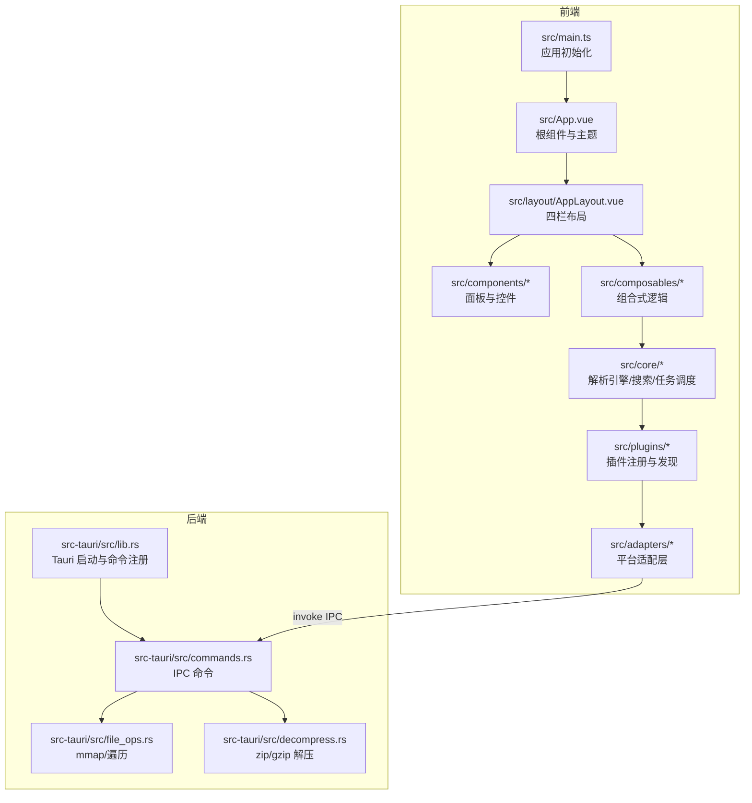
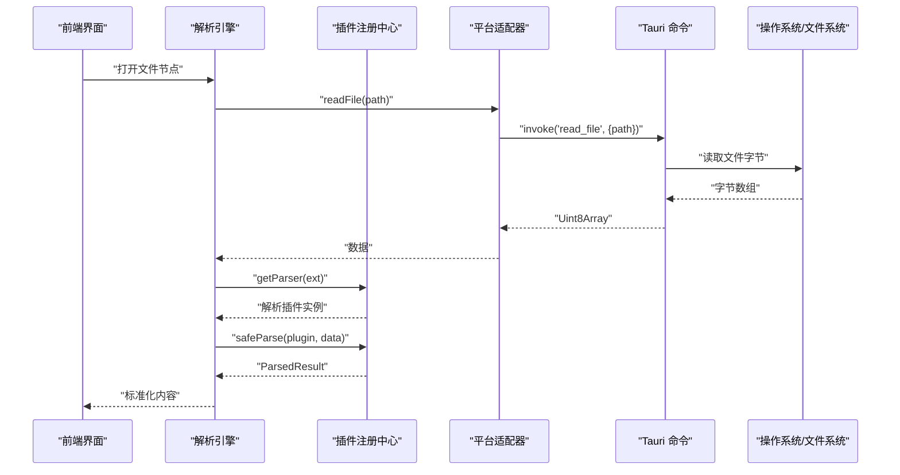
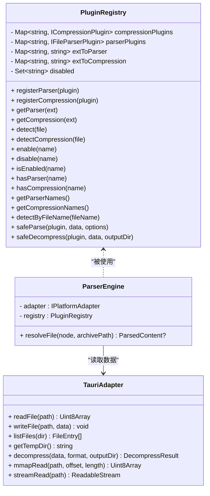
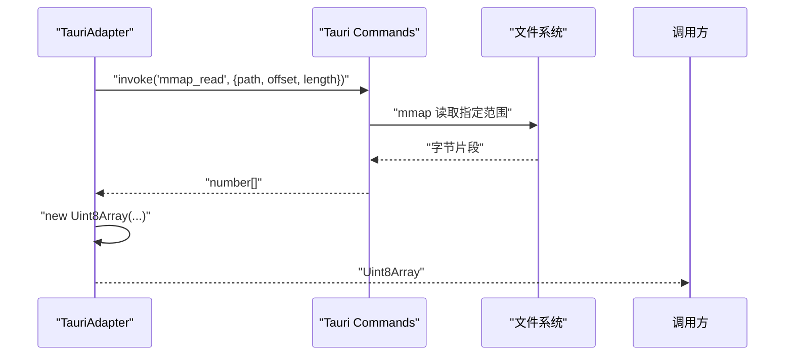
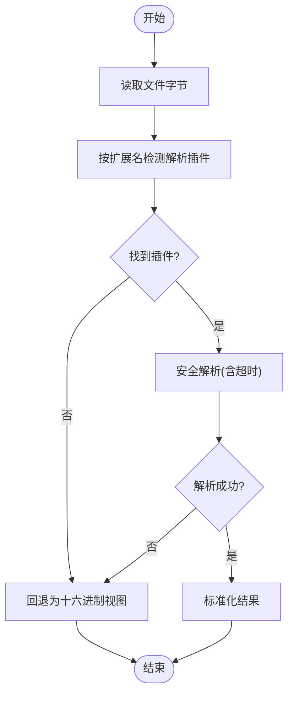
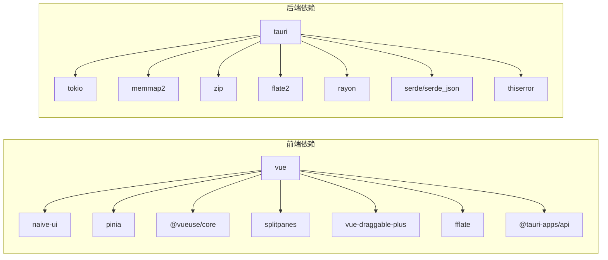

# 项目概述

<cite>
**本文引用的文件**
- [README.md](file://README.md)
- [package.json](file://package.json)
- [vite.config.ts](file://vite.config.ts)
- [src/main.ts](file://src/main.ts)
- [src/App.vue](file://src/App.vue)
- [src/types/index.ts](file://src/types/index.ts)
- [src/plugins/registry.ts](file://src/plugins/registry.ts)
- [src/plugins/manifest.ts](file://src/plugins/manifest.ts)
- [src/core/parser-engine.ts](file://src/core/parser-engine.ts)
- [src/adapters/tauri-adapter.ts](file://src/adapters/tauri-adapter.ts)
- [src-tauri/src/lib.rs](file://src-tauri/src/lib.rs)
- [src-tauri/src/commands.rs](file://src-tauri/src/commands.rs)
- [src-tauri/Cargo.toml](file://src-tauri/Cargo.toml)
- [src-tauri/tauri.conf.json](file://src-tauri/tauri.conf.json)
- [src/stores/app.ts](file://src/stores/app.ts)
</cite>

## 目录
1. [简介](#简介)
2. [项目结构](#项目结构)
3. [核心组件](#核心组件)
4. [架构总览](#架构总览)
5. [详细组件分析](#详细组件分析)
6. [依赖分析](#依赖分析)
7. [性能考量](#性能考量)
8. [故障排查指南](#故障排查指南)
9. [结论](#结论)
10. [附录：快速开始](#附录快速开始)

## 简介
Hello-Tauri 是一个基于 Vue 3 + Tauri 的跨平台日志解析工具，采用微内核与插件化设计，支持 Web 与桌面双端构建。其核心价值在于以高性能、可扩展的方式处理大体积文本与结构化数据（如日志、CSV、JSON），并提供压缩文件浏览与解压能力。通过前端响应式 UI 与后端 Rust 的高性能 I/O 结合，项目在易用性与性能之间取得平衡，适合需要本地高效处理多格式文件的场景。

主要特性
- 插件化架构：内置 text/csv/json/hex 解析插件与 zip/gzip 压缩插件，可按需扩展
- 双端构建：Web 静态站点与桌面单文件应用一键构建
- 大文件友好：mmap 零拷贝读取、虚拟滚动、分页加载
- 多任务并发：任务调度器控制解压并发数，支持队列与重试

技术优势
- 前端：Vue 3 + TypeScript + Vite，开发体验与类型安全并重
- 后端：Rust + Tauri 2，低内存占用与高并发 I/O
- 跨平台：同一套代码同时产出 Web 与桌面产物

使用场景
- 大日志文件快速定位与预览
- CSV/JSON 等结构化数据的轻量级查看与分析
- ZIP/GZIP 压缩包在线浏览与按需解压
- 在离线或受限网络环境下进行本地数据处理

## 项目结构
项目采用前后端分离的微内核架构：
- 前端 src：UI 组件、状态管理、插件注册与引擎编排、平台适配器
- 后端 src-tauri：Tauri 命令、文件系统操作、解压实现
- 配置与脚本：Vite 构建、Tauri 打包、包管理与脚本入口

图表来源
- [src/main.ts:1-8](file://src/main.ts#L1-L8)
- [src/App.vue:1-24](file://src/App.vue#L1-L24)
- [src-tauri/src/lib.rs:1-19](file://src-tauri/src/lib.rs#L1-L19)
- [src-tauri/src/commands.rs:1-53](file://src-tauri/src/commands.rs#L1-L53)

章节来源
- [README.md:1-140](file://README.md#L1-L140)
- [package.json:1-42](file://package.json#L1-L42)
- [vite.config.ts:1-28](file://vite.config.ts#L1-L28)

## 核心组件
- 插件注册中心（PluginRegistry）
  - 负责解析与压缩插件的注册、检测、启用/禁用、超时保护与安全调用
  - 提供按扩展名查找与文件名推断的能力
- 解析引擎（ParserEngine）
  - 协调平台适配器读取文件字节流，选择合适插件并执行解析
  - 统一返回标准化结果（类型、数据、行数、耗时、插件名）
- 平台适配器（TauriAdapter/WebAdapter）
  - 抽象文件读写、临时目录获取、解压、mmap 分块读取与流式读取
  - Tauri 端通过 invoke 调用 Rust 命令；Web 端通过 fetch/Range/ReadableStream 回退
- 应用状态（Pinia Store）
  - 管理主题、面板宽度、插件禁用列表等全局状态

章节来源
- [src/plugins/registry.ts:1-118](file://src/plugins/registry.ts#L1-L118)
- [src/core/parser-engine.ts:1-35](file://src/core/parser-engine.ts#L1-L35)
- [src/adapters/tauri-adapter.ts:1-62](file://src/adapters/tauri-adapter.ts#L1-L62)
- [src/stores/app.ts:1-57](file://src/stores/app.ts#L1-L57)

## 架构总览
系统采用“前端微内核 + 插件 + 平台适配”的分层架构：
- 表现层：Vue 组件与布局，提供交互与可视化
- 业务编排层：解析引擎、任务调度、搜索服务
- 插件层：解析器与压缩器插件，按扩展名动态匹配
- 适配层：屏蔽 Web/Tauri 差异，向上提供一致 API
- 原生层：Rust 暴露 IPC 命令，提供高性能 I/O 与解压

图表来源
- [src/core/parser-engine.ts:1-35](file://src/core/parser-engine.ts#L1-L35)
- [src/plugins/registry.ts:1-118](file://src/plugins/registry.ts#L1-L118)
- [src/adapters/tauri-adapter.ts:1-62](file://src/adapters/tauri-adapter.ts#L1-L62)
- [src-tauri/src/commands.rs:1-53](file://src-tauri/src/commands.rs#L1-L53)

## 详细组件分析

### 插件系统与注册机制
- 插件接口
  - 解析插件：定义名称、支持扩展、解析方法
  - 压缩插件：定义名称、支持扩展、解压方法
- 注册中心
  - 维护解析与压缩插件映射表，支持按扩展名与文件名检测
  - 提供启用/禁用、存在性检查、名称枚举
  - 安全调用：带超时的解析/解压包装，失败时回退为十六进制视图或错误结果
- 内置插件清单
  - 解析：text、csv、json、log、hex
  - 压缩：zip、gzip

图表来源
- [src/plugins/registry.ts:1-118](file://src/plugins/registry.ts#L1-L118)
- [src/core/parser-engine.ts:1-35](file://src/core/parser-engine.ts#L1-L35)
- [src/adapters/tauri-adapter.ts:1-62](file://src/adapters/tauri-adapter.ts#L1-L62)

章节来源
- [src/plugins/registry.ts:1-118](file://src/plugins/registry.ts#L1-L118)
- [src/plugins/manifest.ts:1-20](file://src/plugins/manifest.ts#L1-L20)

### 平台适配与 IPC 通信
- TauriAdapter
  - 懒加载 @tauri-apps/api/core.invoke，避免非桌面环境引入
  - 将 Rust 返回的 number[] 转换为 Uint8Array
  - 当前 streamRead 为全量读取后包装为 ReadableStream，后续可演进为事件驱动分块
- Tauri 命令
  - read_file/write_file：基础文件读写
  - get_temp_dir：获取临时目录
  - mmap_read：零拷贝分块读取
  - list_files：递归列出目录元信息
  - decompress：根据格式调用 zip/gzip 解压

图表来源
- [src/adapters/tauri-adapter.ts:1-62](file://src/adapters/tauri-adapter.ts#L1-L62)
- [src-tauri/src/commands.rs:1-53](file://src-tauri/src/commands.rs#L1-L53)

章节来源
- [src/adapters/tauri-adapter.ts:1-62](file://src/adapters/tauri-adapter.ts#L1-L62)
- [src-tauri/src/commands.rs:1-53](file://src-tauri/src/commands.rs#L1-L53)

### 解析流程与错误回退
- 解析流程
  - 通过扩展名或文件名推断解析插件
  - 使用安全包装执行解析，设置超时保护
  - 若解析失败或超时，回退为十六进制视图
- 关键数据结构
  - FileTreeNode/FileEntry：文件树与条目
  - ParsedContent：标准化解析结果
  - DecompressResult：解压结果

图表来源
- [src/core/parser-engine.ts:1-35](file://src/core/parser-engine.ts#L1-L35)
- [src/plugins/registry.ts:1-118](file://src/plugins/registry.ts#L1-L118)
- [src/types/index.ts:1-71](file://src/types/index.ts#L1-L71)

章节来源
- [src/core/parser-engine.ts:1-35](file://src/core/parser-engine.ts#L1-L35)
- [src/plugins/registry.ts:1-118](file://src/plugins/registry.ts#L1-L118)
- [src/types/index.ts:1-71](file://src/types/index.ts#L1-L71)

### 双端构建与运行期切换
- 构建期
  - Vite 通过别名与 define 注入 __PLATFORM__，区分 tauri/web 构建
  - Web 构建排除 @tauri-apps/api，避免浏览器环境报错
- 运行期
  - TauriAdapter 懒加载 IPC，确保非桌面环境不阻塞
  - 通过环境变量与脚本命令切换 dev/build 目标

章节来源
- [vite.config.ts:1-28](file://vite.config.ts#L1-L28)
- [package.json:1-42](file://package.json#L1-L42)
- [src-tauri/tauri.conf.json:1-31](file://src-tauri/tauri.conf.json#L1-L31)

## 依赖分析
- 前端运行时
  - vue、naive-ui、pinia、@vueuse/core、splitpanes、vue-draggable-plus、fflate、@tauri-apps/api
- 前端开发时
  - vite、@vitejs/plugin-vue、typescript、vue-tsc、vitest、@vue/test-utils、jsdom、@tauri-apps/cli
- 后端 Rust
  - tauri、tokio、memmap2、zip、flate2、rayon、serde、serde_json、thiserror

图表来源
- [package.json:1-42](file://package.json#L1-L42)
- [src-tauri/Cargo.toml:1-19](file://src-tauri/Cargo.toml#L1-L19)

章节来源
- [package.json:1-42](file://package.json#L1-L42)
- [src-tauri/Cargo.toml:1-19](file://src-tauri/Cargo.toml#L1-L19)

## 性能考量
- 大文件 I/O
  - 使用 mmap 零拷贝读取，减少内存峰值与拷贝开销
  - 分块读取与虚拟滚动配合，提升渲染性能
- 并发与队列
  - 任务调度器控制解压并发度，避免资源争用
  - 支持重试与进度上报，增强稳定性
- 插件超时保护
  - 解析/解压均带超时，防止长时间阻塞主线程
- 构建优化
  - Web 构建排除 Tauri 依赖，减小产物体积
  - 按需引入与懒加载降低首屏压力

[本节为通用性能建议，不直接分析具体文件]

## 故障排查指南
- 插件解析失败或超时
  - 现象：解析结果为十六进制视图或空
  - 排查：确认扩展名匹配、插件是否被禁用、插件实现是否正确抛出异常
  - 参考路径：[src/plugins/registry.ts:98-116](file://src/plugins/registry.ts#L98-L116)
- IPC 调用失败
  - 现象：read_file/mmap_read/list_files 报错
  - 排查：路径是否存在、权限是否足够、Tauri 命令是否注册
  - 参考路径：[src-tauri/src/commands.rs:5-53](file://src-tauri/src/commands.rs#L5-L53)
- 解压失败
  - 现象：DecompressResult.success=false
  - 排查：格式是否受支持、输出目录是否可写、数据是否损坏
  - 参考路径：[src-tauri/src/commands.rs:37-53](file://src-tauri/src/commands.rs#L37-L53)
- 主题与面板状态异常
  - 现象：主题未切换、面板宽度越界
  - 排查：Pinia store 方法调用是否正确、边界值限制是否生效
  - 参考路径：[src/stores/app.ts:12-56](file://src/stores/app.ts#L12-L56)

章节来源
- [src/plugins/registry.ts:98-116](file://src/plugins/registry.ts#L98-L116)
- [src-tauri/src/commands.rs:5-53](file://src-tauri/src/commands.rs#L5-L53)
- [src/stores/app.ts:12-56](file://src/stores/app.ts#L12-L56)

## 结论
Hello-Tauri 通过微内核与插件化设计，将复杂的数据解析与 I/O 能力解耦到独立模块中，既保证了系统的可扩展性，又提升了运行期的稳定性与性能。借助 Tauri 2 的低开销 IPC 与 Rust 的高性能库，项目在 Web 与桌面两端都能提供一致的体验。对于需要本地高效处理大文件与多格式数据的用户而言，该项目提供了开箱即用的解决方案，并留有充足的扩展空间。

[本节为总结性内容，不直接分析具体文件]

## 附录：快速开始
- 安装依赖
  - npm install
- 开发模式
  - Web 模式：npm run dev
  - 桌面模式（需 Rust 工具链）：npm run tauri:dev
- 类型检查与测试
  - npm run typecheck
  - npm test
- 构建产物
  - Web：npm run build
  - 桌面：npm run tauri:build

章节来源
- [README.md:51-69](file://README.md#L51-L69)
- [package.json:9-18](file://package.json#L9-L18)