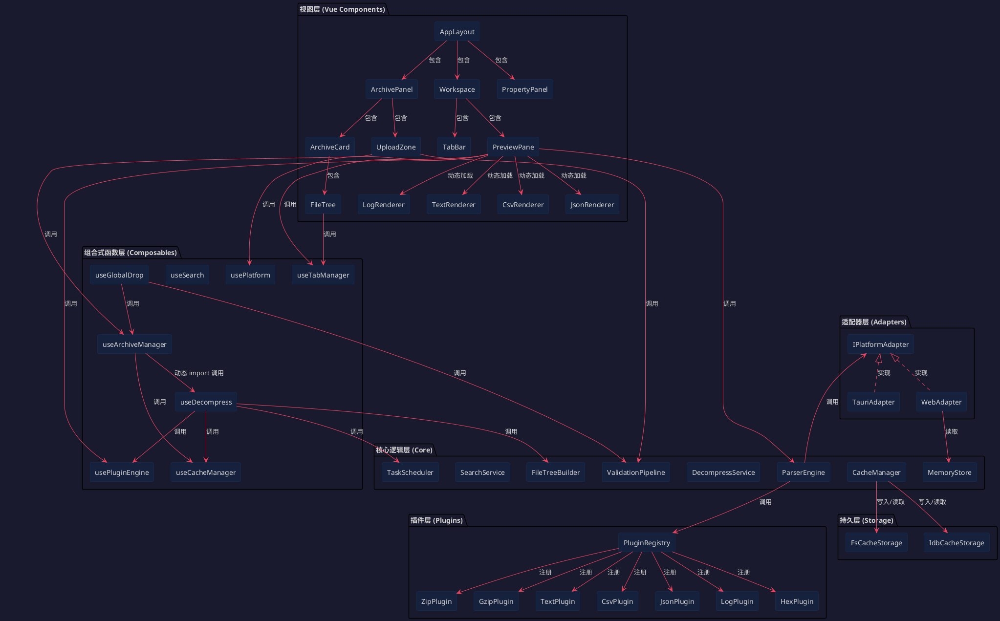
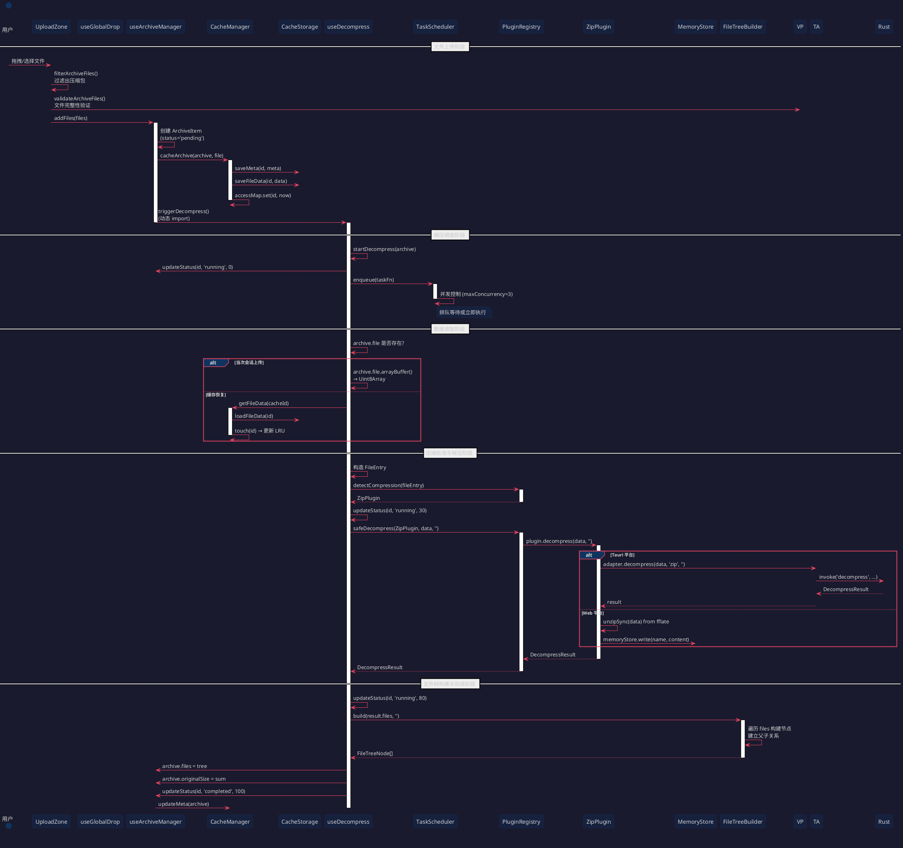
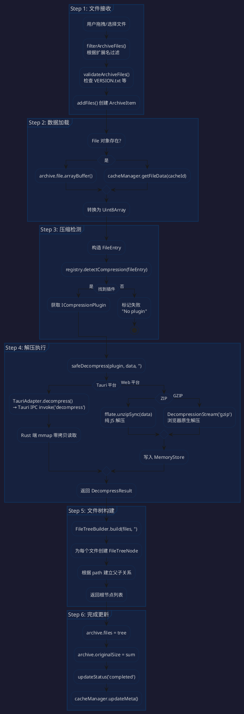
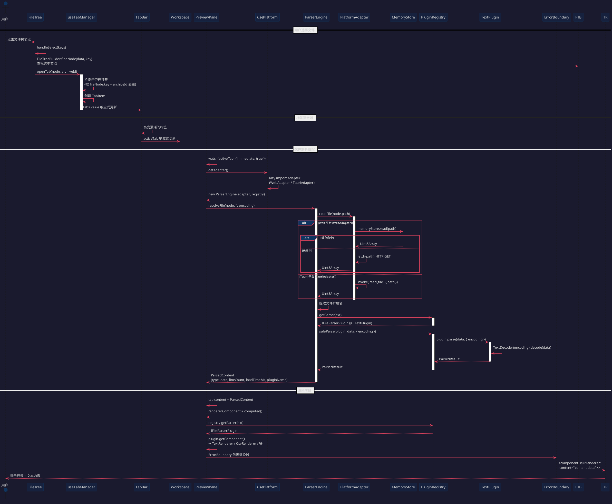
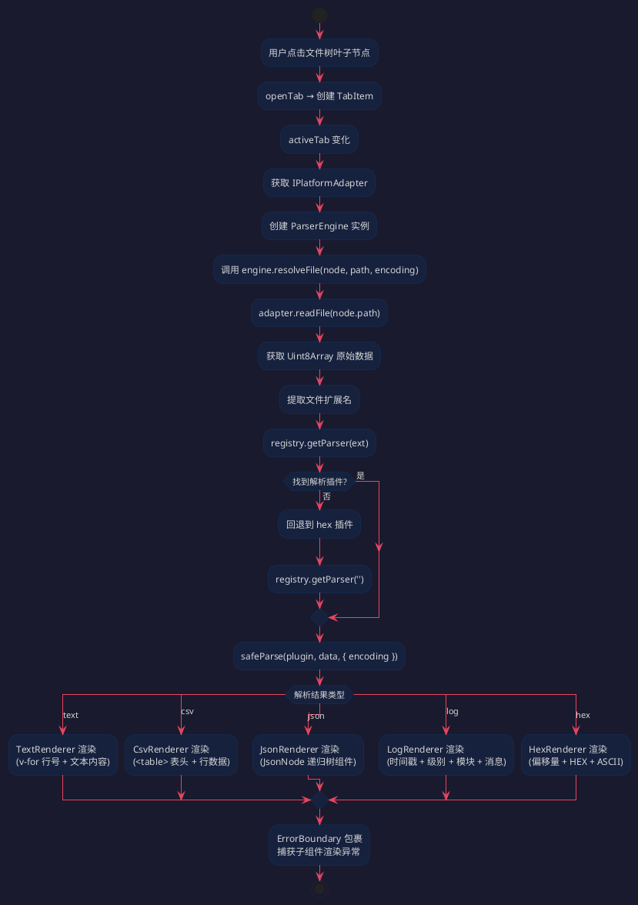
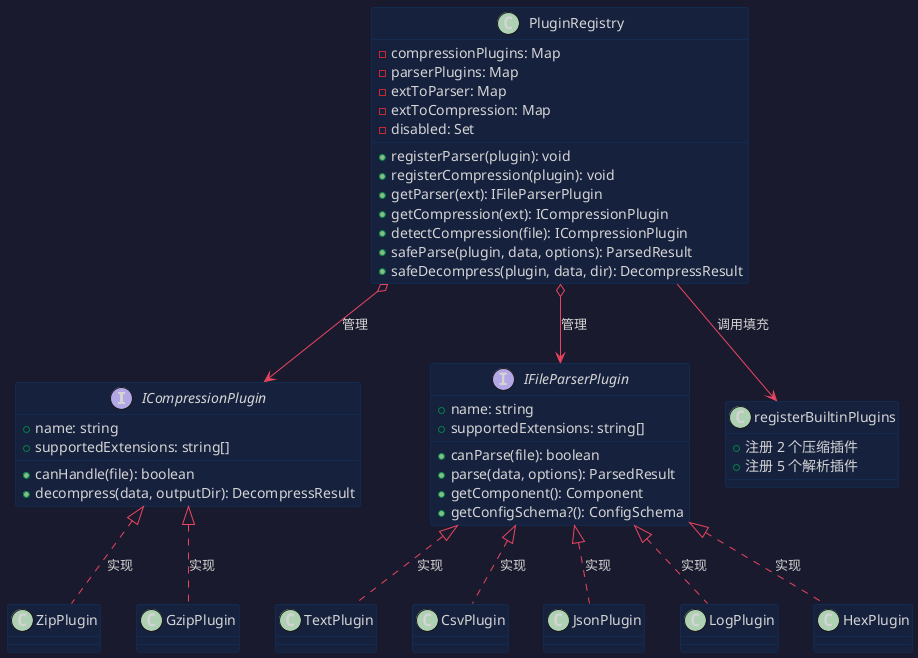
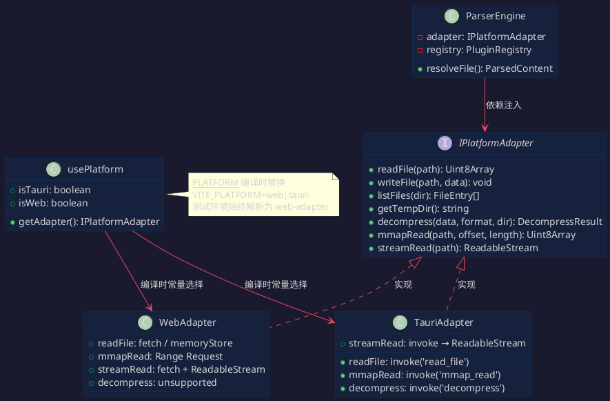
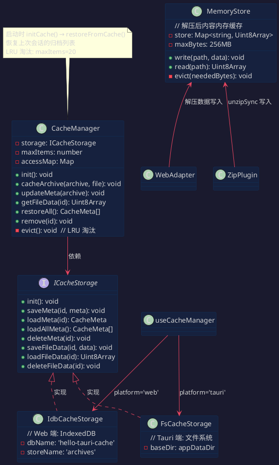
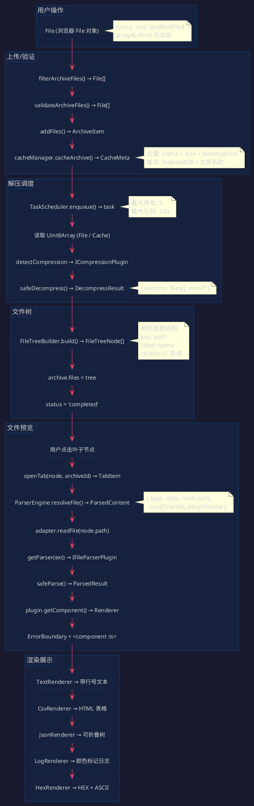

# 文件解压与查看详情全流程分析

> 本文档基于 Hello-Tauri 项目源码（Vue 3 + Tauri 2 + TypeScript），梳理文件从上传到预览的完整链路，包含架构图、时序图、模块依赖图等 PlantUML 可视化展示。

---

## 一、总体架构概览

### 1.1 四栏布局

```
┌─────────────────────────────────────────────────────────────┐
│  PublicBar（顶部导航栏，64px）                                 │
├──────────┬────────────────────────────────┬──────────────────┤
│          │                                │                  │
│ Archive  │        Workspace               │   PropertyPanel  │
│ Panel    │  ┌─────── TabBar ───────┐      │   (属性面板)     │
│ (左侧    │  │  标签页栏            │      │                  │
│  侧栏)   │  ├─────────────────────┤      │                  │
│          │  │   PreviewToolbar    │      │                  │
│          │  ├─────────────────────┤      │                  │
│          │  │    PreviewPane      │      │                  │
│          │  │  (渲染器动态挂载)    │      │                  │
│          │  └─────────────────────┘      │                  │
├──────────┴────────────────────────────────┴──────────────────┤
│  StatusBar（底部状态栏，26px）                                 │
└─────────────────────────────────────────────────────────────┘
```

### 1.2 核心模块依赖关系图



---

## 二、文件上传与解压全流程

### 2.1 入口：拖拽 / 文件选择

用户通过两种方式触发：

| 方式 | 组件 | 处理函数 |
|------|------|---------|
| 全局拖拽 | `AppLayout.vue` → `useGlobalDrop` | `onDrop()` |
| 面板上传 | `UploadZone.vue` | `processFiles()` |

### 2.2 完整解压流程时序图



### 2.3 解压管道数据处理流程



---

## 三、文件预览查看流程

### 3.1 完整预览时序图



### 3.2 解析引擎与渲染器选择流程



---

## 四、插件系统架构

### 4.1 插件注册与加载



### 4.2 插件类型与文件扩展名对照

| 插件名称 | 类型 | 支持扩展名 | 渲染器 | 引擎回退 |
|---------|------|-----------|--------|---------|
| `zip` | 压缩 | `.zip` | — | fflate / Tauri IPC |
| `gzip` | 压缩 | `.gz .gzip .tgz` | — | DecompressionStream / Tauri IPC |
| `text` | 解析 | `.txt .md .cfg .ini .env .yaml .yml .toml` | `TextRenderer` | — |
| `csv` | 解析 | `.csv .tsv` | `CsvRenderer` | — |
| `json` | 解析 | `.json .jsonl` | `JsonRenderer` | — |
| `log` | 解析 | `.log` | `LogRenderer` | — |
| `hex` | 解析 | 空（兜底） | `HexRenderer` | 所有未知格式回退到此 |

---

## 五、适配器模式

### 5.1 平台适配分离



---

## 六、缓存系统

### 6.1 缓存分层结构



---

## 七、关键函数调用关系图

### 7.1 文件上传 → 解压完成调用链

```plantuml
@startuml 解压调用链
skinparam backgroundColor #1a1a2e
skinparam defaultFontName Microsoft YaHei
skinparam defaultFontColor #d4d4d4
skinparam classBackgroundColor #16213e
skinparam classBorderColor #0f3460
skinparam arrowColor #e94560
skinparam packageBackgroundColor #0f3460
skinparam packageBorderColor #0f3460

rectangle "AppLayout.vue" as AL
rectangle "useGlobalDrop" as UGD {
  rectangle "onDrop()" as D1
  rectangle "setup()" as D2
}
rectangle "UploadZone.vue" as UZ {
  rectangle "processFiles()" as P1
  rectangle "handleDrop()" as P2
  rectangle "handleInputChange()" as P3
}
rectangle "core/archive-utils.ts" as AU {
  rectangle "filterArchiveFiles()" as F1
  rectangle "validateArchiveFiles()" as F2
}
rectangle "core/file-validator.ts" as FV {
  rectangle "getFileValidator()" as G1
  rectangle "ValidationPipeline.validate()" as V1
  rectangle "ZipExtensionValidator" as Z1
  rectangle "ZipContentValidator" as Z2
}
rectangle "useArchiveManager" as UAM {
  rectangle "addFiles()" as A1
  rectangle "triggerDecompress()" as A2
  rectangle "updateStatus()" as A3
  rectangle "remove()" as A4
  rectangle "restoreFromCache()" as A5
}
rectangle "useDecompress" as UD {
  rectangle "startDecompress()" as S1
  rectangle "decompressAll()" as S2
}
rectangle "core/task-scheduler.ts" as TS {
  rectangle "enqueue()" as E1
  rectangle "processNext()" as E2
}
rectangle "plugins/registry.ts" as PR {
  rectangle "detectCompression()" as DC
  rectangle "safeDecompress()" as SD
}
rectangle "core/file-tree.ts" as FT {
  rectangle "build()" as B1
  rectangle "findNode()" as F3
  rectangle "flattenTree()" as F4
}
rectangle "composables/use-cache.ts" as UC {
  rectangle "useCacheManager()" as UC1
  rectangle "initCache()" as UC2
}
rectangle "core/cache-manager.ts" as CM {
  rectangle "cacheArchive()" as C1
  rectangle "updateMeta()" as C2
  rectangle "getFileData()" as C3
  rectangle "restoreAll()" as C4
  rectangle "remove()" as C5
}

AL --> D1 : 全局拖拽
AL --> D2 : onMounted 注册

UZ --> P1, P2, P3 : 面板上传
P1 --> F1 : 过滤
P1 --> F2 : 验证
D1 --> F1, F2 : 同上

F2 --> G1 : 获取验证管线
V1 --> Z1 : 扩展名检查
V1 --> Z2 : 内容检查(VERSION.txt)

P1 --> A1 : 添加文件
D1 --> A1 : 添加文件
A1 --> C1 : 异步持久化
A1 --> A2 : 触发解压

A2 --> UD : 动态 import
S1 --> A3 : 更新状态
S1 --> E1 : 加入任务队列
E1 --> E2 : 执行任务
S1 --> C3 : 缓存恢复时读取
S1 --> DC : 检测压缩插件
DC --> SD : 安全解压(30s 超时)
SD --> B1 : 构建文件树
S1 --> C2 : 更新元数据

@enduml
```

### 7.2 文件选择 → 预览渲染调用链

```plantuml
@startuml 预览调用链
skinparam backgroundColor #1a1a2e
skinparam defaultFontName Microsoft YaHei
skinparam defaultFontColor #d4d4d4
skinparam classBackgroundColor #16213e
skinparam classBorderColor #0f3460
skinparam arrowColor #e94560
skinparam packageBackgroundColor #0f3460
skinparam packageBorderColor #0f3460

rectangle "ArchiveCard.vue" as AC
rectangle "FileTree.vue" as FT {
  rectangle "handleSelect()" as H1
}
rectangle "composables/use-tabs.ts" as UT {
  rectangle "openTab()" as O1
  rectangle "closeTab()" as C1
  rectangle "activateTab()" as A1
  rectangle "togglePin()" as T1
  rectangle "closeAll()" as R1
}
rectangle "Workspace.vue" as WS {
  rectangle "TabBar" as TB
  rectangle "PreviewPane" as PP
}
rectangle "PreviewPane.vue" as PV {
  rectangle "watch(activeTab)" as W1
  rectangle "getEngine()" as GE
  rectangle "rendererComponent" as RC
}
rectangle "usePlatform" as UP {
  rectangle "getAdapter()" as GA
}
rectangle "core/parser-engine.ts" as PE {
  rectangle "resolveFile()" as RF
}
rectangle "plugins/registry.ts" as PR2 {
  rectangle "getParser()" as GP
  rectangle "safeParse()" as SP
}
rectangle "plugins/parser/text-plugin.ts" as TEXTP {
  rectangle "parse()" as TP1
}
rectangle "views/renderers/" as RENDERS {
  rectangle "TextRenderer" as TR
  rectangle "CsvRenderer" as CR
  rectangle "JsonRenderer" as JR
  rectangle "LogRenderer" as LR
}
rectangle "components/shared/ErrorBoundary.vue" as EB

AC --> FT : 包含 FileTree
H1 --> FTB : findNode 查找节点
H1 --> O1 : 打开标签
O1 --> A1 : 自动激活
PP --> TB : 响应式更新标签栏
W1 --> GE : 获取 ParserEngine
GE --> GA : 获取平台适配器
W1 --> RF : 解析文件

RF --> GA : adapter.readFile(path)
RF --> GP : 按扩展名找解析插件
GP --> SP : 安全解析(30s 超时)
SP --> TP1 : 调用具体解析函数
TP1 --> TextDecoder : 解码 Uint8Array
TP1 --> SP : ParsedResult

W1 --> PV : tab.content = result
RC --> GP : 再次获取插件
RC --> TR : plugin.getComponent()
PV --> EB : ErrorBoundary 包裹
EB --> TR/CR/JR/LR : 动态渲染 :is="component"

@enduml
```

---

## 八、Tauri 后端 Rust 侧处理

### 8.1 Rust 命令与前端对应

```plantuml
@startuml Rust 后端
skinparam backgroundColor #1a1a2e
skinparam defaultFontName Microsoft YaHei
skinparam defaultFontColor #d4d4d4
skinparam componentBackgroundColor #16213e
skinparam componentBorderColor #0f3460
skinparam arrowColor #e94560
skinparam packageBackgroundColor #0f3460
skinparam packageBorderColor #0f3460

package "前端 TypeScript" {
  [TauriAdapter] as TA
  [useCacheManager] as UCM
}

package "Tauri IPC invoke" {
  [invoke('read_file')] as R1
  [invoke('write_file')] as W1
  [invoke('list_files')] as L1
  [invoke('get_temp_dir')] as G1
  [invoke('decompress')] as D1
  [invoke('mmap_read')] as M1
}

package "Rust 后端" {
  [lib.rs] as LIB {
    [run() 启动函数] as RUN
  }
  [commands.rs] as CMD {
    [read_file] as RF
    [write_file] as WF
    [list_files] as LF
    [get_temp_dir] as GF
    [decompress] as DF
    [mmap_read] as MR
  }
  [file_ops.rs] as FO {
    [read_file_bytes()] as RFB
    [write_file_bytes()] as WFB
  }
  [decompress.rs] as DECOMP {
    [decompress_file()] as DCF
    [decompress_zip()] as DZ
    [decompress_gzip()] as DGZ
  }
  [error.rs] as ERR {
    [AppError 枚举] as AE
  }
}

TA --> R1, W1, L1, G1, D1, M1
R1 --> RF
RF --> FO : read_file_bytes
WF --> FO : write_file_bytes
D1 --> DF
DF --> DECOMP : decompress_file
DECOMP --> DZ : zip
DECOMP --> DGZ : gzip
RF/BF/DZ/DGZ --> ERR : 错误处理
CMD --> LIB : #[tauri::command] 注册

note right of TA
  前端 invoke 时通过
  __PLATFORM__=== 'tauri'
  编译期选择 TauriAdapter
end note

note right of ERR
  #[serde(rename_all = "camelCase")]
  thiserror 派生
  AppError → Result 传播
end note

@enduml
```

---

## 九、完整数据流汇总

### 9.1 端到端数据流转



---

## 十、文件清单与功能对照

| 文件路径 | 职责 | 关键导出 |
|---------|------|---------|
| `src/components/archive-panel/UploadZone.vue` | 面板文件上传（拖拽+点击） | `UploadZone` |
| `src/components/archive-panel/ArchiveCard.vue` | 压缩包卡片（状态+文件树） | `ArchiveCard` |
| `src/components/archive-panel/FileTree.vue` | 文件树选择器（NTree） | `FileTree` |
| `src/components/workspace/Workspace.vue` | 工作区容器（标签页+预览） | `Workspace` |
| `src/components/workspace/PreviewPane.vue` | 预览面板（解析+渲染） | `PreviewPane` |
| `src/components/workspace/TabBar.vue` | 标签页栏（滚动+右键菜单） | `TabBar` |
| `src/composables/use-archives.ts` | 归档列表管理（CRUD+去重） | `useArchiveManager` |
| `src/composables/use-decompress.ts` | 解压调度（TaskScheduler） | `useDecompress` |
| `src/composables/use-tabs.ts` | 标签页状态管理 | `useTabManager` |
| `src/composables/use-plugins.ts` | 插件注册表单例 | `usePluginEngine` |
| `src/composables/use-cache.ts` | 缓存管理器（平台选择） | `useCacheManager` |
| `src/composables/use-platform.ts` | 平台适配器（懒加载） | `usePlatform` |
| `src/composables/use-global-drop.ts` | 全局拖拽上传 | `useGlobalDrop` |
| `src/plugins/registry.ts` | 插件注册表（注册/检测/安全调用） | `PluginRegistry` |
| `src/plugins/manifest.ts` | 内置插件注册清单 | `registerBuiltinPlugins` |
| `src/plugins/types.ts` | 插件接口定义 | `ICompressionPlugin`, `IFileParserPlugin` |
| `src/plugins/compression/zip-plugin.ts` | ZIP 解压插件（fflate/Tauri） | `zipPlugin` |
| `src/plugins/compression/gzip-plugin.ts` | GZIP 解压插件（DecompressionStream/Tauri） | `gzipPlugin` |
| `src/plugins/parser/text-plugin.ts` | 文本解析插件 | `textPlugin` |
| `src/plugins/parser/csv-plugin.ts` | CSV 解析插件 | `csvPlugin` |
| `src/plugins/parser/json-plugin.ts` | JSON 解析插件 | `jsonPlugin` |
| `src/plugins/parser/log-plugin.ts` | 日志解析插件 | `logPlugin` |
| `src/plugins/parser/hex-plugin.ts` | HEX 兜底解析插件 | `hexPlugin` |
| `src/plugins/parsers/text-parser.ts` | 文本解析纯函数 | `parseText` |
| `src/plugins/parsers/csv-parser.ts` | CSV 解析纯函数 | `parseCsv` |
| `src/plugins/parsers/json-parser.ts` | JSON 解析纯函数 | `parseJson` |
| `src/plugins/parsers/log-parser.ts` | 日志解析纯函数 | `parseLog` |
| `src/core/parser-engine.ts` | 解析引擎（适配器+插件） | `ParserEngine` |
| `src/core/decompress.ts` | 解压服务 | `DecompressService` |
| `src/core/file-tree.ts` | 文件树构建器 | `FileTreeBuilder` |
| `src/core/task-scheduler.ts` | 并发任务调度器 | `TaskScheduler` |
| `src/core/cache-manager.ts` | LRU 缓存管理器 | `CacheManager` |
| `src/core/memory-store.ts` | 内存存储（256MB 上限） | `MemoryStore` |
| `src/core/archive-utils.ts` | 压缩包过滤/验证工具 | `filterArchiveFiles`, `validateArchiveFiles` |
| `src/core/file-validator.ts` | 文件验证管线（策略链） | `ValidationPipeline` |
| `src/core/search.ts` | 文本搜索服务 | `SearchService` |
| `src/adapters/web-adapter.ts` | Web 平台适配器 | `WebAdapter` |
| `src/adapters/tauri-adapter.ts` | Tauri 平台适配器 | `TauriAdapter` |
| `src/adapters/types.ts` | 适配器接口定义 | `IPlatformAdapter` |
| `src/types/index.ts` | 共享领域类型 | `FileEntry`, `ArchiveItem`, `FileTreeNode`, `ParsedContent`, `TabItem` |
| `src/stores/app.ts` | Pinia UI 状态 | `useAppStore` |
| `src/main.ts` | 应用入口（缓存初始化+恢复） | — |