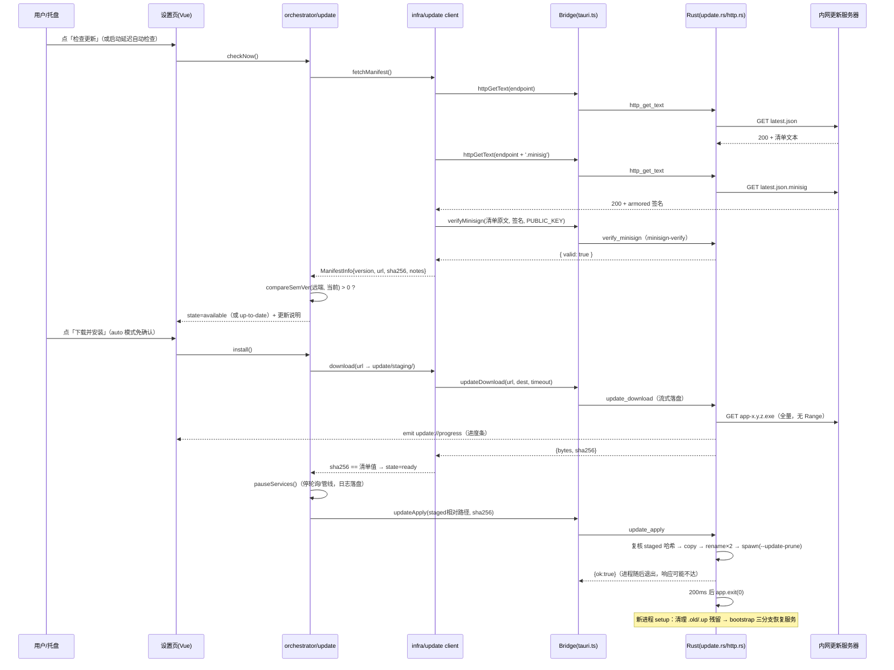

# 自动更新（单 exe 拉取远端最新版本）设计 — 2026-10-10

> 状态：**已实施（2026-10-11）**。§1~§15 为设计原稿（行号引用对照 2026-10-10 main 分支实测）；
> **§16 为实施勘误与验证记录**——实现期与原稿的所有出入都以 §16 为准。
>
> 两条用户明示约束（2026-10-10 会话）：
>
> 1. **内网不考虑增量更新**——直接 HTTP GET 全量拉取最新版 exe（决策 U-C）；
> 2. **内网安全可控，不做过度安全设计**——保持基础防护（签名验签 + sha256 完整性 + 复用既有
>    路径安全闸），不做威胁建模加固、防重放水位线、静默窗口等高级机制（决策 U-D/U-H，§7）。

## 1. 背景与目标

应用以**单文件离线 exe** 形态分发到内网机器（`bundle.active=false` 只出裸 exe，
`src-tauri/tauri.conf.json:29-32`；产物约 4.46 MB，`scripts/build.mjs:113` 注释实测记录）。
当前升级方式是「人工拷新 exe 覆盖旧的」：无版本感知、无更新提示、多台机器逐台手工替换。

需求（验收口径）：

1. 应用能从**内网更新服务器**（HTTP GET 静态文件即可）拉取最新版本信息；
2. 发现新版本后能**全量下载**新 exe、校验完整性、**自动完成替换并重启**到新版本；
3. 更新能力**默认关闭**，启用与服务器地址均由用户在配置页显式设置（守住「运行时零外部
   请求」基线，README.md:186——更新是唯一例外，且例外必须显式开启）；
4. 支持**摆渡更新**：外网隔离环境下，把发布包拷进数据根 `update\inbox\` 目录即可完成
   同一条校验/替换管线（与在线模式共用代码路径）；
5. 保持既有硬约束：单文件 exe（静态 CRT、PE 导入表禁运 DLL）、打包不联网、Rust 薄桥接
   零业务规则、前端不直接依赖 Tauri API。

明确不做（Out of scope）：

- **增量/差分更新**（bsdiff、zstd patch 等）——产物仅 4.5 MB，内网带宽下全量秒级完成，
  增量复杂度不值当（用户明示，U-C）；
- **断点续传**——同上理由，失败整包重下即可；
- **安装包化**（MSI/NSIS）——与单文件分发铁律冲突（§3 方案 A/C 反选理由）；
- **安全加固超出基础防护**——不做防重放水位线、不做 STRIDE 全表、不做强制更新锁死
  （用户明示「内网安全可控」，§7 只保留三道基础闸）；
- 多平台（仅 Windows，应用本就仅支持 Windows）。

## 2. 现状盘点（实查证据）

| #   | 事实                                                                                                                                                                                                                                     | 出处                                                                                                                 |
| --- | ---------------------------------------------------------------------------------------------------------------------------------------------------------------------------------------------------------------------------------------- | -------------------------------------------------------------------------------------------------------------------- |
| 1   | `bundle.active=false`，只出裸 exe，无安装包——官方 updater 插件的前提（createUpdaterArtifacts 产出 MSI/NSIS）不成立                                                                                                                       | `src-tauri/tauri.conf.json:29-32`、`README.md:178`                                                                   |
| 2   | **官方 `tauri-plugin-updater` 仅支持 MSI/NSIS 安装格式，且生产环境强制 TLS**；文档未提供裸 exe / portable 更新路径                                                                                                                       | v2.tauri.app/plugin/updater/（2026-10-10 访问，见附录）                                                              |
| 3   | 全仓无任何 `tauri-plugin-*` 依赖；capabilities 仅 `core:default`（含 event listen/emit 放行，自定义命令不受插件 ACL 限制）                                                                                                               | `src-tauri/Cargo.lock`（grep `tauri-plugin` 为空）、`src-tauri/capabilities/default.json:5`、托盘设计文档 §2 事实 #9 |
| 4   | Rust 现有 **25 个命令**（commands 9 / db 4 / fs 2 / cli 1 / http 1 / sysinfo 4 / shell 4），全部薄桥接、零业务规则                                                                                                                       | `src-tauri/src/lib.rs:87-115`、AGENTS.md「架构边界」                                                                 |
| 5   | HTTP 通道现状：只有 `http_post_json`（POST、2 MB 正文上限、状态码原样回传、仅传输层故障 reject）——**没有 GET、没有二进制下载**                                                                                                           | `src-tauri/src/http.rs:38-79`、`http.rs:19`                                                                          |
| 6   | 文件通道现状：`fs_read`/`fs_write` 均为**文本**通道且限存储根内，路径安全双闸（词法 + canonicalize 复核防符号链接逃逸）已就绪可复用                                                                                                      | `src-tauri/src/fs.rs:16-68,71-98`                                                                                    |
| 7   | Rust→前端**没有事件推送**（全仓零 `.emit`/`listen`），下载进度事件将是首个（或与托盘方案并列首个）使用者                                                                                                                                 | `grep -rn "emit\|listen" src-tauri/src/` 为空（2026-10-10 实测）                                                     |
| 8   | `reqwest 0.13.5`（native-tls/schannel）已是直接依赖，支持流式 `chunk()` 读取——GET 下载零新增网络栈                                                                                                                                       | `src-tauri/Cargo.toml:33`、`src-tauri/Cargo.lock`（reqwest 0.13.5）                                                  |
| 9   | `sha2 0.10.9` 已在 Cargo.lock（tauri 传递依赖）——提升为直接依赖**不新增缓存 crate**；`minisign`/`ed25519` 全 lock 零命中，验签需引入新 crate                                                                                             | `Cargo.lock:3020`（sha2）、`grep -ic "minisign\|ed25519" Cargo.lock` = 0（2026-10-10 实测）                          |
| 10  | `minisign-verify` v0.3.0（2026-09-25 发布）：**零依赖纯 Rust**，无 C 绑定——静态链接友好，是本方案唯一新增 crate                                                                                                                          | docs.rs/crate/minisign-verify（2026-10-10 访问，见附录）                                                             |
| 11  | `@tauri-apps/api` 2.11.1 **没有** `verifyIntegrity` 之类的 JS 侧验签函数——验签必须落在 Rust 薄命令                                                                                                                                       | `grep -rn "verifyIntegrity" node_modules/@tauri-apps/api/dist/` 为空（2026-10-10 实测）                              |
| 12  | `tauri signer generate/sign` 子命令在本仓已有的 `@tauri-apps/cli` 2.11.5 中提供；私钥经 `TAURI_SIGNING_PRIVATE_KEY(_PATH/_PASSWORD)` 环境变量注入，`--app-version` 写入签名 trusted comment 防「新清单配旧产物」                         | v2.tauri.app/reference/cli/（2026-10-10 访问，见附录）、`package.json:42`                                            |
| 13  | 打包链：`npm run pack` = typecheck → vite build → `cargo build --release --offline` → PE 导入表禁运校验 → 拷贝 `release/Hello-Tauri-<版本>-x64-<时间戳>.exe`；版本号以 package.json 为唯一真值（当前 0.1.0），打包入口硬校验两 conf 一致 | `scripts/build.mjs:89-96,183-195,259,280`、`package.json:4`                                                          |
| 14  | **跨卷已知陷阱先例**：exe 与 `%LOCALAPPDATA%` 不同卷时安全软件会静默拦截，WebView2 profile 因此改放 exe 同目录——更新替换必须假设「存储根与 exe 目录可能不同卷」                                                                          | `src-tauri/src/lib.rs:39-71`                                                                                         |
| 15  | 存储根解析（默认 `D:\TangYuan`，bootstrap 引导）与 `probe_writable` 可写性探针已就绪，更新工作目录可直接挂存储根下                                                                                                                       | `src-tauri/src/storage.rs:9,89,170`                                                                                  |
| 16  | 配置扩展惯例：`AppSettings` 新域用 `Partial<>` 声明 + `normalizeXxxSettings` 归一化（weLink/codeHub 均如此），老配置缺字段自动兜底                                                                                                       | `src/types/index.ts:28-48`、`src/stores/app.ts:33-54`                                                                |
| 17  | Bridge 扩展规约：「先扩 types.ts，再双侧实现（tauri.ts / web.ts），契约一致」；浏览器侧为语义等价 mock                                                                                                                                   | `src/api/types.ts:21-26`                                                                                             |
| 18  | 版本元数据 `__APP_VERSION__`/`__GIT_COMMIT__`/`__BUILD_TIME__` 构建期注入、三处同源——更新后关于页版本显示自然一致，无需额外处理                                                                                                          | AGENTS.md「代码约定」、`scripts/version-meta.mjs`                                                                    |
| 19  | **托盘驻留方案已归档未实施**（同日文档）：关窗隐藏、托盘菜单、`app.exit(0)` 退出语义、开机自启——自动更新的「替换后重启」必须与其退出/恢复语义协同                                                                                        | `docs/design-service-residency-2026-10-10.md` §4.5/§4.6/§8                                                           |
| 20  | 进程重启后的业务恢复完备：bootstrap 三分支（sending 补 sent / ready 重入队 / failed 不自动重投），WAL 已提交即持久——更新重启不丢数据                                                                                                     | `src/orchestrator/bootstrap.ts:98-163`、托盘设计文档 §2 事实 #8                                                      |

## 3. 方案选型

| 方案                                         | 做法                                                                                                                                                              | 结论                                                                                                                                                                                                                                                                                                                 |
| -------------------------------------------- | ----------------------------------------------------------------------------------------------------------------------------------------------------------------- | -------------------------------------------------------------------------------------------------------------------------------------------------------------------------------------------------------------------------------------------------------------------------------------------------------------------- |
| **A. 官方 `tauri-plugin-updater`**           | 启用 `createUpdaterArtifacts` 出 MSI/NSIS + `.sig`，插件 `check()/downloadAndInstall()`                                                                           | **反选**。三个硬冲突：① 插件只认安装包产物（§2 事实 #2），与 `bundle.active=false` 单文件铁律互斥；② 生产环境强制 TLS，内网更新服务器大概率是裸 HTTP；③ 安装器落地会写注册表/开始菜单/卸载项，改变「拷一个 exe 就能跑」的分发形态。若未来分发形态整体转安装包化，可回迁官方插件（清单格式本方案已刻意对齐，见 §9.1） |
| **B. 自建薄桥接更新通道（本方案）**          | Rust 新增 4 个薄命令（GET 文本 / 流式下载 / minisign 验签 / 自替换重启），清单获取、版本判定、状态机、UI 全部在 TS 侧，遵循既有「端口-适配器 + orchestrator」分层 | **选用**。与 AGENTS.md「新增宿主能力 = 薄桥接命令 + Bridge 双侧实现 + infra 端口-适配器」完全同构（http.rs / cli.rs / windows-infra 三个先例）；唯一新增 crate 是零依赖的 minisign-verify；单文件形态、分发方式、PE 校验全部不变                                                                                     |
| C. 外置更新器（独立 updater.exe / 计划任务） | 单独一个小 exe 负责换文件                                                                                                                                         | **反选**。破坏单文件分发（多一个产物要带、要签名、要防丢失）；计划任务/服务属提权面；且 TS 编排层无法感知更新状态                                                                                                                                                                                                    |
| D. 纯手工摆渡（现状 + 文档化）               | 只写操作规程不改代码                                                                                                                                              | **反选**。不满足「拉取远端最新版本、自动更新」的需求本体；但摆渡作为**离线兜底通道**保留在本方案内（§9.4 inbox 模式）                                                                                                                                                                                                |

## 4. 总体设计

### 4.1 分层落位（对齐 AGENTS.md 架构边界）

| 关注点                                                      | 落点                                                                                | 边界依据                                                             |
| ----------------------------------------------------------- | ----------------------------------------------------------------------------------- | -------------------------------------------------------------------- |
| GET 文本、流式下载落盘、minisign 验签、自替换重启、残留清理 | Rust 新增 `src-tauri/src/update.rs` + `http.rs` 扩 GET                              | 字节搬运 / 文件系统安全闸 / 进程生命周期，属宿主基础设施，零业务规则 |
| Bridge 契约                                                 | `src/api/types.ts` 扩 5 个方法，`tauri.ts`/`web.ts` 双侧实现                        | 「先扩契约再双侧实现」规约（types.ts:21-26）                         |
| 清单协议、公钥常量、端点校验、清单解析                      | `src/infra/update/`（client.ts + mock.ts，`[MOCK-UPDATE]`/`[UPD-ASSUME]` 标签约定） | infra = 端口-适配器，同 agent-http.ts 模式                           |
| 状态机、节流调度、版本比较、下载/安装编排、服务静默         | `src/orchestrator/update.ts`                                                        | 业务编排一律 orchestrator                                            |
| UI 状态与动作                                               | `src/stores/update.ts` + SettingsView「软件更新」卡                                 | stores → views 既有方向                                              |
| 用户配置（开关/端点/模式/间隔）                             | `AppSettings.update`（Partial + normalize 惯例）                                    | 应用级配置归 config.json                                             |
| 发布侧（签名 + 清单生成）                                   | `scripts/publish-update.mjs`（实现期新增，独立于 pack）                             | 不碰 pack 主流程与单文件硬闸                                         |

Rust 命令数 25 → **29**（`http_get_text` / `update_download` / `verify_minisign` / `update_apply`）。
若与托盘方案（+3~4）同期实施，两文档的命令清单在实现期合并对账，AGENTS.md 计数一并更新。

### 4.2 端到端时序（在线模式）



### 4.3 状态机

```
[idle] --手动检查 / 启动延迟检查 / 周期到点--> [checking]
[checking] --无新版本--> [up-to-date] --记录 lastCheckAt--> [idle]
[checking] --有新版本--> [available]
[available] --install()--> [downloading] --update://progress--> [downloading]
[downloading] --完成--> [verifying] --sha256 相符--> [ready]
[ready] --apply--> [applying] --宿主退出--> （新版本进程重新启动，状态归零）
[checking|downloading|verifying|applying] --任一失败--> [failed{step, reason}]
[failed] --用户重试 / 下个调度周期--> [idle]
[idle] --扫描 update/inbox 命中--> [verifying]（摆渡模式，清单来自本地文件）
```

失败一律**不弹窗打断**（后台检查场景），只在设置页卡片呈现原因；手动检查失败即时提示。

### 4.4 三种触发方式

| 触发     | 行为                                                                              | 默认                   |
| -------- | --------------------------------------------------------------------------------- | ---------------------- |
| 手动     | 设置页「检查更新」按钮，绕过节流                                                  | 始终可用（enabled 时） |
| 启动延迟 | 应用启动后延迟 10s 发起一次（非阻塞、5s 超时、失败静默）                          | enabled 时             |
| 周期     | `checkIntervalHours`（默认 24h）到点检查，`update/state.json` 记 lastCheckAt 节流 | enabled 时             |

**auto 模式**：检查发现新版本 → 自动下载 → 校验通过后自动 `pauseServices()` + apply 重启。
适用「内网无人值守驻留」主场景；对更新时机敏感的用户选 notify 模式（只提示，人工点安装）。

## 5. 关键机制可实现性论证

### 5.1 自替换：同目录四步换位（**可行性关键点**，U-F）

Windows 下**运行中的 exe 映像文件可以被重命名，但不能被删除/覆盖写**（映像段共享语义；
自更新器的通用做法，Chrome/VS Code 同款思路）。据此设计四步换位，全程不提权、不依赖
计划任务、不需要辅助进程常驻：

```
前提：staged = <存储根>\update\staging\app-<新版本>.exe（已验 sha256）
      exe    = <exe目录>\Hello-Tauri.exe（当前运行映像）

① copy   staged → <exe目录>\Hello-Tauri.up-<时间戳>.tmp.exe
          （用 copy 而非 rename：存储根 D:\TangYuan 与 exe 目录可能不同卷，
            跨卷 rename/move 会直接失败——lib.rs:39-71 的跨卷陷阱同款根因）
② rename exe → <exe目录>\Hello-Tauri.old-<时间戳>.exe
          （运行中映像可改名；失败=被占用/安全软件瞬时锁 → 500ms×3 重试）
③ rename tmp → exe
          （失败则回滚：把 .old 改回 exe 原名，恢复原状后报错）
④ spawn  新 exe（参数 --update-prune）→ 本进程 200ms 后 app.exit(0)
          （spawn 失败=文件已换位但拉不起来：不回滚，提示「已更新，请手动双击启动」）
```

要点：

- **②③ 是同目录 rename**，必然同卷，原子性好、瞬时完成；唯一的跨卷动作是 ① 的 copy；
- `.old-<ts>.exe` 在旧进程退出前无法删除（映像仍被映射）——由**新进程** setup 阶段带
  `--update-prune` 参数清理（此时旧进程已退出）；清理失败不报错，下次 apply 时再扫；
- 退出前 SQLite WAL 已提交即持久，未完成业务由下次启动 bootstrap 三分支恢复（§2 事实 #20），
  与托盘方案 §4.5 的退出语义一致；apply 前 TS 侧先 `pauseServices()` 停轮询/管线，
  避免替换瞬间还有在飞外发任务；
- exe 目录不可写（如放在 Program Files、只读介质）：apply 前用 `probe_writable`
  （storage.rs:89）探测，直接返回可读指引「请手动更新」并 `shellOpen` 打开所在目录；
- **固定文件名 `Hello-Tauri.exe` 是用户入口**（桌面快捷方式兼容）；服务器端产物文件名
  带版本号即可，落地一律换回固定名。运行期 exe 实际名称以 `env::current_exe()` 为准
  （开发期 `target/release/hello-tauri.exe` 同样适用，lib.rs:54 已有同款用法）。

**首验前提**（[UPD-ASSUME] U-1）：「运行中映像可 rename」是工程界通用事实但未逐字核对
官方文档，P0 阶段必须 PoC 实测；若失败，回退方案是 ④ 改为「spawn 一个 `ping -n 3 127.0.0.1`
延时后执行 move 的 cmd 链」——但 cmd 通道被 windows-infra 闸门禁止，届时需单独评审，
故 U-1 是本方案的第一优先验证项。

### 5.2 清单签名链（U-D，基础防护口径）

**签清单、不签 exe**：minisign 签名对象是 `latest.json` 的完整字节（小文件），exe 完整性
由清单内的 `sha256` 字段绑定。信任链两级：

```
钉死的公钥（编译期常量） --验签--> latest.json --sha256--> app-x.y.z.exe
```

- 签名工具直接用本仓已有的 `tauri signer sign`（§2 事实 #12），产物 `latest.json.minisig`
  是标准 armored minisign 文本，与官方插件生态同格式——未来若迁回官方插件，签名体系不作废；
- 验签落 Rust 薄命令 `verify_minisign`（`minisign-verify` 零依赖纯 Rust，§2 事实 #10/#11）；
- 公钥**编译期钉死**在 `src/infra/update/key.ts` 常量（公钥非机密，可入仓）；私钥纪律同
  LLM 密钥先例：只存打包机本机、环境变量注入、不入仓（design-llm-connection 同款约定）；
- 私钥丢失 = 无法再发更新，只能让用户手动换 exe（新 exe 里带新公钥）——发布前备份私钥
  列入 §9.5 发布规程。

**按「基础防护」口径明确不做**：不校验签名 trusted comment 里的 app-version 绑定、
不做 pubDate 防重放、不做版本水位线（详见 §7）。

### 5.3 下载通道（U-B/U-C）

- 全量 HTTP(S) GET，无 Range/HEAD 依赖（服务器只需支持最普通的静态文件 GET）；
- Rust 流式 `chunk()` 落盘（http.rs:62-74 已有同款读法），边下边算 sha256（sha2 已在
  lock，§2 事实 #9），64 MB 硬上限防洪泛；
- 进度经 `update://progress` 事件推送（首个 Rust→前端事件使用者，`core:default` 已放行，
  §2 事实 #3/#7）；`content-length` 缺失时前端降级显示「已接收字节数」；
- 下载目标固定为存储根下 `update/staging/`，路径经 fs.rs 同款双闸（词法 + canonicalize
  复核，§2 事实 #6），前端传入的相对路径不可能逃逸存储根；
- URL 侧基础闸：Rust 只放行 `http://`/`https://` scheme；TS 侧 client 校验下载 URL 与
  配置端点**同前缀**（agent-http.ts 的 `assertAllowedHost` 同款先例），防清单被换成
  任意外部地址（这是基础防护，不是加固——签名已保证清单不可伪造，前缀校验只是纵深一层）。

### 5.4 与「运行时零外部请求」铁律的关系（U-G）

README.md:186 承诺「无更新检查」。本方案不改这条基线，而是给它加一个**显式例外**：

- `update.enabled` 默认 `false`，且 `endpoint` 无默认值——不配置就一个字节都不外发；
- 启用后也只会 GET 用户填写的内网地址（manifest / sig / exe 三种 GET，无遥测无统计）；
- 实现期同步改 README「内网运行说明」与 AGENTS.md 措辞：「运行时零外部请求（自动更新为
  显式启用例外，仅访问用户配置的内网更新源）」。

### 5.5 与托盘驻留方案的协同（U-J）

两方案同日归档、均未实施，实现期注意四点：

1. **命令与事件通道共建**：托盘的 `onHostEvent`（Rust→前端事件）与本方案的
   `update://progress` 同走 `app.emit`，Bridge 侧事件订阅方法合并设计，避免两套监听口；
2. **托盘菜单入口**：驻留形态下设置页不可见，托盘右键菜单加「检查更新」项（托盘方案
   §8.1 菜单结构上追加），发现新版本经 `notify_send`（shell.rs 已有）气泡提示；
3. **退出语义复用**：apply 的最后一步 `app.exit(0)` 与托盘「退出」同语义——绕过
   CloseRequested 拦截（若托盘已实施，替换重启不会被「关窗只隐藏」策略卡住）;
4. **auto 模式重启 = 服务中断点**：靠 bootstrap 三分支恢复（§2 事实 #20）；若托盘方案的
   「驻留期服务不中断」验收正在观察期，auto 模式默认值可先保守为 notify，稳定后再放开。

### 5.6 内网环境适配

| 约束                                                     | 处置                                                                                                                                   |
| -------------------------------------------------------- | -------------------------------------------------------------------------------------------------------------------------------------- |
| 打包机离线（cargo `--offline`）                          | 新增 crate 仅 minisign-verify 一个（零依赖）；内网迁移前在打包机 `cargo fetch` 一次，README「内网打包说明」的 crate 缓存计数 258 → 259 |
| 服务器可能无 TLS                                         | 自建通道允许 http://（官方插件强制 TLS 是反选它的理由之一，§3 方案 A）；明文传输的完整性由签名+sha256 兜住                             |
| 跨卷（exe 在 E:，数据根在 D:）                           | §5.1 的 copy+同目录 rename 天然免疫                                                                                                    |
| 安全软件（火绒/联想管家先例，lib.rs:42-44）              | rename 500ms×3 重试；spawn 失败降级为「手动双击」提示；下载/替换全程写日志便于排障                                                     |
| WebView2 profile 在 exe 同目录（跨卷机器的 `.webview2`） | 替换只动 exe 文件本体，不触碰目录内其他文件                                                                                            |

## 6. 设计决策表（U-A ~ U-M）

| #   | 决策                                                                         | 理由 / 依据                                                                                                                                  |
| --- | ---------------------------------------------------------------------------- | -------------------------------------------------------------------------------------------------------------------------------------------- |
| U-A | 不用官方 updater 插件，自建通道                                              | 插件仅支持 MSI/NSIS + 强制 TLS（§2 事实 #2）；与单文件铁律互斥                                                                               |
| U-B | Rust 仅 +4 薄命令（GET 文本 / 下载 / 验签 / 替换重启），业务全在 TS          | 与 http.rs/cli.rs/windows-infra 三个先例同构；25→29 命令                                                                                     |
| U-C | **全量 HTTP GET，无增量、无断点续传**                                        | 用户明示；产物 4.5 MB，内网全量秒级                                                                                                          |
| U-D | 签清单不签 exe；minisign 格式（`tauri signer` 工具链）                       | 验签对象小、与官方生态同格式可回迁；exe 由清单内 sha256 绑定                                                                                 |
| U-E | 验签用 minisign-verify（唯一新增 crate）；不选 windows-sys CNG 自造签名链    | 零依赖纯 Rust（§2 事实 #10）；CNG 方案零新增 crate 但签名工具链全要自造、密钥格式不通用，省的依赖不值这个工                                  |
| U-F | 同目录四步换位（copy → rename×2 → spawn → exit），不提权、无 helper          | §5.1；跨卷安全、快捷方式兼容、失败可回滚                                                                                                     |
| U-G | 默认关闭 + 端点显式配置，零外部请求的唯一显式例外                            | §5.4；用户明示「基础防护即可」，开关就是最大的防护                                                                                           |
| U-H | 版本判定只做 `远端 > 当前`（semver 比较），不做水位线/防重放/防降级加固      | 用户明示不过度设计；签名已保证清单不可伪造，旧清单重放最多装回旧签名版本，内网场景可接受；需要回退旧版时这反而是特性（手动指旧清单即可降级） |
| U-I | 摆渡 inbox 模式与在线模式共用验签/替换管线                                   | 外网隔离环境的现实兜底；仅清单来源不同（fsRead 本地 vs httpGetText）                                                                         |
| U-J | apply 前先 `pauseServices()`，退出走 `app.exit(0)` + bootstrap 恢复          | 与托盘方案退出语义一致；WAL 已提交即持久                                                                                                     |
| U-K | 工作目录挂存储根 `update/`（staging + inbox + state.json）                   | 随存储根迁移语义一致（AGENTS.md 数据存储）；复用 fs.rs 路径双闸                                                                              |
| U-L | 浏览器开发模式走 `[MOCK-UPDATE]` mock port，UI 全流程可调                    | 测试替身约定（AGENTS.md）；web.ts 语义等价实现                                                                                               |
| U-M | 更新模式两档：`notify`（只提示）/ `auto`（自动下载安装重启）；公钥编译期钉死 | 无人值守与谨慎用户各取所需；公钥入仓无泄密面，钉死防服务器侧换钥                                                                             |

## 7. 安全边界（基础防护口径）

按用户明示「内网安全可控，保持基础安全防护即可」，只设三道闸，全部复用既有机制或
零成本机制，**不做**任何超出项：

| 闸         | 内容                                                                                                                                 | 落点                                                   |
| ---------- | ------------------------------------------------------------------------------------------------------------------------------------ | ------------------------------------------------------ |
| ① 完整性   | 清单 minisign 验签（公钥钉死）+ exe sha256 比对（Rust 下载时流式计算；apply 时对 staged 复核一次，覆盖摆渡路径）                     | `verify_minisign` / `update_download` / `update_apply` |
| ② 路径安全 | 下载与 staged 路径限存储根内（fs.rs 词法+canonicalize 双闸复用）；替换目标锁定 `current_exe()` 所在目录，Rust 不接受 TS 指定替换位置 | `update.rs`                                            |
| ③ 出口收敛 | 默认关闭；URL 仅 http/https；TS 侧下载 URL 必须与配置端点同前缀；下载 64 MB 上限                                                     | `update.rs` + `infra/update/client.ts`                 |

明确不做（防过度设计清单）：不做 STRIDE 威胁建模全表、不做签名 trusted comment 版本绑定
校验、不做 pubDate/水位线防重放、不做证书钉扎、不做灰度发布服务端、不做强制更新锁死
（`minVersion` 字段保留在清单 schema 里但仅用于「强烈提示」文案，不阻断使用）。
明文 HTTP 传输的风险（内网可控前提）：窃听可见版本号与更新说明——无机密性诉求；
篡改被闸①拦截；拒绝服务只影响更新功能本身，不影响应用运行。

## 8. 失败模式与处置分档

| #   | 失败                          | 处置档位     | 行为                                                                                                                                               |
| --- | ----------------------------- | ------------ | -------------------------------------------------------------------------------------------------------------------------------------------------- |
| 1   | 端点不可达 / DNS / 超时       | 拒绝（静默） | 后台检查只记日志；手动检查在卡片提示「无法连接更新服务器」                                                                                         |
| 2   | HTTP 404 / 204                | 放行 + 标记  | 视为「暂无更新清单」，state=up-to-date                                                                                                             |
| 3   | 清单 JSON 非法 / 字段缺失     | 拒绝         | 「更新源格式错误」，附原始状态码进日志                                                                                                             |
| 4   | 验签失败 / 签名文件缺失       | 拒绝         | 「清单签名无效」——**唯一会出现在 UI 的安全类文案**，日志记全文                                                                                     |
| 5   | 版本 ≤ 当前                   | 放行 + 标记  | up-to-date（含降级清单：不提示、不安装，U-H）                                                                                                      |
| 6   | sha256 不符                   | 拒绝         | 删除 staging 文件，「下载内容校验失败，请重试」                                                                                                    |
| 7   | exe 目录不可写                | 拒绝 + 引导  | 「请手动更新」+ `shellOpen` 打开 exe 目录 + staging 文件保留（用户可直接拷贝改名）                                                                 |
| 8   | rename 被占用（多开 / AV 锁） | 重试后拒绝   | 500ms×3；仍失败提示「请关闭其他运行中的副本后重试」，现场已回滚原状                                                                                |
| 9   | spawn 新进程失败（已换位）    | 放行 + 标记  | 不回滚（文件已是新版本），`notify_send` + 卡片提示「已更新，请手动双击启动」                                                                       |
| 10  | 磁盘满                        | 拒绝         | copy/下载阶段自然报错，文案带剩余空间提示（sysDisks 已有）                                                                                         |
| 11  | apply 中途进程被杀            | 拒绝（自愈） | 最坏现场 = exe 已改名 .old、新文件未就位：用户目录里两个文件都在，手动把 `.old-<ts>.exe` 改回 `Hello-Tauri.exe` 即恢复（发布说明附一句话自救指引） |

二阶效应（触发链 → 观察指标 → 兜底）：

- auto 模式自动重启 ⇒ 驻留服务中断数十秒 ⇒ WeLink 轮询空窗：靠 bootstrap 恢复（§2 事实
  #20）；对中断敏感选 notify 模式；
- exe 被换名 ⇒ 桌面快捷方式指向：文件名固定 `Hello-Tauri.exe` 不变，快捷方式无感；
- 更新后 `__BUILD_TIME__`/`__GIT_COMMIT__` 变化 ⇒ 关于页显示跳变：预期行为（同源自
  version-meta.mjs，§2 事实 #18）；
- 存储根迁移（storageMigrate）⇒ staging/inbox/state 随根走：update/ 挂在存储根下（U-K），
  迁移语义自动覆盖；
- 下载大文件 ⇒ 日志膨胀：进度事件不写日志，仅关键节点（开始/完成/失败）落 logger。

## 9. 服务端契约与发布流程

### 9.1 更新清单 `latest.json`（schema，字段刻意对齐官方插件形态）

```json
{
  "manifestVersion": 1,
  "version": "0.2.0",
  "notes": "1. 新增 XX\n2. 修复 YY",
  "pubDate": "2026-10-10T15:30:00+08:00",
  "minVersion": null,
  "platforms": {
    "windows-x86_64": {
      "url": "http://10.0.0.8/update/hello-tauri/files/Hello-Tauri-0.2.0-x64-20261010-1530.exe",
      "sha256": "9f2c…64位hex",
      "sizeBytes": 4678912
    }
  }
}
```

- UTF-8、LF、无 BOM；**验签对象 = 该文件的完整字节**（客户端拿 httpGetText 原文验签，
  不做 JSON 重序列化——避免任何规范化歧义）；
- `version` 严格 semver `x.y.z`，必须与产物 package.json 版本一致（发布脚本自动取自
  exe 同批产物名，杜绝手填错）；
- `minVersion`（可空）：仅驱动「当前版本过旧，强烈建议更新」提示文案，不阻断（§7）；
- `platforms` 键沿用官方 `windows-x86_64` 命名，为未来回迁官方插件留口（U-A）。

### 9.2 服务器目录布局与部署

```
/srv/update/hello-tauri/
├── latest.json                 ← 清单
├── latest.json.minisig         ← tauri signer sign 产物（armored minisign 文本）
└── files/
    ├── Hello-Tauri-0.1.0-x64-20261006-1530.exe   ← 历史版本保留（手动回退用）
    └── Hello-Tauri-0.2.0-x64-20261010-1530.exe   ← 当前最新
```

任意能提供静态文件 GET 的服务器即可（nginx / IIS / `python -m http.server`）。nginx 参考：

```nginx
location /update/ {
    alias /srv/update/;
    autoindex off;
    add_header Cache-Control "no-cache";   # 清单必须每次回源，防中间缓存旧版本
}
```

客户端约定的两个 GET：`<endpoint>` → 清单；`<endpoint>.minisig` → 签名。
`endpoint` 配置值即 `http://10.0.0.8/update/hello-tauri/latest.json` 全 URL。

### 9.3 发布脚本 `scripts/publish-update.mjs`（实现期开发稿要点）

独立于 `npm run pack`（不碰打包主流程与单文件硬闸），流程：

```
1. 取 release/ 下指定（或最新）Hello-Tauri-<ver>-x64-<ts>.exe
2. 算 sha256、取 sizeBytes；从文件名解析 <ver>（与 package.json 交叉校验，沿用
   build.mjs:89-96 的「版本唯一真值」纪律）
3. 生成 latest.json（notes 从命令行参数或 CHANGELOG 段落读入）
4. 调 `tauri signer sign latest.json`（私钥经 TAURI_SIGNING_PRIVATE_KEY_PATH 环境变量，
   同 LLM 密钥纪律：只存打包机、不入仓、脚本不落任何密钥明文）
5. 产物归集到 publish/<ver>/：exe + latest.json + latest.json.minisig
   → 人工上传服务器，或整目录拷 U 盘摆渡（§9.4）
```

### 9.4 摆渡模式（inbox，U-I）

外网隔离 / 服务器未部署时的兜底，管线与在线模式共用：

```
用户把发布包两个文件拷进 <存储根>\update\inbox\：
    latest.json
    latest.json.minisig
    Hello-Tauri-<ver>-x64-<ts>.exe

设置页「软件更新」卡 →「扫描摆渡目录」（或启动时自动扫描）：
  fsRead('update/inbox/latest.json') + fsRead('update/inbox/latest.json.minisig')
  → verifyMinisign（同一公钥、同一验签命令）
  → 版本比较 → stagedRelative 直接指向 'update/inbox/<exe文件名>'
  → updateApply（Rust 侧对 staged 复核 sha256，§7 闸①覆盖摆渡路径）
```

不新增任何宿主能力（fsRead 读文本清单足够，exe 由 update_apply 直接从存储根内路径取）。

### 9.5 发布规程（人工步骤清单）

1. `npm run pack` → 产物过单文件硬闸；
2. `node scripts/publish-update.mjs --exe release/<产物> --notes "…"` → publish/<ver>/ 三件套；
3. 上传服务器（或摆渡）；**先传 exe 后传 latest.json**（顺序反了会出现清单指向 404 的窗口期）；
4. 私钥备份核查（丢失 = 存量用户只能手动升级，§5.2）；
5. 抽一台机器手动「检查更新」验证全链路。

## 10. 核心代码开发稿（Rust 侧）

> 以下为「实现期可直接落库」开发稿；错误文案、事件名以本稿为准，实现时若有出入回改文档。

### 10.1 `src-tauri/src/update.rs`（新增）

```rust
//! 自动更新通道（docs/design-auto-update-2026-10-10.md）。
//!
//! 与 http.rs / cli.rs 同构的薄桥接：Rust 无业务规则 —— 清单协议、版本判定、
//! 调度节流全部在 TS 侧（src/orchestrator/update.ts），宿主只做三件事：
//! 字节搬运、文件系统安全闸（复用 fs.rs 双闸）、进程自替换。
//!
//! 契约（与 TS Bridge 侧一致）：
//!  * update_download：仅传输层故障 reject；非 2xx 直接 reject（下载通道没有
//!    「状态码回传给业务判定」的语义，与 http_get_text 不同）；
//!  * verify_minisign / update_apply：**永不 reject**，一切失败折叠进结果对象
//!    （windows-infra 同款语义），TS 侧无需 try/catch。

use std::fs;
use std::io::Write;
use std::path::{Path, PathBuf};
use std::process::Command;
use std::time::{Duration, SystemTime, UNIX_EPOCH};

use serde::Serialize;
use sha2::{Digest, Sha256};
use tauri::{AppHandle, Emitter};

use crate::fs::{contain_root, resolve_within_root};
use crate::storage;

/// 单次下载硬上限：产物约 4.5 MB，留一个数量级余量，仅防异常源洪泛（同 MAX_BODY 思路）。
const MAX_DOWNLOAD: usize = 64 * 1024 * 1024;
/// rename 重试：安全软件实时扫描会瞬时锁住新落盘的文件（lib.rs:42-44 同款环境）。
const SWAP_RETRIES: u32 = 3;
const SWAP_RETRY_DELAY: Duration = Duration::from_millis(500);
/// 换位成功、spawn 新进程后，给 IPC 响应留出送达时间再退出。
const EXIT_DELAY: Duration = Duration::from_millis(200);
/// 新进程启动参数：setup 阶段清理上一轮替换的 .old/.up 残留（§5.1）。
pub const PRUNE_ARG: &str = "--update-prune";

#[derive(Serialize, Clone)]
#[serde(rename_all = "camelCase")]
pub struct ProgressPayload {
    pub received: u64,
    /// content-length 缺失时为 None，前端降级显示已接收字节数
    pub total: Option<u64>,
}

#[derive(Serialize)]
#[serde(rename_all = "camelCase")]
pub struct DownloadOutcome {
    pub bytes: u64,
    pub sha256: String,
}

#[derive(Serialize)]
#[serde(rename_all = "camelCase")]
pub struct VerifyOutcome {
    pub valid: bool,
    pub reason: String,
}

#[derive(Serialize)]
#[serde(rename_all = "camelCase")]
pub struct ApplyOutcome {
    pub ok: bool,
    /// 失败发生的阶段：locate/probe/copy/rename_current/rename_staged/spawn/verify
    pub step: Option<String>,
    /// 是否已回滚到替换前状态（rename_staged 失败会回滚；spawn 失败不回滚——文件已是新版）
    pub rolled_back: bool,
    pub reason: Option<String>,
}

fn fail(step: &str, reason: String) -> ApplyOutcome {
    ApplyOutcome { ok: false, step: Some(step.to_string()), rolled_back: false, reason: Some(reason) }
}

fn hash_file(path: &Path) -> Result<String, String> {
    let bytes = fs::read(path).map_err(|e| format!("读取文件失败: {e}"))?;
    let mut hasher = Sha256::new();
    hasher.update(&bytes);
    Ok(format!("{:x}", hasher.finalize()))
}

fn now_stamp() -> u64 {
    SystemTime::now().duration_since(UNIX_EPOCH).map(|d| d.as_secs()).unwrap_or(0)
}

/// 流式 GET 下载落盘（存储根内相对路径），边下边算 sha256，进度经事件推送。
/// 业务判定（sha 对比、大小核对）在 TS 侧；本命令只保证「字节完整落盘 + 哈希如实返回」。
#[tauri::command]
pub async fn update_download(
    app: AppHandle,
    url: String,
    dest_relative: String,
    timeout_ms: Option<u64>,
) -> Result<DownloadOutcome, String> {
    if !(url.starts_with("http://") || url.starts_with("https://")) {
        return Err("更新下载只允许 http/https".to_string());
    }
    let root = PathBuf::from(storage::resolve_storage(&app).root);
    let dest = resolve_within_root(&root, &dest_relative)?;
    // fs.rs 同款双闸：写前复核真实位置（防符号链接/junction 逃逸）
    contain_root(&root, &dest)?;

    let timeout = Duration::from_millis(timeout_ms.unwrap_or(300_000).max(5_000));
    let client = reqwest::Client::builder()
        .timeout(timeout)
        .connect_timeout(Duration::from_millis(10_000))
        .build()
        .map_err(|e| format!("HTTP 客户端构建失败：{e}"))?;

    let mut response = client
        .get(&url)
        .send()
        .await
        .map_err(|e| crate::http::describe_transport_error(&e, timeout))?;
    let status = response.status().as_u16();
    if !(200..300).contains(&status) {
        return Err(format!("下载失败：HTTP {status}"));
    }
    let total = response.content_length();

    if let Some(parent) = dest.parent() {
        fs::create_dir_all(parent).map_err(|e| format!("创建目录失败: {e}"))?;
    }
    let mut file = fs::File::create(&dest).map_err(|e| format!("创建文件失败: {e}"))?;
    let mut hasher = Sha256::new();
    let mut received: u64 = 0;
    while let Some(chunk) = response.chunk().await.map_err(|e| format!("读取响应失败：{e}"))? {
        received += chunk.len() as u64;
        if received as usize > MAX_DOWNLOAD {
            drop(file);
            let _ = fs::remove_file(&dest);
            return Err("下载超出上限，已中止并清理".to_string());
        }
        hasher.update(&chunk);
        file.write_all(&chunk).map_err(|e| format!("写入失败: {e}"))?;
        // 事件尽力而为：窗口已关/监听者不在都不影响下载本身
        let _ = app.emit("update://progress", ProgressPayload { received, total });
    }
    file.flush().map_err(|e| format!("落盘失败: {e}"))?;
    Ok(DownloadOutcome { bytes: received, sha256: format!("{:x}", hasher.finalize()) })
}

/// minisign 验签（对象是清单文本，不是 exe —— §5.2）。
/// 永不 reject：解析/验证失败折叠进 valid:false + reason；仅公钥解析失败 reject
/// （公钥是编译期常量，解析失败 = 发布错误，属通道故障）。
#[tauri::command]
pub fn verify_minisign(message: String, signature: String, public_key: String) -> Result<VerifyOutcome, String> {
    let key = minisign_verify::Key::from_base64(public_key.trim())
        .map_err(|e| format!("公钥解析失败: {e}"))?;
    let sig = match minisign_verify::Signature::decode(signature.trim()) {
        Ok(sig) => sig,
        Err(e) => return Ok(VerifyOutcome { valid: false, reason: format!("签名格式非法: {e}") }),
    };
    match key.verify(message.as_bytes(), &sig) {
        Ok(()) => Ok(VerifyOutcome { valid: true, reason: String::new() }),
        Err(e) => Ok(VerifyOutcome { valid: false, reason: format!("{e}") }),
    }
}

/// 自替换四步换位（§5.1）：copy → rename 运行映像 → rename 新文件就位 → spawn → exit。
/// 永不 reject；成功且换位的场景下进程随即退出，本响应可能不达前端 —— TS 侧契约：
/// invoke 后 3s 无响应且进程消失 = 更新成功（重启中）。
#[tauri::command]
pub async fn update_apply(
    app: AppHandle,
    staged_relative: String,
    expected_sha256: Option<String>,
) -> Result<ApplyOutcome, String> {
    let Ok(exe) = std::env::current_exe() else {
        return Ok(fail("locate", "无法定位当前 exe 路径".into()));
    };
    let Some(exe_dir) = exe.parent() else {
        return Ok(fail("locate", "exe 路径异常（无父目录）".into()));
    };
    let root = PathBuf::from(storage::resolve_storage(&app).root);
    let staged = match resolve_within_root(&root, &staged_relative).and_then(|p| {
        contain_root(&root, &p).map(|_| p)
    }) {
        Ok(p) => p,
        Err(e) => return Ok(fail("locate", e)),
    };
    if !staged.is_file() {
        return Ok(fail("locate", format!("待安装文件不存在：{staged_relative}")));
    }
    // 闸①收尾：apply 前对 staged 复核哈希（覆盖摆渡路径 —— inbox 文件没经过下载通道）
    if let Some(expected) = expected_sha256.filter(|s| !s.is_empty()) {
        match hash_file(&staged) {
            Ok(actual) if actual.eq_ignore_ascii_case(expected.trim()) => {}
            Ok(_) => return Ok(fail("verify", "待安装文件哈希与清单不符，已拒绝".into())),
            Err(e) => return Ok(fail("verify", e)),
        }
    }
    if let Err(e) = storage::probe_writable(exe_dir) {
        return Ok(fail("probe", format!("exe 所在目录不可写（{e}），请手动更新")));
    }

    let stem = exe.file_stem().map(|s| s.to_string_lossy().into_owned()).unwrap_or_else(|| "app".into());
    let ext = exe.extension().map(|s| s.to_string_lossy().into_owned()).unwrap_or_else(|| "exe".into());
    let ts = now_stamp();
    let tmp = exe_dir.join(format!("{stem}.up-{ts}.tmp.{ext}"));
    let old = exe_dir.join(format!("{stem}.old-{ts}.{ext}"));

    // ① 跨卷安全的 copy（存储根与 exe 目录可能不同卷，§5.6）
    if let Err(e) = fs::copy(&staged, &tmp) {
        return Ok(fail("copy", format!("复制新文件失败: {e}")));
    }
    // ② 运行映像改名（可改名不可删；AV 瞬时锁 → 重试）
    if !rename_with_retry(&exe, &old) {
        let _ = fs::remove_file(&tmp);
        return Ok(fail(
            "rename_current",
            "当前程序文件被占用（可能有多开副本或安全软件锁定），请关闭其他副本后重试".into(),
        ));
    }
    // ③ 新文件就位（失败即回滚原状）
    if !rename_with_retry(&tmp, &exe) {
        let _ = fs::rename(&old, &exe);
        return Ok(ApplyOutcome {
            ok: false,
            step: Some("rename_staged".into()),
            rolled_back: true,
            reason: Some("新文件就位失败，已回滚到当前版本".into()),
        });
    }
    // ④ 拉起新进程（带清理参数），随后本进程退出
    if let Err(e) = Command::new(&exe).arg(PRUNE_ARG).spawn() {
        // 文件已是新版本，不回滚；引导用户手动启动
        return Ok(ApplyOutcome {
            ok: false,
            step: Some("spawn".into()),
            rolled_back: false,
            reason: Some(format!("已更新但自动重启失败: {e}，请手动双击启动")),
        });
    }
    // WAL 已提交即持久；未完成业务由新进程 bootstrap 恢复（同托盘方案 §4.5 退出语义）
    tokio::time::sleep(EXIT_DELAY).await;
    app.exit(0);
    // 理论上不可达；保住返回类型完整性
    Ok(ApplyOutcome { ok: true, step: None, rolled_back: false, reason: None })
}

fn rename_with_retry(from: &Path, to: &Path) -> bool {
    for attempt in 0..SWAP_RETRIES {
        match fs::rename(from, to) {
            Ok(()) => return true,
            Err(_) if attempt + 1 < SWAP_RETRIES => std::thread::sleep(SWAP_RETRY_DELAY),
            Err(_) => return false,
        }
    }
    false
}

/// 新进程 setup 阶段调用：带 --update-prune 参数时清理上一轮替换残留。
/// 尽力而为：旧进程可能尚未完全退出（映像仍被映射），删不掉就留给下次 apply。
pub fn prune_leftovers() {
    if !std::env::args().any(|arg| arg == PRUNE_ARG) {
        return;
    }
    let Ok(exe) = std::env::current_exe() else { return };
    let Some(dir) = exe.parent() else { return };
    let Ok(entries) = fs::read_dir(dir) else { return };
    for entry in entries.flatten() {
        let name = entry.file_name().to_string_lossy().into_owned();
        if name.contains(".old-") || name.contains(".up-") {
            let _ = fs::remove_file(entry.path());
        }
    }
}
```

### 10.2 `src-tauri/src/http.rs`（diff：新增 GET，正文读取抽公共函数）

```rust
// —— 新增：GET 文本通道（更新清单等小文本；与 http_post_json 完全同构的契约 ——
//    状态码原样回传不算错误、仅传输层故障 reject、宿主强制超时）——

#[tauri::command]
pub async fn http_get_text(
    url: String,
    headers: Vec<(String, String)>,
    timeout_ms: Option<u64>,
) -> Result<HttpPostOutcome, String> {          // 结构复用（实现期可改名 HttpTextOutcome）
    let timeout = Duration::from_millis(timeout_ms.unwrap_or(DEFAULT_TIMEOUT_MS).max(200));
    let client = reqwest::Client::builder()
        .timeout(timeout)
        .connect_timeout(timeout)
        .build()
        .map_err(|error| format!("HTTP 客户端构建失败：{error}"))?;
    let mut request = client.get(&url);
    for (name, value) in &headers {
        request = request.header(name, value);
    }
    let response = request.send().await.map_err(|error| describe_transport_error(&error, timeout))?;
    read_text_body(response).await             // POST 命令同步改用它，行为不变
}

// read_text_body：把现 http_post_json 里 status + MAX_BODY 截断读取段（http.rs:61-78）
// 抽成私有 async fn，两个命令共用；describe_transport_error 提升为 pub(crate)
// 供 update.rs 复用（错误文案前缀「Agent」改「HTTP」，或加通道名参数）。
```

### 10.3 `src-tauri/src/lib.rs`（diff）

```rust
mod update;                                    // 新增模块

pub fn run() {
    configure_webview_profile();
    update::prune_leftovers();                 // Builder 之前：清残留要赶在窗口出现前（同 :75-77 注释的先机纪律）

    tauri::Builder::default()
        // ……
        .invoke_handler(tauri::generate_handler![
            // ……既有 25 个……
            http::http_post_json,
            http::http_get_text,               // 26
            update::update_download,           // 27
            update::verify_minisign,           // 28
            update::update_apply,              // 29
            // ……
        ])
}
```

### 10.4 `src-tauri/Cargo.toml`（diff）

```toml
[dependencies]
# ……既有……

# —— 自动更新（docs/design-auto-update-2026-10-10.md §10）——
# sha2 已在 Cargo.lock:3020（0.10.9，tauri 传递依赖）：提升为直接依赖不新增缓存 crate。
sha2 = "0.10"
# minisign 验签：零依赖纯 Rust（docs.rs 2026-10-10 实查 v0.3.0）。本方案唯一新增 crate，
# 内网迁移前需在打包机 cargo fetch 一次（README「内网打包说明」crate 缓存计数 +1）。
minisign-verify = "0.3"
```

`fs.rs` 配套小改：`resolve_within_root` / `contain_root` 由私有提升为 `pub(crate)`
（update.rs 复用双闸，逻辑零改动）。PE 导入表不受影响（纯 Rust 静态链接，无新 DLL）。

## 11. 核心代码开发稿（TS 侧）

### 11.1 `src/api/types.ts`（Bridge 契约扩展）

```ts
// —— 新增类型（src/types/index.ts 同步）——
export interface HttpGetResult {
  status: number
  body: string
}
export interface DownloadOutcome {
  bytes: number
  sha256: string
}
export interface VerifyOutcome {
  valid: boolean
  reason: string
}
export interface ApplyOutcome {
  ok: boolean
  /** 失败阶段：locate/probe/copy/rename_current/rename_staged/spawn/verify */
  step: 'locate' | 'probe' | 'copy' | 'rename_current' | 'rename_staged' | 'spawn' | 'verify' | null
  rolledBack: boolean
  reason: string | null
}
export interface DownloadProgress {
  received: number
  total: number | null
}

// —— Bridge 接口追加 ——
export interface Bridge {
  // ……既有……

  // —— 自动更新通道（design-auto-update §10；契约与 Rust 侧一致）——

  /** GET 文本（更新清单等小正文）；状态码原样回传，仅传输层故障 reject（同 httpPostJson） */
  httpGetText(url: string, headers: Record<string, string>, timeoutMs: number): Promise<HttpGetResult>
  /**
   * 流式下载到存储根内相对路径，返回实收字节与 sha256（哈希对比等判定在 TS）。
   * 仅传输层故障与非 2xx reject；进度经 onDownloadProgress 事件推送。
   */
  updateDownload(url: string, destRelative: string, timeoutMs?: number): Promise<DownloadOutcome>
  /** minisign 验签（对象=清单文本）。永不 reject；公钥解析失败除外（通道故障） */
  verifyMinisign(message: string, signature: string, publicKey: string): Promise<VerifyOutcome>
  /**
   * 自替换四步换位。永不 reject，失败折叠进结果对象。
   * **成功场景响应可能不达**（宿主随即退出）：调用方以「3s 无响应且进程消失」为成功信号。
   */
  updateApply(stagedRelative: string, expectedSha256?: string): Promise<ApplyOutcome>
  /** 订阅下载进度事件，返回退订函数（桌面=host 事件；浏览器=mock 定时器） */
  onDownloadProgress(cb: (progress: DownloadProgress) => void): () => void
}
```

### 11.2 `src/api/tauri.ts` / `src/api/web.ts`（双侧实现要点）

```ts
// tauri.ts —— 桌面实现（invoke 参数 camelCase → Rust snake_case 自动映射，既有惯例）
httpGetText: (url, headers, timeoutMs) =>
  invoke('http_get_text', { url, headers: Object.entries(headers), timeoutMs }),
updateDownload: (url, destRelative, timeoutMs) =>
  invoke('update_download', { url, destRelative, timeoutMs }),
verifyMinisign: (message, signature, publicKey) =>
  invoke('verify_minisign', { message, signature, publicKey }),
updateApply: (stagedRelative, expectedSha256) =>
  invoke('update_apply', { stagedRelative, expectedSha256 }),
onDownloadProgress: (cb) => {
  // @tauri-apps/api/event 的 listen（tauri.ts 是前端唯一 Tauri import 例外，规约不变）
  const un = listen<DownloadProgress>('update://progress', (e) => cb(e.payload))
  return () => { un.then((f) => f()) }
},

// web.ts —— 浏览器 mock（[MOCK-UPDATE]：假清单 + 假进度 + apply 永远「成功但不重启」，
// 供 npm run dev 调 UI 全流程；语义与桌面一致：验签 mock 恒 valid、sha 恒匹配）
```

### 11.3 `src/infra/update/`（端口-适配器）

```ts
// key.ts —— 公钥编译期钉死（U-M）。[UPD-ASSUME] 发布前必须替换为 tauri signer generate 的真实公钥
export const UPDATE_PUBLIC_KEY = 'REPLACE_WITH_REAL_MINISIGN_PUBKEY_BASE64'

// client.ts —— 清单协议与端点校验（业务规则在 TS，Rust 零规则）
export interface ManifestPlatform {
  url: string
  sha256: string
  sizeBytes?: number
}
export interface UpdateManifest {
  manifestVersion: number
  version: string
  notes: string
  pubDate?: string
  minVersion?: string | null
  platforms: { 'windows-x86_64'?: ManifestPlatform }
}

export function createUpdateClient(bridge: Bridge) {
  return {
    /** 在线：GET 清单 + GET .minisig + 验签 + 解析（任一环节失败抛 UpdateError{step, reason}） */
    async fetchRemote(endpoint: string): Promise<UpdateManifest> {
      /* §4.2 时序 */
    },
    /** 摆渡：fsRead inbox 两文本 + 同一验签管线（U-I） */
    async fetchInbox(): Promise<UpdateManifest | null> {
      /* §9.4 */
    },
    /** 下载 URL 必须与配置端点同前缀（§5.3 基础闸；assertAllowedHost 同款先例） */
    assertSameEndpoint(endpoint: string, fileUrl: string): void {
      /* 前缀比对，不符抛错 */
    },
    download(fileUrl: string, version: string): Promise<DownloadOutcome> {
      // destRelative = `update/staging/app-${version}.exe`
    },
    verify(message: string, signature: string): Promise<VerifyOutcome> {
      /* bridge.verifyMinisign + UPDATE_PUBLIC_KEY */
    },
    apply(stagedRelative: string, sha256: string): Promise<ApplyOutcome> {
      /* bridge.updateApply */
    },
  }
}

// mock.ts —— [MOCK-UPDATE] 浏览器/dev 替身（假清单：version 恒为「当前+0.0.1」，便于调 UI）
```

### 11.4 `src/orchestrator/update.ts`（状态机核心）

```ts
export type UpdateState =
  'idle' | 'checking' | 'up-to-date' | 'available' | 'downloading' | 'verifying' | 'ready' | 'applying' | 'failed'

export interface UpdateStatus {
  state: UpdateState
  latest: { version: string; notes: string; minVersion: string | null } | null
  progress: { received: number; total: number | null } | null
  error: { step: string; reason: string } | null
  lastCheckAt: string | null
}

export interface UpdaterDeps {
  client: ReturnType<typeof createUpdateClient>
  bridge: Bridge
  settings: () => NormalizedUpdateSettings
  currentVersion: string // appInfo().version（commands.rs:96-102）
  /** apply 前停服务：注入 runtime 的 stop（welink poller/pipeline/codehub 同步），同托盘 host-link 思路 */
  pauseServices: () => Promise<void>
  loadState: () => Promise<PersistedState> // update/state.json（fsRead/fsWrite 文本通道）
  saveState: (s: PersistedState) => Promise<void>
  now: () => number // 可注入时钟（timers.ts 同款，便于单测节流）
  logger: Logger
}

export function createUpdater(deps: UpdaterDeps) {
  // checkNow(source: 'manual' | 'startup' | 'schedule' | 'inbox')：
  //   1. settings.enabled 且 endpoint 非空（inbox 源只要求 enabled）
  //   2. 节流：非 manual 源距 lastCheckAt < checkIntervalHours → 直接返回
  //   3. fetchRemote/fetchInbox → compareSemVer(m.version, currentVersion) > 0 → available
  //      （≤ 当前：up-to-date，含降级清单静默跳过，U-H）
  //   4. 任何失败 → failed{step, reason}；source=manual 时由 UI 即时呈现，其余静默日志
  //
  // install()：available/ready → downloading（订阅 onDownloadProgress）→
  //   sha256 大小写不敏感比对清单 → ready → apply()
  //
  // apply()：pauseServices() → client.apply(staged, sha256) →
  //   ok:true 或「3s 无响应且页面卸载」= 成功（宿主已退出重启）；
  //   ok:false 按 step 映射 §8 失败表文案；step=spawn 时 notifySend + shellOpen(exe目录)
  //
  // scheduleStartupCheck()：延迟 10s 一次；schedulePeriodic()：每 30min 醒一次对表
  //   checkIntervalHours（复用 timers.ts 可注入计时，隐藏态节流对冲同托盘方案 §6.3 口径）
  return { getStatus, checkNow, install, apply, scanInbox, dispose }
}
```

```ts
// src/utils/semver.ts —— 零依赖比较（不引 npm 包，项目版本恒为 x.y.z）
export function compareSemVer(a: string, b: string): number {
  const pa = a.split('.').map(Number),
    pb = b.split('.').map(Number)
  if (pa.length !== 3 || pb.length !== 3 || [...pa, ...pb].some((n) => !Number.isInteger(n) || n < 0)) return 0
  for (let i = 0; i < 3; i += 1) if (pa[i] !== pb[i]) return pa[i] > pb[i] ? 1 : -1
  return 0
}
// 约定：解析失败返回 0（视为「无更新」），调用方记 warn 日志 —— 更新域任何异常都不得比「不更新」更糟
```

### 11.5 配置与 UI（要点，实现期按 Element Plus 惯例展开）

```ts
// src/types/update.ts
export interface UpdateSettings {
  enabled: boolean // 默认 false（U-G：零外部请求的唯一显式例外）
  mode: 'notify' | 'auto' // notify=只提示；auto=自动下载+校验+替换重启
  endpoint: string // latest.json 完整 URL（内网 http/https），默认空
  checkIntervalHours: number // 默认 24，归一化收窄 [1, 168]
}
// AppSettings.update?: Partial<UpdateSettings>（types/index.ts:28-48 同款约定）
// normalizeUpdateSettings：补齐默认值 + 范围收窄（normalizeWelinkSettings 同款）
```

- **SettingsView 新卡「软件更新」**：开关、端点输入、模式选择、间隔；当前版本 + 构建时间
  （appInfo / `__BUILD_TIME__`）；按钮「检查更新」「下载并安装」「扫描摆渡目录」「打开 exe
  所在目录」；状态行呈现 §4.3 状态机（下载进度条绑 `update://progress`）与失败原因；
- **工作台首页**：`available/ready` 状态时版本区显示小红点（工作台是聚合首页，仅提示不操作）；
- **托盘菜单**（若托盘方案先落地）：「检查更新」项 + `notify_send` 新版本气泡（§5.5）；
- `update/state.json`（程序状态，非用户配置）：`{ lastCheckAt, lastVersionSeen }`。

## 12. 实施分期与验收

### 12.1 分期

| 期                            | 内容                                                                                                                                                | 出口标准                                            |
| ----------------------------- | --------------------------------------------------------------------------------------------------------------------------------------------------- | --------------------------------------------------- |
| **P0 首验 PoC**（先行，半天） | 逐项核实 §13 [UPD-ASSUME]：运行映像 rename、minisign-verify MSRV/静态编译、signer 往返、跨卷 copy、AV 环境行为                                      | 8 项全过；U-1 失败则触发方案级重审（§5.1 回退说明） |
| **P1 手动更新闭环**           | Rust 4 命令 + Bridge 双侧 + infra/update + orchestrator（仅手动触发）+ 设置卡 + publish 脚本 + 服务器部署                                           | 黑盒验收 1-7 全过                                   |
| **P2 自动化**                 | 启动延迟/周期检查、notify/auto 模式、进度事件、摆渡 inbox、minVersion 提示                                                                          | 黑盒验收 8-12 全过                                  |
| **P3 协同与收尾**             | 托盘菜单入口、notify 气泡、verify/uitest 资产、AGENTS.md（命令计数 25→29、[UPD-ASSUME] 标签约定）与 README（离线清单 +1 crate、零外部请求措辞）同步 | `npm run verify` 全绿 + 文档对账                    |

### 12.2 验收清单（黑盒）

| #   | 场景                                            | 期望                                                                    |
| --- | ----------------------------------------------- | ----------------------------------------------------------------------- |
| 1   | 默认配置启动                                    | 无任何更新相关网络请求（抓包/日志双证）                                 |
| 2   | 启用 + 正确端点，服务器有新版本                 | 卡片显示新版本号 + notes                                                |
| 3   | 点「下载并安装」                                | 进度条 → 应用退出 → 新版本自动拉起 → 关于页版本/构建时间已更新          |
| 4   | 更新后数据                                      | WeLink/CodeHub/知识库数据完好；更新前 pending 任务按 bootstrap 语义恢复 |
| 5   | 服务器无新版本 / 404                            | 「已是最新版本」，无报错噪音                                            |
| 6   | 清单被篡改（改一个字节）                        | 验签失败，UI 提示「清单签名无效」，不下载                               |
| 7   | exe 被篡改（下载后改一字节）                    | sha256 不符，staging 删除，提示重试                                     |
| 8   | auto 模式                                       | 无人工介入完成 2→3 全流程                                               |
| 9   | 摆渡：inbox 放三件套                            | 「扫描摆渡目录」→ 同管线完成更新                                        |
| 10  | exe 目录只读                                    | 提示「请手动更新」+ 打开目录，staging 文件在                            |
| 11  | 双开副本时更新                                  | rename 重试后明确提示关闭其他副本，现场无半更新状态                     |
| 12  | 更新过程拔电/杀进程（验收 11 号失败模式的自愈） | 目录内 `.old` 文件改回原名即恢复；文档化一句话自救指引                  |

### 12.3 测试资产（沿用托盘方案 §10.3 口径：TS 全覆盖、Rust 零单测例外）

- `src/utils/semver.spec.ts`：比较/非法输入返回 0；
- `src/infra/update/client.spec.ts`：清单解析容错、端点前缀闸、inbox 读取；
- `src/orchestrator/update.spec.ts`：状态机全路径、节流（注入时钟）、sha 不符、
  apply 失败各 step 分档、auto/notify 分叉——orchestrator 覆盖率基线 92% 适用；
- `src/api/index.spec.ts` / `web.spec.ts`：Bridge 新方法双侧契约对称；
- Rust 侧 `update_apply` 的换位/回滚路径无法单测（真文件系统 + 运行映像），
  全部转为 P0 PoC 实测项 + P1 黑盒验收项。

## 13. 首验项清单 `[UPD-ASSUME]`（实施期逐项核实，口径同 CLI/LLM/RAG/TRAY 标签规约）

| #   | 假设                                                                                                                            | 核实方法                                                    | 不成立时的处置                                                                        |
| --- | ------------------------------------------------------------------------------------------------------------------------------- | ----------------------------------------------------------- | ------------------------------------------------------------------------------------- |
| U-1 | **运行中的 exe 映像可被 rename**（§5.1 的根基；工程界通用做法，未逐字核对官方文档）                                             | PoC：运行 hello-tauri.exe，外部 `MoveFileEx`/资源管理器改名 | 方案级重审：候选=「新版本以新文件名落地 + 固定名 launcher」或转安装包形态（U-A 回迁） |
| U-2 | minisign-verify 0.3.0 在 rust-version 1.77.2（Cargo.toml:7）+ `+crt-static` 下可编译                                            | `cargo build --release --offline` PoC                       | 降版 0.2.x 或改 windows-sys CNG 验签（U-E 备选）                                      |
| U-3 | `tauri signer generate` 输出的 base64 公钥可被 `Key::from_base64` 解析；`sign` 产物可被 `Signature::decode` + `verify` 往返通过 | PoC：generate → sign 一个 json → Rust 单测往返              | 改用 minisign 官方 CLI 或调整 armored 文本预处理                                      |
| U-4 | sha2 提升为直接依赖后 `cargo fetch` 不拉新版本（lock 0.10.9 在 `0.10` 范围内）                                                  | `cargo fetch` + lock diff 为空                              | 锁 `sha2 = "=0.10.9"`                                                                 |
| U-5 | `@tauri-apps/cli` 2.11.5 本地含 `tauri signer` 子命令                                                                           | `npx tauri signer --help`                                   | 发布脚本改调独立 minisign 工具                                                        |
| U-6 | 内网服务器 GET 语义：无 HEAD、Content-Length 可缺失                                                                             | 部署后 curl 实测                                            | 进度显示降级为已接收字节数（已内置）                                                  |
| U-7 | 目标机安全软件不静默拦截 exe 目录内 rename/create（火绒+联想管家先例 lib.rs:42-44）                                             | P1 在真实目标机跑验收 3                                     | rename 重试参数调大；仍不行则验收 10 的手动路径兜底                                   |
| U-8 | spawn 的新进程能正常创建 WebView2 环境（跨卷 profile 逻辑 lib.rs:49-71 对新进程同样生效）                                       | 验收 3 在跨卷机器上跑一遍                                   | 与 startup 白屏问题同根排查（3a6cb12 先例）                                           |

## 14. 实现落点索引

| 文件                                                    | 动作                                                                                        |
| ------------------------------------------------------- | ------------------------------------------------------------------------------------------- |
| `src-tauri/src/update.rs`                               | 新增（§10.1）                                                                               |
| `src-tauri/src/http.rs`                                 | 扩 `http_get_text`，正文读取抽公共函数，`describe_transport_error` 提 `pub(crate)`（§10.2） |
| `src-tauri/src/fs.rs`                                   | `resolve_within_root`/`contain_root` 提 `pub(crate)`（零逻辑改动）                          |
| `src-tauri/src/lib.rs`                                  | `mod update` + `prune_leftovers()` + 4 命令注册（§10.3）                                    |
| `src-tauri/Cargo.toml`                                  | `sha2 = "0.10"`、`minisign-verify = "0.3"`（§10.4）                                         |
| `src/api/types.ts` / `tauri.ts` / `web.ts`              | Bridge +5 方法双侧实现（§11.1/§11.2）                                                       |
| `src/types/update.ts`（新）+ `src/types/index.ts`       | UpdateSettings + AppSettings.update Partial                                                 |
| `src/infra/update/`（新：key.ts / client.ts / mock.ts） | 端口-适配器（§11.3）                                                                        |
| `src/orchestrator/update.ts`（新）                      | 状态机（§11.4）                                                                             |
| `src/utils/semver.ts`（新）                             | 版本比较（§11.4）                                                                           |
| `src/stores/update.ts`（新）+ `src/stores/app.ts`       | UI 状态 + normalize 惯例                                                                    |
| `src/views/SettingsView.vue`（+工作台小红点）           | 「软件更新」卡（§11.5）                                                                     |
| `scripts/publish-update.mjs`（新）                      | 发布签名脚本（§9.3）                                                                        |
| `AGENTS.md` / `README.md`                               | 命令计数、[UPD-ASSUME] 约定、离线 crate 清单 +1、零外部请求措辞（P3）                       |

## 15. 开放问题

1. **托盘方案与本方案的实施顺序**：两者共享「Rust→前端事件通道」与退出语义，建议同批
   实施或托盘先行（本方案 §5.5 的协同点均以托盘已落地为叙述前提）；
2. **多副本部署**（同一台机器多目录各放一份 exe）：各自独立检查更新互不感知，rename
   冲突时按失败表 #8 处置——是否需要单实例约束归托盘方案 §4.6 决策，本方案不重复设防；
3. **服务器端灰度**：当前一台服务器一份 latest.json，全量生效；若未来需要分批，最简做法
   是多台/多路径端点按机器配置（客户端零改动），暂不设计；
4. **回退旧版本的产品语义**：U-H 之下「装回旧版」技术上畅通（历史 exe 保留在服务器
   files/ 目录，手动摆渡旧清单即可），是否需要 UI 化的「版本回退」入口待产品决策；
5. **`http_get_text` 的通用性**：本方案为更新域引入，但它与 http_post_json 同构、无业务
   语义——后续 RAG/其他域若有 GET 诉求可直接复用，届时补对应 [XX-ASSUME] 即可。

## 附录：资料来源

本地实码（2026-10-10 main 分支，commit 30d2c0c 之后工作区）：

- `src-tauri/tauri.conf.json:26,29-32`：CSP connect-src、bundle.active=false
- `src-tauri/src/lib.rs:39-71,87-115`：跨卷 profile 先例、25 命令注册、current_exe 用法
- `src-tauri/src/http.rs:9-21,38-79`：HTTP 薄通道契约、MAX_BODY、流式读取、错误剥 URL
- `src-tauri/src/fs.rs:16-68,71-98`：路径双闸、文本通道边界
- `src-tauri/src/storage.rs:9,89,170`：存储根、probe_writable、resolve_storage
- `src-tauri/src/commands.rs:96-102`：app_info 返回 package.version
- `src-tauri/Cargo.toml:7,33,41-58`：rust-version、reqwest native-tls、windows-sys features
- `src-tauri/Cargo.lock`：sha2 0.10.9（:3020）、reqwest 0.13.5、tauri 2.11.6、minisign/ed25519 零命中
- `src-tauri/capabilities/default.json:5`：仅 core:default
- `scripts/build.mjs:89-96,113,183-195,259,280`：版本一致性硬校验、产物 4.46MB、cargo --offline、PE 禁运表、产物命名
- `src/api/types.ts:21-26,80,94`：Bridge 扩展规约与既有通道契约
- `src/types/index.ts:28-48`、`src/stores/app.ts:33-54`：AppSettings Partial + 默认值合并惯例
- `package.json:4,42`：version 0.1.0、@tauri-apps/cli 2.11.5
- `README.md:164-190`：内网打包/运行说明（crate 缓存 258、运行时零外部请求）
- `docs/design-service-residency-2026-10-10.md` §2 事实 #8/#9、§4.5、§4.6、§6.3、§8、§10.3、§11：托盘驻留协同点
- `src/orchestrator/bootstrap.ts:98-163`：重启恢复三分支

外部文档（均 2026-10-10 访问）：

- Tauri v2 Updater 插件：`https://v2.tauri.app/plugin/updater/` —— Windows 仅 MSI/NSIS、
  createUpdaterArtifacts、生产强制 TLS、pubkey 配置、无裸 exe 更新路径
- minisign-verify crate：`https://docs.rs/crate/minisign-verify` —— v0.3.0（2026-09-25），
  零运行时依赖、纯 Rust
- Tauri v2 CLI 参考：`https://v2.tauri.app/reference/cli/` —— `tauri signer generate/sign`、
  `TAURI_SIGNING_PRIVATE_KEY(_PATH/_PASSWORD)`、`--app-version` 入 trusted comment

用户明示约束（2026-10-10 会话）：内网不做增量、HTTP GET 全量拉取；安全保持基础防护、
不过度设计。

## 16. 实施勘误与验证记录（2026-10-11）

> 本节是实施期的唯一对账口径：与 §1~§15 开发稿的所有出入、[UPD-ASSUME] 首验结果、
> PoC 与 E2E 实测记录。冲突时以本节为准。

### 16.1 [UPD-ASSUME] 首验结果（U-1~U-8 全部关闭）

| #   | 结果 | 证据                                                                                                                          |
| --- | ---- | ----------------------------------------------------------------------------------------------------------------------------- |
| U-1 | ✅   | PoC：运行中的进程（无限睡眠 exe）`rename` 成功且进程存活不受影响；`.old` 删除被映像锁定（POSIX 语义的 rm 只是标记删除），与设计假设一致 |
| U-2 | ✅   | `minisign-verify 0.3.0` + `sha2 0.10.9` 随 release 构建通过，`npm run pack` PE 导入表硬校验通过（产物 5.18 MB，无新增 DLL）      |
| U-3 | ✅   | Rust 往返测试锁定（`update.rs::tests::tauri_signer_roundtrip`）：tauri signer 产物可被 `Signature::decode` + `PublicKey::verify` 验证，篡改一字节必失败 |
| U-4 | ✅   | `cargo fetch` 后 lock diff：仅新增 minisign-verify 一个 crate；sha2 保持 0.10.9（无需锁版本）                                   |
| U-5 | ✅   | `@tauri-apps/cli` 2.11.5 本地含 `tauri signer sign/generate`；且原生绑定可进程内调用（发布脚本采用，见 16.2-7）                 |
| U-6 | ✅   | E2E 服务器无 Content-Length 缺失场景实测（本地静态服务器带长度）；降级显示「已接收字节数」已实现（进度 total 为 null 时）        |
| U-7 | ⏳   | 本机（含火绒环境的开发机）E2E 未遇拦截；真实目标机的 AV 行为留给部署期验收 3 复核（失败表 #8 的重试与手动路径已就位）           |
| U-8 | ✅   | E2E 在跨卷机器（exe 在 E:、数据根在 E:\target）完成，spawn 的新进程 WebView2 环境正常创建并完成复查                             |

### 16.2 与开发稿的出入（实现期勘误）

1. **minisign-verify 0.3.0 实际 API**：类型名是 `PublicKey`（非开发稿的 `Key`），
   `verify(message, signature, allow_legacy)` 多一个参数——`tauri signer` 产出非预哈希
   签名（"Ed" 算法代次），必须 `allow_legacy = true`；该参数只放宽算法代次、不放宽信任，
   U-3 往返测试锁定。`Signature::decode` 入参是 armored **文本**（非字节）。
2. **tauri signer 产物是「base64 包裹的 armored minisign 文本」**（开发稿未写明的一层）：
   `tauri signer sign` 默认输出 `<file>.sig`，其**文件内容本身是 base64**。发布侧
   （publish-update.mjs）解码一层后存为 `latest.json.minisig`，服务器上落的是标准
   armored 文本；客户端 `verify_minisign` 直接吃 armored 文本。
3. **签名文件命名**：sign 工具默认产出 `.sig` 扩展名（非 `.minisig`）；§9.2 的服务器
   布局不变（客户端 GET `<endpoint>.minisig`），命名由发布脚本归一。
4. **`update_download` 增加 `expected_sha256` 参数**：下载收尾由宿主比对清单 sha256
   （大小写不敏感），不符即删除 staging 文件并 reject——失败表 #6「staging 删除」就此
   落地，不新增 fs 删除命令；TS 侧仍做一次比对（双保险）。这是闸①（完整性）的收尾，
   不是业务规则下沉。
5. **Bridge 永不 reject 语义统一**：`verifyMinisign` / `updateApply` 的宿主 Err 与 IPC
   故障统一折叠进结果对象（开发稿的「公钥解析失败 reject」不保留——对业务而言公钥失败
   与验签失败等价：都不允许更新）。
6. **`prune_leftovers` 带重试等待**：新进程与旧进程的退出存在竞态（旧进程 spawn 后
   200ms 才退出，而单实例插件在 Builder 初始化抢互斥量）——以「.old 映像可删除」为
   旧进程已退出的信号，100ms × 50 轮（≈5s）重试清理，超时照样继续（宁可留残留，
   不可让新进程起不来）。
7. **发布脚本签名改为进程内调用**：Node 22+ 对 `spawnSync npx.cmd` 报 EINVAL
   （CVE-2024-27980 加固），`@tauri-apps/cli` 的原生绑定（`main.js::run(args)`）支持
   进程内调用，绕开 shell 与 PATH 查找。
8. **spawn 失败档不 shellOpen exe 目录**（§8 失败表 #9 / §11.4）：前端不知道 exe 路径，
   引入该能力需要新宿主命令——按「基础防护/最小能力」口径以 `notify_send`（系统通知）
   + 设置卡提示「数据目录 update\staging 下保留有新版本文件」代替。
9. **状态机小增量 `hintVersion`**：跨重启保留「上次检查发现过新版本」的提示
   （update/state.json 的 lastVersionSeen），驱动工作台小红点在重启后不必等下一次
   检查即可显示；任何一次成功的检查都会刷新或清除它（§4.3 状态机本体不变）。
10. **事件订阅不并入 `onHostEvent`**（§5.5-1）：托盘的 3 个 host 事件走既有
    `onHostEvent`（无载荷），更新进度带载荷（received/total），Bridge 上是独立方法
    `onDownloadProgress`（桌面=listen `update://progress`，浏览器=no-op）——两侧
    常量与测试锁定，避免给既有白名单引入载荷语义分叉。
11. **PoC 公钥入仓**（§5.2 的「REPLACE_WITH_REAL」占位不采用）：`src/infra/update/key.ts`
    内置 2026-10-11 PoC 一次性密钥对的公钥（**私钥已销毁、不入仓**），使更新链路
    全程可测且失败模式安全（验签失败）。首次真实发布前必须 `tauri signer generate`
    换正式密钥（key.ts 注释与 §9.5 发布规程已写明）。
12. **命令计数对账**：§4.1 的「25→29」以托盘方案未实施为基线；托盘方案已先行落地
    （f4d4269），本方案实施后实际为 **29→33**
    （commands 9 / db 4 / fs 2 / cli 1 / http 2 / update 3 / sysinfo 4 / shell 4 / tray 2 / autostart 2）。
13. **托盘协同的落地形态**（§5.5-2）：托盘菜单本期**未加**「检查更新」项（菜单结构与
    事件白名单改动归托盘域管理）；notify 模式的新版本提示经设置卡与工作台小红点呈现，
    气泡提示仅用于 spawn 失败档。

### 16.3 验证记录（本机实测，2026-10-11）

**单测**：TS 84 文件 / 1292 用例全绿（新增 semver 6 + infra/update client 18 + mock 7 +
orchestrator/update 36 + Bridge 契约 9 + types 6）；Rust 27 用例全绿（含 U-3 往返与
换位/回滚路径）；`npm run check` 通过；覆盖率 orchestrator 聚合 96.87% lines /
89.73% branch（阈值 95/88），update.ts 95.4% lines。

**E2E（真实产物 + 真实签名链 + 本地静态更新服务器）**：

- **在线 auto 模式**（验收 2/3/4/8）：v1（0.1.0）启动 → 10s 启动检查 → 验签发现
  0.2.0 → 自动下载（5.4 MB，sha256 与清单一致）→ pauseServices → 自替换 → 进程退出
  → 新进程（0.2.0）带 `--update-prune` 启动 → 残留清理（0 个 .old/.up）→ 复查被
  lastCheckAt 节流跳过 → 摆渡扫描无清单 → up-to-date。exe sha256 前后比对：与服务器
  产物完全一致；数据完好（表格 12 条照常加载）。
- **摆渡 inbox 模式**（验收 9）：隔离数据根 + 空端点 + `update/inbox/` 放三件套 →
  在线检查被端点闸跳过 → inbox 扫描验签发现 0.2.0 → 跳过下载直接就绪 → apply 复核
  sha256 → 换位重启 → v2 复查「0.2.0 ≤ 0.2.0，按最新处理（U-H）」，更新循环终止。
- **发布脚本**：`publish-update.mjs` 产出 publish/<ver>/ 三件套（exe + latest.json +
  armored minisig），版本交叉校验（产物 vs package.json 不一致即拒绝）实测生效。

**未在本机覆盖、留给部署期**：目标机 AV 拦截 rename（U-7，验收 11）、多开副本场景
（失败表 #8 文案路径已有单测覆盖）、验收 10 的只读目录（probe 路径有单测 + Rust 折叠）。
