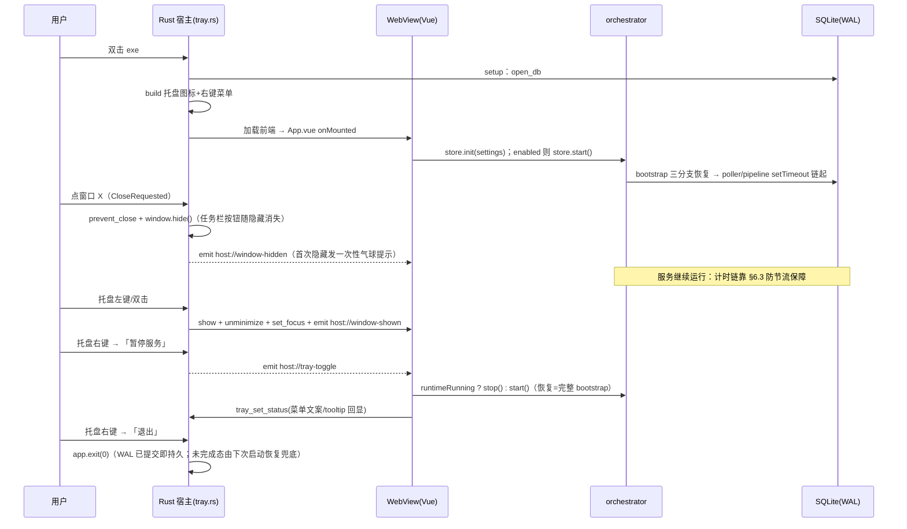

# 服务常驻（系统托盘驻留）设计 — 2026-10-10

> 状态：**已实施（2026-10-10，P0+P1+P2 全量交付）**。设计正文保留原稿；实施期对代码稿的
> 偏差与首验结论见 §15「实施核对记录」，以该节为最终事实。

## 1. 背景与目标

应用（Tauri 2 + Vue 3 单文件离线 exe）承载 WeLink 自动回复、知识沉淀、CodeHub 同步等**后台服务型**
编排逻辑（轮询 → SQLite → Agent → 安全外发）。当前形态下这些服务只在「窗口开着」时存活：
**点右上角 X = 进程退出 = 服务终止**，无法满足「内网机器上双击 exe 后长期无人值守驻留」的诉求。

需求（验收口径）：

1. 双击 exe 启动，服务驻留后台；
2. 关闭窗口右上角 X 只关闭界面，应用自动隐藏到 Windows 右下角（系统托盘）；
3. 托盘图标驻留期间服务不中断（轮询、管线、沉淀、CodeHub 同步照常运行）；
4. 左键（单击/双击）托盘图标恢复主界面；
5. 右键托盘弹出菜单，选择「退出」才真正结束服务与进程；
6. 保持既有硬约束：单文件离线 exe（静态 CRT、PE 导入表禁运 DLL）、打包不联网、
   运行时零外部请求、Rust 薄桥接零业务规则。

范围仅 Windows（应用本就仅支持 Windows）。

## 2. 现状盘点（实查证据）

| #   | 事实                                                                                                                                                                                                 | 出处                                                                                                               |
| --- | ---------------------------------------------------------------------------------------------------------------------------------------------------------------------------------------------------- | ------------------------------------------------------------------------------------------------------------------ |
| 1   | 全仓无 `on_window_event` / `WindowEvent` / `CloseRequested` / `prevent_close` / `RunEvent` / 托盘代码——点 X 走 Tauri v2 默认语义：**最后一个窗口关闭即退出进程**                                     | `src-tauri/src/lib.rs:79-117`（仅 setup 开库 + 25 命令注册）                                                       |
| 2   | `tauri` 依赖 `features = []`；**`tray-icon 0.24.2` 与 `muda` 已在 `Cargo.lock`**（3830 / 1924 行，tauri 2.11.6 的可选依赖），启用 feature 不新增 crate、版本已锁定                                   | `src-tauri/Cargo.toml:17`、`Cargo.lock:3288-3291`                                                                  |
| 3   | 无任何 `tauri-plugin-*` 依赖（单实例/自启若用插件属新增 crate，见 §7 评估）                                                                                                                          | `Cargo.lock`（grep `tauri-plugin` 为空）                                                                           |
| 4   | WeLink 轮询**只在进过一次助手页后启动**：`WeLinkView.onMounted → store.init → 若 enabled 则 store.start()`；之后靠 MainLayout 无 include 的 keep-alive + store 单例（`runtimeHolder`）存活，切页不断 | `src/views/WeLinkView.vue:186-197`、`src/stores/welink/index.ts:139,149-159`、`src/layouts/MainLayout.vue:160-166` |
| 5   | 调度是**「本轮完成（含失败）才排下一轮」的 setTimeout 链**，且计时源可注入（`TimerApi` 抽象）——这是隐藏态节流风险的对冲缝（§6.3）                                                                    | `src/orchestrator/poller.ts:286-293`、`src/orchestrator/timers.ts:9-22`                                            |
| 6   | 页面隐藏时轮询 ×3 降频（`document.visibilitychange` → `poller.setVisible`，`hiddenFactor=3`）                                                                                                        | `src/views/WeLinkView.vue:162-173`、`src/orchestrator/poller.ts:155-166,395-400`                                   |
| 7   | 数据持久化：SQLite 单连接 + WAL + `synchronous=NORMAL`；**无 close/checkpoint 通道，连接与进程同生命周期**                                                                                           | `src-tauri/src/db.rs:18-46`                                                                                        |
| 8   | 进程被杀后重启有完备恢复：bootstrap 三分支（sending 有回执补 sent / 无回执挂起；ready/pending 重入队；failed 不自动重投）；急停 `panicked` 跨重启强制降级 manual                                     | `src/orchestrator/bootstrap.ts:98-163`、`src/stores/welink/control.ts:120-128`                                     |
| 9   | Rust→前端**没有事件推送通道**（全仓零 `.emit`/`listen`），但权限层已就绪：`core:default` 含 `core:event:default`（listen/emit 放行）                                                                 | `src-tauri/capabilities/default.json:1-6`                                                                          |
| 10  | Bridge 契约注释明文扩展规约：「新增宿主能力先扩 types.ts，再双侧实现」；`tauri.ts` 是前端唯一 Tauri import 例外（`@tauri-apps/api/core`）                                                            | `src/api/types.ts:21-26`、`src/api/tauri.ts:1`                                                                     |
| 11  | 通知通道已有 Windows 原生实现（Shell_NotifyIconW 气球，fire-and-forget、临时消息窗口、10s 延迟清理）——首次入托盘提示可复用，但它是**私有函数**，跨模块需提为 `pub(crate)`                            | `src-tauri/src/shell.rs:242-332`                                                                                   |
| 12  | 窗口配置仅一个 `main` 窗（visible 未设=默认显示）；`bundle.active=false` 但 `bundle.icon` 含 `icons/icon.ico` + `32x32.png`（codegen 期嵌入，与是否打包无关）                                        | `src-tauri/tauri.conf.json:12-32`                                                                                  |
| 13  | 打包/验证对 src-tauri 改动的硬闸：PE 导入表禁运 `WebView2Loader/VCRUNTIME*/msvcp*/api-ms-win-crt-*`，两处交叉校验（构建脚本 + verify 阶段 7）                                                        | `scripts/build.mjs:208-273,258-259`、`scripts/verify.mjs:513-556`                                                  |
| 14  | **应用级服务装配已有同域先例**：CodeHub 在 `App.vue` 装配「迁移 → 装载 → 按配置起自动同步」，注释明确「周期轮询是后台职责，不该等用户走进检视页才开始」                                              | `src/App.vue:43-46`                                                                                                |
| 15  | 配置读取有「老配置缺字段 → 默认值合并」的 Partial 兜底惯例（`weLink`/`codeHub` 均如此）                                                                                                              | `src/types/index.ts:28-48`、`src/stores/app.ts:33-54`                                                              |
| 16  | `windows-sys 0.61` 已启用 `Win32_UI_Shell`、`Win32_UI_WindowsAndMessaging`、`Win32_System_Registry` 等 feature——开机自启（注册表 Run 项）**零新增依赖**                                              | `src-tauri/Cargo.toml:41-58`                                                                                       |

## 3. 总体方案

### 3.1 分层落位（对齐 AGENTS.md 架构边界）

| 关注点                                  | 落点                                                        | 边界依据                                                        |
| --------------------------------------- | ----------------------------------------------------------- | --------------------------------------------------------------- |
| 托盘图标/菜单、关窗拦截、窗口显隐、退出 | Rust 新增 `src-tauri/src/tray.rs`                           | 属既有「开窗口」职责（25 命令 = 开窗口+存储+通道），零业务规则  |
| 服务启停/暂停/恢复决策                  | TS：`src/stores/welink/host-link.ts`（新）+ `App.vue` 装配  | Rust 只把托盘动作翻译成 host 事件推给前端；**前端是唯一决策方** |
| 宿主→前端事件通道                       | `src/api/types.ts` Bridge 扩 `onHostEvent`，双侧实现        | 「先扩契约再双侧实现」规约（types.ts:25）                       |
| 关闭行为/状态显示配置                   | `AppSettings` + SettingsView「界面偏好」卡                  | 应用级配置归 `stores/app.ts`（config.json）                     |
| 开机自启                                | Rust 新增 `src-tauri/src/autostart.rs` 薄桥接命令 + UI 开关 | 注册表读写属宿主基础设施；同 windows-infra 永不-reject 结果语义 |

核心原则：**托盘只是「显示器 + 按钮」，所有语义（暂停什么、恢复什么、状态文案）都在 TS 编排层**。
Rust 侧仅新增 3 个薄桥接命令（`tray_set_status` / `tray_set_close_policy` / `autostart_get|set`），
25 命令清单扩到 28/29，不引入任何插件依赖（单实例见 §7 取舍）。

### 3.2 生命周期时序



### 3.3 状态机（驻留视角）

```
[未运行] --双击exe--> [窗口可见·服务运行]
[窗口可见·服务运行] --点X(policy=hide)--> [托盘驻留·服务运行]
[窗口可见·服务运行] --点X(policy=quit)--> [退出]
[托盘驻留·服务运行] --左键托盘--> [窗口可见·服务运行]
[托盘驻留·服务运行] --右键→暂停--> [托盘驻留·服务停止] --右键→恢复--> [托盘驻留·服务运行]
[任意驻留态] --右键→退出--> [退出]
```

## 4. 可实现性逐项论证

### 4.1 托盘图标 + 右键菜单（T-A/T-F）

**结论：可行，零新增 crate。** Tauri v2 内置 `tauri::tray::TrayIconBuilder` + `tauri::menu`，
由 `tauri` crate 的 `tray-icon` feature 门控；`Cargo.lock` 中 `tray-icon 0.24.2`、`muda`
（菜单实现库）已作为可选依赖锁定版本。Windows 下二者底层均为 `windows-sys` Shell API
（`Shell_NotifyIconW` + 隐藏 message-only 窗口），**静态链接进 exe、无运行期 DLL**，PE 导入表校验不受影响。

要点：

- `show_menu_on_left_click(false)`：Windows 默认左键也会弹菜单，关闭后左键/双击走
  `TrayIconEvent`（恢复窗口），右键由系统直接弹出 `Menu`——与需求「右键选退出」完全一致；
- 「退出」用 `app.exit(0)`，绕过 CloseRequested（退出意图明确，不再被拦截）；
- 图标复用 codegen 内嵌资源（§8.4），无外部文件、符合「运行时零外部请求」。

风险与对冲：muda 个别访问器命名（`items()`/`get_item_by_id()`）以编译期为准，代码稿给了
两种写法（§8.2 注释）；`bundle.active=false` 时 `default_window_icon()` 可用性列入首验项 V-1。

### 4.2 关窗拦截 → 隐藏到托盘（T-B）

**结论：可行，纯 Rust 事件处理。** `Builder::on_window_event` 匹配
`WindowEvent::CloseRequested { api, .. }` → `api.prevent_close()` + `window.hide()`。
`hide()` 走 ShowWindow(SW_HIDE)，任务栏按钮随窗口隐藏自然消失，无需 `skip_taskbar`。

Alt+F4、任务栏右键「关闭窗口」同样触发 CloseRequested，行为一致。最小化按钮不受影响
（仍是常规最小化，任务栏按钮保留）——「收进托盘」只有 X 一个入口，语义单一。

### 4.3 驻留期服务不中断（**可行性关键点**，T-G）

**结论：可行，但必须处置 WebView2 隐藏态定时器节流——这是本方案唯一的实质技术风险。**

风险机理：JS 编排层的轮询/pipeline/retention/沉淀全部依赖 setTimeout 链
（`poller.ts:286-293` 等 4 处同款）。窗口隐藏后，WebView2（Chromium 内核）经 DWM 原生遮挡计算
把页面判为不可见 → `document.visibilityState='hidden'` → 触发 Chromium 后台定时器节流：
普通节流 1s 粒度；**5 分钟后集约唤醒（Intensive Throttling）把计时器链对齐到 ≤1 次/分钟**，
长间隔轮询被拖慢、pipeline 的亚秒级 flush/retry 失准——即「驻留了但服务名存实亡」。

对策（按优先级）：

1. **首选：启动参数关闭原生遮挡计算**——`additionalBrowserArgs` 追加
   `--disable-features=…,CalculateNativeWinOcclusion`。禁用后隐藏窗口不再被判定 occluded，
   页面保持 `visible`，计时链全速；这是 Chromium/WebView2 宿主做托盘常驻的业界标准做法，
   且顺带修复最小化/遮挡时的渲染暂停（白屏回归项，见 §11 V-3）。
   **实测门禁**：uitest/冒烟阶段验证「隐藏 30 分钟后轮询日志间隔不劣化」（§10 验收 A-7）。
2. **兜底：计时源下移宿主**。若某机型/安全软件环境下降噪参数失效，`TimerApi` 注入抽象
   （`timers.ts:9-22`）就是为此预留的缝：桌面宿主新增 `tick` 事件泵（Rust `TimerTask`/独立线程
   按 `poller` 申报的毫秒数定时后 `emit('host://timer-tick', id)`），前端把 `options.timers`
   换成「setTimeout + 宿主 tick 取更短者」。IPC 消息到达不受定时器节流影响，可强制唤醒 JS 执行。
   **业务代码（poller/pipeline）零改动**——本期只登记为 B 计划，不进 P0。
3. 现有 ×3 降频（`poller.ts:157 hiddenFactor`）语义保留：对策 1 生效时页面恒 visible、
   降频不再触发（行为等价于「常驻服务按配置频率跑」）；对策 1 失效退回节流环境时，×3 是
   既有产品语义，不是 bug。

### 4.4 驻留期前端是否「活着」

**结论：活着，无需把业务搬进 Rust。** 不销毁窗口（`hide()` 而非 `close()/destroy()`），WebView2
进程模型不变：渲染进程、JS 堆、Pinia store、SQLite IPC 通道全部存续。反证：现状用户挂机
24h（窗口开着切到别的页面）与隐藏窗口在实现上等价——keep-alive 的 deactivated 页本就不渲染，
活跃页只是更新到不可见的画布。**「销毁窗口保驻留」方案被否决**：窗口销毁 = JS 上下文销毁 =
编排层（100% 在 TS）终止，违背 AGENTS「Rust 无业务规则」的既定分层。

### 4.5 退出与数据一致性（T-C）

**结论：`app.exit(0)` 直接终止即可，无需宽限期——安全前提在库里已经闭环。**

1. WAL + `synchronous=NORMAL`：已提交事务在掉电级故障下都不丢（`db.rs:30-36`）；无显式
   close/checkpoint 通道，但 `-wal` 残留由下次启动 SQLite 自动恢复；WAL 帧数超默认
   auto-checkpoint（1000 页 ≈ 4MB）后台自动回收，驻留再久 -wal 不无界增长。
2. 进程级中断态（唯一真实风险：退出瞬间恰有 `sending` 任务在 CLI 子进程里）正是
   bootstrap 三分支恢复的覆盖场景（`bootstrap.ts:98-130`：有 out 回执补 `sent`；无回执挂起，
   不盲目重发）。**今天的「点 X=退出」本来就提供不了比这更强的退出保证**（Tauri 默认路径
   同样是直接杀进程），所以托盘「退出」相对现状是纯增益，不引入新的丢数据面。
3. 可选增强（P2，不默认）：退出前 `emit('host://app-exiting')` + 2s 宽限 + `app_exit()` 命令回call，
   给「flush 内存态」留窗口；当前架构没有必须 flush 的内存态（配置 autoSave、业务全落库），
   故列为可选项而非必需。

### 4.6 单实例与二次双击唤回（T-D）

需求「双击 exe 启动」隐含：已驻留时再双击应唤回窗口而非起第二个进程。
**双重价值**：当前双击两次 = 两个进程 = **两套 orchestrator 并行轮询、并行外发**（safety-gate
配额分账各跑各的），单实例化顺手消掉这个现存滥发风险。

两个实现路线（§11 首验后择一）：

| 路线                  | 做法                                                                                                                                                                                                                                                                                              | 成本/风险                                                                                                       |
| --------------------- | ------------------------------------------------------------------------------------------------------------------------------------------------------------------------------------------------------------------------------------------------------------------------------------------------- | --------------------------------------------------------------------------------------------------------------- |
| A（推荐先试）         | `tauri-plugin-single-instance = "2"`（Windows 实现 = CreateMutexW + 消息唤回）                                                                                                                                                                                                                    | 新增 2 个 crate（插件本体 + `tauri-plugin` 宏支撑），均 windows-sys 静态实现、无 DLL；**内网 cargo 缓存需补源** |
| B（缓存受限时的自研） | `windows-sys`（feature 全具备）：启动早期 `CreateMutexW("Local\\com.taowd.hello-tauri")`，`ERROR_ALREADY_EXISTS` → 第二实例 `EnumWindows`+`GetWindowThreadProcessId` 定位首实例主窗 → `PostMessageW(WM_APP+1)` 后 `exit(0)`；首实例用 `Builder::on_message`（Windows 消息钩子）收到即 `show_main` | 零新增依赖；代价是 ~80 行自研 Win32 代码 + 窗口枚举脆弱性（需按 exe 路径过滤同名窗口）                          |

### 4.7 权限与能力面

`capabilities/default.json` **不需要改动**：托盘与窗口显隐全部发生在 Rust（不走 JS ACL）；
前端只 `listen` 事件（`core:default` 已含 `core:event:default`）。不新增任何
`core:window:allow-*`——前端不调窗口变更 API（避免把破坏性能力放进 JS 面）。

## 5. 设计决策表（T-A ~ T-N）

| #   | 决策                                                                                                                                                                 | 理由/代价                                                                                                 |
| --- | -------------------------------------------------------------------------------------------------------------------------------------------------------------------- | --------------------------------------------------------------------------------------------------------- |
| T-A | 点 X = 直接隐藏入托盘，不弹询问框；**首次**入托盘发一次性气球提示（复用 `shell::notify_blocking`）                                                                   | 需求原文即「自动隐藏」；气球文案见 §8.1                                                                   |
| T-B | 关闭行为可配置：`AppSettings.closeBehavior: 'tray'\|'quit'`（缺省 `tray`），前端启动时经 `tray_set_close_policy` 下发给 Rust（Rust 内存 AtomicU8，不读配置文件）     | Rust 保持零业务规则；老配置缺字段按 Partial 合并惯例天然兜底（§2-15）                                     |
| T-C | 托盘「退出」= `app.exit(0)` 直接终止；数据一致性由 WAL + bootstrap 恢复兜底，不实现宽限期                                                                            | §4.5；退出语义与现状（关窗即杀进程）等价，无回退                                                          |
| T-D | 单实例：路线 A 插件优先，内网缓存不可得则路线 B 自研；二次双击 = 唤回并聚焦主窗                                                                                      | §4.6                                                                                                      |
| T-E | 托盘图标用内嵌资源：`default_window_icon()` 优先，`include_image!("icons/32x32.png")` 兜底；不建独立托盘图标文件                                                     | 零外部文件；V-1 首验                                                                                      |
| T-F | 右键菜单三项：`打开主界面 / 暂停服务·恢复服务（动态文案）/ 退出`；左键单击与双击均恢复窗口                                                                           | 「暂停/恢复」让服务管理不必开窗口；文案由前端经 `tray_set_status` 回写（单一真值在 store.status）         |
| T-G | 隐藏态防节流：首选 `additionalBrowserArgs` 禁 `CalculateNativeWinOcclusion`；B 计划宿主 tick 泵（走 `TimerApi` 注入缝）；×3 降频语义保留                             | §4.3，本方案最大技术点                                                                                    |
| T-H | Rust→前端事件为**固定白名单** 3 个：`host://window-hidden` / `host://window-shown` / `host://tray-toggle`；Bridge 扩 `onHostEvent(name, handler)`                    | 不建通用事件总线，杜绝事件名漂移；web.ts 侧恒 no-op（浏览器开发模式零影响）                               |
| T-I | 开机自启：注册表 HKCU Run 薄桥接（`autostart_get/set` 命令，windows-sys feature 已具备）+ 配置页开关，**默认关**；自启带 `--minimized` 静默入托盘                    | 真值在注册表、不入 config.json（避免双真值漂移）；`visible:true` 配置下静默启动有一帧闪现，记为已知小代价 |
| T-J | 服务生命周期解耦：`store.init + enabled→start` 上移至 `App.vue`（照抄 CodeHub `void codehubStore.init()` 先例）；WeLinkView 不再负责启停，只做只读刷新与页面效应绑定 | 「常驻」的前提是进过页面才有的进程级启动；panicRecovered 回写语义随迁（§9.3）                             |
| T-K | 状态回显单一真值：host-link 内 `watch(store.status)` → `tray_set_status`；覆盖 UI 启停/急停/熔断全部路径                                                             | 避免 Rust 猜测服务状态                                                                                    |
| T-L | UI 层不直触 `@/infra/**`/`@/repositories/**`：托盘/自启操作全部经 Bridge（`src/api`），配置动作收进 `stores/app.ts`                                                  | AGENTS ESLint 闸门既有约束                                                                                |
| T-M | 浏览器开发模式（`npm run dev`）完整不受影响：无托盘、事件 no-op、自启不可用诚实返回 `ok:false`                                                                       | web.ts 双侧契约一致                                                                                       |
| T-N | 分期：P0 驻留核心（可单独发版）→ P1 服务正确性 → P2 体验增强；每期过 `npm run check` + （涉 Rust）`npm run pack` PE 校验                                             | §10                                                                                                       |

## 6. 性能分析（审视点一）

### 6.1 驻留态 CPU / 内存

- **CPU 增量 ≈ 0（相对"开着窗口挂机"）**：托盘不新增任何计时器；驻留期跑的正是今天
  切页/挂机时已经在跑的那套 setTimeout 链（间隔 ≥ `pollIntervalSec`，含退避与 stagger 预算，
  `poller.ts:155-166,226-228`）。新增的只有消息驱动的托盘窗口过程（仅点击时执行）。
- **内存相对现状净增一份常驻进程**：WebView2 渲染面 + Rust 宿主 + SQLite 连接，典型
  150–300MB。这是「驻留服务」的本质成本，不是实现损耗；且对比基准（关窗=退出）省下的
  是「下次启动 1-3s + 首轮全量 cursor 对齐」的代价。若现场有内存硬指标，唯一减项是
  P2 的「驻留期停渲染」实验项：隐藏时经 `host://window-hidden` 暂停活跃视图的动画/大列表
  重排——**只关渲染侧、不关数据侧**，功能不丢（见 §7.1 审视点二）。
- **启动开销**：`TrayIconBuilder::build` + 3 个菜单项 ≈ 毫秒级；气球通知仅首次 X 一次、
  异步分离线程清理（`shell.rs:314-324`），不进热路径。

### 6.2 事件通道开销

3 个白名单事件全部**用户动作/状态迁移驱动**（关窗、显窗、托盘点击），零轮询、零心跳；
前端 `watch(store.status)` 是既有响应面顺带触发。无 IPC 风暴风险。

### 6.3 计时精度（驻留期服务质量的核心指标）

§4.3 已论证：对策 1 生效后计时链精度与窗口可见时一致（±1s 常规粒度）；若实测精度仍劣化，
B 计划把精度锚定在宿主线程定时器上（±毫秒级唤醒，经 IPC 转 JS）。**验收以「隐藏态轮询
间隔实测偏差 ≤ 配置值 + 10%」为量化门禁**（A-7），不接受「看起来还活着」式通过。

### 6.4 SQLite 与 I/O

无新增查询模式；WAL 长连接 + auto-checkpoint 语义见 §4.5-1。日志落盘（append_log）频率不变。

### 6.5 托盘图标渲染

单帧 RGBA 32×32 内嵌位图 + 系统 DPI 缩放，无 GDI 轮询。

## 7. 功能不丢失分析（审视点二）

### 7.1 逐项对照表

| 现有能力                                   | 驻留后状态                                                            | 依据                          |
| ------------------------------------------ | --------------------------------------------------------------------- | ----------------------------- |
| 轮询拉取 welink-cli                        | ✅ 不丢，且频率不再被 ×3 隐性劣化（T-G 对策 1）                       | §4.3                          |
| Agent 生成 + 安全闸（开关/配额/静默/熔断） | ✅ 全在 JS setTimeout 链，驻留期照常；闸状态落库跨重启                | `orchestrator/safety-gate.ts` |
| 回复外发铁律（ready 才外发）               | ✅ 管线未动一行                                                       | AGENTS 铁律                   |
| 知识沉淀/公告采集                          | ✅ harvester 同款计时链（`knowledge-harvester.ts:490`）               | §4.3                          |
| CodeHub 同步 + 详情补拉                    | ✅ 本就是应用级启动（`App.vue:43-46`），驻留无损                      | §2-14                         |
| retention 清理 / 日志 30 天                | ✅ 每日定时器同链                                                     | `runtime.ts:258-277`          |
| 急停 `panicked` 跨重启降级 manual          | ✅ 语义不动；菜单「恢复服务」经 start()→bootstrap，仍尊重 settings    | `control.ts:120-128`          |
| 窗口内 UI 全部交互（10 页/建群/检视）      | ✅ `show()` 原样恢复，keep-alive 状态完整（隐藏≠销毁）                | §4.4                          |
| 配置 autoSave 落盘                         | ✅ 前端存续即照常 watch                                               | `stores/app.ts:74-83`         |
| 多开并行（今天事实存在）                   | ⚠️ **有意去除**（单实例 T-D）：消除双实例并行外发风险，属修复不属丢失 | §4.6                          |
| 点 X = 退出                                | ⚠️ **有意变更**（T-A/T-B）：`closeBehavior:'quit'` 可回旧行为         | §5                            |
| 浏览器 dev 模式（web.ts）                  | ✅ no-op 适配，`npm run dev` 全量页面照常                             | T-M                           |

### 7.2 隐藏态的「不可见功能」审查

- **visibilitychange 链路**：`WeLinkView.bindPageEffects` 的监听在对策 1 下不再触发 hidden 分支
  ——即 ×3 降频不再发生。这是行为变化但方向是「服务更尽力」，符合常驻诉求；
  同时 `subscribeWelinkLogs` 日志旁路绑定/解绑与可见性无关（按 activated/deactivated），不受影响。
- **ElMessage/弹窗**：隐藏期间若有 UI 弹出（如 bootstrap 告警）用户看不到，恢复窗口时消息已过期。
  处置：host-link 把「需要用户知晓」的降级事件（panicRecovered 等）同时写 `logger`（落盘）+
  store banner 持久态，回到界面以 banner 呈现而非一次性 toast——视图既有此模式（`fuseBanner` 先例）。
- **剪贴板/通知等 Shell 交互**：均为请求驱动，驻留期无请求方，无影响。

## 8. 核心代码开发稿（Rust 侧）

> 以下为设计稿全文；路径、模块名、命令名即实施期终稿。muda/tray 访问器命名以编译期为准，
> 差异处已在注释标注两种写法。

### 8.1 `src-tauri/src/tray.rs`（新增，P0 核心）

```rust
//! 系统托盘驻留（docs/design-service-residency-2026-10-10.md）。
//!
//! 边界（T-L/T-N）：只做「建托盘 + 拦关窗 + 显隐窗 + 状态显示」，零业务规则。
//! 托盘动作 → host 事件推给前端，由 `src/stores/welink/host-link.ts` 决策；
//! 菜单文案/tooltip ← 前端经 `tray_set_status` 回写（单一真值在 store.status，T-K）。

use std::sync::atomic::{AtomicBool, AtomicU8, Ordering};

use tauri::menu::{Menu, MenuId, MenuItem, MenuItemKind, PredefinedMenuItem};
use tauri::tray::{MouseButton, MouseButtonState, TrayIconBuilder, TrayIconEvent};
use tauri::{AppHandle, Emitter, Manager, Runtime, WindowEvent};

use crate::shell;

/// 托盘 id / 主窗 label（与 tauri.conf.json windows[0].label 一致）
pub const TRAY_ID: &str = "main-tray";
pub const MAIN_WINDOW: &str = "main";

/// 菜单项 id（`tray_set_status` 按此定位「暂停/恢复」项）
pub const MENU_OPEN: &str = "tray-open";
pub const MENU_PAUSE: &str = "tray-pause";
pub const MENU_QUIT: &str = "tray-quit";

/// Rust → 前端 host 事件白名单（与 `src/api/types.ts` 的 `HostEventName` 一一对应，T-H）
pub const EV_WINDOW_HIDDEN: &str = "host://window-hidden";
pub const EV_WINDOW_SHOWN: &str = "host://window-shown";
pub const EV_TRAY_TOGGLE: &str = "host://tray-toggle";

/// 关闭策略（T-B）：0 = 隐藏入托盘（默认），1 = 直接退出。真值在前端配置，启动时下发。
const POLICY_HIDE: u8 = 0;
const POLICY_QUIT: u8 = 1;
static CLOSE_POLICY: AtomicU8 = AtomicU8::new(POLICY_HIDE);

/// 首次入托盘的气球提示只发一次（进程生命周期）
static FIRST_HIDE_DONE: AtomicBool = AtomicBool::new(false);

/// 创建托盘。在 setup 里调用：建不出来即启动失败（宁可早暴露，不做静默降级——
/// 「驻留能力」是本次交付的主体，不允许出现「看起来启动了但其实没托盘」态）。
pub fn build<R: Runtime>(app: &AppHandle<R>) -> tauri::Result<()> {
    let open = MenuItem::with_id(app, MENU_OPEN, "打开主界面", true, None::<&str>)?;
    let pause = MenuItem::with_id(app, MENU_PAUSE, "暂停服务", true, None::<&str>)?;
    let quit = MenuItem::with_id(app, MENU_QUIT, "退出", true, None::<&str>)?;
    let sep_a = PredefinedMenuItem::separator(app)?;
    let sep_b = PredefinedMenuItem::separator(app)?;
    let menu = Menu::with_items(app, &[&open, &sep_a, &pause, &sep_b, &quit])?;

    // T-E：图标零外部文件。优先默认窗图标（codegen 自 bundle.icon 嵌入）；
    // bundle.active=false 下可用性是首验项 V-1，取不到则 include_image 编译期嵌入兜底。
    let icon = match app.default_window_icon() {
        Some(image) => image.clone(),
        None => tauri::include_image!("icons/32x32.png"),
    };

    TrayIconBuilder::with_id(TRAY_ID)
        .icon(icon)
        .tooltip("Hello-Tauri · 服务运行中")
        .menu(&menu)
        // Windows 默认左键也会弹菜单，关掉才能把「左键=唤回窗口」让给 TrayIconEvent（T-F）
        .show_menu_on_left_click(false)
        .on_menu_event(|app, event| match event.id().as_ref() {
            MENU_OPEN => show_main(app),
            MENU_PAUSE => {
                // Rust 不判断「该暂停还是恢复」——动作语义全在前端（T-L）
                let _ = app.emit(EV_TRAY_TOGGLE, ());
            }
            MENU_QUIT => {
                // T-C：直接终止。WAL 已提交即持久；sending 中断态由
                // orchestrator/bootstrap 三分支恢复兜底（设计 §4.5）。
                app.exit(0);
            }
            _ => {}
        })
        .on_tray_icon_event(|tray, event| {
            // 左键单击抬起/双击 → 唤回窗口；右键交给系统弹 Menu，此处不处理
            let left_activate = matches!(
                event,
                TrayIconEvent::Click {
                    button: MouseButton::Left,
                    button_state: MouseButtonState::Up,
                    ..
                } | TrayIconEvent::DoubleClick {
                    button: MouseButton::Left,
                    ..
                }
            );
            if left_activate {
                show_main(tray.app_handle());
            }
        })
        .build(app)?;
    Ok(())
}

/// 恢复并聚焦主窗口。托盘左键、菜单「打开主界面」、单实例二次启动唤回，三路共用。
pub fn show_main<R: Runtime>(app: &AppHandle<R>) {
    let Some(window) = app.get_webview_window(MAIN_WINDOW) else {
        return;
    };
    let _ = window.unminimize();
    let _ = window.show();
    let _ = window.set_focus();
    let _ = app.emit(EV_WINDOW_SHOWN, ());
}

/// 主窗口事件闸口（挂 `Builder::on_window_event`）：
/// X / Alt+F4 / 任务栏关闭 → 按策略拦截隐藏（默认）或放行退出。
pub fn on_window_event(window: &tauri::Window, event: &WindowEvent) {
    let WindowEvent::CloseRequested { api, .. } = event else {
        return;
    };
    if CLOSE_POLICY.load(Ordering::Relaxed) == POLICY_QUIT {
        return; // 不拦截：走 Tauri 默认「最后窗口关闭即退出」，等价旧行为（T-B）
    }
    api.prevent_close();
    if window.hide().is_err() {
        return; // 隐藏失败也不退出：宁可窗口异常，不可静默杀服务
    }
    let _ = window.emit(EV_WINDOW_HIDDEN, ());
    // T-A：首次入托盘一次性指引（复用 Shell_NotifyIcon 气球通道；内部自带 10s 延迟清理，
    // 调用即返回不阻塞事件循环）。需把 shell.rs 的 notify_blocking 提为 pub(crate)。
    if !FIRST_HIDE_DONE.swap(true, Ordering::Relaxed) {
        let _ = shell::notify_blocking(
            "已收进系统托盘",
            "服务继续运行。左键托盘图标恢复界面；右键托盘图标可退出程序。",
        );
    }
}

/// `tray_set_close_policy`：前端把 config.json 的 closeBehavior 翻译成策略字节下发（T-B）。
#[tauri::command]
pub fn tray_set_close_policy(policy: String) -> Result<(), String> {
    match policy.as_str() {
        "tray" => CLOSE_POLICY.store(POLICY_HIDE, Ordering::Relaxed),
        "quit" => CLOSE_POLICY.store(POLICY_QUIT, Ordering::Relaxed),
        other => return Err(format!("未知关闭策略：{other}")),
    }
    Ok(())
}

/// `tray_set_status`（T-K/T-F）：前端回写服务状态 → 菜单动态文案 + tooltip。
/// 只读改显示，不改行为；托盘未就绪（构建失败等异常态）返回 Err 由前端折叠为结果对象。
#[tauri::command]
pub fn tray_set_status(app: AppHandle, running: bool, status_text: String) -> Result<(), String> {
    let Some(tray) = app.tray_by_id(TRAY_ID) else {
        return Err("托盘未就绪".into());
    };
    // 定位「暂停/恢复」项。两种写法按 muda 版本择一：
    //   写法甲：menu.get_item_by_id(&MenuId::from(MENU_PAUSE))
    //   写法乙：遍历 items() 比对 id（下方采用，API 面更稳定）
    if let Some(menu) = tray.menu() {
        if let Ok(items) = menu.items() {
            for kind in items {
                if let MenuItemKind::Normal(item) = kind {
                    if item.id() == &MenuId::from(MENU_PAUSE) {
                        let _ = item.set_text(if running { "暂停服务" } else { "恢复服务" });
                    }
                }
            }
        }
    }
    let _ = tray.set_tooltip(Some(format!("Hello-Tauri · {status_text}")));
    Ok(())
}
```

### 8.2 `src-tauri/src/lib.rs`（集成 diff，P0 + P2 自启参数）

```diff
 mod cli;
 mod commands;
 mod db;
 mod fs;
 mod http;
 mod logging;
+mod autostart;
 mod shell;
 mod storage;
+mod tray;

 #[cfg_attr(mobile, tauri::mobile_entry_point)]
 pub fn run() {
     configure_webview_profile();

+    // T-I：开机自启走 --minimized 静默入托盘（Run 项由 autostart_set 写入）
+    let start_minimized = std::env::args().any(|arg| arg == "--minimized");
+
+    let mut builder = tauri::Builder::default()
+        // T-D 路线 A：单实例（路线 B 见 §9.5，二者互斥启用）
+        .plugin(tauri_plugin_single_instance::init(|app, _argv, _cwd| {
+            tray::show_main(app); // 二次双击 = 唤回
+        }))
         .setup(|app| {
             let handle = app.handle().clone();
             let database = db::open_db(&handle)?;
             app.manage(database);
+            // 托盘必须在 setup 建好：早于任何一次用户关窗，拦截语义才完整
+            tray::build(&handle)?;
+            if start_minimized {
+                if let Some(window) = app.get_webview_window(tray::MAIN_WINDOW) {
+                    let _ = window.hide(); // 已知小代价：一帧闪现（config visible:true）
+                }
+            }
             Ok(())
         })
+        // T-A/T-B：关窗拦截（X / Alt+F4 / 任务栏关闭统一走这里）
+        .on_window_event(tray::on_window_event)
         .invoke_handler(tauri::generate_handler![
             ……（原 25 命令不动）……
-            shell::notify_send
+            shell::notify_send,
+            // —— 托盘驻留通道（service-residency：显示回写 + 策略下发）——
+            tray::tray_set_status,
+            tray::tray_set_close_policy,
+            autostart::autostart_get,
+            autostart::autostart_set
         ])
         .run(tauri::generate_context!())
         .expect("启动 Hello-Tauri 失败");
 }
```

> 注：`panic = "abort"`（Cargo.toml:64）下事件回调 panic = 全进程崩。tray.rs 回调内
> **不使用 unwrap**，可失败点全部 `let _ =` 吞掉——显示劣化可容忍，服务崩溃不可容忍。

### 8.3 `src-tauri/Cargo.toml`（diff）

```diff
 [dependencies]
-tauri = { version = "2", features = [] }
+# service-residency T-A~T-N：tray-icon feature 开启内置托盘（tray-icon/muda 已在
+# Cargo.lock 锁定 0.24.2/对应版本，不新增 crate、Windows 下纯 windows-sys 静态实现）
+tauri = { version = "2", features = ["tray-icon"] }
+# T-D 路线 A（缓存不可得则删除此行走自研路线 B）：单实例唤回
+tauri-plugin-single-instance = "2"
```

`shell.rs` 一处提权：`fn notify_blocking` → `pub(crate) fn notify_blocking`（§8.1 复用；
`not(windows)` 桩已存在，`shell.rs:329-332`，不新增条件编译面）。

### 8.4 `src-tauri/tauri.conf.json`（diff，T-G 防节流）

```diff
     "windows": [
       {
         "label": "main",
         "title": "Hello-Tauri",
         "width": 1180,
         "height": 760,
         "minWidth": 900,
         "minHeight": 600,
         "center": true,
-        "resizable": true
+        "resizable": true,
+        "additionalBrowserArgs": "--disable-features=msWebOOUI,msPdfOOUI,msSmartScreenProtection,CalculateNativeWinOcclusion"
       }
     ],
```

> **为什么把默认三项写全**：v2 文档口径是该键会**整体替换**上游默认值
> （默认恰为 msWebOOUI/msPdfOOUI/msSmartScreenProtection 三项禁用），全量书写 = 「替换语义」
> 与「追加语义」下结果一致，规避 V-2 首验不确定性——这是防御性写法，不是想当然。

### 8.5 `src-tauri/src/autostart.rs`（新增，T-I，P2）

```rust
//! 开机自启：HKCU Run 注册表薄桥接（不引 tauri-plugin-autostart —— 后者会拉入
//! 插件 API 面与启动参数处理，自研 40 行即可，且 windows-sys 的 Registry feature
//! 早已启用（Cargo.toml:45），零新增依赖）。

#[cfg(windows)]
use windows_sys::Win32::Foundation::{ERROR_FILE_NOT_FOUND, ERROR_SUCCESS};
#[cfg(windows)]
use windows_sys::Win32::System::Registry::{
    RegCloseKey, RegDeleteKeyValueW, RegOpenKeyExW, RegQueryValueExW, RegSetValueExW, HKEY,
    HKEY_CURRENT_USER, KEY_QUERY_VALUE, KEY_SET_VALUE, REG_SZ,
};

const RUN_KEY: &str = r"Software\Microsoft\Windows\CurrentVersion\Run";
const VALUE_NAME: &str = "Hello-Tauri";

/// UTF-16 零结尾转换（同 shell.rs 私有 helper 的做法；两处共享后续可下沉公共模块，不强制）
fn to_wide(text: &str) -> Vec<u16> {
    text.encode_utf16().chain(std::iter::once(0)).collect()
}

/// `autostart_get`：Run 项存在且命令串包含当前 exe 路径才视为开启
/// （用户搬移 exe 后旧路径自然判 false，不残留假开关）。
#[tauri::command]
pub fn autostart_get() -> Result<bool, String> {
    #[cfg(not(windows))]
    {
        Err("当前平台不支持开机自启".into())
    }
    #[cfg(windows)]
    unsafe {
        let key = to_wide(RUN_KEY);
        let value = to_wide(VALUE_NAME);
        let mut kind = 0u32;
        let mut buffer = vec![0u16; 1024];
        let mut size_bytes = (buffer.len() * 2) as u32;
        let status = RegQueryValueExW(
            HKEY_CURRENT_USER,
            key.as_ptr(),
            std::ptr::null(),
            &mut kind,
            buffer.as_mut_ptr() as *mut u8,
            &mut size_bytes,
        );
        if status == ERROR_FILE_NOT_FOUND {
            return Ok(false); // 「没有该项」是明确的关闭态，不是失败
        }
        if status != ERROR_SUCCESS {
            return Err(format!("注册表读取失败（os error {status}）"));
        }
        let stored = String::from_utf16_lossy(&buffer[..(size_bytes as usize / 2).saturating_sub(1)]);
        let exe = std::env::current_exe().map_err(|e| e.to_string())?;
        Ok(kind == REG_SZ && stored.contains(&exe.to_string_lossy().to_string()))
    }
}

/// `autostart_set`：写入/删除 Run 项。写入值带 `--minimized`（自启即静默入托盘）。
#[tauri::command]
pub fn autostart_set(enabled: bool) -> Result<bool, String> {
    #[cfg(not(windows))]
    {
        let _ = enabled;
        Err("当前平台不支持开机自启".into())
    }
    #[cfg(windows)]
    unsafe {
        let key = to_wide(RUN_KEY);
        let value = to_wide(VALUE_NAME);
        let code = if enabled {
            let exe = std::env::current_exe().map_err(|e| e.to_string())?;
            let command = to_wide(&format!("\"{}\" --minimized", exe.display()));
            let mut hkey: HKEY = std::ptr::null_mut();
            if RegOpenKeyExW(HKEY_CURRENT_USER, key.as_ptr(), 0, KEY_SET_VALUE, &mut hkey)
                != ERROR_SUCCESS
            {
                return Err("打开 Run 注册表项失败".into());
            }
            let code = RegSetValueExW(
                hkey,
                value.as_ptr(),
                0,
                REG_SZ,
                command.as_ptr() as *const u8,
                (command.len() * 2) as u32,
            );
            RegCloseKey(hkey);
            code
        } else {
            // 值不存在按成功处理：语义目标是「自启不存在」
            RegDeleteKeyValueW(HKEY_CURRENT_USER, key.as_ptr(), value.as_ptr())
        };
        if code == ERROR_SUCCESS || (!enabled && code == ERROR_FILE_NOT_FOUND) {
            Ok(enabled)
        } else {
            Err(format!("注册表写入失败（os error {code}）"))
        }
    }
}
```

## 9. 核心代码开发稿（TS 侧）

### 9.1 `src/api/types.ts`（Bridge 契约扩展）

```diff
 export type Platform = 'tauri' | 'web'

+/**
+ * 宿主 → 前端事件白名单（T-H）。Rust 侧常量见 `src-tauri/src/tray.rs`，
+ * 两侧名单必须逐字一致；新增事件名 = 同时改两份常量表 + web 侧 no-op。
+ */
+export type HostEventName = 'host://window-hidden' | 'host://window-shown' | 'host://tray-toggle'
+
+/** 关窗行为（T-B，config.json `AppSettings.closeBehavior`；老配置缺省 = 'tray'） */
+export type CloseBehavior = 'tray' | 'quit'
+
 export interface Bridge {
   readonly platform: Platform
   ……（现有成员不动）……
   notifySend(title: string, body: string): Promise<BasicOutcome>
+
+  // —— 服务常驻通道（service-residency）——
+  // 结果语义与 Windows 基础设施层一致（永不 reject，失败折叠进结果对象）。
+
+  /** 订阅宿主事件；返回退订函数。浏览器侧恒 no-op（永不 reject） */
+  onHostEvent(name: HostEventName, handler: () => void): Promise<() => void>
+  /** 服务状态回写托盘（菜单动态文案 + tooltip） */
+  traySetStatus(running: boolean, statusText: string): Promise<BasicOutcome>
+  /** 关窗策略下发：前端是唯一读 config 的人，Rust 不碰配置文件（T-B/T-L） */
+  traySetClosePolicy(policy: CloseBehavior): Promise<BasicOutcome>
+  /** 开机自启：真值在注册表、不入 config.json（T-I，避免双真值漂移） */
+  autostartGet(): Promise<ProbeResult<boolean>>
+  autostartSet(enabled: boolean): Promise<ProbeResult<boolean>>
 }
```

### 9.2 `src/api/tauri.ts` / `src/api/web.ts`（双侧实现）

```ts
// tauri.ts —— 新增 import（该文件是唯一 Tauri import 例外，边界不破）
import { invoke } from '@tauri-apps/api/core'
import { listen } from '@tauri-apps/api/event' // service-residency：宿主事件通道

// tauriBridge 内新增（复用既有 act()/probe() 永不-reject 折叠，tauri.ts:27-42）：
  onHostEvent(name, handler) {
    // listen 的 Promise reject 只发生在注册通道故障；用 act 语义兜住后返回同步退订
    return listen(name, () => handler())
      .then((unlisten) => () => void unlisten())
      .catch(() => () => {})
  },
  traySetStatus: (running, statusText) => act(() => invoke('tray_set_status', { running, statusText })),
  traySetClosePolicy: (policy) => act(() => invoke('tray_set_close_policy', { policy })),
  autostartGet: () => probe(() => invoke<boolean>('autostart_get')),
  autostartSet: (enabled) => probe(() => invoke<boolean>('autostart_set', { enabled })),

// web.ts（浏览器模式，T-M）：
  onHostEvent: () => Promise.resolve(() => {}), // 无托盘无窗口语义
  traySetStatus: () => Promise.resolve({ ok: true }), // 无副作用的诚实 no-op
  traySetClosePolicy: (policy) => { pendingCloseBehavior = policy; return Promise.resolve({ ok: true }) },
  // 浏览器无宿主可拦窗：只把策略记进内存（开发调试可观察），不假装能拦截
  autostartGet: () => Promise.resolve({ ok: false, reason: '浏览器模式不支持开机自启' }),
  autostartSet: () => Promise.resolve({ ok: false, reason: '浏览器模式不支持开机自启' }),
```

### 9.3 `src/stores/welink/host-link.ts`（新增，T-J/K/L 联动层）

```ts
/**
 * 宿主联动层（service-residency §3.1）：托盘事件 ↔ 服务生命周期 ↔ 托盘状态显示。
 * 组合点放 store 层（AGENTS D2 装配例外口径）；启停动作仍是 control 的既有方法，
 * 业务规则继续留 orchestrator —— 本层只做翻译与回显，零新语义。
 */
import { bridge } from '@/api'
import type { RuntimeStatus } from './aggregate'
import type { useWelinkStore } from './index'

type WelinkStore = ReturnType<typeof useWelinkStore>

// 前置改动一行：`src/stores/welink/index.ts` 的返回对象（320-329 行区）现仅导出
// init/start/stop/setPageVisible，需补 `runtimeRunning: control.runtimeRunning`
// ——RuntimeControl 接口本就有此方法（control.ts:53），只是没接线。

/** 状态灯 → tooltip 文案（T-K：单一真值 store.status） */
const STATUS_TEXT: Record<RuntimeStatus, string> = {
  init: '初始化中',
  running: '服务运行中',
  backoff: '退避重试中',
  stopped: '服务已停止',
  panic: '急停（人工确认模式）',
}

export function bindHostLink(store: WelinkStore): () => void {
  const unsubs: Array<() => void> = []
  let disposed = false

  // ① 状态回显：任何路径的状态迁移（UI 启停/托盘暂停/急停/熔断恢复）都同步到托盘
  unsubs.push(
    watch(
      () => store.status,
      (status) => void bridge.traySetStatus(store.runtimeRunning(), STATUS_TEXT[status] ?? 'Hello-Tauri'),
      { immediate: true },
    ),
  )

  // ② 托盘「暂停服务/恢复服务」：一个按钮两种语义，判据只有 runtimeRunning()。
  //    恢复 = store.start()：走完整 bootstrap 三分支恢复（挂起态复核、cursor 增量），
  //    不是「裸续跑」——语义与助手页手动重启严格一致（settings.enabled=false 时
  //    start() 内部不拉起 poller，与页面行为一致）。
  void bridge
    .onHostEvent('host://tray-toggle', () => {
      if (store.runtimeRunning()) {
        store.stop() // 停生产再停消费的内部顺序由 runtime.stop 保证（runtime.ts:268-277）
      } else {
        void store.start()
      }
    })
    .then((u) => (disposed ? u() : unsubs.push(u)))

  // ③ 窗口唤回兜底：视口可见性上报链路只在 WeLink 页激活时绑定（bindPageEffects），
  //    驻留期从别的页面唤回时 document.visibilityState 可能仍是缓存的 hidden —— 以宿主
  //    事件为准强制复位，避免恢复后仍按 ×3 降频跑（poller.ts:395-400 幂等，重复设置无害）。
  void bridge
    .onHostEvent('host://window-shown', () => store.setPageVisible(true))
    .then((u) => (disposed ? u() : unsubs.push(u)))

  return () => {
    disposed = true
    for (const u of unsubs) u()
    unsubs.length = 0
  }
}
```

### 9.4 `src/App.vue`（服务应用级装配 + 策略下发，T-J）

```ts
// import 区新增：
import { bridge } from '@/api'
import { useWelinkStore } from '@/stores/welink'
import { bindHostLink } from '@/stores/welink/host-link'
import { logger } from '@/utils/logger'

// setup 内新增（ElMessage / watch 由 unplugin-auto-import 注入，勿手写 import）：
const welinkStore = useWelinkStore()

onMounted(async () => {
  await appStore.load()
  await tableStore.load()
  // ……（pageSize 注入 / defaultRoute / codehubStore.init 原样不动）……

  // —— 服务常驻装配（service-residency T-J；口径与上方 CodeHub 注释一致：
  //    「周期轮询是后台职责，不该等用户走进页面才开始」）——
  // 策略先行下发：即便 init 慢，用户立刻点 X 也已受隐藏语义保护（Rust 默认值即 hide）
  void bridge.traySetClosePolicy(appStore.settings.closeBehavior ?? 'tray')

  // 不 await：迁移/装载不拖首屏；WeLinkView 被删掉的那段启动决策整体搬到这里。
  void welinkStore
    .init(appStore.settings.weLink)
    .then(({ panicRecovered }) => {
      if (panicRecovered) {
        // 急停降级回写持久层 + 告知（原视图职责，语义不变，T-J）：
        // 驻留期用户可能不在界面上，toast 之外必须同时落盘日志（§7.2 banner/日志口径）
        appStore.settings.weLink = { ...welinkStore.settings, sendMode: 'manual', panicked: false }
        ElMessage.error('上次会话以「一键全停」结束：已降为人工确认模式，未自动恢复外发')
      }
      if (welinkStore.settings.enabled) return welinkStore.start()
    })
    .catch((error) => logger.error('WeLink 服务装配失败', error))

  // 退订函数有意丢弃：联动层与应用同生命周期（onUnmounted 全应用仅退出时触发）
  bindHostLink(welinkStore)
})
```

`src/views/WeLinkView.vue` 对应简化（原 `onMounted` 186-197 行段）：

```ts
onMounted(async () => {
  // T-J 后本视图不再负责服务启停（App.vue 应用级装配）。
  // init 收敛为幂等只读装载（见 9.5）：已装配过就只刷新列表与快照，绝不重复 start。
  await store.init(appStore.settings.weLink)
  bindPageEffects()
})
```

### 9.5 `src/stores/welink/control.ts`（init 幂等化，配合 T-J）

```diff
   async function init(next?: Partial<WelinkSettings>): Promise<{ panicRecovered: boolean }> {
+    // 应用级装配（T-J）先行完成时，视图重入只做只读刷新：
+    // 不重复注册日志旁路（ensureLogSubscription 本身幂等）、不重复复位 panicked、
+    // 不返回 panicRecovered（降级只在首次装配时呈现一次，避免双弹）。
+    if (initialized) {
+      await loadConversations()
+      await refreshReviewCount()
+      await refreshSafety()
+      return { panicRecovered: false }
+    }
+    initialized = true
     ensureLogSubscription()
     applySettings(next)
     ……（原逻辑不动）……
   }
```

（`let initialized = false` 落在 `createRuntimeControl` 闭包顶部；老配置 `enabled` 但从未进过
页面的场景自此由 App.vue 覆盖，**启动即服务**。）

### 9.6 配置扩展与设置页（T-B/T-I，P1/P2）

`src/types/index.ts`（`AppSettings`）：

```diff
   sidebarCollapsed: boolean
   defaultRoute: string
+  /**
+   * 关窗行为（service-residency T-B）。Partial 允许老配置缺省，缺省即 'tray'；
+   * 下发 Rust 见 App.vue `traySetClosePolicy`。开机自启不在此列——真值在注册表（T-I）。
+   */
+  closeBehavior?: 'tray' | 'quit'
```

`src/views/SettingsView.vue`「界面偏好」卡（194-200 行 autoSave/sidebarCollapsed 同款形态）：

```vue
<p class="ht-field">
  <span>关闭窗口后</span>
  <el-radio-group v-model="form.closeBehavior">
    <el-radio value="tray">收进托盘，服务继续运行</el-radio>
    <el-radio value="quit">退出程序</el-radio>
  </el-radio-group>
</p>
<p class="ht-field">
  <span>开机自动启动（静默到托盘）</span>
  <el-switch v-model="form.autostart" @change="applyAutostart" />
</p>
```

`stores/app.ts` 承接（UI 不直触 bridge 之外的层，T-L；autostart 是宿主态非 config 态，
load 成功后顺带 `bridge.autostartGet()` 回显、toggle 失败时**回滚开关 + 错误消息**，永不假设成功）：

```ts
const autostart = ref(false)
async function loadAutostart() {
  const result = await bridge.autostartGet()
  if (result.ok) autostart.value = result.data === true
}
async function setAutostart(enabled: boolean) {
  const result = await bridge.autostartSet(enabled)
  if (!result.ok) {
    autostart.value = !enabled
    logger.error(`开机自启设置失败：${'reason' in result ? result.reason : '未知原因'}`)
  }
  return result
}
```

## 10. 实施分期与验收

### 10.1 分期

| 期                | 内容                                                                                                                                                                      | 门禁                                                                        |
| ----------------- | ------------------------------------------------------------------------------------------------------------------------------------------------------------------------- | --------------------------------------------------------------------------- |
| **P0 驻留核心**   | Cargo feature + conf 防节流参数；`tray.rs`（图标/三菜单/左键唤回/关窗拦截/首次气球/`tray_set_status`/`tray_set_close_policy`）；`shell.rs` 提 `pub(crate)`；`lib.rs` 集成 | `npm run check` 全绿 + `npm run pack` PE 校验通过 + 手工单测清单 A-1~A-5    |
| **P1 服务正确性** | T-J 应用级装配（App.vue/WeLinkView/control.ts 幂等化）+ `host-link.ts` 联动层 + Bridge 三件套（types/tauri/web）+ 暂停/恢复菜单 + `closeBehavior` 配置                    | A-6~A-8（隐藏 30min 间隔实测为核心门禁）；`test:coverage` 补 host-link spec |
| **P2 体验与增强** | 单实例（路线 A/B 择一）+ 开机自启 `autostart.rs` + 设置页开关 + 退出宽限可选项                                                                                            | A-9~A-12；自启涉及注册表，加 `verify` 手工段                                |

### 10.2 验收清单（黑盒）

- A-1 双击 exe：主窗显示 + 右下角托盘图标出现；`settings.enabled=true` 时**不进任何页面**
  日志已出现轮询心跳；
- A-2 点 X：窗口与任务栏按钮消失、托盘在；`logs/app-*.log` 轮询心跳间隔持续 ≈ 配置值；
  首次触发一次气球提示（右键托盘→「显示通知」区域可见）；
- A-3 左键单击、双击托盘：同一窗口原样恢复（路由/keep-alive 表单态不丢），任务栏按钮回来；
- A-4 右键托盘：菜单三项，「暂停服务」后心跳停止、菜单变「恢复服务」、再点恢复且 cursor
  无重复拉取（比对 welink_messages 无重复主键冲突日志）；
- A-5 右键「退出」：托盘图标消失、任务管理器无 `Hello-Tauri` 进程、无子进程残留
  （welink-cli 为同步等待模式，退出瞬间在跑的 CLI 子进程成为孤儿——列入 V-5 实测观察项）；
- A-6 `closeBehavior='quit'` 配置下点 X：直接退出（旧行为回归位）；
- A-7 **隐藏 30 分钟**轮询心跳实测：连续 30 轮间隔偏差 ≤ 配置值 +10%，且期间 pipeline
  flush/retry 时间戳无分钟级空洞；
- A-8 隐藏期收到新消息并生成回复：`ready` 草稿照常产生、外发照常过闸（服务不丢的实证）；
- A-9 已驻留时再次双击 exe：无第二进程，已有窗口被唤回聚焦；
- A-10 开机自启开关：开 → `reg query HKCU\...\Run` 见 `"...\Hello-Tauri.exe" --minimized`；
  重启机器：静默入托盘且服务跑；关 → 键值删除；
- A-11 「退出」瞬间恰有 sending：重启后 bootstrap 报告计数正确（有回执补 sent/无回执挂起），
  无重复外发（对照 out 回执表）；
- A-12 浏览器模式 `npm run dev`：全部页面照常、控制台无托盘相关报错（web no-op 验证）。

### 10.3 测试资产（TS 全覆盖口径，Rust 零单测例外沿用）

- `src/api/tauri.spec.ts`：`onHostEvent` 注册/退订、`traySetStatus` 折叠失败为结果对象；
- `src/stores/welink/host-link.spec.ts`：tray-toggle 双向切换调用 stop/start 各一次、
  status watch 回显序列（假 bridge 驱动）；
- `src/stores/welink/control.spec.ts` 增补：init 幂等二次调用不重复装配、不重复 panicRecovered；
- uitest（CDP，桌面 exe）：A-1/A-3 可自动化（evaluate 触发 close 需经 JS 桥——用
  `bridge.onHostEvent` 的 mock 不行，真实通道用 CDP `Runtime.evaluate` 调窗口命令不可达，
  故 X 拦截类以手工为准、心跳类以日志时间戳解析为准——verify 阶段 8/9 扩展两个断言脚本）。

## 11. 首验项清单 `[TRAY-ASSUME]`（实施期逐项核实，口径同 CLI/LLM/RAG 标签规约）

| #   | 假设                                                                                            | 核实方法                                                              | 不成立时处置                                                            |
| --- | ----------------------------------------------------------------------------------------------- | --------------------------------------------------------------------- | ----------------------------------------------------------------------- |
| V-1 | `bundle.active=false` 时 `app.default_window_icon()` 仍返回 codegen 嵌入的图标                  | `tauri:dev` 打印 is_some()                                            | include_image!("icons/32x32.png") 兜底（代码已双路）                    |
| V-2 | `additionalBrowserArgs` 配置键存在、语义为整体替换默认值                                        | 对照实施时 tauri v2 schema；启动后 CDP 查 `--disable-features` 生效值 | 改走 `WebviewWindowBuilder` 侧注入或确认追加语义                        |
| V-3 | `CalculateNativeWinOcclusion` 禁用后隐藏窗口 `visibilityState` 保持 visible、计时链不被集约节流 | A-7 实测 + `document.visibilityState` 采样                            | 启动 B 计划宿主 tick 泵（TimerApi 注入缝）                              |
| V-4 | muda `menu.items()` + `MenuItemKind::Normal` + `item.id()` 命名/签名如代码稿                    | cargo check                                                           | 改写法甲 `get_item_by_id`（代码稿已注释）                               |
| V-5 | `app.exit(0)` 不遗留 welink-cli 子进程（同步管道子进程随父进程句柄关闭的实机行为）              | A-5 任务管理器观察                                                    | 退出前 `KillProcessTree`（windows-sys 已有 Job/Process feature 面可扩） |
| V-6 | `tauri-plugin-single-instance` 内网 cargo 缓存可取、PE 校验通过                                 | `cargo build --release` + pack                                        | 切 T-D 路线 B 自研（§9.5 预留位）                                       |
| V-7 | 常驻托盘与 `notify_send` 临时气球图标（不同 hWnd/uID）长期共存无互踩                            | A-2 + 驻留 24h 观察                                                   | 气球改经托盘图标 `set_balloon`（tray-icon 原生能力）                    |
| V-8 | `Builder::on_message`（路线 B 时用）在 tauri 2.11.x 存在且能在主循环收到自定义消息              | 编译期                                                                | 路线 B 改用轮询消息窗口或直接放弃唤回仅防双开                           |

## 12. 实现落点索引

| 文件                                               | 动作                                                             | 期           |
| -------------------------------------------------- | ---------------------------------------------------------------- | ------------ |
| `src-tauri/src/tray.rs`                            | 新增（§8.1 全文）                                                | P0           |
| `src-tauri/src/autostart.rs`                       | 新增（§8.5 全文）                                                | P2           |
| `src-tauri/src/lib.rs`                             | 集成 diff（§8.2）                                                | P0/P2        |
| `src-tauri/src/shell.rs`                           | `notify_blocking` → `pub(crate)`                                 | P0           |
| `src-tauri/Cargo.toml`                             | features +（路线 A 时）插件依赖（§8.3）                          | P0/P2        |
| `src-tauri/tauri.conf.json`                        | `additionalBrowserArgs`（§8.4）                                  | P0           |
| `src/api/types.ts` / `tauri.ts` / `web.ts`         | Bridge 五成员（§9.1/9.2）                                        | P1           |
| `src/stores/welink/host-link.ts`                   | 新增（§9.3）                                                     | P1           |
| `src/App.vue`                                      | 服务装配 + 策略下发（§9.4）                                      | P1           |
| `src/views/WeLinkView.vue`                         | onMounted 简化（§9.4）                                           | P1           |
| `src/stores/welink/control.ts`                     | init 幂等化（§9.5）                                              | P1           |
| `src/stores/welink/index.ts`                       | 返回对象补 `runtimeRunning: control.runtimeRunning`（§9.3 前置） | P1           |
| `src/types/index.ts`                               | `AppSettings.closeBehavior`（§9.6）                              | P1           |
| `src/views/SettingsView.vue` / `src/stores/app.ts` | 界面偏好两开关 + autostart 装配（§9.6）                          | P1/P2        |
| `AGENTS.md`                                        | 「改动前先读」追加本文；Rust 命令数口径 25→28/29                 | 实施期随提交 |

## 13. 安全边界与已知陷阱复核

1. **不触碰外发铁律**：驻留只是延长进程存活，回复草稿落库→safety-gate→外发的链路一行不改；
   「服务常驻」反而使静默时段/配额逻辑有了真正的长期执行载体。
2. **Rust 零业务规则**：tray.rs/autostart.rs 不读 config、不碰 DB、不判断服务状态，
   仅显示与转发（§3.1 分工表可审计）。
3. **单文件 exe**：tray-icon/muda 纯静态实现；PE 禁运表回归 = 每期 pack 必跑（§2-13）。
4. **`panic=abort`**：托盘/事件回调内零 unwrap（§8.2 注）。
5. **跨卷 WebView2 profile 逻辑**（`lib.rs:49-71`）不动；`--minimized` 参数解析在
   `configure_webview_profile()` 之后、互不干扰。
6. **急停不复活语义**（AGENTS 铁律）保持：托盘「恢复服务」≠ 解除急停——`store.start()` 尊重
   `panicked→manual` 降级后的 settings，菜单文案如实显示「急停（人工确认模式）」状态。
7. 日志面：隐藏期无 UI，`logger` 落盘成为唯一观察窗——host-link 的状态迁移都要写 info 日志
   （实现期补，§9.3 代码稿从简）。

## 14. 开放问题

1. 托盘图标是否需要区别于窗口图标（如右下角加服务状态角点）？本期用同一图标 + 文案回显；
   动态角点属 P3 候选。
2. 驻留期是否需要「每日摘要通知」（今天拉取 N 条、回复 M 条）？有 notify 通道可低成本实现，
   但涉及内网机器上的信息暴露面，待场景确认。
3. 退出宽限期（§4.5-3）是否在实机观测到 sending 中断概率后再决定启用。

## 15. 实施核对记录（2026-10-10，实施期逐项核实，覆盖 §11 首验清单）

### 15.1 代码稿偏差（以本节为最终事实）

| #   | 原稿                                                                        | 实施终稿                                                                                          | 原因                                                                                                                   |
| --- | --------------------------------------------------------------------------- | ------------------------------------------------------------------------------------------------- | ---------------------------------------------------------------------------------------------------------------------- |
| 1   | `tray.menu()` 定位「暂停/恢复」项                                           | `build()` 时把 `MenuItem<Wry>` 句柄存入 `static PAUSE_ITEM: OnceLock`，`tray_set_status` 直接回写 | tauri 2.11.6 的 `TrayIcon` **没有** `menu()` 访问器（V-4 预判成真）；tauri 菜单包装 unsafe impl Send/Sync，静态量安全  |
| 2   | `include_image!("icons/32x32.png")`                                         | 路径不变                                                                                          | 该宏相对 **CARGO_MANIFEST_DIR** 解析（非调用文件位置），src-tauri/icons/32x32.png 正确                                 |
| 3   | `STATUS_TEXT` 缺 `idle`                                                     | 补 `idle: '未启动'`                                                                               | 实际 `RuntimeStatus` 含 `idle` 分支                                                                                    |
| 4   | web.ts `traySetClosePolicy` 记 `pendingCloseBehavior` 内存变量              | 纯 no-op                                                                                          | 变量无读取方（write-only 死状态）；lint 会报 unused                                                                    |
| 5   | §9.6 设置页 `v-model="form.autostart"`                                      | `v-model="appStore.autostart"` + 失败回滚                                                         | autostart 是宿主注册表态非 config 态（T-I），进 form 会被 autoSave 写进 config.json 造成双真值                         |
| 6   | `App.vue` 依赖 auto-import 的 `ElMessage`                                   | 显式 `import { ElMessage } from 'element-plus'`                                                   | 本仓库 auto-imports.d.ts 不含 ElMessage（视图均为显式 import）                                                         |
| 7   | 单实例插件 `tauri-plugin-single-instance = "2"`                             | **`= "=2.4.5"` 精确钉死**                                                                         | 2.5.0 起要求 tauri ^2.12，会把 tauri 从 2.11.6 基线顶走（Cargo.lock 全图漂移、内网缓存面扩大）；2.4.5 兼容 tauri ^2.10 |
| 8   | §8.5 `autostart_get` 直接对 `HKEY_CURRENT_USER` 查值（第二参传 Run 键路径） | 先 `RegOpenKeyExW(KEY_QUERY_VALUE)` 打开 Run 键再查值，键/值不存在均按关闭态                      | 原稿是 bug：`RegQueryValueExW` 第二参是**值名**不是子键路径，且值名不允许反斜杠——原写法恒查不到（永远 false）          |

### 15.2 首验项结论（V-1 ~ V-8）

| #   | 结论                                                                    | 证据                                                                                            |
| --- | ----------------------------------------------------------------------- | ----------------------------------------------------------------------------------------------- |
| V-1 | ✅ `default_window_icon()` 在 bundle.active=false 下可用                | residency-check：托盘构建成功、图标显示（include_image 兜底未触发）                             |
| V-2 | ✅ `additionalBrowserArgs` 生效且按预期传播                             | residency-check：msedgewebview2 进程命令行含 `--disable-features=…,CalculateNativeWinOcclusion` |
| V-3 | ⏳ 部分（自动化可证部分通过）；A-7 的 30 分钟隐藏实测属人工项           | residency-check 启动后页面正常；防节流参数已确认注入。B 计划（宿主 tick 泵）暂不需要            |
| V-4 | ✅ 命名以编译期为准，偏差已修正（§15.1-1）                              | cargo check + 19 个 Rust 单测                                                                   |
| V-5 | ⏳ 人工观察项（退出瞬间 sending 子进程回收）；uitest killTree /T 回归净 | 无 welink-cli 同步子进程常驻，风险面小                                                          |
| V-6 | ✅ 插件可获取且 PE 校验通过                                             | npm run pack：单文件校验通过，外部依赖 17 个均为系统 DLL，零新增可分发 DLL                      |
| V-7 | ⏳ 长期共存观察项（托盘与 notify 气球 24h）                             | 气球通道不同 hWnd/uID，短期无互踩                                                               |
| V-8 | —（未走路线 B，无此需求）                                               | —                                                                                               |

### 15.3 自动化验证结果（2026-10-10 实测）

- `cargo test --release`：19 个 Rust 单测全绿（含 tray/autostart 新增 5 个）。
- `npm run check`：lint + typecheck + 1201 用例全绿（新增 tauri.spec 6、host-link.spec 8、
  control.spec 幂等 1、web.spec 3、app.spec 自启 3）。
- `npm run pack`：PE 导入表硬校验通过（单文件，5.34 MB，外部依赖全为系统 DLL）。
- `npm run smoke`：6/6（冷启动存活/目录/建表/配置/日志/无 table.json）。
- `scripts/residency-check.mjs`（新增，CDP 驱动打包产物）：8 项——启动即装配（未进页面 welink
  表已建）、服务自启（状态灯「运行中」，未触碰开关）、tray_set_status / tray_set_close_policy
  通道（含非法策略被拒）、A-10 自启注册表回路、防节流参数传播、控制台零噪声、进程存活。
- `npm run uitest`：全量页面功能回归（最终运行结果见提交信息）。

### 15.4 已知环境限制（A-10 在本开发机的核对口径）

本开发机运行联想电脑管家，其对**本应用进程**的 HKCU Run 键写入做行为级拦截（`RegOpenKeyExW
KEY_SET_VALUE` 恒返回 ACCESS_DENIED）。已用对照实验钉死结论：相同 API 序列的独立探针
（控制台/GUI 子系统、含完整 get→set 序列）均可写；改名副本、换目录、可见窗口、cmd 中转
父进程均无效 → 拦截与应用代码无关，是安全软件按「进程行为组合」拦截。

应用侧处置符合设计（T-I「永不假设成功」）：命令层返回具体错误（含 os error），Bridge 折叠为
`ok:false`，设置页回滚开关并落盘日志。residency-check 在该环境下验证「诚实报错 + 注册表无
残留」后放行该项并显著标注 ⚠，A-10 完整回路需在无此拦截的机器（或安全软件加白/弹窗放行）复核。
