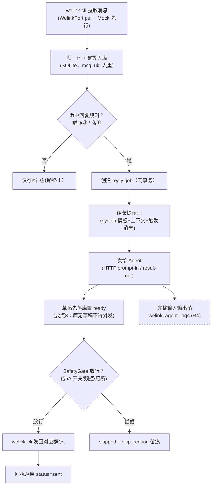
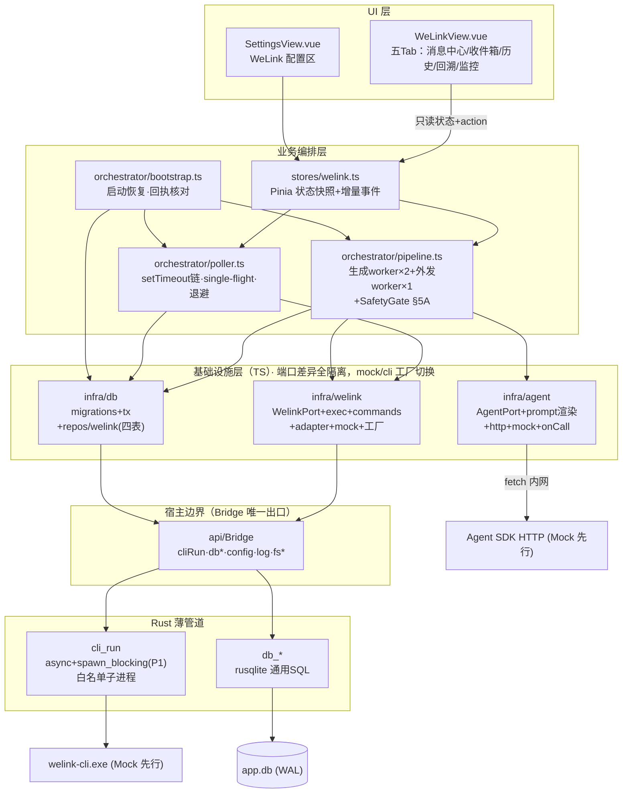
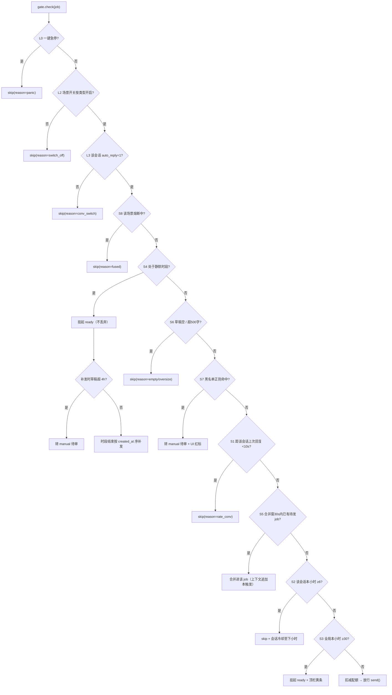
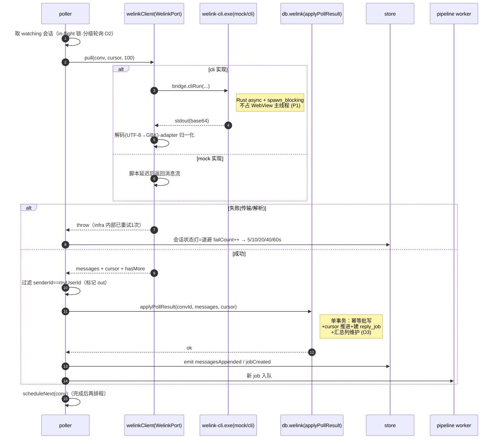
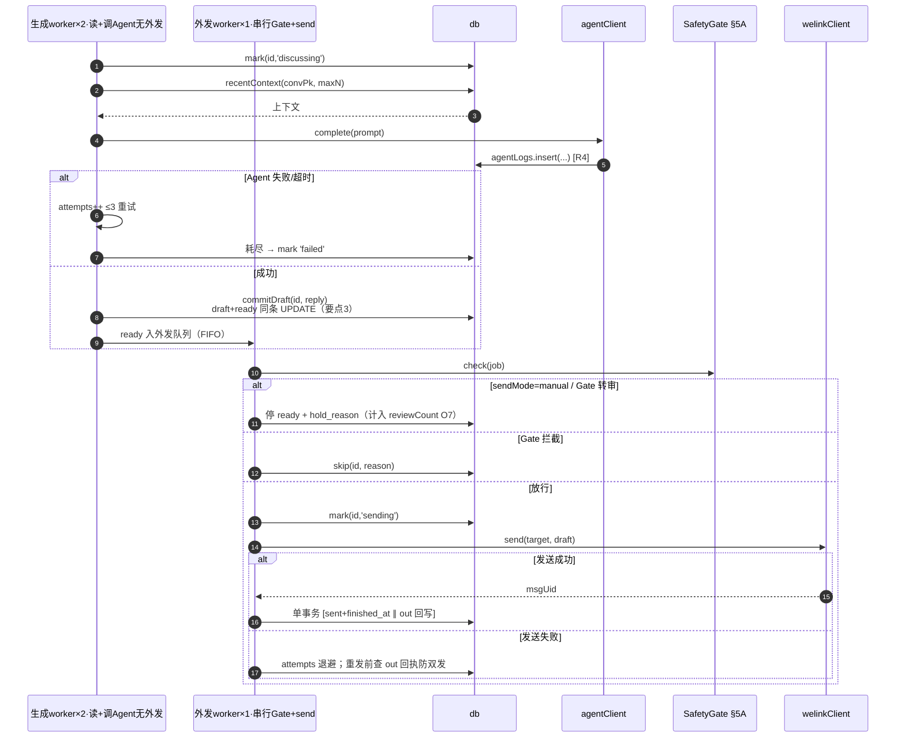
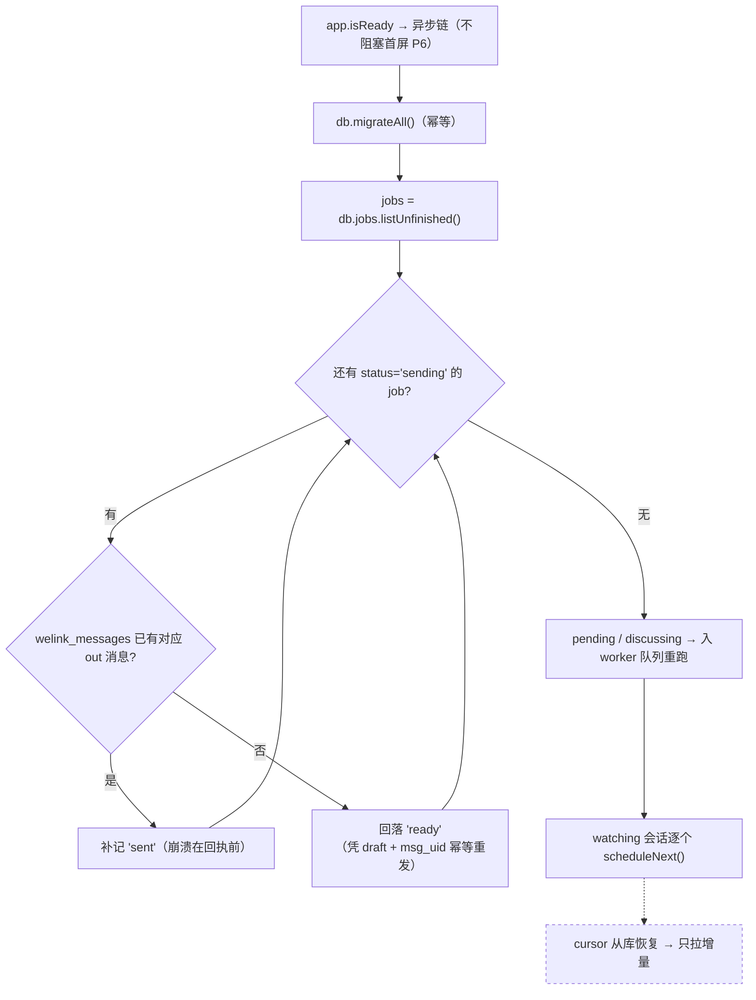
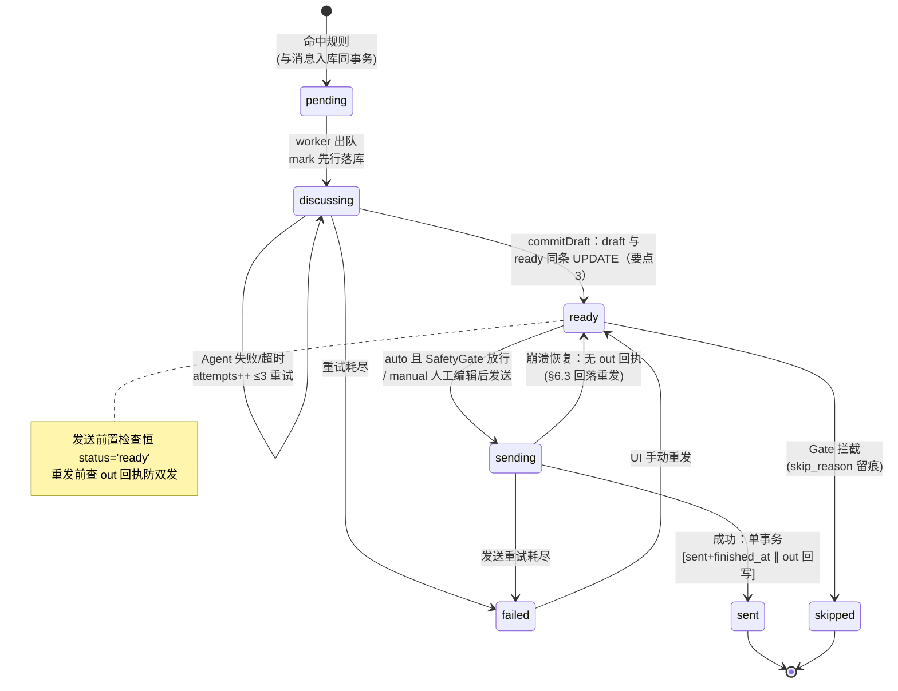

# WeLink × Agent 自动回复助手 — 设计方案

- 日期：2026-09-27
- 版本：**v4.5（图表改为 Mermaid，GitHub 原生渲染）**
- 状态：**待确认 —— 本方案评审通过前不写实现代码**
- 适用平台：仅 Windows（不考虑 Linux）

> 版本轨迹：v1 初版对齐 → v2 Mock 优先（端口-适配器）→ v3 并入 R1–R4 功能细化 →
> v4 基础设施层重组 + 性能与非阻塞设计 + 交互时序 → v4.1 页面设计细化（§11）→
> v4.2 回复开关分级 + 防滥发安全控制（§5A）→ v4.3 全部图表 PlantUML 化 →
> v4.4 性能与易用性专项优化（§5B）→
> **v4.5 呈现修订：7 幅图全部由 PlantUML 重绘为 Mermaid（flowchart / sequenceDiagram /
> stateDiagram-v2），GitHub 网页端原生渲染，零插件零服务端依赖。**

---

## 1. 需求背景与要点

WeLink 是企业级通信软件（内部员工交流、拉群，类似微信）。官方独立提供面向职员的
Windows 客户端工具 **welink-cli**，为 exe 命令行方式，可获取群消息 / 私聊消息、发送消息。
大模型 Agent 为**内网本地部署的 SDK 服务**，启动后通过 HTTP 接口发布提示词、接受结果。

端到端链路（Mermaid，下同——文档内全部图形以 Mermaid 源码嵌入，GitHub 原生渲染）：



### 硬性要点（原始需求）

| # | 要点 | 设计响应 |
|---|------|---------|
| 1 | 私聊信息自动存储、自动恢复 | 私聊收/发双向落 SQLite；重启后从库重建时间线与轮询游标，未完成回复任务自动续跑（§7.2、§6.3） |
| 2 | 群消息中 @我 = 特殊消息，需自动回复 | 解析识别 @我，命中即创建回复任务（§7.1） |
| 3 | 回复之前所有回复记录必须先保存到数据库 | 草稿先写 `welink_reply_jobs.draft` 并置 `ready`，**落库成功才允许发送**（§7.3 状态机） |
| 4 | 本地数据库优先 SQLite | 复用现有 rusqlite (bundled) 通用通道 + TS 迁移，新增 migration v2，**Rust 零表结构改动**（§4） |
| 5 | 只考虑 Windows | CLI 路径、子进程调用、编码（UTF-8→GBK 兜底）均按 Windows 设计（§9） |
| 6 | **v4：基础设施层用 TS 封装三项能力，支撑上层业务**（消息获取发送 / Agent 交互 / 数据查询） | `src/infra/` 三模块：welink / agent / db，端口接口 + mock 实现（§3、§4） |
| 7 | **v4：后台轮询与 Agent 处理不得阻塞前端 UI** | Rust 侧 spawn_blocking、TS 侧全异步链 + single-flight + 增量通知 + 分页渲染（§5） |
| 8 | **v4.2：自动回复开关精细化控制，防消息滥发** | 四级开关分级 + 会话/全局小时配额 + 最小间隔 + 静默时段 + 内容防护 + 熔断 + 一键急停（§5A） |

### 交付策略（v2 起明确）

welink-cli 与 Agent SDK 服务均**先模拟对接**：端口接口 + Mock 实现跑通全链路，
真实接口就绪后只替换适配器文件，业务层零改动。

### 功能细化（v3 R1–R4，v4 沿用）

| # | 要求 | 设计落点 |
|---|------|---------|
| R1 | 配置检测群（群 id、群名等） | `welink_conversations` 可配置监控清单 + 「监控配置」Tab + CLI 同步导入候选 |
| R2 | 查看所有私聊消息 | 私聊收件箱 Tab（`direction='in' AND conv_type='private'`，分组+分页） |
| R3 | 自动回复机制配置、历史记录 | `welink_reply_jobs` 执行历史（触发类型/状态/重试/耗时/模式快照）+ Settings 配置区 |
| R4 | 大模型输入/输出留痕，回溯改进 | `welink_agent_logs` 表：完整 prompt/response 原样落库，1:N，重试留痕 + 「Agent 回溯」Tab |

---

## 2. 非目标（本期不做）

- 不做 Linux/macOS；不做端到端加密、云端同步；不做图片/文件消息回复；不做多账号。
- R4 只「记录」供人工回溯，不做自动 prompt 优化/微调闭环。
- 不引入 Web Worker / 独立子进程做前端计算 —— 全链路为 IO 密集，异步即够（见 §5 论证）。

---

## 3. 总体架构（v4 重组）

沿用「前端不直接依赖 Rust、Bridge 唯一边界」铁律；在其内部把 TS 侧明确分为三层，
**依赖只能自上而下**，基础设施层彼此不依赖，由编排层组合：



### 3.1 基础设施层职责契约（v4 新增）

| 模块 | 对上提供的能力 | 内部封装掉的变化点 |
|------|--------------|------------------|
| `infra/welink` | 消息获取、消息发送、会话清单拉取（三个端口方法，见 §3.2） | CLI 子命令名/参数格式、stdout 编码（UTF-8→GBK）、退出码语义、传输层重试、真实/mock 切换 |
| `infra/agent` | 提示词 → 回复文本（单接口）；onCall 钩子输出调用记录 | HTTP 路由/字段名、超时中止、错误分类（error/timeout）、真实/mock 切换 |
| `infra/db` | 类型化数据操作：会话 CRUD、消息幂等批写、收件箱/历史分页查询、job 状态机原子流转、agent_logs 落库 | SQL 文本、参数绑定、事务边界、迁移注册、保留期清理 |

上层（orchestrator/store）**只看到 Promise 化的类型 API**，三者可独立单测、独立替换。

### 3.2 端口接口（业务层依赖的全部外部世界形状）

```ts
// infra/welink/port.ts
export interface WelinkPort {
  /** R1：可选会话候选（群/联系人），供监控配置导入 */
  listConversations(): Promise<WelinkConversation[]>
  /** 增量拉取：cursor 不透明；limit 控制单批大小（§5-P8） */
  pull(conv: WelinkConversation, after: string, limit: number):
    Promise<{ messages: NormalizedMessage[]; cursor: string; hasMore: boolean }>
  send(conv: { convId: string; convType: WelinkConvType }, text: string): Promise<{ msgUid: string }>
}

// infra/agent/port.ts
export interface AgentPort {
  /** 提交完整提示词，返回回复正文；错误以 AgentError 分类抛出 */
  complete(prompt: string): Promise<string>
}
/** AgentClient（工厂产物）在 complete 前后额外发出记录，供管线落 agent_logs（R4）： */
export interface AgentCallRecord {
  prompt: string; response: string
  status: 'ok' | 'error' | 'timeout'
  latencyMs: number; error: string
}
// infra/db：无跨进程端口，是 TS 类 API —— 方法签名见 §6 各流程中的 repo.xxx 调用
```

### 3.3 切换与 Mock

| 端口 | Mock（本期） | 真实（后续） | 切换 |
|------|-------------|------------|------|
| WelinkPort | `mock.ts` 脚本化消息流（含 @我/私聊/自发样本，可注入延迟与错误） | `commands+exec+adapter`：cliRun 真实进程 | 设置 `welinkSource: 'mock'\|'cli'` |
| AgentPort | `mock.ts` 延迟 1–2s + 模板回复 + **确定性**失败注入（固定种子，测试可靠） | `http.ts`：fetch + AbortController | 设置 `agentSource: 'mock'\|'http'`；baseUrl 为空回退 mock 并 UI 警示 |

- Mock 与真实实现共享同一套**端口夹具测试**（同组断言跑两遍），真实对接可回归。
- 真实文档到手后只改 `welink/exec+commands+adapter` 与 `agent/http`，端口不兼容时先改端口、全量测试红→绿。

### 3.4 架构决策记录

| 决策 | 选择 | 理由 |
|------|------|------|
| D1 | Rust `cli_run(program,args,timeout)` 通用命令，参数拼装全在 TS | 与「SQL 留 TS」同构，Rust 保持薄管道 |
| D2 | 轮询/管线循环放 TS | 可单测、可热改；Rust 无后台线程 |
| D3 | Agent = HTTP prompt-in / result-out，上下文由客户端组装进提示词 | 内网服务，无 CDN/遥测；协议简单可控 |
| D4 | 复用 `data/app.db`，migration v2 四张新表 | `_migrations` 体系现成，备份=拷一个文件 |
| D5 | web 模式 `cliRun` 返回 mock、db 走内存实现 | `npm run dev` 全链路可调试 |
| D6 | 外部依赖 Mock 优先（端口-适配器） | 接口未定型时先锁定业务正确性 |
| D7 | R4 输入输出独立建表（1:N） | 重试/换答多次调用；语料独立成表便于导出回溯 |
| D8 | **v4：TS 三层分离：infra（能力封装）/ orchestrator（流程组合）/ store+views（状态与呈现）** | 用户明确的基础设施层要求；层间依赖单向，各层可独立测试与替换 |
| D9 | **v4：重 IO 命令 Rust 侧改 async + spawn_blocking，不进 Webview 主线程** | Tauri 同步命令在主线程执行，cli_run 阻塞等待子进程会直接卡 UI（§5-P1） |
| D10 | **v4：不引入 Web Worker** | 全链路 IO 密集：JS 单线程只承担编排与渲染，重活（进程/HTTP/SQL）都在 Rust 线程池与网络层；引 Worker 徒增序列化复杂度 |
| D11 | **v4.2：外发唯一出口 SafetyGate + 存档/回复双开关分离** | 防滥发是所有开关的唯一收口点，编排层无法绕开；watching（拉取存档）与 auto_reply（外发）正交，新会话默认只存档 |
| D12 | **v4.4：管线两段式（生成并发 2 / 外发串行 1）** | 吞吐瓶颈在 Agent 等待而非外发；外发单点串行保住 S1–S3 配额准确性与防双发不变量，生成段无副作用可并行 |
| D13 | **v4.4：会话表冗余汇总列（unread/mention/last_msg_at/last_active）** | 列表查询零聚合、轮询分级有依据；代价仅是 applyPollResult/markRead 同事务多写几列——写放大可忽略（批 ≤200 行/事务不变） |

---

## 4. 数据模型（SQLite migration v2）

业务 SQL 全部在 `infra/db/repos/welink.ts`（v4 起归入基础设施层）。

```sql
-- v2: welink 助手四张表

CREATE TABLE welink_conversations (
  id            INTEGER PRIMARY KEY AUTOINCREMENT,
  conv_type     TEXT NOT NULL CHECK (conv_type IN ('group','private')),
  conv_id       TEXT NOT NULL UNIQUE,        -- WeLink 群号 / 对方工号
  title         TEXT NOT NULL DEFAULT '',    -- 群名 / 对方昵称（CLI 同步值）
  remark        TEXT NOT NULL DEFAULT '',    -- 本地备注（R1）
  watching      INTEGER NOT NULL DEFAULT 0,  -- 是否拉取存档（白名单勾选制，R1/Q5）
  auto_reply    INTEGER NOT NULL DEFAULT 0,  -- v4.2·L3：是否允许自动外发（与存档分离，默认关）
  mute_until    TEXT,                        -- v4.4·O11：静音截止时间，null/过期=不静音（Gate L3 合并判定）
  last_msg_at   TEXT NOT NULL DEFAULT '',    -- v4.4·O3：最后消息时间（applyPollResult 同事务维护，列表零聚合）
  unread_count  INTEGER NOT NULL DEFAULT 0,  -- v4.4·O6：未读 in 消息数（markRead 清零）
  mention_count INTEGER NOT NULL DEFAULT 0,  -- v4.4·O3：未处理 @我 数（打开会话清）
  last_active   TEXT NOT NULL DEFAULT '',    -- v4.4·O2：最近有新消息时刻 → 轮询分级依据（热/温/冷）
  last_cursor   TEXT NOT NULL DEFAULT '',
  updated_at    TEXT NOT NULL
);

CREATE TABLE welink_messages (
  id            INTEGER PRIMARY KEY AUTOINCREMENT,
  msg_uid       TEXT NOT NULL UNIQUE,        -- 幂等去重键
  conv_pk       INTEGER NOT NULL REFERENCES welink_conversations(id) ON DELETE CASCADE,
  direction     TEXT NOT NULL CHECK (direction IN ('in','out')),
  sender_id     TEXT NOT NULL DEFAULT '',
  sender_name   TEXT NOT NULL DEFAULT '',
  content       TEXT NOT NULL,
  msg_type      TEXT NOT NULL DEFAULT 'text',
  at_me         INTEGER NOT NULL DEFAULT 0,
  read_flag     INTEGER NOT NULL DEFAULT 0,  -- v4.4·O6：已读标记（打开会话批量置1，unread 由此维护）
  sent_at       TEXT NOT NULL,
  created_at    TEXT NOT NULL
);
CREATE INDEX idx_wm_conv_time ON welink_messages(conv_pk, sent_at);
CREATE INDEX idx_wm_direction ON welink_messages(direction, sent_at);  -- R2 收件箱

CREATE TABLE welink_reply_jobs (
  id              INTEGER PRIMARY KEY AUTOINCREMENT,
  trigger_msg_pk  INTEGER NOT NULL REFERENCES welink_messages(id),
  trigger_type    TEXT NOT NULL CHECK (trigger_type IN ('group_at_me','private','manual')),
  target_type     TEXT NOT NULL CHECK (target_type IN ('group','private')),
  target_id       TEXT NOT NULL,
  send_mode_used  TEXT NOT NULL DEFAULT 'auto',
  context_snapshot TEXT NOT NULL DEFAULT '',
  draft           TEXT NOT NULL DEFAULT '',  -- 要点3：发送前必须已落库
  status          TEXT NOT NULL DEFAULT 'pending'
                    CHECK (status IN ('pending','discussing','ready','sending','sent','failed','skipped')),
  attempts        INTEGER NOT NULL DEFAULT 0,
  last_error      TEXT NOT NULL DEFAULT '',
  skip_reason     TEXT NOT NULL DEFAULT '',  -- v4.2：SafetyGate 拦截原因（panic/switch_off/conv_switch/fused/rate_conv/empty/oversize…），审计留痕
  hold_reason     TEXT NOT NULL DEFAULT '',  -- v4.4·O7：待审原因（manual_mode/blacklist），reviewCount 聚合依据
  rating          TEXT CHECK (rating IN ('up','down')),  -- v4.4·O10：人工评价，差评对=改进语料
  created_at      TEXT NOT NULL,
  updated_at      TEXT NOT NULL,
  finished_at     TEXT
);
CREATE INDEX idx_wrj_status ON welink_reply_jobs(status);
CREATE INDEX idx_wrj_trigger ON welink_reply_jobs(trigger_type, created_at);

CREATE TABLE welink_agent_logs (                     -- R4：大模型输入输出语料
  id            INTEGER PRIMARY KEY AUTOINCREMENT,
  job_pk        INTEGER NOT NULL REFERENCES welink_reply_jobs(id) ON DELETE CASCADE,
  seq           INTEGER NOT NULL,
  prompt        TEXT NOT NULL,
  response      TEXT NOT NULL DEFAULT '',
  status        TEXT NOT NULL CHECK (status IN ('ok','error','timeout')),
  latency_ms    INTEGER NOT NULL DEFAULT 0,
  error         TEXT NOT NULL DEFAULT '',
  created_at    TEXT NOT NULL
);
CREATE INDEX idx_wal_job ON welink_agent_logs(job_pk);
```

迁移注册：`infra/db/migrations.ts` 汇总 `records v1 + welink v2`，应用启动时一次
`dbMigrateAll()`（幂等、后台执行、不阻塞首屏渲染——见 §5-P6）。

---

## 5. 性能与非阻塞设计（v4 核心新增）

前提判断：WebView JS 单线程，「不阻塞 UI」= **主线程上没有长同步工作** +
**高频更新不引发渲染风暴** + **重活全部下沉到 Rust 线程池 / 网络层异步**。

| # | 措施 | 说明 |
|---|------|------|
| P1 | **Rust 重 IO 命令走独立线程** | Tauri 同步 `#[tauri::command]` 在主线程执行；`cli_run` 要阻塞等子进程（最长 15s），若不隔离会卡死事件循环（白屏/掉帧）。改法：`async fn cli_run` + `tauri::async_runtime::spawn_blocking` 包裹进程逻辑。`db_*` 保持同步（本地 rusqlite 毫秒级）；例外是「保留期清理」大事务，挪到 `db_transaction` 前分批（每批 ≤500 行） |
| P2 | **轮询 single-flight + setTimeout 链** | 弃用 `setInterval`（上一轮未完会叠加执行）。每会话一把 in-flight 锁；本轮**完成**（含失败）后才排下一轮定时器。手动「立即拉取」与自动轮询共用同一把锁，天然去重 |
| P3 | **Agent 处理两段式 worker** | v4.4 修订：生成段（Agent 调用，不外发）并发 2 提吞吐；外发段（Gate+send）恒并发 1 串行保配额准确/防双发——详见 §5B.1-O1 与 §6.2。单次调用带 AbortController 超时（60s），UI 全程读状态快照不等结果 |
| P4 | **每轮每会话一个事务** | 消息批写（INSERT OR IGNORE）+ cursor 推进 + reply_job 登记在同一 `dbTransaction`，IPC 往返最少；消息按批 ≤200 条/事务 |
| P5 | **增量状态通知** | poller/pipeline 不向 store 推全量列表，只推事件（`messagesAppended(convId, rows)`、`jobStatusChanged(id, from, to)`）；store 增量打补丁。UI 组件 keyed v-for，避免整列表重渲染 |
| P6 | **启动不阻塞** | 首屏渲染与后台初始化并行：`dbMigrateAll`、bootstrap 扫描未终态 job、恢复计时器都在 `app.isReady` 后的异步链里；启动期 UI 显示「初始化中」状态灯，不出现空壳假死 |
| P7 | **列表查询强制分页** | 所有列表 SQL 必须带 `LIMIT/OFFSET` 或时间 cursor：消息流按「更早」上翻加载（每页 100）、收件箱按联系人分组分页、回复历史/回溯日志默认 7 天 + 分页。**禁止无 LIMIT 全表 SELECT**（仓储层 lint：方法签名强制传分页参数） |
| P8 | **拉取限流与 IPC 载荷** | `pull` 每批 `limit`（默认 100）；`hasMore=true` 立即续批但同一事务循环 ≤3 次，剩余下轮处理。CLI 输出 2MB 上限 + base64 经 IPC 的开销可控（真实对接后若消息量大，改 CLI 输出落临时文件、只传路径——预留扩展位） |
| P9 | **窗口不可见时降载** | 监听 `visibilitychange`：隐藏时轮询间隔 ×3，回复管线照常（发送不等 UI）；显示即恢复。总开关关闭 = 停 timer + 停 worker，**已入库数据与未终态 job 原样保留** |
| P10 | **日志与渲染解耦** | logger 走 `appendLog`（宿主写文件），UI 日志区只显示内存环形缓冲最后 200 行，不落库不刷屏 |

**明确不做**：Web Worker / WASM / 虚拟滚动库（本期消息量级 = 单用户群聊，分页即够；
P7 拦截大列表是唯一硬约束）。

---

## 5A. 自动回复开关与防滥发安全控制（v4.2 核心新增）

原则：**所有外发动作必经唯一出口 `SafetyGate`**（位于 pipeline 与 `infra/welink.send` 之间，编排层无法绕开）；每一条被拦下的发送都以 `status='skipped'` + `skip_reason` 落库留痕——**宁可不回，不可滥发**。

### 5A.1 开关分级（一键急停 + 精细化）

| 层级 | 开关 | 语义 | 生效 |
|------|------|------|------|
| L0 全局急停 | 控制条「一键全停」按钮 | 停 timer + 停 worker + **封死 SafetyGate**（manual 人工发送也需二次确认）；状态灯红「急停」；数据与未终态 job 保留 | 即时 |
| L1 助手总开关 | `enabled` | 整个助手启停（v4.1 语义不变） | 即时 |
| L2 场景开关 | `groupAtMe`（默认开，可关）、`privateAutoReply`（默认开，可关） | 按触发类型整域关闭；**关闭后消息照常存储，仅不回复**（R2 收件箱不受影响） | 即时（外发 worker 经 Gate 判定，O5 内存缓存） |
| L3 会话级开关 | `welink_conversations.auto_reply`（**默认 0=关**） | 每个群/联系人单独控制是否允许自动回复；监控配置 Tab 行内开关 | 即时（Gate 查会话开关内存缓存，upsert 失效，O5） |

> 精细化默认立场：**监控（存档）与回复（外发）彻底分离**——`watching` 管拉取存档，
> `auto_reply` 管外发；新导入的会话永远只存档不回复，外发须显式开启。

### 5A.2 频控规则（SafetyGate 串行闸口）

| # | 规则 | 默认值 | 拦截行为 |
|---|------|--------|---------|
| S1 | 每会话最小回复间隔 | 1 条/10s | 窗口内后续 job → skipped（reason=rate_conv） |
| S2 | 每会话每小时上限 | 6 | 超限→该会话回复冷却至下小时（Gate 内存计数维护，逐条 skipped 落库留痕） |
| S3 | 全局每小时上限 | 30 | 超限→Gate 全局冷却；新 job 停留 ready 排队不发送，顶栏黄条提示 |
| S4 | 静默时段 quietHours | **默认关**；开启后常用 22:00–08:00 | 时段内不发送**也不丢弃**：job 挂起 ready，时段结束按 created_at 序补发；补发时草稿已超 4h → 转 manual 待审（隔夜内容不盲发） |
| S5 | 同人短窗合并 | 同会话 30s 内多条触发 | 合并为一个 job 一次回复（上下文含全部触发），防刷屏式连发 |
| S6 | 草稿防护 | 空/纯符号/超 500 字拒发 | skipped（reason=empty/oversize） |
| S7 | 内容黑名单 | 配置正则表（默认含转账/借款/改密等敏感句式） | 命中→不发送，job 转 manual 待审 + UI 红标——防模型幻觉生成承诺性/资金类回复 |
| S8 | 熔断 | Gate 拦下一类 reason 10 分钟内 >3 次；或 myUserId 为空 | **自动 L2 降级**（暂停对应场景回复并通知 UI），人工在控制条点「解除熔断」恢复；熔断期间拉取与存档照常 |

> S2/S3/S8 的计数与冷却状态在内存（重启清零可接受——重启本身已中断滥发）；
> skip 事件全部落 jobs 表，审计与改进（R3/R4）看得到每一次「本可以发但被拦」。

### 5A.3 SafetyGate 判定顺序（外发 worker 在 send 前调用，见 §6.2）



> 阅读方式：纵向主链 = 全部通过；任一判定命中即从右侧出口终止（skip/转审/挂起）。

任一拦截均执行 `db.jobs.skip(id, reason)`（同事务写 skip_reason，见 §4）并更新 UI 计数徽标。

---

## 5B. 性能与易用性优化（v4.4 审视结论，基础功能不变）

### 5B.1 性能审视 → 优化

| # | 审视发现 | v4.3 原设计的问题 | v4.4 优化 |
|---|---------|------------------|----------|
| O1 | **Agent 等待阻塞回复队列** | P3 定为「worker 并发=1」，本地推理单条 2–60s；晚间积压 10 条 @我 → 队尾用户等 10 分钟 | **生成/发送两段拆分**：生成段（LLM 调用，只读+写 agent_logs，无外发风险）并发 **N=2**；外发段（Gate→send）保持单 worker **严格串行**——限流/配额/防双发的语义完整保留，吞吐翻倍且不发散 |
| O2 | **每会话每轮冷启动一个 CLI 进程** | 20 个监控群 = 20 次进程创建/销毁/管道握手，纯浪费 | 轮询**分级自适应**：热会话（30min 内有新消息）基准间隔；温会话 3×；冷会话（24h 无消息）6× 或仅手动拉。会话间隔 ≥2s 错峰，同会话 `hasMore` 续批合并连接 |
| O3 | **会话列表「最后消息时间+未读数」无数据来源** | 每次刷新要对 messages 按会话 `MAX(sent_at)`/`COUNT(*)` 聚合，群多时列表查询随消息量线性变慢 | conversations 冗余 `last_msg_at`/`unread_count`/`mention_count`/`last_active` 列，applyPollResult 同事务增量维护——列表查询退化为**零聚合纯读**（未读体系见 O6） |
| O4 | 首屏全量加载多 Tab | 五 Tab 同时挂载各自首屏查询 | 懒加载：仅激活的 Tab 发查询（`v-if` 级），Tab 内 keep-alive 保状态；消息中心默认选中「最后有 @我 的会话」 |
| O5 | Gate 检查的 DB 往返 | 每次外发查一次会话 auto_reply 行 | Gate 持**会话开关内存缓存**（upsert 时失效）；S1–S3 计数本就内存，整条 Gate 判定 0 次 SELECT |

### 5B.2 易用性审视 → 优化

| # | 审视发现 | v4.4 优化 |
|---|---------|----------|
| O6 | **未读/已读缺失**——badge 显示什么、何时消失没有定义 | conversations.`unread_count` + messages.`read_flag`；打开会话即按 cursor 式批量 markRead（单事务）；Tab 角标与任务栏提示（后续可选）都以此为唯一来源 |
| O7 | **人工待审是黑洞**——manual 草稿、S7 黑名单转审散在各表，用户不知道「现在有几个等我」 | store 维护 **`reviewCount` = `hold_reason≠''` 的 ready job 数（manual_mode / blacklist 两类）**，控制条常驻「待审 N」徽标；点击直达回复历史「待我处理」预设筛选——自动化的第一体验指标从「它回了啥」变成「它等我干啥」（熔断走独立横幅提示，不计入待审） |
| O8 | **冷启动无从下手**——enabled=off 进页面是空壳；myUserId 必填易漏（漏了 S8 熔断静默不回复，用户困惑） | **首次引导向导**（三步，mock 默认值预填）：①确认 mock 来源 ②填工号 ③勾 1 个演示群。myUserId 空时顶栏红条「未填工号，助手不会回复」——把熔断的静默拒绝变成显式指引 |
| O9 | **8 个防滥发参数太专业** | Settings 防滥发组顶部**预设三档**：保守（S1=30s/S2=3/S3=15/静默开）· 标准（当前默认）· 积极（放宽），选档后细参数仍可展开微调——开箱可用，专家不失自由度 |
| O10 | 回复质量无反馈通道 | 回复历史/sent 气泡加 **👍/👎 标注**（jobs.`rating` 列，落库）；回溯 Tab 提供「只看差评」筛选 → 差评 prompt/response 对就是改进语料（R4 闭环，仍不做自动优化） |
| O11 | **临时闭嘴太重**——想把机器人停一小时只能关总开关 | conversations.`mute_until` 列 + 监控配置行菜单「静音 1h/8h/今天」；Gate L3 判定合并此条件（到期自动恢复，UI 置灰显示剩余时间） |
| O12 | 消息多了找不到 | 收件箱/消息中心加**本地关键词搜索**：SQLite `LIKE '%kw%'` + `sent_at` 时间段过滤（LIMIT 分页），数据量级（单用户 ≤ 数十万行）下足够，**不引入 FTS5**（bundled rusqlite 默认不开该扩展，避免扩编译面） |
| O13 | 真实 CLI/Agent 到手前无法演示 | `welink-mock.ts` 升级为**剧本引擎**：预置「新人群聊@我→私聊追问→对方回应」演示脚本，消息中心右下角浮动「演示剧本」按钮一键回放——评审与培训用 |
| O14 | 设置项生效时机不明 | 每个配置控件 label 标注生效方式：即时 / 下轮轮询 / 新 job 起；避免「改了没反应」的困惑 |

> 一致性核对：O1 不削弱防双发（外发仍串行）、不削弱 S1–S3（计数在 Gate 单点扣减）；
> O11 只是 L3 的**临时形态**，开关语义未变；其余为纯增量。基础功能 1–5、R1–R4 全部不动。

---

## 6. 交互时序（v4 细化）

### 6.1 轮询周期（orchestrator/poller ⇄ infra/welink ⇄ infra/db）

> v4.4：每轮按 `last_active` 分级决定该会话是否跳过（热=每轮、温=每3轮、冷=每6轮或仅手动），会话间 ≥2s 错峰，其余流程不变。



### 6.2 回复管线（v4.4：生成段并发=2，外发段串行=1，见 §5B.1-O1）



> 外发单 worker 串行是**防双发/配额准确性的关键**：S1–S3 计数、sending 态唯一性都只在这一处发生；生成段可并行因为它不碰外发世界。人工「编辑并发送 / 重发」也是把 job 置 ready 投进外发队列。

### 6.3 启动恢复（orchestrator/bootstrap，对应「自动恢复」）



### 6.4 UI 动作 ⇄ 编排映射

| UI 动作 | store action | 落到 |
|---------|-------------|------|
| 总开关 ON/OFF | start()/stop() | 恢复/暂停 timer+worker；数据保留 |
| **一键全停（L0）** | panicStop() / 解除 | SafetyGate 封死+停调度；解除后自动回复默认转 manual 再恢复（防一解除就爆量） |
| **熔断解除** | resetFuse(scope) | 人工确认后清计数恢复该场景 |
| 立即拉取一次 | pullNow() | 与各会话 in-flight 锁共用 |
| 监控配置增删改 | upsertConversation() | db 写 + poller 热更新会话集 |
| 同步会话（R1） | syncConversations() | welinkClient.listConversations → db 导入（watching=0） |
| 回复历史：重发 | retryJob(id) | job 回 'ready' 入队 |
| 回复历史：编辑后发送（manual） | editAndSend(id,text) | db commitDraft(改稿) → 直接走 6.2-6 |
| 回溯 Tab：查看/展开 | loadAgentLogs(jobId) | db 分页查询 |
| **打开会话（清未读 O6）** | markRead(convId) | 单事务：该会话 in 消息批量 read_flag=1、unread/mention 清零 |
| **会话静音 N 小时（O11）** | muteConv(id, until) | db 写 mute_until；Gate L3 合并判定；到期自动恢复 |
| **待审聚合入口（O7）** | 点击「待审 N」徽标 | 跳回复历史 `hold_reason≠''` 预设筛选 |
| **👍/👎 评价（O10）** | rateJob(id, up/down) | db 写 jobs.rating；回溯 Tab 可按差评过滤 |
| **关键词搜索（O12）** | searchMessages(kw, range) | LIKE+分页，命中跳消息中心定位 |
| **演示剧本（O13）** | playDemoScript() | welink-mock 剧本引擎驱动一轮完整链路 |

---

## 7. 核心流程语义

### 7.1 触发规则

| 场景 | 存档 | 自动回复 |
|------|------|---------|
| 群消息 @我（text，群 watching=1） | ✅ | ✅ 建 reply_job（trigger_type=group_at_me）；**实际外发还须 L2 groupAtMe ∧ L3 该群 auto_reply ∧ SafetyGate 通过**（§5A） |
| 群消息 未@我 | ✅ | ❌ |
| 私聊消息（text） | ✅ 双向（R2 数据源） | ✅ trigger_type=private；外发条件同上（L2 privateAutoReply ∧ L3 auto_reply ∧ Gate） |
| 非 text 类型 | ✅ 占位描述 | ❌ |
| 自发消息 | direction=out | ❌ + senderId==myUserId 过滤（防循环） |

@所有人 不算 @我；白名单群制（对齐 Q5）。v4.2：建 job 与放行外发是两回事——
开关/频控拦截发生在 Gate（外发前），job 与消息照常留档可审计。

### 7.2 私聊「自动存储 + 自动恢复」

- 存储：私聊收/发双向实时落库（时间线+会话元数据）。
- 恢复：见 §6.3 —— 游标续拉增量、时间线由库重建、未终态 job 续跑。

### 7.3 要点3 的原子保证（回复任务状态机）



`draft` 与 `status='ready'` 同一条 UPDATE（`db.jobs.commitDraft`）；发送动作前置检查
`status='ready'`；崩溃窗口由 §6.3 回执核对闭合。

---

## 8. 配置扩展（`config/config.json` → AppSettings.weLink）

```jsonc
{
  "weLink": {
    "enabled": false,
    "welinkSource": "mock",            // mock | cli
    "cliPath": "welink-cli",           // cli 时生效（宿主白名单校验主干）
    "pollIntervalSec": 5,
    "pullBatchLimit": 100,             // §5-P8
    "myUserId": "",
    "trigger": { "groupAtMe": true, "privateAutoReply": true },  // L2 场景开关（§5A.1），默认全开
    "sendMode": "auto",                // auto | manual（R3）
    "safety": {                        // v4.2 防滥发（§5A.2，全部可配，默认值如下）
      "perConvMinIntervalSec": 10,     // S1
      "perConvHourlyCap": 6,           // S2
      "globalHourlyCap": 30,           // S3
      "quietHours": { "enabled": false, "from": "22:00", "to": "08:00" },  // S4
      "mergeWindowSec": 30,            // S5
      "maxDraftChars": 500,            // S6
      "blacklistPatterns": [],         // S7 正则表（默认含转账/借款/改密等资金句式）
      "fuseWindowMin": 10, "fuseThreshold": 3  // S8 熔断
    },
    "agent": {
      "agentSource": "mock",           // mock | http
      "baseUrl": "http://127.0.0.1:8080",
      "endpoint": "/chat",
      "timeoutMs": 60000,
      "maxContextMsgs": 20,
      "promptTemplate": "……内置默认模板……"   // R3 可编辑
    }
  }
}
```

监控清单（R1）是**数据**，存 `welink_conversations` 表，不进 config。
`retention.keepDays`（默认 180）为仓储层常量，每日一批 ≤500 行分批清理（§5-P1）。

---

## 9. Windows 专项

- `CREATE_NO_WINDOW` 子进程；GBK 兜底解码（`src/utils/b64.ts` 已实现，UTF-8 严格失败→gbk）。
- `cli_run` 白名单仅放行文件主干 `welink-cli`，args 数组传递不经 shell，杜绝注入。
- 输出上限 2 MB；超时（默认 15s）强杀并回收管道。
- 仅 Windows 目标：不写 macOS/Linux 分支（`open_storage_dir` 同款 cfg 处理即可）。

## 10. 安全

| 项 | 措施 |
|----|------|
| 任意命令执行 | `cli_run` 白名单主干 `welink-cli`，其他拒绝 |
| 对话数据 | 全部存本机数据根 SQLite；除 Agent baseUrl（用户自配内网）外零出网 |
| **消息滥发（v4.2 核心）** | SafetyGate 唯一出口：四级开关 + S1–S8 频控/配额/静默/合并/黑名单/熔断，全拦截留痕（§5A） |
| 自回复死循环 | myUserId 过滤（空则 S8 熔断不回复）+ msg_uid 幂等 + S1 会话间隔 + S2/S3 配额封顶 |
| 模型幻觉外发 | S6 草稿防护 + S7 敏感句式黑名单转人工待审 |
| 误发 | manual 模式 + 一键全停（L0）+ 解除熔断/急停后默认降 manual 缓冲（§6.4） |
| R4 语料 | 含敏感对话：仅本地；提供「清理回溯记录」入口 |

## 11. 页面设计（v4.1 细化，v4.2/v4.4 扩充）

导航入口：侧栏新增「WeLink 助手」（图标 `IconActivity`），路由 `/welink`。
页面骨架 = **顶部控制条（全局）** + **五 Tab 主区**；配置类操作集中在
`SettingsView.vue` 的新增「WeLink 助手」卡片，两者职责分明：控制条管运行时，Settings 管参数。

### 11.0 全局控制条（常驻，跨 Tab）

| 元素 | 呈现内容 | 操作 / 反馈 |
|------|---------|------------|
| 总开关 | `el-switch`；关=灰 | ON→`start()`：恢复 timer+worker，状态灯转「运行中」；OFF→`stop()`：停 timer+worker，弹「已暂停，数据与未完成任务保留」 |
| **一键全停** | 红边按钮（v4.2·L0） | 单击即 `panicStop()`：Gate 封死+调度全停，状态灯红「急停」；再次点击进入解锁确认框（文案含「解除后默认转 manual 缓冲」） |
| **熔断横幅** | S8 触发时控制条下方黄条：「xx 场景滥发风险已熔断暂停，本窗拦截 N 条」 | 「解除熔断」（resetFuse）/「查看被拦记录」（跳回复历史 reason 过滤） |
| 运行状态灯 | 圆点+文字：初始化中(蓝)/运行中(绿)/退避中(黄，标第几轮)/已停止(灰)/**急停·熔断(红)** | 只读；退避时 tooltip 显示各会话 failCount |
| **配额徽标** | 小字「本小时已回 n/30 · 静默中」 | hover 显示 S2 各会话冷却明细 |
| 来源徽标 | 两个 tag：welink=mock/cli、agent=mock/http | mock 时黄底警示「模拟数据」；点击跳 Settings 对应区 |
| 立即拉取 | 按钮 | `pullNow()`：转圈禁用直到本轮完成；toast 汇总「新增 N 条、命中 M 条待回复」 |
| **待审徽标（v4.4·O7）** | 「待审 N」常驻按钮（N=manual 草稿+黑名单转审，即 hold_reason≠'' 的 ready job 数；熔断走独立横幅不计入） | 点击直达回复历史「待我处理」筛选；N>0 时轻微呼吸提示 |
| **首次引导向导（v4.4·O8）** | enabled=off 且未配置过时，页面中央三步卡片 | ①确认 mock 来源（默认可直接下一步）②填 myUserId（留空即红条警示）③勾选 1 个演示群（点「同步会话」拉候选）→ 完成自动 enabled=on + 启动 |
| **演示剧本（v4.4·O13）** | 右下角浮动按钮（仅 welinkSource=mock 显示） | `playDemoScript()`：回放「新人群@我→私聊追问→回应」预置脚本，评审/培训用 |
| **myUserId 红条（O8）** | 顶栏下方红条「未填工号，助手不会回复」 | 「去填写」聚焦 Settings 对应输入框 |

### 11.1 Tab「消息中心」（要点1/2）

三栏布局（左 260px / 中自适应 / 右 320px，右侧可折叠）：

**左栏 · 监控会话列表**
- 内容：`watching=1` 会话，分组「群聊 / 私聊」；每行 = title + 未读角标（unread_count，O6）+ @我 红点（mention_count）+ 最后消息时间（last_msg_at，**纯读零聚合 O3**）+ 状态小点（该会话拉取健康度）。静音中置灰显示「静音至 hh:mm」（O11）。
- 顶部搜索框（按群名/群号过滤）；底部「管理监控」链接 → 跳 Tab5。
- 操作：点行=选中中栏（即触发 `markRead` 清未读，O6）；右键/更多菜单：暂停监控(改 watching=0)、**静音 1h/8h/今天（O11）**、查看回复历史(跳 Tab3 带 target_id 过滤)。

**中栏 · 会话时间线**
- 内容：选中会话消息，倒序分页（首屏 100，向上滚加载更早，§5-P7）。气泡双色：in 白底左对齐、out 蓝底右对齐；显示 sender_name、content、sent_at；群消息 `at_me=1` 左侧红标「@我」；非 text 显示占位标签（[图片]等）。
- 命中消息下方内联显示其回复状态微条（草稿/发送中/已回复/失败），点击跳 Tab3 对应 job。
- 操作：选中即拉最新消息（store 增量 append，不整表刷新）；「加载更早」按钮分页。
- 空态：未选会话→引导图；会话无消息→「该会话暂无存档消息」。

**右栏 · 该会话待办回复**
- 内容：该会话 status ∈ (pending/discussing/ready/sending/failed) 的 jobs 简卡：触发消息摘要、状态标签、重试次数。
- 操作：failed→「重试」；ready(manual)→「查看草稿」跳 Tab3。

### 11.2 Tab「私聊收件箱」（R2）

| 区域 | 内容 | 操作 |
|------|------|------|
| 左：联系人列表 | 有过私聊 in 消息的联系人：昵称+工号、未读数、最后消息时间；按最后消息倒序 | 点选→右栏该联系人完整私聊时间线（in/out 双色，分页）；搜索框按昵称过滤 |
| 右：明细时间线 | 与 11.1 中栏同款气泡；顶部标「来自 xxx 的全部私聊（含已回复）」 | 「回到此会话」跳消息中心定位；每条 in 若已自动回复显示回复气泡 |
| 筛选器 | 时间段（默认最近 30 天）、是否只看未回复、**关键词搜索（v4.4·O12，LIKE+分页）** | 组合查询走 db 分页 API |
| 说明条 | 「私聊双向存档；自动回复开关在设置页」 | 「打开设置」链接 |

### 11.3 Tab「回复历史」（R3）

主表格（jobs 全量历史，倒序分页 每页 `settings.pageSize`）：

| 列 | 内容 |
|----|------|
| 时间 | created_at（+耗时列 finished_at−created_at，秒） |
| 触发 | trigger_type 标签（@我/私聊/手动）+ 触发消息摘要（hover 全文） |
| 目标 | target_type+target_id → 群名/联系人 |
| 状态 | 状态标签色：sent 绿/failed 红/discussing 蓝/ready 橙/pending 灰/**skipped 深灰（v4.2：hover 显示 skip_reason，如「会话限流 1条/10s」「命中黑名单句式」）** |
| 草稿 | 预览（折叠，点开看全文，可复制） |
| 重试 | attempts + 最后错误（hover 全文） |
| Agent | 「查看调用」→ 跳 Tab4 过滤到该 job（R4 联动） |

- 筛选器：状态、触发类型、目标会话、时间段、**拦截原因（v4.2：仅看被 Gate 拦下的）**。
- 行操作：failed→「重发」（回 ready 入队，重发同样过 Gate）；ready(manual)→「编辑并发送」弹层：textarea 预填 draft，确认→`editAndSend`（§6.4，**人工发送也检查 S7 黑名单，命中需勾选「我确认无误发风险」**）；任意行→「删除任务记录」（仅删 job，触发消息保留）。
- 顶部统计条：今日处理数 / 成功率 / 平均耗时 / 失败待处理数 / **本小时已发 n/全局上限、被拦 m 条（v4.2）**——「用于改进」的机制级仪表盘。

### 11.4 Tab「Agent 回溯」（R4）

主从布局：左 job 列表（同 Tab3 精简列）｜右调用明细。

右栏按选中 job 显示 `welink_agent_logs` 时间序（seq 升序），每条卡片：
- 头：seq、状态(ok/error/timeout 色标)、latency_ms、created_at；
- **输入区**：完整 prompt，等宽字体，默认折叠前 5 行，「展开全文 / 复制」；
- **输出区**：response 全文（error/timeout 时为空），错误详情区显示 `error` 字段；
- 底部对照：「本次输出 → 最终草稿」差异提示（若人工改过稿，标「已人工编辑」，用于分析模型回复采纳率——改进数据源）。

操作：按状态/时间段筛选日志；「按 job 导出 JSON」（含输入输出，离线分析用；Q6 默认此项从简，仅单 job 导出，批量导出后置）。

### 11.5 Tab「监控配置」（R1）

表格 = `welink_conversations` 全量（群+联系人，分页）：

| 列 | 内容 / 编辑 |
|----|------------|
| 类型 | 群/私聊 标签 |
| 会话 ID | conv_id（手动新增时必填；同步导入自动带） |
| 名称 | title（同步值，可改） |
| 备注 | remark 行内编辑（如「核心业务群」） |
| 监控 | `el-switch`=watching；切换即生效（poller 热更新会话集，§6.4） |
| **自动回复** | `el-switch`=auto_reply（v4.2·L3）；**仅 watching=1 时可开**；行尾小字提示当小时该会话回复数/上限（S2 冷却中则置灰+冷却时间） |
| 游标 | last_cursor 只读（调试）|
| 操作 | 编辑 / 删除（有历史消息时二次确认：级联删 messages/jobs） |

- 顶部按钮：「同步会话」→ `syncConversations()`：调 WelinkPort 拉候选，弹「导入 N 个新会话（默认不监控、**不回复**）」diff 对话框（已有项不覆盖、可选新项直接勾 watch）；「新增监控」手工填 id/名称/类型/备注。
- 批量操作（v4.2）：勾选多行→「批量开/关自动回复」（二次确认：显示受影响会话数与本小时配额余量）。
- 引导：enabled=off 时此 Tab 顶部黄条提示「先到设置开启助手并配置来源」。

### 11.6 Settings「WeLink 助手」配置卡片

按运行区分组（保存走现有 loadConfig/saveConfig，autoSave 生效）：

| 分组 | 控件 | 校验 / 联动 |
|------|------|------------|
| 总览 | enabled、welinkSource、agentSource | 选 cli 但 cliPath 空→红边+保存拦截；选 http 但 baseUrl 空→「保存后自动回退 mock」提示 |
| **防滥发（v4.2）** | **预设三档单选（v4.4·O9）：保守(S1=30s/S2=3/S3=15/静默开) · 标准(默认) · 积极(放宽)**，选档后细参数展开微调 | 数值全部滑块/数字框带范围；**「预览拦截效果」**：输入模拟场景显示将命中哪条规则；调高 S2/S3 超默认 2 倍→保存二次确认 |
| 运行参数 | pollIntervalSec(3–60)、pullBatchLimit(20–200)、myUserId | myUserId 空→提示「无法过滤自发消息，可能自回复」（并说明 S8 会熔断兜底） |
| 触发与发送 | groupAtMe（L2，可关）、privateAutoReply（L2，可关）、sendMode | groupAtMe 关闭时红字警示「@你的消息将不再自动回复，仅存档」 |
| CLI（cli 时显示） | cliPath | 试跑 `--help` 按钮：显示首行输出或错误 |
| Agent（http 时显示） | baseUrl、endpoint、timeoutMs、maxContextMsgs | 「连通性测试」：发固定探测 prompt，显示耗时与返回摘要 |
| 提示词模板 | promptTemplate 大 textarea（占位符 {{context}}/{{question}} 高亮说明） | 「恢复内置模板」按钮；变量缺失占位符→保存警告 |

### 11.7 视觉与组件约束

- 全部 Element Plus（与现有一致，不新增 UI 依赖）；图标复用 `components/icons.ts`（缺失补内联 SVG，禁 CDN）；
- 双色遵循项目主题变量（亮/暗双主题，P 系不写死颜色）；表格/分页风格对齐 `TableCrudView.vue`；
- 长文本一律「折叠+展开+复制」，不整屏铺开（prompt/response/草稿预览同理）。

## 12. 实施分期（v4 调整）

| 期 | 内容 | 验收 |
|----|------|------|
| M1 通道层 | Rust `cli_run`（**改 async + spawn_blocking，P1**）+ Bridge `cliRun` 双侧 + `utils/b64` + web mock | typecheck；契约对齐；手动测：长命令期间 UI 不卡 |
| M2 基础设施层 | `infra/db`（migrations 汇总 + welink repo 四表 + 分页约束）+ `infra/welink`（port/exec/commands/adapter/mock + 工厂）+ `infra/agent`（port/prompt/http/mock/onCall + 工厂） | vitest：SQL 断言、端口夹具双实现、超时中止、解码兜底 |
| M3 编排层 | `orchestrator`（poller single-flight/setTimeout 链/退避/**分级轮询 O2** + pipeline **两段式 worker O1（生成×2/外发×1）** + bootstrap + **SafetyGate §5A：S1–S8 全规则+熔断状态机+静音/开关缓存 O5/O11**）+ `stores/welink.ts` 增量事件/**reviewCount 聚合 O7** | 假时钟全链路：mock→库→mock agent→Gate→mock send；崩溃恢复三分支；重试；双发防护；**Gate 规则单测（时间窗/配额/静默/合并/黑名单/熔断各分支）**；**两段式：并发 2 生成不破坏外发串行不变量** |
| M4 UI 层 | 五 Tab + Settings 配置区（含防滥发组+**预设三档 O9**）+ 控制条（一键全停/熔断横幅/配额徽标/**待审徽标 O7/引导向导 O8/演示剧本 O13**）+ **markRead/静音/评价/搜索 O6/O11/O10/O12** + 路由/侧栏入口 | 手工验收 R1–R4 + 开关分级/滥发拦截演示 + **首启引导→演示剧本→待审处理全流程** |
| M5 联调 | 换真实 `welink-cli`/`agent-http` 适配器 | Windows 实机冒烟 + 端口夹具回归 |

## 13. 测试策略（vitest，延续「Rust 零单测、TS 全覆盖」）

- `utils/b64.spec.ts`：base64 往返、UTF-8↔GBK。
- `infra/db/welink.spec.ts`：四表 SQL 文本与参数断言；分页参数强制；commitDraft 原子性。
- `infra/welink/ports.spec.ts` + `infra/agent/ports.spec.ts`：夹具双实现（mock 先跑；真实实现到位后追加），含传输重试、超时分类、onCall 记录完整性（R4）。
- `orchestrator/poller.spec.ts`：**假时钟**验证 setTimeout 链、in-flight 锁（并发 pullNow 只执行一次）、退避序列。
- `orchestrator/pipeline.spec.ts`：生成段并发 2 / 外发段串行 1 的不变量、状态机全路径、崩溃恢复、双发防护。
- `orchestrator/safety-gate.spec.ts`（v4.2）：假时钟下 S1–S8 每条规则的放行/拦截/skip_reason、冷却恢复补发、超 4h 草稿转 manual、熔断触发与人工解除、L0 急停对 manual 发送的二次确认路径。
- `api/index.spec.ts`：Bridge 方法集扩展至 `cliRun`。

---

## 14. 对齐记录与开放问题

### 已确认（2026-09-27）

| # | 结论 |
|---|------|
| Q1 | welink-cli = exe 命令行，先按假设接口 + Mock 隔离（`infra/welink` 内） |
| Q2 | Agent = 内网本地 SDK 服务，HTTP prompt-in/result-out；上下文客户端组装 |
| Q3 | 私聊：本地恢复语义 + 私聊也自动回复 |
| Q4 | 白名单群 + 全自动（manual 兜底保留） |
| Q5 | 白名单勾选制；@所有人 不算 @我 |
| R1–R4 | 功能细化已并入（§4/§6/§11/§12） |
| v4 | 基础设施层三封装（§3.1）+ 非阻塞性能（§5）+ 交互时序（§6） |
| v4.2 | 开关四级分级（L0 急停–L3 会话）+ SafetyGate 唯一外发出口 + S1–S8 防滥发（§5A）；**groupAtMe 从「恒开」调整为「L2 可关（带警示）」**——响应本条「增加自动回复开关」的要求，默认仍开 |

### 仍开放（都有默认值，不阻塞 M1–M2）

| # | 问题 | 默认 |
|---|------|------|
| Q6 | R4 回溯语料是否需要导出 JSON/CSV | 先 UI 内查看，导出视 M4 需要 |
| Q7 | 私聊回复是否带历史上下文 | 带最近 maxContextMsgs 条（与群一致） |
| Q8 | manual 草稿可否编辑后发送 | 支持内联编辑（§6.4） |

---

**v4.5 待评审。确认后按 M1→M4 实施（M5 等真实接口）。**
