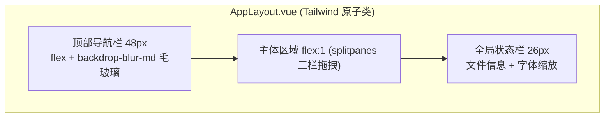

# Hello-Tauri 布局优化设计方案

## 产品概述

对 Hello-Tauri 桌面工具应用的现有四栏布局进行全面现代化优化升级，同时引入 **Tailwind CSS v4.3** 作为统一样式管理方案，取代当前零散的 scoped style 管理模式。方案同时适配 Web 端（`npm run dev`）和 Tauri 桌面端（`npm run tauri:dev`），双平台体验一致。

## 双平台兼容性分析（已验证通过）

### 双平台机制

| 平台 | 命令 | 构建方式 | 渲染方式 |
| --- | --- | --- | --- |
| Web 端 | `npm run dev` | Vite dev server | 浏览器 |
| Tauri 桌面端 | `npm run tauri:dev` | Vite dev server + Tauri WebView | 系统 WebView2 |

- 通过 `VITE_PLATFORM=web|tauri` 环境变量控制平台差异
- `__PLATFORM__` 编译时常量 + `@adapter` 别名切换平台适配器
- Tauri 构建：`tauri:build` → `npm run build`（vue-tsc + vite build）→ 产物输出到 `build/web/`

### Tailwind CSS v4.3 兼容性验证

| 检查项 | 结果 | 说明 |
| --- | --- | --- |
| Tailwind CSS 版本 | **v4.3.2**（最新，2026-06-29） | npm 最新稳定版 |
| Vite 8 兼容性 | **完全兼容** | 自 v4.2.2（2026-03-18）起官方支持 Vite 8 |
| `@tailwindcss/vite` 插件 | **完全兼容** | peer dependency 支持 `vite@^8` |
| Rolldown 兼容性 | **完全兼容** | Vite 插件层透明，构建产物一致 |
| Tauri WebView 兼容性 | **完全兼容** | WebView 渲染标准 HTML/CSS/JS |
| Naive UI 共存 | **完全兼容** | `preflight: false` 禁用 Reset，职责分离 |

**结论：Tailwind CSS v4.3 在 Web 端和 Tauri 桌面端行为完全一致，零特殊适配需求。**

## 核心优化方向

### 1. Tailwind CSS v4.3 引入与样式管理现代化（最高优先级）

**当前痛点**：项目无任何独立 CSS 文件，所有样式 100% 散落在 25+ 个 `.vue` 文件的 `<style scoped>` 中；CSS 变量硬编码在 AppLayout.vue 内；无统一设计 Token；大量重复颜色值/间距值。

**解决方案**：

- 安装 `tailwindcss@^4.3.2` + `@tailwindcss/vite@^4.3.2`
- 创建 `src/styles/main.css`，使用 Tailwind v4 的 `@theme` 指令统一定义设计 Token
- 配置 `preflight: false` 禁用 Tailwind CSS Reset，避免与 Naive UI 样式冲突
- 将现有 40+ 行 CSS 变量从 scoped style 迁移到 `@theme` 块，同时保持 Naive UI theme.ts 同步
- 按优先级渐进式替换：先 AppLayout.vue 布局层（最大收益，约 400 行 CSS → 原子类）→ 再各子组件
- 保留策略：Vue `<Transition>` 动画和复杂组件特定样式仍用 `<style scoped>`

### 2. 顶部导航栏现代化

- 使用 Tailwind 原子类替代手写 CSS
- 精简右侧元素：将 GitHub/Issue 链接合并到"帮助"下拉菜单
- 搜索栏增加 `Ctrl+K` 快捷键提示徽章
- 背景使用 `backdrop-blur-md bg-bg-surface/85` 毛玻璃悬浮效果

### 3. 面板交互增强

- 使用 `splitpanes` 改造三栏布局，支持拖拽调整面板宽度
- 折叠按钮始终可见，hover 时主题色高亮
- 面板折叠动画改用 `transform: translateX(-100%)` + `transition-transform`
- 键盘快捷键：`Ctrl+B` 切换左侧面板，`Ctrl+Shift+B` 切换右侧面板

### 4. 底部状态栏重设计

- 移除 28px 版权栏，空间分配给内容区
- 将 Workspace 内 StatusBar 提升为全局状态栏（26px）
- 增强信息展示：光标位置（行:列）、编码格式、插件名称、文件大小
- 右侧添加字体缩放滑块

### 5. 主题系统增强

- 主题色方案通过 Tailwind `@theme` + CSS 变量管理，四色可选（蓝/绿/紫/橙）
- 深色/浅色双主题通过 `data-theme` 属性切换
- 毛玻璃效果统一使用 `backdrop-blur-md` 类名组合

### 6. 工作区标签页增强

- 标签页支持右键菜单（关闭、关闭其他、关闭右侧、固定/取消固定）
- 标签页溢出时显示滚动箭头，替代挤压变形
- 增加"欢迎页"：无标签页时展示快捷操作入口

## 技术栈

| 依赖 | 版本 | 用途 | 状态 |
| --- | --- | --- | --- |
| Vue | ^3.5.39 | 前端框架 | 已有 |
| TypeScript | ~6.0.0 | 类型系统 | 已有 |
| Naive UI | ^2.44.1 | 组件库 | 已有 |
| Pinia | ^3.0.4 | 状态管理 | 已有 |
| @vueuse/core | ^14.3.0 | useNow, useMagicKeys, useBreakpoints | 已有 |
| splitpanes | ^4.1.2 | 可拖拽分栏布局 | 已有 |
| **tailwindcss** | **^4.3.2** | **原子化 CSS 框架** | **新增** |
| **@tailwindcss/vite** | **^4.3.2** | **Vite 插件，JIT 编译** | **新增** |
| Vite | ^8.1.0 | 构建工具 (Rolldown) | 已有 |

## 实现方案

### Tailwind CSS v4.3 与 Naive UI 共存策略

1. **职责分离**：Tailwind 负责应用层布局/间距/颜色/排版；Naive UI 负责组件内部样式
2. **颜色同步**：`@theme` 中的 `--color-*` 变量与 `src/styles/theme.ts` 中的 Naive UI 主题覆盖保持一致
3. **Reset 隔离**：设置 `preflight: false` 禁用 Tailwind 全局 CSS Reset，避免覆盖 Naive UI 默认样式
4. **类名冲突**：Tailwind 原子类只用于非 Naive UI 组件的 DOM 元素

### 设计 Token 规划

```css
/* src/styles/main.css */
@import "tailwindcss" preflight(false);

@theme {
  --color-primary: #3B82F6;
  --color-primary-soft: color-mix(in srgb, var(--color-primary) 14%, transparent);
  --color-primary-hover: #2563EB;
  --color-bg-base: #18181c;
  --color-bg-surface: #1e1e24;
  --color-bg-elevated: #26262e;
  --color-text-primary: rgba(255,255,255,0.87);
  --color-text-secondary: rgba(255,255,255,0.55);
  --color-border: rgba(255,255,255,0.1);
  --color-border-strong: rgba(255,255,255,0.18);
  --spacing-header: 48px;
  --spacing-statusbar: 26px;
  --spacing-left-panel: 280px;
  --spacing-right-panel: 300px;
  --radius-panel: 8px;
  --radius-card: 6px;
  --radius-button: 6px;
}

[data-theme='light'] {
  --color-bg-base: #f5f5f7;
  --color-bg-surface: #ffffff;
  --color-bg-elevated: #f0f0f3;
  --color-text-primary: #1a1a1a;
  --color-text-secondary: #666666;
  --color-border: rgba(0,0,0,0.06);
  --color-border-strong: rgba(0,0,0,0.12);
}
```

### 样式迁移优先级

| 阶段 | 内容 | 预估减少 CSS 行数 |
| --- | --- | --- |
| 第一阶段 | 安装配置 Tailwind，创建 main.css，定义 @theme Token | 基础设施搭建 |
| 第二阶段 | 重写 AppLayout.vue scoped style → Tailwind 原子类 | ~400 行 → 原子类 |
| 第三阶段 | 迁移子组件（PublicBar、ArchivePanel、Workspace、PropertyPanel） | ~800 行 → 原子类 |
| 保留 | Vue `<Transition>` 动画、splitpanes 覆盖样式、复杂伪类选择器 | ~200 行保留 |

### AppLayout.vue 样式迁移示意

迁移前（scoped style，约 400 行 CSS）：

```css
.app-shell { display: grid; grid-template-rows: 52px 1fr 28px; background: var(--bg-base); ... }
.app-header { display: flex; align-items: center; padding: 0 16px; background: var(--bg-surface); ... }
/* ... 400+ 行 */
```

迁移后（Tailwind 原子类 + 少量 scoped style）：

```html
<div class="absolute inset-0 grid grid-rows-[var(--spacing-header)_1fr_var(--spacing-statusbar)] bg-bg-base text-text-primary overflow-hidden">
  <header class="flex items-center gap-4 px-4 h-header bg-bg-surface/85 backdrop-blur-md border-b border-border z-10 select-none">
    <!-- ... -->
  </header>
</div>
<style scoped>
/* 仅保留 Transition 动画和 splitpanes 覆盖样式 */
.icon-spin-enter-active, .icon-spin-leave-active { transition: transform 0.28s, opacity 0.28s; }
.drop-overlay-enter-active, .drop-overlay-leave-active { transition: opacity 0.2s; }
</style>
```

### 核心技术决策

1. **Tailwind CSS v4.3（非 v3）**：v4 是 CSS-first 配置，无需 `tailwind.config.js`，通过 `@theme` 指令定义 Token，官方支持 Vite 8
2. **面板拖拽**：复用 `splitpanes`，提升到 AppLayout 层级统一管理三栏
3. **动画优化**：`transform: translateX` 替代 `width` transition，避免 Layout thrashing，GPU 加速
4. **时钟优化**：`useNow({ interval: 60000 })` 替代 setInterval，从每秒刷新降为每分钟
5. **状态栏合并**：移除版权栏，Workspace StatusBar 提升为全局状态栏

### 向后兼容保证

- Pinia store 接口不变（`leftPanelWidth`、`rightPanelWidth`、`toggleTheme` 等）
- splitpanes 尺寸变更通过回调同步到 store
- 子面板组件内部逻辑不修改
- `VITE_PLATFORM` / `__PLATFORM__` / `@adapter` 机制完全不受影响

## 架构设计

### 优化后布局结构



### 样式管理架构

```
main.css (@theme 设计 Token)
  ├── 应用层 Tailwind 原子类 (AppLayout + 子组件)
  ├── Naive UI theme.ts (组件主题覆盖，与 @theme 变量同步)
  └── 各组件 <style scoped> (仅 Transition 动画 + 复杂特定样式)
```

## 目录结构

```
src/
├── layout/
│   └── AppLayout.vue                    # [MODIFY] scoped style → Tailwind 原子类，splitpanes 三栏
├── composables/
│   └── use-panel-layout.ts             # [MODIFY] 增加 toggle/toggleRight/splitpanes回调/快捷键
├── stores/
│   └── app.ts                          # [MODIFY] 新增 themeColor 状态
├── config/
│   └── layout.ts                       # [MODIFY] 新增快捷键配置
├── styles/
│   ├── main.css                        # [NEW] Tailwind v4.3 入口，@theme 设计 Token
│   └── theme.ts                        # [MODIFY] 扩展主题色，与 @theme 同步
├── components/
│   ├── public-bar/
│   │   └── PublicBar.vue               # [MODIFY] Tailwind 原子类，Ctrl+K 提示
│   ├── workspace/
│   │   ├── TabBar.vue                  # [MODIFY] 右键菜单、溢出滚动
│   │   ├── StatusBar.vue               # [MODIFY] 提升为全局状态栏，增强信息展示
│   │   └── WelcomePage.vue             # [NEW] 欢迎页（Tailwind 布局）
│   └── property-panel/
│       └── PropertyPanel.vue           # [MODIFY] Tailwind 原子类
├── main.ts                             # [MODIFY] 引入 './styles/main.css'
└── vite.config.ts                      # [MODIFY] 添加 @tailwindcss/vite 插件
```

## 设计风格

采用**现代极简玻璃态风格（Glassmorphism Minimalism）**，通过 Tailwind CSS 原子类实现。强调通透感和层次感，在现有深色/浅色双主题基础上，增加毛玻璃质感、微妙的渐变和精致的阴影层次，打造专业桌面工具的高级感。

## 页面布局设计

### 顶部导航栏 (48px)

- **左侧**：Logo 图标（带发光效果）+ 应用名（渐变色文字）+ 版本徽章（小圆角标签）
- **中央**：全局搜索栏，带有 Ctrl+K 快捷键提示徽章，hover 时边框发光
- **右侧**：精简为时钟（仅时间）+ 帮助菜单（收纳 GitHub/Issue）+ 主题色选择器 + 主题切换按钮
- 背景使用半透明 + backdrop-filter blur，营造悬浮感
- Tailwind: `flex items-center gap-4 px-4 h-header backdrop-blur-md bg-bg-surface/85 border-b border-border`

### 主体三栏区域

- **分隔条**：2px 宽，hover 时高亮为主题色，拖拽时显示引导线
- **左侧面板**：280px 默认宽度，可拖拽 200-400px。面板标题栏使用毛玻璃 sticky 定位
- **中央工作区**：弹性宽度，标签栏使用圆角卡片式标签，溢出时显示滚动箭头
- **右侧面板**：300px 默认宽度，可拖拽 240-500px。信息区块使用卡片式布局，hover 时微升阴影
- 面板折叠按钮：始终可见的 24x48px 按钮，带双箭头图标，hover 时主题色高亮

### 欢迎页（无标签时）

- 居中展示：大图标 + 标题"拖放文件到此处" + 副标题"或点击左侧上传"
- 快捷操作卡片：打开文件、最近文件（如有）、使用帮助
- 背景使用微妙的网格纹理
- Tailwind: `flex flex-col items-center justify-center gap-6`

### 全局状态栏 (26px)

- 左侧：当前文件信息（行数:列数 | 编码 | 插件名）
- 右侧：字体缩放滑块（小号，80px 宽）
- Tailwind: `flex items-center justify-between px-2 h-statusbar border-t border-border`

### 拖放遮罩

- 保持现有设计：居中虚线框 + 上传图标 + 提示文字
- 增强：增加文件类型图标预览区域

### 主题色方案（CSS 变量全局切换）

- 蓝色（默认）：#3B82F6
- 绿色：#10B981
- 紫色：#8B5CF6
- 橙色：#F59E0B
