# 跨平台日志解析工具 — 系统架构设计

## 1. 总体架构

### 1.1 分层架构

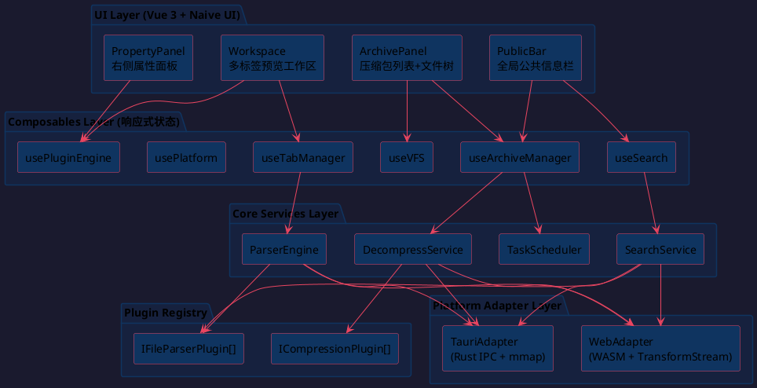

### 1.2 项目目录结构

```
hello-tauri/
├── src/
│   ├── adapters/              # 平台适配层
│   │   ├── types.ts           # IPlatformAdapter 接口定义
│   │   ├── web-adapter.ts     # Web 端实现（WASM）
│   │   └── tauri-adapter.ts   # Tauri 端实现（Rust IPC）
│   ├── plugins/               # 插件系统
│   │   ├── types.ts           # ICompressionPlugin, IFileParserPlugin
│   │   ├── registry.ts        # 插件注册中心
│   │   ├── manifest.ts        # 插件清单（显式注册）
│   │   ├── compression/       # 解压插件
│   │   │   ├── zip-plugin.ts
│   │   │   ├── gzip-plugin.ts
│   │   │   ├── sevenz-plugin.ts
│   │   │   └── rar-plugin.ts
│   │   └── parser/            # 文件解析插件
│   │       ├── text-plugin.ts
│   │       ├── csv-plugin.ts
│   │       ├── json-plugin.ts
│   │       └── xml-plugin.ts
│   ├── core/                  # 核心业务逻辑
│   │   ├── decompress.ts      # 解压调度器
│   │   ├── parser-engine.ts   # 解析调度引擎
│   │   ├── search.ts          # 搜索服务
│   │   ├── file-tree.ts       # 文件树构建与虚拟滚动数据
│   │   └── task-scheduler.ts  # 任务队列与并发控制
│   ├── composables/           # Vue 组合式函数
│   │   ├── use-archives.ts
│   │   ├── use-tabs.ts
│   │   ├── use-plugins.ts
│   │   ├── use-search.ts
│   │   ├── use-platform.ts
│   │   └── use-vfs.ts
│   ├── components/            # UI 组件（基于 Naive UI）
│   │   ├── layout/            # 布局组件
│   │   │   └── AppLayout.vue
│   │   ├── public-bar/        # 顶部公共信息栏
│   │   │   ├── PublicBar.vue
│   │   │   ├── GlobalStats.vue
│   │   │   └── GlobalSearch.vue
│   │   ├── archive-panel/     # 左侧压缩包列表
│   │   │   ├── ArchivePanel.vue
│   │   │   ├── ArchiveCard.vue
│   │   │   └── FileTree.vue
│   │   ├── workspace/         # 中间预览工作区
│   │   │   ├── Workspace.vue
│   │   │   ├── TabBar.vue
│   │   │   ├── PreviewPane.vue
│   │   │   └── SplitView.vue
│   │   ├── property-panel/    # 右侧属性面板
│   │   │   ├── PropertyPanel.vue
│   │   │   └── ConfigForm.vue
│   │   └── shared/            # 通用基础组件
│   │       ├── ErrorBoundary.vue
│   │       └── VirtualScroll.vue
│   ├── stores/                # Pinia 全局状态（极少量）
│   │   └── app.ts
│   ├── styles/
│   │   └── theme.ts           # Naive UI themeOverrides
│   ├── main.ts
│   └── App.vue
├── src-tauri/                 # Rust 后端
│   ├── src/
│   │   ├── main.rs
│   │   ├── commands.rs        # IPC 命令注册
│   │   ├── file_ops.rs        # mmap 文件读取
│   │   └── decompress.rs      # 原生解压
│   └── Cargo.toml
├── public/
├── index.html
├── vite.config.ts
├── tsconfig.json
├── package.json
└── tauri.conf.json
```

## 2. 前端组件库选型

### 2.1 选型结论：Naive UI

| 维度 | Element Plus | Naive UI | Ant Design Vue | Vuetify 3 |
|---|---|---|---|---|
| Stars | ~27.6k | ~18.4k | ~21.6k | ~41k |
| 暗黑主题 | CSS 变量，需手动切换 | JS 主题对象，一行切换 | ConfigProvider | SCSS 变量 |
| 虚拟滚动树 | `el-tree-v2` 内置 | `NTree` 默认虚拟 | v4 支持 | 不支持 |
| 虚拟滚动表格 | `el-table-v2`（仍 Beta） | `NDataTable` 成熟 | v4 支持 | v4 支持 |
| Tree-shaking | 好（有 CSS 副作用） | 最佳（纯 JS，零 CSS） | 一般（Less 依赖） | 好（但体积最大） |
| 包体积 (gzip) | ~289 KB | ~422 KB | ~420 KB | ~4 MB+ |
| TypeScript | 好 | 100% TS，类型完善 | 好 | 好 |
| 维护状态 | 活跃 | 活跃 | 停滞（1.5 年未更新） | 活跃 |

### 2.2 选型理由

| 项目需求 | Naive UI 匹配度 |
|---|---|
| 暗黑主题 | `import { darkTheme } from 'naive-ui'` + `<n-config-provider :theme="darkTheme">` — 零 CSS 配置 |
| 10 万+ 文件树 | `NTree` 默认启用虚拟滚动，原生支持异步加载、自定义渲染、过滤 |
| CSV 大表格 | `NDataTable` 虚拟滚动成熟，列固定/排序/筛选全支持 |
| Tauri EXE 包体积 | 最佳 tree-shaking，纯 JS 主题无 CSS 副作用 |
| 多标签工作区 | `NTabs` 支持 closable/card 模式，拖拽排序通过 `vue-draggable-plus` 扩展 |
| TypeScript 优先 | 100% TS 编写，主题系统类型安全 |

### 2.3 Naive UI 组件使用映射

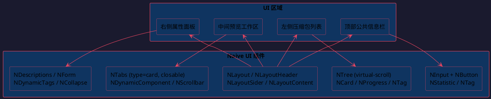

### 2.4 主题配置

```
// styles/theme.ts
import type { GlobalThemeOverrides } from 'naive-ui'

export const themeOverrides: GlobalThemeOverrides = {
  common: {
    primaryColor: '#3B82F6',
    errorColor: '#EF4444',
    warningColor: '#F59E0B',
    successColor: '#10B981',
    fontFamily: 'system-ui, -apple-system, sans-serif',
    fontFamilyMono: '"JetBrains Mono", "Fira Code", monospace',
  }
}
```

### 2.5 辅助依赖

| 库 | 用途 |
|---|---|
| `vue-draggable-plus` | 标签页拖拽排序 |
| `@vueuse/core` | 通用 composable 工具（防抖、响应式断点等） |

## 3. 核心接口设计

### 3.1 IPlatformAdapter — 平台抽象

```
IPlatformAdapter {
  readFile(path: string): Promise<Uint8Array>
  writeFile(path: string, data: Uint8Array): Promise<void>
  listFiles(dir: string): Promise<FileEntry[]>
  getTempDir(): Promise<string>
  decompress(data: Uint8Array, format: string, outputDir: string): Promise<DecompressResult>
  mmapRead(path: string, offset: number, length: number): Promise<Uint8Array>
  streamRead(path: string): ReadableStream<Uint8Array>
}
```

Vite 环境变量 `VITE_PLATFORM=web|tauri` 控制编译期条件导入：

```
// use-platform.ts
const adapter: IPlatformAdapter =
  import.meta.env.VITE_PLATFORM === 'tauri'
    ? new TauriAdapter()
    : new WebAdapter()
```

### 3.2 ICompressionPlugin — 压缩格式插件

```
ICompressionPlugin {
  name: string
  supportedExtensions: string[]
  canHandle(file: FileEntry): boolean
  decompress(data: Uint8Array, outputDir: string): Promise<DecompressResult>
  getProgress?(): Observable<number>
}
```

### 3.3 IFileParserPlugin — 文件解析插件

```
IFileParserPlugin {
  name: string
  supportedExtensions: string[]
  canParse(file: FileEntry): boolean
  parse(data: Uint8Array, options?: any): Promise<ParsedContent>
  getComponent(): Component
  getConfigSchema?(): ConfigSchema
  getSearchAdapter?(): ISearchAdapter
}
```

### 3.4 平台切换编译配置

```
// vite.config.ts
const platform = process.env.VITE_PLATFORM || 'web'

export default defineConfig({
  define: {
    __PLATFORM__: JSON.stringify(platform)
  },
  resolve: {
    alias: {
      '@adapter': platform === 'tauri'
        ? './src/adapters/tauri-adapter'
        : './src/adapters/web-adapter'
    }
  },
  build: {
    rollupOptions: {
      external: platform === 'web'
        ? ['@tauri-apps/api/**']
        : []
    }
  }
})
```

## 4. 插件系统设计

### 4.1 注册中心架构

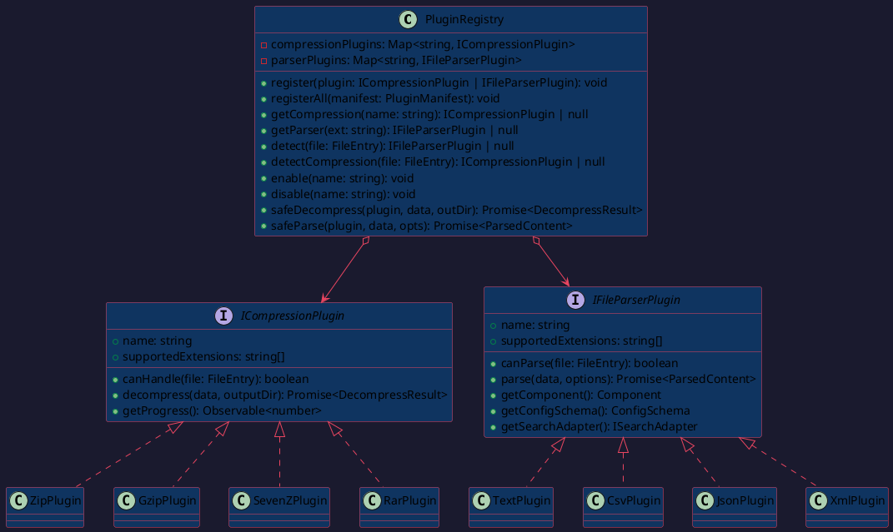

### 4.2 插件注册清单

```
// plugins/manifest.ts
export const compressionManifest: ICompressionPlugin[] = [
  new ZipPlugin(),
  new GzipPlugin(),
  new SevenZPlugin(),
  new RarPlugin(),
]

export const parserManifest: IFileParserPlugin[] = [
  new TextPlugin(),
  new CsvPlugin(),
  new JsonPlugin(),
  new XmlPlugin(),
]
```

`main.ts` 启动时调用 `registry.registerAll(manifest)` 完成初始化。

### 4.3 插件隔离机制

```
async safeDecompress(plugin, data, outputDir): Promise<DecompressResult> {
  try {
    return await Promise.race([
      plugin.decompress(data, outputDir),
      timeout(PLUGIN_TIMEOUT_MS)
    ])
  } catch (err) {
    this.emit('plugin-error', { plugin: plugin.name, err })
    return { success: false, error: err.message, files: [] }
  }
}
```

### 4.4 插件热更新

运行时 `enable(name)` / `disable(name)` 控制插件启禁用，禁用后对应文件回退到默认十六进制查看器。

## 5. 数据流设计

### 5.1 解压流程

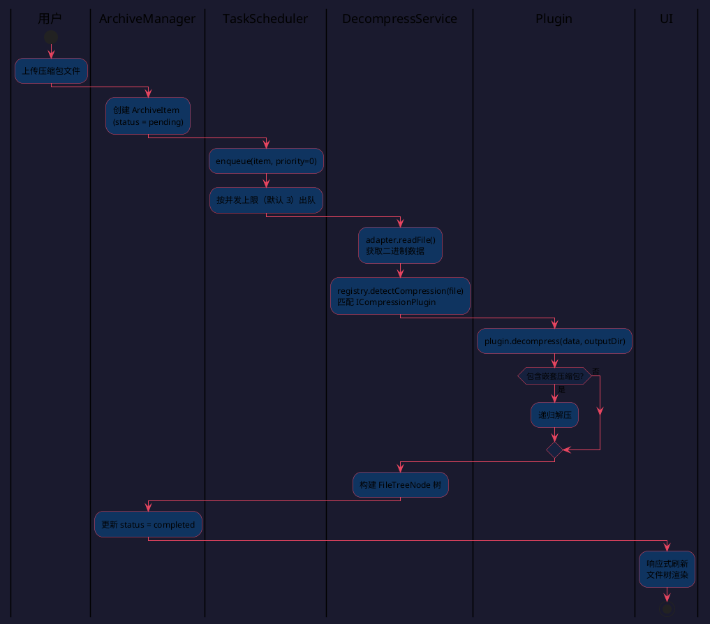

### 5.2 文件预览流程

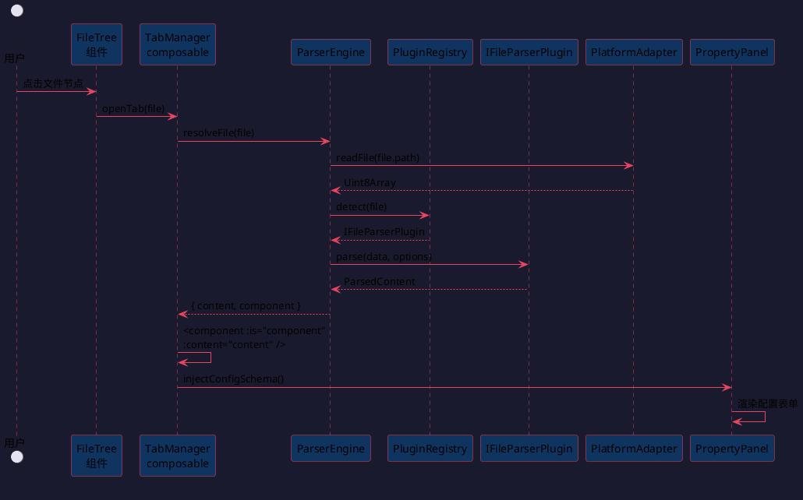

### 5.3 全局搜索流程

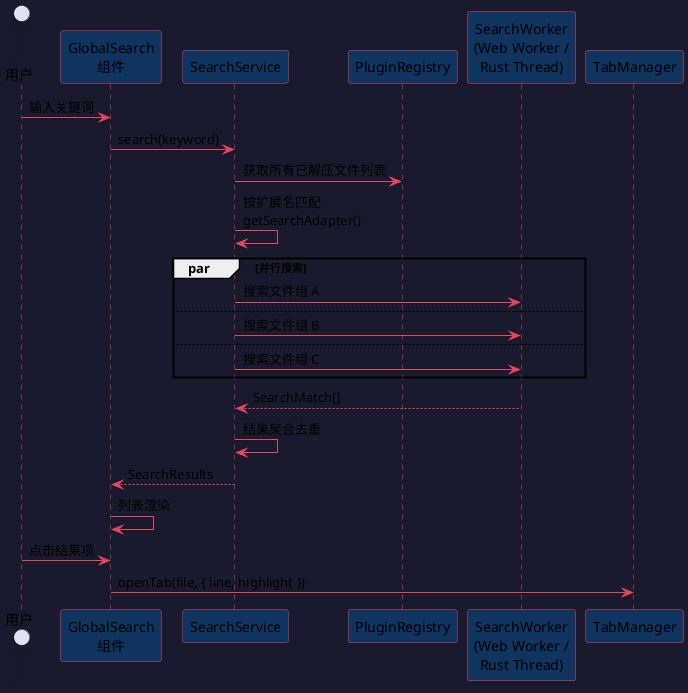

## 6. 4+1 视图

### 6.1 逻辑视图（Logical View）

描述系统的功能分解，面向最终用户需求。

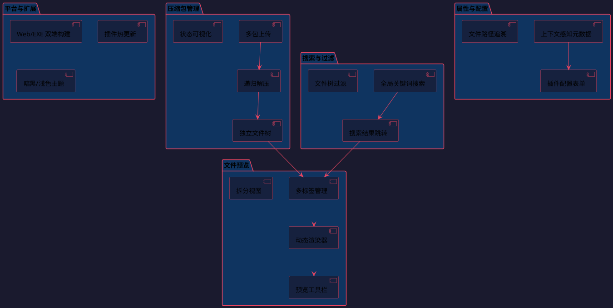

### 6.2 开发视图（Development View）

描述代码组织和模块结构，面向开发者。

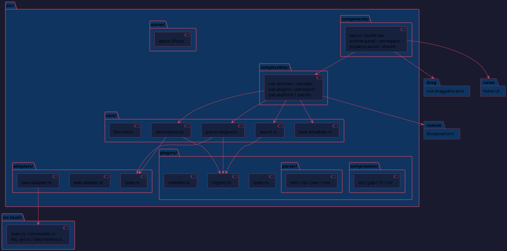

### 6.3 进程视图（Process View）

描述运行时并发和同步，面向性能工程师。

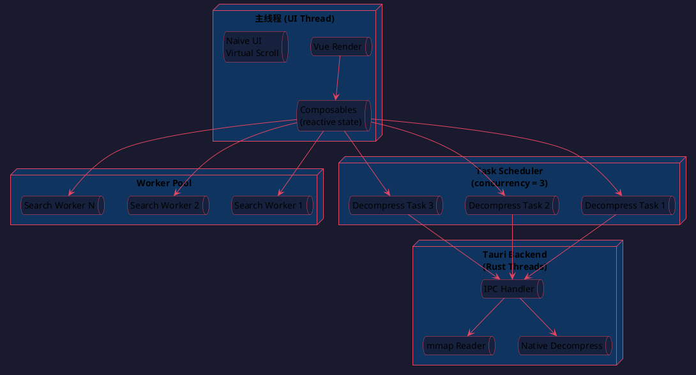

### 6.4 物理视图（Physical View）

描述部署拓扑，面向运维。

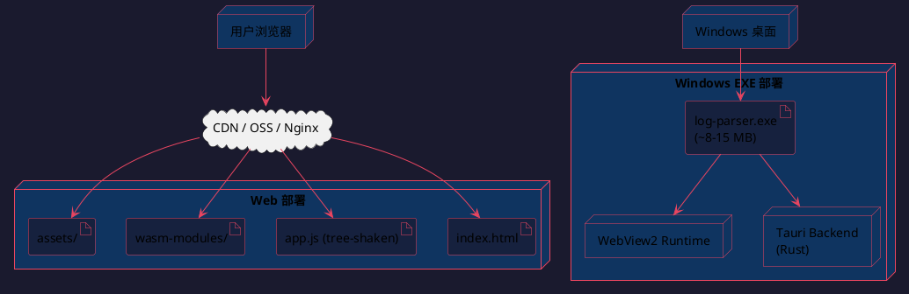

### 6.5 场景视图（Scenarios / Use Cases）

核心用例驱动端到端验证。

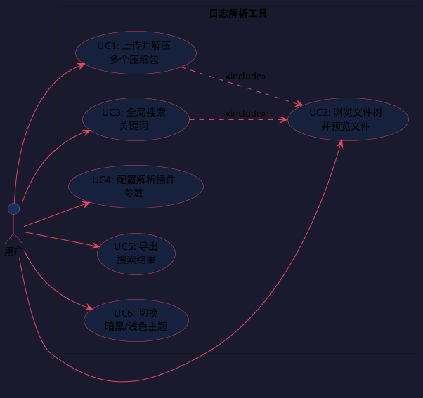

## 7. 关键 Composables 设计

| Composable | 职责 | 核心 API |
|---|---|---|
| `useArchiveManager()` | 管理压缩包生命周期 | `addFiles(files[])`, `remove(id)`, `retry(id)`, `archives` (reactive) |
| `useTabManager()` | 标签页 CRUD | `open(file)`, `close(id)`, `tabs`, `activeTab`, `splitView(id, dir)` |
| `usePluginEngine()` | 插件注册中心封装 | `detect(file)`, `getComponent(file)`, `enable/disable(name)` |
| `useSearch()` | 全局搜索 | `search(keyword)`, `results`, `searching`, `jumpTo(result)` |
| `usePlatform()` | 平台适配器单例 | `adapter: IPlatformAdapter`, `isTauri`, `isWeb` |
| `useVirtualFileSystem()` | VFS 抽象 | `readFile(path)`, `listDir(path)`, `getTree(archiveId)` |

## 8. 状态管理策略

| 状态类型 | 存储位置 | 示例 |
|---|---|---|
| UI 局部状态 | 组件 `ref()` | 下拉菜单展开、输入框内容 |
| 跨组件共享状态 | Composable（模块级 reactive） | 当前激活标签页、选中文件 |
| 全局持久状态 | Pinia store | 主题偏好、插件启禁用、面板布局 |

绝大多数状态通过 Composable 管理，Pinia 仅用于极少量全局持久化配置。

## 9. 错误处理设计

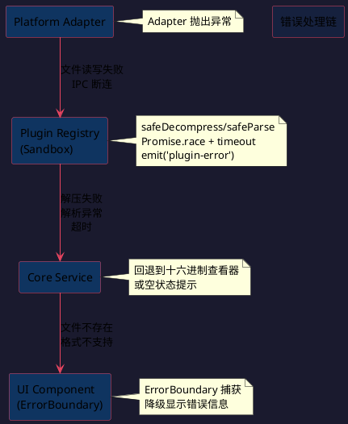

| 层级 | 错误类型 | 处理方式 |
|---|---|---|
| 平台层 | 文件读写失败、IPC 断连 | Adapter 抛出 → Composable 捕获 → 状态标记 error |
| 插件层 | 解压失败、解析异常、超时 | Registry 沙箱捕获 → 插件错误事件 → UI 提示 |
| 业务层 | 文件不存在、格式不支持 | 回退到十六进制查看器或空状态提示 |
| UI 层 | 组件渲染异常 | `ErrorBoundary` 包裹，降级显示错误信息 |

## 10. 测试策略

| 类型 | 覆盖目标 | 工具 |
|---|---|---|
| 单元测试 | Composable 逻辑、工具函数、插件解析 | Vitest |
| 组件测试 | UI 组件渲染与交互 | Vitest + Vue Test Utils |
| 插件测试 | 各插件 canHandle / decompress / parse | Vitest + 测试夹具文件 |
| E2E 测试 | 端到端流程（上传→解压→预览→搜索） | Playwright（Web）|
| 性能测试 | 10 万+ 文件树渲染、大文件虚拟滚动 | 手动基准 + CI 阈值 |

## 11. 构建产物

| 平台 | 命令 | 产物 |
|---|---|---|
| Web | `vite build --mode web` | 静态 HTML/JS/CSS + WASM |
| Windows EXE | `tauri build` | 单文件 .exe (~8-15MB) |
| 开发 | `vite dev` + `tauri dev` | HMR + Rust 热重载 |
