# 跨平台日志解析工具 — 系统架构设计

## 1. 总体架构概览

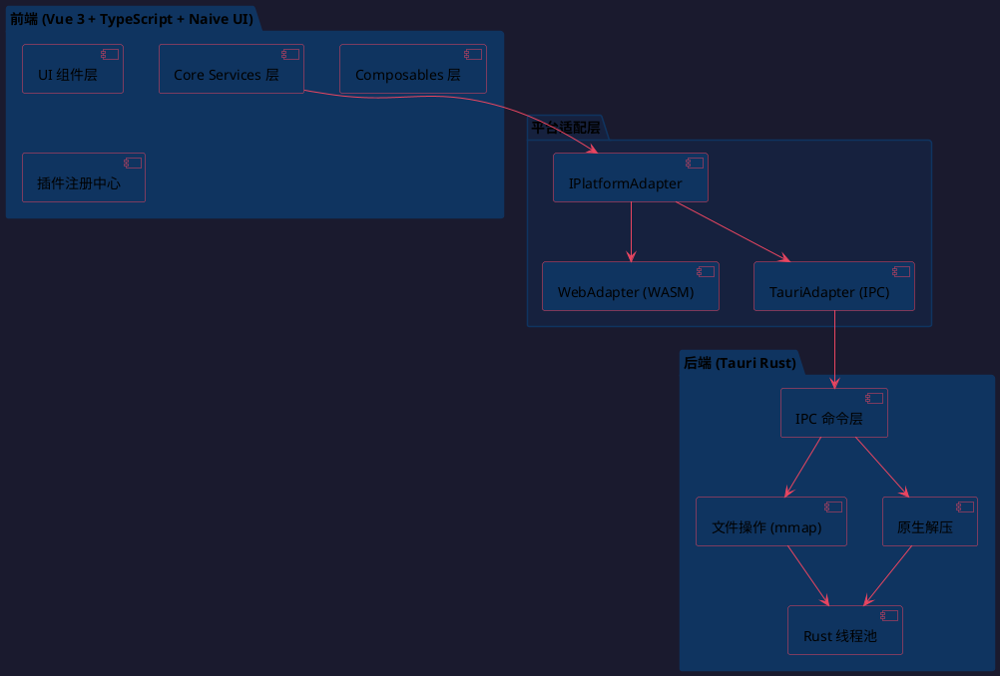

### 1.1 项目目录结构

```
hello-tauri/
├── src/                           # 前端源码
│   ├── adapters/                  # 平台适配层
│   ├── plugins/                   # 插件系统
│   ├── core/                      # 核心业务逻辑
│   ├── composables/               # Vue 组合式函数
│   ├── components/                # UI 组件
│   ├── stores/                    # Pinia 全局状态
│   ├── styles/                    # 主题与样式
│   ├── main.ts
│   └── App.vue
├── src-tauri/                     # Rust 后端
│   ├── src/
│   │   ├── main.rs
│   │   ├── commands.rs
│   │   ├── file_ops.rs
│   │   └── decompress.rs
│   └── Cargo.toml
├── vite.config.ts
├── tsconfig.json
├── package.json
└── tauri.conf.json
```

---

# 2. 前端设计

## 2.1 组件库选型

### 2.1.1 选型结论：Naive UI

| 维度 | Element Plus | Naive UI | Ant Design Vue | Vuetify 3 |
|---|---|---|---|---|
| Stars | ~27.6k | ~18.4k | ~21.6k | ~41k |
| 暗黑主题 | CSS 变量，需手动切换 | JS 主题对象，一行切换 | ConfigProvider | SCSS 变量 |
| 虚拟滚动树 | `el-tree-v2` 内置 | `NTree` 默认虚拟 | v4 支持 | 不支持 |
| 虚拟滚动表格 | `el-table-v2`（仍 Beta） | `NDataTable` 成熟 | v4 支持 | v4 支持 |
| Tree-shaking | 好（有 CSS 副作用） | 最佳（纯 JS，零 CSS） | 一般（Less 依赖） | 好（但体积最大） |
| 包体积 (gzip) | ~289 KB | ~422 KB | ~420 KB | ~4 MB+ |
| TypeScript | 好 | 100% TS，类型完善 | 好 | 好 |
| 维护状态 | 活跃 | 活跃 | 停滞（1.5 年未更新） | 活跃 |

**选型理由**：原生虚拟滚动满足 10 万+ 节点需求；一行代码切换暗黑主题；最佳 tree-shaking 控制 EXE 包体积；100% TypeScript 类型安全。

### 2.1.2 辅助依赖

| 库 | 用途 | 理由 |
|---|---|---|
| `vue-draggable-plus` | 标签页拖拽排序 | 轻量、Vue 3 原生、支持 SortableJS |
| `@vueuse/core` | 通用 composable 工具 | 防抖、节流、响应式断点、鼠标事件等 |
| `splitpanes` | 面板拖拽分隔条 | 轻量、支持水平/垂直拆分 |

### 2.1.3 Naive UI 组件使用映射总表

| UI 区域 | 功能需求 | Naive UI 组件 | 说明 |
|---|---|---|---|
| **全局布局** | 四栏式布局 | `NLayout` + `NLayoutHeader` + `NLayoutSider` + `NLayoutContent` | 嵌套布局，侧栏可折叠 |
| **顶部公共栏 - 统计** | 实时聚合数据 | `NStatistic` + `NTag` + `NSpace` | 总包数/大小/文件数/耗时 |
| **顶部公共栏 - 搜索** | 关键词输入 | `NInput` (search type) + `NButton` | 搜索框 + 按钮 |
| **顶部公共栏 - 批量操作** | 下拉菜单 | `NDropdown` | 清空/导出/重新解压 |
| **左侧 - 压缩包卡片** | 独立卡片容器 | `NCard` + `NCollapse` | 每个压缩包一张卡片 |
| **左侧 - 状态指示** | 状态可视化 | `NTag` (success/info/warning/error) + `NProgress` | 颜色语义化 |
| **左侧 - 文件树** | 虚拟滚动树 | `NTree` (virtual-scroll) | 异步加载、自定义渲染、过滤 |
| **左侧 - 右键菜单** | 上下文菜单 | `NDropdown` (trigger=manual) | 预览/导出/复制路径/元数据 |
| **中间 - 标签栏** | 多标签管理 | `NTabs` (type=card, closable) | 拖拽排序由 vue-draggable-plus 扩展 |
| **中间 - 预览区** | 动态组件渲染 | `NDynamicComponent` + `NScrollbar` | `<component :is>` 挂载插件组件 |
| **中间 - 分屏** | 拆分视图 | `splitpanes` | 左右/上下分屏对比 |
| **中间 - 工具栏** | 预览设置 | `NInputNumber` + `NSwitch` + `NSelect` | 字号/换行/行号/编码 |
| **中间 - CSV 表格** | 大数据表格 | `NDataTable` (virtual-scroll) | 列固定/排序/筛选/表头固定 |
| **中间 - 状态栏** | 性能信息 | `NText` + `NSpace` | 行号/内存/耗时/插件名 |
| **右侧 - 元数据** | 属性展示 | `NDescriptions` + `NDescriptionsItem` | 文件/压缩包级元数据 |
| **右侧 - 配置表单** | 插件配置 | `NForm` + `NFormItem` (动态渲染) | 根据 getConfigSchema 生成 |
| **右侧 - 路径链路** | 嵌套层级 | `NBreadcrumb` + `NBreadcrumbItem` | 压缩包嵌套路径 |
| **通用 - 错误边界** | 异常降级 | 自定义 `ErrorBoundary.vue` | 捕获渲染异常 |
| **通用 - 空状态** | 无数据提示 | `NEmpty` | 无文件/无搜索结果 |
| **通用 - 上传** | 拖拽上传 | `NUpload` (dragger type) | 拖拽高亮边框 |
| **通用 - 通知** | 操作反馈 | `NMessage` + `NNotification` | 成功/失败/进度通知 |
| **通用 - 骨架屏** | 加载态 | `NSkeleton` | 文件树/预览区加载中 |

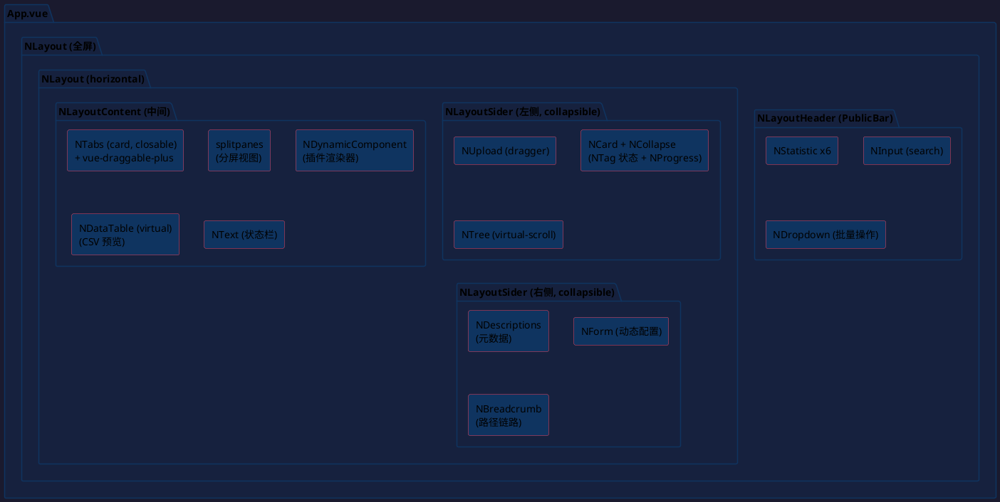

### 2.1.4 主题配置

```
// styles/theme.ts
import type { GlobalThemeOverrides } from 'naive-ui'

export const themeOverrides: GlobalThemeOverrides = {
  common: {
    primaryColor: '#3B82F6',
    errorColor: '#EF4444',
    warningColor: '#F59E0B',
    successColor: '#10B981',
    fontFamily: 'system-ui, -apple-system, sans-serif',
    fontFamilyMono: '"JetBrains Mono", "Fira Code", monospace',
  }
}
```

## 2.2 页面布局设计

### 2.2.1 整体布局结构

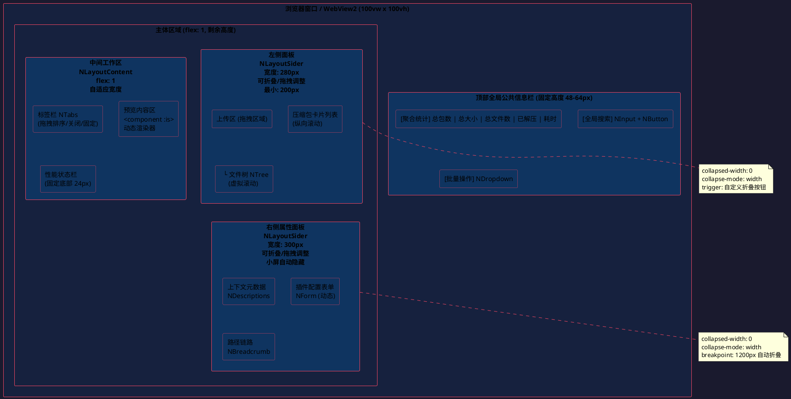

### 2.2.2 左侧面板详细设计

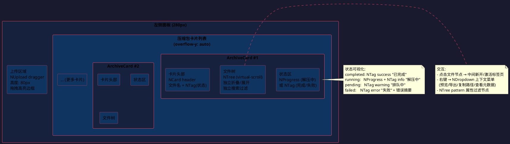

### 2.2.3 中间工作区详细设计

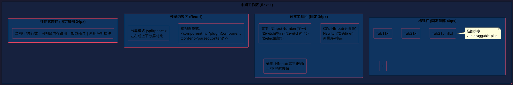

### 2.2.4 右侧属性面板详细设计

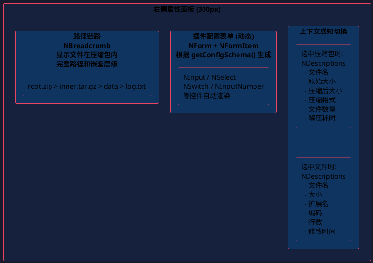

### 2.2.5 响应式行为

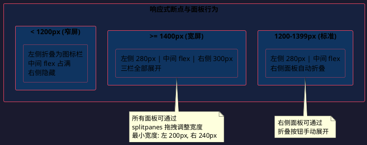

### 2.2.6 视觉与交互规范

| 维度 | 规范 |
|---|---|
| **主题** | 默认深色模式，支持浅色切换；Naive UI `darkTheme` 一键切换 |
| **色彩语义** | ERROR=#EF4444, WARN=#F59E0B, INFO=#3B82F6, SUCCESS=#10B981 |
| **字体** | 预览区使用等宽字体 (JetBrains Mono / Fira Code)，UI 使用系统无衬线字体 |
| **虚拟滚动** | 文件树 (`NTree`) 与预览区均启用，保证 10 万+ 节点/行流畅渲染 |
| **反馈** | 拖拽上传高亮边框；解压进度平滑过渡；搜索匹配高亮闪烁；加载态 `NSkeleton` 骨架屏 |
| **面板交互** | 左右面板可折叠/拖拽调整宽度；小屏自动隐藏右侧面板 |

## 2.3 前端组件树

```plantuml
@startuml
skinparam backgroundColor #1a1a2e
skinparam defaultTextColor #e0e0e0
skinparam componentBackgroundColor #0f3460
skinparam componentBorderColor #e94560
skinparam arrowColor #e94560

component "App.vue" as App

App --> "AppLayout" as Layout

Layout --> "PublicBar" as PB
Layout --> "ArchivePanel" as AP
Layout --> "Workspace" as WS
Layout --> "PropertyPanel" as PP

PB --> "GlobalStats" as GS
PB --> "GlobalSearch" as GSch

AP --> "UploadZone" as UZ
AP --> "ArchiveCard" as AC

AC --> "StatusIndicator" as SI
AC --> "FileTree" as FT

FT --> "TreeNode (NTree)" as TN

WS --> "TabBar" as TB
WS --> "PreviewPane" as PV
WS --> "PreviewToolbar" as PT
WS --> "StatusBar" as SB
WS --> "SplitView" as SV

PV --> "TextRenderer" as TR
PV --> "CsvRenderer" as CR
PV --> "JsonRenderer" as JR
PV --> "HexRenderer" as HR

PP --> "MetadataView" as MV
PP --> "ConfigForm" as CF
PP --> "PathBreadcrumb" as PBr
@enduml
```

## 2.4 前端状态管理

| 状态类型 | 存储位置 | 示例 |
|---|---|---|
| UI 局部状态 | 组件 `ref()` | 下拉菜单展开、输入框内容、面板折叠状态 |
| 跨组件共享状态 | Composable（模块级 reactive） | 当前激活标签页、选中文件、搜索关键词 |
| 全局持久状态 | Pinia store | 主题偏好、插件启禁用、面板宽度 |

### 2.4.1 关键 Composables

| Composable | 职责 | 核心 API |
|---|---|---|
| `useArchiveManager()` | 管理压缩包生命周期 | `addFiles(files[])`, `remove(id)`, `retry(id)`, `archives` |
| `useTabManager()` | 标签页 CRUD | `open(file)`, `close(id)`, `tabs`, `activeTab`, `splitView(id, dir)` |
| `usePluginEngine()` | 插件注册中心封装 | `detect(file)`, `getComponent(file)`, `enable/disable(name)` |
| `useSearch()` | 全局搜索 | `search(keyword)`, `results`, `searching`, `jumpTo(result)` |
| `usePlatform()` | 平台适配器单例 | `adapter`, `isTauri`, `isWeb` |
| `useVirtualFileSystem()` | VFS 抽象 | `readFile(path)`, `listDir(path)`, `getTree(archiveId)` |
| `usePanelLayout()` | 面板布局管理 | `leftWidth`, `rightWidth`, `collapseLeft()`, `collapseRight()` |

## 2.5 前端数据流

### 2.5.1 文件预览调用链

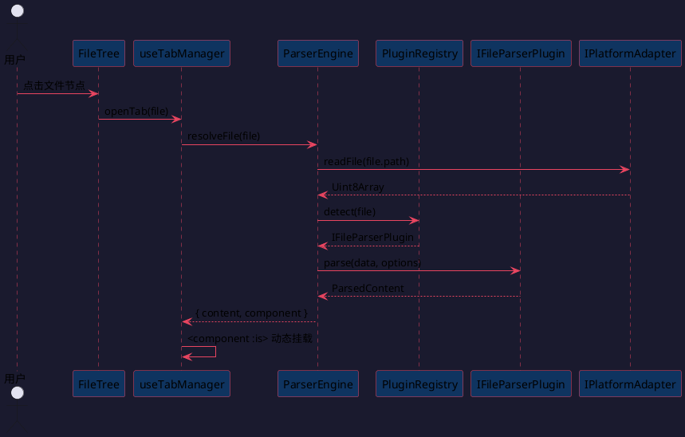

### 2.5.2 全局搜索调用链

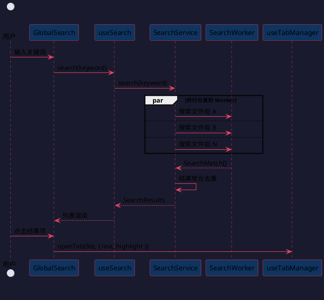

---

# 3. 后端设计

## 3.1 后端整体架构

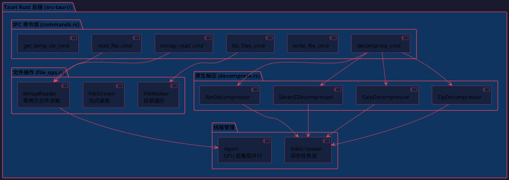

### 3.1.1 Rust 模块结构

```
src-tauri/src/
├── main.rs              # Tauri 入口，注册所有命令
├── commands.rs          # IPC 命令处理函数（#[tauri::command]）
├── file_ops.rs          # mmap 读取、流式读取、目录遍历
├── decompress.rs        # 原生解压实现（zip/gzip/7z/rar）
└── error.rs             # 统一错误类型
```

### 3.1.2 Cargo 依赖

| crate | 用途 |
|---|---|
| `tauri` | 桌面框架核心 |
| `tokio` | 异步运行时 |
| `memmap2` | mmap 零拷贝文件读取 |
| `zip` | ZIP 解压 |
| `flate2` | Gzip 解压 |
| `sevenz-rust` | 7z 解压 |
| `unrar` | RAR 解压 |
| `rayon` | CPU 密集型并行（大文件搜索） |
| `serde` / `serde_json` | 序列化 |

## 3.2 平台适配层设计

### 3.2.1 IPlatformAdapter 接口

```
IPlatformAdapter {
  readFile(path: string): Promise<Uint8Array>
  writeFile(path: string, data: Uint8Array): Promise<void>
  listFiles(dir: string): Promise<FileEntry[]>
  getTempDir(): Promise<string>
  decompress(data: Uint8Array, format: string, outputDir: string): Promise<DecompressResult>
  mmapRead(path: string, offset: number, length: number): Promise<Uint8Array>
  streamRead(path: string): ReadableStream<Uint8Array>
}
```

### 3.2.2 Web 端 vs Tauri 端实现对比

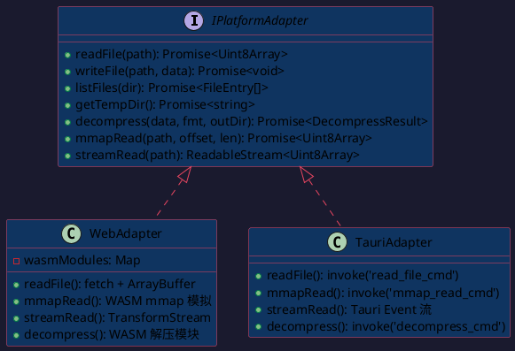

### 3.2.3 编译期平台切换

```
// vite.config.ts
const platform = process.env.VITE_PLATFORM || 'web'

export default defineConfig({
  define: {
    __PLATFORM__: JSON.stringify(platform)
  },
  resolve: {
    alias: {
      '@adapter': platform === 'tauri'
        ? './src/adapters/tauri-adapter'
        : './src/adapters/web-adapter'
    }
  },
  build: {
    rollupOptions: {
      external: platform === 'web' ? ['@tauri-apps/api/**'] : []
    }
  }
})
```

## 3.3 插件系统设计

### 3.3.1 核心接口

```
ICompressionPlugin {
  name: string
  supportedExtensions: string[]
  canHandle(file: FileEntry): boolean   // 魔数检测
  decompress(data: Uint8Array, outputDir: string): Promise<DecompressResult>
  getProgress?(): Observable<number>
}

IFileParserPlugin {
  name: string
  supportedExtensions: string[]
  canParse(file: FileEntry): boolean
  parse(data: Uint8Array, options?: any): Promise<ParsedContent>
  getComponent(): Component
  getConfigSchema?(): ConfigSchema
  getSearchAdapter?(): ISearchAdapter
}
```

### 3.3.2 插件注册中心

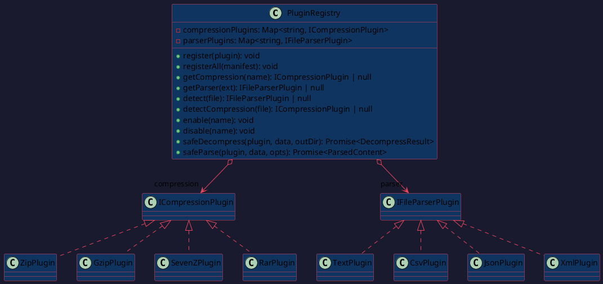

### 3.3.3 插件隔离与安全

```
async safeDecompress(plugin, data, outputDir): Promise<DecompressResult> {
  try {
    return await Promise.race([
      plugin.decompress(data, outputDir),
      timeout(PLUGIN_TIMEOUT_MS)
    ])
  } catch (err) {
    this.emit('plugin-error', { plugin: plugin.name, err })
    return { success: false, error: err.message, files: [] }
  }
}
```

- 每个插件运行在独立作用域，异常不影响核心引擎
- 插件通过白名单 API 访问系统资源
- 支持运行时启用/禁用插件，禁用后回退到默认查看器

### 3.3.4 扩展新插件流程

| 扩展类型 | 步骤 | 核心改动 |
|---|---|---|
| 新增压缩格式 | 1. 新建 TS 模块实现 `ICompressionPlugin` 2. 若需原生能力，编写 WASM/Rust 3. 在 `manifest.ts` 注册 | **核心代码零修改** |
| 新增文件格式 | 1. 新建 Vue 组件作为渲染器 2. 新建 TS 模块实现 `IFileParserPlugin` 3. 可选声明 `getConfigSchema()` 4. 在 `manifest.ts` 注册 | **核心代码零修改** |

## 3.4 核心服务设计

### 3.4.1 解压调度流程

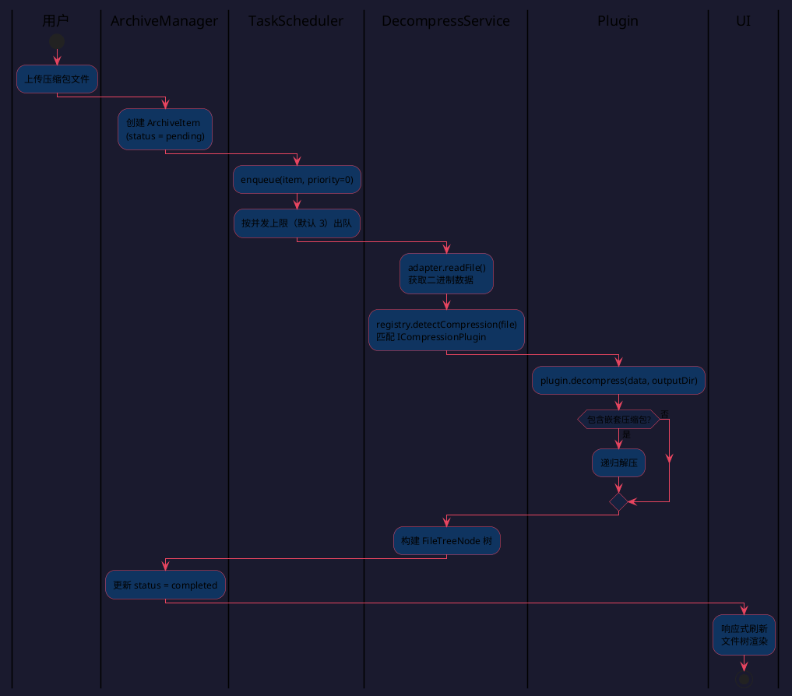

### 3.4.2 TaskScheduler 并发控制

```
TaskScheduler {
  - queue: PriorityQueue<ArchiveItem>
  - running: number (max = 3)
  + enqueue(item, priority): void
  + retry(id): void
  + cancel(id): void
}
```

- 优先级队列，支持优先级调整
- 并发上限默认 3，可配置
- 支持取消和重试

## 3.5 错误处理设计

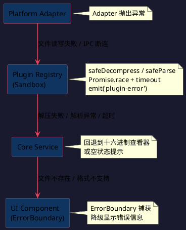

| 层级 | 错误类型 | 处理方式 |
|---|---|---|
| 平台层 | 文件读写失败、IPC 断连 | Adapter 抛出 → Composable 捕获 → 状态标记 error |
| 插件层 | 解压失败、解析异常、超时 | Registry 沙箱捕获 → 插件错误事件 → UI 提示 |
| 业务层 | 文件不存在、格式不支持 | 回退到十六进制查看器或空状态提示 |
| UI 层 | 组件渲染异常 | `ErrorBoundary` 包裹，降级显示错误信息 |

---

# 4. 4+1 架构视图

## 4.1 逻辑视图

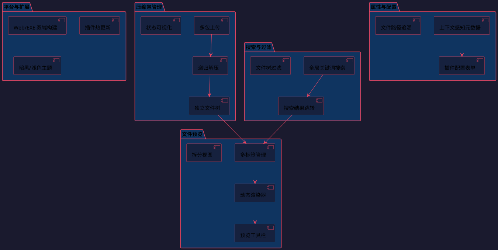

## 4.2 开发视图

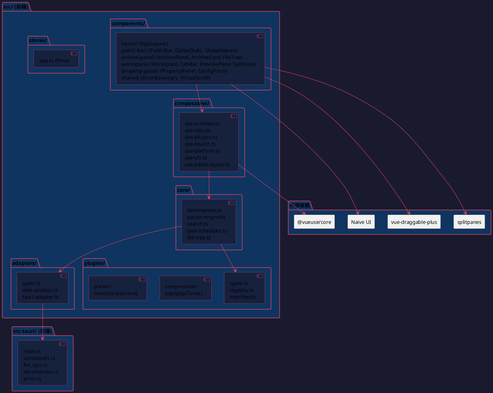

## 4.3 进程视图

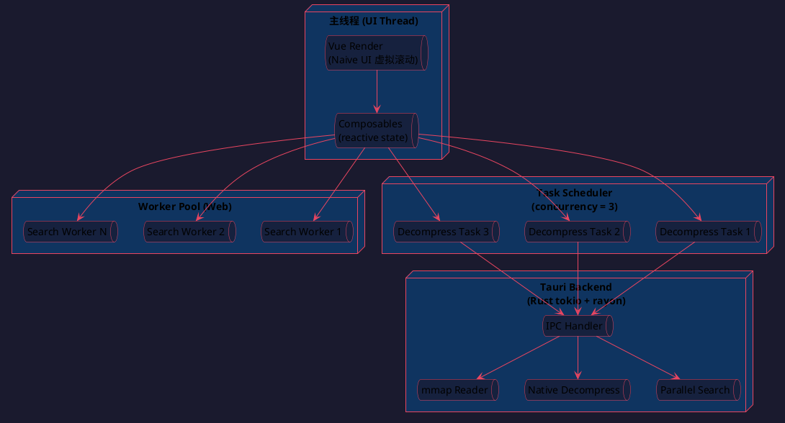

## 4.4 物理视图

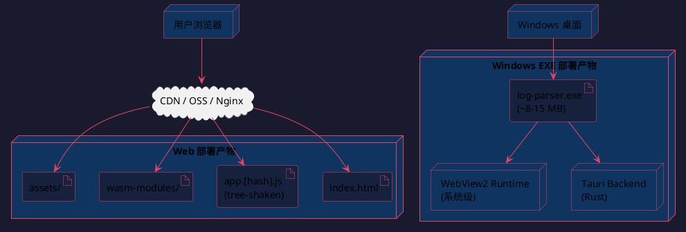

## 4.5 场景视图

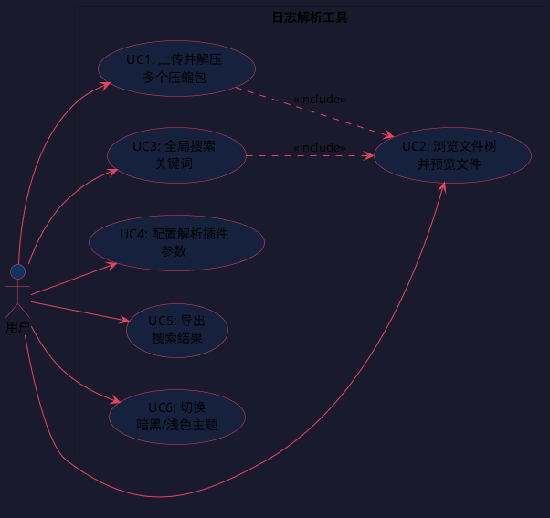

---

# 5. 测试策略

| 类型 | 覆盖目标 | 工具 |
|---|---|---|
| 单元测试 | Composable 逻辑、工具函数、插件解析 | Vitest |
| 组件测试 | UI 组件渲染与交互 | Vitest + Vue Test Utils |
| 插件测试 | 各插件 canHandle / decompress / parse | Vitest + 测试夹具文件 |
| E2E 测试 | 端到端流程（上传→解压→预览→搜索） | Playwright（Web）|
| 性能测试 | 10 万+ 文件树渲染、大文件虚拟滚动 | 手动基准 + CI 阈值 |
| Rust 测试 | 文件操作、解压正确性、IPC 命令 | `cargo test` |

# 6. 构建产物

| 平台 | 命令 | 产物 |
|---|---|---|
| Web | `vite build --mode web` | 静态 HTML/JS/CSS + WASM |
| Windows EXE | `tauri build` | 单文件 .exe (~8-15MB) |
| 开发 | `vite dev` + `tauri dev` | HMR + Rust 热重载 |
